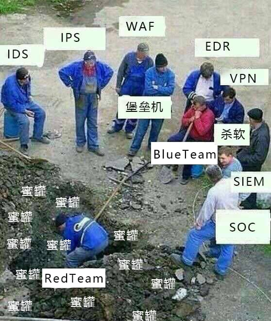
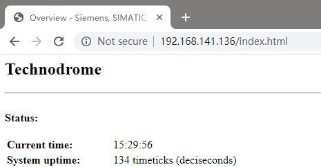

# 安防设施搭建使用

<p align="center">
    
</p>

---

## 免责声明

`本文档仅供学习和研究使用,请勿使用文中的技术源码用于非法用途,任何人造成的任何负面影响,与本人无关.`

---

## 蜜罐
### Conpot

> 一个由 glaslos 等人开发的，用于获得关于工控系统的威胁情报的开源 ICS/SCADA 蜜罐

**项目地址**
- https://github.com/mushorg/conpot

**搭建过程**
```bash
docker pull honeynet/conpot
docker run -it -p 80:8800 -p 102:10201 -p 502:5020 -p 161:16100/udp --network=bridge honeynet/conpot
```

访问 http://IP



**相关文章**
- [工控蜜罐Conpot部署和入门指南](https://www.freebuf.com/sectool/147545.html)

---

### HFish

> HFish 是一款基于 Golang 开发的跨平台多功能主动诱导型开源蜜罐框架系统，为了企业安全防护做出了精心的打造，全程记录黑客攻击手段，实现防护自主化。

**项目地址**
- https://github.com/hacklcx/HFish

**搭建过程**
```
docker pull imdevops/hfish

docker run -d --name hfish -p 21:21 -p 22:22 -p 23:23 -p 69:69 -p 3306:3306 -p 5900:5900 -p 6379:6379 -p 8080:8080 -p 8081:8081 -p 8989:8989 -p 9000:9000 -p 9001:9001 -p 9200:9200 -p 11211:11211 --restart=always imdevops/hfish:latest
```
- 环境变量API_IP的值为 API 的 IP 地址加端口组成。
- 默认帐号密码均为：admin，如需修改可以通过加入-e USERNAME= -e PASSWORD= 传入环境变量进行修改。
- 如需做数据持久化存储，可加参数 -v $PWD:/opt 挂载数据卷到宿主机上，避免容器删除数据丢失。

---

## IDS & IPS

### Snort

- [Snort 笔记](../../安全工具/Snort.md)

---

### Suricata

- [Suricata 笔记](../../安全工具/Suricata.md)
