# 流量分析

<p align="center">
    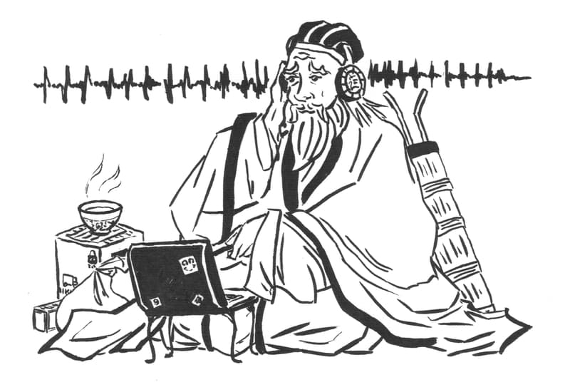
</p>

> 注 : 笔记中流量包 pcapng 源文件在其图片目录下

---

## 免责声明

`本文档仅供学习和研究使用,请勿使用文中的技术源码用于非法用途,任何人造成的任何负面影响,与本人无关.`

---

**相关工具**
- [Wireshark](../../安全工具/Wireshark.md)
- [odedshimon/BruteShark](https://github.com/odedshimon/BruteShark)
- 火绒剑
- [process monitor](https://docs.microsoft.com/en-us/sysinternals/downloads/procmon)
- [科来网络分析系统](http://www.colasoft.com.cn/download.php)
- [NetworkMiner packet analyzer](https://sourceforge.net/projects/networkminer/)
- tcpdump

**相关文章**
- [一次网络流量分析引发的思考](https://www.anquanke.com/post/id/158660) - web 流量分析、VPN 流量分析
- [CTF-流量分析总结](https://jwt1399.top/posts/29176.html)
- [如何通过Wireshark查看HTTPS、HTTP/2网络包（解码TLS、SSL）](https://www.joji.me/zh-cn/blog/walkthrough-decrypt-ssl-tls-traffic-https-and-http2-in-wireshark/)

**CTF writup**
- [记某工控CTF比赛一道ICMP隧道题](https://blog.csdn.net/qq_15174755/article/details/99661676) - 知识点 : ICMP 包数据长度转 ASCII 字符
- [中石油内部CTF比赛流量分析题详细解题思路](https://www.t00ls.net/thread-62296-1-5.html) - 知识点 : 冰蝎流量分析+base64/32+基于时间注入
- [利用DNS进行传输数据](https://www.cnblogs.com/sevck/p/7495910.html)

**Tips**
- `ip contains "flag"`
- 分组字节流 搜索
    - `flag`
    - `f.l.a.g`
    - `f-l-a-g`

---

## ICMP

ping 一下 www.ffffffff0x.com 并抓个 icmp 的包

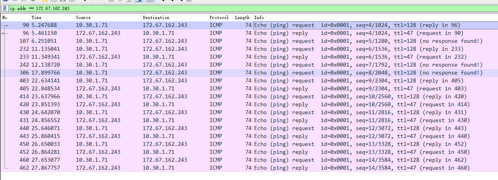

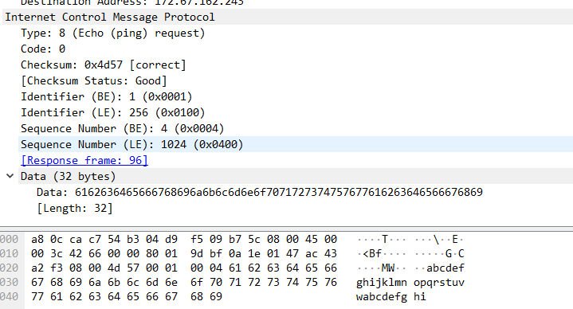

## TCP

### SampleCaptures

下载 [iperf-mptcp-0-0.pcap](https://wiki.wireshark.org/SampleCaptures?action=AttachFile&do=get&target=iperf-mptcp-0-0.pcap)

下载后双击用 wireshark 打开。 编号 534 开始有重传（TCP Retransmition）的包：


Ctrl+Alt+Shift+T,切换跟踪 tcp 流,可以发现,这个连接只有 3 个包


TCP 重传的机制：指数后退，比如第一次等待 1s，第二次等 待 2s，第三次等待 4s，第四次 8s

- 第一个编号 24 的包发出，请求建立连接
- 超过 1s 后，客户端没有收到服务端的 ACK 包，触发客户端 TCP 超时重传，编号 534 的包发出
- 又过了大约 2s，仍然没有收到 ACK 包，再次触发超时重传，编号 1520 的包发出

从这个抓包文件看，这次连接没有建立起来，而直接原因就是 client 没有收到 server 的应答包。

当然仅凭这个无法判断直接原因，还需要在 server 端抓包，查看 server 到底是否发出回包，若发出，说明在链路中未传输到对端。可能是链路中问题。

---

点击 统计 -- 捕获文件属性


查看文件的详细信息，包的数量，被什么封装等等


点击 统计 -- 协议分级,能看到捕获数据中的协议包含层次情况；本捕获文件的最外层协议是 PPP，然后是 IPV4 协议，TCP 协议


点击 统计 -- Conversations,可见 IPv4 和 TCP 的对话情况

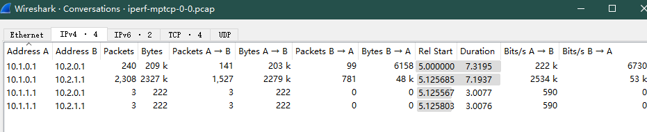

点击 统计 -- 分组长度,不同长度的包的分配情况


点击 统计 -- I/O 图表

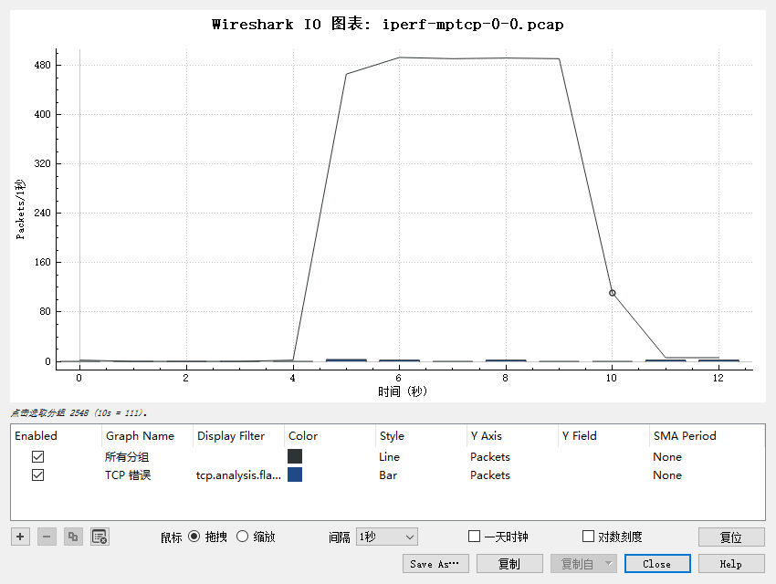

---

## HTTP

下载 https://www.malware-traffic-analysis.net/2014/11/16/2014-11-16-traffic-analysis-exercise.pcap.zip , 密码是 infected

**自动提取通过 http 传输的文件内容**

文件->导出对象->HTTP

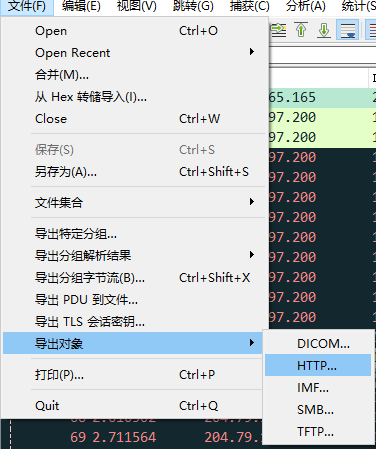

在打开的对象列表中找到有价值的文件，如压缩文件、文本文件、音频文件、图片等，点击 Save 进行保存，或者 Save All 保存所有对象再进入文件夹进行分析。

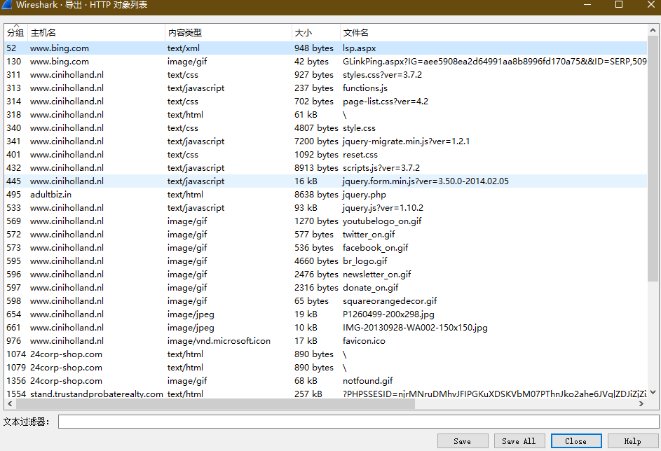

**从数据包导出原始格式的文件**


这里请求了一个 notfound.gif 文件,先追踪其 http 流

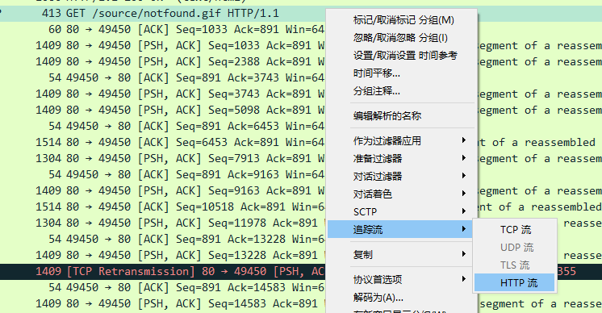

找到响应包


右键选择文件字段导出相应格式


保存为 1.gif,查看文件,导出成功


**导出偏移流量**

鼠标右键点击 - 选中 显示分组字节

在弹出的窗口中设置开始和结束的字节


---

## HTTPS

HTTPS 是在 TCP/IP 与 HTTP 之间，增加一个安全传输层协议，而这个安全传输层协议一般用 SSL 或 TLS，简单讲 HTTPS=HTTP+SSL/TLS。

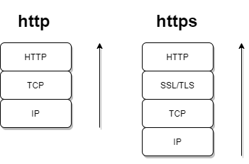

SSL 协议分为 SSL 记录协议层和 SSL 握手协议层。SSL 握手协议建立在 SSL 记录协议之上，用于在实际的数据传输开始前，通讯双方进行身份认证、协商加密算法、交换加密密钥等。SSL 记录协议将数据块进行拆分压缩，计算消息验证码，加密，封装记录头然后进行传输。

### 使用服务器证书的私钥进行解密

> 以下部分内容来自文章 <sup>[[如何通过Wireshark查看HTTPS、HTTP/2网络包（解码TLS、SSL）](https://www.joji.me/zh-cn/blog/walkthrough-decrypt-ssl-tls-traffic-https-and-http2-in-wireshark/)]</sup>

在服务器上导出证书私钥,这里拿 IIS 服务器举例

打开 IIS 站点所绑定的服务器证书，点击查看 `详细信息` 页，点击 `复制到文件`。

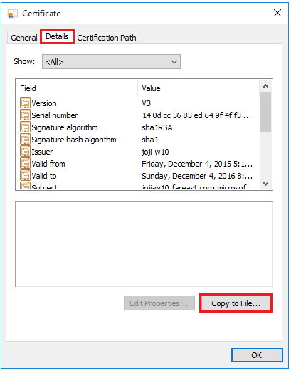

向导中点击下一步，当询问是否导出私钥时选择 `是`，导出私钥，点击 `下一步` 继续。

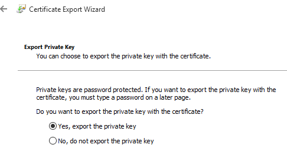

选择 `个人信息交换（.PFX）`，下面的三个复选框不用勾选，点击 `下一步` 继续。

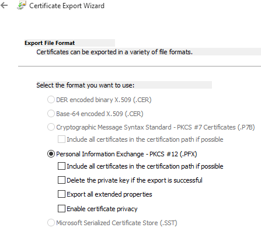

勾选 ` 密码 `，设置一个密码，点击 ` 下一步 ` 继续，导出 PFX 文件。

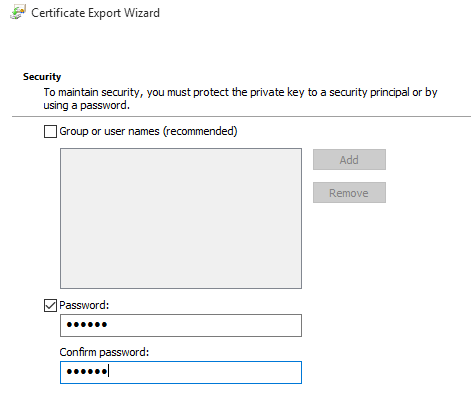

有了 PFX 私钥文件，接下来就可以通过 Wireshark 设置使用该私钥来解码 SSL、TLS 网络包了。这一步既可以在服务器上的 Wireshark 中设置，也可以在客户端的 Wireshark 中设置，取决于你想在哪一端查看（抓取）网络包。

在 Wireshark 中, 菜单栏 Edit——Preferences——Protocols——TLS(老的版本是选择 SSL)，点击 Edit 按钮编辑 RSA key lists。

配置如下：
- IP address：目标服务器的 IP 地址，也可以填写 "any" 应用到所有 IP 地址。
- Port：HTTPS 端口号，一般均为："443"。
- Protocol：填写 "http"。
- Key File：选取刚才导出的服务器证书私钥（PFX 文件）。
- Password：输入服务器证书私钥的密码。

设置完成后，当前正在查看的网络包或将来抓取的网络包就会以设定的规则解码了。

- 优点 :
    - 可以从客户端或服务器端使用。
    - 支持各种浏览器。

- 缺点 :
    - 需要有权访问服务器证书。
    - 不支持 Diffie-Hellman 密码。

**禁用 Diffie-Hellman**

如果网络包依然无法被解码，那么很有可能是因为服务器和客户端之间使用了 Diffie-Hellman 加密算法。

如果在 SSL、TLS 握手过程中发现服务器返回的 Server Hello 所选择的加密算法带有 "ECDHE" 和 "DHE" 关键字，那就说明当前 SSL Session 使用了 Diffie-Hellman 加密算法。

使用了 Diffie-Hellman 的 TLS Session Key 会用一个动态产生的密钥对进行加密，而不是使用证书的公钥加密，所以 Wireshark 依然无法解码 TLS 网络包。解决方案就是：禁用客户端或服务器的 Diffie-Hellman 加密算法，建议禁用客户端的 Diffie-Hellman 加密算法仅供网络包分析，这样依然可以保持网站服务器的安全性。

以下是从 Windows 客户端禁用三种不同浏览器 Diffie-Hellman 加密算法的方法以及禁用 IIS 服务器 Diffie-Hellman 加密算法，只要任选其一保证 SSL Session 不使用 Diffie-Hellman 加密算法即可。

- 禁用 Internet Explorer 的 Diffie-Hellman 加密算法

    运行 `gpedit.msc` 打开本地组策略编辑器。

    编辑设置：计算机配置 -> 管理模板 -> 网络 -> SSL 配置设置 -> SSL 密码套件顺序。

    启用该设置后，复制文本框中的默认值到写字板或编辑器中。

    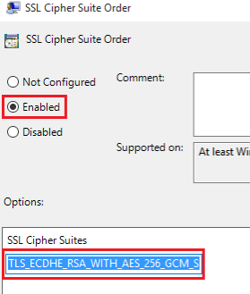

    删除所有带 "ECDHE" 和 "DHE" 的算法，请保持所有的文本都在一行里。

    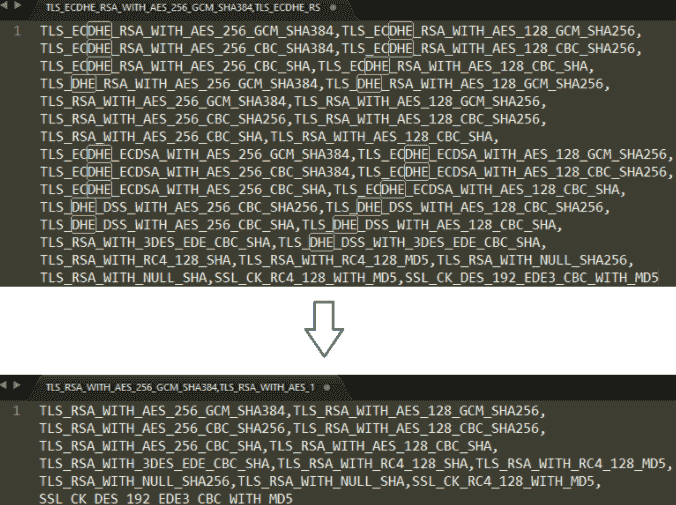

    将修改后的值替换原有的默认值，点击确定后保存，重启计算机。

    重启后，再次抓包发现 IE 发出的 Client Hello 中已经不包含任何 Diffie-Hellman 加密算法了，并且 Wireshark 已经能成功将 TLS、SSL 网络包解码。

- 禁用 Chrome 的 Diffie-Hellman 加密算法

    查看默认 Chrome 发出的 Client Hello 包中所包含的 Cipher Suites 列表。
    ```
    Cipher Suites (15 suites)
     Cipher Suite: TLS_ECDHE_ECDSA_WITH_AES_128_GCM_SHA256 (0xc02b)
     Cipher Suite: TLS_ECDHE_RSA_WITH_AES_128_GCM_SHA256 (0xc02f)
     Cipher Suite: TLS_DHE_RSA_WITH_AES_128_GCM_SHA256 (0x009e)
     Cipher Suite: TLS_ECDHE_ECDSA_WITH_CHACHA20_POLY1305_SHA256 (0xcc14)
     Cipher Suite: TLS_ECDHE_RSA_WITH_CHACHA20_POLY1305_SHA256 (0xcc13)
     Cipher Suite: TLS_ECDHE_ECDSA_WITH_AES_256_CBC_SHA (0xc00a)
     Cipher Suite: TLS_ECDHE_RSA_WITH_AES_256_CBC_SHA (0xc014)
     Cipher Suite: TLS_DHE_RSA_WITH_AES_256_CBC_SHA (0x0039)
     Cipher Suite: TLS_ECDHE_ECDSA_WITH_AES_128_CBC_SHA (0xc009)
     Cipher Suite: TLS_ECDHE_RSA_WITH_AES_128_CBC_SHA (0xc013)
     Cipher Suite: TLS_DHE_RSA_WITH_AES_128_CBC_SHA (0x0033)
     Cipher Suite: TLS_RSA_WITH_AES_128_GCM_SHA256 (0x009c)
     Cipher Suite: TLS_RSA_WITH_AES_256_CBC_SHA (0x0035)
     Cipher Suite: TLS_RSA_WITH_AES_128_CBC_SHA (0x002f)
     Cipher Suite: TLS_RSA_WITH_3DES_EDE_CBC_SHA (0x000a)
    ```

    将所有带 "ECDHE" 和 "DHE" 的算法的十六进制表达连接成字符串赋给 "--cipher-suite-blacklist" 参数，在启动 Chrome 时添加这个参数。如：
    ```
    c:\Program Files (x86)\Google\chrome\Application\chrome.exe --cipher-suite-blacklist=0xc02b,0xc02f,0x009e,0xcc14,0xcc13,0xc00a,0xc014,0x0039,0xc009,0xc013,0x0033
    ```

    启动后，再次抓包可以看到 Chrome 发出的 Client Hello 包中已经不包含任何 Diffie-Hellman 加密算法了。
    ```
    Cipher Suites (4 suites)
        Cipher Suite: TLS_RSA_WITH_AES_128_GCM_SHA256 (0x009c)
        Cipher Suite: TLS_RSA_WITH_AES_256_CBC_SHA (0x0035)
        Cipher Suite: TLS_RSA_WITH_AES_128_CBC_SHA (0x002f)
        Cipher Suite: TLS_RSA_WITH_3DES_EDE_CBC_SHA (0x000a)
    ```

- 禁用 Firefox 的 Diffie-Hellman 加密算法

    打开 Firefox，地址栏输入 "about:config"，搜索 "dhe"，双击搜到的所有 Diffie-Hellman 算法将其 Value 值改为 false， 重启 Firefox 即可生效。

    

---

### 使用 SSLKEYLOGFILE

在 wireshark 中可以通过浏览器保存的 TLS 会话中使用的对称密钥来进行数据解密。在浏览器接收到数据之后，会使用秘钥对数据进行解密，部分浏览器会在某个地方会存储这个密钥，我们只要获取浏览器中的会话密钥就能解密数据。

设置一个称为 SSLKEYLOGFILE 的环境变量，该变量指向可写文本文件。Chrome 和 Firefox 启动时会查找该变量。如果存在，浏览器会将用于生成 TLS 会话密钥的值写到该文件中。我们可以配置 Wireshark 读取此文件以解密 SSL / TLS 数据包。

以 windows 系统 + Chrome 浏览器为例，首先要导出浏览器存储的密钥，通过计算机属性——高级系统设置——环境变量，新建一个变量名 “SSLKEYLOGFILE” 的变量，变量值是导出的密钥具体文件地址，将其指向可写文本文件，启动 Chrome 或 Firefox 时可以自动生成文本文件。

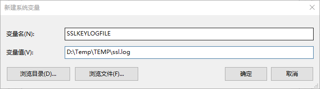

设置后可以通过 Chrome 浏览器打开任意一个 HTTPS 网址，此时查看变量值对应路径，已经生成 sslkey.log。

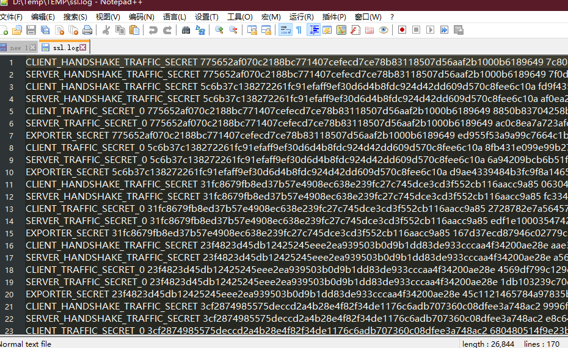

在 Wireshark 中导入,菜单栏Edit——Preferences——Protocols——TLS(老的版本是选择 SSL)

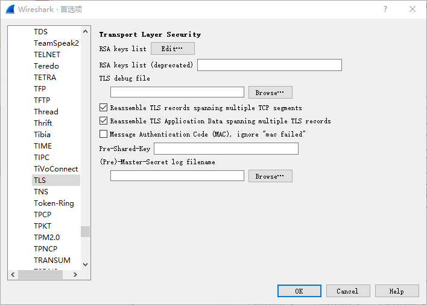

在 (Pre)-Master-Secretlog filename 中选择刚才设置的变量值。

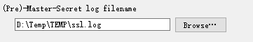

配置完成，看下效果：

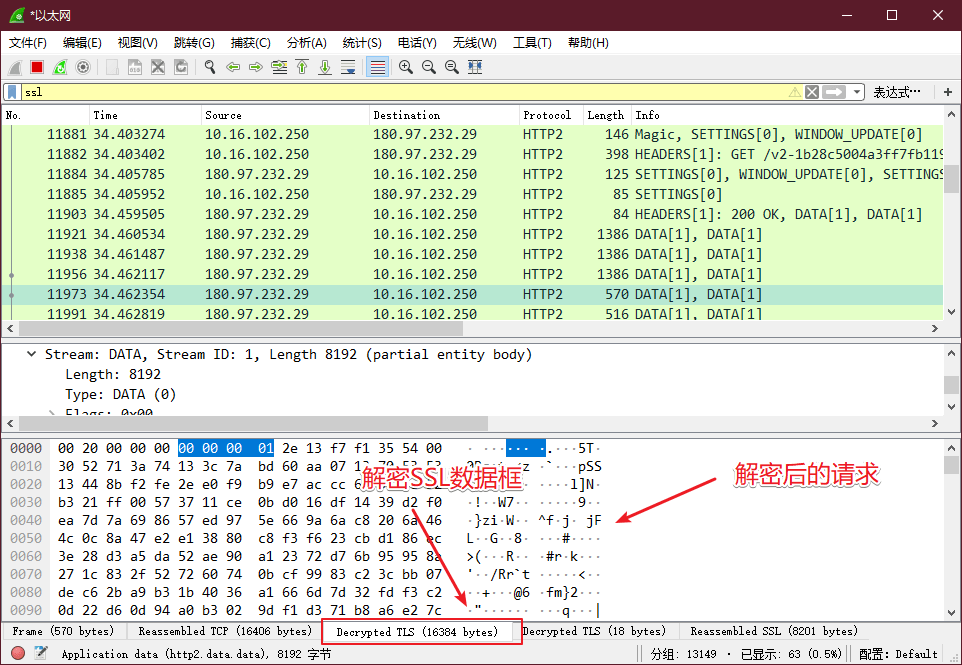

和 HTTP 一样,可以追踪 TLS 流

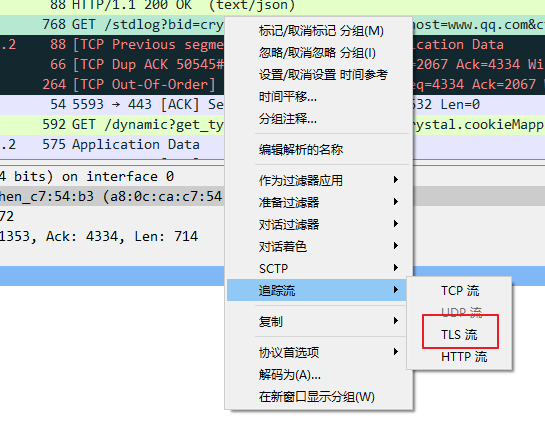

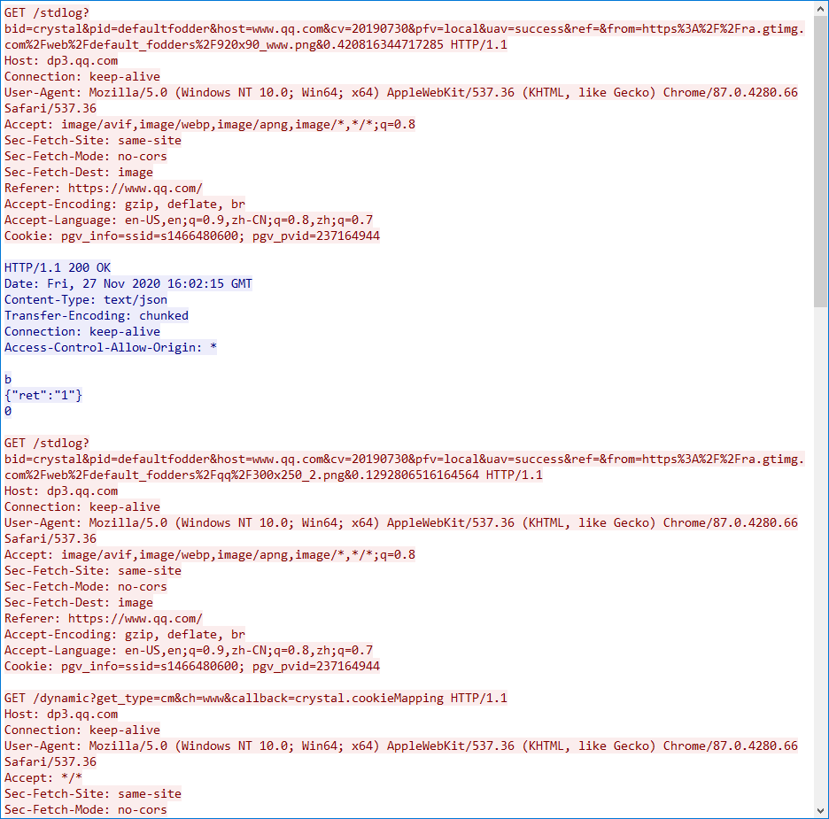

- 优点 :
    - 支持 Diffie-Hellman 密码。
    - 无需访问服务器证书。

- 缺点 :
    - 只能从客户端使用。
    - 仅支持 Chrome 和 Firefox。

---

## Windows

### NTLM-工作组

192.168.141.1(WIN10)——>192.168.141.139(WIN2008)


查看第一个数据包协商


查看第二个数据包质询,获得 Challenge


查看第三个数据包身份验证,其中可以获得客户端加密后的 Challenge


- username（要访问服务器的用户名）：Administrator
- domain（访问者主机名或者 ip）：DESKTOP-QKM4NK7
- challenge（数据包 2 中服务器返回的 challenge 值）：18f77b6fe9f8d876
- HMAC-MD5（数据包 3 中的 NTProofStr）: 0ecfccd87d3bdb81713dc8c07e6705b6
- blob（blob 对应数据为 NTLMv2 Response 开头去掉 NTProofStr 的后半部分）：01010000000000002a470d3bc233d6017eb1f527b5e7bd4d0000000002001e00570049004e002d0041003500470050004400430050004a0037004f00540001001e00570049004e002d0041003500470050004400430050004a0037004f00540004001e00570049004e002d0041003500470050004400430050004a0037004f00540003001e00570049004e002d0041003500470050004400430050004a0037004f005400070008002a470d3bc233d601060004000200000008003000300000000000000001000000002000003737fbe7dbcbd2c8e5d7a030f44586c91423d9c5202f827f3f6cf26f69adbfe80a001000000000000000000000000000000000000900280063006900660073002f003100390032002e003100360038002e003100340031002e003100330039000000000000000000

所以构造，Net-NTLM v2 Hash 值为：
```
Administrator::DESKTOP-QKM4NK7:18f77b6fe9f8d876:0ecfccd87d3bdb81713dc8c07e6705b6:01010000000000002a470d3bc233d6017eb1f527b5e7bd4d0000000002001e00570049004e002d0041003500470050004400430050004a0037004f00540001001e00570049004e002d0041003500470050004400430050004a0037004f00540004001e00570049004e002d0041003500470050004400430050004a0037004f00540003001e00570049004e002d0041003500470050004400430050004a0037004f005400070008002a470d3bc233d601060004000200000008003000300000000000000001000000002000003737fbe7dbcbd2c8e5d7a030f44586c91423d9c5202f827f3f6cf26f69adbfe80a001000000000000000000000000000000000000900280063006900660073002f003100390032002e003100360038002e003100340031002e003100330039000000000000000000
```

---

### NTLM-域

192.168.141.140(WIN2008)——>192.168.141.135(WIN2008)

域控 : 192.168.141.139

FQDN : ffffffff0x.com

账号密码 : Administrator  Abcd1234


---

## ICS

**相关文章**
- [使用Wireshark分析工控协议](http://plcscan.org/blog/2015/11/using-the-wireshark-analysis-ics-protocol/)

### S7Comm

**s7comm_downloading_block_db1**

下载 [SampleCaptures/s7comm_downloading_block_db1.pcap](https://wiki.wireshark.org/SampleCaptures?action=AttachFile&do=get&target=s7comm_downloading_block_db1.pcap)

下载后双击用 wireshark 打开。

*COTP Connection Packet*
- COTP 连接请求包

    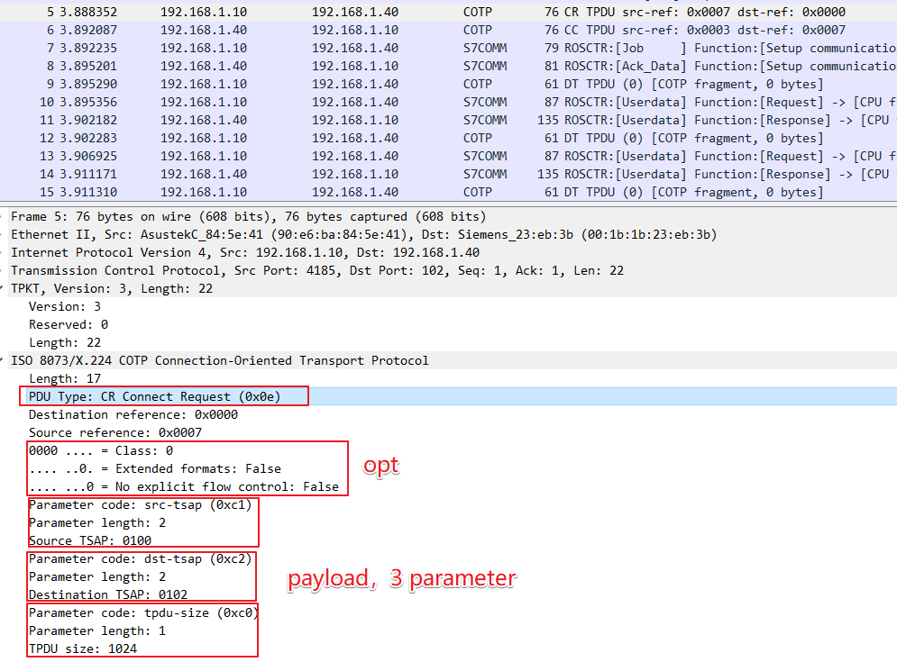

- COTP 请求确认包

    

*COTP Fuction Packet*
- 数据传输包

    

*S7Comm*
- S7Comm Header

    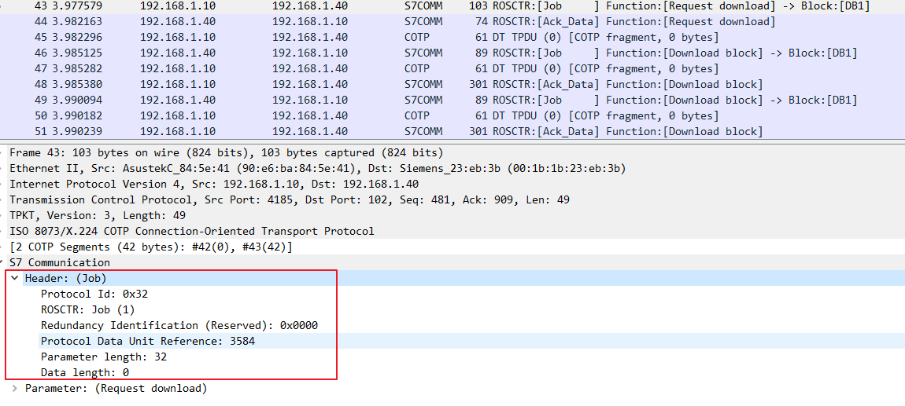

    其中最重要的字段就是 ROSCTR，它决定了后续参数的结构

    在响应数据包中，还有可能存在错误信息

    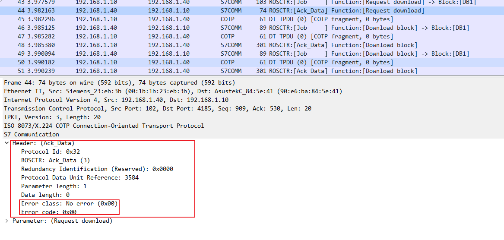

    可见图中的错误类型就是 No error

- Parameter

    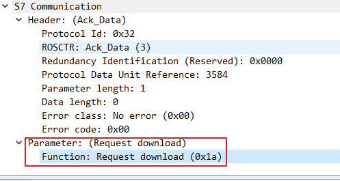

- 建立通信（Setup communication [0xF0]）

    - 请求

        

    - 响应

        

    其协商结果为：ACK 队列的大小为 1；最大 PDU 长度为 240。

- 请求下载（Request download [0x1A]）

    - 请求

        

        如图所示，文件标识是 _ (Complete Module)，块类型为 0B，块的编号为 00001，目标块的文件系统是 P (Passive (copied, but not chained) module)，所以文件名为 _0A00001P。

    - 响应

        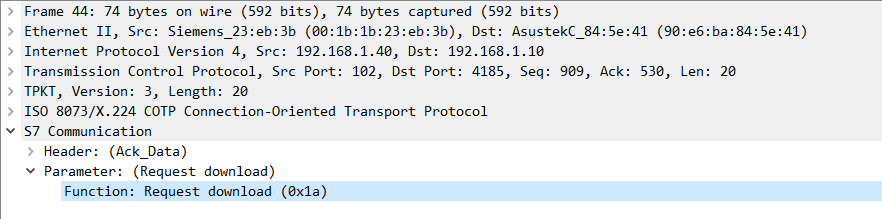

- 下载块（Download block [0x1B]）

    - 请求

        

    - 响应

        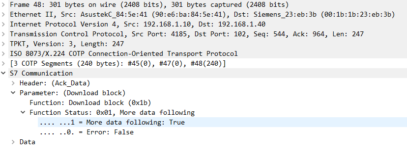

- 下载结束（Download ended [0x1C]）

    - 请求

        

    - 响应

        

- 程序调用服务（PI service [0x28]）

    - 请求

        

    - 响应

        

**snap7_s300_everything**

下载 [ICS-Security-Tools/pcaps/s7/snap7_s300_everything.pcapng](https://github.com/ITI/ICS-Security-Tools/blob/master/pcaps/s7/snap7_s300_everything.pcapng)

*S7Comm*

- 开始上传（Start upload [0x1D]）

    - 请求

        

    - 响应

        

- 上传（Upload [0x1E]）

    - 请求

        

    - 响应

        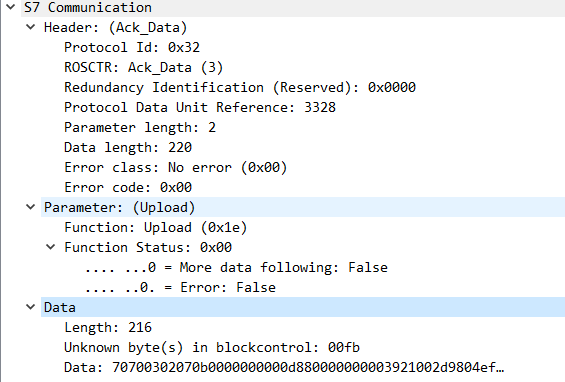

- 上传结束（End upload [0x1F]）

    - 请求

        

    - 响应

        

**s7comm_varservice_libnodavedemo**

下载 [SampleCaptures/s7comm_varservice_libnodavedemo.pcap](https://wiki.wireshark.org/SampleCaptures?action=AttachFile&do=get&target=s7comm_varservice_libnodavedemo.pcap)

下载后双击用 wireshark 打开。

*S7Comm*
- 读取值（Read Var [0x04]）

    - 读值操作的作业请求

        

    - 响应

        

- 写入值（Write Var [0x05]）

    - 向地址为 0×000020 的 Flags（M）写入 0×0103 的作业请求

        

    - 向地址为 0×000020 的 Flags（M）写入 0×0103 的确认响应

        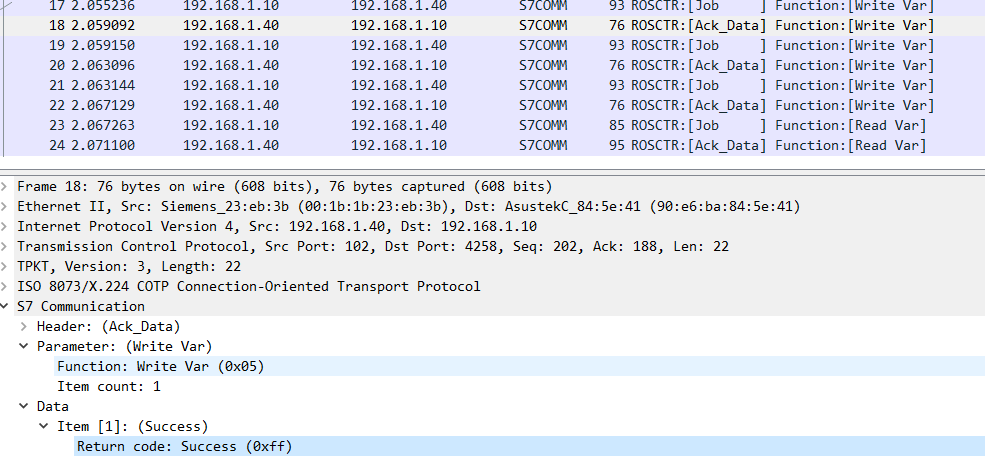

    图中的 item1，说明向地址为 0×000020 的Flags（M）写入 0×0103 成功！

**PLC STOP [0x29]**

192.168.141.1(WIN10)——>192.168.141.128(WIN2019)

snap7 client --> snap7 server

- 请求

    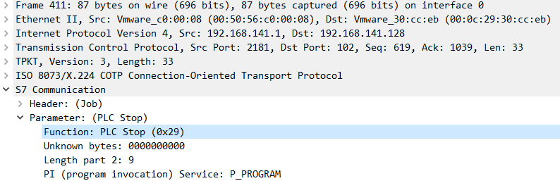

- 响应

    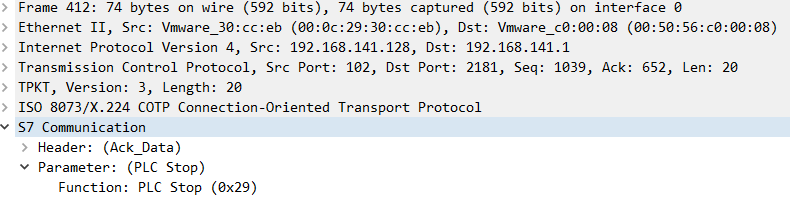

**Userdata 协议拓展**

192.168.100.56(WIN10)——>192.168.100.56(WIN10)

snap7 client --> snap7 server

*S7Comm*
- 块功能（Block functions [0x3]）

    - 列举所有块（List blocks）
        - 请求

            

        - 响应

            

    - 列举块类型（List blocks of type）
        - 请求

            

        - 响应

            

    - 读取模块的信息（Get block info）
        - 请求

            

- CPU功能（CPU functions [0x4]）

    - 系统状态列表（SZL）
        - 请求

            

        - 响应

            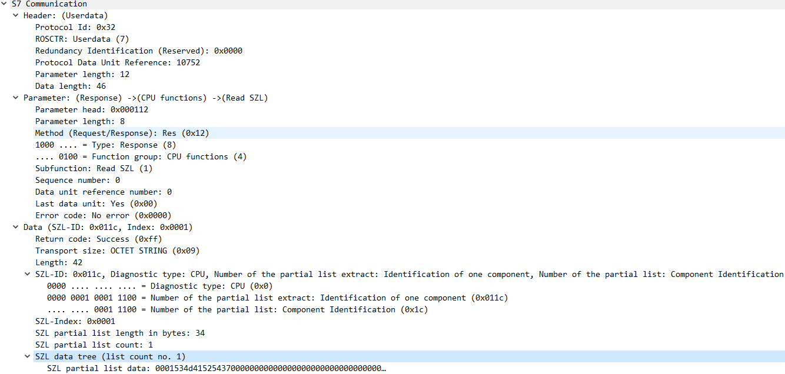

- 安全功能（Security [0x5]）

    - PLC密码（PLC password）

        

        - 请求

            

            Data 是 64 67 02 06 62 65 17 10
            - 第 1 位：0x64 ^ 0x55 = 0x31，则值是‘1’；
            - 第 2 位：0x67 ^ 0x55 = 0x32，则值是‘2’；
            - 第 3 位：0x02 ^ 0x55 ^ 0x64 = 0x33，则值是‘3’；
            - 第 4 位：0x06 ^ 0x55 ^ 0x67 = 0x34，则值是‘4’；
            - 第 5 位：0x62 ^ 0x55 ^ 0x02 = 0x35，则值是‘5’；
            - 第 6 位：0x65 ^ 0x55 ^ 0x06 = 0x36，则值是‘6’；
            - 第 7 位：0x17 ^ 0x55 ^ 0x62 = 0x20，则值是‘ ’；
            - 第 8 位：0x10 ^ 0x55 ^ 0x65 = 0x20，则值是‘ ’；

        - 响应

            

- 时间功能（Time functions [0x7]）

    - 读时间（Read clock）；

        - 请求

            

        - 响应

            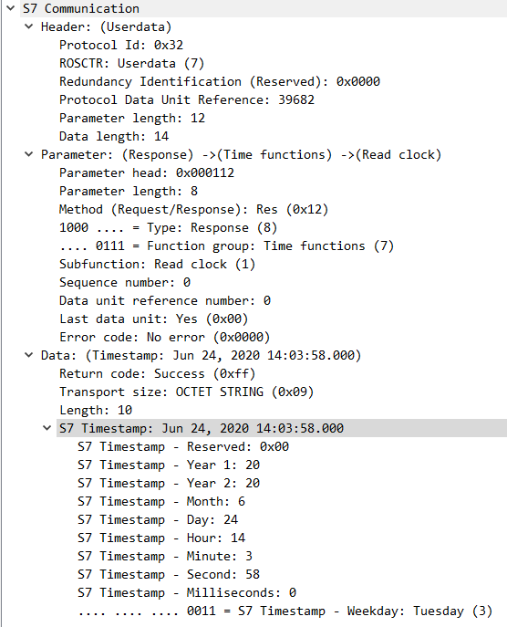

---

### Ethernet/IP

下载 [ICS-Security-Tools/pcaps/EthernetIP/enip_test.pcap](https://github.com/ITI/ICS-Security-Tools/blob/master/pcaps/EthernetIP/enip_test.pcap)

- 请求

    

    - Command: 命令，list identify 表示检测到 Ethernet/IP 列表身份的命令。
    - Length: 长度为 0，因为这个是一个请求包，没有数据长度。
    - Session Handle：记住这里为 0，后续的返回包我们看看是不是一样的。
    - Status: Success(0×00000000)
    - Max Response Delay:0, 这个包发送是实时的。
    - Sender Context:0000c1debed1, 正好 6 个字节的内容，等看看是不是一样的。
    - Options:0, 这里为始终为 0。

- 响应

    

    - Length: 长度不是 0 了，因为后面有了数据内容。
    - Session Handle: 还是 0，和请求包是一样的。
    - Sender Context: 和请求包一样，证明是对应的返回包。
    - Command Specific Data: 数据内容，这部分不需要细看了，里面是一些设备信息，这些在工控渗透时可能会用到。

---

## Malware

**学习资源**
- [Malware-Traffic-Analysis](https://www.malware-traffic-analysis.net/index.html) - 自 2013 年夏季以来，该网站已发布 1,600 多个有关恶意网络流量的博客条目。 该网站上几乎所有帖子都包含 pcap 文件或恶意软件样本（或两者）。

**Tips**
- 恶意流量包建议直接放到 VirusTotal 跑一遍
    - 利用 virustotal 可以在线扫描流量包, 但是 virustotal 需要登录才能匹配 Snort 和 Suricata 的规则, 如果无法无任何扫描结果，把流量包另存为 pcap 格式再扫描试试。

### 2014-11-16-traffic-analysis-exercise
- https://www.malware-traffic-analysis.net/2014/11/16/index.html

下载 https://www.malware-traffic-analysis.net/2014/11/16/2014-11-16-traffic-analysis-exercise.pcap.zip , 密码是 infected

---

## USB

### 鼠标流量

USB 协议的数据部分在 Leftover Capture Data 块中

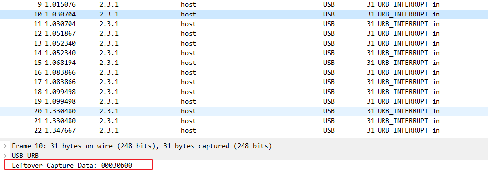

鼠标发送 00 03 0b 00 ,表示鼠标右移 03 像素，垂直向上移动 11 像素.

> 注意 : 有线鼠标和无线鼠标流量是不一样的

### 键盘流量

USB 协议的数据部分在 Leftover Capture Data 块中


键盘发送 00 00 17 00 00 00 00 00，表示按下了 T。

---

## 蓝牙

过滤语法 : `obex`

---

## wifi

过滤语法 : `eapol`

如果确定是握手包可以用 Aircrack 爆破

---

## 其他

### TeamViewer

**相关文章**
- [一次私有协议的流量分析](https://mp.weixin.qq.com/s/6pmJsWYKa5vPM_EApIX2dg)
- [TeamViewer authentication protocol (part 1 of 3)](http://bennysecurity.blogspot.com/2014/02/rawtech-blog-teamviewer-authentication.html)
- [TeamViewer authentication protocol (part 2 of 3)](http://bennysecurity.blogspot.com/2014/02/rawtech-blog-teamviewer-authentication_5536.html)
- [TeamViewer authentication protocol (part 3 of 3)](http://bennysecurity.blogspot.com/2014/02/rawtech-blog-teamviewer-authentication_10.html)
- [Security Analysis: TeamViewer](https://awakesecurity.com/blog/analyzing-teamviewer/)
- [入侵检测系列1（上）：基于私有协议的加密流量分析思路（Teamviewer篇）](https://www.anquanke.com/post/id/223106)
- [入侵检测系列1（中）基于私有协议的加密流量分析思路（Teamviewer篇）](https://www.anquanke.com/post/id/225394)
- [入侵检测系列1（下）：基于私有协议的加密流量分析思路（Teamviewer篇）](https://www.anquanke.com/post/id/226531)

**lua插件**
- https://docs.google.com/file/d/0B3tHnfnS08GyWjJUOXE3UGFJRnc/edit

### CobaltStrike

**相关文章**
- [Cobalt Strike: Using Known Private Keys To Decrypt Traffic – Part 2](https://blog.nviso.eu/2021/10/27/cobalt-strike-using-known-private-keys-to-decrypt-traffic-part-2/)
    - [破解版密钥相同，部分CobaltStrike加密流量可解](https://mp.weixin.qq.com/s/AcIFSjyqn9gzyRkyx3sRIQ)

**相关工具**
- https://blog.didierstevens.com/2021/10/22/new-tool-cs-decrypt-metadata-py/
- https://blog.didierstevens.com/2021/10/11/update-1768-py-version-0-0-8/
- https://github.com/DidierStevens/Beta/blob/master/cs-parse-http-traffic.py

**案例**

用 1768.py 分析 beacon.exe 源文件

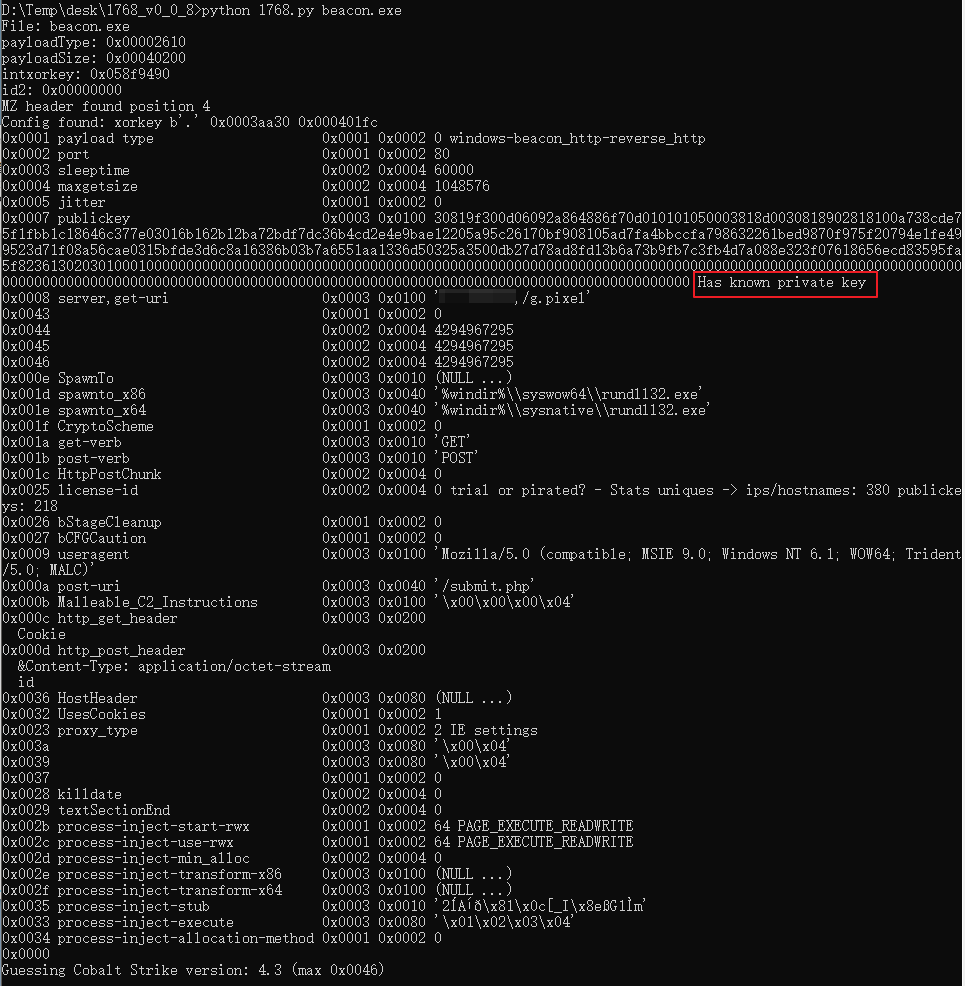

抓包,用 cs-decrypt-metadata.py 解密 cookie

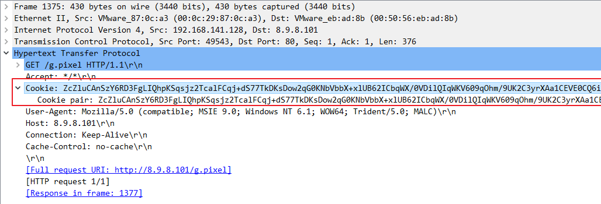

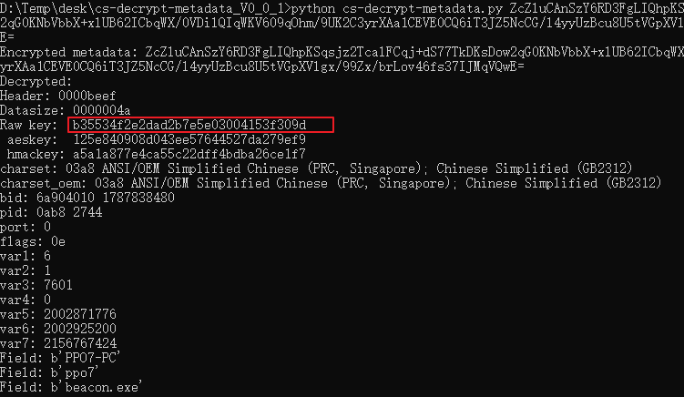

用 cs-parse-http-traffic 解密

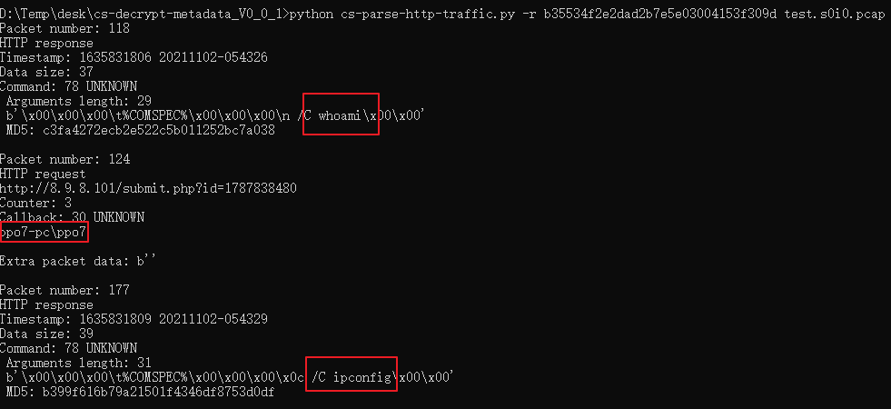
