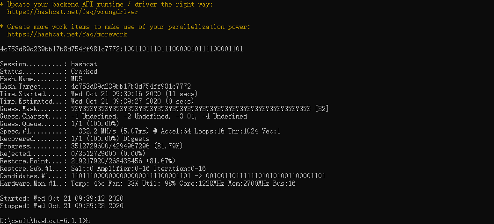
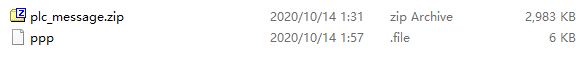
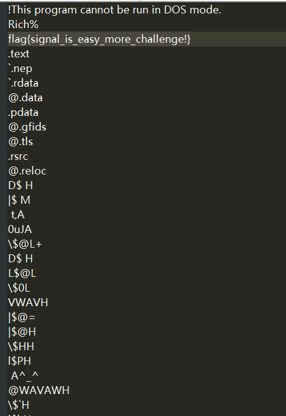
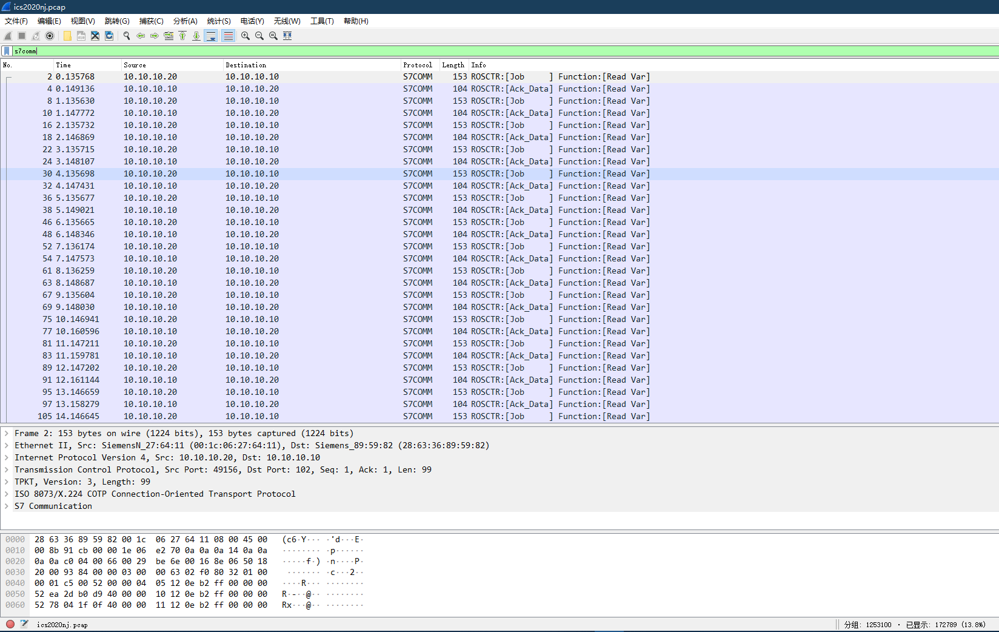
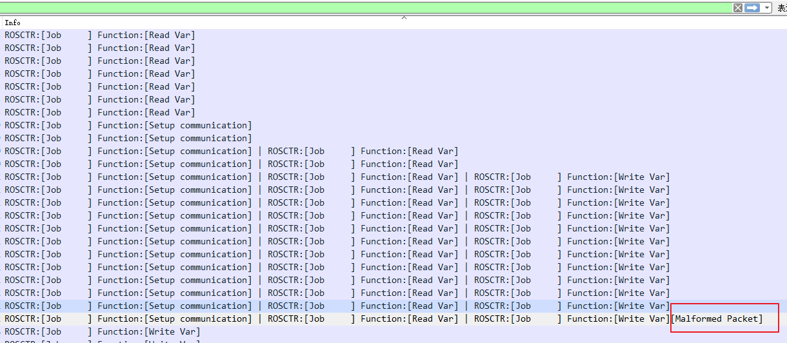
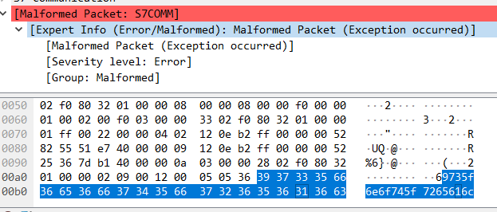
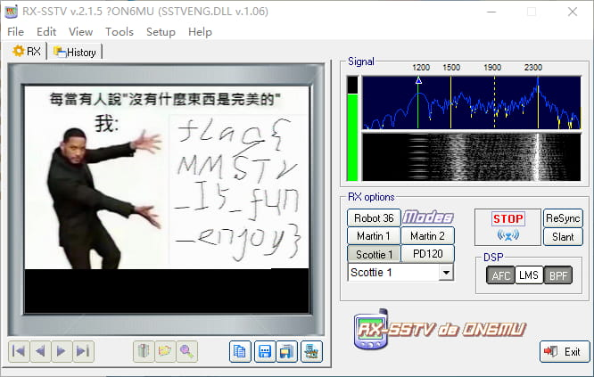

# 上午

## web

### URL

页面输入存在url参数 ?url=，怀疑是SSRF，读取源码：
```
/index.php?url=file://localhost/ctf.cybersec/../../var/www/html/index.php&submit=SUBMIT
```

```php
<?php
function curl($url){
    $ch = curl_init();
    curl_setopt($ch, CURLOPT_URL, $url);
    curl_setopt($ch, CURLOPT_HEADER, 0);
    curl_exec($ch);
    curl_close($ch);
}

if(isset($_GET['submit'])){
        $url = $_GET['url'];
        if (preg_match('/ctf\.cybersec/i', $url)) {
                if (preg_match('/\@|\#|\?/i', $url)) {
                        die('not @#?');
                } else {
      $parts = parse_url($url);
      if (empty($parts['host']) || $parts['host'] != 'localhost') {
            exit('host must be localhost');
      } else {

                        curl($url);
      }
                }
        } else {
        die("The URL must contain the 'ctf.cybersec'");
        }
}
?>
```

源码里不存在flag和提示，经过尝试找到flag在/flag.txt：
```
/index.php?url=file://localhost/ctf.cybersec/../flag.txt&submit=SUBMIT
```

---

### upload

文件上传提示200OK,但访问又是404,解法是条件竞争,burp开两个intruder窗口，一个持续上传，一个持续访问预期文件名，线程调高即可。

上传生成马：
```php
<?php file_put_contents("shell123.php","test888888<?php phpinfo();?>");?>
```

这题给了flag位置，在/root/flag，直接读是没有权限的，需要执行/etc/下的test才能读取flag，类似于大型竞赛的readflag程序，为了防止破坏flag。

这类readflag程序一般是通过SUID实现的，以下命令将尝试查找具有root权限的SUID的文件，不同系统适用于不同的命令，一个一个试
```
find / -perm -u=s -type f 2>/dev/null
find / -user root -perm -4000-print2>/dev/null
find / -user root -perm -4000-exec ls -ldb {} \;
```

---

# 下午

## Misc

### 签到

flag 就在图片里面


---

### RE_bitsconvert

**描述**

与门，或门和非门是常见的门电路，现有一个电路，其中一部分有与或非三个门，有一串电流序列，以一定的顺序通过了这个电路。现获取到电流通过这三个门之后的状态，那么原电流的序列是什么？ 提示：md5(flag) == 4c753d89d239bb17b8d754ff981c7772

程序运行后要求输入 0、1,在输入到第32次后会判断答案,那么可以得出揭露 01组成的32位数 md5 == 4c753d89d239bb17b8d754ff981c7772

用 hashcat 爆破
```
hashcat.exe 4c753d89d239bb17b8d754ff981c7772 -a 3 -m 0 -3 01 ?3?3?3?3?3?3?3?3?3?3?3?3?3?3?3?3?3?3?3?3?3?3?3?3?3?3?3?3?3?3?3?3
```



将 10011011101110000010111100001101 输入至程序得到 flag

flag{10011011-10111000-00101111-00001101}

---

### 被加密了的设备驱动

附件是一个加密的压缩包,爆破密码,是弱口令 05114568

解压出来是一个文本文件和一个加密的压缩包



ppp内容如下
```
  1           0 LOAD_CONST               0 (0)
              2 LOAD_CONST               1 (None)
              4 IMPORT_NAME              0 (hashlib)
              6 STORE_NAME               0 (hashlib)

  3           8 LOAD_CONST               2 (<code object encode at 0x035438B8, file "misc.py", line 3>)
             10 LOAD_CONST               3 ('encode')
             12 MAKE_FUNCTION            0
             14 STORE_NAME               1 (encode)

 10          16 LOAD_CONST               4 (<code object wrong at 0x03543910, file "misc.py", line 10>)
             18 LOAD_CONST               5 ('wrong')
             20 MAKE_FUNCTION            0
             22 STORE_NAME               2 (wrong)

 14          24 LOAD_NAME                3 (__name__)
             26 LOAD_CONST               6 ('__main__')
             28 COMPARE_OP               2 (==)
             30 POP_JUMP_IF_FALSE      158

 16          32 LOAD_NAME                4 (print)
             34 LOAD_CONST               7 ('please input sth  ')
             36 CALL_FUNCTION            1
             38 POP_TOP

 17          40 LOAD_NAME                5 (raw_input)
             42 CALL_FUNCTION            0
             44 STORE_NAME               6 (sss)

 19          46 LOAD_NAME                7 (len)
             48 LOAD_NAME                6 (sss)
             50 CALL_FUNCTION            1
             52 LOAD_CONST               8 (14)
             54 COMPARE_OP               3 (!=)
             56 POP_JUMP_IF_FALSE       64

 20          58 LOAD_NAME                2 (wrong)
             60 CALL_FUNCTION            0
             62 POP_TOP

 22     >>   64 LOAD_NAME                6 (sss)
             66 LOAD_CONST               1 (None)
             68 LOAD_CONST               9 (9)
             70 BUILD_SLICE              2
             72 BINARY_SUBSCR
             74 LOAD_CONST              10 ('clearlove')
             76 COMPARE_OP               3 (!=)
             78 POP_JUMP_IF_FALSE       86

 23          80 LOAD_NAME                2 (wrong)
             82 CALL_FUNCTION            0
             84 POP_TOP

 25     >>   86 LOAD_NAME                6 (sss)
             88 LOAD_CONST              11 (-1)
             90 BINARY_SUBSCR
             92 LOAD_METHOD              8 (isdigit)
             94 CALL_METHOD              0
             96 POP_JUMP_IF_FALSE      130
             98 LOAD_NAME                6 (sss)
            100 LOAD_CONST              12 (-2)
            102 BINARY_SUBSCR
            104 LOAD_METHOD              8 (isdigit)
            106 CALL_METHOD              0
            108 POP_JUMP_IF_FALSE      130
            110 LOAD_NAME                6 (sss)
            112 LOAD_CONST              13 (-3)
            114 BINARY_SUBSCR
            116 LOAD_METHOD              8 (isdigit)
            118 CALL_METHOD              0
            120 POP_JUMP_IF_FALSE      130

 26         122 LOAD_NAME                4 (print)
            124 LOAD_CONST              14 ('type is right 0- 0')
            126 CALL_FUNCTION            1
            128 POP_TOP

 28     >>  130 LOAD_NAME                1 (encode)
            132 LOAD_NAME                6 (sss)
            134 CALL_FUNCTION            1
            136 LOAD_CONST              15 ('7276bf625a8c5e65b9e5966bed63bce0')
            138 COMPARE_OP               2 (==)
            140 POP_JUMP_IF_FALSE      152

 29         142 LOAD_NAME                4 (print)
            144 LOAD_CONST              16 ('you got it')
            146 CALL_FUNCTION            1
            148 POP_TOP
            150 JUMP_FORWARD             6 (to 158)

 31     >>  152 LOAD_NAME                2 (wrong)
            154 CALL_FUNCTION            0
            156 POP_TOP
        >>  158 LOAD_CONST               1 (None)
            160 RETURN_VALUE

Disassembly of <code object encode at 0x035438B8, file "misc.py", line 3>:
  5           0 LOAD_GLOBAL              0 (hashlib)
              2 LOAD_METHOD              1 (md5)
              4 CALL_METHOD              0
              6 STORE_FAST               1 (hl)

  6           8 LOAD_FAST                1 (hl)
             10 LOAD_METHOD              2 (update)
             12 LOAD_FAST                0 (inpu)
             14 LOAD_ATTR                3 (encode)
             16 LOAD_CONST               1 ('utf-8')
             18 LOAD_CONST               2 (('encoding',))
             20 CALL_FUNCTION_KW         1
             22 CALL_METHOD              1
             24 POP_TOP

  8          26 LOAD_FAST                1 (hl)
             28 LOAD_METHOD              4 (hexdigest)
             30 CALL_METHOD              0
             32 RETURN_VALUE

Disassembly of <code object wrong at 0x03543910, file "misc.py", line 10>:
 11           0 LOAD_GLOBAL              0 (print)
              2 LOAD_CONST               1 ('wrong')
              4 CALL_FUNCTION            1
              6 POP_TOP

 12           8 LOAD_GLOBAL              1 (exit)
             10 CALL_FUNCTION            0
             12 POP_TOP
             14 LOAD_CONST               0 (None)
             16 RETURN_VALUE
```

比赛时没做出来,赛后询问朋友得知是opcode,密码规则是 clearlove + 任意2位字符 + 3位纯数字

```
hashcat 7276bf625a8c5e65b9e5966bed63bce0 -a 3 -m 0 clearlove?a?a?d?d?d
```

通过md5碰撞确认为 clearlove%?794

解压得到dll,用 strings 一下得到 flag



flag{signal_is_easy_more_challenge!}

---

### 异常的流量包

wireshark 打开流量包,过滤一下 s7comm 流量



光S7就足足17w个包,要么是跑脚本,要么是分析异常

按 info 排列, 在 setup communication 中最后一个包有异样






flag{is_not_real}

---

### 噪音

压缩包解压出来是个 mp3 文件

这一题需要使用 RX-SSTV 工具,这个 mp3 具有非常明显的特点,做过类似题目的都清楚

打开音频文件，点击 Receiving


