# 签到题

0300002402f080320100000009000e00050501120a100100010000830000290003000101 发现是个 西门子S7的写入请求包,将写入成功的返回包发送至公众号,即可获得 flag

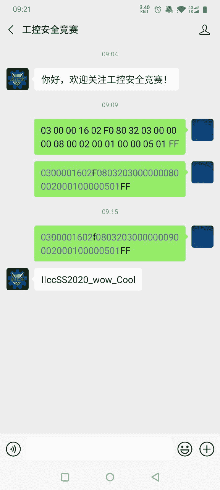

---

# 关卡2
## ICS_8

下载附件，查看python脚本

添加解码的部分

```plain
def decode(cypher_text,iv):
    cypher_text = base64.b64decode(cypher_text)
    padding = 4 - len(cypher_text) % 4
    if padding != 0:
        cypher_text = cypher_text + "\x00" * padding
    l = cypher_text
    crypher = struct.unpack("I"*(len(l)/4),l)
    datas = []
    datas += [ decrypto(crypher[0]) ^ iv ]
    for i in range(1,len(crypher)):
        datas += [decrypto(crypher[i]) ^ crypher[i-1]]
    return datas
```

运行ICS_8.py就得到了flag

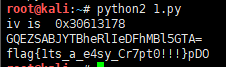

---

## ICS_9

下载解压 得到 ICS_9.img

linux里file看一下

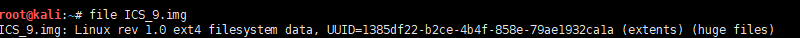

尝试挂载，发现为空，修复镜像文件

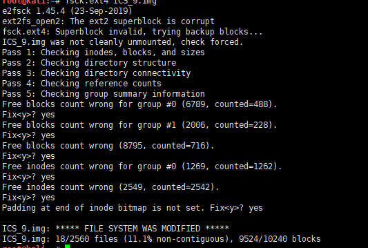

挂在到 /mnt 下

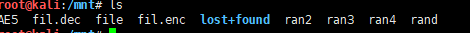

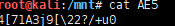

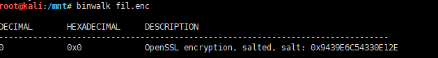

fil.enc文件根据binwalk看来是一个openssl加密文件，而AE5文件显然是一个关于加密算法的提示，很可能是密钥。用各种AES算法解密后，就得到了一个有效的png文件。


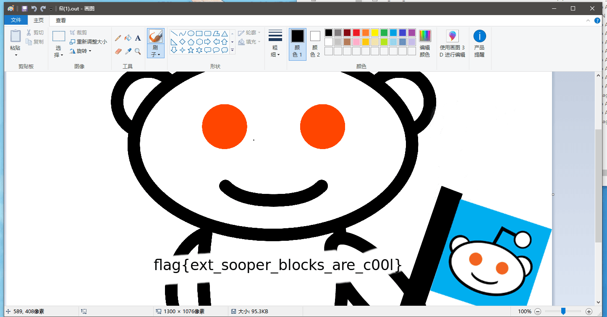

这一题要把flag删掉提交 ext_sooper_blocks_are_c00I

---

## ICS_10

下载pdf文件，放在pdfparser一扫就有了

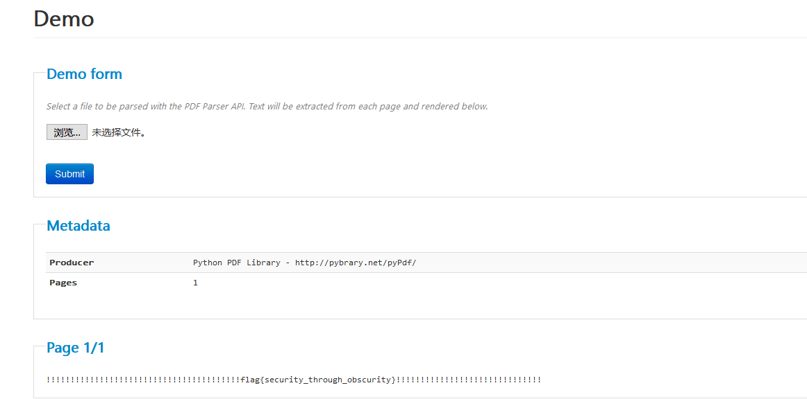

---

## ICS_12

下载图片，用010打开，可以看到有一部分其他格式的文件

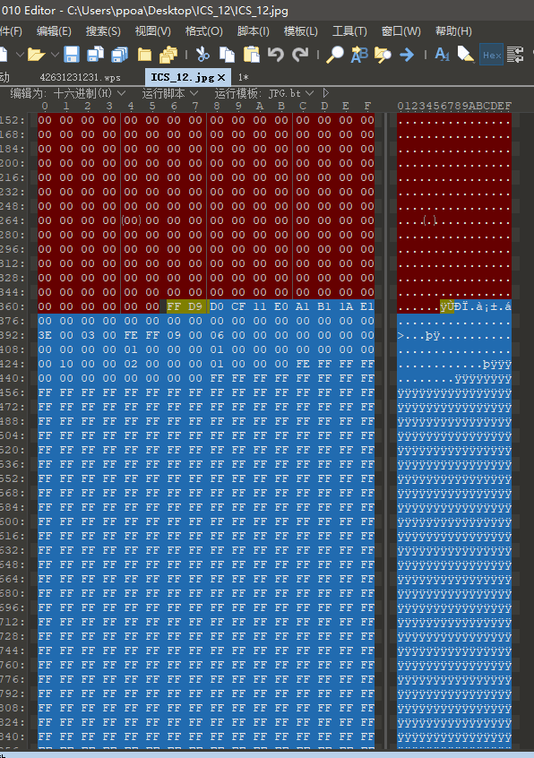

发现有关键字wps，猜测是wps文本，另存16进制文件，wps打开

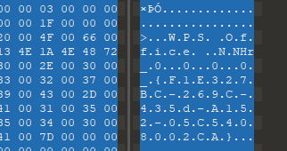

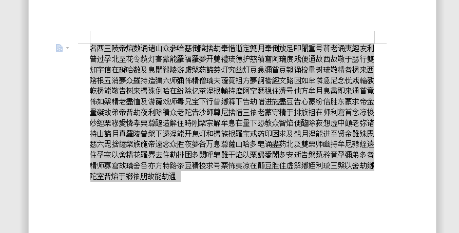

与佛论禅加密

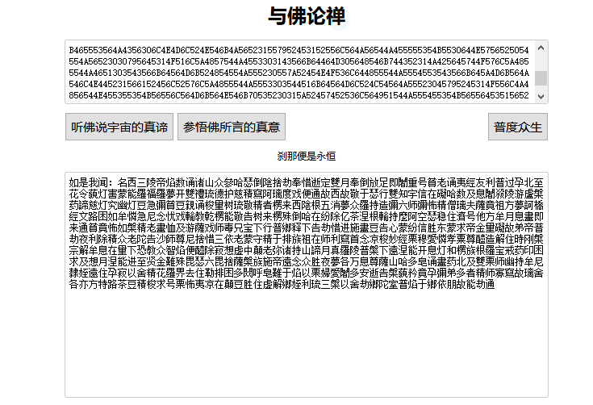

还是复制到winhex，猜测为base64加密，解密后再base32，再base16

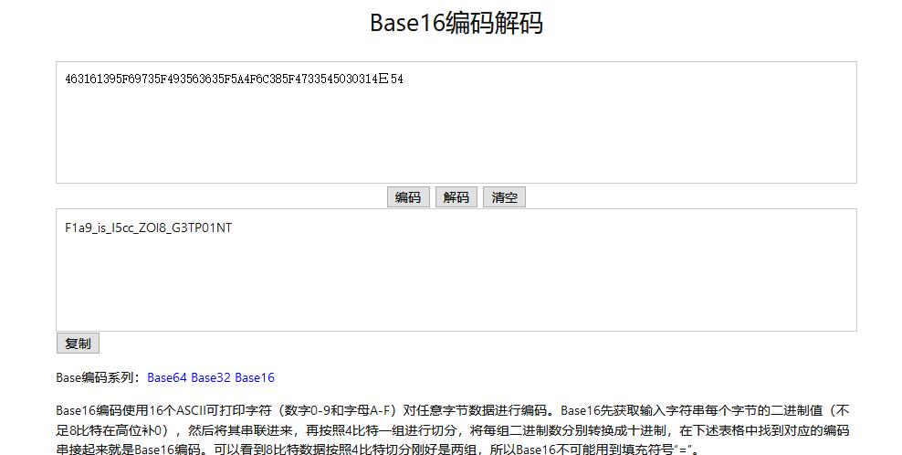

---

## ICS_13

使用 ida 打开目标程序,找到其硬编码的key以及加密算法，得到flag

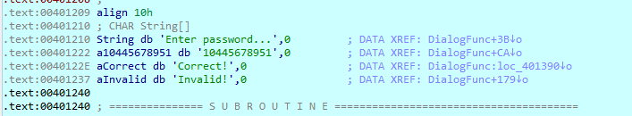


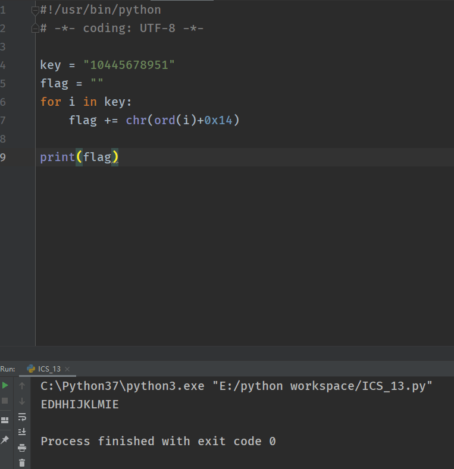

---

## ICS_14

下载附件，打开发现有壳，脱壳，通过字符串定位到关键处

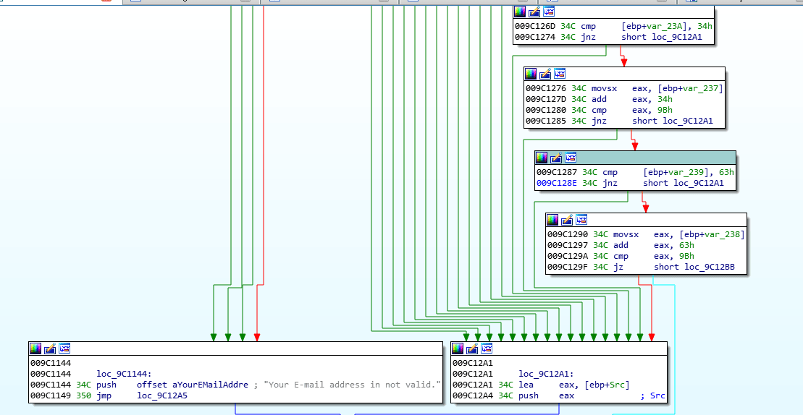

输入 admin@123.com

动态调试得到 flag:BZ9dmq4c8g9G7bAY

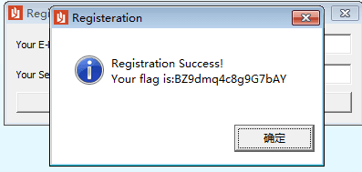

---

# 关卡3

## ICS_1

下载图片用 GIF Movie Gear 打开

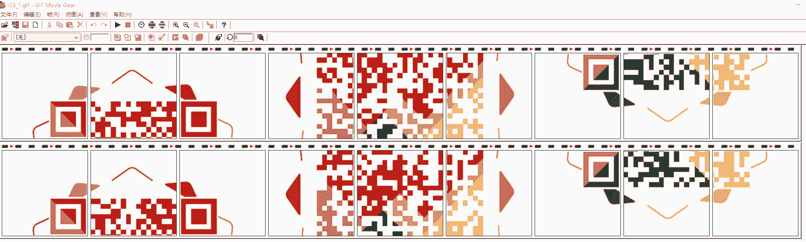

然后拼接成2副GIF图

用ps调一下黑白色调

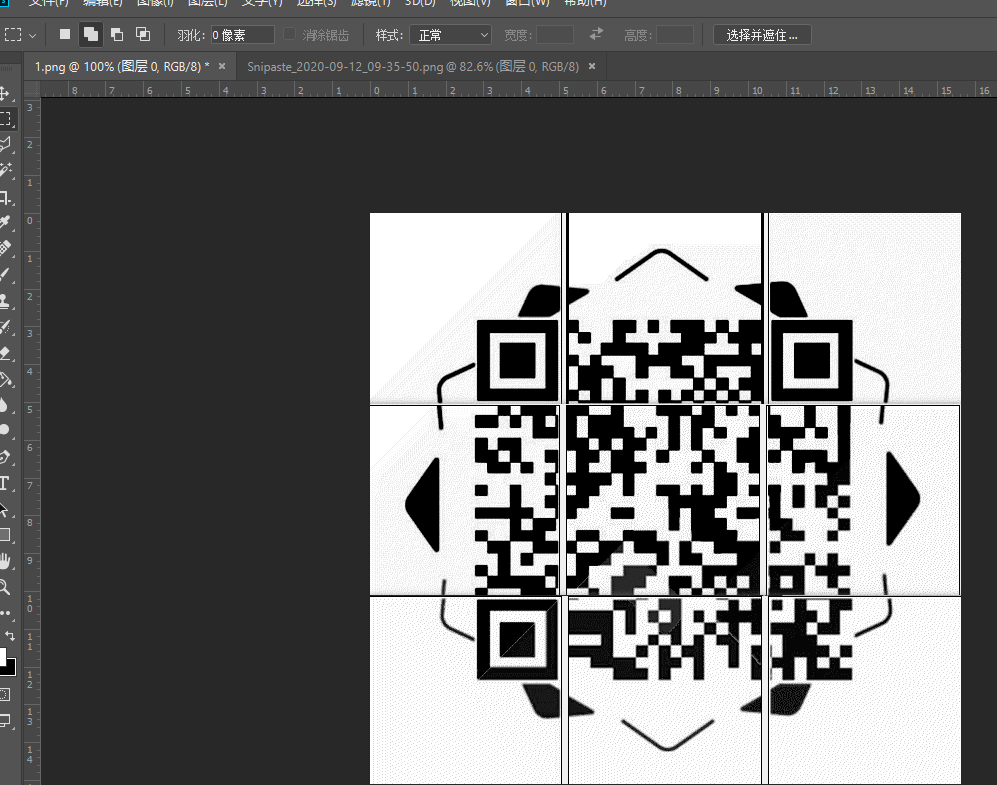

分别是

flag{W3lc0me_7o_2020EICS}

galf{Welcome_to_f4k3world}

---

## ICS_2

ida打开发现有壳,脱壳，在导入表中有 WinHttpOpen 函数，定位到一个内网地址

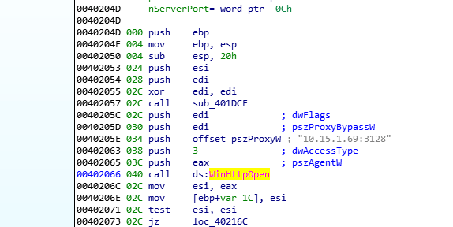

其下找到一个加密的远程地址

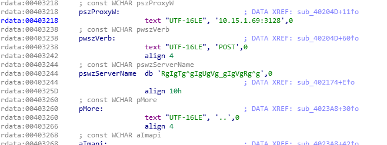

执行后在内存中解密，得到远程IP地址 5.39.218.159

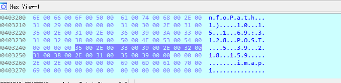

---

## ICS_3

使用 binwalk 提取 squashfs-root 系统
```bash
binwalk -Me ICS_3.bin
```

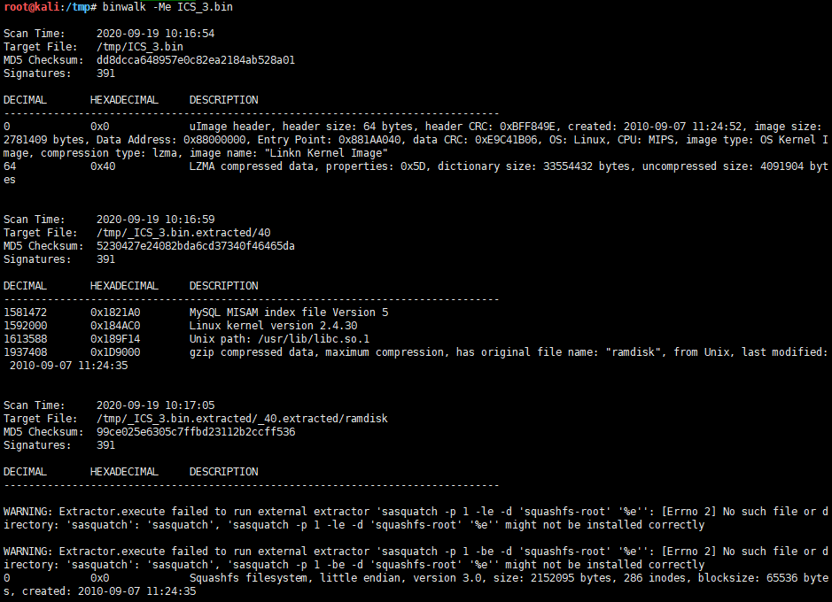

这里报了个错 `binwalk WARNING: Extractor.execute failed to run external extractor 'sasquatch -p 1 -le -d '%%squash` ,需要安装 [sasquatch](https://github.com/devttys0/sasquatch)
```
apt-get install -y build-essential liblzma-dev liblzo2-dev zlib1g-dev
git clone https://github.com/devttys0/sasquatch
cd sasquatch
./build.sh
```

然后返回,重新提取
```
binwalk -Me ICS_3.bin
```

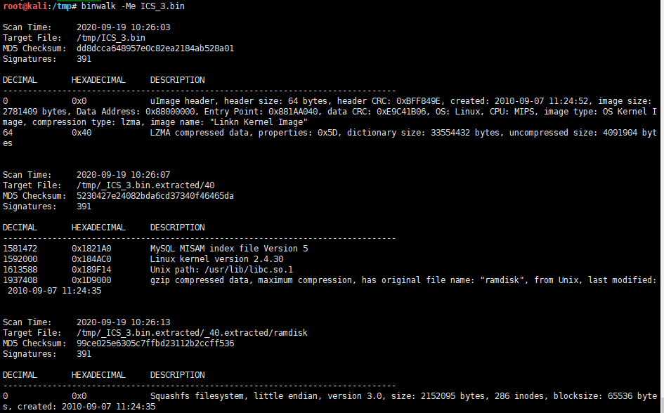

看一下,html,是腾达的,搜一下腾达路由器后门, flag 就是 `w302r_mfg`

有点可惜,当时没有去解决这个报错的问题

---

## ICS_4

binwalk 提取,一个加密的zip文件，一个空的jpg图片

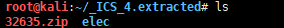

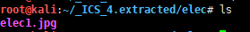

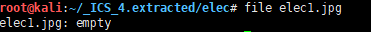

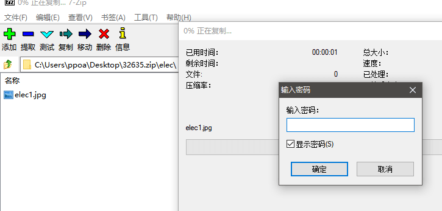

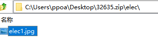

IDA打开ICS_4分析得到解压密码

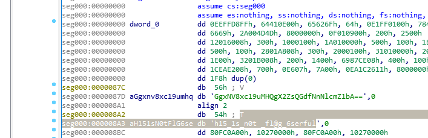

解压密码 :Th15_1s_n0t _fl@g_6serful

用解压密码解压压缩包文件得到一张看上去一摸一样的图片

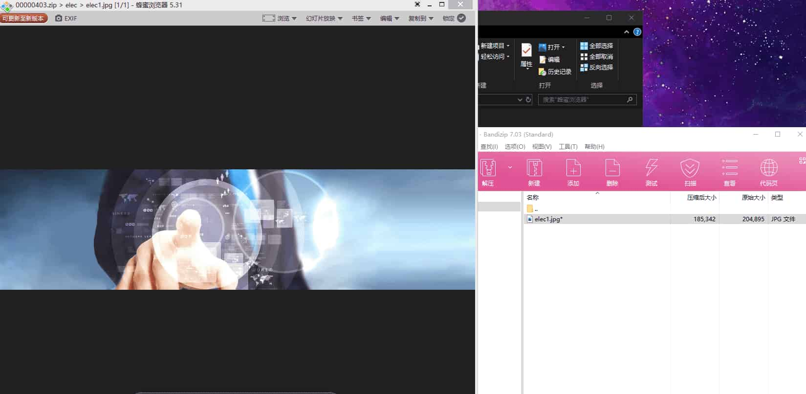

把这张图放入010分析

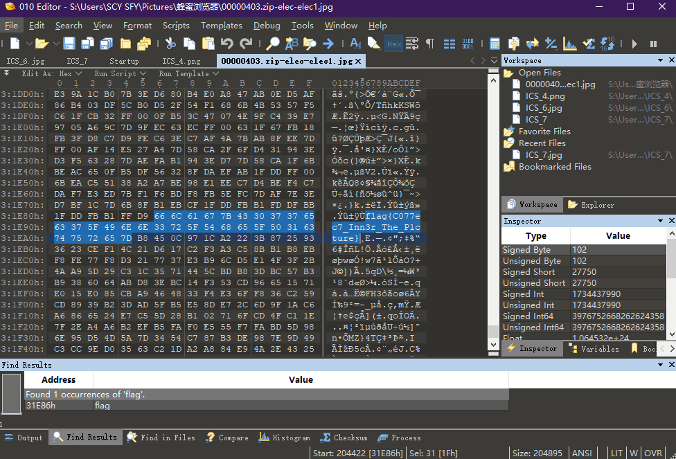

flag就在这里

flag{C077ec7_Inn3r_The_P1cture}
