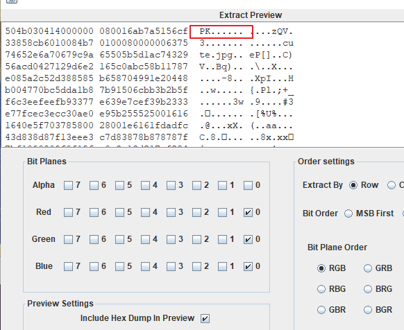
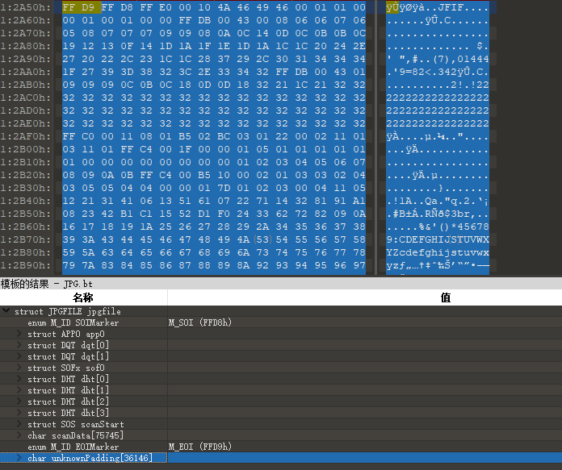

# Misc

`赛后复现`

## hardstego

给出一个压缩包,里面有 hardstego.png

png 图片猜测可能有 lsb 隐写,用 Stegsolve 分离得到一个压缩包



解压得到 cute.jpg ,尝试多种 jpg 隐写方式无果,010 打开发现有未知数据流在文件末尾



手动分离一下是一模一样的图片,按照套路要么盲水印要么 xor

Stegsolve 中用 image combiner 得到 flag


---

# Crypto

`赛后复现`

## easyRSA

```py
from flag import flag
from Crypto.Util.number import *

p = getPrime(1024)
q = getPrime(1024)
e = 65537
n = p*q

m = bytes_to_long(flag)

print n
print pow(m, e, n)
print p>>256<<256

# output
# 26406507468595611843852094067483173843988114465094045314324958205247973393878612589146897816881236818219902539975703710689353618174826904300589643161784341674436810639999244652231756242284615955258973430337702733454791782484002773967293198343866259490519754466626455660967042613249021854707331393440280088268816341057924652807723419166490363777181753297185283416885627445213950857480287818564281651822264024891956284486733856518809532470029519647769749231421957169481281821885757924521580543834665554242403238567286205389138437021157096962185096308108489101554724344868500500476691994206988217768341711716527866730487
# 22371088752722216457725632164373582195669473128756299754645443284929524768654545905154985577175225182544638209286885657892360668965805613727315024761409924679131145149936406239774150607378706790494820180586939668429812955766507811860718575149988809217701964019618239260041070894375952033566803105327100696642244951676616707205397327491933042019560545721027871057909242509336729865025061616686254481161431063503607378134616485979961926628954536592552923269161255759846497309277397441639921544384778106116567555705005440627393593876072210594939647990615797269482726733444406876986888296295032722008287447468255108089357
# 159945952275533485818121954231313618960321976049710904254772419907677971914439101482974923293074598678164025819370654132149566696084245679106109087142916286461708005676333840438629476722637189134626565206159794947442549588155962485884562239895738265024295739578695834796427810095412842888401159276765814718464
```

已知高位攻击,用 sage 脚本改下位数跑就可以了
```
n = 26406507468595611843852094067483173843988114465094045314324958205247973393878612589146897816881236818219902539975703710689353618174826904300589643161784341674436810639999244652231756242284615955258973430337702733454791782484002773967293198343866259490519754466626455660967042613249021854707331393440280088268816341057924652807723419166490363777181753297185283416885627445213950857480287818564281651822264024891956284486733856518809532470029519647769749231421957169481281821885757924521580543834665554242403238567286205389138437021157096962185096308108489101554724344868500500476691994206988217768341711716527866730487
p_fake = 159945952275533485818121954231313618960321976049710904254772419907677971914439101482974923293074598678164025819370654132149566696084245679106109087142916286461708005676333840438629476722637189134626565206159794947442549588155962485884562239895738265024295739578695834796427810095412842888401159276765814718464

pbits = 1024
kbits = 256
pbar = p_fake & (2^pbits-2^kbits)
print("upper %d bits (of %d bits) is given" % (pbits-kbits, pbits))

PR.<x> = PolynomialRing(Zmod(n))
f = x + pbar

x0 = f.small_roots(X=2^kbits, beta=0.4)[0]  # find root < 2^kbits with factor >= n^0.3
print(hex(int(x0 + pbar)))
```

得到 p=0xe3c545d18d3292c89e6075bdf276824fac4887651f2aa17c1aae5cf7c1638fe280a2f636b3eb5b549239e75519e217610fc59f7b8ffac8cab87a047efc8499b09121ff486cbf929ebb6880092b0a89d4901b13eabdaae047e2f9821b78bb98814c88e444a7a2db5e9f3789a5855791c29cbdd5debbed8eba0714d80cc1583e71

解密得 flag{f4f41143a6fc8f8f7365c6ccb5e3cb78}
