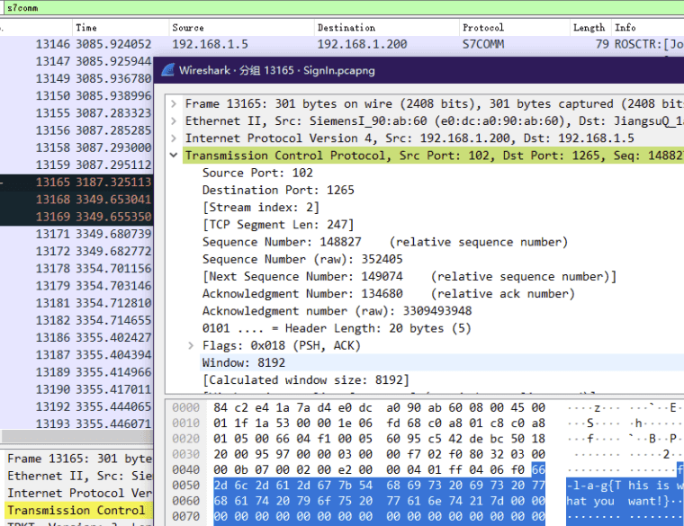
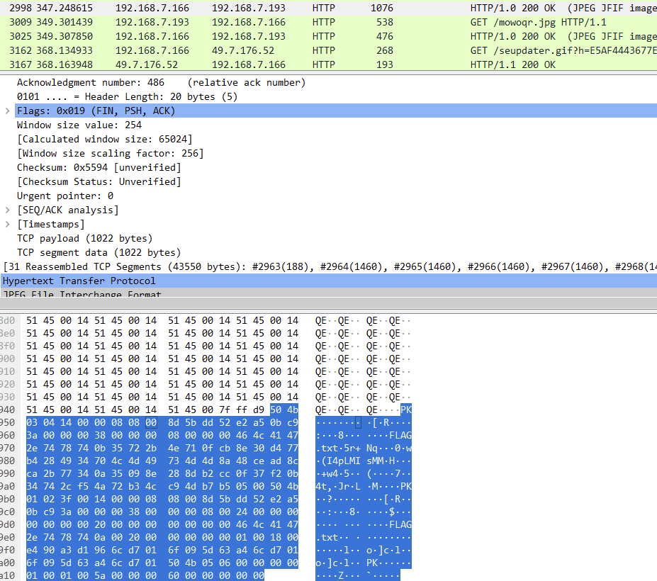
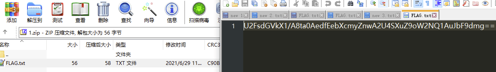
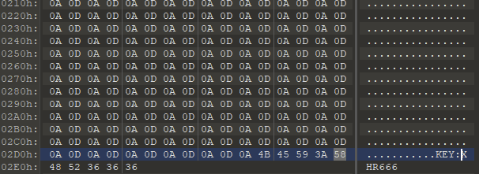
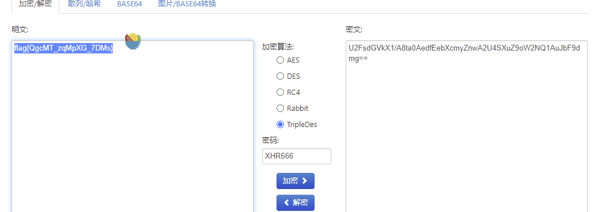
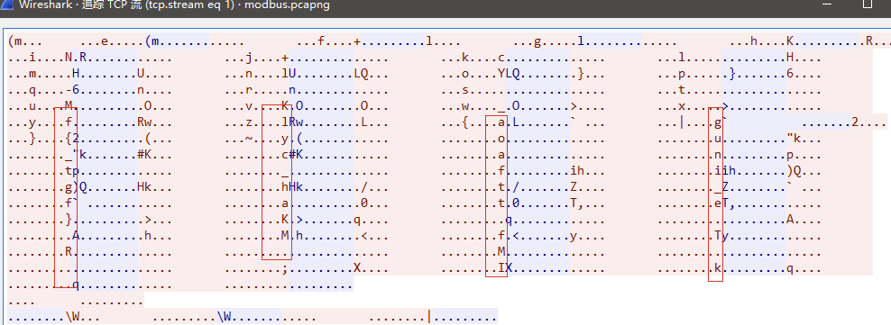

# 2021-9-第七届工控信息安全攻防竞赛

---

## 签到

flag格式flag{xx_xx_xx_xx}

搜索协议s7comm 找到报错点黑色部分，得到flag



---

## IEC104

查看压缩包内隐藏的信息，flag格式：flag{xxx}

伪加密,提取到流量包


搜索 flag ,这个图片中存在一个压缩包



将图片下载,压缩包分离出来,得到 flag.txt



看特征像 AES ,在一开始的压缩包找到KEY



3des 解密得到 flag



---

## error

查看附件以获取flag

wireshark 跟踪TCP流



---

## family_bucket61

根据附件解出flag

凯撒偏移13位
```
4B555A58435754494B5A4A554F334B454D565257363453444746454555334C4947464158435343564F42515841554C534752435449565446493533565154434B4F4A4745474E4C4B4E42484545354C454746325653345A584735435453545455
```

base16
```
KUZXCWTIKZJUO3KEMVRW64SDGFEEU3LIGFAXCSCVOBQXAULSGRCTIVTFI53VQTCKOJGEGNLKNBHEE5LEGF2VS4ZXG5CTSTTU
```

base32
```
U3qZhVSGmDecorC1HJmh1AqHUpapQr4E4VeGwXLJrLC5jhNBud1uYs77E9Nt
```

base58
```
S19AIyRYaCQoMkU8UiNQS1YzbShLX15GMEVtQiVkSl4=
```

base64
```
K_@#$Xh$(2E<R#PKV3m(K_^F0EmB%dJ^
```

base85
```
A';GhG1!.>bJ?]AeA'GP-RZM>
```

base92
```
XRB1XUR0Z5QKGXSUH3A7
```
