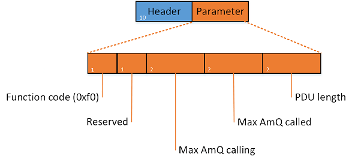
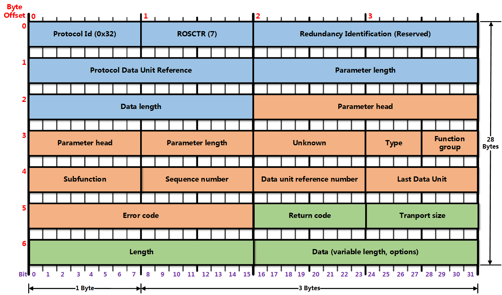
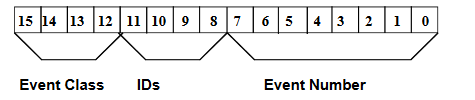

# S7comm 相关

---

## 免责声明

`本人撰写的手册,仅供学习和研究使用,请勿使用文中的技术源码用于非法用途,任何人造成的任何负面影响,与本人无关.`

---

**简介**

S7 协议的 TCP/IP 实现依赖于面向块的 ISO 传输服务。S7 协议被封装在 TPKT 和 ISO-COTP 协议中，这使得 PDU(协议数据单元)能够通过 TCP 传送。

它用于 PLC 编程，在 PLC 之间交换数据，从 SCADA(监控和数据采集)系统访问 PLC 数据以及诊断目的。

S7Comm 以太网协议基于 OSI 模型：

| layer | Protocol |
| - | - |
| 7 Application Layer 	| S7 communication |
| 6 Presentation Layer 	| S7 communication |
| 5 Session Layer 	    | S7 communication |
| 4 Transport Layer 	| ISO-on-TCP (RFC 1006) |
| 3 Network Layer 	    | IP |
| 2 Data Link Layer 	| Ethernet |
| 1 Physical Layer 	    | Ethernet |

从 wireshark 协议分级可以看出排列

TPKT，应用层数据传输协议，介于 TCP 和 COTP 协议之间。这是一个传输服务协议，主要用来在 COTP 和 TCP 之间建立桥梁；

COTP，按照维基百科的解释，COTP 是 OSI 7 层协议定义的位于 TCP 之上的协议。COTP 以“Packet”为基本单位来传输数据，这样接收方会得到与发送方具有相同边界的数据；

第7层，S7 communication，这一层和用户数据相关，对 PLC 数据的读取报文在这里完成。

在具体的报文中，TPKT 的作用是包含用户协议(5~7层)的数据长度(字节数)；COTP 的作用是定义了数据传输的基本单位(在S7Comm中 PDU TYPE：DT data)。

S7Comm 数据作为 COTP 数据包的 Payload ，第一个字节总是 0×32 作为协议标识符。

S7Comm 协议包含三部分：
- Header
- Parameter
- Data

根据实现的功能不同，S7 comm 协议的结构会有所不同。

---

## S7Comm-Header

S7Comm 的头，定义了该包的类型、参数长度、数据长度等，其结构如图所示：

所以，S7Comm Header 的格式为：
- 0 (unsigned integer, 1 byte): Protocol Id，协议 ID，通常为 0×32；
- 1 (unsigned integer, 1 byte): ROSCTR，PDU type，PDU 的类型，一般有以下值：
    - 0×01 – JOB(Request： job with acknowledgement)：作业请求。由主设备发送的请求(例如，读/写存储器，读/写块，启动/停止设备，设置通信)；
    - 0×02 – ACK(acknowledgement without additional field)：确认响应，没有数据的简单确认(未遇到过由 S7 300/400 设备发送得)；
    - 0×03 – ACK_DATA(Response： acknowledgement with additional field)：确认数据响应，这个一般都是响应JOB的请求；
    - 0×07 – USERDATA：原始协议的扩展，参数字段包含请求/响应 ID(用于编程/调试，读取 SZL，安全功能，时间设置，循环读取…)。
- 2~3 (unsigned integer, 2 bytes): Redundancy Identification (Reserved)，冗余数据，通常为 0×0000；
- 4~5 (unsigned integer, 2 bytes): Protocol Data Unit Reference，it’s increased by request event。协议数据单元参考，通过请求事件增加；
- 6~7 (unsigned integer, 2 bytes): Parameter length，the total length (bytes) of parameter part。参数的总长度；
- 8~9 (unsigned integer, 2 bytes): Data length，数据长度。如果读取 PLC 内部数据，此处为 0×0000；对于其他功能，则为 Data 部分的数据长度；

其中最重要的字段就是 ROSCTR，它决定了后续参数的结构

在响应数据包中，还有可能存在错误信息，其错误信息结构为：

- 10 (unsigned integer, 1 bytes): Error class，错误类型：
- 11 (unsigned integer, 1 bytes): Error code，错误代码；

---

## Job和Ack_Data

S7Comm 中 Job(作业请求) 和 Ack_Data(确认数据响应) 中的 Parameter 项的第一个字段是 function(功能码)，其类型为 Unsigned integer，大小为 1 byte。决定了其余字段的结构、消息的目的。

- **建立通信(Setup communication [0xF0])**

    建立通信在每个会话开始时被发送，然后可以交换任何其他消息。它用于协商 ACK 队列的大小和最大 PDU 长度，双方声明它们的支持值。ACK 队列的长度决定了可以同时启动而不需要确认的并行作业的数量。PDU 和队列长度字段都是大端。

    当 PDU 类型为 Job 时，建立通信功能中 Parameter 的结构，如下图：

    

    具体的 Parameter 结构，如下：
    - 1 (Unsigned integer, 1 byte): Parameter part: Reserved byte in communication setup pdu，保留字节；
    - 2 (Unsigned integer, 2 bytes): Max AmQ (parallel jobs with ack) calling；
    - 3 (Unsigned integer, 2 bytes): Max AmQ (parallel jobs with ack) called；
    - 4 (Unsigned integer, 2 bytes): Parameter part: Negotiate PDU length。协商 PDU 长度。

- **读取值(Read Var [0x04])**

    数据读写操作通过指定变量的存储区域，地址(偏移量)及其大小或类型来执行。

    当 PDU 类型为 Job 时，那么其 S7Comm 结构，如下图：

    

    所以，接下来的 Parameter 字段是 item count(项目个数)，其类型为 Unsigned integer，大小为 1 byte。

    item 的结构如下：
    - 0 (Unsigned integer, 1 byte): Variable specification，确定项目结构的主要类型，通常为 0×12，代表变量规范；
    - 1 (Unsigned integer, 1 byte): Length of following address specification，本 Item 其余部分的长度；
    - 2 (Unsigned integer, 1 byte): Syntax Ids of variable specification，确定寻址模式和其余项目结构的格式；
    - 3(Unsigned integer, 1 byte): Transport sizes in item data，确定变量的类型和长度：
    - 4~5 (Unsigned integer ,2 byte): Request data length，请求的数据长度；
    - 6~7 (Unsigned integer, 2 byte): DB number，DB 模块的编号，如果访问的不是 DB 区域，此处为 0×0000；
    - 8 (Unsigned integer, 1 byte)：: Area，区域类型：
    - 9~11(Unsigned integer, 3 byte): Address，地址。

    PDU 类型为 Ack_Data 时，其 S7Comm 的结构，如下图：

    

    其 Parameter 只有 function、item count 两个字段。Data 结构如下：
    - 0 (Unsigned integer, 1 byte): Return code，返回代码：
    - 1 (Unsigned integer, 1 byte): Transport size，数据的传输尺寸：
    - 2~3 (Unsigned integer, 2 bytes): Length，数据的长度；
    - 4~4+length (?): Data，数据；
    - ? (Unsigned integer, 1 byte): Fill byte，填充字节。

- **写入值(Write Var [0x05])**

    Write Var 中 Parameter 的结构跟读取值(Read Var[0x04])一样，但是 Write Var 还需写入值，所以 Write Var 比 Read Var 多了一个 Data 项。结构如下：

    

    由此，Data 的结构为：
    - 0 (Unsigned integer, 1 byte): Return code，返回代码，这里是未定义，所以为 Reserved(0×00)；
    - 1 (unsigned integer, 1 byte): Transport size，确定变量的类型和长度：
    - 2-3 (unsigned integer, 2 bytes): Length，写入值的数据长度；
    - 4 (1 byte): Data，写入的值；
    - 5 (unsigned integer, 1 byte): Fill byte，填充字节，如果数据的长度不足 Length 的话，则填充；

    PDU 类型为 Ack_Data 时，其 S7Comm 的结构，如下图：

    

    Parameter 也只有 function、item count 两个字段。而 Data 中也只有一个 Return code 字段，其结构如下：
    - 0 (Unsigned integer, 1 byte): Return code，返回代码：

- **下载**

    下载是 Step7 发送块数据给 PLC。在西门子设备上，程序代码和(大部分)程序数据存储在块中，这些块有自己的头和编码格式。

    在西门子设备中有8种不同类型的功能块，这些块在上/下载请求中用特殊的ASCII文件名寻址。这个文件名的结构如下：

    - 1 (1 byte): File identifier(ASCII)，文件标识符。其有_ (Complete Module)、$ (Module header for up-loading)两种文件标识符；
    - 2 (2 bytes): Block type，块类型。
    - 3 (5 bytes): Block number，块编号；
    - 4 (1 byte): Destination filesystem(ASCII)，目标的文件系统。其有三种文件系统：
        - P (Passive (copied, but not chained) module)：被动文件系统
        - A (Active embedded module)：主动文件系统
        - B (Active as well as passive module)：既主既被文件系统

    例如：文件名为_0A00001P(文件标识是_，块类型为DB，块的编号为00001，目标块的文件系统是P。)，用于将DB 1复制到被动文件系统或从被动文件系统复制。

    在下载过程中，先是 Step7 向 PLC 发送一个请求下载的 Job，PLC 收到后则回复一个 Ack_Data。在发送完所有字节后，Step7 向 PLC 发送一个下载结束的 Job 来关闭下载会话。时序图如下

    

    下载有3种不同的功能类型：
    - 请求下载(Request download [0x1A])

        当 PDU 类型为 Job 时，Request download [0x1A] 没有 Data，其 Parameter 的结构，如下
        - 1 (1 byte): Function Status，功能码状态；
        - 2 (2 bytes): for all unknown bytes in blockcontrol；
        - 3 (4 bytes): 无意义，一般为0x00000000；
        - 4 (1 byte): filename length，文件名长度；
        - 5 (? bytes): filename, default is 9 byte，文件名，长度一般为9个字节；
            - 1 (1 byte): File identifier(ASCII)，文件标识符。其有_ (Complete Module)、$ (Module header for up-loading)两种文件标识符；
            - 2 (2 bytes): Block type，块类型。
            - 3 (5 bytes): Block number，块编号；
            - 4 (1 byte): Destination filesystem(ASCII)，目标的文件系统。其有P(Passive (copied, but not chained) module)、A (Active embedded module)、B (Active as well as passive module)三种文件系统；
        - 6 (1 byte): Length part 2 in bytes，参数的第二部分长度，也就是接下来的字段长度；
        - 7 (1 byte): Unknown char(ASCII)；
        - 8 (6 bytes): Length load memory in bytes(ASCII)；
        - 9 (6 bytes): Length of MC7 code in bytes(ASCII)。

        PDU 类型为 Ack_Data 时，Request download [0x1A] 的 Parameter 中只有一个 function。

    - 下载块(Download block [0x1B])

        下载是 Step7 发送块数据给 PLC。当 PDU 类型为 Job 时，Download block [0x1B] 也没有 Data，其 Parameter 的结构，如下
        - 1 (1 byte): Function Status，功能码状态；
        - 2 (2 bytes): for all unknown bytes in blockcontrol；
        - 3 (4 bytes): 无意义，一般为0x00000000；
        - 4 (1 byte): filename length，文件名长度；
        - 5 (? bytes): filename, default is 9 byte，文件名，长度一般为9个字节；
            - 1 (1 byte): File identifier(ASCII)，文件标识符。其有_ (Complete Module)、$ (Module header for up-loading)两种文件标识符；
            - 2 (2 bytes): Block type，块类型。
            - 3 (5 bytes): Block number，块编号；
            - 4 (1 byte): Destination filesystem(ASCII)，目标的文件系统。其有P(Passive (copied, but not chained) module)、A (Active embedded module)、B (Active as well as passive module)三种文件系统；

        Download block [0x1B] 的 Parameter 与 Request download [0x1A] 的 Parameter 的第一部分相同

        那 PDU 类型为 Ack_Data 时，Download block [0x1B] 有 Parameter 和 Data，其 Parameter 的结构，如下
        - 1 (1 byte): Function Status，功能码状态；
            - 1 (Unsigned integer, 2 bytes): Length，数据长度；
            - 2 (Unsigned integer, 2 bytes): Unknown byte(s) in blockcontrol，未知字节；
            - 3 (Label，data_length-4 bytes): Data，数据；

    - 下载结束(Download ended [0x1C])

        当 PDU 类型为 Job 时，Download ended [0x1C] 也没有 Data，其 Parameter 的结构，如下：
        - 1 (1 byte): Function Status，功能码状态；
        - 2 (2 bytes): for all unknown bytes in blockcontrol；
        - 3 (4 bytes): 无意义，一般为 0x00000000；
        - 4 (1 byte): filename length，文件名长度；
        - 5 (? bytes): filename, default is 9 byte，文件名，长度一般为9个字节；
            - 1 (1 byte): File identifier(ASCII)，文件标识符。其有_ (Complete Module)、$ (Module header for up-loading)两种文件标识符；
            - 2 (2 bytes): Block type，块类型。
            - 3 (5 bytes): Block number，块编号；
            - 4 (1 byte): Destination filesystem(ASCII)，目标的文件系统。其有P(Passive (copied, but not chained) module)、A (Active embedded module)、B (Active as well as passive module)三种文件系统；

        PDU 类型为 Ack_Data 时，Download ended [0x1C] 的 Parameter 中只有一个 function。

- **上传**

    上传是 PLC 发送块数据给 Step7

    在上传过程中，先是 Step7 向 PLC 发送一个开始上传的 Job，PLC 收到后则回复一个 Ack_Data，并告诉 Step7 块的长度、上传会话 ID。然后 PLC 继续上传块数据到 Step7，直到 Step7 收到所有字节。最后，Step7 发送结束上传的作业请求来关闭上传会话。时序图如下

    

    上传有3种不同的功能类型
    - 开始上传(Start upload [0x1D])

        当 PDU 类型为 Job 时，Start upload [0x1D] 没有 Data，其 Parameter 的结构，如下
        - 1 (1 byte): Function Status，功能码状态；
        - 2 (2 bytes): for all unknown bytes in blockcontrol；
        - 3 (4 bytes): 上传的会话ID，此时为0x00000000；
        - 4 (1 byte): filename length，文件名长度；
        - 5 (? bytes): filename, default is 9 byte，文件名，长度一般为9个字节；
            - 1 (1 byte): File identifier(ASCII)，文件标识符。其有_ (Complete Module)、$ (Module header for up-loading)两种文件标识符；
            - 2 (2 bytes): Block type，块类型。
            - 3 (5 bytes): Block number，块编号；
            - 4 (1 byte): Destination filesystem(ASCII)，目标的文件系统。其有P(Passive (copied, but not chained) module)、A (Active embedded module)、B (Active as well as passive module)三种文件系统；

        那 PDU 类型为 Ack_Data 时，Start upload [0x1D] 的 Parameter 的结构，如下
        - 1 (1 byte): Function Status，功能码状态；
        - 2 (2 bytes): for all unknown bytes in blockcontrol；
        - 3 (4 bytes): 上传的会话ID，告诉Step7上传会话ID；
        - 4 (Unsigned integer, 1 byte): Blocklengthstring Length；
        - 5 (Character string): Blocklength，块的长度；

    - 上传(Upload [0x1E])

        当 PDU 类型为 Job 时，Upload [0x1E] 也没有 Data，其 Parameter 的结构，如下
        - 1 (1 byte): Function Status，功能码状态；
        - 2 (2 bytes): for all unknown bytes in blockcontrol；
        - 3 (4 bytes): 上传的会话ID，告诉Step7上传会话ID；

        PDU 类型为 Ack_Data 时，Upload [0x1E] 有 Parameter 和 Data，其 Parameter 的结构，如下
        - 1 (1 byte): Function Status，功能码状态；
            - 1 (Unsigned integer, 2 bytes): Length，数据长度；
            - 2 (Unsigned integer, 2 bytes): Unknown byte(s) in blockcontrol，未知字节；
            - 3 (Label，data_length-4 bytes): Data，数据；

    - 上传结束(End upload [0x1F])

        上传结束的过程，即为所有数据上传完成后，Step7 发送结束上传的作业请求，PLC 收到后就关闭会话，然后返回一个响应。

        当 PDU 类型为 Job 时，End upload [0x1F] 也没有 Data，其 Parameter 的结构，如下
        - 1 (1 byte): Function Status，功能码状态；
        - 2 (2 bytes): Error code，错误代码：
        - 3 (4 bytes): 上传的会话ID，告诉 Step7 上传会话 ID；

        那 PDU 类型为 Ack_Data 时，End upload [0x1F] 的 Parameter 中只有一个 function。

- **程序调用服务(PI service [0x28])**

    程序调用是用于在 PLC 执行修改执行/内存状态的日常工作。这些命令可以用于启动或停止 PLC 控制程序、激活或删除程序块。

    当 PDU 类型为 Job 时，PI service [0x28] 没有 Data，只有 Parameter，那 Parameter 的结构，如下：
    - 1 (7 bytes): Unknown；
    - 2 (Unsigned integer, 2 bytes): Parameter block length；
    - 3 (?bytes): Parameter block，参数；
    - 4 (Unsigned integer, 1 byte):String length，PI service的字符串长度；
    - 5 (Character string, ASCII):PI (program invocation) Service name，程序调用服务名。

    Parameter 包含两个主要部分：
    - 服务名称
    - 参数：取决于方法类型，可以将它们看作是它的参数

    服务名称及其相关参数的示例：
    - _INSE：激活设备上下载的块，参数是块的名称(比如：OB 1)。
    - _DELE：从设备的文件系统中删除一个块，该参数也是该块的名称。
    - P_PROGRAM：设置设备的运行状态(启动、停止、复位)。
    - _GARB：压缩 PLC 内存。
    - _MODU：将 ram 复制到 ROM，参数包含文件系统标识符(A/E/P)。

    如果服务调用的参数是块的话，那么 Parameter block 的结构如下：
    - 1 (1 byte): Number of block；
    - 2 (1 byte): Unknown，默认为 0x00；
    - 3 (? bytes): filename，文件名：
    - 1 (2 bytes, ASCII): Block type，块类型。
    - 2 (5 bytes, ASCII): Block number，块编号；
    - 3 (1 byte, ASCII): Destination filesystem(ASCII)，目标的文件系统。其有 P(Passive (copied, but not chained) module)、A (Active embedded module)、B (Active as well as passive module)三种文件系统；

- **PLC STOP [0x29]**

    PLC STOP 基本上跟程序调用服务(PI service [0x28])一致，唯一的区别就是它没有 Parameter block，而它的 PI service 为 P_PROGRAM。

---

## Userdata协议拓展

UserData 用于编程/调试、读取 SZL、安全功能、时间设置，循环读取等

Parameter 结构如下
- 1 (3 bytes)：参数头(Parameter head)；
- 2 (1 byte)：参数长度(Parameter length)，它的可能是8字节或12字节；
- 3 (1 byte)：未知定义；
- 4 (1/2 byte，高位)：参数类型(Type)；
- 5 (1/2 byte，Low nibble)：功能组(Function group)；
- 6 (1 byte)：子功能码(SubFunction)；
- 7 (1 byte)：序号。

当 PDU 类型为 UserData 时，其 S7Comm 结构，如图所示,图中蓝色部分为 S7Comm 头部，橘色为 Parameter 部分.

- **转换工作模式(Mode-transition [0x0])**

    当功能组为转换工作模式(Mode-transition)时，请求报文中是没有 Data 部分的，而主要起作用的是子功能码(Subfunction)，常见的子功能码有：
    - STOP(0x00)：STOP 模式；
    - Warm Restart(0x01)：暖启动；
    - RUN(0x02)：RUN 模式；
    - Hot Restart(0x03)：热启动；
    - HOLD(0x04)：HOLD 模式；
    - Cold Restart(0x06)：冷启动；
    - RUN_R (H-System redundant)(0x09)：H-System 冗余运行；
    - LINK-UP(0x0B)：LINK-UP 模式；
    - UPDATE(0x0C)：UPDATE 模式。

- **程序员命令(Programmer commands [0x1])**

    程序员命令(Programmer commands)主要是工程师用于编程或调试，比如：监视/修改变量、读取修改诊断数据。所有的子功能码有：
    - 请求诊断数据(Request diag data (Type 1))：0x01;
    - 变量表(VarTab)：0x02;
    - 读取诊断数据(Read diag data)：0x0c;
    - 移除诊断数据(Remove diag data)：0x0e;
    - 清除(Erase)：0x0f;
    - 强制(Forces)：0x10;
    - 请求诊断数据(Request diag data (Type 2))：0x13;

    请求报文和响应报文，如图所示

    

    请求报文的结构如下：
    - 1 (1 byte) : 返回码；
    - 2 (1 byte) :Transport sizes，指的数据类型，通常有 bit、byte等；
    - 3 (2 bytes) : 往后的数据长度；
    - 4 (1 byte) : Unknown；
    - 5 (1 byte) : 报文类型(type of data)，分为请求(0x14)、响应(0x04)；
    - 6 (2 bytes) : Item count和Item data的长度(Byte count)；
    - 7 (20bytes) : Unknown；
    - 8 (2bytes) : Item 个数；
    - 9 (varibalebytes) : Item 1；
        - 1 (1 byte) : 区域(Area);
        - 2 (1 byte) : 长度(Length (repetition factor))；
        - 3 (2 bytes) : 模块号(DB number);
        - 4 (2 bytes) : 偏移地址(Startaddress)。
    - n (varibalebytes) : Item n；

    响应报文结构如下:
    - 1 (1 byte) : 返回码；
    - 2 (1 byte) :数据类型(Transport sizes)，通常有 bit、byte 等；
    - 3 (2 bytes) : 往后的数据长度；
    - 4 (1 byte) : Unknown；
    - 5 (1 byte) : 报文类型(type of data)，分为请求(0x14)、响应(0x04)；
    - 6 (2 bytes) : Item count 和 Item data 的长度(Byte count)；
    - 7 (4bytes) : Unknown；
    - 8 (2bytes) : Item 个数；
    - 9 (varibalebytes) : Item 1；
    - 1 (1 byte) : 返回码；
    - 2 (1 byte) :数据类型(Transport sizes)，通常有 bit、byte 等；
    - 3 (2 bytes) : 往后的数据长度；
    - 4 (varibale bytes) : Data。
    - n (varibalebytes) : Item n；

- **循环数据(Cyclic data [0x2])**

    循环数据(Cyclic data)是用于循环读取内存数据、取消订阅循环数据，比如：DB、M 等。所有的子功能码有：

    - 0x01：读取内存数据(Memory)，比如 DB、M 等；
    - 0x04：取消订阅或禁用循环数据(Unsubscribe (disable) cyclic data)；
    - 0x05：读取内存数据(Memory)，跟 0x01 一样，但仅用于 S7-400。

    请求报文的 Data 结构如下：
    - 1 (1 byte) : 返回码(return code)；
    - 2 (1 byte) : 数据传输大小(Transport sizes)，通常有 bit、byte 等；
    - 3 (2 bytes) : 以此往后的数据长度；
    - 4 (2 bytes) : Item 个数；
    - 5 (1byte) : 扫描间隔(Interval timebase)；
    - 6 (1byte) : 时间间隔(Interval timebase)；
    - 7 (varibale bytes) : Item 1；
        - 1 (1 byte) : Variable specification;
        - 2 (1 byte) : 以下规范地址的长度(Length of following address specification)；
        - 3 (1 byte) : Syntax Id;
        - ...(不同的 Syntax Id，则结构不一样。)
    - ...
    - n (varibale bytes) : Item n；

    响应报文的 Data 结构如下：
    - 1 (1 byte) : 返回码(return code)；
    - 2 (1 byte) : 数据传输大小(Transport sizes)；
    - 3 (2 bytes) : 以此往后的数据长度；
    - 4 (2 bytes) : Item 个数；
    - 5 (varibale bytes) : Item 1；
        - 1 (1 byte) : 返回码(return code)；
        - 2 (1 byte) : 数据传输大小(Transport sizes)；
        - 3 (2 bytes) : 以此往后的数据长度；
        - 4 (varibale bytes) : 数据；
    - ...
    - n (varibale bytes) : Item n；

- **块功能(Block functions [0x3])**

    块功能(Block functions)是用于操作块，所有的子功能码有：
    - 0x01：列举所有块(List blocks)；

        在 PLC 中有各种块，比如 DB、OB、FB，可以通过 block functions 中的子功能码 list blocks 进行块的列举

        请求报文的 Data 结构如下：
        - 1 (1 byte) : 返回码(return code)；
        - 2 (1 byte) : 数据传输大小(Transport sizes)；
        - 3 (2 bytes) : 以此往后的数据长度；

        响应报文的 Data 结构如下：
        - 1 (1 byte) : 返回码(return code)；
        - 2 (1 byte) : 数据传输大小(Transport sizes)；
        - 3 (2 bytes) : 以此往后的数据长度；
        - 4 (4 bytes) : Item 1；
            - 1 (2 bytes) : 块的类型(Block type)；
            - 2 (2 bytes) : 块的个数(Block count)；
        - ...
        - n (4 bytes) : Item n；

    - 0x02：列举块类型(List blocks of type)；

        请求报文的 Data 部分中需要携带块类型(Block type)
        - 1 (1 byte) : 返回码(return code)；
        - 2 (1 byte) : 数据传输大小(Transport sizes)；
        - 3 (2 bytes) : 以此往后的数据长度；
        - 4 (2 bytes)：块的类型(Block type)

        响应报文 Data 结构如下：
        - 1 (1 byte) : 返回码(return code)；
        - 2 (1 byte) : 数据传输大小(Transport sizes)；
        - 3 (2 bytes) : 以此往后的数据长度；
        - 4 (4 bytes) : Item 1；
            - 1 (2 bytes) : 块编号(Block number)；
            - 2 (1 byte) : Unknown，可能是块的标记；
            - 3 (1 byte) : 语言(Block language)
                常见的块语言：
                - 0x00：Not defined，未定义；
                - 0x01：AWL；
                - 0x02：KOP；
                - 0x03：FUP；
                - 0x04：SCL；
                - 0x05：DB；
                - 0x06：GRAPH；
                - 0x07：SDB；
                - 0x08：CPU-DB，是由 PLC 程序创建的 DB 块；
                - 0x11：SDB (after overall reset)，经常出现在 SDB 1 和 SDB 2中；
                - 0x12：SDB (Routing)，经常出现在 SDB 999 和 SDB 1000 中；
                - 0x29：ENCRYPT，块通过 S7-Block-Privacy 加密；
        - ...
        - n (4 bytes) : Item n；

    - 0x03：读取块的信息(Get block info)。

        请求报文的 Data 部分中需要携带块类型(Block type)、块编号(Block number)、文件系统(filesystem)，Header、Parameter 结构

        请求报文的 Data 结构如下：
        - 1 (1 byte) : 返回码(return code)；
        - 2 (1 byte) : 数据传输大小(Transport sizes)；
        - 3 (2 bytes) : 以此往后的数据长度；
        - 4 (2 bytes)：块的类型(Block type)；
        - 5 (5 bytes)：块编号(Block number)；
        - 6 (1 byte)：文件系统(Filesystem)；

        响应报文 Data 结构如下:
        - 1 (1 byte) : 返回码(return code)；
        - 2 (1 byte) : 数据传输大小(Transport sizes)；
        - 3 (2 bytes) : 以此往后的数据长度；
        - 4 (2 bytes)：块类型(Block type)；
        - 5 (2 bytes)：信息的长度(Length of Info)，以此往后的长度；
        - 6 (2 bytes)：未知信息(Unknown blockinfo)；
        - 7 (2 bytes)：常数3(Constant 3)，一直是 pp；
        - 8 (1 byte)：未知信息(Unknown byte(s) blockinfo)；
        - 9 (1 byte)：块标志(Block flags)；
        - 10 (1 byte)：语言(Block language)；
        - 11 (1 byte)：字块(Subblk type)，常见的字块有：
            - 0x08：OB；
            - 0x0a：DB；
            - 0x0b：SDB；
            - 0x0c：FC；
            - 0x0d：SFC；
            - 0x0e：FB；
            - 0x0f：SFB；
        - 12 (2 bytes)：块编号(Block number)；
        - 13 (4 bytes)：需要的装载存储器大小(Length load memory)；
        - 14 (4 bytes)：安全(Block Security)；
        - 15 (6 bytes)：代码上次修的时间(Code Timestamp)；
        - 16 (6 bytes)：接口上次修的时间戳(Interface Timestamp)；
        - 17 (2 bytes)：SSB长度(SSB length)；
        - 18 (2 bytes)：ADD长度(ADD length)；
        - 19 (2 bytes)：本地数据长度(Localdata length)；
        - 20 (2 bytes)：MC7代码长度(MC7 code length)；
        - 21 (8 bytes)：作者(Author)；
        - 22 (8 bytes)：系列(Family)；
        - 23 (8 bytes)：名称(标题)(Name (Header))；
        - 24 (1 byte)：版本(标题)(Version (Heade)；
        - 25 (1 byte)：未知信息(Unknown byte(s) blockinfo)；
        - 26 (2 bytes)：校验码(Block checksum)；
        - 27 (4 bytes)：预留(Reserved 1)；
        - 28 (4 bytes)：预留(Reserved 2)

- **CPU功能(CPU functions [0x4])**

    CPU 功能(CPU functions)是用于操作块，所有的子功能码有：
    - 0x01：读系统状态列表(Read SZL)；
    - 0x02：消息服务(Message service)；
    - 0x03：诊断消息(Diagnostic message)，PLC 的诊断消息；
    - 0x05：ALARM_8 显示(ALARM_8 indication)， PLC 使用ALARM_8 SFBs 来显示报警消息；
    - 0x06：NOTIFY 显示(NOTIFY indication)，PLC 使用 NOTIFY SFBs 来显示 NOTIFY 消息；
    - 0x07：ALARM_8 锁定(ALARM_8 lock)， 需要通过 HMI/SCADA 锁定ALARM 消息；
    - 0x08：ALARM_8 取消锁定(ALARM_8 unlock)， 需要通过 HMI/SCADA 取消锁定 ALARM 消息；
    - 0x09：SCAN 显示(SCAN indication)，PLC 显示 SCAN 消息；
    - 0x0b：ALARM 确认(ALARM ack)，报警信息已在 HMI/SCADA 中得到确认；
    - 0x0c：ALARM 确认显示(ALARM ack indication)， 从 CPU 到 HMI 的确认报警显示；
    - 0x0d：ALARM 锁定显示(ALARM lock indication)，从 CPU 到 HMI 的锁定报警显示；
    - 0x0e：ALARM 取消锁定显示(ALARM unlock indication)，从 CPU 到 HMI 的取消锁定报警显示；
    - 0x11：ALARM_SQ 显示(ALARM_SQ indication)，PLC 使用 ALARM_SQ/ALARM_DQ SFCs 来显示 ALARM 消息；
    - 0x12：ALARM_S 显示(ALARM_S indication)，PLC 使用 ALARM_S/ALARM_D SFCs 来显示 ALARM 消息；
    - 0x13：ALARM 查询(ALARM query)，HMI/SCADA 查询 ALARM；
    - 0x16：NOTIFY_8 显示(NOTIFY_8 indication)。

    子功能码有4种不同的功能类型：
    - 系统状态列表(SZL)

        系统状态列表(德语：System-ZustandsListen，英语：System Status Lists)用于描述可编程逻辑控制器的当前状态。SZL 的内容只能通过信息功能进行读取，而不能修改。换言之，部分列表是虚拟列表，只是在有特殊请求时由 CPU 的操作系统所创建。

        > 只能通过SFC 51 "RDSYSST"读取一个系统状态列表。

        系统状态列表包含下列内容的有关信息:
        - 系统数据
        - CPU 中的模块状态数据
        - 模块的诊断数据
        - 诊断缓冲区

        如果要读取系统状态列表，则需要使用参数 SZL-ID 和 INDEX 指定要读取的内容。比如：读取 PLC 的名称，那 SZL-ID 是 W#16#011C，INDEX 是 W#16#0001

        

        每个部分系统状态列表都有一个编号。可以根据编号输出完整的部分列表或摘录。预定义了可能的部分列表摘录，并由一个数字标识。SZL-ID 由部分列表的编号、部分列表摘录的编号和模块等级组成。

        请求报文的 Data 结构如下：
        - 1 (1 byte) : 返回码(return code)；
        - 2 (1 byte) : 数据传输大小(Transport sizes)；
        - 3 (2 bytes) : 以此往后的数据长度；
        - 4 (2 bytes)：SZL-ID；
        - 5 (2 bytes)：SZL-Index；

        响应报文 Data 结构如下:
        - 1 (1 byte) : 返回码(return code)；
        - 2 (1 byte) : 数据传输大小(Transport sizes)；
        - 3 (2 bytes) : 以此往后的数据长度；
        - 4 (2 bytes)：SZL-ID，部分列表摘录的 SZL-ID，以 W#16#xy1C 为例，常见的 SZL-ID 如下：
            - W#16#001C：所有组件的标识；
            - W#16#011C：一个组件的标识；
            - W#16#021C：H系统中一个 CPU 的所有组件的标识；
            - W#16#031C：H系统中所有冗余 CPU 的一个组件的标识；
            - W#16#0F1C：仅限SSL部分列表报头信息；
        - 5 (2 bytes)：SZL-Index，不同的 SZL-ID 那 SZL-Index 不一样。以 W#16#011C 和 W#16#031C 的部分列表摘录的组件标识：
            - W#16#0001：自动化系统的名称；
            - W#16#0002：模块名称；
            - W#16#0003：模块的设备标识；
            - W#16#0004：版权；
            - W#16#0005：模块的序列号；
            - W#16#0007：模块类型名称；
            - W#16#0008：存储卡的序列号在不能插入存储卡的模块中，不提供数据记录；
            - W#16#0009：CPU 模块的制造商和配置文件；
            - W#16#000A：模块的 OEM ID(仅限 S7-300)；
            - W#16#000B：模块的位置指定；
        - 6 (2 bytes)：部分列表的长度(SZL partial list length in bytes)，不同的 SZL-ID 那长度不一样；
        - 7 (2 bytes)：部分列表的个数(SZL partial list count)；
        - 8 (34 bytes)：SZL 1;
        - ...
        - n (34 bytes)：SZL n;

    - 消息服务(Message service)

        消息服务(Message service)主要用于订阅事件，比如：切换工作模式事件、系统诊断事件等。

        请求报文的 Data 结构如下：
        - 1 (1 byte) : 返回码(return code)；
        - 2 (1 byte) : 数据传输大小(Transport sizes)；
        - 3 (2 bytes) : 以此往后的数据长度；
        - 4 (1 byte)：订阅事件(Subscribed events)，常见的事件有：
            - 0x01(MODE)：切换工作模式；
            - 0x02(SYS)：系统诊断；
            - 0x04(USR)：用户定义的诊断消息；
            - 0x08：未知；
            - 0x10：未知；
            - 0x20：未知；
            - 0x40：未知；
            - 0x80(ALM)：程序块消息，附加字段中的消息类型；
        - 5 (1 byte)：未知(Unknown)；
        - 6 (varibale bytes)：用户名(Username)；

        响应报文 Data 结构如下:
        - 1 (1 byte) : 返回码(return code)；
        - 2 (1 byte) : 数据传输大小(Transport sizes)；
        - 3 (2 bytes) : 以此往后的数据长度；
        - 4 (1 byte)：订阅的结果：
        - n (4 bytes)：预留(Reserved 2)

    - 诊断消息(Diagnostic message)

        诊断消息(Diagnostic message)通常是诊断缓冲区中的数据

        请求报文的 Data 结构如下：
        - 1 (1 byte) : 返回码(return code)；
        - 2 (1 byte) : 数据传输大小(Transport sizes)；
        - 3 (2 bytes) : 以此往后的数据长度；
        - 4 (2 bytes)：事件 ID(Event ID);
        - 5 (1 byte)：优先级(Priority class)；
        - 6 (1 byte)：OB 编号(OB number)；
        - 7 (2 bytes)：DatID；
        - 8 (2 bytes)：附加信息(Additional information 1)；
        - 9 (4 bytes)：附加信息(Additional information 2)；
        - 10 (8 bytes)：时间戳；

        每个事件都分配有事件 ID，而事件 ID 的结构如图

        

        那事件 ID 的内容，包括：
        - 0-7位：事件编号(Event Number)；
        - 8-11位：识别(IDs)，标识符用于区分事件的类型。
        - 12-15位：事件等级(Event Class)

    - 告警消息及告警查询

        在这里，把 ALARM_8 显示(0x05)、NOTIFY 显示(0x06)、ALARM_8 锁定(0x07)、ALARM_8 取消锁定(0x08)、SCAN 显示(0x09)、ALARM 确认(0x0b)、ALARM 确认显示(0x0c)、ALARM 锁定显示(0x0d)、ALARM 取消锁定显示(0x0e)、ALARM_SQ 显示(0x11)、ALARM_S 显示(0x12)、ALARM 查询(0x13)、NOTIFY_8 显示(0x16)共13个子功归纳为告警信息。

        - ALARM 查询(0x13)

            请求报文的 Data 结构如下：
            - 1 (1 byte) : 返回码(return code)；
            - 2 (1 byte) : 数据传输大小(Transport sizes)；
            - 3 (2 bytes) : 以此往后的数据长度；
            - 4 (1 byte)：功能标识(Function identifier);
            - 5 (1 byte)：消息对象个数(Number of message objects)；
            - 6 (varibale byte)：Message Object 1；
                - 1 (1 byte)：Variable specification;
                - 2 (1 byte)：以下规范地址的长度(Length of following address specification)；
                - 3 (1 byte)：Syntax Id；
                - 4 (1 byte)：Unknown；
                - 5 (1 byte)：查询类型(Querytype)，类型有：
                    - 0x01：告警类型(ByAlarmtype)；
                    - 0x03：事件 ID(ByEventID)；
                    - 0x08：Unknown；
                    - 0x09：Unknown；
                - 6 (1 byte)：Unknown；
                - ...
            - ...

            响应报文 Data 结构如下:
            - 1 (1 byte) : 返回码(Return code)；
            - 2 (1 byte) : 数据传输大小(Transport sizes)；
            - 3 (2 bytes) : 以此往后的数据长度；
            - 4 (1 byte)：功能标识(Function identifier);
            - 5 (1 byte)：消息对象个数(Number of message objects)；
            - 6 (1 byte) : 数据传输大小(Transport sizes)；
            - 7 (2 bytes) : 完整数据长度，也就是以此往后的数据长度；
            - 8 (varibale byte)：Message Object 1；
                - 1 (1 byte) ：长度(Length of dataset);
                - 2 (2 bytes)：Unknown；
                - 3 (1 byte)：告警类型(Alarmtype)；
                - 4 (4 bytes)：事件 ID；
                - 5 (1 byte)：Unknown；
                - 6 (1 byte)：事件状态(EventState)；
                - 7 (1 byte)：AckState going；
                - 8 (1 byte)：AckState coming；
            - ...
            - n (varibale byte)：Message Object n；

        - ALARM 显示、ALARM 锁定/解锁、ALARM 确认、NOTIFY 显示

            往往这类报文都是以PUSH的形式存在, Data 结构如下：
            - 1 (1 byte) : 返回码(Return code)；
            - 2 (1 byte) : 数据传输大小(Transport sizes)；
            - 3 (2 bytes) : 以此往后的数据长度；
            - 4 (8 bytes)：事件时间，如果subfunc是0x09，那长度为2 bytes;
            - 5 (1 byte)：功能标识(Function identifier);
            - 6 (1 byte)：消息对象个数(Number of message objects)；
            - 7 (varibale byte)：Message Object 1；
                - 1 (1 byte)：Variable specification;
                - 2 (1 byte)：长度(Length of following address specification)；
                - 3 (1 byte)：Syntax Id；
                - 4 (1 byte)：相关值数目(Number of associated values)；
                - 5 (4 bytes)：事件 ID；
                - `6 (1 byte)：事件状态(EventState)；`
                - `7 (1 byte)：状态(State)；`
                - `8 (1 byte)：AckState going；`
                - `9 (1 byte)：AckState coming；`
                - `10 (varibale bytes)：Associated value 1；`
                    - `1 (1 byte) : 返回码(Return code)；`
                    - `2 (1 byte) : 数据传输大小(Transport sizes)；`
                    - `3 (2 bytes) : 长度；`
                    - `4 (varibale bytes)：Data；`
                - `...`
                - `n (varibale bytes)：Associated value n；`
            - ...
            - n (varibale byte)：Message Object n；
            > 说明：上面标记部分为可变项，不同的子功能则不同。

- **安全功能(Security [0x5])**

    全功能(Security)是用于安全设置，比如：设置 PLC 密码，所有的子功能码有：
    - 0x01：PLC 密码(PLC password)；
    - 0x02：清除密码(Clear PLC password)。

    请求报文的 Data 结构如下：
    - 1 (1 byte) : 返回码(return code)；
    - 2 (1 byte) : 数据传输大小(Transport sizes)；
    - 3 (2 bytes) : 数据长度；
    - 4 (varibale byte)：Data；

    响应报文 Data 结构如下:
    - 1 (1 byte) : 返回码(Return code)；
    - 2 (1 byte) : 数据传输大小(Transport sizes)；
    - 3 (2 bytes) : 以此往后的数据长度；

- **PBC BSEND/BRECV [0x6]**

    - PBC：Programmable Block Functions，可编程块函数，比如：SFB/FB；
    - BSEND/BRCV：到通信伙伴的固定数据块传送。也就是说，在通信伙伴中的接收函数(BRCV)接受该数据之前，数据传送不会结束。

- **时间功能(Time functions [0x7])**

    时间功能(Time functions)是用于时间设置，比如：设置时间，所有的子功能码有：
    - 0x01：读时间(Read clock)；
    - 0x02：设置时间(Set clock)；
    - 0x03：读时间(Read clock (following))；
    - 0x04：设置时间(Set clock)。

    读取时间的 Data 结构如下：
    - 1 (1 byte) : 返回码(return code)；
    - 2 (1 byte) : 数据传输大小(Transport sizes)，通常有 bit、byte 等；
    - 3 (2 bytes) : 以此往后的数据长度。
    设置时间的 Data 结构如下：
    - 1 (1 byte) : 返回码(return code)；
    - 2 (1 byte) : 数据传输大小(Transport sizes)，通常有 bit、byte 等；
    - 3 (2 bytes) : 以此往后的数据长度；
    - 4 (10 bytes)：时间戳。

---

# 错误类型

## 头结构的错误类型

S7comm 头结构中常见的错误类型，如下表：
| Hex  | Value                       | 描述           |
| ---- | --------------------------- | -------------- |
| 0x00 | No error                    | 没有错误       |
| 0x81 | Application relationship    | 应用关系       |
| 0x82 | Object definition           | 对象定义       |
| 0x83 | No resources available      | 没有可用资源   |
| 0x84 | Error on service processing | 服务处理中错误 |
| 0x85 | Error on supplies           | 请求错误       |
| 0x87 | Access error                | 访问错误       |

## 参数中的错误码(Error code in parameter part)

常见的 S7Comm 参数中的错误码，如下表：
| Hex    | Value                                          | 描述           |
| ------ | ---------------------------------------------- | -------------- |
| 0x0000 | No error                                       | 无错误         |
| 0x0110 | Invalid block number                           | 无效的块编号   |
| 0x0111 | Invalid request length                         | 无效的请求长度 |
| 0x0112 | Invalid parameter                              | 无效参数       |
| 0x0113 | Invalid block type                             | 无效的块类型   |
| 0x0114 | Block not found                                | 块没有发现     |
| 0x0115 | Block already exists                           | 块已经存在     |
| 0x0116 | Block is write-protected                       | 块被写保护     |
| 0x0117 | The block/operating system update is too large | 块太大         |
| 0x0118 | Invalid block number                           | 无效的块编号   |
| 0x0119 | Incorrect password entered                     | 输入错误的密码 |
| 0x011A | PG resource error                              | PG 资源错误     |
| 0x011B | PLC resource error                             | PLC 资源错误    |
| 0x011C | Protocol error                                 | 协议错误       |

---

# 功能码

## JOB和ACK_DATA的功能码

当 PDU 类型是 JOB 和 ACK_DATA 时，常见的功能码，如下表：
| Hex  | Value               | 值           |
| ---- | ------------------- | ------------ |
| 0x00 | CPU services        | CPU服务      |
| 0xf0 | Setup communication | 建立通信     |
| 0x04 | Read Var            | 读取值       |
| 0x05 | Write Var           | 写入值       |
| 0x1a | Request download    | 请求下载     |
| 0x1b | Download block      | 下载块       |
| 0x1c | Download ended      | 下载结束     |
| 0x1d | Start upload        | 开始上传     |
| 0x1e | Upload              | 上传         |
| 0x1f | End upload          | 上传结束     |
| 0x28 | PI-Service          | 程序调用服务 |
| 0x29 | PLC Stop            | 关闭 PLC      |

## UserData的功能组

UserData 中常见的功能组，如下表：
| 值  | 功能组                                |
| --- | ------------------------------------- |
| 0x0 | 转换工作模式(Mode-transition)       |
| 0x1 | 工程师命令调试(Programmer commands) |
| 0x2 | 循环读取(Cyclic data)               |
| 0x3 | 块功能(Block functions)             |
| 0x4 | CPU 功能(CPU functions)              |
| 0x5 | 安全功能(Security)                  |
| 0x6 | PBC BSEND/BRECV                       |
| 0x7 | 时间功能(Time functions)            |
| 0xf | NC 编程(NC programming)              |

---

# 区域(Area names)

PLC 中常见的区域类型，如下表：
| Hex  | Value                        | 值                   |
| ---- | ---------------------------- | -------------------- |
| 0x03 | System info of 200 family    | 200 系列系统信息      |
| 0x05 | System flags of 200 family   | 200 系列系统标志      |
| 0x06 | Analog inputs of 200 family  | 200 系列模拟量输入    |
| 0x07 | Analog outputs of 200 family | 200 系列模拟量输出    |
| 0x80 | Direct peripheral access (P) | 直接访问外设         |
| 0x81 | Inputs (I)                   | 输入(I)            |
| 0x82 | Outputs (Q)                  | 输出(Q)            |
| 0x83 | Flags (M)                    | 内部标志(M)        |
| 0x84 | Data blocks (DB)             | 数据块(DB)         |
| 0x85 | Instance data blocks (DI)    | 背景数据块(DI)     |
| 0x86 | Local data (L)               | 局部变量(L)        |
| 0x87 | Unknown yet (V)              | 全局变量(V)        |
| 0x1c | S7 counters (C)              | S7 计数器(C)        |
| 0x1d | S7 timers (T)                | S7 定时器(T)        |
| 0x1e | IEC counters (200 family)    | IEC 计数器(200系列) |
| 0x1f | IEC timers (200 family)      | IEC 定时器(200系列) |

---

# 数据传输大小(Transport Sizes )

## Item数据的传输大小(Transport sizes in item data)

下表是 Item 数据的传输大小：
| Hex | 值            | 描述                 |
| --- | ------------- | -------------------- |
| 1   | BIT           | 位(1位)            |
| 2   | BYTE          | 字节(8位)          |
| 3   | CHAR          | 字符(8位)          |
| 4   | WORD          | 字(16位)           |
| 5   | INT           | 整数(16位)         |
| 6   | DWORD         | 双字(32位)         |
| 7   | DINT          | 有符号的整数(32位) |
| 8   | REAL          | 浮点数(32位)       |
| 10  | TOD           | Time of day(32位)  |
| 11  | TIME          | IEC 时间(32位)      |
| 12  | S5TIME        | SIMATIC 时间(16位)  |
| 15  | DATE_AND_TIME | 日期和时间           |
| 28  | COUNTER       | 计数器               |
| 29  | TIMER         | 定时器               |
| 30  | IEC TIMER     | IEC 定时器            |
| 31  | IEC COUNTER   | IEC 计数器            |
| 32  | HS COUNTER    | HS 计数器             |

## 数据的传输大小(Transport sizes in data)

下表是数据部分中的值得传输大小：
| Hex | 值              | 描述                                   |
| --- | --------------- | -------------------------------------- |
| 0   | NULL            |                                        |
| 3   | BIT             | bit access, len is in bits             |
| 4   | BYTE/WORD/DWORD | byte/word/dword access, len is in bits |
| 5   | INTEGER         | integer access, len is in bits         |
| 6   | DINTEGER        | integer access, len is in bytes        |
| 7   | REAL            | real access, len is in bytes           |
| 9   | OCTET           | STRING 	octet string, len is in bytes  |

---

# 变量的结构标识(Syntax Ids of variable specification)

下表是常见的变量的结构标识：
| Hex  | 值             | 描述                                          |
| ---- | -------------- | --------------------------------------------- |
| 0x10 | S7ANY          | Address data S7-Any pointer-like DB1.DBX10.2  |
| 0x13 | PBC-R_ID       | R_ID for PBC                                  |
| 0x15 | ALARM_LOCKFREE | Alarm lock/free dataset                       |
| 0x16 | ALARM_IND      | Alarm indication dataset                      |
| 0x19 | ALARM_ACK      | Alarm acknowledge message dataset             |
| 0x1a | ALARM_QUERYREQ | Alarm query request dataset                   |
| 0x1c | NOTIFY_IND     | Notify indication dataset                     |
| 0xa2 | DRIVEESANY     | seen on Drive ES Starter with routing over S7 |
| 0xb2 | 1200SYM        | Symbolic address mode of S7-1200              |
| 0xb0 | DBREAD         | Kind of DB block read, seen only at an S7-400 |
| 0x82 | NCK            | Sinumerik NCK HMI access                      |

---

# 返回码(Return Code)

响应报文中 Data 部分的常见返回码，如下表：
| Hex  | 值                               | 描述                                  |
| ---- | -------------------------------- | ------------------------------------- |
| 0x00 | Reserved                         | 未定义，预留                          |
| 0x01 | Hardware error                   | 硬件错误                              |
| 0x03 | Accessing the object not allowed | 对象不允许访问                        |
| 0x05 | Invalid address                  | 无效地址，所需的地址超出此 PLC 的极限 |
| 0x06 | Data type not supported          | 数据类型不支持                        |
| 0x07 | Data type inconsistent           | 日期类型不一致                        |
| 0x0a | Object does not exist            | 对象不存在                            |
| 0xff | Success                          | 成功                                  |

---

# 块(Block)

在西门子设备中有8种不同类型的功能块：
| Hex    | 类型                                  | 描述                                                                                                   |
| ------ | ------------------------------------- | ------------------------------------------------------------------------------------------------------ |
| 0x3038 | OB，ASCII 为'08'，组织块               | OB 决定用户程序的结构                                                                                   |
| 0x3039 | CMod，ASCII 为'09'                     |                                                                                                        |
| 0x3041 | DB，ASCII 为'0A'，数据块               | DB 是用于存储用户数据的数据区域，除了指定给一个功能块的数据，还可以定义可以被任何块使用的共享数据      |
| 0x3042 | SDB，ASCII 为'0B'，系统和数据块        | 由编程软件自动生成主要存放 PLC 的硬件组态等信息，用户无法直接打开和更改                                  |
| 0x3043 | FC，ASCII 为'0C'，功能                 | FB、FC 本质都是一样的，都相当于子程序，可以被其他程序调用(也可以调用其他子程序)，FC 使用的是共享数据块 |
| 0x3044 | SFC，ASCII 为'0D'，系统功能            | SFB 和 SFC 集成在 S7 CPU 中可以让你访问一些重要的系统功能                                                   |
| 0x3045 | FB，ASCII 为'0E'，功能块，带背景数据块 | FB、FC 本质都是一样的，都相当于子程序，可以被其他程序调用(也可以调用其他子程序)，FB 使用的是背景数据块 |
| 0x3046 | SFB，ASCII 为'0F'，系统功能块          | SFB 和 SFC 集成在 S7 CPU 中可以让你访问一些重要的系统功能                                                   |

OB、FB、SFB、FC 和 SFC 都包含部分程序，因此也称作逻辑块。每种块类型所允许的块的数量以及块的长度视 CPU 而定。

---

# 程序调用服务名(PI service names)

下表是程序调用服务名称及其相关参数：
| 服务名    | 描述                                                                 |
| --------- | -------------------------------------------------------------------- |
| _INSE     | PI-Service _INSE (Activates a PLC module)                            |
| _DELE     | PI-Service _DELE (Removes module from the PLC's passive file system) |
| P_PROGRAM | PI-Service P_PROGRAM (PLC Start / Stop)                              |
| _MODU     | PI-Service _MODU (PLC Copy Ram to Rom)                               |
| _GARB     | PI-Service _GARB (Compress PLC memory)                               |

---

# 拓展协议的参数类型

下表是扩展数据中参数类型：
| 值  | 类型                  |
| --- | --------------------- |
| 0x0 | 推送(Push)          |
| 0x4 | 请求(Request)       |
| 0x8 | 响应(Response)      |
| 0x3 | NC 推送(NC Push)     |
| 0x7 | NC 请求(NC Request)  |
| 0xb | NC 响应(NC Response) |
