# Modbus 仿真环境搭建

    

---

# 前言

Modbus 使用一种简单的 Master and Slave 主从协议进行通信。客户机作为主站，向服务器发送请求；服务器（从站）接到请求后，对请求进行分析并作出应答。一般使用上，监控系统 (HMI) 都为 Master，而 PLC、电表、仪表等都为 Slave。

所以，模拟器 Modbus Poll 就是 Master，Modbus Slave 就是 Slave

---

# 安装及使用

官网下载软件安装包
- https://www.modbustools.com/download.html
> 老版本序列号 5A5742575C5D10
> modbus poll 4.3.4 版本序列号 9876543210ABCDEFGHIJ9813
> Modbus Slave version 4.3.1 版本序列号 9876543210ABCDEFGHIJ5295

一个 ModbusPollSetup64Bit，和 ModbusSlaveSetup64Bit 双击一路下一步即可，并不复杂。

**简单使用**

安装完毕,双击打开 ModbusSlave

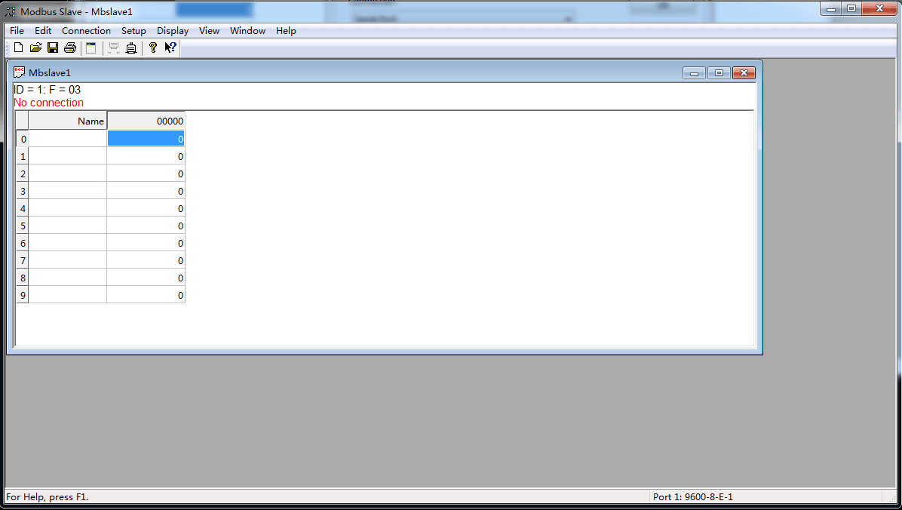

点开上方 connection，选择了连接协议为 Modbus TCP/IP,默认地址为 127.0.0.1 无需设置，到时候 Modbus Poll 就连这个地址，其他的端口为 502 和 Ipv4 默认。

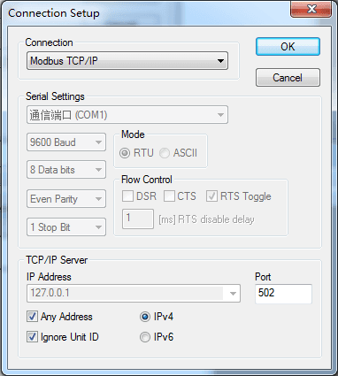

ID 默认为 1，是 Slave 的设备地址，F=03 代表 03 的功能码

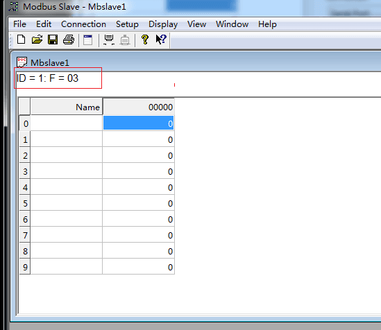

设置好一些供 Poll 读取的数据

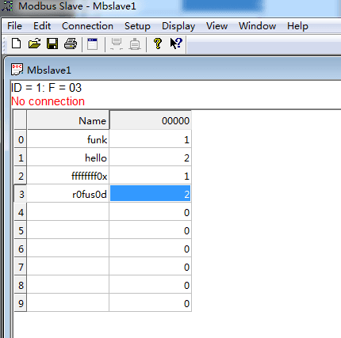

双击打开 ModbusPoll，打开后界面如下图所示。

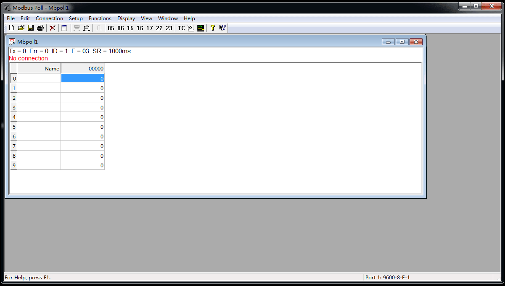

其中：Tx = 0 表示向主站发送数据帧次数；Error = 0 表示通讯错误次数；ID = 1 表示模拟的 Modbus 子设备的设备地址，图中地址为 1；F = 03 表示所使用的 Modbus 功能码；SR = 1000ms 表示扫描周期。红字部分，表示当前的错误状态，“No Connection” 表示未连接状态。

点开上方 connection，进行连接

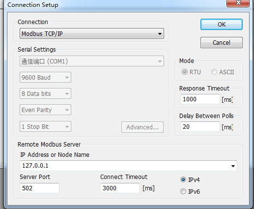

如下图, Modbus Poll 连接上 Slave，也读取到了 Slave 中设置好的寄存器的值，其中 Tx=34 代表向 PLC 发送数据帧的次数，Err =0 代表通讯错误次数，互相连接上之后就不会再出现 No connection 的红字。

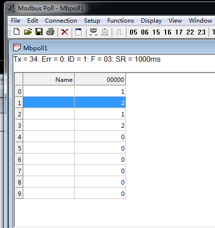

因为 Modbus 能访问一条数据链路上的 254 个设备，Poll 也支持读写同时来自不同设备的不同数据内容。

---

## Modbus Poll

Modbus 主机仿真器，用于测试和调试 Modbus 从设备。该软件支持 ModbusRTU、ASCII、TCP/IP。用来帮助开发人员测试 Modbus 从设备，或者其它 Modbus 协议的测试和仿真。它支持多文档接口，即，可以同时监视多个从设备 / 数据域。每个窗口简单地设定从设备 ID，功能，地址，大小和轮询间隔。你可以从任意一个窗口读写寄存器和线圈。如果你想改变一个单独的寄存器，简单地双击这个值即可。或者你可以改变多个寄存器 / 线圈值。提供数据的多种格式方式，比如浮点、双精度、长整型（可以字节序列交换）。

**参数设置**

单击菜单 [Setup] 中[Read/Write Definition.. F8]进行参数设置，会弹出参数设置对话框。

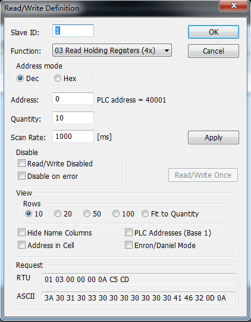

其中
- Slave 为要访问的 Modbus 从站（从机）的地址，对应主窗口（主画面）中的 ID 值，默认为 1。
- Function 为寄存器功能码的选择，共四种, 分别对应关系如下：
    | 代码 | 中文名称 | 寄存器 PLC 地址 | 位操作/字操作 | 操作数量 |
    | - | - | - | - | - |
    | 01 | 读线圈状态 | 00001-09999 | 位操作 | 单个或多个 |
    | 02 | 读离散输入状态 | 10001-19999 | 位操作 | 单个或多个 |
    | 03 | 读保持寄存器 | 40001-49999 | 字操作 | 单个或多个 |
    | 04 | 读输入寄存器 | 30001-39999 | 字操作 | 单个或多个 |
    | 05 | 写单个线圈 | 00001-09999 | 位操作 | 单个 |
    | 06 | 写单个保持寄存器 | 40001-49999 | 字操作 | 单个 |
    | 15 | 写多个线圈 | 00001-09999 | 位操作 | 多个 |
    | 16 | 写多个保持寄存器 | 40001-49999 | 字操作 | 多个 |
- Address 为寄存器起始地址，默认从 0 开始。
- Length 为寄存器连续个数，默认为 10 个，对应组态软件的通道数量。
- Scan Rate 为读取数据周期，单位毫秒，默认为 1000ms。

设置完成单击 OK 按钮，模拟窗口将显示定义的寄存器列表。

**显示设置**

数据显示方式设置 : 默认情况下，寄存器数据的显示方式为 Signed 方式 (16 进制无符号二进制)，数据范围为 - 32768~32767。如果用户要以其他数值方式显示，可以通过菜单 [Display] 进行选择设置，如下图所示：

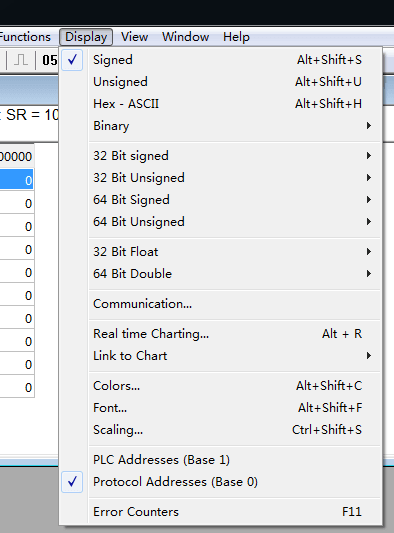

地址格式设置 : Modbus Slave 默认使用 PLC 地址，[Display]菜单中 [PLC Addresses(Base 1)] 为默认选中状态，默认寄存器的起始地址为 1 开始，此点与组态软件的 Modbus 串口和 TCP 数据转发驱动是相同的。如果测试时需要设置起始地址为 0 开始，可选择[Protocol Addresses(Base 0)]。一般情况下使用默认 PLC 地址即可。

**串口连接**

单击菜单 [Connection] 中[Connect.. F3]进行串口连接

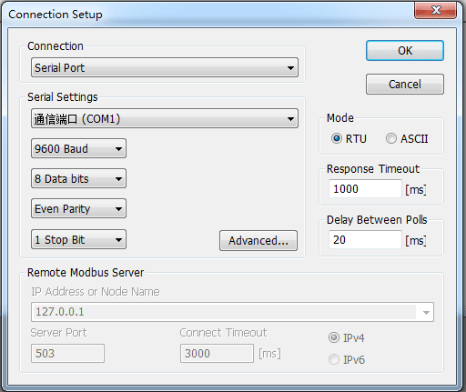

其中：
- 端口1，表示使用的串口 (COM1)，根据实际情况选择不同的串口或者 TCP/IP 进行连接。
- Mode，表示 Modbus 协议模式，使用串口时有效；使用 TCP/IP 时自动为 TCP 模式。
- Response Timeout，表示读取超时时间，从站在超时时间内没有返回数据，则认为通讯失败。
- Delay Between Polls，每次扫描的最小间隔时间，默认为 10ms。
- Remote Server，表示 TCP/IP 模式时的终端从站设备的网络设置。
- IP Address，表示 TCP/IP 模式时从站 IP 地址。
- Port，表示 TCP 模式时从站网络端口。
- 用户可根据需要对参数进行设置，默认为：串口 1、波特率 9600、数据位 8 位、无校验位、1 位停止位。确认设置后点击 OK 按钮即可。如果连接并读取正确，此时主窗口将显示读取寄存器的相关信息。

**寄存器值改变**

在主窗口寄存器地址上双击鼠标，弹出修改对话框

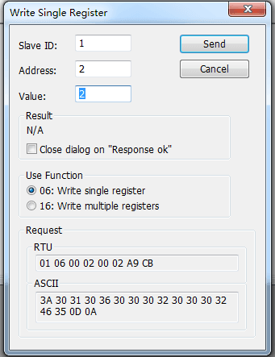

在 Value 输入框中输入值确认即可。范围为 -32768~32767。

其中：
- Slave 为要访问的 Modbus 从站的地址，对应主画面中的 ID 值，默认为 1。
- Address 为当前操作的寄存器的地址。
- Use Function 为所使用的功能码，可以选择 06 或 16 功能码进行写入。

**查看通讯数据帧**

单击 [Display] 菜单中的 [Communication…] 或者单击工具栏上按钮，可以调出串口收发数据帧监视信息对话框“CommunicationTraffic”，用来查看分析收发的数据帧。

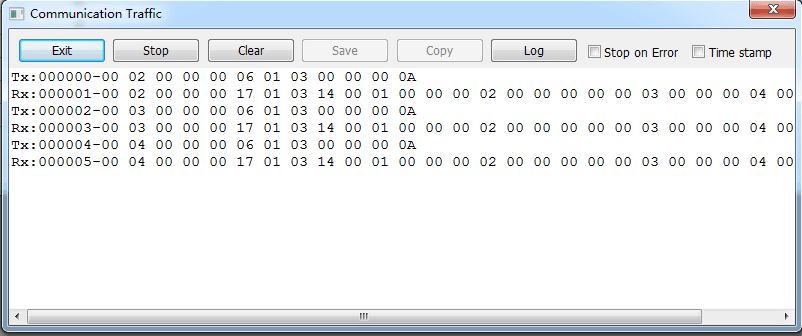

其中：前 6 位为数据帧的序号。Rx 表示接收的数据帧。Tx 表示发送的数据帧。

**断开连接**

点击 [Disconnect  F4] 即可断开连接结束测试，此时主窗口中出现红色的“No Connection”表示未连接状态。

---

## Modbus Slave

Modbus 从设备仿真器，可以仿真 32 个从设备 / 地址域。每个接口都提供了对 EXCEL 报表的 OLE 自动化支持。主要用来模拟 Modbus 从站设备, 接收主站的命令包, 回送数据包。帮助 Modbus 通讯设备开发人员进行 Modbus 通讯协议的模拟和测试，用于模拟、测试、调试 Modbus 通讯设备。可以 32 个窗口中模拟多达 32 个 Modbus 子设备。与 Modbus Poll 的用户界面相同，支持功能 01, 02, 03, 04, 05, 06, 15, 16, 22 和 23，监视串口数据。

**参数设置**

单击菜单 [Setup] 中 [Slave Definition.. F2] 进行参数设置，会弹出参数设置对话框。

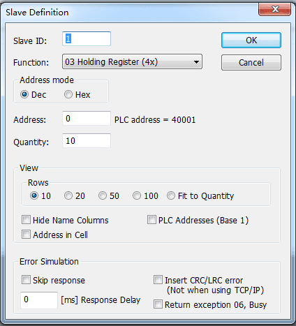

其中
- Slave 为 Modbus 从站地址，对应主画面中的 ID 值，默认为 1。
- Function 为寄存器功能码的选择，共四种, 分别对应关系如下：
    | 代码 | 中文名称 | 寄存器 PLC 地址 | 位操作/字操作 | 操作数量 |
    | - | - | - | - | - |
    | 01 | 读线圈状态 | 00001-09999 | 位操作 | 单个或多个 |
    | 02 | 读离散输入状态 | 10001-19999 | 位操作 | 单个或多个 |
    | 03 | 读保持寄存器 | 40001-49999 | 字操作 | 单个或多个 |
    | 04 | 读输入寄存器 | 30001-39999 | 字操作 | 单个或多个 |
    | 05 | 写单个线圈 | 00001-09999 | 位操作 | 单个 |
    | 06 | 写单个保持寄存器 | 40001-49999 | 字操作 | 单个 |
    | 15 | 写多个线圈 | 00001-09999 | 位操作 | 多个 |
    | 16 | 写多个保持寄存器 | 40001-49999 | 字操作 | 多个 |
- Address 为寄存器起始地址，默认从 0 开始。
- Length 为寄存器连续个数，默认为 10 个，对应组态软件的通道数量。
设置 OK 按钮，模拟窗口将显示定义的寄存器列表：

其中：ID，表示模拟的 Modbus 子设备的设备地址；F，表示功能码 点击对应的寄存器，即可修改对应寄存器的值或者状态。比如 2 寄存器值修改成 9，9 寄存器值修改成 100。

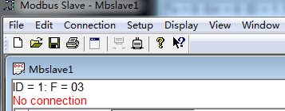

**显示设置**

数据显示方式设置： 默认情况下，寄存器数据的显示方式为 Signed 方式 (16 进制无符号二进制)，数据范围为范围为 -32768~32767。如果用户要以其他数值方式显示，可以通过菜单“Display” 进行选择设置，如下图所示：

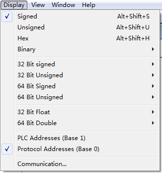

地址格式设置： Modbus Slave 默认使用 PLC 地址，“Display”菜单中 “PLC Addresses(Base 1)” 为默认选中状态，默认寄存器的起始地址为 1 开始，此点与组态软件的 Modbus 串口和 TCP 数据转发驱动是相同的。如果测试时需要设置起始地址为 0 开始，可选择“Protocol Addresses(Base 0)”。一般情况下使用默认 PLC 地址即可。

**连接**

点击菜单 [Connection] 中[Connect.. F3]进行连接。弹出连接对话框

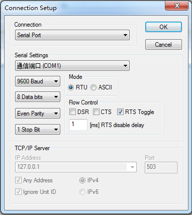

其中：
- 端口，表示使用的串口(COM2)，根据实际情况选择不同的串口或者 TCP/IP 进行连接
- Mode，表示 Modbus 协议模式，使用串口时有效；使用 TCP/IP 时自动为 TCP 模式
- Flow Control，表示流控制，串口模式时有效；
- Ignore Unit ID，表示 TCP 模式时忽略无效的组编号
- 用户可根据需要对串口参数进行设置，默认为: 串口 1, 波特率 9600, 数据位 8 位，无校验位，1 位停止位。
- 确认设置后点击 “OK” 按钮即可。此时主窗口中红色的 “No connection” 表示未连接状态的信息消失，表明从站处于正常连接状态。

**寄存器值改变**

在主窗口寄存器地址上双击鼠标，弹出修改对话框

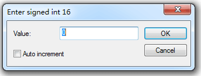

在输入框中输入值确认即可。范围为 -32768~32767。 其中：Auto increment 选项钩选上后，对应寄存器的值可以每 1 秒种增加 1。

**查看通讯数据帧**

点击 [Display] 菜单中的 [Communication…], 可以调出串口收发数据帧监视信息对话框，用来查看分析收发的数据帧。如下图所示：

其中：前 6 位为数据帧的序号。Rx：表示接收数据帧。Tx: 表示发送数据帧。

**断开连接**

点击 [Disconnect F4] 即可断开连接结束测试，此时主窗口中出现红色的 [No connection] 表示未连接状态。

---

# Modbus 主机/从机模拟

安装 vspd 虚拟串口工具。
- https://www.virtual-serial-port.org/

通过工具添加 COM2 和 COM3 两个端口。

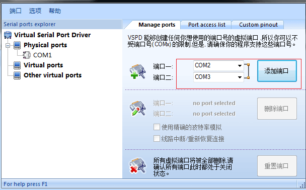

接下来打开已经安装的 modbuspoll 和 modbus slave 软件，分别按 [F8] 配置主从端的相关配置，如图：

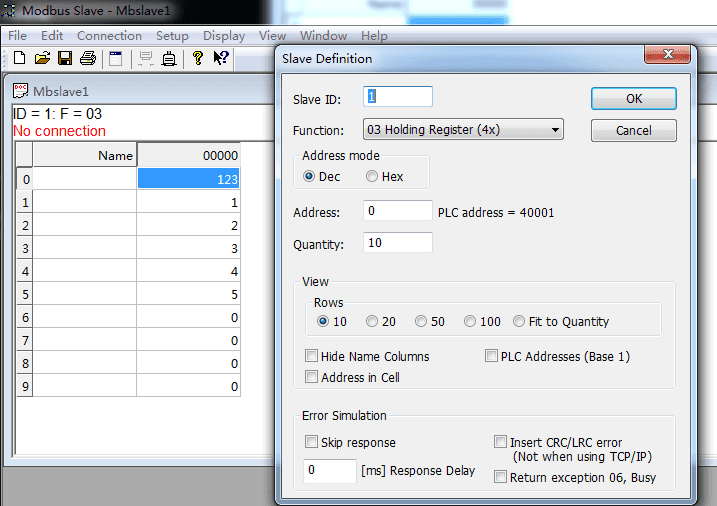

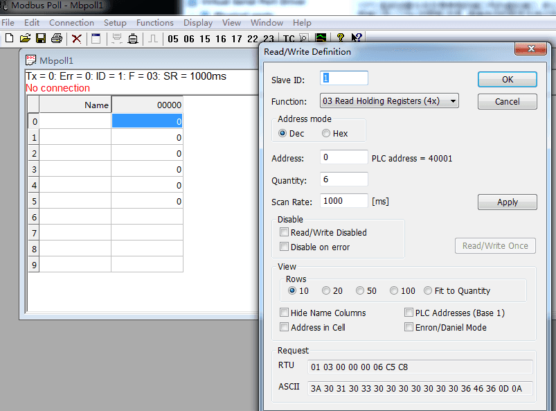

接下来按分别按 “F3” 进行连接，注意修改连接界面的端口，主机选择我们虚拟出来的 com2, 从机选择 com3 端口，因为我只用到了 RTU 模式，所以其他选项如波特率 9600, 比特位 8，校验位 1，无等价位等可以保持不变，然后点击确定进行连接，未连接成功窗口第二行会给出提示信息。

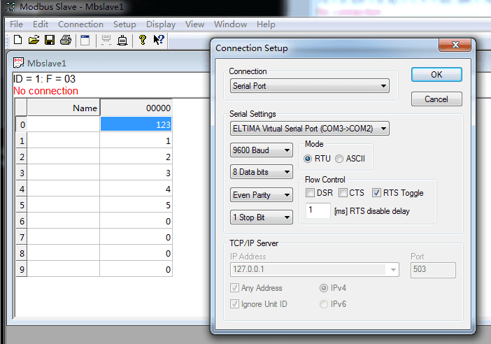

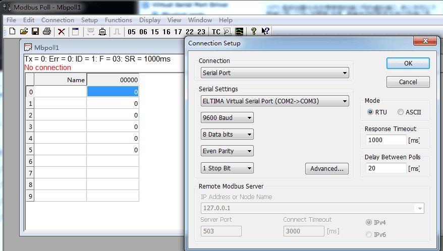

通讯开始，主机端显示：TX=99，Err=0，ID=1，F=03，SR=1000ms。意思是，发送 99 次命令，错误次数，从机 ID，功能号，轮询间隔。

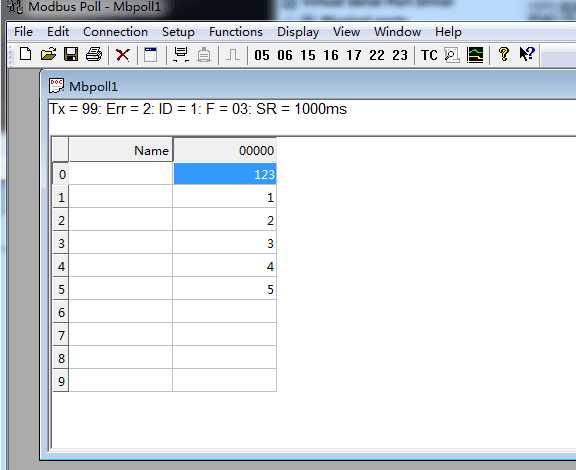

使用工具栏的 [Communication Traffic] 按钮，可以显示出当前发送命令和接受的数据。

---

# Modbus Poll 连接 Schneider 设备

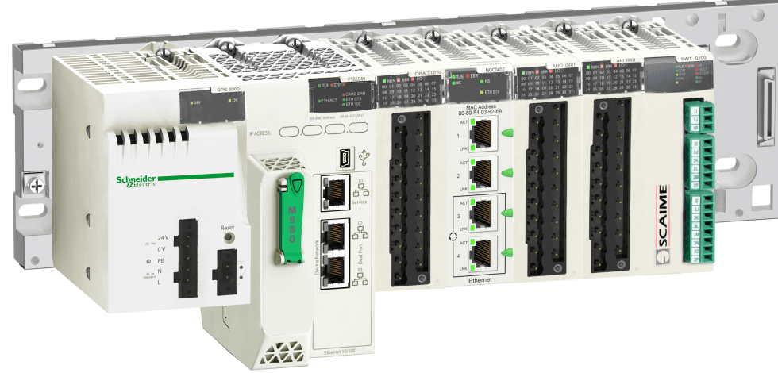

在编程软件上查看 PLC 的 IP 地址，用于 Modbus Poll 的连接

模拟器连接 Slave（PLC）需要知道设备 ID, 查看设备 ID

设置 Modbus Poll 连接 PLC 的 IP、ID 以及 Function 进行设置，最终连接到 PLC 设备的寄存器区域读取到数据。

---

**Source & Reference**
- [Modbus PLC攻击分析：从Modbus PollSlave到M340](https://www.freebuf.com/ics-articles/234845.html)
- [Modbus测试工具ModbusPoll与Modbus Slave使用方法](https://www.cnblogs.com/xiaosong0206/p/11088726.html)
