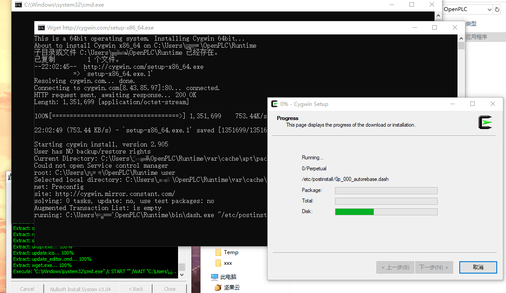
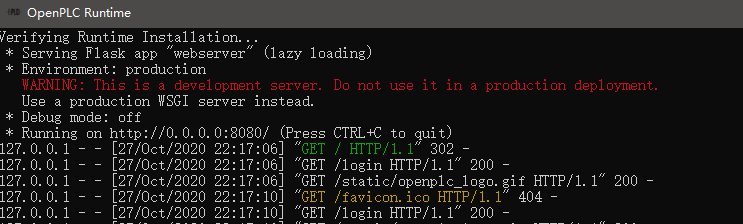
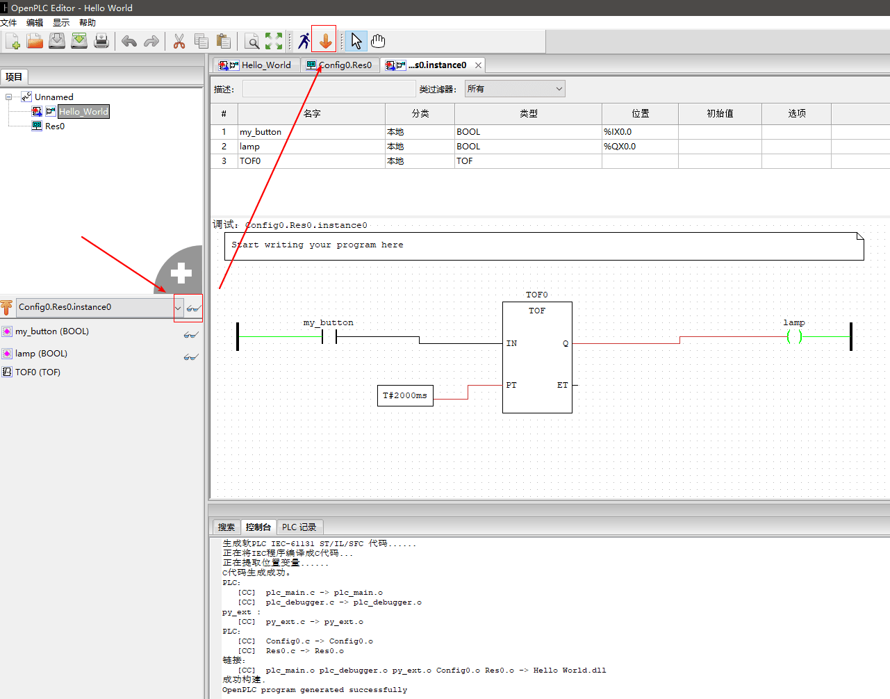
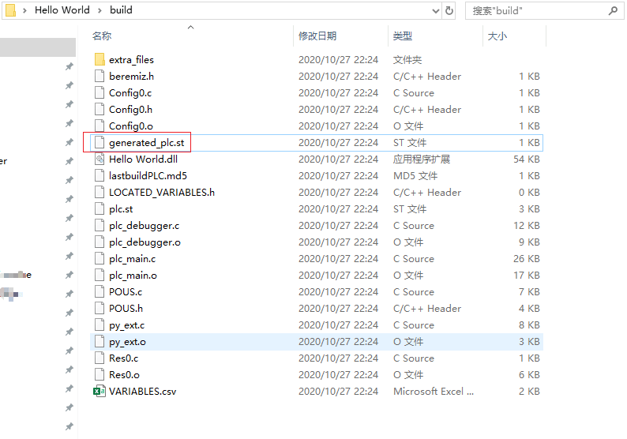
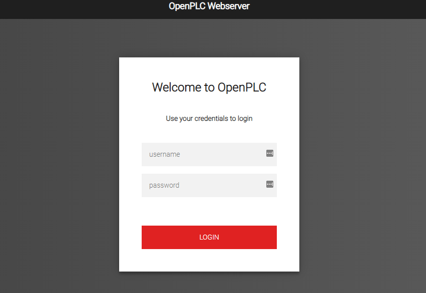
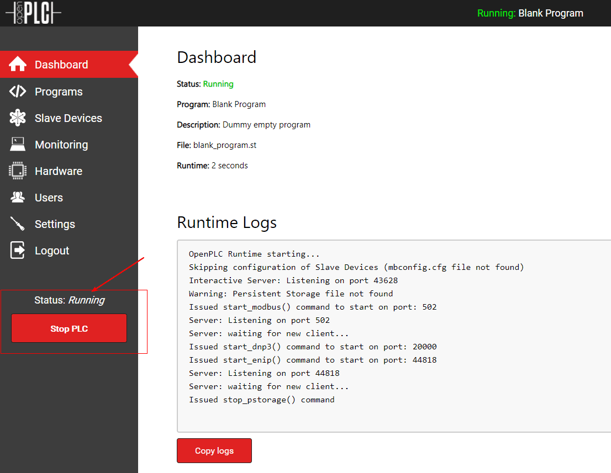
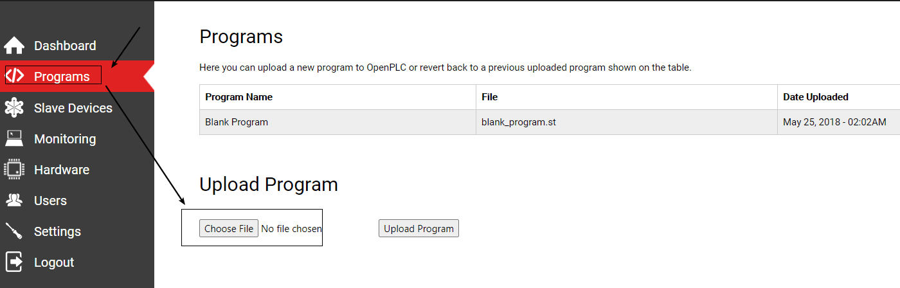
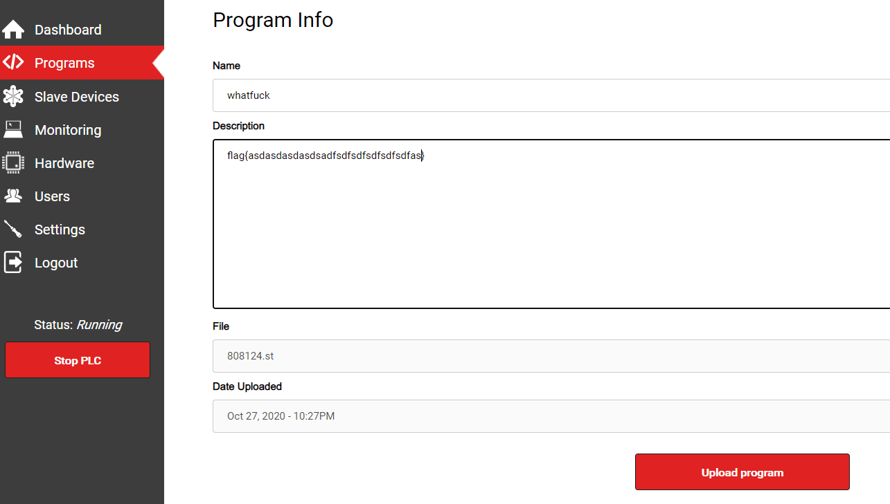
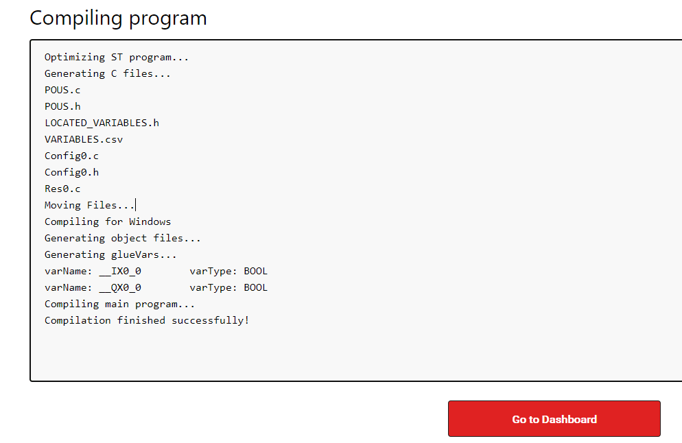

# OpenPLC 环境搭建

    

---

**实验环境**

`环境仅供参考`

- [操作系统] Microsoft Windows 10 企业版 LTSC - 10.0.17763
- [魔法软件] SSTap

---

# 前言

我除了写公众号文章以外, 一般是不会写前言的, 但是这个实验记录我还是要记一下, 在国内, 你要在 windows 上装 OpenPLC 最好学会挂全局代理, 无论是直接拨 VPN, 还是通过 Proxifier 走隧道, 都可以。

没挂代理之前几个 cygwin 模块,python 模块装下来老夫都快圆寂了.

---

# OpenPLC

OpenPLC 项目由三部分组成：Runtime(程序运行环境)，Editor(下位机程序编写工具)和 HMI Builder(上位机程序编写工具)。

**运行环境**

可以运行嵌入式操作平台如 Raspberry PI(树莓派)、Unipi Industrial Platform 等平台也可以运行 X86 平台，模拟一个真实 plc 基本控制功能，可以进行数字量和模拟量的控制。并且 openplc 已经内置嵌入式平台 I/O 硬件的驱动。Openplc 内部已经和嵌入式 I/O 进行了地址映射，可以对 I/O 进行操作与控制。Openplc 支持 modbus 协议，支持读线圈(1)、读输入(2)、读保存寄存器(3)、读输入寄存器(4)、写线圈(5)、写寄存器(6)、写多线圈(15)、写多寄存器(16)等基本功能码。目前支持 modbus 和 dnp3 协议。

**下位机编程**

openplc 提供配套 plc 下位机编程工具，支持梯形图(LD)，功能块图(FBD)，指令列表(IL)，结构化文本(ST)和顺序功能图(SFC)5 种编程语言，程序编写好后，能够将编译后的程序上传到嵌入式平台 (实plc) 或 X86 平台(软plc)，并在平台上执行 plc 程序运算。

**上位机编程**

openplc 提供配套 plc 上位机编程工具(ScadaBR)，支持组态软件开发，进行 plc 设备数据采集与监控。

ScadaBR 采用 modbus 协议与 plc 实时通信。

---

# 安装

访问软件官网 https://www.openplcproject.com/runtime/ , 下载 windows 版的

记得挂好代理,运行 exe 一路下一步

安装完毕后打开 OpenPLC Runtime

打开后会运行一个 http 服务

---

# 使用

创建一个测试项目,从官网下载 Hello World 项目 https://www.openplcproject.com/runtime/windows/

用 OpenPLC Editor 打开相关目录,点击 Generate program for OpenPLC Runtime 编译 ST 文件

可以在 build 文件夹下看到编译出的 generated_plc.st

然后访问 127.0.0.1:8080 ,默认账号密码 openplc openplc

开启 PLC 服务

单击“choose File”以最终将新的 .st 文件加载到 OpenPLC 中。

自定义描述, 这里有的比赛会加 flag

文件上传后，将直接回到仪表板屏幕，并且 OpenPLC 状态将更改为 “正在编译”。有关编译过程的日志显示在运行时日志框中。编译过程完成后，状态将变为 “正在运行”，新程序将运行。如果程序有错误，状态将更改为 “已停止”，并且错误将显示在运行时日志框中。

---

**Source & Reference**
- [一款可自定义多用途PLC设备的可用性分析](https://www.freebuf.com/articles/ics-articles/213018.html)
- [OPENPLC ON WINDOWS](https://www.openplcproject.com/runtime/windows/)
- [CREATING YOUR FIRST PROJECT](https://www.openplcproject.com/reference/basics/first-project.html)
- [UPLOADING YOUR PROJECT TO OPENPLC](https://www.openplcproject.com/reference/basics/upload)
