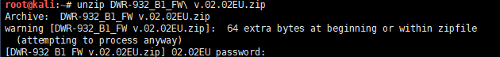
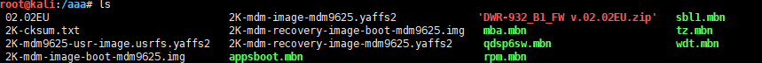
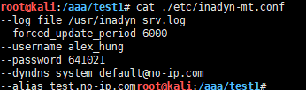
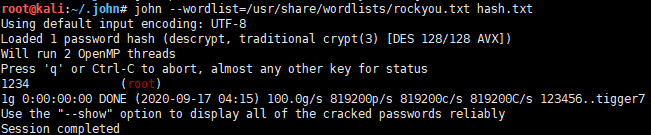
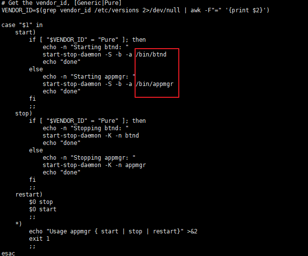

# Dlink_DWR-932B 路由器固件分析

<p align="center">
    
</p>

---

## 免责声明

`本文档仅供学习和研究使用,请勿使用文中的技术源码用于非法用途,任何人造成的任何负面影响,与本人无关.`

---

## 获得固件

访问 Dlink 的 ftp 服务器
- ftp://ftp.dlink.eu/

这里下载 DWR-932_fw_revB_2_02_eu_en_20150709.zip 文件
- ftp://ftp.dlink.eu/Products/dwr/dwr-932/driver_software/


---

## 提取固件

解压,得到 DWR-932_B1_FW v.02.02EU.zip , 无法直接解压缩，会发现该固件被加了密，这是厂商对该固件做了保护，防止逆向分析固件。



可以用爆破工具爆破密码,这里省略这一步,解压密码是 beUT9Z


解压完毕,查看固件文件



有一些 yaffs2 格式的文件,这个需要用 [unyaffs](https://code.google.com/archive/p/unyaffs/downloads) 工具来提取,下载 unyaffs,配置权限,解压,查看解压的文件
```bash
mkdir test1
mv unyaffs test1
mv 2K-mdm-image-mdm9625.yaffs2 test1
cd test1
chmod +x unyaffs
./unyaffs 2K-mdm-image-mdm9625.yaffs2
```


---

## 信息挖掘

接下来,在提取的文件中挖掘一些有用的信息
```bash
find . -name "*.conf"
find . -name "shadow"
find . -name "passwd"
find . -name "*config*"
find . -name "*history*"
find . -name "*ssh*_config*"
find . -name "*ssh_host*"
```


在 inadyn-mt.conf 这个文件中找到 no-ip 应用的配置



查看 shadow 文件


这里可以使用 hashcat 或 John the Ripper 爆破 root 账号的密码
```
root:aRDiHrJ0OkehM:16270:0:99999:7:::
```



可以看到 root 密码是 1234

---

使用 firmwalker 工具来自动化遍历该固件系统中的所有可疑文件
```bash
git clone https://github.com/craigz28/firmwalker.git
./firmwalker.sh test1
```

---

## 查看启动项

```bash
cd etc/init.d
ls -l
total 252
-rwxr-xr-x 1 root root  2482 Sep 17 03:55 adbd
-rwxr-xr-x 1 root root   250 Sep 17 03:55 alignment.sh
-rwxr-xr-x 1 root root  4735 Sep 17 03:55 avahi-daemon
-rwxr-xr-x 1 root root  4490 Sep 17 03:55 avahi-dnsconfd
-rwxr-xr-x 1 root root   492 Sep 17 03:55 banner.sh
-rwxr-xr-x 1 root root  1529 Sep 17 03:55 bootlogd
-rwxr-xr-x 1 root root  1680 Sep 17 03:55 bootmisc.sh
-rwxr-xr-x 1 root root   681 Sep 17 03:55 busybox-cron
-rwxr-xr-x 1 root root  3229 Sep 17 03:55 checkroot.sh
-rwxr-xr-x 1 root root   151 Sep 17 03:55 chgrp-diag
-rwxr-xr-x 1 root root  1591 Sep 17 03:55 data-init
-rwxr-xr-x 1 root root  2781 Sep 17 03:55 dbus-1
-rwxr-xr-x 1 root root   526 Sep 17 03:55 devpts.sh
-rwxr-xr-x 1 root root   408 Sep 17 03:55 diagrebootapp
-rwxr-xr-x 1 root root  2674 Sep 17 03:55 dropbear
-rw-r--r-- 1 root root  1123 Sep 17 03:55 functions
-rwxr-xr-x 1 root root   510 Sep 17 03:55 halt
-rwxr-xr-x 1 root root   270 Sep 17 03:55 hostname.sh
-rwxr-xr-x 1 root root  2402 Sep 17 03:55 hwclock.sh
-rwxr-xr-x 1 root root   348 Sep 17 03:55 keymap.sh
-rwxr-xr-x 1 root root   169 Sep 17 03:55 mdev
-rwxr-xr-x 1 root root   168 Sep 17 03:55 modem-shutdown
-rwxr-xr-x 1 root root   878 Sep 17 03:55 modutils.sh
-rwxr-xr-x 1 root root   859 Sep 17 03:55 mountall.sh
-rwxr-xr-x 1 root root  1399 Sep 17 03:55 mountnfs.sh
-rwxr-xr-x 1 root root   783 Sep 17 03:55 netmgrd
-rwxr-xr-x 1 root root  1463 Sep 17 03:55 networking
-rwxr-xr-x 1 root root  5114 Sep 17 03:55 populate-volatile.sh
-rwxr-xr-x 1 root root 10835 Sep 17 03:55 power_config
-rwxr-xr-x 1 root root  1136 Sep 17 03:55 qmi_shutdown_modemd
-rwxr-xr-x 1 root root   610 Sep 17 03:55 qmuxd
-rwxr-xr-x 1 root root   368 Sep 17 03:55 qrngd
-rwxr-xr-x 1 root root  4346 Sep 17 03:55 rc
-rwxr-xr-x 1 root root   525 Sep 17 03:55 rcS
-rwxr-xr-x 1 root root  2015 Sep 17 03:55 reboot
-rwxr-xr-x 1 root root   159 Sep 17 03:55 reset_reboot_cookie
-rwxr-xr-x 1 root root   585 Sep 17 03:55 rmnologin.sh
-rwxr-xr-x 1 root root   609 Sep 17 03:55 run-postinsts
-rwxr-xr-x 1 root root   321 Sep 17 03:55 save-rtc.sh
-rwxr-xr-x 1 root root   438 Sep 17 03:55 sendsigs
-rwxr-xr-x 1 root root   978 Sep 17 03:55 set-hwver.sh
-rwxr-xr-x 1 root root  1836 Sep 17 03:55 shutdown
-rwxr-xr-x 1 root root   578 Sep 17 03:55 single
-rwxr-xr-x 1 root root  2178 Sep 17 03:55 start_appmgr
-rwxr-xr-x 1 root root  2138 Sep 17 03:55 start_ipacm_le
-rwxr-xr-x 1 root root   764 Sep 17 03:55 start_QCMAP_ConnectionManager_le
-rwxr-xr-x 1 root root  1001 Sep 17 03:55 start_qti_le
lrwxrwxrwx 1 root root     8 Sep 17 03:55 stop-bootlogd -> bootlogd
-rwxr-xr-x 1 root root   540 Sep 17 03:55 sysfs.sh
lrwxrwxrwx 1 root root    14 Sep 17 03:55 syslog -> syslog.busybox
-rwxr-xr-x 1 root root  1559 Sep 17 03:55 syslog.busybox
-rwxr-xr-x 1 root root   659 Sep 17 03:55 thermal-engine
-rwxr-xr-x 1 root root   516 Sep 17 03:55 umountfs
-rwxr-xr-x 1 root root   686 Sep 17 03:55 umountnfs.sh
-rwxr-xr-x 1 root root  1349 Sep 17 03:55 urandom
-rwxr-xr-x 1 root root  5005 Sep 17 03:55 usb
-rwxr-xr-x 1 root root  8116 Sep 17 03:55 wlan
```

这里可以看一下 `start_appmgr` 脚本，mgr 一般就是主控程序的意思
```
less start_appmgr
```



该脚本会在开机的时候以服务的形式运行 `/bin/appmgr` 程序。

同时该脚本还会开启 telnet 服务


---

## appmgr 分析

用 IDA 打开 `/bin/appmgr` 程序看看

main 函数下 F5,可以发现有一个线程会持续监听 0.0.0.0:39889（UDP），并等待传入控制命令,如果某个用户向目标路由器发送了一个 `HELODBG` 字符串，那么路由器将会执行 `/sbin/telnetd -l /bin/sh` ，并允许这名用户在未经身份验证的情况下以 root 用户的身份登录路由器。


**默认 admin 账号**

搜索 mod_sysadm_config_passwd 函数


路由器的管理员账号。设备的管理员账号默认为“admin”，而密码同样也是“admin”。

**默认 WPS PIN 码**

搜索 wifi_get_default_wps_pin 函数


默认配置下，该路由器 WPS 系统的 PIN 码永远都是 `28296607` 因为这个 PIN 码是硬编码在 `/bin/appmgr` 程序中

---

## fotad 分析

路由器与 FOTA 服务器进行通信时的凭证数据硬编码在 `/sbin/fotad` 代码中，我们用 IDA 进行分析

搜索 sub_CAAC 函数,可以发现被 base64 过的凭证


用户/密码如下
```
cWRwYzpxZHBj        qdpc:qdpc
cWRwZTpxZHBl        qdpe:qdpe
cWRwOnFkcA==        qdp:qdp
```

---

## UPnP 安全问题

UPnP 允许用户动态添加防火墙规则。因为这种做法会带来一定的安全风险，因此设备通常都会对这种操作进行限制，以避免不受信任的客户端添加不安全的防火墙规则。

UPnP 的不安全性早在2006年就已经是众所周知的事情了。而该路由器中 UPnP 程序的安全等级仍然非常的低，处于局域网内的攻击者可以随意修改路由器的端口转发规则。

文件 `/var/miniupnpd.conf` 是由 `/bin/appmgr` 程序生成的：

搜索 sub_2AE0C 函数


该程序会生成 `/var/miniupnpd.conf`：
```
ext_ifname=rmnet0
listening_ip=bridge0
port=2869
enable_natpmp=yes
enable_upnp=yes
bitrate_up=14000000
bitrate_down=14000000
secure_mode=no      # "secure" mode : when enabled, UPnP client are allowed to add mappings only to their IP.
presentation_url=http://192.168.1.1
system_uptime=yes
notify_interval=30
upnp_forward_chain=MINIUPNPD
upnp_nat_chain=MINIUPNPD
```

---

## Source & Reference

- [【技术分享】Dlink DWR-932B路由器被爆多个安全漏洞](https://www.anquanke.com/post/id/84671)
- [IoT_Sec_Tutorial/02-静态分析IoT固件/README.md](https://github.com/G4rb3n/IoT_Sec_Tutorial/blob/master/02-%E9%9D%99%E6%80%81%E5%88%86%E6%9E%90IoT%E5%9B%BA%E4%BB%B6/README.md)
- [Rooting Dlink DWR-932 (4G router) | LinkedIn](https://www.linkedin.com/pulse/rooting-dlink-dwr-923-4g-router-gianni-carabelli/)
- [Multiple vulnerabilities found in the Dlink DWR-932B (backdoor, backdoor accounts, weak WPS, RCE ...)](https://pierrekim.github.io/blog/2016-09-28-dlink-dwr-932b-lte-routers-vulnerabilities.html)
