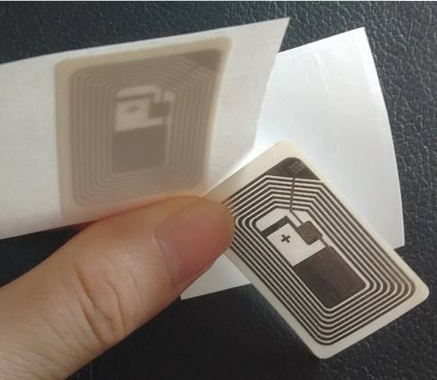
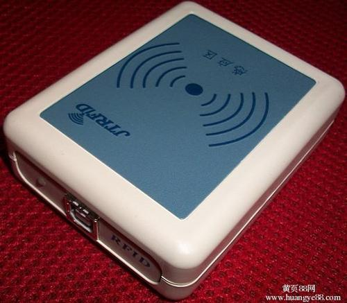
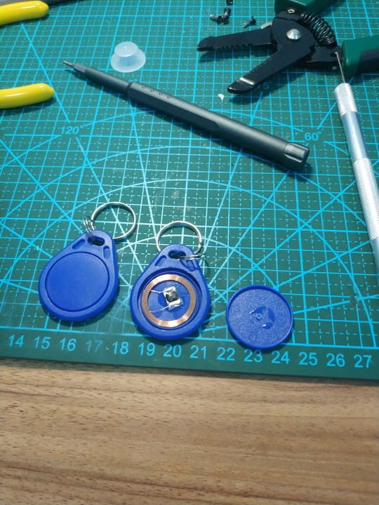
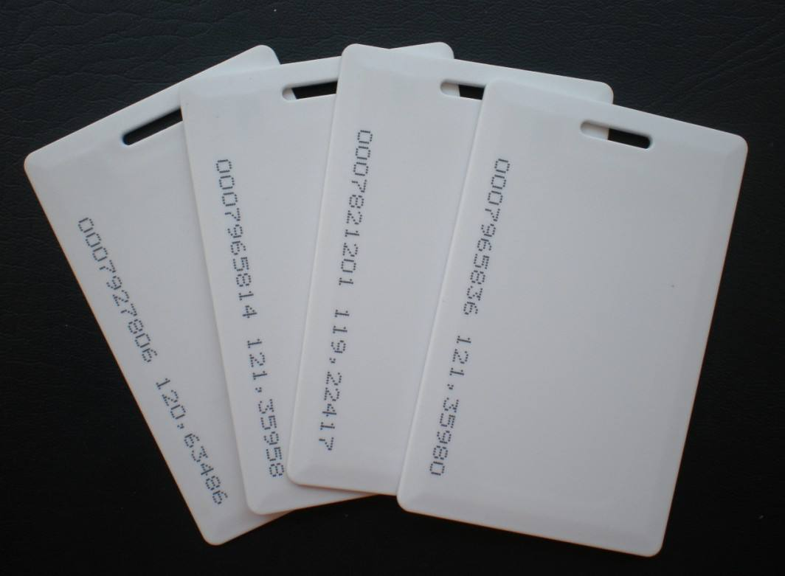
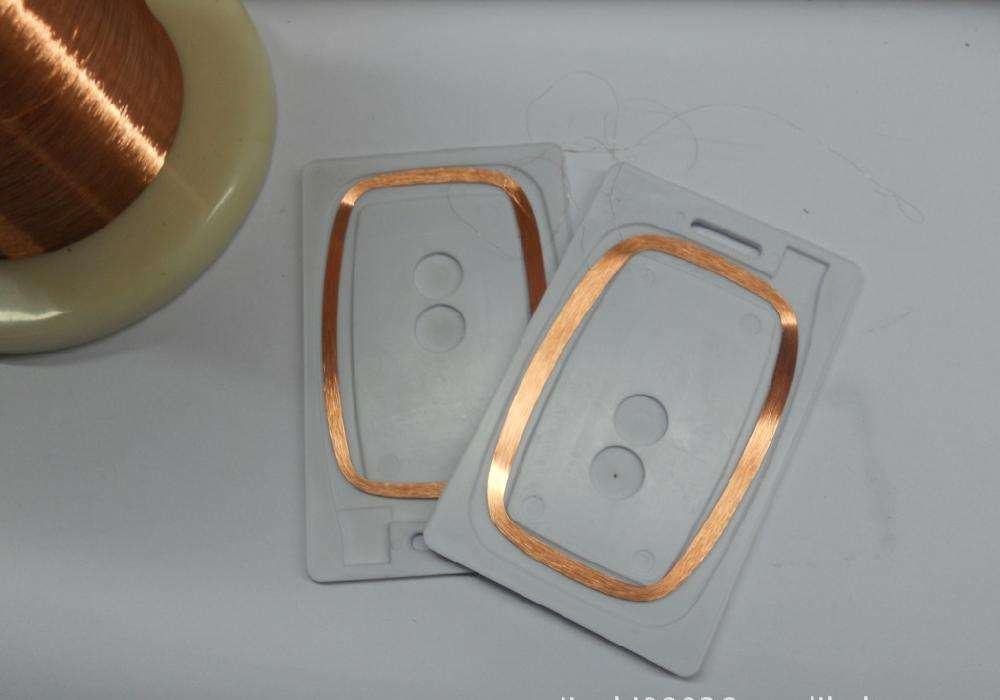
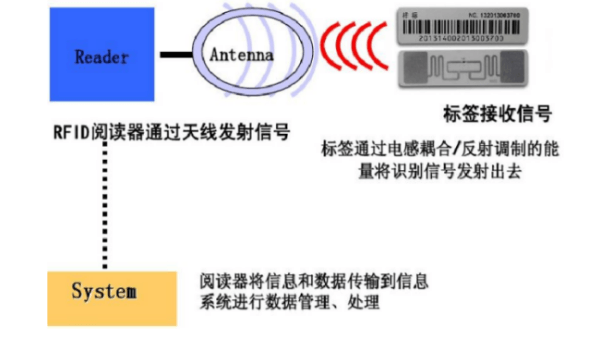

# RFID基础知识

> 文章作者 [Sarah-Briggs](https://github.com/Sarah-Briggs) & [r0fus0d](https://github.com/No-Github)

---

# 简介

RFID 英文全称 Radio Frequency Identification, 射频识别, 又称电子标签, 无线射频识别, 感应式电子晶片, 近接卡、感应卡、非接触卡、电子条码。

RFID 射频识别是一种非接触式的自动识别技术, 它通过射频信号自动识别目标对象并获取相关数据, 识别工作无须人工干预, 可工作于各种恶劣环境. RFID 技术可识别高速运动物体并可同时识别多个标签, 操作快捷方便.
短距离射频产品不怕油渍、灰尘污染等恶劣的环境, 可在这样的环境中替代条码, 例如用在工厂的流水线上跟踪物体. 长距射频产品多用于交通上, 识别距离可达几十米, 如自动收费或识别车辆身份等。

---

# RFID 构成

RFID的基本组成由三部分组成：

标签(Tag)：由耦合元件及芯片组成,每个标签具有唯一的电子编码,附着在物体上标识目标对象；

阅读器(Reader)：读取(有时还可以写入)标签信息的设备,可设计为手持式或固定式；

天线(Antenna)：在标签和读取器间传递射频信号（无论是阅读器还是射频卡片都带天线）。

---

# 射频卡

## 非接触式IC卡(高频)

非接触式 IC 卡又称射频卡，由 IC 芯片、感应天线组成，封装在一个标准的 PVC 卡片内，芯片及天线无任何外露部分。
是世界上最近几年发展起来的一项新技术, 它成功的将射频识别技术和 IC 卡技术结合起来, 结束了无源 (卡中无电源) 和免接触这一难题, 是电子器件领域的一大突破. 卡片在一定距离范围（通常为 5—10mm）靠近读写器表面，通过无线电波的传递来完成数据的读写操作。

1. 非接触性 IC 卡与读卡器之间通过无线电波来完成读写操作。二者之间的通讯频为 13.56MHZ。非接触性 IC 卡本身是无源卡，当读写器对卡进行读写操作是，读写器发出的信号由两部分叠加组成：一部分是电源信号，该信号由卡接收后，与本身的 L/C 产生一个瞬间能量来供给芯片工作。另一部分则是指令和数据信号，指挥芯片完成数据的读取、修改、储存等，并返回信号给读写器, 完成一次读写操作。读写器则一般由单片机，专用智能模块和天线组成，并配有与 PC 的通讯接口，打印口，I/O 口等，以便应用于不同的领域。

2. 非接触性智能卡内部分区为两部分：系统区（CDF）用户区（ADF）
    - 系统区：由卡片制造商和系统开发商及发卡机构使用。
    - 用户区：用于存放持卡人的有关数据信息。

3. 与接触式 IC 卡相比较, 非接触式卡具有以下优点：
    - 可靠性高非接触式 IC 卡与读写器之间无机械接触，避免了由于接触读写而产生的各种故障。例如：由于粗暴插卡，非卡外物插入，灰尘或油污导致接触不良造成的故障。 此外, 非接触式卡表面无裸露芯片，无须担心芯片脱落，静电击穿，弯曲损坏等问题，既便于卡片印刷，又提高了卡片的使用可靠性。
    - 操作方便,由于非接触通讯，读写器在 10CM 范围内就可以对卡片操作，所以不必插拨卡，非常方便用户使用。非接触式卡使用时没有方向性，卡片可以在任意方向掠过读写器表面，既可完成操作，这大大提高了每次使用的速度。
    - 防冲突,非接触式卡中有快速防冲突机制, 能防止卡片之间出现数据干扰，因此，读写器可以 “同时” 处理多张非接触式 IC 卡。这提高了应用的并行性，, 无形中提高系统工作速度。
    - 可以适合于多种应用,非接触式卡的序列号是唯一的，制造厂家在产品出厂前已将此序列号固化, 不可再更改。非接触式卡与读写器之间采用双向验证机制，即读写器验证 IC 卡的合法性，同时 IC 卡也验证读写器的合法性。非接触式卡在处理前要与读写器之间进行三次相互认证，而且在通讯过程中所有的数据都加密。此外，卡中各个扇区都有自己的操作密码和访问条件。接触式卡的存储器结构特点使它一卡多用，能运用于不同系统，用户可根据不同的应用设定不同的密码和访问条件。
    - 加密性能好,非接触式 IC 卡由 IC 芯片， 感应天线组成， 并完全密封在一个标准 PVC 卡片中， 无外露部分。非接触式 IC 卡的读写过程， 通常由非接触型 IC 卡与读写器之间通过无线电波来完成读写操作。非接触型 IC 卡本身是无源体， 当读写器对卡进行读写操作时， 读写器发出的信号由两部分叠加组成：一部分是电源信号，该信号由卡接收后， 与其本身的 L/C 产生谐振， 产生一个瞬间能量来供给芯片工作。另一部分则是结合数据信号，指挥芯片完成数据、修改、存储等， 并返回给读写器。由非接触式 IC 卡所形成的读写系统， 无论是硬件结构， 还是操作过程都得到了很大的简化， 同时借助于先进的管理软件，可脱机的操作方式，都使数据读写过程更为简单。

---

## 非接触式ID卡（低频或高频）

ID 卡即为 THRC12/13 只读式非接触 IC 卡，它靠读卡器感应供电并读出存储在芯片 EEPROM 中的唯一卡号，卡号在封卡前一次写入，封卡后不能更改。无源和免接触是该芯片两个最突出的特点，射频接口电路是关键的核心技术，它从读卡器接收射频能量，为芯片产生电源和时钟，并采用相移键控和加载调幅等技术实现卡与读卡器间的无线通讯。非接触式 ID 卡具有操作方便、快捷、可靠等突出优点，获得了广泛应用。

ID 卡主要特点
- 载波频率为 125KHZ（THRC12）或 13.56MHZ（THRC13）；
- 卡向读卡器传送数据的调制方式为加载调幅；
- 卡内数据编码采用抗干扰能力强的 BPSK 相移键控方式；
- 卡向读卡器数据传送速率为 3.9kbps（THRC12）或 6.62kbps(THRC13)；
- 数据存储采用 EEPROM，数据保存时间超过 10 年；
- 数据存储容量共 64 位，包括制造商、发行商和用户代码；
- 卡号在封卡前写入后不可再更改，绝对确保卡号的唯一性和安全性；
- THRC13 芯片除封装成标准卡片形状外，还可根据应用需要封装成筹码等多种形状。

**ID卡应用范围**

与接触式 IC 卡相比，非接触式 ID 卡无需插拔卡，避免了由于机械接触不良导致的各种故障，因而具有操作方便、快捷、可靠、寿命长等突出优点，特别适用于人流量大的场合。THRC12/13 非接触式 ID 卡主要可应用于身份识别和寻址控制，如门禁、保安、考勤等领域，也可扩展应用到展览会、公园、旅店、餐厅等公共场所的门票、优惠卡等。以及生产过程、邮政包裹、航空铁路运输、产品包装、交通等部门的物流、电子标签、防伪标志、一次性票证等众多领域。虽然它仅是一种只读卡，但利用后台计算机控制管理，即使是涉及收费管理的问题也可以在一定范围应用，如食堂就餐收费管理等。针对具体应用，可将持卡人的个人资料送入后台计算机，建立数据库并配置应用软件，使用时通过读卡器将读到的卡号送至后台计算机，从数据库中调出持卡人的个人资料，而后根据具体应进行操作，因而应用范围极其广阔。

## 常用的RFID卡类型

---

# 读写器

读写器主要功能
- 读取电子标签中储存的信息
- 向电子标签中写入信息
- 修改电子标签中的信息

电子标签与 RFID 读写器之间通过耦合元件实现射频信号的空间（无接触）耦合、在耦合通道内，根据时序关系，实现能量的传递、数据的交换。

发生在阅读器和电子标签之间的射频信号的耦合类型有两种。

电感耦合：变压器模型，通过空间高频交变磁场实现耦合，依据的是电磁感应定律。

电磁反向散射耦合：雷达原理模型，发射出去的电磁波，碰到目标后反射，同时携带回目标信息，依据的是电磁波的空间传播规律。

工作时 RFID 读写器发出查询信号，RFID 标签收到后，将信号的一部分能量用于标签内部工作电源，另一部分信号经过 RFID 标签内部电路调制后反射回 RFID 读写器。
