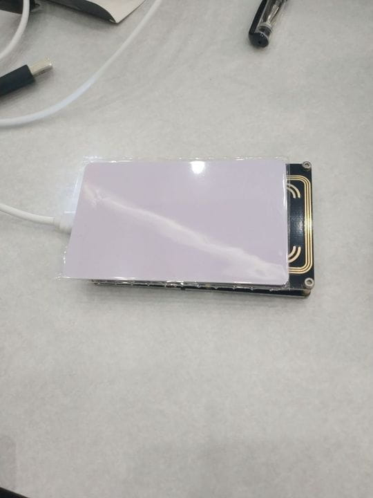
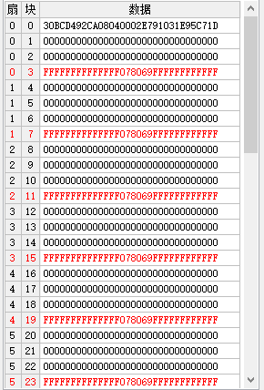
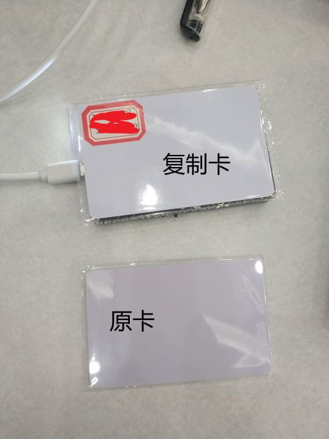
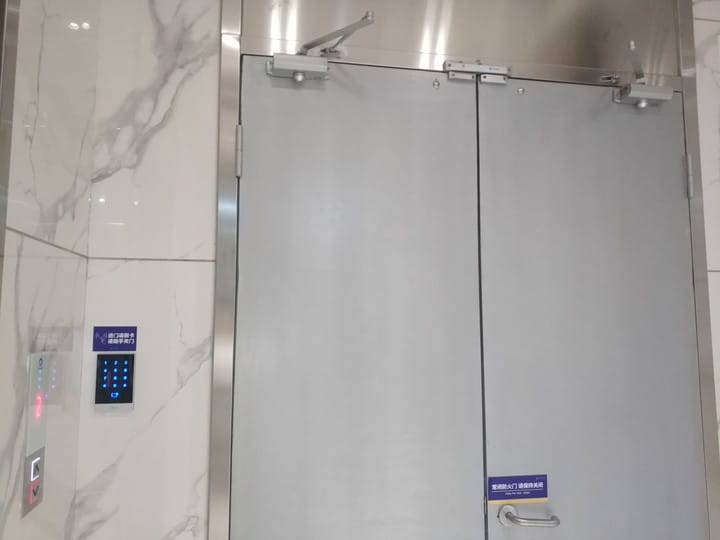
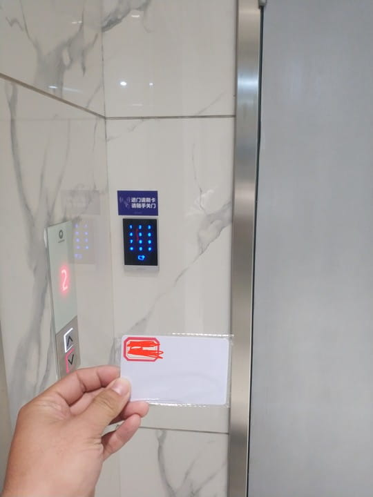
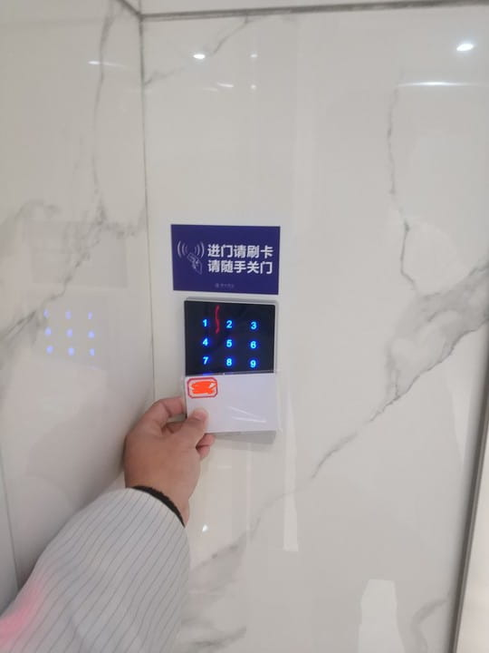
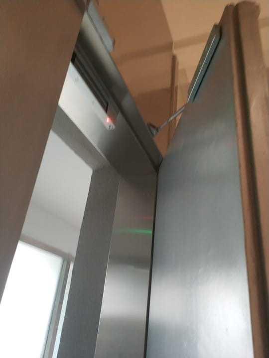

# RFID复制卡

> 文章作者 [Sarah-Briggs](https://github.com/Sarah-Briggs) & [r0fus0d](https://github.com/No-Github)

---

## 免责声明

`本文档仅供学习和研究使用,请勿使用文中的技术源码用于非法用途,任何人造成的任何负面影响,与本人无关.`

---

## 复制卡

我们准备相应的阅读器读取原门禁卡的数据（如果该卡没有保护机制那么里面的数据可以轻松读取出来，如果该卡有保护，就要破解它的密码然后进行读取数据）

我们只要将扇区的数据复制到一张新的卡里，就算取得成功（这是针对防御性能很低的门禁卡而言，像复杂的带有防火墙的门禁识别，或者是滚动码，破解就没有这么简单）（扇区数据有兴趣可以自己研究，这里不做赘述！）

接下来我们将数据复制到一张新卡（要所有的扇区数据写入成功才行），这里我做了标记以示区别！

---

## 现场检验

首先原来的门禁卡可以开门是毋庸置疑的，我们接下来主要进行检验这张复制卡。

该电子门可以通过输入密码和刷卡两种方式进入，现在是紧闭状态无法开门。

现在掏出我们准备的这个复制卡，进行刷卡操作。

由于无法上传视频，实际的情况是，卡刷上以后，密码机会“嘀”的响一声，然后门就可以打开了。图见如下：

