# WiFikiller

> 文章作者 [Sarah-Briggs](https://github.com/Sarah-Briggs) & [Atomic-Crash](https://github.com/Atomic-Crash) & [r0fus0d](https://github.com/No-Github)

---

# 简介

考虑到过往比赛的场景中，有部分参赛者使用手机热点共享给笔记本，从而上网查阅资料破坏比赛的公平性，这次考虑制作一个 WiFikiller。它的功能有攻击 wifi，这可以致使该 wifi 在这个区域内所有用户都无法连接。也可以批量复制 wifi，例如将一个 wifi 复制 20 份，这样手机就会搜到 20 个一样的 wifi，由于比赛时间紧迫，鉴于以上的功能，参赛者短期之内是无法破解的，该工具也辅助了比赛的公平性。

由于 ESP8266 是开源项目，网上有 wifikiller 各类固件源码，对于学习和制作非常的方便，不过功能大同小异，这里就不附链接地址，该模组烧录钓鱼项目源码也可以用作钓鱼，或者别的固件源码也可以用于破解 wifi 密码。这里硬件电路由我自己手工焊接，不采用 PCB 印刷 (PCB 印刷板体积会更小、外观更美观，缺点就是价格略贵，制作需要时间)，焊接好硬件电路以后烧录程序，接着就是调试电路 (烧录程序和调试电路会比较耗时，同时也很需要经验)，最后的成品大概巴掌大小，自带电源 (可充电)，非常的便携！

` 免责声明：该 WiFikiller 工具仅用于学习和交流使用，若用作其他用途造成违法和财产损失，与本人无关。`

`该文档较长，想学习制作请耐心读下去，想直接使用以及了解原理可以直接跳过硬件和调试部分`

---

# 硬件准备

1. 6×8的印刷万用板、1300mah聚合物电池一块(尺寸是102540)、微动按钮三个、微动开关一个
2. 0.96 OLED屏幕一块、ESP8266串口wifi模块、micro usb充电模块一个
3. 电烙铁、焊锡丝、导线若干、热熔胶枪

`注意：因为该电路板比较小，所以拼合比较紧凑，微动开关和OLED屏幕都是经过电磨机打磨过后才能装配上去`

## 硬件布局 & 焊接

硬件接线图：
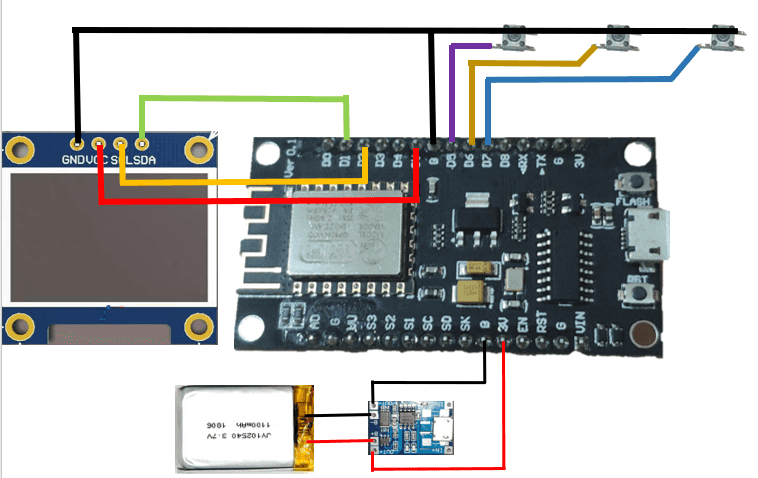

1. 首先作为一个需要进行按键操作的设备，这个必须要合理的布局排版，要适合人的操作习惯，同时不能影响各方面的使用，所以在这里我将所有的开关、按键布局到右侧 (考虑大部分人是用右手)。

2. ESP8266 串口 wifi 模块供电口、micro usb 充电模块的充电口设置到同一位置，以便充电和调试的同时不影响按键的使用。因为右边都是开关和按键，为了保护屏幕不受到损伤，需要避开经常按动的位置，在此基础上 OLED 屏幕就只能放在板子的左上角。还有一个细节就是，微动开关的开是向上拨动，也是为了电路的安全性考虑，向下拨动方便快速断开电源。以上就是本人电子类技术长期积攒下来的部分经验之谈。

图下主要是全部的硬件材料。

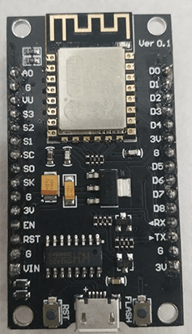

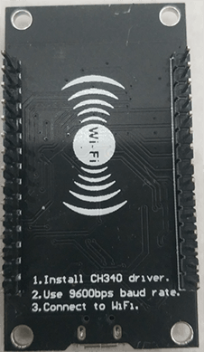

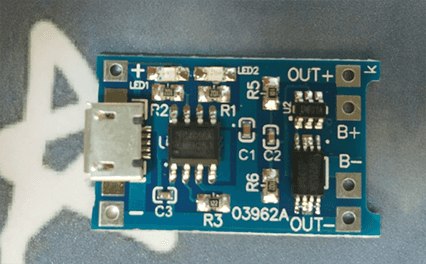

3. 先进行板子布局，因为电路没有设置短路保护而且充电模块紧贴ESP8266串口wifi模块，为了保险起见先进行充电模块焊接，与测试。

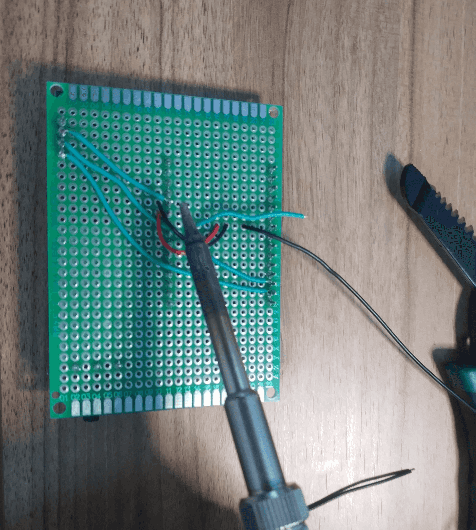

4. 在焊接完以后进行充电测试。在测试中发现充电模块虽然发热，但是在可接受范围之内，充电模块和聚合物电池能够正常工作并且电量已经充满。

5. 进行最后的总线路焊接，下图附成品，因为是飞线，所以外观上不如pcb的美观，强度也不如pcb高，但不影响功能使用。注意用热熔胶枪加固电池和充电模块。

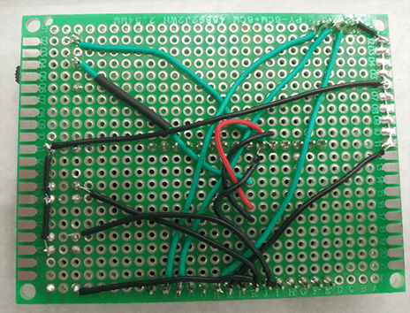

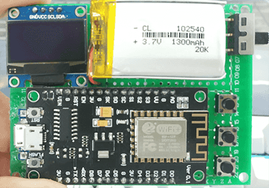

# 程序烧录

1. 先安装烧录所需要的环境，CH341SER.exe, 安装好之后在运行 ESP8266Flasher.exe 这个程序进行烧录，只需要一个根 micro 数据线即可，以下是详细的烧录方法。

` 注意参考 ESP8266 串口 wifi 模块背板上的烧录速率 `

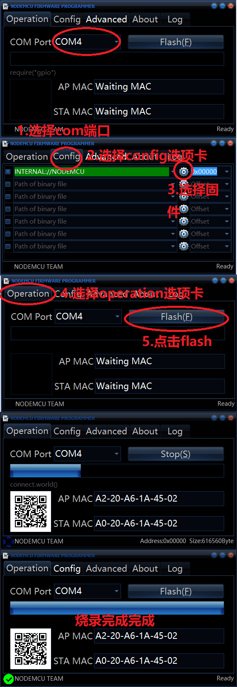

## 基础调试

1. 烧录程序以后，进行开机调试，我们先简单试一下按键功能，看一下按键是否能够正常使用，屏幕显示是否工作正常。` 第一次开机屏幕要过一会才亮，耐心等待，因为内部在加载和初始化程序 `

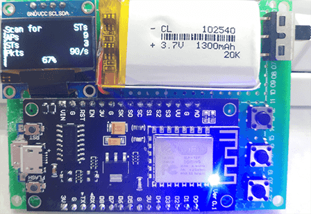

经过以上说明按键正常工作(按键功能和板子插口已经在图上标明)，显示屏也显示无误。

## 使用说明

主菜单下主要功能有五大块：

1. SCAN(扫描)

在该功能下可以设置扫描 AP+ST、单独扫描 APs、单独扫描 Stations

2. SELECT(选择 / 设置)

在该功能下可以选择 APs、stations、Names、SSIDs

进入 SSIDs 可以设置 CLONE APs(克隆 APs)、RANDOM MODE(随机模式)、REMOVE ALL(移除所有)

3. ATTACK(攻击)

在该功能下可以选择 DEAUTH(认证攻击)、BEACON(洪水攻击)、PROBE(探测请求洪水攻击)、START(开始)

4. PACKER MONITOR(数据包监视)，可以切换 0-14 频道 (ch0-ch14)

5. CLOCK(计时器)

一、克隆的使用

1. 在 SCAN 功能里首先扫描 APs 和 ST，之后返回主菜单
2. 其次在 SELECT 功能里自己选择要克隆的 wifi，同时在该功能里进入 SSIDs-->CLONE APs(克隆 APs)，然后退回主菜单
3. 在主菜单中选择 ATTACK(攻击)-->BEACON-->START(开始) 即可克隆
该功能会使被选中的 WiFi 克隆 60 个，从而达到干扰的目的。

二、攻击

1. 在 SCAN 功能里首先扫描 APs 和 ST，之后返回主菜单
2. 在 SELECT 功能里进入 APs，自己选择要攻击的 wifi，之后退出主菜单
3. 在主菜单中选择 ATTACK(攻击)-->BEACON-->START(开始) 即可攻击
该功能会一直攻击被选中的 wifi，致使设备连接不上该网络

三、登录 pwned 远程控制

1. 连接上 pwned 的无线网，密码是 deauther，在浏览器访问该 ip`192.168.4.1`，即可进行相应的操作。远程相对于直接操作硬件来说，可以 diy 克隆后 wifi 的名字，可以设置 pwned 的 wifi 属性等，主要功能大体不变，可以将这个硬件设备放在某处，在其 wifi 范围内进行远程操控，1300mha 的大容量电池可以提供长时间续航，连用几天无压力。

四、更多玩法

更多玩法要自己去尝试了，比如说设置白名单让部分设备可以用该 wifi 上网，剩下的设备就连接不上，等等。

## 部分实战展示

由于 DDOS 无线网不能直接用图片展示，这里只展示其余功能。

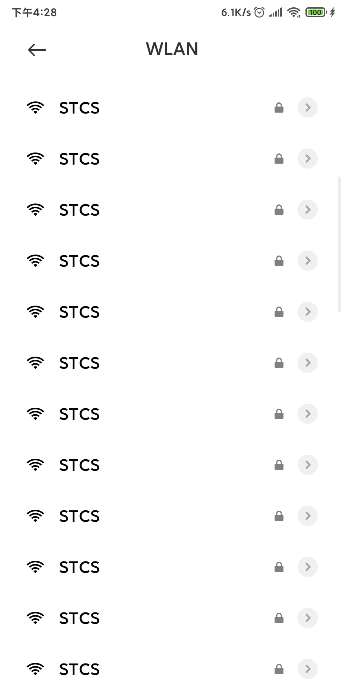

克隆 wifi 恶心下想连接外网的选手

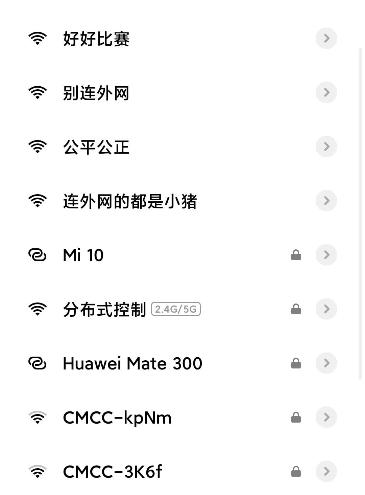

至于下面这个个性化的 wifi 也可以多弄点，根据实际使用自己定义。

当然对隐藏 ssid 直接连接的其实没用, 公平比赛还是靠自觉

---

# 原理

1. 首先要了解物联网无线通讯 wifi 模块 AP 和 STA 模式。

    Wifi 模块为串口或 TTL 电平转 WIFI 通信的一种传输转换模块，内置无线网络协议 IEEE802.11 协议栈以及 TCP/IP 协议栈，能够实现用户串口或 TTL 电平数据到无线网络之间的转换。

    Wifi 模块 包括两种类型的拓扑形式：基础网（Infra）和自组网（Adhoc）首先要了解两个基本概念：
    * AP，也就是无线接入点，是一个无线网络的创建者，是网络的中心节点。一般家庭或办公室使用的无线路由器就是一个 AP。

    * STA 站点，每一个连接到无线网络中的终端（如笔记本电脑、PDA 及其它可以联网的用户设备）都可称为一个站点。

    基于 AP 组建的基础无线网络（Infra）：Infra：也称为基础网，是由 AP 创建，众多 STA 加入所组成的无线网络，这种类型的网络的特点是 AP 是整个网络的中心，网络中所有的通信都通过 AP 来转发完成。

2. wifi 杀手的工作原理使用了 arp 欺骗的原理，假冒 ARP 回复来欺骗同一 WiFi 网络上的其他设备，让它们以为你的 wifikiller 是网关，然后 WiFiKill 丢掉它们的网络包。对于受害者来说，网络连接看上去似乎正常，但实际上已经无法访问互联网。一般来说可以直接攻击用户的 mac 地址。

3. WiFi 干扰

    一般来说，检测 WiFi 干扰行为将需要相对专业的设备才进行，而且有时甚至还需要使用到信号发射塔。但是 802.11 标准给我们提供了一种更简单的方法：去认证帧和去关联帧。
    这些 “去认证” 帧可以被用于多种不同的场景，而且该标准提供了超过 40 种预定义的原因代码。下面是一些合法的常用示例：

    > 1. 之前的身份认证失效；

    > 2. 由于不活动而导致的连接断开；

    > 3. 由于访问点无法处理当前所有的关联 STA 而导致的连接断开；

    > 4. 由于 SAT 不支持 BSSBasicRateSet 参数种的数据率而导致的拒绝连接；

    因为去认证帧属于管理帧的一种，所以它们是没有经过加密的，而攻击者甚至可以在无需连接该网络的情况下伪造这种帧。信号范围内的攻击者可以向目标用户所连接的热点发送连续的去认证帧来达到干扰 WiFi 的目的。

    以上是部分 wifikiller 的工作原理，更深入就需要去学习 esp8266 的代码以及 wifi 通讯协议。

---

# 总结

该设备的优点是便携灵活可以配合终端使用，缺点就是对5G无线网无可奈何，对维护比赛的秩序起到了一定的作用。
