# DIY键盘嵌入指纹识别模块实验记录

> 文章作者 [Sarah-Briggs](https://github.com/Sarah-Briggs) & [Atomic-Crash](https://github.com/Atomic-Crash) & [r0fus0d](https://github.com/No-Github)

---

下面是原作者的文章链接
- https://www.ednchina.com/news/201906211001.html 感兴趣的朋友可以先看一下原帖，然后再看这篇文章，也许会有更多的帮助。

---

## 前期准备

按照原作者的设计，我们准备了下列材料：
1. USB HUB 一个
2. Arduino pro mini 开发板一块
3. 指纹识别模块 (FPM3X) 一个
4. 键盘 一把 (普通办公键盘或机械键盘即可，静电容、光轴键盘由于触发原理异于常规键盘，电路构造和通讯协议都可能存在差异，所以这里只考虑常规构造的键盘)
5. 杜邦线、热缩管若干

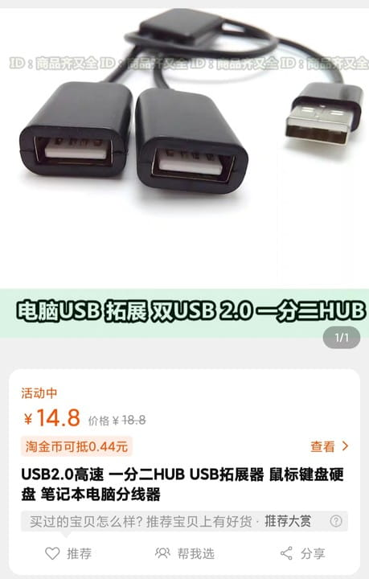

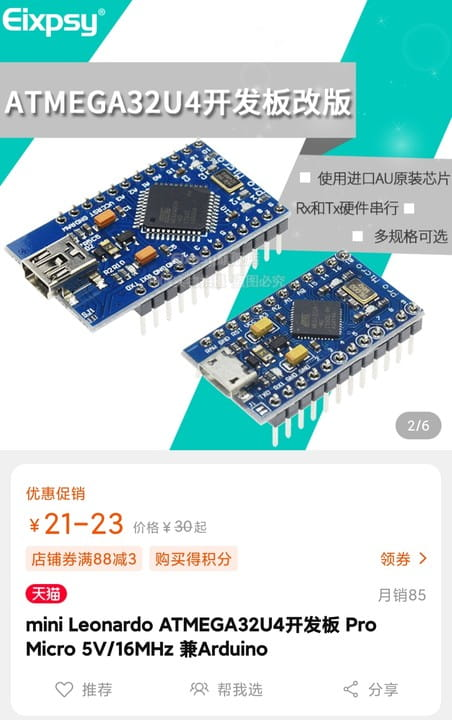

**为了能完全一致的实现本次 DIY，所选用的指纹识别模块和 Arduino pro mini 等，都和原作者使用的是同型号同规格**

(ps：这个指纹识别模块在某宝只有一家卖，还巨他妈贵，在某宝的相关推荐中我们还发现：一个成品的无线直插式 Windows 指纹解锁模块才 59 包邮)

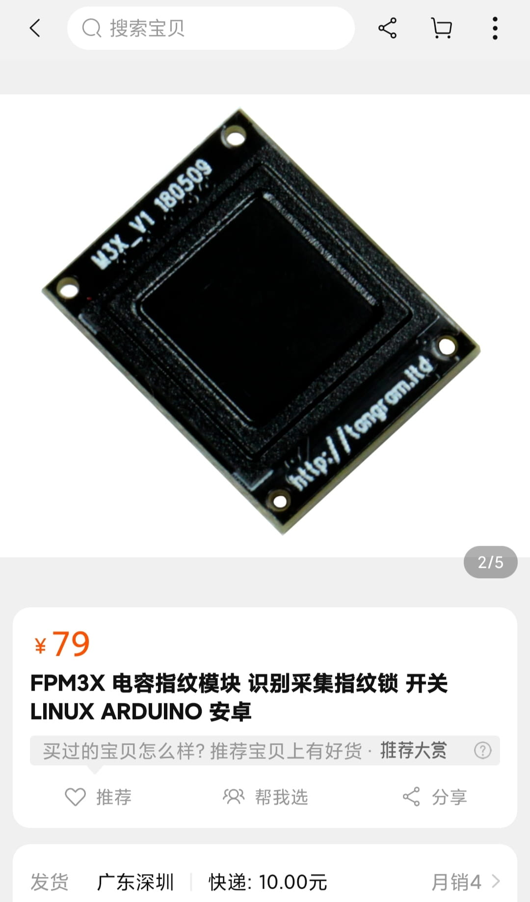

---

## 制作过程中所途遇到的麻烦

1. 首先不得不吐槽一波：Arduino pro mini 这个型号的开发板，小组采购的第一块 pro mini 到货以后，拆开包装拿来烧录程序，

   在正常情况下烧录时是会亮三个灯的(也是后来知道的)，结果这第一块板永远只亮一个灯，问卖家之后，答曰不提供任何技术支持。。。

   在网上也只能零星的找到 mini 系列其他各种冷门型号的电路图或电气特性说明书。google 查阅还发现，Arduino pro mini 还分为红色底板和蓝色底板两种型号(即海外版和国内版)。

   机智的我又询问了某宝上其他出售 pro mini 型号板子的卖家，竟然统一得到回复：不提供任何技术支持，然后随便发了个过期的或者牛头不对马嘴的文档下载链接。

   直到我翻看买家评论，有位大哥说自己买了3块只有一块是好的，想到会不会是只买了一块正好中奖拿了块坏掉的，我当即另外找了3家店铺下单各买了一块 pro mini。

   由于这种开发板都是十几块钱的小物件，商家为了节省成本通常都选择用便宜的快递渠道，某 ms 和 dayday 快递的派件效率真的是"惊人"，

   当然这也算是我们的采购失误，事先没考虑物流因素，整个 DIY 周期的一半时间都是花费在 "等快递" 上，往往等东西到了，前一天进行到的步骤还要重来。

   果然，后面买来的板子都是完好的，程序烧录和代码测试都能完美通过。

2. 还有就是国内某些无良作坊，数据线不按照标准生产，竟然把表示电源正负极颜色的线胡乱接，完全违背 "红正黑负" 的基本电气常识，导致后期直接将 USB HUB 直接烧毁。

   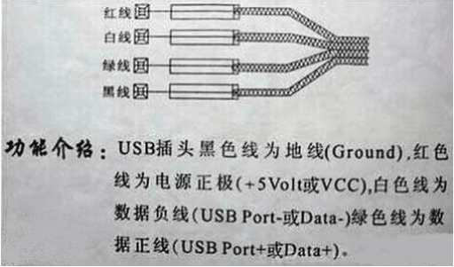

   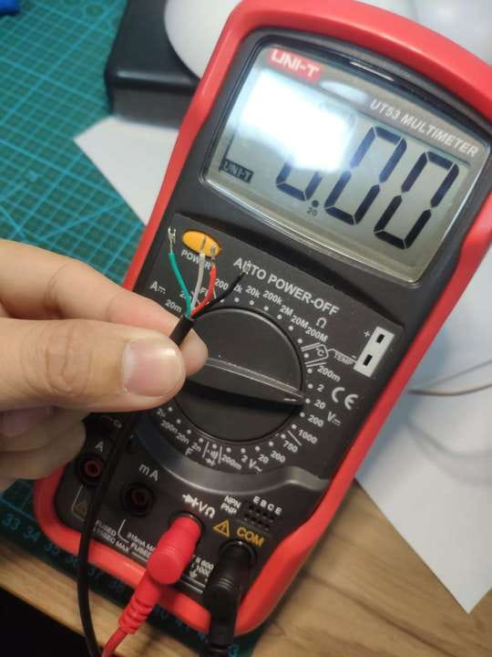

   按理说，用万用表的正负表笔触碰对应颜色的电线，得到测量值应该是个 +5V 左右的电压值(万用表当然是好的啦，一直都有在使用)

   

   当时通电测试之前没考虑过这一项，因为觉得20块的扩展线而已，又没有什么技术含量，结果哪知道还真有憨批厂商连颜色都不按标准来！

   **"红正黑负"在电气行业中是最基本的行业规格，反接的话相当于交警告诉你"红灯行，绿灯停"一样离谱。**

   刚通电之后就产生了一股烧焦的臭味，怕反烧笔记本电脑赶紧就把所有的连接处都拆断，后来逐一排查时才发现居然坏在这样一个不起眼连接点上，然而 USB HUB 已经烧坏，不可逆转。

   这些作坊 (生产厂商) 真的非常奇妙，以后但凡是用非知名品牌的线材前，一定要先测一下！

---

## 正文

我们先按照原作者的设计思想复现电路，仔细分解后得知：键盘只是个载体，该指纹识别模块不和键盘输入输出有什么其他交互，纯粹和键盘的数据线并行来与电脑通信；

FPM3X 传感器将识别到的二进制信息 (指纹) 被 Arduino 板编码成 PIN 密码后，模拟输入电脑完成解锁，当然解锁的密码是事先设置好的。

比如：张三的电脑解锁密码是 123456，张三录入了自己的中指指纹 A，指纹 A 的数据被 Arduino 模拟成 "按下 123456 再按回车"。

Arduino pro mini 开发板和其中的程序代码负责模拟成 HID 操作，而 HUB 的功能就是使两个 HID 设备 (键盘实体和 "指纹 + Arduino 板") 共用一个总线来和电脑通信。

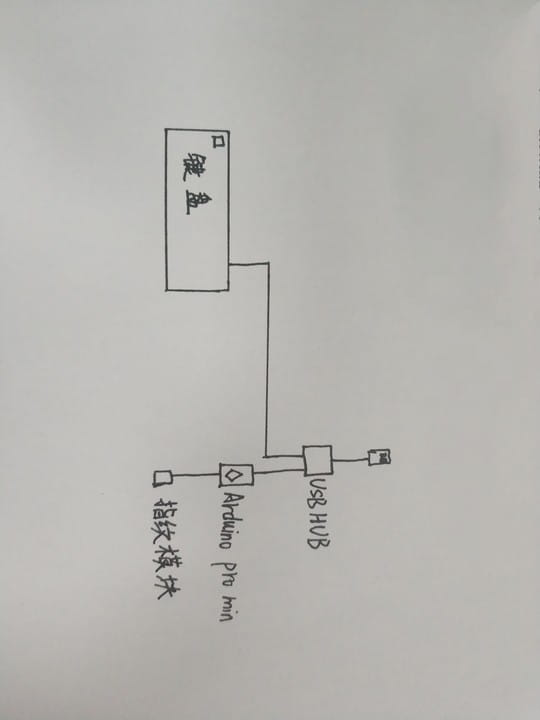

以上是手绘的图，所以我们将电路剥离开来，先测试指纹识别模块的功能，如果能完成指纹识别模块的单独运作，这个电路就基本上完成了。

---

## 原电路复现

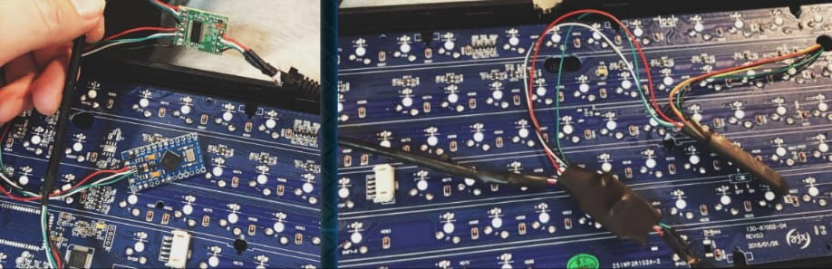

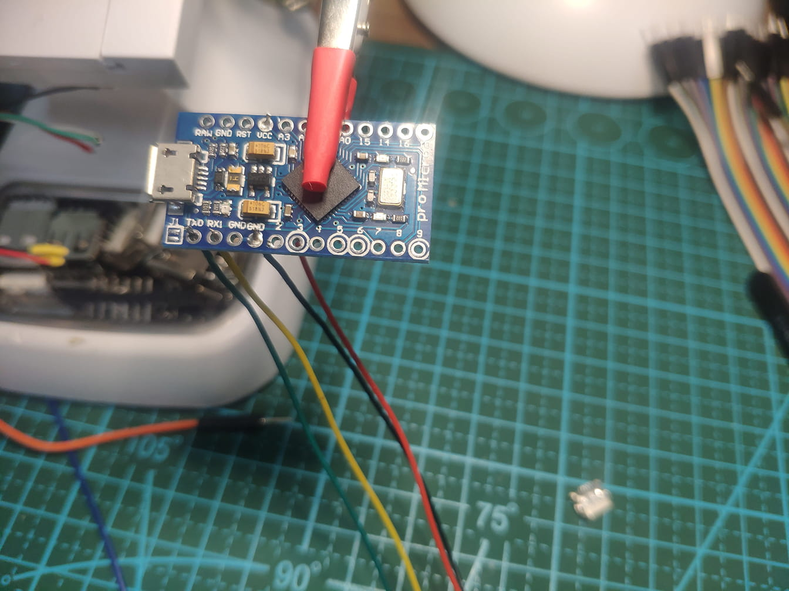

然而具体的接线方法原作者并没有详细说明，所上传的接线图片也较为模糊 (指纹模块和 Arduino 板子的部分也被遮挡)。

参考作者 Arduino 程序代码的注释发现，并没有对 A0 类的输出口进行定义，所以也没用这类口，VCC 和 GND 正常连接，黄绿线分别接 Arduino 的 TX 端和 RX 端 (后续也进行过多次黄绿线的对调测试)。

>  TX 是数据传入端 (transmit)，RX 是数据接收端 (respond)，两者只有电平信号的输送，即使反接也不足以烧坏电路，顶多就是不发生通信

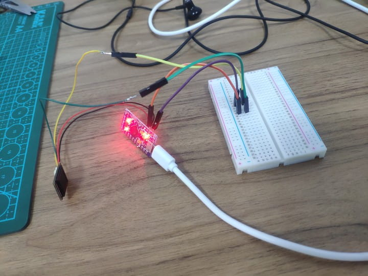

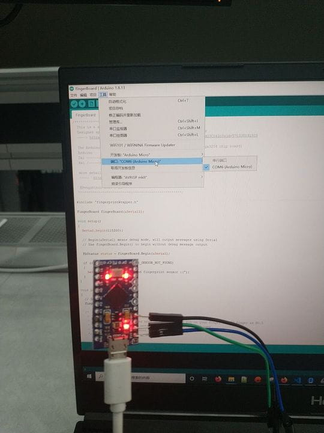

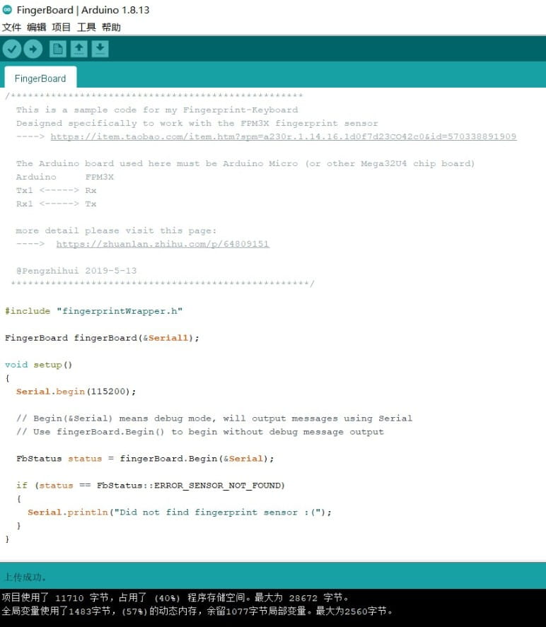

如图，代码编译正常，烧录成功。

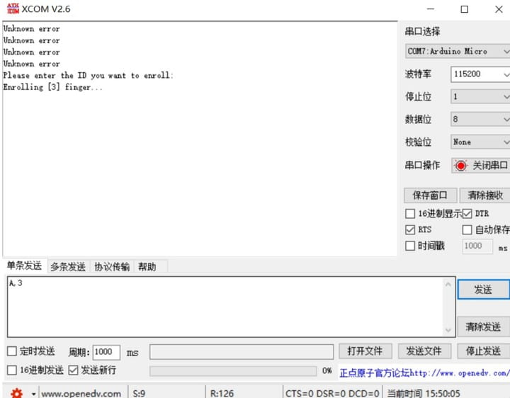

最后我们打开串口调试助手，进行测试。

这里说明一下，这里回包的"Unknow error"并不是实际意义上的未知错误，而是原作者程序代码里"报错信息"的返回值命名为"Unknow error"。

在串口调试助手中按作者的方法对其发送"A，3 "后，回包为"Please enter the ID you want to enroll"，说实话，实验到这一步得到这个反馈让我们感到十分欣慰，

因为这个回包的内容是提示让我们在识别模块上按下指纹，好录入解锁的"通行证"，我激动的伸出中指抚摸在指纹识别模块上，但是始终没有出现像原作者所说的返回一个"ok"的提示。

后期无论我们等待多久、如何尝试改变手指触碰角度和方向、换接黄绿线、调整电压、重布线、转接TTL……永远都卡在了"录入指纹成功"的这一步上。

指纹识别模块的黄绿线和 RX、TX 的两种接法均未能实现。

---

# 总结失败的原因：

在基本的电路复现中，最大的问题在于：录入指纹时，识别模块永远无法返还一个"成功"的回馈。
即使是单独用上位机程序测试硬件模块时，模块也是可以正常录入指纹图像信息的。

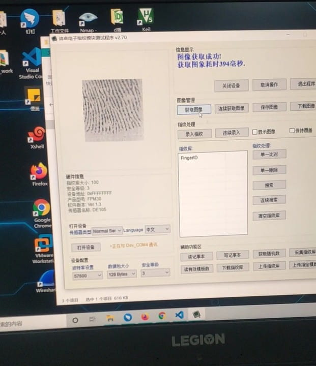

至于为什么没有按照原作者给出的设定给出相应的反馈，推测是以下几点：
1. 电路硬件部分还是有缺失
2. 软硬件匹配出现问题，
3. 某个步骤的做法不同但作者未说明
4. 作者可能是指纹模块店的老板，或是希望大家在知乎通过这篇文章对他本人发起付费咨询

另外，加接 TTL 通信协议转换模块也是行不通的，这会导致 Arduino pro mini 和 USB 转 TTL 模块 不能进行匹配的数据交互。
