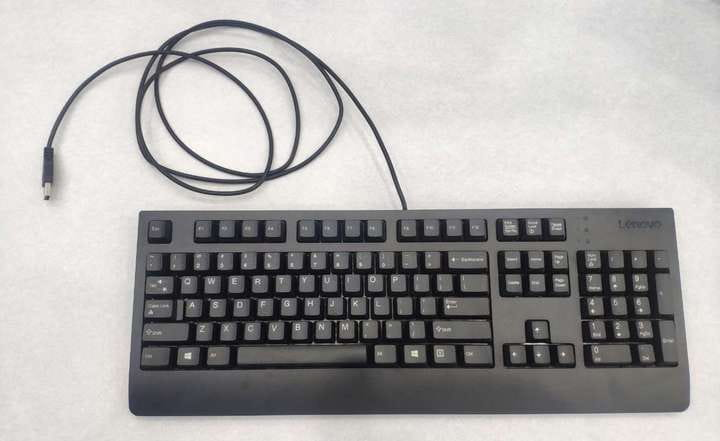
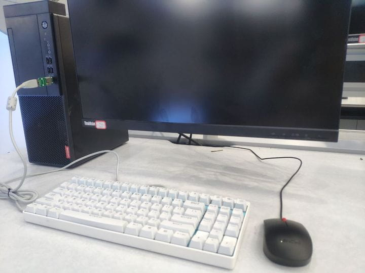
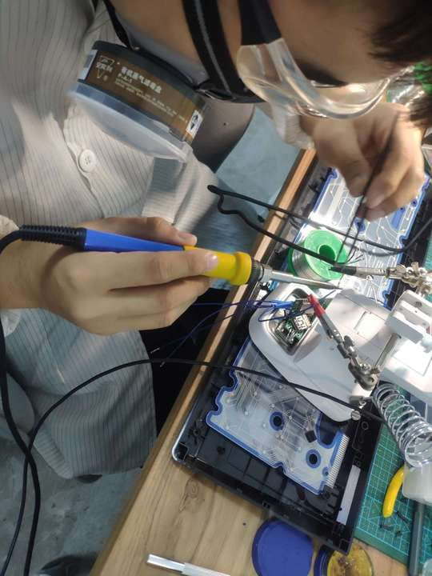
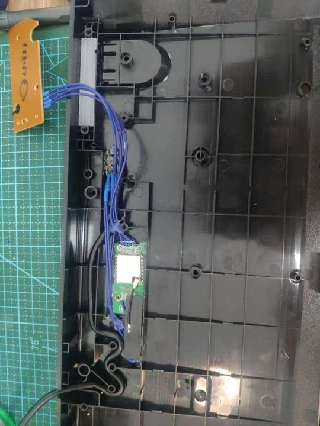
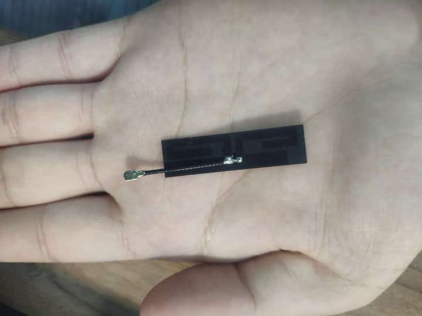
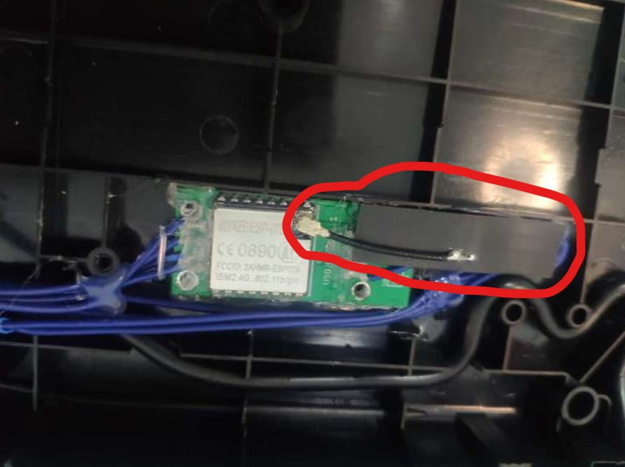

# HID-KeyboardLogger

> 本部分内容最初由 [Sarah-Briggs](https://github.com/Sarah-Briggs) 和 [Atomic-Crash](https://github.com/Atomic-Crash) 提供,在此只做排版修改,和后续内容维护

    

---

## 免责声明

`本文档仅供学习和研究使用,请勿使用文中的技术源码用于非法用途,任何人造成的任何负面影响,与本人无关.`

---

**文章/教程**
- [手把手教你DIY一个硬件键盘记录器](https://www.freebuf.com/geek/241398.html)

**资源**
- [spacehuhn/wifi_keylogger](https://github.com/spacehuhn/wifi_keylogger)

---

# 简介

基于上一次Usbkeylogger(无线键盘记录器)的制作，我们发现了一些使用时的不便，或者说是还有可改进的方面(指隐蔽性)，本次就针对上一次的DIY进行升级，将其直接和使用载体——键盘合为一体。

如果说在一般环境下，在他人的键盘到主机之间插上一个形如优盘的硬件看起来很可疑，尤其是输入设备的USB接口在主机正前方或者主机的USB接口处不那么"隐蔽"的。

像在这种环境下，你拿这个奇形怪状的记录器去插别人的主机或者笔记本电脑，实在是有点明显。

考虑到并不人人都是机械键盘爱好者，大多数普通人对于电脑的键盘是不那么敏感的，所以我们干脆将无线键盘记录器植入一把普通的不能再普通的办公键盘：

质朴的商务黑，加上它天真无邪的外形，几乎和学校的微机室、单位员工电脑、甚至企业机房里的键盘都没有太大区别。

将无线键盘记录器集成在它内部线路板上，不仅可以完美将其隐藏在键盘内部，最重要的是可以利用键盘外壳作为掩护，给记录器本体加装增益天线，可大幅度加快连接速度和范围。

---

# 制作过程

## 键盘改装设计

首先是键盘主体部分，这里我们选作示例的是一款联想品牌的SK-8827办公键盘，无论颜色还是造型，它的外观和大多数普通电脑用户的键盘基本一致，让人没有任何怀疑它的理由。

将其拆开，就可以看到它的内部结构了，本设计主要做改线，所以这里的展示只需要看右上角的那块矩形电路板。

键盘记录器的输入端和输出端是USB公母头，我们可以改变其电路走线、重新焊接，使记录器整体可以藏在外壳里，并且保持键盘原来的出线。(在实际改装中，各品牌各型号的键盘内部走线都有所区别，因此这里不给出本次具体的接线电路图)

最后将整个成品成功嵌入键盘：

---

## 加装天线

在本次的改良中，天线部分是提升性能的关键；

原先的无线键盘记录器的工作有效范围大约只有3~5米，并且连接其wifi热点的速度有些堪忧(有时可以秒连，也可能卡在"正在获取IP地址"最长达1分钟)；

通过加装合适的增益天线，现已将其有效工作范围提升至50米；对，你没听错，是50米，是原先的10倍增长，而且就算拉到50米处，wifi信号才只是减少了仅一格，并且基本不影响数据接收的速度。

这里说的天线当然不是那种体型巨大的金属支架，经过我们多次拆换调试，最终找到了一款只有牙签大小且完美适配的增益天线：

这是一款FPC材质的双频软天线，生产商是广东的一家小作坊，故没有具体品名及型号。

PFC即 Flexible Printed Circuit (柔性印刷电路板)，所挑选的这一款的PFC背部有软胶，可以粘附在附近的物体上，以达到固定方向、稳固不易摇晃的辅助作用。

该天线的增益量为3~8dbi，dBi是功率增益的单位，是一个相对值，dBi的参考基准为全方向性天线(可近似理解成是一个圈状范围)，这里只叙述本天线的实际应用，不过多介绍原理等相关内容。

将天线的底座和记录器的CPU——ESP8266的外置天线端口对接:

由于记录器本身的体积不大，就算接上这款增益天线后，还是可以将它们一起轻松内置在键盘内部。

注意这里红圈处就是内嵌的天线：

最后按孔贴回导电薄膜和软胶垫，合上塑料外壳，将螺丝拧好。完美！

那么现在这把看似平平无奇、人畜无害的键盘就成了一款"杀人不见血"的HID攻击利器，任何人使用这把键盘在主机上的一切按键操作都将可以被最远在50米处的攻击者悄悄记录。

由于它本身朴素的造型，很难吸引使用者的目光，几乎无法引起目标的怀疑。

---

# 使用

- https://www.youtube.com/watch?v=Vi3oBdMW3lU
