# HID-USBHarpoon

> 文章作者 [Sarah-Briggs](https://github.com/Sarah-Briggs) & [Atomic-Crash](https://github.com/Atomic-Crash) & [r0fus0d](https://github.com/No-Github)

    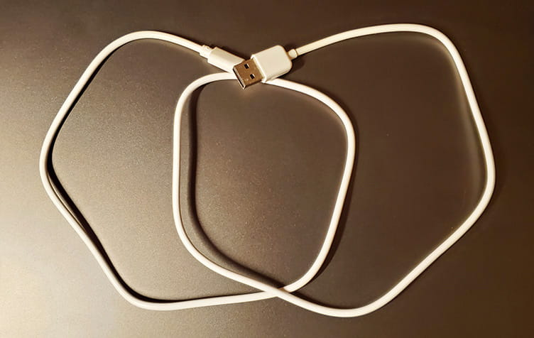

---

## 免责声明

`本文档仅供学习和研究使用,请勿使用文中的技术源码用于非法用途,任何人造成的任何负面影响,与本人无关.`

---

# 简介

虽然说U盘体积已经缩小到很小，但是作为一个移动存储设备还是很容易被识别，一眼就能认出。usb 数据线在生活中是很常见的，我们可以用这个 usb 数据线作为载体，与u盘相结合，做一款既便携又能很好隐藏的可移动存储设备，这样当别人看到这跟数据线只会以为是普通的数据线并不会联想到是一个移动存储设备。同时这根数据线要能够往里存储数据，也能够进行充电，这样伪装如同间谍。

**U 盘**

U盘是 USB(universal serial bus)盘的简称，据谐音也称“优盘”。U盘是闪存的一种，故有时也称作闪盘。

闪盘：快闪存储器（英语：flash memory），是一种电子式可清除程序化只读存储器的形式，允许在操作中被多次擦或写的存储器。这种科技主要用于一般性数据存储，以及在计算机与其他数字产品间交换传输数据，如储存卡与U盘

闪存是一种非易失性存储器，即断电数据也不会丢失。因为闪存不像 RAM（随机存取存储器）一样以字节为单位改写数据，因此不能取代RAM。

`U盘与硬盘的最大不同是，它不需物理驱动器，即插即用，且其存储容量远超过软盘，极便于携带.`

U盘集磁盘存储技术、闪存技术及通用串行总线技术于一体。USB的端口连接电脑，是数据输入/输出的通道；主控芯片使计算机将U盘识别为可移动磁盘，是U盘的“大脑”；U盘Flash（闪存）芯片保存数据，与计算机的内存不同，即使在断电后数据也不会丢失；PCB底板将各部件连接在一起，并提供数据处理的平台。

---

# 常见存储卡类型

**SD 卡**

Secure Digital卡简称SD卡，从字面理解，此卡就是安全卡。它比CF卡以及早期的SM卡在安全性能方面更加出色。是由日本的松下公司、东芝公司和SanDisk公司共同开发的一种全新的存储卡产品，最大的特点就是通过加密功能，保证数据资料的安全保密。

**T-Flash 卡 TF 卡**

全名：TransFLash，由摩托罗拉与SANDISK共同研发，在2004年推出。是一种超小型卡（11*15*1MM），约为SD卡的1/4，可以算目前最小的储存卡了。TF卡可经SD卡转换器后，当SD卡使用。利用适配器可以在使用SD作为存储介质的设备上使用。TransFlash主要是为照相手机拍摄大幅图像以及能够下载较大的视频片段而开发研制的。TransFlash卡可以用来储存个人数据，例如数字照片、MP3、游戏及用于手机的应用和个人数据等，还内设置版权保护管理系统，让下载的音乐、影像及游戏受保护。

---

# 制作过程

## 数据线模块

这里我们采用的是 type-c 数据线（micro-usb 口的数据线制作原理相同这里不做赘述），在数据线伪装成U盘的同时，可以对手机进行充电。

1. 图中是一根普通的 type-c 数据线

    

    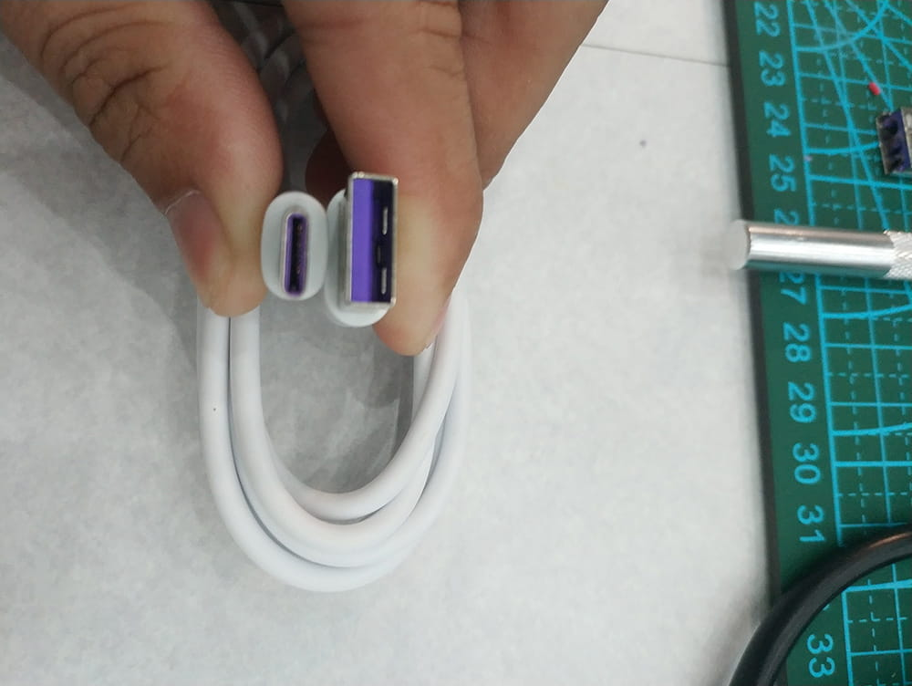

2. 我们将 usb 的公头剪下来（`注意：不要带电操作`），参考通用的数据线接线图以及 usb 公头接线图（`注意：线的正负极不要混淆，公头的方向不要弄错，两个开口向上时，从左往右依次是GND、D+、D-、vcc`），我们将红黑两根线剥开用于后面的焊接，白绿两根线是用来给手机传输数据的这里剪去不用，因为用了这两根线暂时就没办法使U盘正常与电脑通信（也可以后期进行改造使用这两根线，但是在这里暂且不用）。

    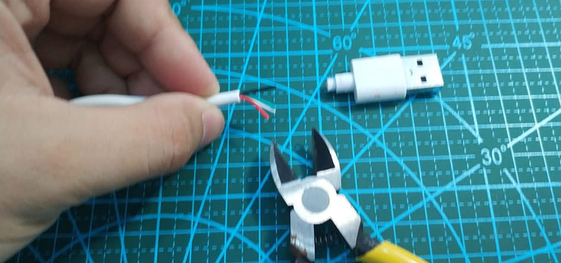

    

    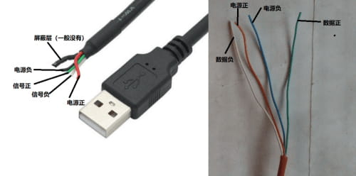

3. 同时我们取下 usb 公头的金属外壳，这也是整个环节里最难的部分，因为里面的塑料部分非常的结实。（`注意：在用刀时小心点不要割到手！`）

    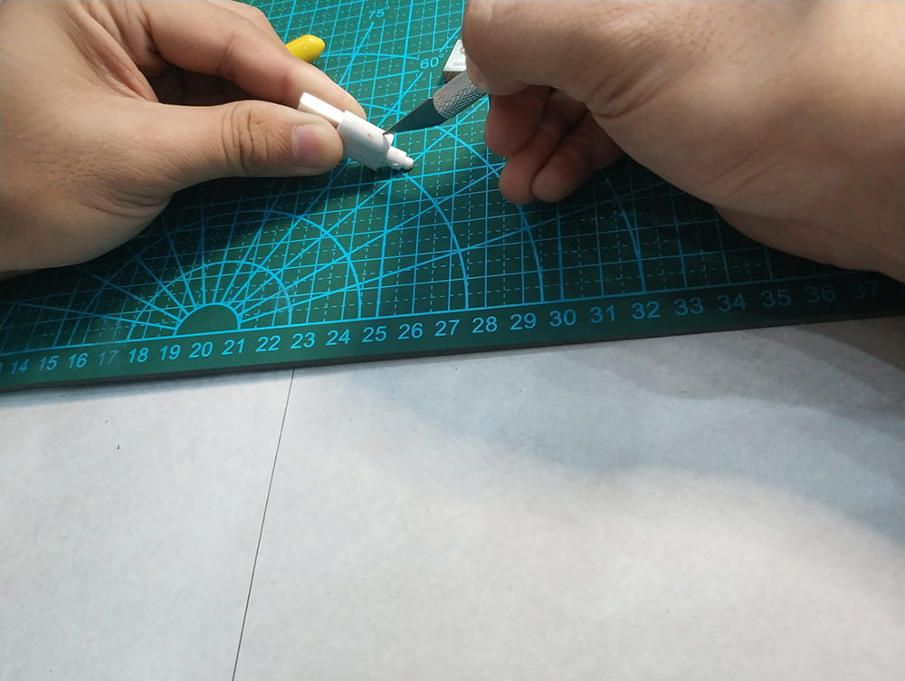

    具体拆解不赘述了，纯手工和技术活，以下就是我们需要用到的配件（`注意：USB金属壳不要有明显的划痕、脏污、形变，这一切都是为了更好的隐藏于环境之中!`）

    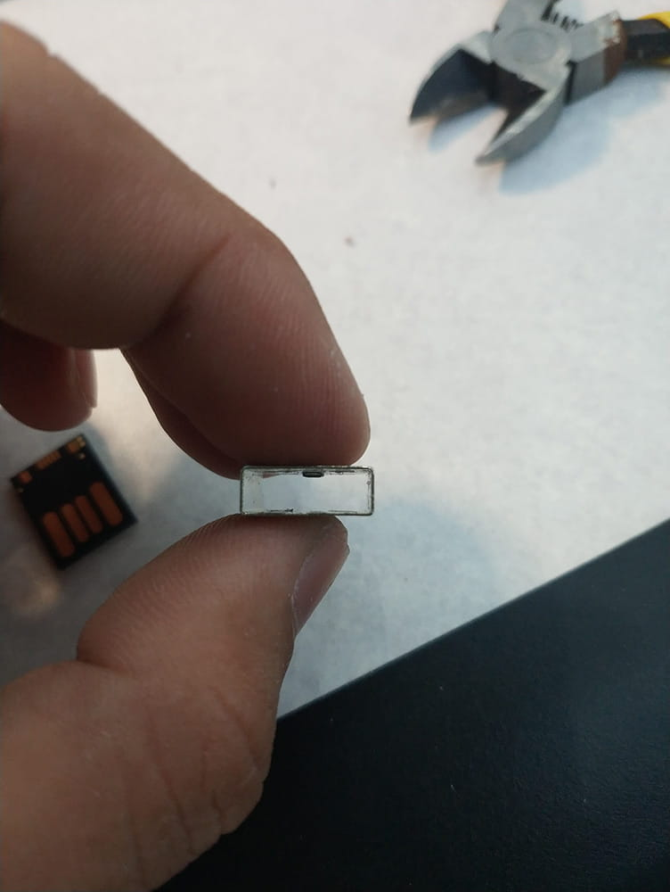

---

## U盘模块

1. 这次我们选用的是hp的64G迷你U盘，体积非常小，性能比较稳定可靠，内存也是比较大的了。U盘内存大于128G的多半是扩容盘，实际容量可能只有8G或者是32G（依据商家的良心），这种扩容U盘当存储的数据大于它实际容量时可能会崩盘，而且会非常烫，对于存储数据来说很不安全，毕竟没有人愿意用这种U盘而且在关键时刻翻车就很麻烦了。

    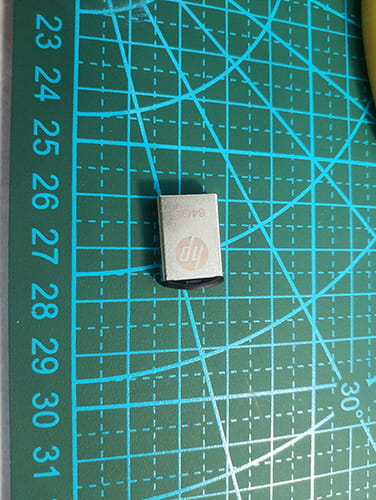

2. 我们对这个迷你U盘进行拆解外壳，拆解时要小心谨慎，不要弄坏了存储芯片。

    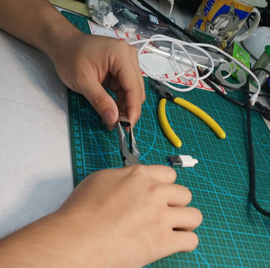

    下图可以看到，拆解以后有三个模块，U盘存储芯片、金属USB外壳、塑料固定键，这里我们只要U盘存储芯片，因为金属USB外壳上有激光打印的字体，而且看到以后很容易辨识，所以这里不用这个壳子。

    

    存储芯片如下图：

    

---

## 装配

1. 我们准备好之前拆解的U盘存储芯片和USB金属壳，这里我用了一个USB套件。

    

2. 接下来我们把数据线焊接在U盘存储芯片上（`注意：不可以长时间焊接U盘存储芯片，长时间高温会剥离U盘存储芯片的覆铜接触片，之后该U盘存储芯片就只能报废`）

    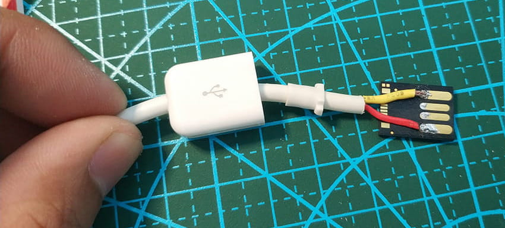

3. 调试好线的长度，进行封装，将U盘存储芯片用502粘在USB金属壳内（`注意：要粘合牢固同时注意不要有粘合痕迹`）以下是成品。

    

---

## 调试

1. 插入电脑看看U盘是否正常运行。下图可以看到，读取成功！

    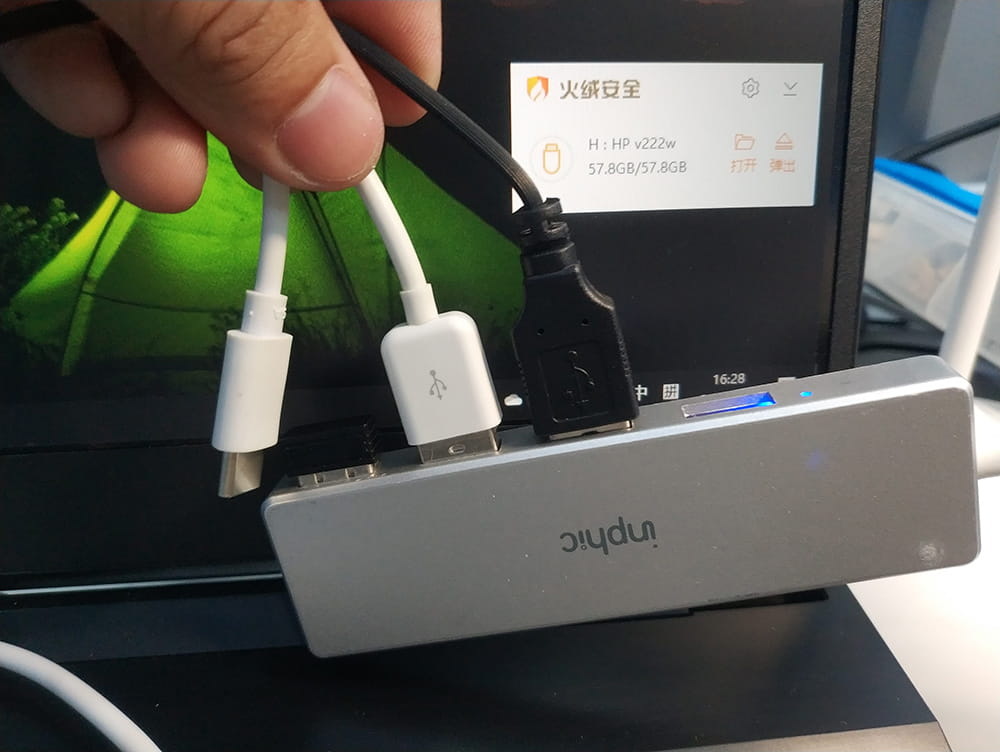

2. 充电检测，图下可以看出充电正常。

    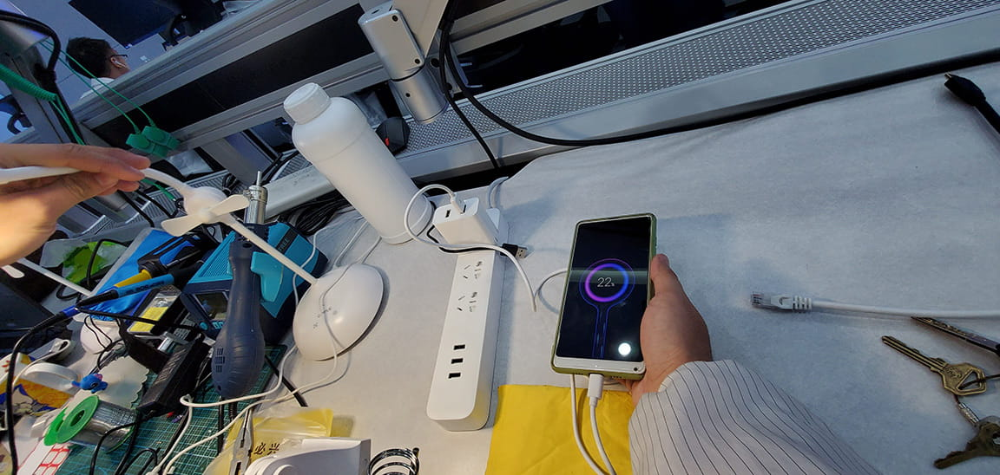

---

# 使用

从现在起它只是你众多数据线中不起眼的一条，它的主要功能就是隐藏式U盘，你可以插在朋友的电脑上偷偷拷贝文件。你可以提前在U盘里放入恶意的 exe 文件，当有人偷数据线时，作案人如获至宝又不知情的点开里面的文件，就可以买到一个教训，至于教训多大，就看你放的文件厉不厉害。鉴于它的隐藏性，是没有人会仔细翻查数据线的，可以轻松越过各国海关，制作简单，又不易被察觉。

它就在你眼前，不知情的你看它几分像从前！
