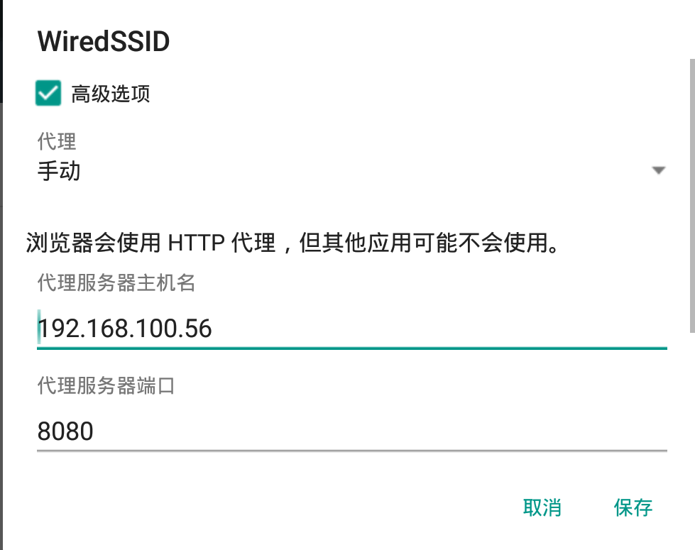
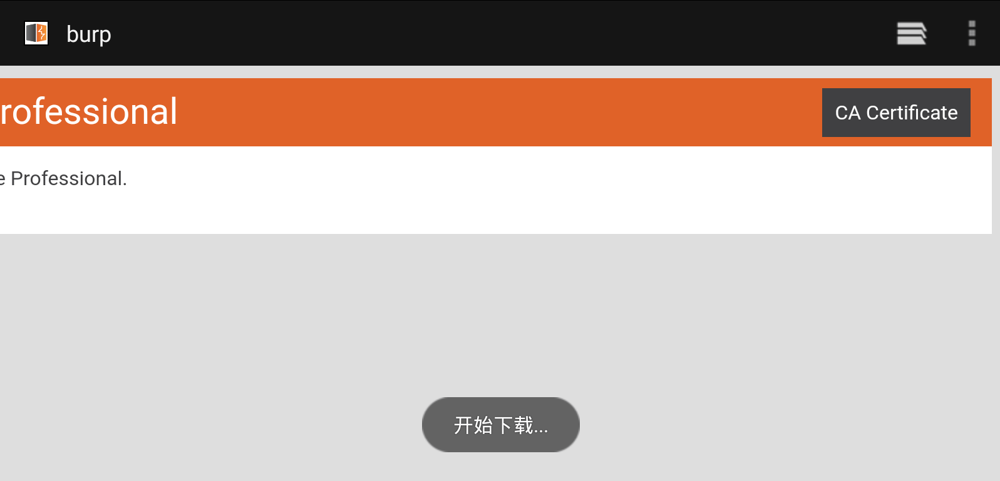
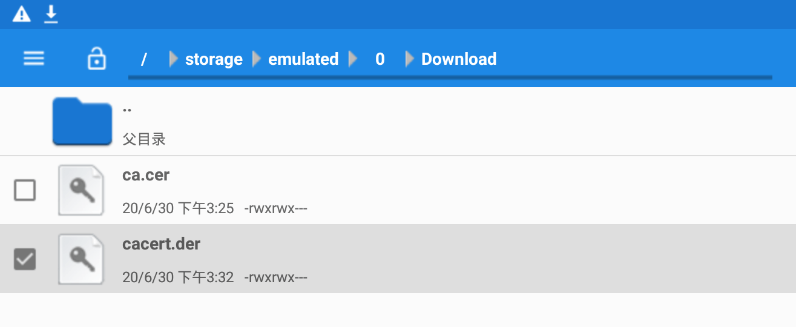
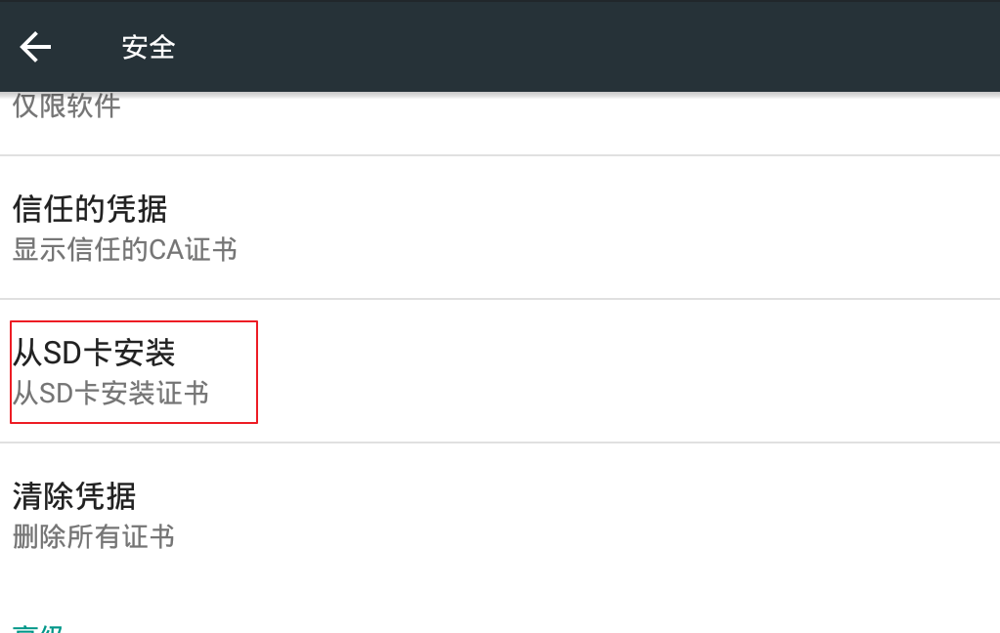
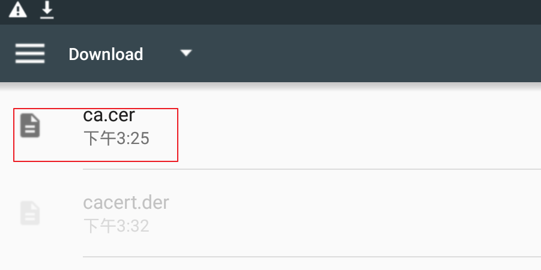

# Android安全

---

## 免责声明

`本文档仅供学习和研究使用,请勿使用文中的技术源码用于非法用途,任何人造成的任何负面影响,与本人无关.`

---

## 抓包方法

**相关文章**
- [太干了，Android 抓包姿势总结！](ProxyToken)

---

**手机设置网络代理**

模拟器打开 wifi 设置选项,长按点击 `修改网络`


代理选择本机的 IP 地址



在 burp 的选项中添加监听项


模拟器访问 http://burp 下载 ca 证书



到文件管理器中,将下载的 cacert.der 改为 .cer 后缀



到设置-安全


选择从 SD 卡安装



选择 .cer 文件安装



随便命名,用途选 `vpn和应用`


- 相关文章
    - [使用burpsuit捕获手机流量](https://blog.csdn.net/qq_29277155/article/details/52548630)

---

**模拟器设置全局代理**

代理服务器设置为 burp 监听端口


已夜神模拟器为例,使用的网络进程有：`NoxVMHandle Frontend`


将 `NoxVMHandle Frontend` 进程对应的应用程序文件加入代理规则。

重启模拟器,模拟器安装 burp 的 CA 证书,记得 ca 文件名改成 .crt,抓包测试

---

**Root 后导证书到系统域中**
- 相关文章
    - [移动端安全修炼（三）](https://moyu.life/post/yi-dong-duan-an-quan-xiu-lian-san/)

---

**ssl-pinning 证书锁定**

SSL/TLS Pinning 提供了两种锁定方式： Certificate Pinning 和 Public Key Pinning

- 证书锁定

    需要将 APP 代码内置仅接受指定域名的证书，而不接受操作系统或浏览器内置的 CA 根证书对应的任何证书，通过这种授权方式，保障了 APP 与服务端通信的唯一性和安全性，因此我们移动端 APP 与服务端（例如 API 网关）之间的通信是可以保证绝对安全。但是 CA 签发证书都存在有效期问题，所以缺点是在证书续期后需要将证书重新内置到 APP 中。

- 公钥锁定

    提取证书中的公钥并内置到移动端 APP 中，通过与服务器对比公钥值来验证连接的合法性，在制作证书密钥时，公钥在证书的续期前后都可以保持不变（即密钥对不变），所以可以避免证书有效期问题。

证书锁定旨在解决移动端 APP 与服务端通信的唯一性，实际通信过程中，如果锁定过程失败，那么客户端 APP 将拒绝针对服务器的所有 SSL/TLS 请求，FaceBook/Twitter 则通过证书锁定以防止 Charles/Fiddler 等抓包工具中间人攻击

--

## 反编译

**在线反编译器**
- [APK decompiler - decompile Android .apk ✓ ONLINE ✓](http://www.javadecompilers.com/apk)

**反编译工具**
- [Apktool](https://ibotpeaches.github.io/Apktool/)
    - 参考文章 : [使用apktool反编译apk文件](https://blog.csdn.net/ruancoder/article/details/51924179)
    ```
    apktool d xxx.apk -o xxx
    ```
- [skylot/jadx](https://github.com/skylot/jadx)
- ApkIDE
- AndroidKiller

---

## APK渗透

**案例**
- [Attacking the attackers  Hacking like it's 1999](https://asaf.me/2018/07/23/attacking-the-attackers/)
- [如何攻击智能汽车远程启动系统（Part 1）](https://www.anquanke.com/post/id/153373)
- [对恶意Android应用Bangle Android App Packer的分析](http://www.freebuf.com/vuls/178919.html)
- [怀揣情怀的提醒：及时修复！(某智能门锁二度分析感悟)](https://paper.seebug.org/343/)
- [[Onls丶辜釉]无码分享渗透某社交APP](https://bbs.ichunqiu.com/thread-27421-1-22.html)
- [技术讨论 | 看我如何破解一台自动售货机 ](https://www.freebuf.com/articles/terminal/186804.html)
- [一个色播APP逆向——初窥千万灰色直播产业](https://evilpan.com/2019/01/05/reverse-live-porn-app/)
- [Telegram App Store Secret-Chat Messages in Text Database](https://blog.zimperium.com/telegram-hack/)
- [对某某加速器逆向抓包破解提取线路分析](https://www.52pojie.cn/thread-1175677-1-1.html)
- [APP硬编码密钥渗透测试](https://www.t00ls.net/articles-58594.html) - dexdump 脱壳,AES,OSS 利用

**CTF writeup**
- [BUUCTF Reverse helloword、findit](https://blog.csdn.net/qq_42967398/article/details/96877555)

### 信息收集

**在线检测**

- [腾讯金刚](https://service.security.tencent.com/kingkong)
- [梆梆安全](https://dev.bangcle.com/)
- [爱加密](https://www.ijiami.cn/index)
- [娜迦信息](http://www.nagain.com/appscan/)
- [海云安](https://www.secidea.com/hyx/index.php/user/login.html)
- [APP审计系统](http://01hackcode.com/)
- [360移动开放平台-APP漏洞扫描](http://dev.360.cn/html/vulscan/scanning.html)
- [360加固保](https://jiagu.360.cn/#/global/index)
- [百度AI安全加固平台](https://apkprotect.baidu.com/)
- [腾讯云移动应用加固](https://cloud.tencent.com/product/ms)
- [360手机应用检测](http://scan.shouji.360.cn/index.html)
- [腾讯手机管家官方网站](https://m.qq.com/security_lab/scans_online.jsp)

**相关工具**

- [TheKingOfDuck/ApkAnalyser](https://github.com/TheKingOfDuck/ApkAnalyser) - 一键提取安卓应用中可能存在的敏感信息。
- [dwisiswant0/apkleaks](https://github.com/dwisiswant0/apkleaks) - Scanning APK file for URIs, endpoints & secrets.
- 从反编译的 apk 文件中提取相关域名链接/IP
    ```bash
    grep -E "([0-9]{1,3}[\.]){3}[0-9]{1,3}" -r xxx --color=auto
    grep -E "https?://[a-zA-Z0-9\.\/_&=@$%?~#-]*" -r xxx --color=auto
    ```
- 通过正则提取一些敏感信息
    ```bash
    apktool d app_name.apk
    grep -EHirn "accesskey|admin|aes|api_key|apikey|checkClientTrusted|crypt|http:|https:|password|pinning|secret|SHA256|SharedPreferences|superuser|token|X509TrustManager|insert into" APKfolder/
    ```
- [s0md3v/Diggy](https://github.com/s0md3v/Diggy)
- [kelvinBen/AppInfoScanner](https://github.com/kelvinBen/AppInfoScanner)

---

### APK-Exploits

**CVE-2019-6447 ESFileExplorers 任意文件读取**
- 简介

    基于 Android 平台的 ES File Explorer File Manager application 4.1.9.7.4 及之前版本中存在安全漏洞，该漏洞源于 ES 应用程序在运行一次之后，TCP 59777 端口并未关闭依旧可以通过 HTTP 协议接收 JSON 数据。攻击者可通过向 TCP 59777 端口发送请求利用该漏洞读取任意文件或执行应用程序。

- POC | Payload | exp
    - [fs0c131y/ESFileExplorerOpenPortVuln](https://github.com/fs0c131y/ESFileExplorerOpenPortVuln)

---

## 系统漏洞

**Android's overlay attacks**
- 相关文章
    - [How are we doing with Android's overlay attacks in 2020?](https://labs.f-secure.com/blog/how-are-we-doing-with-androids-overlay-attacks-in-2020/)

---

## ADB调试

**相关文章**
- [How to hack Android device with ADB (Android debugging bridge)](https://www.hackeracademy.org/how-to-hack-android-device-with-adb-android-debugging-bridge/)
- [[渗透测试]记一次5555端口渗透实战](https://www.cnblogs.com/Ky1226/p/14198581.html)
