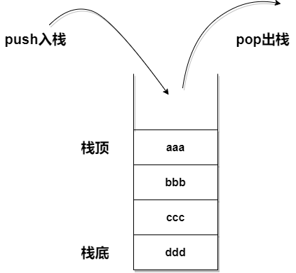

# PWN

---

**相关工具**
- pwntools
    ```bash
    如何验证 pwntools 安装成功
    python 进入交互，导入 pwn 库，出现如下字符证明 pwntools 安装成功

    python3
    >>> from pwn import *
    >>> asm("xor eax,eax")
    b'1\xc0'
    ```
- [pwndbg/pwndbg](https://github.com/pwndbg/pwndbg)
    ```
    git clone https://github.com/pwndbg/pwndbg.git
    cd pwndbg
    echo "source ~/pwndbg/gdbinit.py" >> ~/.gdbinit
    ./setup.sh
    ```
- [david942j/one_gadget](https://github.com/david942j/one_gadget)

---

## 基础部分

### ELF文件

ELF文件有三种类型，可以通过ELF Header中的 e_type 成员进行区分：

* 可重定位文件（Relocatable File） ：ETL_REL。一般为.o文件，可以与其他目标文件链接来创建可执行文件或共享目标文件的代码和数据。静态链接库属于可重定位文件
* 可执行文件（Executable File） ：ET_EXEC。可以执行的一个程序，此文件规定了exec()如何创建一个程序的进程映像。
* 共享目标文件（Shared Object File） ：ET_DYN。一般为.so文件。

### 动态链接和静态链接

链接可以分为静态链接和动态链接俩种。gcc默认使用动态链接，添加“-static”即可指定为静态链接。这一阶段将目标文件及其依赖库进行链接，生成可执行文件，主要包括地址和空间分配，符号绑定和重定位等操作。

linux下动态链接文件 .so
- ida打开动态链接文件function里粉色的函数只是一个符号，并没有函数具体实现,符号去解析动态链接库里的函数

静态链接文件 .a
- ida打开的静态链接function的函数都有函数体实现,并且函数有父函数的实现

```sh
gcc -fno-pie test.o -o test -static  静态链接，并且关掉pie
gcc -fno-pie -o dytest test.c  动态链接,并且关掉pie
```

### 部分寄存器的功能

**32位架构下寄存器功能**
EIP
存放当前执行的指令的地址
ESP
存放当前栈帧的栈顶地址
EBP
存放当前栈帧的栈底地址
EAX
通用寄存器。存放函数返回值
EBX
"基地址"(base)寄存器, 在内存寻址时存放基地址。
ECX
计数器(counter), 是重复(REP)前缀指令和LOOP指令的内定计数器。
ESI/EDI
分别叫做"源/目标索引寄存器"(source/destination index),因为在很多字符串操作指令中, DS:ESI指向源串,而ES:EDI指向目标串.

### 常用的汇编指令

| 指令 | 等同于 |
| ---- | ------ |
|call func|	push pc，jmp func|
|leave|	mov esp ebp，pop ebp|
|ret|	pop pc (相当于在栈顶弹出一个数据赋值给EIP寄存器)|
|push xxx|	将xxx压栈，将esp减4|
|pop rdi|	弹栈，将此时esp所指内容存入rdi，同时esp加4|

### 栈的工作方式



### linux的保护机制

* RELRO: Full RELRO – 重定向，RELRO会有Partial RELRO和FULL RELRO，如果开启FULL RELRO，意味着我们无法修改got表
* Stack: No canary found – 栈canary检查
* NX: NX enabled – 栈不可执行
* PIE: PIE enabled – 程序地址随机化
* ASLR：Address space layout randomization - 内存地址随机化

---

## 工具使用

### gdb的使用

* vmmap：查看虚拟内存空间
* break：下断点
* del：删除断点
* run：运行整个程序
* continue：继续运行
* start：和b main，然后run差不多
* n：单步步过
* s：单步步入
* ni：单步步过，汇编层面
* si：单步步入，汇编层面
* bt：栈回溯
* x：查看内存
* x/nfu <addr>
    * n,f,u都是可选参数，指要显示的内存的格式
    * n 代表个数，要显示多少单位的内存
    * u 代表单位大小，b 表示单字节，h代表双字节，w表示四字节，g表示八字节
    * x	代表显示格式，常用的格式有 x十六进制，s字符串，i机器指令，c字符型

* info：查看一些信息
    * info b查看断点信息
    * info r查看寄存器信息
    * info threads查看线程信息

* disass：反汇编
    * disass <func> 反汇编指定函数
    * disass <addr> 反汇编指定地址
    * disass <addr_begin> <addr_end> 反汇编指定地址范围

* fin：结束此函数，返回上一层
* p：打印一些值
    * p $esp 打印寄存器的值
    * p <addr> 打印地址里面的值
* attach：附加进程

### pwntools的使用

导入pwnlib库
```py
from pwn import *
```

打开与本地程序的交互
```py
io = process("./test")
```

打开与远程指定程序的交互
```py
io = remote("xxxx",8888)
```

打开debug调试模式，显示交互中的输入与输出
```py
context.log_level = "debug"
```

设置操作系统
```py
context.os = "linux"
```

指定32位交互程序的体系架构
```py
context.arch = "i386"
```

指定64位交互程序的体系架构
```py
context.arch = "amd64"
```

接收所有字符流输出
```py
io.recv()
```

接收程序的一行字符流输出
```py
io.recvline()
```

接收程序的字符流直到str字符
```py
io.recvuntil("str")
```

发送payload
```py
io.send(payload)
```

发送payload并在结尾加上"\n"
```py
io.sendline(payload)
```

直到接收到str，然后发送payload
```py
io.sendafter("str",payload)
```

直到接收到str，然后发送payload,并在payload结尾加上"\n"
```py
io.sendlineafter("str",payload)
```

关闭io

```py
io.close()
```

用户交互
```py
io.interactive()
```

首先先创建一个ELF对象，方便我们对齐数据进行查找
```py
elf = ELF('test')
```

输出一个sh的shellcode 汇编代码 默认是32位的shellcode
```py
shellcraft.sh()
```

输出一段sh的shellcode的机器码
```py
asm(shellcraft.sh())
```

输出一个sh的shellcode 汇编代码 amd64位的shellcode  记得加上64位环境说明 context.arch
```py
shellcraft.amd64.sh()
```

ljust是左对齐，shellcode后面用A来填充垃圾数据，一共形成112个字节的字节流
```py
payload = asm(shellcraft.sh()).ljust(112,b'A')+p32(buf_addr)
```

搜索一个字符串并返回其所在地址 python3里字符串前面必须加上b''，不然找的就是str对象,而不是字节数据
```py
hex(next(elf.search(b'/bin/sh')))
```

查看puts函数在got表中表项的地址
```py
hex(elf.got["puts"])
```

变量名和函数名本质上都是符号，下面是查找gets函数的plt表地址，got表地址和buf2变量的地址
```py
elf.plt['gets']
elf.got['gets']
elf.symbols['buf2']
```

生成60个字节的垃圾数据
```py
cyclic(60)
```

如果想在pwntools中某一位置在pwndbg中调试，可以在pwntools中的这一位置`pause()`,然后执行到这里的程序就被挂起到了进程，gdb进入，attach pid 就可以在pwndbg中进行调试
```py
pause()
```

### checksec的使用

```shell
file test		查看二进制程序的架构
checksec test	检查二进制程序的保护
```

### ROPgadget的使用

```shell
ROPgadget --binary xxx --only "pop|ret"		//查找pop和ret的gadget片段
ROPgadget --binary xxx --string "/bin/sh"	//查找/bin/sh字符串
```

### one_gadget的使用

```shell
one_gadget /lib32/libc-2.23.so
```

### ropper的使用

```shell
$ ropper
$ help
$ search pop rdi
```

### patchelf的使用

```shell
patchelf --set-interpreter ~/lib/2.23-0ubuntu3_i386/ld-2.23.so ./test
patchelf --replace-needed libc.so.6 ~/lib/2.23-0ubuntu3_i386/libc-2.23.so ./test
```

---

## 攻击手法

### ret2text

[ret2text](./笔记/ret2text.md)

### ret2syscall

[ret2syscall](./笔记/ret2syscall.md)

### ret2shellcode

[ret2shellcode](./笔记/ret2shellcode.md)

### ROP

[ROP](./笔记/ROP.md)

### ret2libc

[ret2libc](./笔记/ret2libc.md)
