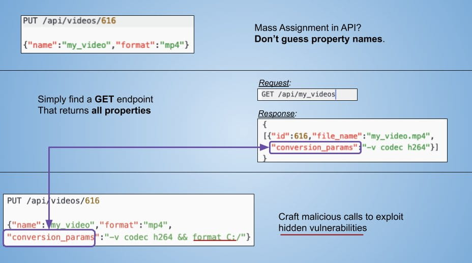

# IDOR

`整个部分结构大部分基于乌云的几篇密码找回、逻辑漏洞类文章,在其基础上记录和归纳`

---

## 免责声明

`本文档仅供学习和研究使用,请勿使用文中的技术源码用于非法用途,任何人造成的任何负面影响,与本人无关.`

---

# 大纲

* [认证绕过](#认证绕过)
    * [未授权访问](#未授权访问)
    * [身份认证绕过](#身份认证绕过)
    * [密码重置](#密码重置)
    * [验证码突破](#验证码突破)
    * [Ticket_Trick](#ticket_trick)

* [授权绕过](#授权绕过)
    * [越权测试](#越权测试)
    * [执行顺序绕过](#执行顺序绕过)
    * [race_condition](#race_condition)

* [限制绕过](#限制绕过)
    * [IP限制绕过](#ip限制绕过)
    * [时间刷新缺陷](#时间刷新缺陷)
    * [JS绕过](#js绕过)

* [接口利用](#接口利用)
    * [BOLA](#bola)
    * [数据篡改](#数据篡改)
    * [重放攻击](#重放攻击)
    * [DoS](#dos)

---

**文章 & Reference**
- [密码找回逻辑漏洞总结](http://www.vuln.cn/6851)
- [密码找回功能可能存在的问题](http://www.vuln.cn/6849)
- [密码找回功能可能存在的问题(补充)](http://www.vuln.cn/6850)
- [业务安全漏洞挖掘归纳总结](http://www.vuln.cn/6667)
- [应用程序逻辑错误总结](http://www.vuln.cn/6874)
- [在线支付逻辑漏洞总结](http://www.vuln.cn/6807)
- [web渗透测试之攻破登录页面](https://zhuanlan.zhihu.com/p/35257242)
- [我的越权之道](http://www.vuln.cn/6893)
- [谈高效漏洞挖掘之Fuzzing的艺术](https://www.freebuf.com/vuls/221129.html)
- [密码找回中的套路](https://xz.aliyun.com/t/7977)
- [登录点测试的那些事](https://xz.aliyun.com/t/8185)
- [基于业务场景的漏洞挖掘](https://mp.weixin.qq.com/s/a6QvgLFCO4rCS3FRYZ3lug)

**案例**
- [挖洞经验 | 连接多个漏洞获取管理员访问权限](https://www.freebuf.com/articles/web/177461.html)
- [挖洞经验 | 看我如何发现谷歌电子表格、谷歌云盘和谷歌相册的3个漏洞（$4133.7）](https://www.freebuf.com/vuls/192342.html)
- [挖掘某小型CMS厂商逻辑漏洞的过程](https://bbs.ichunqiu.com/thread-31184-1-20.html)
- [对某大学管理信息系统的一次渗透测试](https://xz.aliyun.com/t/7686)

**相关工具**
- [ztosec/secscan-authcheck](https://github.com/ztosec/secscan-authcheck) - 越权检测工具

---

实战渗透测试中，web 的攻防一直是重中之重，而无论是对于富有经验的老手黑客和新手脚本小子来说，相比 SQL 注入、XSS 漏洞等传统安全漏洞，逻辑漏洞都是最具价值的。这类漏洞往往危害巨大，可能造成企业的资产损失和名誉受损，并且传统的 WAF 设备和防护措施收效甚微。

---

# 认证绕过

**相关资源**
- [任意用户密码重置的10种常见姿势](https://www.jianshu.com/p/63c005f9ce83)

## 未授权访问

非授权访问是指用户在没有通过认证授权的情况下能够直接访问需要通过认证才能访问到的页面或文本信息.可以尝试在登录某网站前台或后台之后,将相关的页面链接复制于其他浏览器或其他电脑上进行访问,看是否能访问成功.

- 案例:
    - [某发电机云控平台未授权访问](http://wy.zone.ci/bug_detail.php?wybug_id=wooyun-2016-0226920)
    - [$10k host header](https://www.ezequiel.tech/p/10k-host-header.html)

---

## 身份认证绕过

**相关文章**
- [一个FW-TOKEN鉴权绕过漏洞](https://blog.m1kh.com/index.php/archives/730/)
- [渗透测试之一波三折](https://juejin.cn/post/7018847261807345700)

**Cookie & Session**
- 会话固定攻击

    利用服务器的session不变机制,借他人之手获得认证和授权,冒充他人.
    - 案例:
        - [新浪广东美食后台验证逻辑漏洞,直接登录后台,566764名用户资料暴露](https://wy.zone.ci/bug_detail.php?wybug_id=wooyun-2013-025427)

- Cookie仿冒

    修改cookie中的某个参数可以登录或冒充其他用户.
    - 案例:
        - [益云广告平台任意帐号登录](https://wy.zone.ci/bug_detail.php?wybug_id=wooyun-2014-051424)
        - [Hacking the Medium partner program](https://medium.com/bugbountywriteup/hacking-the-medium-partner-program-84c0e9fa340)

**加密测试**
- 前端加密,用密文去后台校验

    1. 可以使用 burpsuite 的 payload processing 功能,把字典按照加密方式先加密再发包
    2. 用字典生成工具生成加密好的字典,pydictor 内置 encode 功能可以支持

**调式代码**
    ```
    00000
    null
    %00
    ```

**修改返回值**
- 思路
    ```
    HTTP/1.1 404 Not Found
    ...
    {"code": false}

    HTTP/1.1 404 Not Found
    ...
    {"code": true}
    ```

**修改状态码**
- 思路
    ```
    HTTP/1.1 404 Not Found
    ...
    {"code": false}

    HTTP/1.1 200 OK
    ...
    {"code": false}
    ```

---

## 密码重置

**相关文章**
- [换一种姿势挖掘任意用户密码重置漏洞](https://mp.weixin.qq.com/s/asnyHi_CfkRVBtB1Cd1i7Q)
- [密码重置的那些事](https://xz.aliyun.com/t/8136)

**参数污染**
- 思路
    ```
    POST /reset
    email=test@mail.com

    # 参数污染
    email=test@mail.com&email=f8x@mail.com
    email=test@mail.com,email=f8x@mail.com
    email=test@mail.com%20email=f8x@mail.com
    email=test@mail.com|email=f8x@mail.com
    email=test@mail.com%00email=f8x@mail.com

    # 参数值中没有域
    email=test

    # 参数值中没有 TLD
    email=test@mail

    # 使用抄送
    email=test@mail.com%0a%0dcc:f8x@mail.com

    # json 污染
    {"email":test@mail.com","f8x@mail.com",“token":"xxxxxxxxxx"}
    ```

**用户凭证暴力破解**

像是四位或者六位纯数字的验证码,对验证码进行暴破,未作限制的情况下,很快就会得到结果了

- 思路
    ```
    POST /reset
    email=test@mail.com&code=123456

    POST /reset
    email=test@mail.com&code=$123456$
    ```

- 案例:
    - [当当网任意用户密码修改漏洞](https://wy.zone.ci/bug_detail.php?wybug_id=wooyun-2012-011833)
    - [当当网任意用户密码修改漏洞2](https://wy.zone.ci/bug_detail.php?wybug_id=wooyun-2013-046062)
    - [当当网任意用户密码修改漏洞第三次](https://wy.zone.ci/bug_detail.php?wybug_id=wooyun-2013-046999)
    - [微信任意用户密码修改漏洞分析](http://www.91ri.org/3969.html)

**返回凭证**
- url 返回验证码及 token

    不多说,直接输入验证码即可修改密码
    - 案例:
        - [走秀网秀团任意密码修改缺陷](https://wy.zone.ci/bug_detail.php?wybug_id=wooyun-2012-05630)

- 密码找回凭证
    - 案例:
        - [sohu邮箱任意用户密码重置](https://wy.zone.ci/bug_detail.php?wybug_id=wooyun-2012-04728)

- 返回短信验证码
    - 案例:
        - [新浪某站任意用户密码修改(验证码与取回逻辑设计不当)](https://wy.zone.ci/bug_detail.php?wybug_id=wooyun-2014-085124)

**邮箱弱token**
- 时间戳的 MD5
    - 案例:
        - [奇虎360任意用户密码修改漏洞](https://wy.zone.ci/bug_detail.php?wybug_id=wooyun-2012-08333)

- 服务器时间
    - 案例:
        - [中兴某网站任意用户密码重置漏洞(经典设计缺陷案例)](https://wy.zone.ci/bug_detail.php?wybug_id=wooyun-2015-090226)

**用户凭证有效性**
- 邮箱 token
    - 案例:
        - [身份通任意密码修改-泄漏大量公民信息](https://wy.zone.ci/bug_detail.php?wybug_id=wooyun-2012-012572)

- 重置密码 token
    - 案例:
        - [魅族的账号系统内存在漏洞可导致任意账户的密码重置](https://wy.zone.ci/bug_detail.php?wybug_id=wooyun-2014-078208)

**重新绑定**
- 手机绑定
    - 案例:
        - [网易邮箱可直接修改其他用户密码](https://wy.zone.ci/bug_detail.php?wybug_id=wooyun-2012-08307)

- 邮箱绑定
    - 案例:
        - [某彩票设计缺陷可修改任意用户密码](http://wy.zone.ci/bug_detail.php?wybug_id=wooyun-2015-092319)

**服务器验证**
- 最终提交步骤
    - 案例:
        - [携程旅行网任意老板密码修改](https://www.uedbox.com/post/41583/)

- 服务器验证可控内容
    - 案例:
        - [AA拼车网之任意密码找回2](https://shuimugan.com/bug/view?bug_no=80278)

- 服务器验证验证逻辑为空
    - 案例:
        - [某政企使用邮件系统疑似存在通用设计问题](https://wy.zone.ci/bug_detail.php?wybug_id=wooyun-2014-088927)

**用户身份验证**
- 账号与手机号码的绑定
    - 案例:
        - [上海电信通行证任意密码重置](https://wy.zone.ci/bug_detail.php?wybug_id=wooyun-2014-075941)

- 账号与邮箱账号的绑定
    - 案例:
        - [和讯网修改任意用户密码漏洞](https://wy.zone.ci/bug_detail.php?wybug_id=wooyun-2015-091216)

**找回步骤**
- 跳过验证步骤、找回方式,直接到设置新密码页面
    - 案例:
        - [中国电信某IDC机房信息安全管理系统设计缺陷致使系统沦陷](https://wy.zone.ci/bug_detail.php?wybug_id=wooyun-2015-098765)

**本地验证**
- 在本地验证服务器的返回信息,确定是否执行重置密码,但是其返回信息是可控的内容,或者可以得到的内容.
    - 案例:
        - [oppo重置任意用户密码漏洞(4)](https://wy.zone.ci/bug_detail.php?wybug_id=wooyun-2014-069987)

- 发送短信等验证信息的动作在本地进行,可以通过修改返回包进行控制.
    - 案例:
        - [OPPO修改任意帐号密码-2](https://shuimugan.com/bug/view?bug_no=20425)

**注入**
- 在找回密码处存在注入漏洞.
    - 案例:
        - [用友人力资源管理软件(e-HR)另一处SQL注入漏洞(通杀所有版本)](https://wy.zone.ci/bug_detail.php?wybug_id=wooyun-2014-068060)

**Token生成**
- Token 生成可控.
    - 案例:
        - [天天网再一次重置任意账号密码(依旧非暴力)](http://wy.zone.ci/bug_detail.php?wybug_id=wooyun-2015-095729)

**注册覆盖**
- 注册重复的用户名.
    - 案例:
        - [中铁快运奇葩方式重置任意用户密码(admin用户演示)](https://wy.zone.ci/bug_detail.php?wybug_id=wooyun-2014-088708)

**Session覆盖**
- Session 覆盖
    - 案例:
        - [聚美优品任意修改用户密码(非爆破)](https://wy.zone.ci/bug_detail.php?wybug_id=wooyun-2014-085843)

---

## 验证码突破

**相关文章**
- [挖洞技巧:绕过短信&邮箱轰炸限制以及后续](https://www.secpulse.com/archives/67077.html)
- [验证码安全那些事](https://cloud.tencent.com/developer/article/1043500)
- [实战笔记：滑动验证码攻防对抗](https://www.freebuf.com/articles/web/238038.html)

**验证码暴力破解**
- 使用 burp 对特定的验证码进行暴力破解
    - 案例:
        - [盟友88电商平台任意用户注册与任意用户密码重置漏洞打包](http://wy.zone.ci/bug_detail.php?wybug_id=wooyun-2015-093932)

**验证码不刷新**

在一段时间内只要不刷新页面,无论登录失败多少次都不刷新验证码,这个时候就可以使用同一个验证码根据上面的方式进行暴力破解

**验证码失效**

不管在验证码表单输入什么样的数据,都会判断通过,但这种情况很少见

**验证码绕过测试**

当第一步向第二步跳转时,抓取数据包,对验证码进行篡改清空测试,验证该步骤验证码是否可以绕过.对于 request 数据: `user=admin&pass=1234&vcode=brln`,有两种绕过方法:
1. 一是验证码空值绕过,改成 user=admin&pass=1234&vcode=;
2. 一是直接删除验证码参数,改成 user=admin&pass=1234.

- 案例:
    - [中国电信某IDC机房信息安全管理系统设计缺陷致使系统沦陷](https://wy.zone.ci/bug_detail.php?wybug_id=wooyun-2015-098765)

**验证码 js 绕过**

短信验证码验证程序逻辑存在缺陷,业务流程的第一步、第二部、第三步都是放在同一个页面里,验证第一步验证码是通过 js 来判断的,可以修改验证码在没有获取验证码的情况下可以填写实名信息,并且提交成功.

- 案例:
    - [某省公安厅某举报管理系统可JS绕过登陆](https://wy.zone.ci/bug_detail.php?wybug_id=wooyun-2012-07826)

**万能验证码**

渗透测试的过程中,有时候会出现这种情况,系统存在一个万能验证码,如 0000、9999,只要输入万能验证码,就可以无视验证码进行暴力破解.

---

## Ticket_Trick

**相关案例**
- [How I hacked hundreds of companies through their helpdesk](https://medium.com/intigriti/how-i-hacked-hundreds-of-companies-through-their-helpdesk-b7680ddc2d4c)
- [How I hacked Google’s bug tracking system itself for $15,600 in bounties](https://medium.com/@alex.birsan/messing-with-the-google-buganizer-system-for-15-600-in-bounties-58f86cc9f9a5)

---

# 授权绕过

## 越权测试

越权漏洞的成因主要是因为开发人员在对数据进行增、删、改、查询时对客户端请求的数据过分相信而遗漏了权限的判定.

**Tips**
- HTTP Header based bypass:
    - X-Original-URL: /redact
    - Referer: https://site.com/api/redact

**相关文章**
- [逻辑让我崩溃之越权姿势分享(续集) ](https://xz.aliyun.com/t/4003)

**垂直越权(垂直越权是指使用权限低的用户可以访问权限较高的用户)**
- 案例:
    - [中国电信天翼宽带政企网关A8-B垂直越权,可获取最高权限](http://wy.zone.ci/bug_detail.php?wybug_id=wooyun-2015-0100876)
    - [如何在Microsoft Translator中越权删除1.3万个项目](https://www.4hou.com/posts/MJq1)
    - [看我如何通过帮助服务台轻松黑掉数百家公司](https://www.4hou.com/posts/PMyw)

**水平越权(水平越权是指相同权限的不同用户可以互相访问)**
- 案例:
    - [Vulnerability in Youtube allowed moving comments from any video to another](https://secgeek.net/youtube-vulnerability/) - 越权复制评论

- 手机号篡改

    抓包修改手机号码参数为其他号码尝试,例如在办理查询页面,输入自己的号码然后抓包,修改手机号码参数为其他人号码,查看是否能查询其他人的业务.

- 邮箱和用户名更改

    抓包修改用户或者邮箱参数为其他用户或者邮箱
    - 案例:
        - [绿盟RSAS安全系统全版本通杀权限管理员绕过漏洞,包括最新 RSAS V5.0.13.2](https://wy.zone.ci/bug_detail.php?wybug_id=wooyun-2014-074441)

- 订单 ID 更改

    查看自己的订单 id,然后修改 id(加减一)查看是否能操作其它订单信息.
    - 案例:
        - [广之旅旅行社任意访问用户订单](https://wy.zone.ci/bug_detail.php?wybug_id=wooyun-2015-0156200)
        - [麦乐购可大批量删除他人购物订单(水平越权一)](http://wy.zone.ci/bug_detail.php?wybug_id=wooyun-2015-0108008)

- 用户 ID 篡改

    抓包查看自己的用户 id,然后修改 id(加减 1)查看是否能查看其它用户 id 信息.
    - 案例:
        - [拉勾网百万简历泄漏风险(包括手机、邮件、应聘职位等信息、还可冒充企业身份筛选简历、发面试通知等)](https://wy.zone.ci/bug_detail.php?wybug_id=wooyun-2015-0111617)

---

## 执行顺序绕过

1. 部分网站逻辑可能是先 A 过程后 B 过程然后 C 过程最后 D 过程.

2. 用户控制着他们给应用程序发送的每一个请求,因此能够按照任何顺序进行访问.于是,用户就从 B 直接进入了 D 过程,就绕过了 C.如果 C 是支付过程,那么用户就绕过了支付过程而买到了一件商品.如果C是验证过程,就会绕过验证直接进入网站程序了.

    - 案例:
        - [中国教师资格网绕过验证(可遍历全国教师身份信息) ](https://wy.zone.ci/bug_detail.php?wybug_id=wooyun-2014-050488)
        - [万达某分站逻辑错误可绕过支付直接获得取票密码](https://wy.zone.ci/bug_detail.php?wybug_id=wooyun-2014-047677)

---

## race_condition

**相关文章**
- [Race Condition in Web Applications](https://lab.wallarm.com/race-condition-in-web-applications/)
- [并发请求导致的业务处理安全风险及解决方案](http://drops.xmd5.com/static/drops/papers-831.html)

---

# 限制绕过

## IP限制绕过

如果登录系统设置了 IP 地址白名单,我们可以通过修改 http 头字段伪造 IP 地址
- [Fuzz_head](https://github.com/ffffffff0x/AboutSecurity/blob/master/Dic/Web/http/Fuzz_head.txt)

或者直接修改 host 头
```
curl -v -H "Host: localhost" https://target/
wget -d --header="Host: localhost" https://target/
```

---

## 时间限制绕过

**时间刷新缺陷**
- 案例:
    - [12306自动刷票时间可更改漏洞](https://wy.zone.ci/bug_detail.php?wybug_id=wooyun-2014-048391)

**时间范围测试**

针对某些带有时间限制的业务,修改其时间限制范围,例如在某项时间限制范围内查询的业务,修改含有时间明文字段的请求并提交,查看能否绕过时间限制完成业务流程.例如通过更改查询手机网厅的受理记录的 month 范围,可以突破默认只能查询六个月的记录.

---

## JS绕过

**相关案例**
- [某搞笑管理系统逻辑漏洞的挖掘](https://www.t00ls.net/thread-55395-1-2.html)

**最大数限制突破**

很多商品限制用户购买数量时,服务器仅在页面通过 js 脚本限制,未在服务器端校验用户提交的数量,通过抓包修改商品最大数限制,将请求中的商品数量改为大于最大数限制的值,查看能否以修改后的数量完成业务流程.

**本地 js 参数修改**

部分应用程序通过 Javascript 处理用户提交的请求,通过修改 Javascript 脚本,测试修改后的数据是否影响到用户.

---

# 接口利用

**相关文章**
- [安全建设-攻防思路与实践（一）](https://mp.weixin.qq.com/s/mnHGLZ_e3tWkxCL-DPAAvQ)

**相关案例**
- [$36k Google App Engine RCE](https://www.ezequiel.tech/p/36k-google-app-engine-rce.html)

**学习资源**
- [inonshk/31-days-of-API-Security-Tips](https://github.com/inonshk/31-days-of-API-Security-Tips)
- [31 Days of API Security](https://docs.google.com/spreadsheets/d/1jn3JnWzQFZW41gKo5Fhxwf2ke2w-pvrpCGhBmKhyIBE/edit#gid=0)

## BOLA

> Broken Object Level Authorization

这个是 OWASP API Security Project 中的一种漏洞,和 IDOR 很像,我的理解就是 API 渗透中的越权
- https://owasp.org/www-project-api-security/

**相关文章**
- [A Deep Dive On The Most Critical API Vulnerability — BOLA (Broken Object Level Authorization) ](https://medium.com/@inonst/a-deep-dive-on-the-most-critical-api-vulnerability-bola-1342224ec3f2)

**相关案例**
- [How I could have hacked your Uber account](https://appsecure.security/blog/how-i-could-have-hacked-your-uber-account)
- [Content Injection Vulnerability in WordPress](https://blog.sucuri.net/2017/02/content-injection-vulnerability-wordpress-rest-api.html)
- [How spending our Saturday hacking earned us 20k](https://web.archive.org/web/20190614232925/https://medium.com/intigriti/how-spending-our-saturday-hacking-earned-us-20k-60990c4678d4)

**Tips**

部分内容来自 <sup>[[A Deep Dive On The Most Critical API Vulnerability — BOLA (Broken Object Level Authorization](https://medium.com/@inonst/a-deep-dive-on-the-most-critical-api-vulnerability-bola-1342224ec3f2)]、[[31 Days of API Security](https://docs.google.com/spreadsheets/d/1jn3JnWzQFZW41gKo5Fhxwf2ke2w-pvrpCGhBmKhyIBE/edit#gid=0)]</sup>

- FUZZ 接口路径、接口名
    - https://github.com/ffffffff0x/AboutSecurity/tree/master/Dic/Web/api_param
- 大小写替换
    - `userinfo/view`
    - `userINFO/VIew`
- 测试不同版本的 API 接口
    - `/v1/userinfo/view`
    - `/v2/userinfo/view`
- 添加后缀
    - `userinfo/view.json`
    - `userinfo/view.action`
- 内容注入
    - `userinfo/view?id=123`
    - `userinfo/view?id=*`
    - `userinfo/view?id=ABC`
    - `userinfo/view?id=123ABC`
    - `userinfo/view?id=123ABC!@#`
    - `userinfo/view?id=1+2+3`
    - `userinfo/view?id=1%203`
- 添加参数
    - `userinfo/view`
    - `userinfo/view?id=xxx`
- 数组
    - `{"id":xxx}`
    - `{"id":[xxx]}`
- JSON 对象
    - `{"id":xxx}`
    - `{"id":{"id":xxx}}`
    - `{"id":{"id":[xxx]}}`
- 去 JSON
    - `{"id":xxx}`
    - `id=xxx`
- 更改请求内容类型
    - `Content-type: application/xml`
    - `Content-type: application/json`
- 通配符
    - `{""id"":""*""}`
- 尝试执行 JSON 参数污染
    ```bash
    POST api / get_profile
    {"user_id":<legit_id>，"user_id":<victim's_id>}
    {"id":2,"id":1}
    ```
    或
    ```bash
    POST api / get_profile
    {"user_id":<victim's_id>，"user_id":<legit_id>}
    ```
- 尝试执行 HTTP 参数污染:
    - `userinfo/view?id=xxx`
    - `userinfo/view?id=xxx&id=yyy`
    - `userinfo/view?id=xxx&id=yyy,zzz`
- 查找未启用授权机制的 API 主机、或 API 节点
- 测试不同平台的 API 点、如 APP、微信公众号
- 尝试使用 GET/POST/OPTIONS/PUT/TRACE 等方法
    
- DOS
    - `limit=999999999`
- 测试该 API 是否支持 SOAP，将内容类型更改为 `application/xml` ，在请求正文中添加简单的 XML，然后查看 API 如何处理它。

---

## 数据篡改

**商品编号更改**

例如积分兑换处,100 个积分只能换商品编号为 001,1000 个积分只能换商品编号 005,在 100 积分换商品的时候抓包把换商品的编号修改为 005,用低积分换区高积分商品.
- 案例:
    - [联想某积分商城支付漏洞再绕过](https://wy.zone.ci/bug_detail.php?wybug_id=wooyun-2013-041617)

**金额数据篡改**

抓包修改金额等字段,例如在支付页面抓取请求中商品的金额字段,修改成任意数额的金额并提交,查看能否以修改后的金额数据完成业务流程.
- 案例:
    - [12308订单支付时的总价未验证漏洞(支付逻辑漏洞)](https://wy.zone.ci/bug_detail.php?wybug_id=wooyun-2015-0117083)
    - [UCloud 另一处严重支付逻辑错误 导致可刷余额](https://wy.2k8.org/bug_detail.php?wybug_id=wooyun-2014-048591l)
    - [destoon无限制增加帐号资金](https://woo.zone.ci/bug_detail.php?wybug_id=wooyun-2014-050481)
    - [大疆某处支付逻辑漏洞可1元买无人机](https://wy.zone.ci/bug_detail.php?wybug_id=wooyun-2016-0194751)
    - [挖掘网站支付漏洞中突然想到的一个骚思路](https://www.t00ls.net/thread-53256-1-2.html)
    - http://www.0dayhack.net/index.php/634/

- Tips:
    - 数量改为小数、负数、0
    - 同时购买多个物品,部分商品数量改为负数

**商品数量篡改**

抓包修改商品数量等字段,将请求中的商品数量修改成任意数额,如负数并提交,查看能否以修改后的数量完成业务流程.

- 案例:
    - [百脑汇商城支付漏洞](http://woo.zone.ci/bug_detail.php?wybug_id=wooyun-2012-07997)

---

## 重放攻击

在短信、邮件调用业务或生成业务数据环节中(类:短信验证码,邮件验证码,订单生成,评论提交等),对其业务环节进行调用(重放)测试.如果业务经过调用(重放)后被多次生成有效的业务或数据结果.

**相关文章**
- [刷点赞、刷关注、刷收藏漏洞](https://blog.m1kh.com/index.php/archives/539/)
- [邮箱炸弹及绕过](https://blog.m1kh.com/index.php/archives/324/)
- [SRC另类思路分享：不受限制的资源调用](https://mp.weixin.qq.com/s/wwkAaRauMfIKVERd0-ZCfQ)

**恶意注册**

目标业务注册流程不规范,使用抓包工具抓包可捕获创建用户的请求包,修改发包可以直接注册用户

**短信炸弹**

在测试的过程中,我们发现众多的金融交易平台仅在前端通过 JS 校验时间来控制短信发送按钮,但后台并未对发送做任何限制,导致可通过重放包的方式大量发送恶意短信.

- 案例:
    - [一亩田交易网逻辑漏洞(木桶原理)](http://wy.zone.ci/bug_detail.php?wybug_id=wooyun-2015-094545)
    - [短信轰炸之空格或 \n 绕过](https://cloud.tencent.com/developer/article/1541148)
    - [一次有趣的短信轰炸限制绕过](https://web.archive.org/web/20210811054855/https://blog.m1kh.com/index.php/archives/229/)

**内容编辑**

点击"获取短信验证码",并抓取数据包内容,通过分析数据包,可以发现参数的内容有客户端控制,可以修改为攻击者想要发送的内容

---

## DoS

**相关文章**
- [Web层面上的那些拒绝服务攻击(DoS)](https://www.sec-in.com/article/445)

**资源生成大小可控**

当遇到请求验证码或二维码请求参数可控时，可以尝试修改图片尺寸参数，例如将原本长宽 20x20 尺寸的请求，改为 2000x2000 查看返回的图片尺寸是否修改.

- 相关文章
    - [验证码大小可控导致的拒绝服务攻击漏洞](https://zhuanlan.zhihu.com/p/41800341)

**Zip 炸弹**

当遇到相应业务允许上传模板文件时，可以尝试上传 zip,当存在自动解压条件时，可通过非递归 zip 炸弹文件耗尽服务器资源.

- 相关文章
    - [ZBLG:非递归zip炸弹，比例为28000000:1](https://bbs.pediy.com/thread-252487.htm)

**Xml DoS**

在 XXE 漏洞中常见的一种攻击方式,当服务端解析 xml文档，通过迭代解析和远程解析巨大文件，造成服务器资源的占用.

- Denial-of-Service
- External Entity
- Internal Entity

**reDOS**

`Regular expression Denial of Service`

实际上开发人员使用了正则表达式来对用户输入的数据进行有效性校验, 当编写校验的正则表达式存在缺陷或者不严谨时, 攻击者可以构造特殊的字符串来大量消耗服务器的系统资源，造成服务器的服务中断或停止。常见的点如注册时检查密码是否包含用户名。

- 正则知识点
    - [regex](../../../Develop/正则/regex.md)

- 相关文章
    - [Regular expression Denial of Service - ReDoS](https://owasp.org/www-community/attacks/Regular_expression_Denial_of_Service_-_ReDoS)
    - [ReDOS初探](http://www.lmxspace.com/2019/02/16/ReDOS%E5%88%9D%E6%8E%A2/)
    - [深度分析PCRE回溯次数限制](http://www.lmxspace.com/2019/02/16/ReDOS%E5%88%9D%E6%8E%A2/)
    - [ReDoS-Attacks](https://www.checkmarx.com/wp-content/uploads/2015/03/ReDoS-Attacks.pdf)

**API参数可控**

当查询请求或插入请求参数可控时，一般我们会认为存在数据泄露、批量XXX漏洞，但这里也存在占用服务器资源的利用点，当无法实际越权时，可以尝试加大参数，或缩短时间间隔，耗尽服务器资源。

**Infinite loop**

通过控制参数,让服务器无限循环某个请求处理,从而消耗服务器资源.

- 相关案例
    - [sony infinite loop vulnerability leads to DOS](https://dxploiter.blogspot.com/2017/07/sony-infinite-loop-vulnerability-leads.html)
    - [A Infinite Loop Story.. Note: i have already covered this…](https://medium.com/@D0rkerDevil/a-infinite-loop-story-f2bc05771a88)
