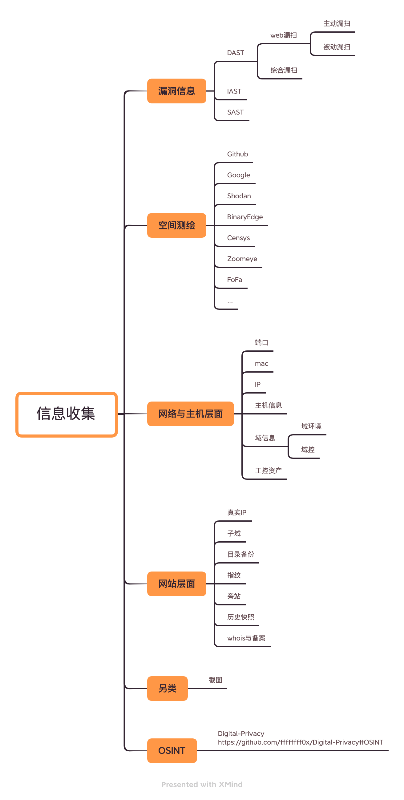

# 信息收集

<p align="center">
    
</p>

> 注 : 笔记中拓扑图 xmind 源文件在其图片目录下

---

## 免责声明

`本文档仅供学习和研究使用,请勿使用文中的技术源码用于非法用途,任何人造成的任何负面影响,与本人无关.`

---

# 大纲

* **[漏洞信息](#漏洞信息)**
    * [DAST](#dast)
        * [web漏扫](#web漏扫)
            * [主动漏扫](#主动漏扫)
            * [被动漏扫](#被动漏扫)
        * [综合漏扫](#综合漏扫)
    * [IAST](#iast)
    * [SAST](#sast)
    * [SRC历史漏洞)](#src历史漏洞)
    * [服务-组件-协议](#服务-组件-协议)

* **[空间测绘](#空间测绘)**

* **[网络-主机](#网络-主机)**
    * [IP扫描](#ip扫描)
    * [MAC扫描](#mac扫描)
    * [端口扫描](#端口扫描)
    * [主机信息](#主机信息)
    * [域信息](#域信息)
        * [域环境](#域环境)
            * [SPN扫描](#spn扫描)
        * [域控](#域控)
    * [工控资产](#工控资产)

* **[网站](#网站)**
    * [真实IP](#真实ip)
    * [子域](#子域)
    * [目录备份](#目录备份)
    * [指纹](#指纹)
    * [旁站](#旁站)
    * [历史快照](#历史快照)
    * [whois与备案](#whois与备案)
    * [截图](#截图)

* **[OSINT](#osint)**
    * [业务信息](#业务信息)
    * [员工信息](#员工信息)

---

**相关文章**
- [我的信息收集之道](https://www.cnblogs.com/cwkiller/p/11900440.html)
- [【原创】CDN 2021 完全攻击指南（一）](http://binmake.com/post/cdn-2021-1/)

---

# 漏洞信息

> 漏扫工具好,牢子进的早

**相关文章**
- [一文洞悉DAST、SAST、IAST ——Web应用安全测试技术对比浅谈](https://www.aqniu.com/learn/46910.html)
- [小议 Dashboard](https://www.tr0y.wang/2021/02/22/about-dashboard/)

## DAST

`动态应用测试`

动态应用程序安全测试（Dynamic Application Security Testing）技术在测试或运行阶段分析应用程序的动态运行状态。它模拟黑客行为对应用程序进行动态攻击，分析应用程序的反应，从而确定该 Web 应用是否易受攻击。

### web漏扫

漏洞扫描器就是扫描漏洞的工具，它能够及早暴露网络上潜在的威胁，有助于加强系统的安全性。漏洞扫描除了能扫描端口，还能够发现系统存活情况，以及哪些服务在运行。

漏洞扫描器本质上是一类自动检测本地或远程主机安全弱点的程序，能够快速的准确的发现扫描目标存在的漏洞，例如，SQL 注入，XSS 攻击，CSRF 攻击等，并提供给使用者扫描结果，提前探知到漏洞，预先修复。

在渗透过程中，一个好的漏扫工具在渗透测试中是至关重要的，可以说是渗透成功或者失败的关键点。一款优秀的扫描器会使渗透更加轻松，但不是扫描漏洞都能用漏扫扫出来的，比如：逻辑漏洞、一些较隐蔽的 XSS 和 SQL 注入。所以，渗透的时候，漏扫都是需要人员来配合使用的。

**漏扫靶机**
- http://testphp.vulnweb.com/ - AWVS PHP+Ajax 漏洞扫描器测试平台
- http://testphp.vulnweb.com/AJAX/ - AWVS Ajax 漏洞扫描器测试平台
- http://testfire.net/ - IBM Appscan 测试平台
- http://demo.aisec.cn/demo/aisec/ - Sec 漏洞扫描器测试平台
- http://testaspnet.vulnweb.com/ - AWVS .Net 漏洞扫描器测试平台
- http://testasp.vulnweb.com/ - AWVS ASP 漏洞扫描器测试平台
- http://zero.webappsecurity.com/

---

#### 主动漏扫

**相关工具**
- [AWVS-acunetix](https://www.acunetix.com/vulnerability-scanner/)
    - 相关文章
        - [编写 AWVS 脚本探测web services](http://gv7.me/articles/2017/Writing-AWVS-scripts-to-detect-Web-Services/)
        - [论如何反击用 AWVS 的黑客](https://www.freebuf.com/news/136476.html)
    - 解密脚本
        - [fnmsd/awvs_script_decode](https://github.com/fnmsd/awvs_script_decode) - 解密好的AWVS10.5 data/script/目录下的脚本
        - [gatlindada/awvs-decode](https://github.com/gatlindada/awvs-decode) - AWVS 解码/解密方法，仅15行代码！！无须任何依赖任何工具
    - awvs13 docker 部署
        - 来自 <sup>[[国光博客](https://www.sqlsec.com/2020/04/awvs.html)]</sup>
            ```bash
            docker pull secfa/docker-awvs   # pull 拉取下载镜像
            docker run -it -d -p 13443:3443 secfa/docker-awvs   # 将Docker的3443端口映射到物理机的 13443端口

            # 容器的相关信息
            # awvs13 username: admin@admin.com
            # awvs13 password: Admin123
            # AWVS版本：13.0.200217097
            # 浏览器访问：https://127.0.0.1:13443/ 即可
            ```
        - https://hub.docker.com/r/raul17/awvs13_crack
            ```bash
            docker run -tid -p 13443:3443 --name awvs_13_ubuntu --privileged=true images_id "/sbin/init"

            # awvs用户名密码见：/opt/awvs13/README.MD
            # awvs页面：https://x.x.x.x:13443/
            若访问awvs页面，发现没被破解，可进入容器，手动破解。
            cd /opt/awvs13
            cp wvsc /home/acunetix/.acunetix/v_200807155/scanner/
            chmod +x /home/acunetix/.acunetix/v_200807155/scanner/wvsc
            cp license_info.json /home/acunetix/.acunetix/data/license/
            ```
    - 辅助工具
        - [test502git/awvs13_batch_py3](https://github.com/test502git/awvs13_batch_py3) - 针对 AWVS 扫描器开发的批量扫描脚本，支持联动 xray、burp、w13scan 等被动批量

- [al0ne/Vxscan](https://github.com/al0ne/Vxscan) - python3 写的综合扫描工具,主要用来敏感文件探测 - 指纹+端口+目录结合,偏向信息泄露,漏洞扫描结果较少
- nikto - 效果一般
    ```
    nikto -host http://xxx.xxx.xxx.xx:8080/
    ```
- [Xyntax/POC-T](https://github.com/Xyntax/POC-T) - 适合批量任务,速度可以
    - [刷 SRC 经验之批量化扫描实践](https://www.freebuf.com/sectool/176562.html)
- [netsparker](https://www.netsparker.com)
- [projectdiscovery/nuclei](../../安全工具/nuclei.md) - 一款基于 Go 语言开发的运行速度非常快且易于使用的开源安全漏洞扫描工具
- [knownsec/pocsuite3](https://github.com/knownsec/pocsuite3)
- [jaeles-project/jaeles](https://github.com/jaeles-project/jaeles)
- [woodpecker-framework/woodpecker-framwork-release](https://github.com/woodpecker-framework/woodpecker-framwork-release)

---

#### 被动漏扫

**相关文章**
- [HTTP被动扫描代理的那些事](https://www.freebuf.com/articles/web/212382.html)

**相关工具**
- [chaitin/xray](https://github.com/chaitin/xray) - 长亭的洞鉴漏扫社区版
    - [xray](../../安全工具/xray.md)
- [w-digital-scanner/w13scan](https://github.com/w-digital-scanner/w13scan) - 一款插件化基于流量分析的扫描器，通过编写插件它会从访问流量中自动扫描，基于 Python3。
    ```bash
    python3 w13scan.py -s 127.0.0.1:7777 --html # 端口可省略，默认为7778,开启--html即实时生成html报告
    ```

---

### 综合漏扫

**相关工具**
- [Nessus](https://www.tenable.com/downloads/nessus)
    - 报告翻译
        - [FunnyKun/NessusReportInChinese](https://github.com/FunnyKun/NessusReportInChinese)
        - [Bypass007/Nessus_to_report](https://github.com/Bypass007/Nessus_to_report)
    - 输出渲染
        - [Ebryx/Nessus_Map](https://github.com/Ebryx/Nessus_Map) - 渲染 .nessus 文件
        - [0bs1d1an/sr2t](https://gitlab.com/0bs1d1an/sr2t) - 将扫描报告转换为表格格式
- [ysrc/xunfeng](https://github.com/ysrc/xunfeng) - 巡风是一款适用于企业内网的漏洞快速应急，巡航扫描系统。
- [Goby](https://gobies.org/) - 白帽汇搞的工具, 实战中尝试了内网扫描, 速度挺快, 打 C 段很好用
    - [闲来无事，反制GOBY](https://mp.weixin.qq.com/s/tl17-Qz-VXpSlZtZWDgeHg)

---

## IAST

`交互式应用测试`

交互式应用程序安全测试（Interactive Application Security Testing）是2012年 Gartner 公司提出的一种新的应用程序安全测试方案，通过代理、VPN 或者在服务端部署 Agent 程序，收集、监控 Web 应用程序运行时函数执行、数据传输，并与扫描器端进行实时交互，高效、准确的识别安全缺陷及漏洞，同时可准确确定漏洞所在的代码文件、行数、函数及参数。IAST 相当于是 DAST 和 SAST 结合的一种互相关联运行时安全检测技术。

**相关工具**
- https://github.com/btraceio/btrace
- https://newrelic.com/

---

## SAST

`静态应用测试`

静态应用程序安全测试（Static Application Security Testing）技术通常在编码阶段分析应用程序的源代码或二进制文件的语法、结构、过程、接口等来发现程序代码存在的安全漏洞。

**相关资源**
- [analysis-tools-dev/static-analysis](https://github.com/analysis-tools-dev/static-analysis) - A curated list of static analysis (SAST) tools for all programming languages, config files, build tools, and more.

**相关工具**
- Fortify Sca
    - 规则解密
        - 相关文章
            - [fortify规则库解密之旅](https://gv7.me/articles/2019/fortify-rule-library-decryption-process/)
            - [fortify SCA内置规则破解到简单工具开发使用](https://blog.csdn.net/liweibin812/article/details/107242966)
        - 解密工具
            - [liweibin123/fortify](https://github.com/liweibin123/fortify)
- Checkmarx CxSAST
- Synopsys Static Analysis (Coverity)
- [ajinabraham/nodejsscan](https://github.com/ajinabraham/nodejsscan) - nodejsscan is a static security code scanner for Node.js applications.

更多 SAST 工具请参考 [语言安全](../语言安全/语言安全.md)

---

## SRC历史漏洞

就是目标在之前被曝出来的漏洞进行收集,验证之前的漏洞是否还未被修复,或者修复了从而引发了其他漏洞的出现。

或者是目标存在相关服务或者后台的版本是否存在漏洞,是否可以利用。

- [SRC-众测收集](../../Power-PenTest.md#SRC-众测收集)

---

## 服务-组件-协议

- [web漏洞利用](../Web安全/BS-Exploits.md)
- [CS架构软件漏洞利用](../软件服务安全/CS-Exploits.md)
- [协议漏洞利用](../协议安全/Protocol-Exploits.md)

---

# 空间测绘

- [空间测绘笔记](./空间测绘.md)

---

# 网络-主机

**相关文章**
- [内外网资产对应关系定位 [ 补 ]](https://mp.weixin.qq.com/s/zrJ2yP6B64A-iFnBdea9PQ)
- [基于service的远程主机os识别之抄个痛快](https://mp.weixin.qq.com/s/N0C9e17BgbzDBA4K48n6Kw)

**TTL 来判断目的主机的操作系统类型**

下面是默认操作系统的 TTL:
```bash
1、WINDOWS NT/2000   TTL:128
2、WINDOWS 95/98     TTL:32
3、UNIX              TTL:255
4、LINUX             TTL:64
5、WIN7              TTL:64
```

**修改本机电脑上面的默认 TTL 值**

通过修改本机上的 TTL 值可以混淆攻击者的判断 (当然, 很少有用户会这么做).TTL 值在注册表的位置是: `HKEY_LOCAL_MACHINE\SYSTEM\CurrentControlSet\Services\Tcpip\Parameters` 其中有个 DefaultTTL 的 DWORD 值, 其数据就是默认的 TTL 值了, 我们可以修改 DefaultTTL 里面的 TTL 默认值, 但不能大于十进制的 255.

**资产扫描工具**
- [JE2Se/AssetScan](https://github.com/JE2Se/AssetScan) - 资产探测工具，检测存活，检测风险端口，常规端口，全端口探测等等，对探测的端口的脆弱面进行安全分析进行 - 调用 masscan 端口扫 + 简易漏扫 + 报表生成
- [LangziFun/LangNetworkTopology3](https://github.com/LangziFun/LangNetworkTopology3) - IP/IP 段资产扫描 --> 扫描开放端口识别运行服务部署网站 --> 自动化整理扫描结果 --> 输出可视化报表 + 整理结果 - 本质还是调用 masscan + 生成报表 实际使用效果不佳
- [Router Scan](http://stascorp.com/load/1-1-0-56) - 路由器扫描软件, 但扫 C 段也很有用
- [dilap54/RouterScan-console](https://github.com/dilap54/RouterScan-console) - Router Scan 命令行版
- [TophantTechnology/ARL](https://github.com/TophantTechnology/ARL) -  ARL 资产侦察灯塔系统旨在快速侦察与目标关联的互联网资产，构建基础资产信息库。 协助甲方安全团队或者渗透测试人员有效侦察和检索资产，发现存在的薄弱点和攻击面。
- [er10yi/MagiCude](https://github.com/er10yi/MagiCude) - 分布式端口（漏洞）扫描、资产安全管理、实时威胁监控与通知、高效漏洞闭环、漏洞 wiki、邮件报告通知、poc 框架
- [shadow1ng/fscan](https://github.com/shadow1ng/fscan) - 支持主机存活探测、端口扫描、常见服务的爆破、ms17010、redis批量写私钥、计划任务反弹shell、读取win网卡信息、web漏洞扫描等。

---

## IP扫描

当设备连接网络，设备将被分配一个 IP 地址，用作标识。通过 IP 地址，设备间可以互相通讯，如果没有 IP 地址，我们将无法知道哪个设备是发送方，无法知道哪个是接收方。IP 地址有两个主要功能：标识设备或网络和寻址。

常见的 IP 位址分为 IPv4 与 IPv6 两大类，IP 地址由一串数字组成。IPv4 由十进制数字组成，并以点分隔，如：172.16.254.1 ；IPv6 由十六进制数字组成，以冒号分割，如：2001:db8:0:1234:0:567:8:1

**CIDR处理**
- [projectdiscovery/mapcidr](https://github.com/projectdiscovery/mapcidr)
- [zhanhb/cidr-merger](https://github.com/zhanhb/cidr-merger)

**ip信息查询**
- [zu1k/nali](https://github.com/zu1k/nali)

**ipv4**

IPv4 地址是类似 `A.B.C.D` 的格式, 它是 32 位, 用 `.` 分成四段, 用 10 进制表示; 而 IPv6 地址类似 `X:X:X:X:X:X:X:X` 的格式, 它是 128 位的, 用 `:` 分成 8 段, 用 16 进制表示;

- **LOL**
    ```bash
    # windows
    for /l %i in (1,1,255) do @ ping 192.168.1.%i -w 1 -n 1 | find /i "ttl="

    # windows
    # 把前期在外网搜集到的目标子域列表整理好，拿到内网循环ping，然后把解析到的ip截下来
    for /f "delims=" %i in (host.txt) do @ping -w 1 -n 1 %i | findstr /c:"[10." /c:"[192." /c:"[172." >> C:/users/public/out.txt
    ```

- **探测工具**
    - [alexxy/netdiscover: netdiscover](https://github.com/alexxy/netdiscover) - 内网中实测效果不好,不建议使用
    - [nbtscan - NETBIOS nameserver scanner](http://unixwiz.net/tools/nbtscan.html) - 内网中实测效果不好
    - nmap
        ```
        nmap -sP <网段>/24
        ```
    - [shmilylty/netspy](https://github.com/shmilylty/netspy) - netspy是一款快速探测内网可达网段工具
        ```bash
        netspy -h                   # 查看帮助信息
        netspy icmpspy              # 使用icmpspy模块进行探测
        netspy arpspy -i eth0       # 指定使用eth0网络接口进行arp协议探测
        netspy tcpspy -p 22 -p 3389 # 使用tcpspy模块进行探测
        netspy udpspy -p 53 -p 137  # 使用udpspy模块进行探测
        ```

**ipv6**

从 IPv4 到 IPv6 最显著的变化就是网络地址的长度，有 128 位长；

---

## MAC扫描

MAC 位址，以太网地址或物理地址，它是一个用来确认网络设备位置的位址。

MAC 地址的长度为 48 位 (6 个字节)，通常表示为 12 个 16 进制数，如：00-16-EA-AE-3C-40 就是一个 MAC 地址，其中前 6 位 16 进制数 00-16-EA 代表网络硬件制造商的编号，它由 IEEE(电气与电子工程师协会) 分配，而后 6 位 16 进制数 AE-3C-40 代表该制造商所制造的某个网络产品 (如网卡) 的系列号。只要不更改自己的 MAC 地址，MAC 地址在世界是惟一的。形象地说，MAC 地址就如同身份证上的身份证号码，具有唯一性.

**探测工具**
- [科来 MAC 地址扫描器](http://www.colasoft.com.cn/download/capsa_tool_cmac.php)
- arp-scan
    ```
    arp-scan -l
    ```

---

## 端口扫描

通过对目标地址的 TCP/UDP 端口扫描，确定其开放的服务数量和类型。通过端口扫描，可以基本确定一个系统的基本信息，并且结合测试人员的经验可以确定其可能存在，以及被利用的安全弱点，为进行深层次的渗透提供依据.

**Tips**

1. 有时候扫描主机会碰到显示大量开放端口, 这种可能都是虚的, 是 waf 在起作用.
2. nmap 在有些场景下不一定能把所有开放端口扫出, 这时候换一个工具说不定有奇效.

**LOL**
```bash
# Linux scanning the 65535 ports
for port in {1..65535};do curl -s http://host:$port;done
for port in {1..65535};do wget -nv http://host:$port;done

# Linux scanning the 65535 ports with raw http request
for port in {1..65535}; do
    echo >/dev/tcp/host/$port &&
        echo "port $port is open" ||
        echo "port $port is closed"
done

# Linux scanning ports
curl http://host:[1-100] 1> 1.txt 2>/dev/null
curl http://host:[8000-9999] 1>> 1.txt 2>/dev/null
```

**端口安全**
- [端口安全](./端口安全.md)

**端口信息**
- [Service Name and Transport Protocol Port Number Registry](https://www.iana.org/assignments/service-names-port-numbers/service-names-port-numbers.xhtml)

**扫描工具**
- nmap
    - [nmap 笔记](../../安全工具/Nmap.md)
- [masscan](https://github.com/robertdavidgraham/masscan)
    ```bash
    # 常用
    masscan 127.0.0.0/24 -p80,161,443,873,2181,3389,6379,7001,8000,8009,8080,9000,9009,9090,9200,9300,10000,50070 > results.txt

    # 远程登录
    masscan 127.0.0.0/24 -p22,23,3389,5632,5800,5900,5901 > results.txt

    # 文件服务
    masscan 127.0.0.0/24 -p20,21,445,873,2049 > results.txt

    # 数据库
    masscan 127.0.0.0/24 -p1433,1521,3306,4100,5000,5432,5984,6379,11211,27017,27018 > results.txt

    # 单端口扫描
    masscan 127.0.0.0/24 -p443

    # 多端口扫描 扫描 80 或 443 端口的 B 类子网
    masscan 127.0.0.0/24 -p80,443

    # 扫描一系列端口 扫描 22 到 25 端口的 B 类子网
    masscan 127.0.0.0/24 -p22-25

    # 快速扫描
    masscan 127.0.0.0/24 -p80,8000-9000 --rate 100000

    # 排除目标
    masscan 127.0.0.0/24 -p80,8000-9000 --excludefile exclude.txt

    # 结果保存
    masscan 127.0.0.0/24 -p80,8000-9000 > results.txt
    ```
- msf
    ```bash
    set scanner/portscan/tcp
    set rhosts <ip/CIDR>
    set ports <port>
    set THREADS <s>
    set TIMEOUT <s>
    run
    ```
- [gnebbia/halive](https://github.com/gnebbia/halive) - 快速对 URL 探活,可以配合端口扫描工具批量检测.
- [hdm/nextnet](https://github.com/hdm/nextnet) - 专门扫描 137 端口存活主机
- [hellogoldsnakeman/masnmapscan-V1.0](https://github.com/hellogoldsnakeman/masnmapscan-V1.0) - 一款端口扫描器。整合了 masscan 和 nmap 两款扫描器. - 实际使用效果一般
- [RustScan/RustScan](https://github.com/RustScan/RustScan) -rust 写的用于代替 nmap 的端口扫描器
    - 不是很推荐
- [projectdiscovery/naabu](https://github.com/projectdiscovery/naabu) - A fast port scanner written in go with a focus on reliability and simplicity. Designed to be used in combination with other tools for attack surface discovery in bug bounties and pentests
    - naabu 是非常好用的扫描器,只不过需要调整使用的参数,默认使用效果并不很好,个人建议是,rate 4000,retries 3,运行多次来扫描不同端口,这样结果又快又准
- [L-codes/MX1014](https://github.com/L-codes/MX1014) - 灵活、轻便和快速端口扫描器
- [redtoolskobe/scaninfo](https://github.com/redtoolskobe/scaninfo)
- [zyylhn/zscan](https://github.com/zyylhn/zscan)

---

## 主机信息

- [Linux主机信息收集](../../../Integrated/Linux/笔记/信息.md)
- [Windows主机信息收集](../../../Integrated/Windows/笔记/信息.md)

---

## 域信息

**域信息收集相关工具/脚本**
- [PowerSploit](https://github.com/PowerShellMafia/PowerSploit/tree/master/Recon)
- [BloodHound](https://github.com/BloodHoundAD/BloodHound) - 域环境分析工具
    - 参考文章 : [域渗透分析工具BloodHound 1.5.2入门实战](https://www.freebuf.com/sectool/179002.html)
- [impacket](https://github.com/SecureAuthCorp/impacket) - 一个网络协议工具包
    ```bash
    git clone https://github.com/CoreSecurity/impacket.git
    cd impacket/
    python setup.py install
    cd impacket/examples
    ```
    - Ping.py

        一个简单的 ICMP ping 脚本，使用 ICMP echo 和 echo-reply 数据包检查主机状态。
        ```
        ./ping.py [Source IP] [Destination IP]
        ```
    - Lookupsid.py

        通过 [MS-LSAT] MSRPC 接口的 Windows SID bruteforcer 示例，旨在查找远程用户/组。
        ```
        ./lookupsid.py test/Administrator:Abcd1234@192.168.1.100
        ```
    - Rpcdump.py

        该脚本将转储在目标上注册的 RPC 端点和字符串 bindings 列表。它也会尝试将它们与一些知名的端点进行匹配。
        ```
        ./rpcdump.py test/Administrator:Abcd1234@192.168.1.100
        ```
    - Samrdump.py

        与 MSRPC 套件中的安全帐户管理器远程接口通信的应用程序。它将为我们列出目标系统上的用户帐户，可用资源共享以及通过此服务导出的其他敏感信息
        ```
        ./samrdump.py test/Administrator:Abcd1234@192.168.1.100
        ```
    - Wmiquery.py

        它允许发出 WQL 查询并获取目标系统 WMI 对象的描述信息。
        ```
        ./wmiquery.py test/Administrator:Abcd1234@192.168.1.100
        ```
    - getArch.py

        该脚本将连接目标（或目标列表上的）计算机，并使用已记录的 MSRPC 特征收集由（ab）安装的操作系统架构类型。
        ```
        ./getArch.py -target 192.168.1.100
        ```

---

### 域环境

**查询所有域主机名**
```
dsquery computer
```

**查看所有域**
```
net view /domain
```

**查看域中的用户名**
```
net user /domain
dsquery user
```

**查询域组名称**
```
net group /domain
```

**查询域联系人**
```
dsquery contact
```

**查询域中所有的组**
```
dsquery group
```

**查询域中所有的组织单元**
```
dsquery ou
```

**查询域中所有的站点**
```
dsquery site
```

**查询指定域主机名**
```
dsquery computer -name win* -desc desktop -limit 0
```

**查询 n 周未活动的域主机名**
```
dsquery computer -inactive n -limit 0
```

**查询 n 天内未更改密码的域主机名**
```
dsquery computer -stalepwd n
```

**查询指定域的域主机名**
```
dsquery computer -s ip -u username -p password -limit 0
```

**查询域中的配额规范**
```
dsquery quota
```

**查询域中的分区对象**
```
dsquery partition
```

**查看域时间**
```
net time /domain
```

#### SPN扫描

SPN 是服务在使用 Kerberos 身份验证的网络上的唯一标识符。 它由服务类、主机名和端口组成。 在使用 Kerberos 身份验证的网络中，必须在内置计算机帐户（如 NetworkService 或 LocalSystem）或用户帐户下为服务器注册 SPN。 对于内置帐户，SPN 将自动进行注册。 但是，如果在域用户帐户下运行服务，则必须为要使用的帐户手动注册 SPN。

SPN 扫描的主要好处是，SPN 扫描不需要连接到网络上的每个 IP 来检查服务端口, SPN 通过 LDAP 查询向域控执行服务发现，spn 查询是 kerberos 票据行为一部分,，域内的主机都能查询 SPN，因此比较难检测 SPN 扫描。所以在域内不用做端口扫描也可以隐蔽地探测域内的服务。当利用 SPN 扫描找到域管登录过的系统，对渗透权限扩展有很大的帮助。

要使用 Active Directory 作为 Kerberos 实现，可以使用 `setspn` 命令来注册 SPN。要运行此命令，必须满足下列条件：
- 必须登录到域控制器
- 必须运行提升了特权的命令提示符（以管理员身份运行）
- 必须是 Domain Admins 组的成员（或者域管理员已授予你适当的许可权）

SPN 分为两种：
- 当一个服务的权限为 Local System 或 Network Service，则 SPN 注册在域内机器帐户 (Computers) 下
- 当一个服务的权限为一个域用户，则 SPN 注册在域用户帐户 (Users) 下

---

一些注意的服务 :
- AGPMServer：通常具有所有 GPO 的完全控制权。
- MSSQL/MSSQLSvc：具有管理员权限的 SQL 服务器通常会有一些有趣的数据。
- FIMService：通常对多个 AD 林具有管理权限。
- STS：VMWare SSO 服务，可以提供访问 VMWare 的后门。

对于 RC4 加密的使用 tgsrepcrack 解密

对于 AES 加密的使用 Kirbi2john 转换为 hash，通过 hashcat 爆破

**案例**

用户 AAA 要访问 MSSQL 服务的资源，进行到 Kerberos 认证的第四步 (TGS-REP) 时，KDC 查询 MSSQL 服务的 SPN，若该 SPN 注册在机器账户 (Computers) 下，TGS 将会查询数据库中所有机器账户 (Computers) 的 ServicePrincipalName 属性，找到对应的账户，使用该账户的 NTLM Hash 对 `Client/Server Session Key`、`Client Info`（包含 Client ID）、`TimeStamp` 加密得到 `Client-To-Server Ticket`（也称为 ST 票据）。若查询服务的 SPN 注册在域用户账户 (Users) 下，TGS 将会查询数据库中所有域用户账户 (Users) 的 `ServicePrincipalName` 属性，找到对应的账户，使用该账户的 NTLM Hash 对 Client/Server Session Key、`Client Info`（包含 Client ID）、`TimeStamp` 加密得到 `Client-To-Server Ticket`（也称为 ST 票据）

**内置工具 setspn 查询**

setspn 是 Windows 内置工具，可以检索用户账户和服务之间的映射，此工具可以添加、删除、查看 SPN 的注册情况。

为账户 god.org/dbadmin 注册 SPNMSSQLSvc/SqlServer.god.org：
```
setspn -A MSSQLSvc/SqlServer.god.org dbadmin
```

查看 SPN：
```
// 查看当前域内的所有 SPN
setspn.exe -q */*

// 查看 god 域内的所有 SPN
setspn.exe -T god -q */*

// 查看 dbadmin 账户的 SPN
setspn -l dbadmin
```

> 以 CN 开头的每一行代表一个账户，紧跟下面的信息是与该账户有关的SPN。

机器账户(Computers)为：
```
CN=OWA2010CN-GOD,OU=Domain Controllers,DC=god,DC=org
CN=MARY-PC,CN=Computers,DC=god,DC=org
CN=SQLSERVER,CN=Computers,DC=god,DC=org
...
```

域用户账户(Users)为：
```
CN=krbtgt,CN=Users,DC=god,DC=org
CN=dbadmin,CN=Users,DC=god,DC=org
```

> 注册在域用户账户下的 SPNMSSQLSvc/SqlServer.god.org 和 kadmin/changepw

**SPN 扫描相关工具**
- **GetUserSPNs**
    - https://github.com/nidem/kerberoast
        ```
        .\GetUserSPNs.ps1
        cscript.exe GetUserSPNs.vbs         利用 GetUserSPNs.vbs 进行 SPN 信息查询
        ```

- **PowerView**
    - https://github.com/PowerShellMafia/PowerSploit/tree/master/Recon
        ```powershell
        PS C:\Users\Administrator\Desktop\Recon> Import-Module .\PowerView.ps1
        PS C:\Users\Administrator\Desktop\Recon> Get-NetUser -SPN
        ```

- **Powershell AD Recon**
    - https://github.com/PyroTek3/PowerShell-AD-Recon
        ```powershell
        //如查看MSSQL（其他的同理）：

        //导入脚本
        Import-Module .\Discover-PSMSSQLServers.ps1
        //查找MSSQL所有实例
        Discover-PSMSSQLServers
        ```

- **PowerShellery**
    - https://github.com/nullbind/Powershellery
        ```powershell
        PS C:\Users\dbadmin\Desktop\Get-SPN> Import-Module .\Get-SPN.psm1
        PS C:\Users\dbadmin\Desktop\Get-SPN> Get-SPN -type service -search "*"

        //查找所有的SPN服务
        Get-SPN -type service -search "*" -List yes | Format-Table
        //查找MSSQL服务
        Get-SPN -type service -search "MSSQLSvc*" -List yes
        //若在一个非域系统上，可以使用以下命令执行
        Get-SPN -type service -search "*" -List yes -DomainController 域控IP -Credential domainuser| Format-Table -Autosize
        ```

- **RiskySPN**
    - https://github.com/cyberark/RiskySPN
        ```powershell
        Import-Module .\RiskySPNs.psm1
        Find-PotentiallyCrackableAccounts
        ```

- **Adfind**
    - http://www.joeware.net/freetools/tools/adfind/
        ```
        Adfind -f "ServicePrincipalName=MSSQLSvc*"
        Adfind -h 域控地址 -sc spn:*
        ```

**相关文章**
- [Locate and Attack Domain SQL Servers without Scanning](https://blog.netspi.com/locate-and-attack-domain-sql-servers-without-scanning/) - 通过 SPN 扫描域内 MSSQL 服务
- [SPN Scanning - Service Discovery without Network Port Scanning](https://adsecurity.org/?p=1508)

---

### 域控

**查找域管理员**
```
net group "Domain Admins" /domain
```

**查找域控**
```bash
ping test.com               # 查看域控的 IP
net time /domain            # 查看时间,域控机器名
nltest /DCLIST:test.com     # 查看域控名字
net group "Domain Controllers" /domain
dsquery server
```

---

## 工控资产

**相关文章**
- [工控资产嗅探与分析实践](https://www.freebuf.com/articles/ics-articles/209786.html)

**相关工具**
- nmap
    - [nmap工控探测脚本](../../安全工具/Nmap.md#工控探测)
- [ISF](https://github.com/dark-lbp/isf)
    ```bash
    scanners/s7comm_scan        # 选择 S7 扫描插件
    scanners/vxworks_6_scan     # 选择 vxworks 扫描插件
    scanners/cip_scan           # 选择 cip_scan 扫描插件
    ```
- [plcscan](https://code.google.com/archive/p/plcscan/) - 通过 s7comm 或 modbus 协议扫描 PLC 设备的工具。
- msf
    ```bash
    use auxiliary/scanner/scada/modbusdetect
    ```

---

# 网站

**教程/案例**
- [web渗透第一步之信息搜集[子域,旁站,C段,AS号...]](https://klionsec.github.io/2014/12/12/subdomain-info-serarch/)
- [WEB安全入门系列之信息收集](https://www.secpulse.com/archives/74312.html)
- [【转】浅析前期信息收集方法](http://www.nifengi.com/2017/10/18/%e3%80%90%e8%bd%ac%e3%80%91%e6%b5%85%e6%9e%90%e5%89%8d%e6%9c%9f%e4%bf%a1%e6%81%af%e6%94%b6%e9%9b%86%e6%96%b9%e6%b3%95/)
- [[原创]安全攻城师系列文章－信息收集工具篇-『WEB安全』-看雪安全论坛](https://bbs.pediy.com/thread-217016.htm)
- [渗透测试--01信息搜集](http://zjw.dropsec.xyz/%E6%B8%97%E9%80%8F/2017/08/03/%E6%B8%97%E9%80%8F%E6%B5%8B%E8%AF%95-01%E4%BF%A1%E6%81%AF%E6%90%9C%E9%9B%86.html)
- [”安全线“大型目标渗透](https://paper.tuisec.win/detail/ad2ddfc0965abe6)
- [微服务渗透之信息搜集](https://xz.aliyun.com/t/7099)
- [新时代的渗透思路！微服务下的信息搜集（II）](https://xz.aliyun.com/t/7252)
- [攻防演练模式下的信息收集--Fofa工程师](https://mp.weixin.qq.com/s/vXJ7Tmr1-xlgE0AwB8RxAA)

**资产扫描工具**
- [smicallef/spiderfoot](https://github.com/smicallef/spiderfoot) - SpiderFoot 是一个 Python 编写的免费开源的网站信息收集类工具，并且支持跨平台运行，适用于 Linux、*BSD 和 Windows 系统。提供了 GUI 界面。可以获取网站子域、电子邮件地址、web 服务器版本等等信息。
- [broken5/WebAliveScan](https://github.com/broken5/WebAliveScan) - 对目标域名进行快速的存活扫描、简单的指纹识别、目录扫描
    ```bash
    pip3 install -r requirements.txt -i https://mirrors.aliyun.com/pypi/simple/
    python3 webscan.py --target target.txt --port 80
    python3 webscan.py --target target.txt --port small
    python3 webscan.py --target target.txt --port large
    ```
- [projectdiscovery/httpx](https://github.com/projectdiscovery/httpx)
- [tomnomnom/httprobe](https://github.com/tomnomnom/httprobe)

## 真实IP

为什么要寻找真实 IP?，当某个企业使用了 CDN/云防线/反向代理等方式对服务进行架构设计时，我们通过 ping 命令等并不能直接将请求传递到真实的服务器上，而是经过一层设置对该请求进行转向，导致到我们不能获取到真实服务器的开放端口等信息进行收集。

**相关文章**
- [绕过 CDN 查找网站真实 IP](https://xiaix.me/rao-guo-cdncha-zhao-wang-zhan-zhen-shi-ip/)
- [绕过 cdn,查找真实 IP | 冰羽の博客](https://www.bingyublog.com/2018/03/25/%E7%BB%95%E8%BF%87cdn%EF%BC%8C%E6%9F%A5%E6%89%BE%E7%9C%9F%E5%AE%9EIP/)
- [聊聊 CDN 的误区 - r34l!ty - 不负勇往](http://rinige.com/index.php/archives/772/)
- [网站真实 IP 发现手段浅谈 - 安全客,安全资讯平台](https://www.anquanke.com/post/id/163348)
- [如何寻找隐藏在 CloudFlare 或 TOR 背后的真实原始 IP - 嘶吼 RoarTalk](https://www.4hou.com/technology/13713.html)
- [CloudFlair: Bypassing Cloudflare using Internet-wide scan data](https://blog.christophetd.fr/bypassing-cloudflare-using-internet-wide-scan-data/)

**相关工具**
- [pielco11/fav-up](https://github.com/pielco11/fav-up) - 从 favicon 图标查真实 IP 的工具,需要 Shodan API(付费的)
- [christophetd/CloudFlair](https://github.com/christophetd/cloudflair) - 通过使用 Censys 的数据查找真实 IP 的工具,需要 Censys API
- [3xp10it/xcdn](https://github.com/3xp10it/xcdn) - 尝试找出 cdn 背后的真实 ip 的工具
- [greycatz/CloudUnflare](https://github.com/greycatz/CloudUnflare) - 用于绕过 Cloudflare 侦查真实 IP 地址.
- [boy-hack/w8fuckcdn](https://github.com/boy-hack/w8fuckcdn) - 通过扫描全网绕过 CDN 获取网站 IP 地址,建议参考思路,不建议实战实用

**tips**
- Nslookup

    `nslookup + 域名`

- phpinfo

- 利用邮件服务器找到真实 IP

    Web 跟 Email 服务属同服务器的情况下可以通过 Email 来查询目标真实 IP 地址，但如果 Web 跟 Email 属不同服务器，那么我们通过 Email 得到的可能只是邮件服务器的 IP 地址。

- 多地 ping 域名

    利用在线网站服务多地 ping 测试
    - [CDN Finder tool - CDN Planet](https://www.cdnplanet.com/tools/cdnfinder/)
    - [CDN检测](https://myssl.com/cdn_check.html)
    - [多个地点Ping服务器,网站测速 - 站长工具](http://ping.chinaz.com/)
    - [网站测速工具_超级ping _多地点ping检测 - 爱站网](https://ping.aizhan.com/)
    - [DNSMap](https://dnsmap.io/) - 检查来自世界各地的多个DNS名称服务器和解析器的域名或主机名的当前IP
    - [Ping.cn:网站测速-ping检测-dns查询-ipv6网站测试-路由跟踪查询](https://www.ping.cn/)

- "常识"判断

    在反查网站 ip 时,如果此网站有 1000 多个不同域名,那么这个 ip 多半不是真实 ip.

    如果一个 asp 或者 asp.net 网站返回的头字段的 server 不是 IIS、而是 Nginx,那么多半是用了 nginx 反向代理,而不是真实 ip.

    如果 ip 定位是在常见 cdn 服务商的服务器上,那么是真实 ip 的可能性就微乎其微了.

- 子域名查找

    利用一些在线查询的网站,例如 https://dnsdb.io/zh-cn/ 只需输入 baidu.com type:A 就能收集百度的子域名和 ip

    Google 搜索 Google site:baidu.com -www 就能查看除 www 外的子域名

    总结:收集子域名后尝试以解析 ip 不在 CDN 上的 ip 解析主站,真实 ip 成功被获取到.

- 历史 DNS 解析记录

    > 上面下面这么多方法里，这个应该是成功率较高的了

    通过查询历史的 DNS 解析 IP,有可能得到真实 IP
    - https://x.threatbook.cn/nodev4/vb4/list
    - https://viewdns.info/iphistory/
    - https://securitytrails.com/

- SSL 证书
    - [CloudFlair: Bypassing Cloudflare using Internet-wide scan data](https://blog.christophetd.fr/bypassing-cloudflare-using-internet-wide-scan-data/)
    - https://www.censys.io

- 查询网站标题找到真实 IP

    有提议通过遍历全球 IP 端口匹配标题来找源 IP 的方法,太不切实际了,与其这样不如直接到 shodan 搜索网站标题 Title,这样说不定还更快.

- F5 LTM 解码法

    当服务器使用 F5 LTM 做负载均衡时,通过对 set-cookie 关键字的解码真实 ip 也可被获取,例如:Set-Cookie: BIGipServerpool_8.29_8030=487098378.24095.0000,先把第一小节的十进制数即 487098378 取出来,然后将其转为十六进制数 1d08880a,接着从后至前,以此取四位数出来,也就是 0a.88.08.1d,最后依次把他们转为十进制数 10.136.8.29,也就是最后的真实 ip.

    其实我就像问一句,你家祖传的 F5 设备不更新的吗？

- DDOS 消耗

    我看过不少文章将通过 DDOS 来消耗对方流量,只要把流量打光，就会回滚到原始 IP，还特别拿 cloudflare 举例，说明下, cf 免费版 ddos 无限量防护,不过部分国内 CDN 是可以的。

- 拿下 CDN 节点服务器的权限

    离谱,你还不如社工管理员服务器 IP 地址来得快呢

---

## 子域

子域名（或子域；英语：Subdomain）是在域名系统等级中，属于更高一层域的域。比如，mail.example.com 和 calendar.example.com 是 example.com 的两个子域，而 example.com 则是顶级域 .com 的子域。

在渗透测试的时候，往往主站的防御会很强，常常无从下手，那么子站就是一个重要的突破口，因此子域名是渗透测试的主要关注对象.

**域名级别**
- **顶级域名**

    顶级域名又分为两类：

    - 国家顶级域名（national top-level domainnames，简称 nTLDs），200 多个国家都按照 ISO3166 国家代码分配了顶级域名，例如中国是 .cn，美国是 .us，日本是 .jp 等；

    - 国际顶级域名（international top-level domain names，简称iTDs），例如表示工商企业的 .com，表示网络提供商的 .net，表示顶级标杆、个人的 .top，表示非盈利组织的 .org 等。

- **二级域名**

    二级域名是互联网 DNS 等级之中，处于顶级域名之下的域。 二级域名是域名的倒数第二个部份，例如在域名 example.com 中，二级域名是 example 。

- **三级域名**

    三级域名用字母（a～z）、数字（0～9）和连接符（－）组成， 各级域名之间用实点（.）连接，三级域名的长度不能超过20个字符。 如无特殊原因，采用申请人的英文名（或者缩写）或者汉语拼音名 （或者缩写） 作为三级域名，以保持域名的清晰性和简洁性。

**相关文章**
- [Subdomain Recon](https://echocipher.github.io/2019/07/24/Subdomain-Recon/)
- [从代码角度看各类子域名收集工具](https://paper.seebug.org/1292/)
- [子域名发现的20种方法](https://mp.weixin.qq.com/s/X5B1CheRDcSu62tcnNRRHg)

**学习资料**
- [appsecco/bugcrowd-levelup-subdomain-enumeration](https://github.com/appsecco/bugcrowd-levelup-subdomain-enumeration) - 此资料库包含了在 Bugcrowd LevelUp 2017 虚拟会议上进行的演讲 “神秘的子域枚举技术” 中的所有演讲材料，视频和脚本。

**相关工具**
- [shmilylty/OneForAll](https://github.com/shmilylty/OneForAll) - 非常优秀的子域名爆破工具,推荐
    ```bash
    python3 oneforall.py --target example.com run
    python3 oneforall.py --targets ./example.txt run
    ```
- [knownsec/ksubdomain](https://github.com/knownsec/ksubdomain) - 无状态子域名爆破工具,推荐
    - [ksubdomain 无状态域名爆破工具](https://paper.seebug.org/1325/)
    ```bash
    ksubdomain -d xxx.com -o out.txt
    ```
- [blechschmidt/massdns](https://github.com/blechschmidt/massdns) -  一个高性能的DNS存根解析器，用于批量查找和侦察（子域枚举）。
- [Threezh1/JSFinder](https://github.com/Threezh1/JSFinder) - 通过在 js 文件中提取 URL,子域名
- [LangziFun/LangSrcCurise](https://github.com/LangziFun/LangSrcCurise) - 持续性的子域名监控
- [tomnomnom/assetfinder](https://github.com/tomnomnom/assetfinder) - GO语言编写,从社交网站、威胁搜索引擎获取子域的工具
- [infosec-au/altdns](https://github.com/infosec-au/altdns) - 生成大量的子域列表,配合爆破工具使用
- [Edu4rdSHL/findomain](https://github.com/Edu4rdSHL/findomain) - Rust语言编写的子域枚举工具
- [OWASP/Amass](https://github.com/OWASP/Amass) - 多功能信息收集工具
- [lijiejie/subDomainsBrute](https://github.com/lijiejie/subDomainsBrute) - 本工具用于渗透测试目标域名收集。高并发DNS暴力枚举
- [bit4woo/teemo](https://github.com/bit4woo/Teemo) - 域名收集及枚举工具
- [ring04h/wydomain](https://github.com/ring04h/wydomain) - python语言编写的子域枚举工具
- [fwaeytens/dnsenum](https://github.com/fwaeytens/dnsenum) - 一个枚举DNS信息的 perl 脚本
- [mschwager/fierce](https://github.com/mschwager/fierce) - 一个 DNS 侦查工具，用于查找非连续 IP 空间。
- [OJ/gobuster](https://github.com/OJ/gobuster) - go 写的枚举工具可爆破目录、DNS、虚拟主机名,速度极快
- [esecuritylab/kostebek](https://github.com/esecuritylab/kostebek) - 一种使用公司商标信息来发现其域名的侦察工具
- [MilindPurswani/Syborg](https://github.com/MilindPurswani/Syborg) - 一个递归 DNS 域枚举器，它既不是主动的也不是完全被动的。该工具仅构造一个域名，然后使用指定的DNS服务器查询该域名。
- [guelfoweb/knock](https://github.com/guelfoweb/knock) - python 编写的 DNS 枚举工具，支持对 VirusTotal 子域的查询
- [tismayil/rsdl](https://github.com/tismayil/rsdl) - go语言编写,采用 ping 方式的子域扫描工具
- [joinsec/BadDNS](https://github.com/joinsec/BadDNS) - BadDNS 是一款使用 Rust 开发的使用公共 DNS 服务器进行多层子域名探测的极速工具。
    ```
    ./baddns -t target.txt -s domaindict-170W.txt -d depthdict.txt
    ```
- [projectdiscovery/subfinder](https://github.com/projectdiscovery/subfinder)
- [yunxu1/dnsub](https://github.com/yunxu1/dnsub)

**host 碰撞**
- [fofapro/Hosts_scan](https://github.com/fofapro/Hosts_scan) - 一个用于 IP 和域名碰撞匹配访问的小工具，旨意用来匹配出渗透过程中需要绑定 hosts 才能访问的弱主机或内部系统。
- [pmiaowu/HostCollision](https://github.com/pmiaowu/HostCollision)

**Tips**

- 子域名扫描尽量通过第三方平台进行收集。
    ```bash
    # 从 rapid7 sonar项目下载公共数据集,解压缩进行匹配
    wget https://opendata.rapid7.com/sonar.fdns_v2/2020-09-25-1600992617-fdns_any.json.gz   # 23G,谨慎下载
    cat 2020-09-25-1600992617-fdns_any.json.gz | pigz -dc | grep ".target.org" | jq
    ```
- 通过 HTTPS 证书查询
    - 见 [Censys](./空间测绘.md#Censys)
- 从代码托管网站或在线服务商查询
    - 见 [Github](./空间测绘.md#Github)
- 第三方网站接口查询
    - https://x.threatbook.cn/nodev4/vb4/list - 内容需注册可见
    - https://www.riskiq.com/ - 内容需注册可见
    - https://www.shodan.io/ - 无需注册
    - https://findsubdomains.com - 内容需注册可见
    - censys.io - 无需注册
    - https://www.zoomeye.org/ - 无需注册
    - https://fofa.so/ - 无需注册
    - https://www.threatcrowd.org/ - 无需注册
    - https://dnsdumpster.com/ - 无需注册
    - https://securitytrails.com/ - 无需注册
    - https://viewdns.info/ - 无需注册
    - https://www.dnsdb.io/zh-cn/ - 部分内容需注册可见
- 在线 api
    ```bash
    https://dns.bufferover.run/dns?q=baidu.com  # 调用的 Rapid7 数据
    https://rapiddns.io/subdomain
    ```
    - 更多开放 api 参考 : https://opendata.rapid7.com/apihelp/
    - 开放数据下载 : https://opendata.rapid7.com/

---

## 目录备份

在渗透测试中,在对目标网站进行渗透时,对网站的下级目录进行目录扫描,用以发现目标网站是否存在 OA,网站后台,敏感目录或者任意文件下载等信息.

**字典**

字典资源见 Power-PenTest [Web 字典](../../Power-PenTest.md#字典) 部分

**相关文章**
- [熟练使用各类敏感目录文件扫描工具](https://klionsec.github.io/2014/12/16/dirscan-tools/)

**目录扫描工具**
- [ffuf/ffuf](https://github.com/ffuf/ffuf) - go 写的 web fuzz 工具,很好用,推荐
    ```bash
    ffuf -c -mc 200,301,302,403 -t 50 -u http://testphp.vulnweb.com/FUZZ -w dic.txt
    ffuf -c -mc 200,301,302,403 -t 50 -u http://testphp.vulnweb.com/FUZZ -b "NAME1=VALUE1; NAME2=VALUE2" -w dic.txt # Cookie
    ```
    - [ffuf/ffuf-scripts](https://github.com/ffuf/ffuf-scripts)
- [wfuzz](../../../工具/Wfuzz.md)
- [OJ/gobuster](https://github.com/OJ/gobuster) - go 写的枚举工具可爆破目录、DNS、虚拟主机名,报错较多
    ```
    ./gobuster dir -u http://testphp.vulnweb.com/ -w dic.txt
    ```
- [nccgroup/dirble](https://github.com/nccgroup/dirble) - rust 写的目录扫描工具,效果一般
    ```
    ./dirble http://testphp.vulnweb.com/ -w dic.txt
    ```
- [maurosoria/dirsearch](https://github.com/maurosoria/dirsearch) - python 写的目录扫描工具,效果一般
- [Nekmo/dirhunt](https://github.com/Nekmo/dirhunt) - python 写的目录扫描工具,效果一般
- [Xyntax/DirBrute](https://github.com/Xyntax/DirBrute) - python 写的目录扫描工具,效果一般,且长期未更新
- [H4ckForJob/dirmap](https://github.com/H4ckForJob/dirmap) - python 写的 web 目录、文件扫描工具
- [tomnomnom/waybackurls](https://github.com/tomnomnom/waybackurls) - 提取 Wayback Machine 已知的域下所有 URL
    ```bash
    cat domains.txt | waybackurls > urls
    ```
- [lc/gau](https://github.com/lc/gau) - 从AlienVault的Open Threat Exchange，Wayback Machine和Common Crawl中获取已知的URL。

**浏览器爬虫工具**
- [0Kee-Team/crawlergo](https://github.com/0Kee-Team/crawlergo)
    ```bash
    # 假设你的 chromium 安装在 /tmp/chromium/ ，开启最大10标签页，爬取 AWVS 靶场
    ./crawlergo -c /tmp/chromium/chrome -t 10 http://testphp.vulnweb.com/

    # 使用代理
    ./crawlergo -c /tmp/chromium/chrome -t 10 --request-proxy socks5://127.0.0.1:7891 http://testphp.vulnweb.com/

    # json 输出
    ./crawlergo --output-json out.json -c /tmp/chromium/chrome -t 10 http://testphp.vulnweb.com/
    cat out.json | jq '.req_list' > out2.json
    cat out2.json | jq '.[].url' > url.txt
    sed -i 's/.//' url.txt && sed -i 's/.$//g' url.txt
    ```
    - [timwhitez/crawlergo_x_XRAY](https://github.com/timwhitez/crawlergo_x_XRAY) - crawlergo 动态爬虫结合长亭 XRAY 扫描器的被动扫描功能
    - [ox01024/Xray_and_crwlergo_in_server](https://github.com/ox01024/Xray_and_crwlergo_in_server) - xray 与 crwlergo 联动+server 酱推送
- [jaeles-project/gospider](https://github.com/jaeles-project/gospider)
- [chaitin/rad](https://github.com/chaitin/rad)

**Tips**

- 使用 burp 的 Intruder 爆破模块扫描目录也是以一种很好的选择，当其他扫描器没有结果时不妨尝试一下。

---

## 指纹

指纹是指网站 CMS 指纹识别、计算机操作系统以及 web 容器的指纹识别等。

应用程序一般在 html、js、css 等文件中包含一些特征码，这些特征码就是所谓的指纹。当碰到其他网站也存在次特征时，就可以快速识别出该程序，所以叫做指纹识别。

**在线工具**
- [云悉 WEB 资产梳理|在线 CMS 指纹识别平台 - 云悉安全](http://www.yunsee.cn/)
- [Sucuri SiteCheck - Free Website Security Check & Malware Scanner](https://sitecheck.sucuri.net/)
- [Bad site specified](https://toolbar.netcraft.com/site_report?url=/)
- [Site Info Tool - Website Information Lookup Tool](http://www.siteinfotool.com/)
- [在线指纹识别,在线 cms 识别小插件--BugScaner](http://whatweb.bugscaner.com/look/)
- [YFCMF 内容管理框架 YFCMF 内容管理框架](http://finger.tidesec.net/)
- [BuiltWith Technology Lookup](https://searchcode.com/) - 找出网站使用什么搭建的

**相关文章**
- [WAF 指纹探测及识别技术](https://www.freebuf.com/articles/web/21744.html)
- [阻碍获取真实网络指纹](http://b404.xyz/2018/01/27/hidden-the-network/)
- [Web指纹识别技术研究与优化实现](https://www.freebuf.com/articles/web/202560.html)

**相关工具**
- [urbanadventurer/WhatWeb](https://github.com/urbanadventurer/WhatWeb) - 识别网站的工具,对国外的环境用起来挺准,国内建议还是云悉
    - [winezer0/whatweb-plus](https://github.com/winezer0/whatweb-plus) - 指纹扩展版
- [tanjiti/FingerPrint](https://github.com/tanjiti/FingerPrint) - web 应用指纹识别
- [webanalyzer/rules](https://github.com/webanalyzer/rules) - 通用的指纹识别规则
- [TideSec/TideFinger](https://github.com/TideSec/TideFinger) - 指纹识别小工具
- Wappalyzer
    - [firefox 扩展](https://addons.mozilla.org/zh-CN/firefox/addon/wappalyzer/)
    - [chrome 扩展](https://chrome.google.com/webstore/detail/wappalyzer/gppongmhjkpfnbhagpmjfkannfbllamg)
- Shodan
    - [firefox 扩展](https://addons.mozilla.org/zh-CN/firefox/addon/shodan_io/)
    - [chrome 扩展](https://chrome.google.com/webstore/detail/shodan/jjalcfnidlmpjhdfepjhjbhnhkbgleap)
- [EnableSecurity/wafw00f: WAFW00F allows one to identify and fingerprint Web Application Firewall (WAF) products protecting a website.](https://github.com/EnableSecurity/wafw00f) - 识别 waf 指纹的工具
- [AliasIO/wappalyzer](https://github.com/AliasIO/wappalyzer)
- [zhzyker/dismap](https://github.com/zhzyker/dismap)
    ```bash
    dismap -ip 192.168.1.1/24
    dismap -file xxx.txt
    ```

---

## 旁站

旁站是和目标网站在同一台服务器上的其它的网站；如果从目标站本身找不到好的入手点，这时候，如果想快速拿下目标的话，一般都会先找个目标站点所在服务器上其他的比较好搞的站下手，然后再想办法跨到真正目标的站点目录中。C 段是和目标机器 ip 处在同一个 C 段的其它机器；通过目标所在 C 段的其他任一台机器，想办法跨到我们的目标机器上。

**在线工具**
- https://x.threatbook.cn/nodev4/vb4/list
- https://dns.aizhan.com/
- https://www.robtex.com/
- http://www.webscan.cc/
- http://www.114best.com/ip/
- http://www.5kik.com/c/
- https://phpinfo.me/bing.php
- https://dnsdumpster.com/
- https://viewdns.info/iphistory/
- https://securitytrails.com/
- https://rapiddns.io/sameip

---

## 历史快照

大部分网站都存在历史快照，往往这些快照都有存在些敏感信息或者曾经被挂过暗链。

**在线工具**
- [网页快照网](http://2tool.top/) - 搜索引擎网页快照查询，支持手机移动端
- [Internet Archive: Digital Library of Free & Borrowable Books, Movies, Music & Wayback Machine](https://archive.org/) - 互联网档案馆是一个非营利性的数字图书馆组织。提供数字数据如网站、音乐、动态图像、和数百万书籍的永久性免费存储及获取。

**例子**
```
https://webcache.googleusercontent.com/search?q=cache:www.baidu.com
```

---

## whois与备案

whois（读作“Who is”，非缩写）是用来查询域名的 IP 以及所有者等信息的传输协议。简单说，whois 就是一个用来查询域名是否已经被注册，以及注册域名的详细信息的数据库（如域名所有人、域名注册商）。

**在线 whois 查询**
- http://wq.apnic.net/apnic-bin/whois.pl
- https://centralops.net/co/
- https://www.register.com/whois.rcmx
- https://www1.domain.com/whois/whois.bml
- https://whois.net/
- https://whois.domaintools.com/
- https://who.is/
- https://www.t00ls.net/domain.html
- https://www.whois.com.au/whois/abn.html
- http://whois.webmasterhome.cn/
- https://whois.aliyun.com/
- https://who.is/whois/xxx.com
- https://whois.icann.org/zh/lookup
- http://whoissoft.com/
- http://whois.chinaz.com/
- https://www.whois.com/
- http://whois.domaintools.com/
- https://whois.icann.org/en
- https://www.whoxy.com/reverse-whois/
- https://domainbigdata.com/
- https://whoer.net/checkwhois
- https://viewdns.info/whois/
- https://www.reversewhois.io/

**在线备案查询**
- http://www.beianbeian.com/
- http://beian.gov.cn/portal/recordQuery
- http://www.miitbeian.gov.cn/publish/query/indexFirst.action

**whois 工具**
- http://www.freebuf.com/articles/network/107372.html

---

## 截图

**相关工具**
- [FortyNorthSecurity/EyeWitness](https://github.com/FortyNorthSecurity/EyeWitness) - 获取网站的屏幕截图,提供一些服务器标头信息,并在可能的情况下识别默认凭据.(要下的依赖挺多的,比较费功夫)
- [michenriksen/aquatone](https://github.com/michenriksen/aquatone) - 用于对大量主机上的网站进行可视化检查的工具
- [Nmap-Tools/NSE/http-screenshot.nse](https://github.com/SpiderLabs/Nmap-Tools/blob/master/NSE/http-screenshot.nse) - 可以截图的 Nmap 脚本
- [TheKingOfDuck/domain_screen](https://github.com/TheKingOfDuck/domain_screen) - 批量采集站点基础信息&截图。

---

# OSINT

不要脸的推荐下自己的项目,嘿嘿嘿😊
- [Digital-Privacy](https://github.com/ffffffff0x/Digital-Privacy#OSINT) - 一个关于数字隐私搜集、保护、清理集一体的方案,外加开源信息收集(OSINT)对抗

## 业务信息

**公司信息**
- [企查查](https://www.qichacha.com/) - 工商信息查询_公司企业注册信息查询_全国企业信用信息公示系统
- [国家企业信用信息公示系统](http://www.gsxt.gov.cn/index.html)
- [天眼查](https://www.tianyancha.com/) - 企业信息调查工具_企业信息查询_公司查询_工商查询_信用查询平台
- [启信宝](https://www.qixin.com/) - 企业注册信息查询|企业工商信息查询|企业信用信息查询平台
- [企业信用信息查询](http://www.ixy360.com/)
- [悉知](http://www.xizhi.com/) - 企业信息查询
- [信用视界](https://www.x315.com/) - 企业信息查询_公司查询_企业信用信息查询_企业工商信息查询_企业注册信息查询_工商登记信息查询
- [中国海关企业进出口信用信息公示平台](http://credit.customs.gov.cn/)
- [看准网](https://www.kanzhun.com/) - 查工资|聊面试|评公司|搜职位
- [职友集](https://www.jobui.com/)
- [Crunchbase: Discover innovative companies and the people behind them](https://www.crunchbase.com/)
- [Corporation Wiki](https://www.corporationwiki.com/)
- [Global B2B Online Directory](https://us.kompass.com/)
- [Manta](https://www.manta.com/)
- [OpenCorporates](https://opencorporates.com/) - 世界上最大的企业开放数据库
- [brownbook](https://www.brownbook.net/)
- [Spokeo](https://www.spokeo.com/)
- [Biznar](https://biznar.com/biznar/desktop/en/search.html)
- [North Data Smarte Recherche](https://www.northdata.de/) - 德国公司注册和公告（付费）信息
- [Companies House service](https://find-and-update.company-information.service.gov.uk/) - 英国公司信息
- [OpenGazettes](http://opengazettes.com/) - 欧洲商业活动的情报
- [Enigma](https://enigma.com/)
- [SEC.gov | Company Search Page](https://www.sec.gov/edgar/searchedgar/companysearch.html) - 证券交易委员会文件的数据库

**移动应用**
- APP商店
    - (华为/小米/OPPO/三星/...)应用商店
    - App Store
- 微信/支付宝小程序

**相关工具**
- [ouxinLou/company-crawler](https://github.com/bouxinLou/company-crawler) - 天眼查爬虫&企查查爬虫，指定关键字爬取公司信息

---

## 员工信息

- qq群
- 微信群
    - 钓鱼销售
- 钉钉群
- 线上/下活动

**email**
- [laramies/theHarvester](https://github.com/laramies/theHarvester) - E-mails, subdomains and names
- [nettitude/Prowl](https://github.com/nettitude/Prowl) - 一个电子邮件收集工具，它可以搜索与用户搜索术语相关联的个人资料，并识别职位。还确定指定组织的当前工作列表。
- [按域名搜索](https://app.snov.io/domain-search)
