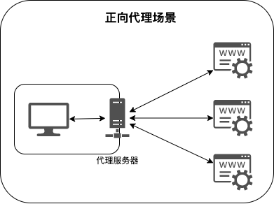
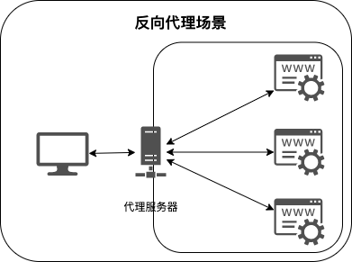

# 代理实验

> 注 : 笔记中拓扑图 xmind 源文件在其图片目录下

---

## 免责声明

`本文档仅供学习和研究使用,请勿使用文中的技术源码用于非法用途,任何人造成的任何负面影响,与本人无关.`

---

**相关文章**
- [终于有人把正向代理和反向代理解释的明明白白了！](https://cloud.tencent.com/developer/article/1418457)
- [谈谈我所了解的WEB代理](https://www.freebuf.com/articles/web/181723.html)
- [红队第9篇：给任意java程序挂Socks5代理方法](https://mp.weixin.qq.com/s/pVAZvKADFVwPOC4CwrCooQ)

**相关利用案例**
- [代理配置不当](../../Web安全/Web_Generic/Web_Generic.md#代理配置不当)

---

## 正向代理

正向代理（forward proxy）：是一个位于客户端和目标服务器之间的服务器(代理服务器)，为了从目标服务器取得内容，客户端向代理服务器发送一个请求并指定目标，然后代理服务器向目标服务器转交请求并将获得的内容返回给客户端。

这种代理其实在生活中是比较常见的，比如访问外国网站技术，其用到的就是代理技术。

有时候，用户想要访问某国外网站，该网站无法在国内直接访问，但是我们可以访问到一个代理服务器，这个代理服务器可以访问到这个国外网站。这样呢，用户对该国外网站的访问就需要通过代理服务器来转发请求，并且该代理服务器也会将请求的响应再返回给用户。这个上网的过程就是用到了正向代理。

所以，正向代理，其实是"代理服务器"代理了"客户端"，去和"目标服务器"进行交互。



---

### 代理池

**相关工具**
- [kitabisa/mubeng](https://github.com/kitabisa/mubeng) - An incredibly fast proxy checker & IP rotator with ease.

**相关资源**
- [zu1k/proxypool](https://github.com/zu1k/proxypool)
- [safe6Sec/proxyServer](https://github.com/safe6Sec/proxyServer)
- [Mustard404/Auto_proxy](https://github.com/Mustard404/Auto_proxy) - 利用IP地址池进行自动切换Http代理，防止IP封禁。
- [sh3d0ww01f/WaterDragon](https://github.com/sh3d0ww01f/WaterDragon) - 用GithubAction实现代理功能,一次一个ip

**相关文章**
- [说说代理池](https://xz.aliyun.com/t/7718)
- [红狗利器：IP代理池](https://www.freebuf.com/sectool/332623.html)

#### 云函数实现代理池
- [浅谈云函数的利用面](https://xz.aliyun.com/t/9502)
- [shimmeris/SCFProxy](https://github.com/shimmeris/SCFProxy/) - 一个利用云函数实现各种功能的工具
- [利用腾讯云函数搭建免费代理池(搭建过程)](https://www.freebuf.com/sectool/332903.html)
- [利用云函数搭建免费代理池](https://www.cnblogs.com/supdon/p/15099742.html)

### clash

**相关文章**
- [用 Clash 做代理](https://maintao.com/2021/use-clash-as-a-proxy/)
- [Clash实现IP秒级切换(含简易源码分析)](https://segmentfault.com/a/1190000040828310)
- [Clash 学习（四）在 Clash 中配置使用 HTTP 协议或 SOCKS5 协议的节点](https://senjianlu.com/2021/11/clash-note-04/)

### proxifier

**官网地址**
- https://www.proxifier.com/

windows 下推荐

### proxychains-ng

**项目地址**
- https://github.com/rofl0r/proxychains-ng

mac/linux 下推荐

可用 f8x 进行安装
```bahs
wget -O f8x https://f8x.io/
bash f8x -p
```

也可自行编译安装
```bash
git clone https://github.com/rofl0r/proxychains-ng.git
cd proxychains-ng
./configure
make && make install
cp ./src/proxychains.conf /etc/proxychains.conf
cd .. && rm -rf proxychains-ng
```

### ss5

- [ss5](../../../../Integrated/Linux/Power-Linux.md#ss5)

---

## 反向代理

反向代理（reverse proxy）：是指以代理服务器来接受 internet 上的连接请求，然后将请求转发给内部网络上的服务器，并将从服务器上得到的结果返回给 internet 上请求连接的客户端，此时代理服务器对外就表现为一个反向代理服务器。

对于常用的场景，就是在 Web 开发中用到的负载均衡服务器，客户端发送请求到负载均衡服务器上，负载均衡服务器再把请求转发给一台真正的服务器来执行，再把执行结果返回给客户端。



### nginx

**官网地址**
- https://www.nginx.com/

**安装方式**

linux 安装方式见如下链接🔗
- [nginx安装](../../../../Integrated/Linux/Power-Linux.md#nginx)

### frp

- [frp](../../../安全工具/frp.md)

### nps

- [nps](../../../安全工具/nps.md)
