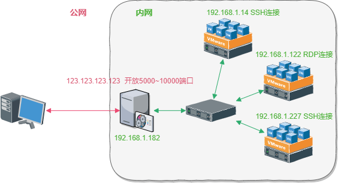
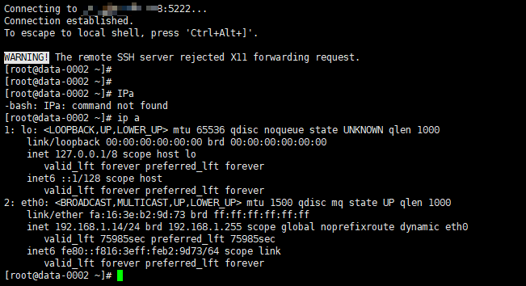
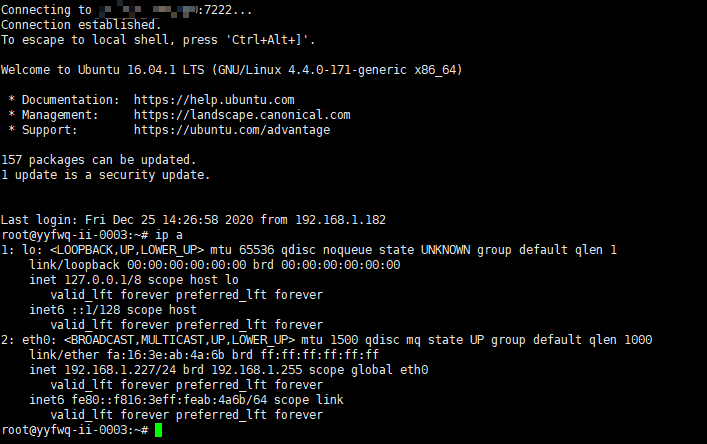

# 端口转发实验

---

## 免责声明

`本文档仅供学习和研究使用,请勿使用文中的技术源码用于非法用途,任何人造成的任何负面影响,与本人无关.`

---

## 正向转发

### Windows


---

### Linux

#### 利用 Iptable 进行端口转发

拓扑环境如下：



内网有4台机器,其中一台有公网IP,外网连接公网机器指定端口访问相应内网机器
```
192.168.1.182:5222  <==>    192.168.1.14:22
192.168.1.182:6389  <==>    192.168.1.122:3389
192.168.1.182:7222  <==>    192.168.1.227:22
```

这里采用 Iptable 进行转发
```bash
echo 1 >/proc/sys/net/ipv4/ip_forward   # 开启转发功能
```

添加转发规则
```bash
iptables -t nat -A PREROUTING -p tcp -d 192.168.1.182 --dport 5222 -j DNAT --to-destination 192.168.1.14:22
iptables -t nat -A POSTROUTING -p tcp -d 192.168.1.14 --dport 22 -j SNAT --to-source 192.168.1.182

iptables -t nat -A PREROUTING -p tcp -d 192.168.1.182 --dport 6389 -j DNAT --to-destination 192.168.1.122:3389
iptables -t nat -A POSTROUTING -p tcp -d 192.168.1.122 --dport 3389 -j SNAT --to-source 192.168.1.182

iptables -t nat -A PREROUTING -p tcp -d 192.168.1.182 --dport 7222 -j DNAT --to-destination 192.168.1.227:22
iptables -t nat -A POSTROUTING -p tcp -d 192.168.1.227 --dport 22 -j SNAT --to-source 192.168.1.182

iptables -L -t nat --line-number
```

测试连接






维护规则
```bash
iptables-save > /etc/iptables.up.rules      # 保存规则
iptables-restore < /etc/iptables.up.rules   # 恢复规则
iptables -F -t nat                          # 清除规则
```

#### 利用 rinetd 进行端口转发


---

## 反向转发


