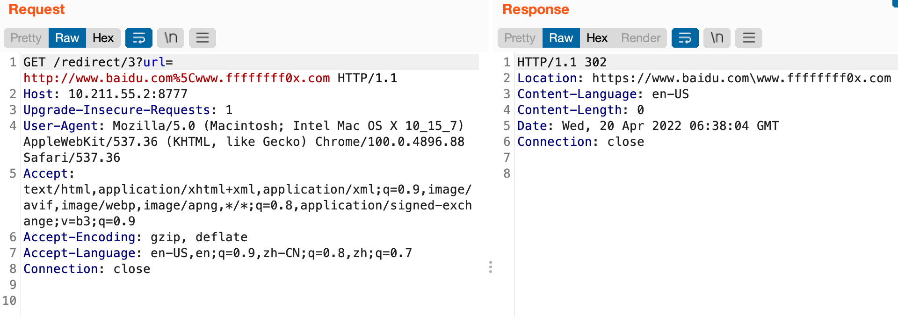

# JAVA代码审计

---

## 免责声明

`本文档仅供学习和研究使用,请勿使用文中的技术源码用于非法用途,任何人造成的任何负面影响,与本人无关.`

---

**相关文章**
- [一次从内网到外网，黑盒到白盒的批量挖洞经历](http://www.0dayhack.net/index.php/1957/)
- [java审计基础](https://mp.weixin.qq.com/s/cHMNjKDSjK5aSoMHjRWUcg)
- [简单java代码审计？](https://mp.weixin.qq.com/s/88Tsr8NBX03sFlG1Vfz-aw)
- [代码审计_Sylon的博客-CSDN博客_代码审计](https://blog.csdn.net/qq_41770175/article/details/93486383)
- [记一次对“天猫”商城系统的漏洞挖掘](https://mp.weixin.qq.com/s/fNAis5Da9ae2OI3ZUJ9zjw)
- [【Java 代码审计入门-01】审计前的准备](https://www.cnpanda.net/codeaudit/588.html)
- [ofCMS代码审计](https://xz.aliyun.com/t/10509)

**相关资源**
- [Cryin/JavaID](https://github.com/Cryin/JavaID) - java source code static code analysis and danger function identify prog
- [j3ers3/Hello-Java-Sec](https://github.com/j3ers3/Hello-Java-Sec) - ☕️ Java Security，安全编码和代码审计
- [JoyChou93/java-sec-code](https://github.com/JoyChou93/java-sec-code) - Java web common vulnerabilities and security code which is base on springboot and spring security
- [cn-panda/JavaCodeAudit](https://github.com/cn-panda/JavaCodeAudit) - Getting started with java code auditing 代码审计入门的小项目
- [proudwind/javasec_study](https://github.com/proudwind/javasec_study)
- [javaweb-rasp/javaweb-vuln](https://github.com/javaweb-rasp/javaweb-vuln) - RASP 测试靶场
- [ffffffff0x/JVWA](https://github.com/ffffffff0x/JVWA) - java 代码审计学习靶场

---

## 硬编码

**通用关键词**
- [APIkey/密钥信息通用关键词](../../信息收集/信息收集.md#通用关键词)

---

## JAVA反序列化

- [JAVA反序列化](./JAVA反序列化.md)

---

## SPel注入

- [SpEL注入](./SpEL注入.md)

---

## Autobinding

**描述**

Autobinding-自动绑定漏洞，根据不同语言/框架，该漏洞有几个不同的叫法，如下：

* Mass Assignment: Ruby on Rails, NodeJS
* Autobinding: Spring MVC, ASP.NET MVC
* Object injection: PHP(对象注入、反序列化漏洞)

软件框架有时允许开发人员自动将 HTTP 请求参数绑定到程序代码变量或对象中，从而使开发人员更容易地使用该框架。这里攻击者就可以利用这种方法通过构造 http 请求，将请求参数绑定到对象上，当代码逻辑使用该对象参数时就可能产生一些不可预料的结果。

**相关文章**
- [【技术分享】自动绑定漏洞和Spring MVC](https://www.anquanke.com/post/id/86278)
- [自动绑定漏洞](https://blog.csdn.net/qq_34101364/article/details/109732337)
- [Spring MVC Autobinding漏洞实例初窥](https://xz.aliyun.com/t/1089)

**漏洞示例**

示例代码以 [ZeroNights-HackQuest-2016](https://github.com/GrrrDog/ZeroNights-HackQuest-2016) 的 demo 为例，把示例中的 justiceleague 程序运行起来，可以看到这个应用菜单栏有 about，reg，Sign up，Forgot password 这 4 个页面组成。我们关注的点是密码找回功能，即怎么样绕过安全问题验证并找回密码。

1）首先看 reset 方法，把不影响代码逻辑的删掉。这样更简洁易懂：

```java
@Controller
@SessionAttributes("user")
public class ResetPasswordController {

private UserService userService;
...
@RequestMapping(value = "/reset", method = RequestMethod.POST)
public String resetHandler(@RequestParam String username, Model model) {
		User user = userService.findByName(username);
		if (user == null) {
			return "reset";
		}
		model.addAttribute("user", user);
		return "redirect: resetQuestion";
	}
}
```

这里从参数获取 username 并检查有没有这个用户，如果有则把这个 user 对象放到 Model 中。因为这个 Controller 使用了 `@SessionAttributes("user")`，所以同时也会自动把 user 对象放到 session 中。然后跳转到 resetQuestion 密码找回安全问题校验页面。

2）resetQuestion 密码找回安全问题校验页面有 `resetViewQuestionHandler` 这个方法展现

```java
@RequestMapping(value = "/resetQuestion", method = RequestMethod.GET)
	public String resetViewQuestionHandler(@ModelAttribute User user) {
		logger.info("Welcome resetQuestion ! " + user);
		return "resetQuestion";
	}
```

这里使用了 `@ModelAttribute User user`，实际上这里是从 session 中获取 user 对象。但存在问题是如果在请求中添加 user 对象的成员变量时则会更改 user 对象对应成员的值。
所以当我们给 resetQuestionHandler 发送 GET 请求的时候可以添加 “answer=hehe” 参数，这样就可以给 session 中的对象赋值，将原本密码找回的安全问题答案修改成“hehe”。这样在最后一步校验安全问题时即可验证成功并找回密码

**审计函数**

这种漏洞一般在比较多步骤的流程中出现，比如转账、找密等场景，也可重点留意几个注解如下：

```
@SessionAttributes
@ModelAttribute
...
```

更多信息可参考[Spring MVC Autobinding漏洞实例初窥](https://xianzhi.aliyun.com/forum/topic/1089/)

**修复方案**

Spring MVC 中可以使用 @InitBinder 注解，通过 WebDataBinder 的方法 setAllowedFields、setDisallowedFields 设置允许或不允许绑定的参数。

---

## SSRF

**描述**

相对于 php，在 java 中 SSRF 的利用局限较大，一般利用 http 协议来探测端口，利用 file 协议读取任意文件。常见的类中如 HttpURLConnection，URLConnection，HttpClients 中只支持 sun.net.www.protocol (java 1.8) 里的所有协议: http，https，file，ftp，mailto，jar，netdoc。

**相关文章**
- [SSRF in JAVA](https://joychou.org/java/javassrf.html)
- [九维团队-绿队（改进）| Java代码审计之SSRF](https://mp.weixin.qq.com/s/bF7wJpbN4BmvT8viWGW7hw)

**漏洞示例**

此处以 HttpURLConnection 为例，示例代码片段如下:

```java
String url = request.getParameter("picurl");
StringBuffer response = new StringBuffer();

URL pic = new URL(url);
HttpURLConnection con = (HttpURLConnection) pic.openConnection();
con.setRequestMethod("GET");
con.setRequestProperty("User-Agent", "Mozilla/5.0");
BufferedReader in = new BufferedReader(new InputStreamReader(con.getInputStream()));
String inputLine;
while ((inputLine = in.readLine()) != null) {
     response.append(inputLine);
}
in.close();
modelMap.put("resp",response.toString());
return "getimg.htm";
```

URLConnection类
```java
//urlConnection ssrf vul
String url = request.getParameter("url");
URL u = new URL(url);
URLConnection urlConnection = u.openConnection();
BufferedReader in = new BufferedReader(new InputStreamReader(urlConnection.getInputStream())); //发起请求,触发漏洞
String inputLine;
StringBuffer html = new StringBuffer();
while ((inputLine = in.readLine()) != null) {
     html.append(inputLine);
}
System.out.println("html:" + html.toString());
in.close();
```

ImageIO类
```java
// ImageIO ssrf vul
String url = request.getParameter("url");
URL u = new URL(url);
BufferedImage img = ImageIO.read(u); // 发起请求,触发漏洞
```

其他类
```java
// Request漏洞示例
String url = request.getParameter("url");
return Request.Get(url).execute().returnContent().toString();//发起请求

// openStream漏洞示例
String url = request.getParameter("url");
URL u = new URL(url);
inputStream = u.openStream();  //发起请求


// OkHttpClient漏洞示例
String url = request.getParameter("url");
OkHttpClient client = new OkHttpClient();
com.squareup.okhttp.Request ok_http = new com.squareup.okhttp.Request.Builder().url(url).build();
client.newCall(ok_http).execute();  //发起请求

// HttpClients漏洞示例
String url = request.getParameter("url");
CloseableHttpClient client = HttpClients.createDefault();
HttpGet httpGet = new HttpGet(url);
HttpResponse httpResponse = client.execute(httpGet); //发起请求
```

**审计函数**

Java 中能发起网络请求的类：
- HttpClient 类
- HttpURLConnection 类
- URLConnection 类
- URL 类
- OkHttp 类
- ImageIO 类
- Request 类 (Request 是对 HttpClient 类进行了封装的类，类似于 Python 的 requests 库。)

其中，仅支持 HTTP/HTTPS 协议的类（即类名或封装的类名带 http）：
- HttpClient 类
- HttpURLConnection 类
- OkHttp 类
- Request 类

支持 sun.net.www.protocol 所有协议的类：
- URLConnection 类
- URL 类
- ImageIO 类

程序中发起 HTTP 请求操作一般在获取远程图片、页面分享收藏等业务场景, 在代码审计时可重点关注一些 HTTP 请求操作函数，如下：

```
HttpClient.execute
HttpClient.executeMethod
HttpURLConnection.connect
HttpURLConnection.getInputStream
URL.openStream
URLConnection.getInputStream
Request.Get.execute
Request.Post.execute
ImageIO.read
OkHttpClient.newCall.execute
HttpServletRequest
BasicHttpRequest
```

**搜索正则**
```
HttpClient\.execute|HttpClient\.executeMethod|HttpURLConnection\.connect|HttpURLConnection\.getInputStream|URL\.openStream
```

**更多内容**
- [SSRF](../../Web安全/Web_Generic/SSRF.md)

---

## SQLi

**相关文章**
- [【Java 代码审计入门-02】SQL 漏洞原理与实际案例介绍](https://www.cnpanda.net/codeaudit/600.html)
- [简单谈一谈 Java 中的预编译](https://www.cnpanda.net/sec/589.html)

**漏洞示例**

以 Mybatis 为例

```sql
select * from books where id= ${id}
```

**修复方案**

Mybatis 框架 SQL 语句安全写法应使用 `#{}` , 避免使用动态拼接形式 `${}`。安全写法如下:

```sql
select * from books where id= #{id}
```

使用预编译，也可以预防 SQL 注入，例如
```java
public UserInfo UserInfoFoundDao(String id){

            Connection conn = null;
            PreparedStatement ps = null;
            ResultSet rs = null;
            UserInfo userinfo = null;
            try{
                Class.forName("com.mysql.cj.jdbc.Driver");
                conn = DriverManager.getConnection("jdbc:mysql://localhost:3306/sql","root","root");
                String sql = "select * from userinfo where id = ?";
                ps = conn.prepareStatement(sql);

                ps.setInt(1,id);

                rs = ps.executeQuery();

                while(rs.next()){
                    userinfo = new UserInfo();
                    userinfo.setId(rs.getString("id"));
                    userinfo.setName(rs.getString("name"));
                    userinfo.setAge(rs.getInt("age"));
                    userinfo.setContent(rs.getString("content"));
                    userinfo.setAddress(rs.getString("address"));
                }
                ...

            return userinfo;
        }
}
```

**搜索正则**
```
Mybatis
order by \$\{.*\}|like \$\{.*\}
\$\{.*\}
```

**更多内容**
- [SQLi](../../Web安全/Web_Generic/SQLi.md)

---

## SSTI

**相关文章**
- [从ofcms的模板注入漏洞（CVE-2019-9614）浅析SSTI漏洞](https://blog.csdn.net/Alexz__/article/details/116400913)
- [服务器端模版注入SSTI分析与归纳](https://tttang.com/archive/1412/)

**更多内容**
- [SSTI](../../Web安全/Web_Generic/SSTI.md)

### FreeMarker SSTI

**描述**

模板文件存放在 Web 服务器上，当访问指定模版文件时， FreeMarker 会动态转换模板，用最新的数据内容替换模板中 `${...}` 的部分，然后返回渲染结果。

**FreeMarker 基础**
- [FreeMarker](../../../../Develop/Java/笔记/Web/模版引擎/FreeMarker.md)

**FreeMarker SSTI POC**
```
<#assign value="freemarker.template.utility.Execute"?new()>${value("calc.exe")}
<#assign value="freemarker.template.utility.Execute"?new()>${value("open /Applications/Calculator.app")}
<#assign value="freemarker.template.utility.Execute"?new()>${value("id")}
<#assign value="freemarker.template.utility.ObjectConstructor"?new()>${value("java.lang.ProcessBuilder","calc.exe").start()}
<#assign value="freemarker.template.utility.JythonRuntime"?new()><@value>import os;os.system("calc.exe")</@value>
```

### Velocity SSTI


### Thymeleaf SSTI

**描述**

Thymeleaf 具有预处理表达式的功能，预处理是在正常表达式之前完成的表达式的执行，允许修改最终将执行的表达式。

预处理的表达式与普通表达式完全一样，但被双下划线符号（如 `__${expression}__` ）包围。

预处理可以解析执行表达式，也就是说找到一个可以控制预处理表达式的地方，让其解析执行我们的 payload 即可达到任意代码执行

**Thymeleaf 基础**
- [Thymeleaf](../../../../Develop/Java/笔记/Web/模版引擎/Thymeleaf.md)

**相关文章**
- [Thymeleaf 模板漏洞分析](http://x2y.pw/2020/11/15/Thymeleaf-%E6%A8%A1%E6%9D%BF%E6%BC%8F%E6%B4%9E%E5%88%86%E6%9E%90/)
- [Java安全之Thymeleaf SSTI分析](https://www.anquanke.com/post/id/254519)

**调试样本**
- https://github.com/hex0wn/learn-java-bug/tree/master/thymeleaf-ssti

**thymeleaf SSTI POC**

其实就是 SpEL 注入的 payload
```
${T(java.lang.Runtime).getRuntime().exec("open -a Calculator")}
```

---

## 文件上传漏洞

**相关文章**
- [Java文件上传漏洞](https://zhuanlan.zhihu.com/p/431392700)

**漏洞示例**

此处以 MultipartFile 为例，示例代码片段如下:

```java
    public String vul1(@RequestPart MultipartFile file) throws IOException {
        String fileName = file.getOriginalFilename();
        String filePath = path + fileName;
        File dest = new File(filePath);
        Files.copy(file.getInputStream(), dest.toPath());
        return "文件上传成功 : " + dest.getAbsolutePath();
    }
```

这里没有对后缀名做检测,同时还存在路径穿越漏洞,攻击者可以直接写计划任务到 /etc/cron.d/ 目录下

**审计函数**
```
MultipartFile
newStandardMultipartFile
getOriginalFilename
```

**搜索正则**
```
file\.getOriginalFilename\(\)|文件上传|文件|上传|uploadfile|upload
```

**更多内容**
- [文件上传漏洞](../../Web安全/Web_Generic/Upload.md)

### getOriginalFilename()

**描述**

在使用 SpringBoot 中当没有自己手动配置的情况下默认使用的是 StandardMultipartFile. 在这种情况下直接通过 getOriginalFilename 方法获取文件名后，不进行处理就使用会造成目录穿越漏洞。

- https://docs.spring.io/spring-framework/docs/current/javadoc-api/org/springframework/web/multipart/MultipartFile.html#getOriginalFilename--

如果配置了使用 CommonsMultipartFile 的 getOriginalFilename 方法对文件名进行了处理,在 windows 可以使用 `../..\\..\\` 绕过造成目录穿越漏洞,官方在 Spring >= 4.1.9.RELEASE 修复该问题.
- https://github.com/spring-projects/spring-framework/releases/tag/v4.1.9.RELEASE

**相关文章**
- [原创 | 浅谈Springboot中的文件上传](https://mp.weixin.qq.com/s/wPgdnyv57qBwkHV0O60xIA)
- [Spring MultipartFile 文件上传的潜在威胁](https://forum.butian.net/share/815)

**相关的 issue**
- https://github.com/spring-projects/spring-framework/issues/18237
- https://github.com/spring-projects/spring-framework/issues/26299

---

## URL重定向

**漏洞示例**

示例代码片段如下:

```java
    public String vul(String url) {
        log.info(url);
        return"redirect:" + url;
    }
```

这里没有对传入的参数 url 做任何判断,直接进行了重定向

**审计函数**

java 程序中 URL 重定向的方法均可留意是否对跳转地址进行校验、重定向函数如下：

```
redirect:
sendRedirect
setHeader
forward
...
```

**搜索正则**
```
redirect\:|sendRedirect|setHeader|forward|getHost\(\)
```

**更多内容**
- [URL跳转漏洞](../../Web安全/Web_Generic/Web_Generic.md#URL跳转漏洞)

### getHost()

**相关文章**
- [任意URL跳转漏洞修复与JDK中getHost()方法之间的坑](https://cloud.tencent.com/developer/article/1420631)

**反斜杠绕过**

有些业务使用 java.net.URL 包中的 `getHost()` 方法获取了将要跳转 URL 的 host，判断 host 是否为目标域
```java
    @RequestMapping("/redirect/3")
    public String vul3(String url) {

        String host = "";
        try {
            host = new URL(url).getHost();
        } catch (MalformedURLException e) {
            e.printStackTrace();
        }
        if (host.endsWith(".ffffffff0x.com")){
            return"redirect:https://" + host;
        }else{
            return"redirect:/error";
        }
    }
```

`getHost()` 方法可以被反斜杠绕过，即 `?url=http://www.baidu.com%5Cwww.ffffffff0x.com` 会被代码认为是将要跳转到 ffffffff0x.com，而实际跳转到 www.baidu.com\www.ffffffff0x.com，最终还是跳到 www.baidu.com 的服务器。



**通过 # 井号绕过**

`getHost()` 方法的结果在不同 JDK 版本中对井号 #的处理结果不同，通常井号被用作页面锚点，对于 `https://www.aaa.com#www.bbb.com?x=123` 这个 URL，较高版本的 JDK 中，取出结果为 `www.aaa.com`，低版本中为 `www.aaa.com#www.bbb.com`，从而低版本又可绕过 `endsWith(".bbb.com")` 方法，成功跳转。

比如 JDK1.8.0_221 对 '\' 可以绕过，'#' 不可以绕过。JDK1.6.0_45 '\' 和 '#' 都可以绕过.

---

## CSRF

**漏洞示例**

由于开发人员对 CSRF 的了解不足，错把 “经过认证的浏览器发起的请求” 当成 “经过认证的用户发起的请求”，当已认证的用户点击攻击者构造的恶意链接后就“被” 执行了相应的操作。例如，一个博客删除文章是通过如下方式实现的：

```
GET http://blog.com/article/delete.jsp?id=102
```

当攻击者诱导用户点击下面的链接时，如果该用户登录博客网站的凭证尚未过期，那么他便在不知情的情况下删除了 id 为 102 的文章，简单的身份验证只能保证请求发自某个用户的浏览器，却不能保证请求本身是用户自愿发出的。

**漏洞审计**

此类漏洞一般都会在框架中解决修复，所以在审计 csrf 漏洞时。首先要熟悉框架对 CSRF 的防护方案，一般审计时可查看增删改请求重是否有 token、formtoken 等关键字以及是否有对请求的 Referer 有进行校验。手动测试时, 如果有 token 等关键则替换 token 值为自定义值并重放请求，如果没有则替换请求 Referer 头为自定义链接或置空。重放请求看是否可以成功返回数据从而判断是否存在 CSRF 漏洞。

**更多内容**
- [CSRF](../../Web安全/Web_Generic/Web_Generic.md#CSRF)

---

## 命令执行

**漏洞示例**

此处以 getRuntime 为例，示例代码片段如下:

```java
String cmd = request.getParameter("cmd");
Runtime.getRuntime().exec(cmd);
```

**审计函数**

这种漏洞原理上很简单，重点是找到执行系统命令的函数，看命令是否可控。在一些特殊的业务场景是能判断出是否存在此类功能，这里举个典型的实例场景, 有的程序功能需求提供网页截图功能，笔者见过多数是使用 phantomjs 实现，那势必是需要调用系统命令执行 phantomjs 并传参实现截图。而参数大多数情况下应该是当前 url 或其中获取相关参数，此时很有可能存在命令执行漏洞，还有一些其它比较特别的场景可自行脑洞。

java 程序中执行系统命令的函数如下：

```
Runtime.exec
ProcessBuilder.start
GroovyShell.evaluate
...
```

**搜索正则**
```
Runtime\.exec|ProcessBuilder\.start|GroovyShell\.evaluate
```

**更多内容**
- [命令执行](../../Web安全/Web_Generic/RCE.md)

---

## 权限控制

**描述**

越权漏洞可以分为水平、垂直越权两种,程序在处理用户请求时未对用户的权限进行校验，使的用户可访问、操作其他相同角色用户的数据，这种情况是水平越权；如果低权限用户可访问、操作高权限用户则的数据，这种情况为垂直越权。

**漏洞示例**

```java
@RequestMapping(value="/getUserInfo",method = RequestMethod.GET)
public String getUserInfo(Model model, HttpServletRequest request) throws IOException {
    String userid = request.getParameter("userid");
    if(!userid.isEmpty()){
        String info=userModel.getuserInfoByid(userid);
        return info;
    }
    return "";
}
```

**审计函数**

水平、垂直越权不需关注特定函数，只要在处理用户操作请求时查看是否有对当前登陆用户权限做校验从而确定是否存在漏洞

**修复方案**

获取当前登陆用户并校验该用户是否具有当前操作权限，并校验请求操作数据是否属于当前登陆用户，当前登陆用户标识不能从用户可控的请求参数中获取。

---

## 批量请求

**描述**

业务中经常会有使用到发送短信校验码、短信通知、邮件通知等一些功能，这类请求如果不做任何限制，恶意攻击者可能进行批量恶意请求轰炸，大量短信、邮件等通知对正常用户造成困扰，同时也是对公司的资源造成损耗。

除了短信、邮件轰炸等，还有一种情况也需要注意，程序中可能存在很多接口，用来查询账号是否存在、账号名与手机或邮箱、姓名等的匹配关系，这类请求如不做限制也会被恶意用户批量利用，从而获取用户数据关系相关数据。对这类请求在代码审计时可关注是否有对请求做鉴权、和限制即可大致判断是否存在风险。

**漏洞示例**

```java
@RequestMapping(value="/ifUserExit",method = RequestMethod.GET)
public String ifUserExit(Model model, HttpServletRequest request) throws IOException {
    String phone = request.getParameter("phone");
    if(! phone.isEmpty()){
        boolean ifex=userModel.ifuserExitByPhone(phone);
        if (!ifex)
            return "用户不存在";
    }
    return "用户已被注册";
}
```

**修复方案**

* 对同一个用户发起这类请求的频率、每小时及每天发送量在服务端做限制，不可在前端实现限制

---

## XXE

**漏洞示例**

此处以 org.dom4j.io.SAXReader 为例，仅展示部分代码片段：

```java
String xmldata = request.getParameter("data");
SAXReader sax = new SAXReader();
// 创建一个SAXReader对象
Document document = sax.read(new ByteArrayInputStream(xmldata.getBytes()));
// 获取document对象,如果文档无节点，则会抛出Exception提前结束
Element root = document.getRootElement(); //获取根节点
List rowList = root.selectNodes("//msg");
Iterator<?> iter1 = rowList.iterator();
if (iter1.hasNext()) {
    Element beanNode = (Element) iter1.next();
    modelMap.put("success",true);
    modelMap.put("resp",beanNode.getTextTrim());
}
...
```

**审计函数**

XML 解析一般在导入配置、数据传输接口等场景可能会用到，涉及到 XML 文件处理的场景可留意下 XML 解析器是否禁用外部实体，从而判断是否存在 XXE。部分 XML 解析接口如下：

```
javax.xml.parsers.DocumentBuilder
javax.xml.stream.XMLStreamReader
org.jdom.input.SAXBuilder
org.jdom2.input.SAXBuilder
javax.xml.parsers.SAXParser
org.dom4j.io.SAXReader
org.xml.sax.XMLReader
javax.xml.transform.sax.SAXSource
javax.xml.transform.TransformerFactory
javax.xml.transform.sax.SAXTransformerFactory
javax.xml.validation.SchemaFactory
javax.xml.bind.Unmarshaller
javax.xml.xpath.XPathExpression
...
```

**更多内容**
- [XXE](../../Web安全/Web_Generic/XXE.md)

---

## 第三方组件安全

**描述**

这个比较好理解，诸如 Struts2、不安全的编辑控件、XML 解析器以及可被其它漏洞利用的如 commons-collections:3.1 等第三方组件，这个可以在程序 pom 文件中查看是否有引入依赖。即便在代码中没有应用到或很难直接利用，也不应该使用不安全的版本，一个产品的周期很长，很难保证后面不会引入可被利用的漏洞点。

**相关工具**
- [墨菲安全](https://www.murphysec.com/)
    - https://github.com/murphysecurity/murphysec - 墨菲安全的 CLI 工具，用于在命令行检测指定目录代码的依赖安全问题，也可以基于 CLI 工具实现在 CI 流程的检测。

**修复方案**

* 使用最新或安全版本的第三方组件
