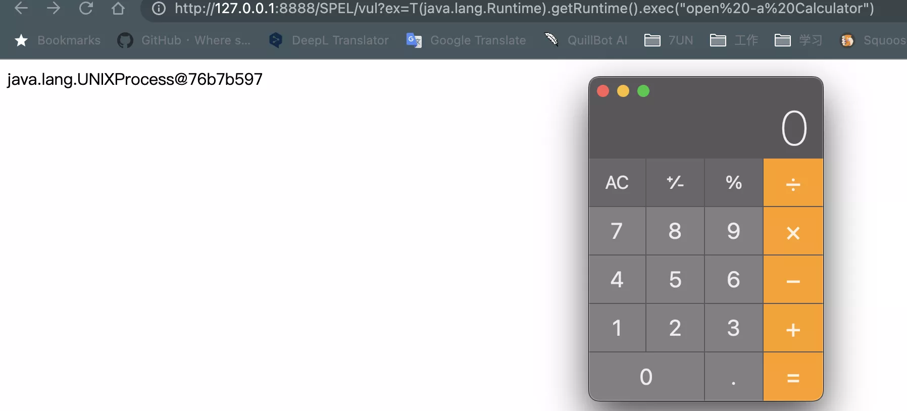

# SpEL 注入

---

## 免责声明

`本文档仅供学习和研究使用,请勿使用文中的技术源码用于非法用途,任何人造成的任何负面影响,与本人无关.`

---

**相关文章**
- [SpEL表达式注入漏洞总结](https://www.mi1k7ea.com/2020/01/10/SpEL%E8%A1%A8%E8%BE%BE%E5%BC%8F%E6%B3%A8%E5%85%A5%E6%BC%8F%E6%B4%9E%E6%80%BB%E7%BB%93/)
- [SPEL表达式注入-入门篇](https://www.kingkk.com/2019/05/SPEL%E8%A1%A8%E8%BE%BE%E5%BC%8F%E6%B3%A8%E5%85%A5-%E5%85%A5%E9%97%A8%E7%AF%87/)

---

## 什么是 SpEL 注入

Spring Expression Language（简称SpEL）是一种强大的表达式语言，支持在运行时查询和操作对象图。

语言语法类似于 Unified EL，但提供了额外的功能，特别是方法调用和基本的字符串模板功能。同时因为 SpEL 是以 API 接口的形式创建的，所以允许将其集成到其他应用程序和框架中。

当使用 SpelExpressionParser 解析 spel 表达式，且表达式可被外部控制，则可能导致 SPel 表达式注入从而造成 RCE.

---

## 漏洞代码示例

**示例1**

```java
@RequestMapping(path = "/elinjection")
public class SPelInjectionController {
    @RequestMapping(value="/spel.html",method= RequestMethod.GET)
    public String SPelInjection(ModelMap modelMap, HttpServletRequest request, HttpServletResponse response) throws IOException {
        String el=request.getParameter("el");
        //el="T(java.lang.Runtime).getRuntime().exec(\"open /Applications/Calculator.app\")";
        ExpressionParser PARSER = new SpelExpressionParser();
        Expression exp = PARSER.parseExpression(el);
        return (String)exp.getValue();
    }
}
```

**示例2**

```java
@GetMapping("/vul")
public String spelVul(String ex) {
    ExpressionParser parser = new SpelExpressionParser();
    String result = parser.parseExpression(ex).getValue().toString();
    System.out.println(result);
    return result;
}
```

直接将用户的输入当作表达式内容进行解析。

以示例2为例，是 Hello-Java-Sec 中的示例代码

输入一个简单的乘法运算 9*9，可以看到返回的值是经过解析后的 81


执行下系统命令
```
/vul?ex=T(java.lang.Runtime).getRuntime().exec(%22open%20-a%20Calculator%22)
```

> T(Type): 使用“T(Type)”来表示java.lang.Class实例，同样，只有 java.lang 下的类才可以省略包名



---

## 这个漏洞类型的案例

- [CVE-2018-1260 spring-security-oauth2 RCE Analysis](https://github.com/Cryin/Paper/blob/master/CVE-2018-1260%20spring-security-oauth2%20RCE%20Analysis.md)
- [CVE-2021-45029 Apache ShenYu Groovy&SpEL表达式注入漏洞分析与复现](https://mp.weixin.qq.com/s/SdNLthm5Ll3SnRhO0dGGgA)

---

## 修复方案

* 解析 el 表达式时，参数不要由外部用户输入
